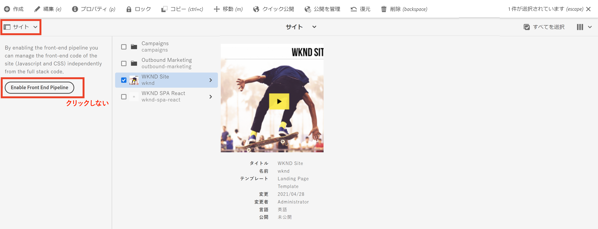

# フルスタック AEM プロジェクトを更新して、フロントエンドパイプラインを使用する {#update-project-enable-frontend-pipeline}

この章では、__WKND Sites プロジェクト__&#x200B;の設定を変更して、完全なフルスタックパイプラインの実行を要求するのではなく、フロントエンドパイプラインを使用して JavaScript と CSS をデプロイします。これにより、フロントエンドアーティファクトとバックエンドアーティファクトの開発とデプロイメントのライフサイクルを切り離し、より迅速で反復的な開発プロセス全体を実現することができます。

## 目的 {#objectives}

* フルスタックプロジェクトを更新してフロントエンドパイプラインを使用する

## フルスタック AEM プロジェクトの設定変更の概要

>[!VIDEO](https://video.tv.adobe.com/v/3409419?quality=12&learn=on)

## 前提条件 {#prerequisites}

これは複数のパートから成るチュートリアルで、[「ui.frontend」モジュール](./review-uifrontend-module.md)を確認済みであることを前提としています。


## フルスタック AEM プロジェクトの変更

テストを実行するには、プロジェクト関連の設定変更とスタイルの変更を 3 つ行う必要があります。そのため、WKND プロジェクトでは、フロントエンドパイプライン契約に対して設定を有効にするために、合計 4 つの具体的な変更が行われます。

1. `ui.frontend` フルスタックビルドサイクルからモジュールを削除

   * WKND サイトプロジェクトのルートの `pom.xml` で、`<module>ui.frontend</module>` サブモジュールエントリをコメントアウトします。

   ```xml
       ...
       <modules>
       <module>all</module>
       <module>core</module>
       <!--
       <module>ui.frontend</module>
       -->                
       <module>ui.apps</module>
       ...
   ```

   * `ui.apps/pom.xml` で、関連の依存関係もコメントアウトします

   ```xml
       ...
       <!-- ====================================================================== -->
       <!-- D E P E N D E N C I E S                                                -->
       <!-- ====================================================================== -->
           ...
       <!--
           <dependency>
               <groupId>com.adobe.aem.guides</groupId>
               <artifactId>aem-guides-wknd.ui.frontend</artifactId>
               <version>${project.version}</version>
               <type>zip</type>
           </dependency>
       -->    
       ...
   ```

1. 2 つの新規 webpack 設定ファイルを追加して、フロントエンドパイプライン契約の `ui.frontend` モジュールを準備します。

   * 既存の `webpack.common.js` を `webpack.theme.common.js` としてコピーし、`output` プロパティと `MiniCssExtractPlugin`、`CopyWebpackPlugin` プラグイン設定パラメーターを次のように変更します。

   ```javascript
   ...
   output: {
           filename: 'theme/js/[name].js', 
           path: path.resolve(__dirname, 'dist')
       }
   ...
   
   ...
       new MiniCssExtractPlugin({
               filename: 'theme/[name].css'
           }),
       new CopyWebpackPlugin({
           patterns: [
               { from: path.resolve(__dirname, SOURCE_ROOT + '/resources'), to: './clientlib-site' }
           ]
       })
   ...
   ```

   * 既存の `webpack.prod.js` を `webpack.theme.prod.js` としてコピーし、`common` 変数の場所を上記のファイルに次のように変更します

   ```javascript
   ...
       const common = require('./webpack.theme.common.js');
   ...
   ```

   >[!NOTE]
   >
   >上記の 2 つの「webpack」設定の変更では、出力ファイルとフォルダーの名前が異なるため、clientlib（フルスタック）とテーマ生成（フロントエンド）パイプラインフロントエンドアーティファクトは簡単に区別できます。
   >
   >上記の変更をスキップして既存の webpack 設定を使用することもできますが、以下の変更が必要です。
   >
   >名前の設定や整理の方法は、ユーザー次第です。


   * `package.json` ファイルで、`name` プロパティ値が `/conf` ノードのサイト名と同じであることを確認します。`scripts` プロパティの下には、このモジュールからフロントエンドファイルを構築する方法を説明する `build` スクリプトがあります。

   ```javascript
       {
       "name": "wknd",
       "version": "1.0.0",
       ...
   
       "scripts": {
           "build": "webpack --config ./webpack.theme.prod.js"
       }
   
       ...
       }
   ```

1. 2 つの Sling 設定を追加して、フロントエンドパイプライン用の `ui.content` モジュールを準備します。

   * `com.adobe.cq.wcm.core.components.config.HtmlPageItemsConfig` にファイルを作成します。これには、`ui.frontend` モジュールが webpack 構築プロセスを使用して `dist` フォルダーの下に生成するすべてのフロントエンドファイルが含まれます。

   ```xml
   ...
       <css
       jcr:primaryType="nt:unstructured"
       element="link"
       location="header">
       <attributes
           jcr:primaryType="nt:unstructured">
           <as
               jcr:primaryType="nt:unstructured"
               name="as"
               value="style"/>
           <href
               jcr:primaryType="nt:unstructured"
               name="href"
               value="/theme/site.css"/>
   ...
   ```

   >[!TIP]
   >
   >    詳しくは、__AEM WKND Sites プロジェクト__&#x200B;内の完全な [HtmlPageItemsConfig](https://github.com/adobe/aem-guides-wknd/blob/feature/frontend-pipeline/ui.content/src/main/content/jcr_root/conf/wknd/_sling_configs/com.adobe.cq.wcm.core.components.config.HtmlPageItemsConfig/.content.xml) を参照してください。


   * 次に `com.adobe.aem.wcm.site.manager.config.SiteConfig` の `themePackageName` 値が `package.json` と `name` プロパティ値と同じに、`siteTemplatePath` が `/libs/wcm/core/site-templates/aem-site-template-stub-2.0.0` スタブのパス値を指すようにします。

   ```xml
   ...
       <?xml version="1.0" encoding="UTF-8"?>
       <jcr:root xmlns:sling="http://sling.apache.org/jcr/sling/1.0" xmlns:jcr="http://www.jcp.org/jcr/1.0" xmlns:nt="http://www.jcp.org/jcr/nt/1.0"
               jcr:primaryType="nt:unstructured"
               siteTemplatePath="/libs/wcm/core/site-templates/aem-site-template-stub-2.0.0"
               themePackageName="wknd">
       </jcr:root>
   ...
   ```

   >[!TIP]
   >
   >    詳しくは、__AEM WKND Sites プロジェクト__&#x200B;内の完全な [SiteConfig](https://github.com/adobe/aem-guides-wknd/blob/feature/frontend-pipeline/ui.content/src/main/content/jcr_root/conf/wknd/_sling_configs/com.adobe.aem.wcm.site.manager.config.SiteConfig/.content.xml) を参照してください。

1. テスト実行のためにフロントエンドパイプラインを通じてデプロイするテーマまたはスタイルが変更されます。`ui.frontend/src/main/webpack/base/sass/_variables.scss` を更新し、`text-color` を Adobe red（または独自のものを選択可能）に変更しています。

   ```css
       $black:     #a40606;
       ...
   ```

最後に、これらの変更をプログラムの Adobegit リポジトリにプッシュします。


>[!AVAILABILITY]
>
> これらの変更は、__AEM WKND サイトプロジェクト__&#x200B;の&#x200B;[__フロントエンドパイプライン__](https://github.com/adobe/aem-guides-wknd/tree/feature/frontend-pipeline)ブランチ内にある GitHub で入手できます。


## 注意 - 「_フロントエンドパイプラインを有効にする_」ボタン

[パネルセレクター](https://experienceleague.adobe.com/docs/experience-manager-cloud-service/content/sites/authoring/getting-started/basic-handling.html?lang=ja)の「[サイト](https://experienceleague.adobe.com/docs/experience-manager-cloud-service/content/sites/authoring/getting-started/basic-handling.html?lang=ja)」オプションでサイトルートまたはサイトページを選択すると、「**フロントエンドパイプラインを有効にする**」ボタンが表示されます。「**フロントエンドパイプラインを有効にする**」ボタンをクリックすると、上記の **Sling 設定**&#x200B;が上書きされるので、Cloud Manager パイプラインを実行して上記の変更をデプロイした後は、**このボタンをクリックしないでください**。



誤ってクリックした場合は、パイプラインを再実行して、フロントエンドパイプライン契約と変更が復元されていることを確認します。

## おめでとうございます。 {#congratulations}

これで、WKND サイトプロジェクトが、フロントエンドパイプライン契約に対して有効になるように更新されました。

## 次の手順 {#next-steps}

次の章、[フロントエンドパイプラインを使用したデプロイ](create-frontend-pipeline.md)では、フロントエンドパイプラインを作成して実行し、「/etc.clientlibs」ベースのフロントエンドリソース配信からの&#x200B;__移動__&#x200B;方法を確認します。
