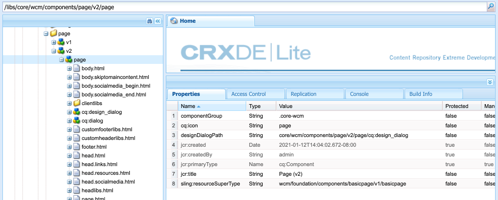

# ページとテンプレート{#pages-and-template}

この章では、基本ページコンポーネントと編集可能なテンプレートとの関係について説明します。 [AdobeXD](https://www.adobe.com/products/xd.html)のモックアップに基づいて、スタイル設定されていない記事テンプレートを作成します。 テンプレートの構築の過程で、コアコンポーネントと編集可能なテンプレートの高度なポリシー設定について説明します。

## 前提条件 {#prerequisites}

[ローカル開発環境](overview.md#local-dev-environment)の設定に必要なツールと手順を確認します。

### スタータープロジェクト

チュートリアルが構築する基本行コードを調べます。

1. [github.com/adobe/aem-guides-wknd](https://github.com/adobe/aem-guides-wknd)リポジトリをコピーします。
1. `pages-templates/start`ブランチを調べます。

   ```shell
   $ git clone git@github.com:adobe/aem-guides-wknd.git ~/code/aem-guides-wknd
   $ cd ~/code/aem-guides-wknd
   $ git checkout pages-templates/start
   ```

1. Mavenのスキルを使用して、ローカルAEMインスタンスにコードベースをデプロイします。

   ```shell
   $ cd ~/code/aem-guides-wknd
   $ mvn clean install -PautoInstallSinglePackage
   ```

終了したコードは、[GitHub](https://github.com/adobe/aem-guides-wknd/tree/pages-templates/solution)に常に表示できます。また、ブランチ`pages-templates/solution`に切り替えて、コードをローカルでチェックアウトすることもできます。

## 目的

1. Inspectは、Adobe XDで作成されたページデザインで、コアコンポーネントにマッピングします。
1. 編集可能なテンプレートの詳細と、ページコンテンツの詳細な制御を強制するためにポリシーを使用する方法を理解します。
1. テンプレートとページのリンク方法

## 作成する内容 {#what-you-will-build}

チュートリアルのこの部分では、新しい記事ページの作成と共通の構造との整合に使用できる新しい記事ページテンプレートを作成します。 記事ページテンプレートは、AdobeXDで作成されたデザインとUIキットに基づいて作成されます。 この章では、テンプレートの構造またはスケルトンの作成にのみ焦点を当てます。 スタイルは実装されませんが、テンプレートとページは機能します。


## Adobe XDとのUIの計画{#adobexd}

ほとんどの場合、モックアップと静的デザインを含む新しいWebサイト開始の作成を計画します。 [Adobe](https://www.adobe.com/products/xd.html) XDは、ユーザーエクスペリエンスを構築するデザインツールです。次に、UIキットとモックアップを調べ、記事ページテンプレートの構造の計画に役立ちます。

>[!VIDEO](https://video.tv.adobe.com/v/30214/?quality=12&learn=on)

[WKND記事デザインファイル](https://github.com/adobe/aem-guides-wknd/releases/download/aem-guides-wknd-0.0.2/AEM_UI-kit-WKND-article-design.xd)をダウンロードします。

## エクスペリエンスフラグメントを使用したヘッダーとフッターの作成{#experience-fragments}

ヘッダーやフッターなどのグローバルコンテンツを作成する場合、一般に、[エクスペリエンスフラグメント](https://docs.adobe.com/content/help/en/experience-manager-learn/sites/experience-fragments/experience-fragments-feature-video-use.html)を使用します。 エクスペリエンスフラグメントを使用すると、複数のコンポーネントを組み合わせて、1つの参照可能なコンポーネントを作成できます。 エクスペリエンスフラグメントには、複数サイトの管理をサポートする利点があり、ロケールごとに異なるヘッダー/フッターを管理できます。

次に、ヘッダーとフッターとして使用する予定のエクスペリエンスフラグメントを更新し、WKNDロゴを追加します。

>[!VIDEO](https://video.tv.adobe.com/v/30215/?quality=12&learn=on)

>[!NOTE]
>
> エクスペリエンスフラグメントの外観は、ビデオとは異なりますか？ これらを削除して、スタータープロジェクトコードベースを再インストールしてみてください。

以下は、上記のビデオで実行される高レベルの手順です。

1. [http://localhost:4502/editor.html/content/experience-fragments/wknd/us/en/site/header/master.html](http://localhost:4502/editor.html/content/experience-fragments/wknd/us/en/site/header/master.html)にあるエクスペリエンスフラグメントヘッダーを更新して、WKNDの暗いロゴを含めます。

   

   *WKNDダークロゴ*

1. [http://localhost:4502/editor.html/content/experience-fragments/wknd/us/en/site/footer/master.html](http://localhost:4502/editor.html/content/experience-fragments/wknd/us/en/site/footer/master.html)にあるエクスペリエンスフラグメントヘッダーを更新し、WKNDライトロゴを含めます。

   

   *WKNDライトロゴ*

## 記事ページテンプレートの作成

ページを作成するとき、テンプレートを選択する必要があります。これは新しいページを作成するための基本として使用されます。テンプレートは、結果のページ、初期コンテンツ、許可されるコンポーネントの構造を定義します。

[編集可能なテンプレート](https://docs.adobe.com/content/help/ja-JP/experience-manager-65/developing/platform/templates/page-templates-editable.html)には、主に3つの領域があります。

1. **構造**  — テンプレートの一部であるコンポーネントを定義します。コンテンツ作成者はこれらを編集できません。
1. **初期コンテンツ**  — テンプレートを開始するコンポーネントを定義します。コンテンツ作成者はこれらを編集または削除できます。
1. **ポリシー**  — コンポーネントの動作方法と作成者が使用できるオプションに関する設定を定義します。

次に、記事ページテンプレートを作成します。 これは、AEMのローカルインスタンスで発生します。

>[!VIDEO](https://video.tv.adobe.com/v/30217/?quality=12&learn=on)

以下は、上記のビデオで実行される高レベルの手順です。

1. WKND Sites Templateフォルダーに移動します。**ツール** > **一般** > **テンプレート** > **WKNDサイト**
1. **WKNDサイトの空のページ**&#x200B;テンプレートタイプを使用して、タイトルが&#x200B;**記事ページテンプレート**&#x200B;の新しいテンプレートを作成します
1. **構造**&#x200B;モードで、次の要素を含めるようにテンプレートを設定します。

   * エクスペリエンスフラグメントヘッダー
   * 画像
   * パンくず
   * コンテナ — 幅が8列のデスクトップ、幅が12列のタブレット、モバイル
   * コンテナ — 幅が4列、幅が12列のタブレット、モバイル
   * エクスペリエンスフラグメントフッター

   

   *構造 — 記事ページのテンプレート*

1. **初期コンテンツ**&#x200B;モードに切り替え、以下のコンポーネントをスターターコンテンツとして追加します。

   * **メインコンテナ**
      * タイトル — H1のデフォルトサイズ
      * タイトル — *&quot;作成者名&quot;*、サイズH4
      * テキスト — 空
   * **サイドコンテナ**
      * タイトル — *&quot;このストーリーを共有&quot;*、サイズH5
      * ソーシャルメディア共有
      * 区切り文字
      * ダウンロード
      * リスト

   

   *初期コンテンツ — 記事ページのテンプレート*

1. **初期ページプロパティ**&#x200B;を更新して、**Facebook**&#x200B;と&#x200B;**Pinterest**&#x200B;の両方でユーザー共有を有効にします。
1. 画像を簡単に識別できるように、**記事ページテンプレートの**&#x200B;プロパティに画像をアップロードします。

   

   *記事ページテンプレートのサムネール*

1. [WKNDサイトテンプレートフォルダー](http://localhost:4502/libs/wcm/core/content/sites/templates.html/conf/wknd/settings/wcm/templates)の&#x200B;**記事ページテンプレート**&#x200B;を有効にします。

## 記事ページの作成

テンプレートが完成したら、そのテンプレートを使用して新しいページを作成します。

1. 次のzipパッケージ[WKND-PagesTemplates-DAM-Assets.zip](assets/pages-templates/WKND-PagesTemplates-DAM-Assets.zip)をダウンロードし、[CRX Package Manager](http://localhost:4502/crx/packmgr/index.jsp)を使用してインストールします。

   上記のパッケージでは、後の手順で記事ページに入力するために`/content/dam/wknd/en/magazine/la-skateparks`の下に複数の画像とアセットをインストールします。

   *上記のパッケージ内の画像とアセットは、 [Unsplash.comの許可を得て、無料でライセンスを取得できます](https://unsplash.com/)。*

   

1. **WKND** > **US** > **en**&#x200B;の下に、**Magazine**&#x200B;という名前の新しいページを作成します。 **コンテンツページ**&#x200B;テンプレートを使用します。

   このページでは、サイトに構造が追加され、実行中の階層リンクコンポーネントを確認できます。

1. 次に、**WKND** > **US** > **en** > **Magazine**&#x200B;の下に新しいページを作成します。 **記事ページ**&#x200B;テンプレートを使用します。 **Ultimate guide to LA Skateparks**&#x200B;のタイトルと&#x200B;**guide-la-skateparks**&#x200B;の名前を使用します。

   

1. [UI Planningで検査したモックアップとAdobeXD](#adobexd)の部分が一致するように、ページにコンテンツを入力します。 サンプルの記事テキストは、[ここ](assets/pages-templates/la-skateparks-copy.txt)にダウンロードできます。 次のようなものを作成できるはずです。

   

   >[!NOTE]
   >
   > ページの上部にある画像コンポーネントは編集できますが、削除することはできません。 階層リンクコンポーネントはページに表示されますが、編集または削除はできません。

## Inspectノード構造{#node-structure}

この時点で、記事のページのスタイルは明確に解除されます。 ただし、基本構造は定められている。 次に、テンプレートの役割と、コンテンツのレンダリングを担当するページコンポーネントの役割を理解するために、記事ページのノード構造を見てみます。

これは、ローカルのAEMインスタンスでCRXDE-Liteツールを使用して行うことができます。

1. [CRXDE-Lite](http://localhost:4502/crx/de/index.jsp#/content/wknd/us/en/magazine/guide-la-skateparks/jcr%3Acontent)を開き、ツリーナビゲーションを使用して`/content/wknd/us/en/magazine/guide-la-skateparks`に移動します。

1. `la-skateparks`ページの下の`jcr:content`ノードをクリックし、次のプロパティを表示します。

   

   `cq:template`の値（`/conf/wknd/settings/wcm/templates/article-page`、先ほど作成した記事ページテンプレート）に注目してください。

   また、`sling:resourceType`の値（`wknd/components/structure/page`を指す）にも注意してください。 これは、AEMプロジェクトのアーキタイプによって作成されるページコンポーネントで、テンプレートに基づいてページをレンダリングします。

1. `/content/wknd/us/en/magazine/guide-la-skateparks/jcr:content`の下の`jcr:content`ノードを展開し、表示階層を示します。

   

   各ノードを、オーサリングされたコンポーネントに緩やかにマッピングできるはずです。 `responsivegrid`のプレフィックスが付いたノードを検査することで使用される様々なレイアウトコンテナを特定できるかどうかを確認してください。

1. 次に、`/apps/wknd/components/structure/page`にあるページコンポーネントを調べます。 CRXDE Lite内のコンポーネントプロパティの表示:

   

   ページコンポーネントは、**構造**&#x200B;という名前のフォルダーの下にあります。 これは、テンプレートエディターの構造モードに対応する規則で、ページコンポーネントが作成者が直接操作するものではないことを示すために使用されます。

   ページコンポーネントの下には、2つのHTLスクリプト（`customfooterlibs.html`と`customheaderlibs.html`）しかありません。 では、このコンポーネントはどのようにページをレンダリングするのか？

   `sling:resourceSuperType`プロパティと`core/wcm/components/page/v2/page`の値をメモしておきます。 このプロパティーを使用すると、WKNDのページコンポーネントがコアコンポーネントページコンポーネントのすべての機能を継承できます。 これは、[プロキシコンポーネントパターン](https://docs.adobe.com/content/help/en/experience-manager-core-components/using/developing/guidelines.html#ProxyComponentPattern)と呼ばれるものの最初の例です。詳しくは、[こちら](https://docs.adobe.com/content/help/en/experience-manager-core-components/using/developing/guidelines.html)を参照してください。。

1. WKNDコンポーネント内の別のコンポーネント`Breadcrumb`をInspectが配置している場所：`/apps/wknd/components/content/breadcrumb`. 同じ`sling:resourceSuperType`プロパティが見つかりますが、今回は`core/wcm/components/breadcrumb/v2/breadcrumb`を指すことに注意してください。 これは、Proxyコンポーネントパターンを使用してCoreコンポーネントを含める別の例です。 実際、WKNDコードベースのコンポーネントはすべて、AEMコアコンポーネントのプロキシです（当社の有名なHelloWorldコンポーネントを除く）。 カスタムコードを記述する前に、コアコンポーネントの機能をできるだけ多く&#x200B;*使用し直すことをお勧めします。*

1. 次に、次のCRXDE Liteを使用して、`/apps/core/wcm/components/page/v2/page`のコアコンポーネントページを調べます。

   

   このページの下には、さらに多くのスクリプトが含まれています。 コアコンポーネントページには多くの機能が含まれています。 この機能は、メンテナンスと読みやすさを容易にするために、複数のスクリプトに分割されています。 `page.html`を開き、`data-sly-include`を探すことで、HTLスクリプトを含めるかどうかを追跡できます。

   ```html
   <!--/* /apps/core/wcm/components/page/v2/page/page.html */-->
   <!DOCTYPE HTML>
   <html data-sly-use.page="com.adobe.cq.wcm.core.components.models.Page" lang="${page.language}"
           data-sly-use.head="head.html"
           data-sly-use.footer="footer.html"
           data-sly-use.redirect="redirect.html">
       <head data-sly-call="${head.head @ page = page}"></head>
       <body class="${page.cssClassNames}">
           <sly data-sly-test.isRedirectPage="${page.redirectTarget && (wcmmode.edit || wcmmode.preview)}"
               data-sly-call="${redirect.redirect @ redirectTarget = page.redirectTarget}"></sly>
           <sly data-sly-test="${!isRedirectPage}">
               <sly data-sly-include="body.socialmedia_begin.html"></sly>
               <sly data-sly-include="body.html"></sly>
               <sly data-sly-call="${footer.footer @ page = page}"></sly>
               <sly data-sly-include="body.socialmedia_end.html"></sly>
           </sly>
       </body>
   </html>
   ```

   HTLを複数のスクリプトに分割するもう1つの理由は、プロキシコンポーネントが、カスタムのビジネスロジックを実装する個々のスクリプトを上書きできるようにすることです。 HTLスクリプト`customfooterlibs.html`と`customheaderlibs.html`は、明示的な目的で作成され、プロジェクトの実装によって上書きされます。

   編集可能なテンプレートが[コンテンツページのレンダリングにどのように影響するかについては、この記事](https://docs.adobe.com/content/help/en/experience-manager-65/developing/platform/templates/page-templates-editable.html#resultant-content-pages)を参照して詳しく知ることができます。

1. `/apps/core/wcm/components/breadcrumb/v2/breadcrumb`の階層リンクのように、別のコアコンポーネントをInspectします。 `breadcrumb.html`スクリプトを表示して、階層リンクコンポーネントのマークアップが最終的にどのように生成されるかを理解します。

## ソース管理{#configuration-persistence}への構成の保存

多くの場合、特にAEMプロジェクトの最初に、テンプレートや関連するコンテンツポリシーなどの設定を保持してソース管理を行うことが重要です。 これにより、すべての開発者が同じコンテンツと設定のセットに対して作業を行い、環境間の一貫性を確保できます。 プロジェクトが一定の成熟度に達したら、テンプレートの管理方法をパワーユーザーの特別なグループに変えることができます。

ここでは、テンプレートを他のコードの部分と同様に扱い、プロジェクトの一部として&#x200B;**記事ページテンプレート**&#x200B;を下方向に同期します。 今までは、AEMプロジェクトからAEMのローカルインスタンスに&#x200B;**プッシュ**&#x200B;コードを持っていました。 **記事ページテンプレート**&#x200B;は、AEMのローカルインスタンスで直接作成されたものなので、**プル**&#x200B;するか、AEMプロジェクトにテンプレートをインポートする必要があります。 この目的のため、**ui.content**&#x200B;モジュールはAEMプロジェクトに含まれています。

次のいくつかの手順はEclipse IDEを使用して行われますが、**pull**&#x200B;に設定した任意のIDEを使用するか、AEMのローカルインスタンスからコンテンツをインポートすることができます。

1. Eclipse IDEで、サーバーにAEMのローカルインスタンスへの接続AEM開発者ツールプラグインが起動していること、および&#x200B;**ui.content**&#x200B;モジュールがサーバー設定に追加されていることを確認します。

   

1. プロジェクトエクスプローラーで&#x200B;**ui.content**&#x200B;モジュールを展開します。 `src`フォルダー（小さなグローブのアイコンが付いたフォルダー）を展開し、`/conf/wknd/settings/wcm/templates`に移動します。

1. [!UICONTROL 右+] ノードをクリックし、「サーバーから `templates` 読み込み。. ****:」を選択します。

   

   「**リポジトリからインポート**」ダイアログを確認し、「**完了**」をクリックします。 これで、`templates`フォルダーの下に`article-page-template`が表示されます。

1. コンテンツを読み込む手順を繰り返しますが、`/conf/wknd/settings/wcm/policies`にある&#x200B;**ポリシー**&#x200B;ノードを選択します。

   

1. `filter.xml`ファイルをInspect`src/main/content/META-INF/vault/filter.xml`に置きます。

   ```xml
   <!--ui.content filter.xml-->
   <?xml version="1.0" encoding="UTF-8"?>
   <workspaceFilter version="1.0">
       <filter root="/conf/wknd" mode="merge"/>
       <filter root="/content/wknd" mode="merge"/>
       <filter root="/content/dam/wknd" mode="merge"/>
       <filter root="/content/experience-fragments/wknd" mode="merge"/>
   </workspaceFilter>
   ```

   `filter.xml`ファイルは、パッケージと共にインストールされるノードのパスを識別します。 各フィルターの`mode="merge"`は、既存のコンテンツは変更されず、新しいコンテンツのみが追加されることを示しています。 コンテンツ作成者がこれらのパスを更新する可能性があるので、コードのデプロイメントではコンテンツを&#x200B;**上書きしない**&#x200B;ことが重要です。 フィルタ要素の操作の詳細については、[FileVaultドキュメント](https://jackrabbit.apache.org/filevault/filter.html)を参照してください。

   `ui.content/src/main/content/META-INF/vault/filter.xml`と`ui.apps/src/main/content/META-INF/vault/filter.xml`を比較して、各モジュールで管理される異なるノードを理解します。

   >[!WARNING]
   >
   > WKNDリファレンスサイトで一貫したデプロイを行うために、プロジェクトの一部のブランチがセットアップされ、`ui.content`によってJCRの変更が上書きされます。 これは、特定のポリシーに対してコード/スタイルが書き込まれるので、ソリューションの分岐などに対して設計されています。

## バリデーターが{#congratulations}

新しいテンプレートとページがAdobe Experience Manager Sitesに作成されました。

### 次の手順 {#next-steps}

この時点で、記事のページのスタイルは明確に解除されます。 [クライアント側ライブラリとフロントエンドワークフロー](client-side-libraries.md)のチュートリアルに従って、CSSとJavascriptを含めて、サイトにグローバルスタイルを適用し、専用のフロントエンドビルドを統合するベストプラクティスを学びます。

[GitHub](https://github.com/adobe/aem-guides-wknd)上の完了したコードを表示するか、Gitブラック`pages-templates/solution`上のローカルにコードを確認して展開します。

1. [github.com/adobe/aem-wknd-guides](https://github.com/adobe/aem-guides-wknd)リポジトリをコピーします。
1. `pages-templates/solution`ブランチを調べます。
