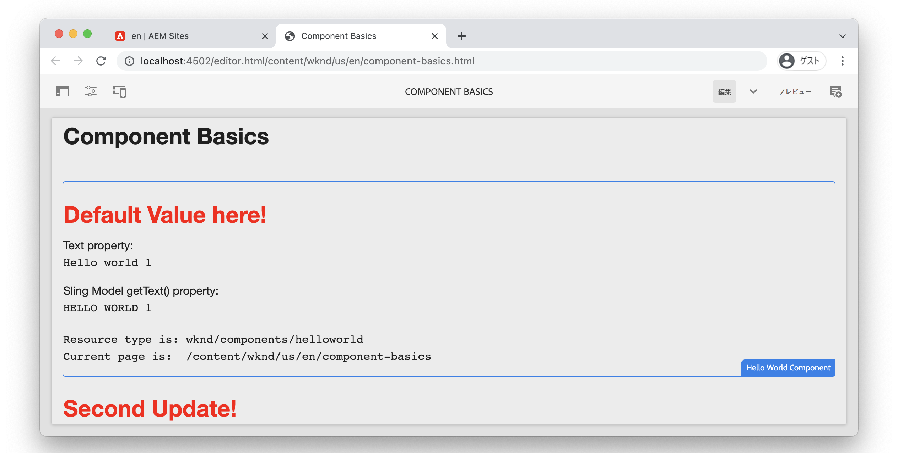

# コンポーネントの基本 {#component-basics}

この章では、Adobe Experience Manager(AEM)Sites コンポーネントの基盤となるテクノロジーを、シンプルなを使用して調べてみましょう `HelloWorld` 例： オーサリング、HTL、Sling モデル、クライアント側ライブラリのトピックを含め、既存のコンポーネントに小さな変更が加えられます。

## 前提条件 {#prerequisites}

設定に必要なツールと手順を確認します。 [ローカル開発環境](./overview.md#local-dev-environment).

ビデオで使用される IDE は次のとおりです。 [Visual Studio Code](https://code.visualstudio.com/) そして [VSCode AEM Sync](https://marketplace.visualstudio.com/items?itemName=yamato-ltd.vscode-aem-sync) プラグイン。

## 目的 {#objective}

1. HTL テンプレートと Sling モデルの役割を学習し、動的にテンプレートをレンダリングするHTMLを学びます。
1. コンテンツのオーサリングを容易にするためにダイアログがどのように使用されているかを理解します。
1. コンポーネントをサポートする CSS と JavaScript を含めるクライアント側ライブラリの基本について説明します。

## 作成する内容 {#what-build}

この章では、単純な `HelloWorld` コンポーネント。 を更新する際に、 `HelloWorld` コンポーネントについて、AEMコンポーネント開発の主な領域について学びます。

## チャプタースタータープロジェクト {#starter-project}

この章では、 [AEM Project Archetype](https://github.com/adobe/aem-project-archetype). 以下のビデオを見て、 [前提条件](#prerequisites) をクリックしてください。

>[!NOTE]
>
> 前の章を正常に完了した場合は、プロジェクトを再利用して、スタータープロジェクトをチェックアウトする手順をスキップできます。

>[!VIDEO](https://video.tv.adobe.com/v/330985?quality=12&learn=on)

新しいコマンドラインターミナルを開き、次の操作を実行します。

1. 空のディレクトリで、 [aem-guides-wknd](https://github.com/adobe/aem-guides-wknd) リポジトリ：

   ```shell
   $ git clone git@github.com:adobe/aem-guides-wknd.git --branch tutorial/component-basics-start --single-branch
   ```

   >[!NOTE]
   >
   > 必要に応じて、前の章で生成したプロジェクトを引き続き使用できます。 [プロジェクト設定](./project-setup.md).

1. 次に移動：  `aem-guides-wknd` フォルダー。

   ```shell
   $ cd aem-guides-wknd
   ```

1. 次のコマンドを使用して、プロジェクトをビルドし、AEMのローカルインスタンスにデプロイします。

   ```shell
   $ mvn clean install -PautoInstallSinglePackage
   ```

   >[!NOTE]
   >
   > AEM 6.5 または 6.4 を使用している場合、 `classic` 任意の Maven コマンドに対するプロファイル。

   ```shell
   $ mvn clean install -PautoInstallSinglePackage -Pclassic
   ```

1. 次の手順に従って、プロジェクトを優先 IDE に読み込みます。 [ローカル開発環境](overview.md#local-dev-environment).

## コンポーネントのオーサリング {#component-authoring}

コンポーネントは、Web ページの小さなモジュラー構成要素と考えることができます。 コンポーネントを再利用するには、コンポーネントを設定可能にする必要があります。 これは、オーサーダイアログを通じて実行します。 次に、単純なコンポーネントを作成し、ダイアログの値がAEMでどのように保持されるかを調べます。

>[!VIDEO](https://video.tv.adobe.com/v/330986?quality=12&learn=on)

上記のビデオで実行した大まかな手順を以下に示します。

1. という名前のページを作成します。 **コンポーネントの基本** 下 **WKND サイト** `>` **US** `>` **en**.
1. を **Hello World コンポーネント** を新しく作成されたページに追加します。
1. コンポーネントのダイアログを開き、テキストを入力します。 変更を保存して、ページに表示されるメッセージを確認します。
1. 開発者モードに切り替え、CRXDE-Lite でコンテンツパスを表示し、コンポーネントインスタンスのプロパティを調べます。
1. CRXDE-Lite を使用して、 `cq:dialog` および `helloworld.html` スクリプトから `/apps/wknd/components/content/helloworld`.

## HTL(HTMLテンプレート言語 ) とダイアログ {#htl-dialogs}

HTMLテンプレートの言語または **[HTL](https://experienceleague.adobe.com/docs/experience-manager-htl/content/getting-started.html)** は、コンテンツのレンダリングにAEMコンポーネントで使用される、軽量のサーバーサイドテンプレート言語です。

**ダイアログ** コンポーネントに対して作成可能な設定を定義します。

次に、 `HelloWorld` テキストメッセージの前に追加の挨拶文を表示する HTL スクリプト。

>[!VIDEO](https://video.tv.adobe.com/v/330987?quality=12&learn=on)

上記のビデオで実行した大まかな手順を以下に示します。

1. IDE に切り替え、次の場所に移動するプロジェクトを開きます。 `ui.apps` モジュール。
1. を開きます。 `helloworld.html` ファイルを編集し、[ マークアップHTML] を更新します。
1. 次のような IDE ツールを使用します。 [VSCode AEM Sync](https://marketplace.visualstudio.com/items?itemName=yamato-ltd.vscode-aem-sync) ファイルの変更をローカルのAEMインスタンスと同期します。
1. ブラウザーに戻り、コンポーネントのレンダリングが変更されたことを確認します。
1. を開きます。 `.content.xml` のダイアログを定義するファイル `HelloWorld` コンポーネント：

   ```plain
   <code>/aem-guides-wknd/ui.apps/src/main/content/jcr_root/apps/wknd/components/helloworld/_cq_dialog/.content.xml
   ```

1. ダイアログを更新して、という名前のテキストフィールドを追加します。 **タイトル** ～という名前で `./title`:

   ```xml
   <?xml version="1.0" encoding="UTF-8"?>
   <jcr:root xmlns:sling="http://sling.apache.org/jcr/sling/1.0" xmlns:cq="http://www.day.com/jcr/cq/1.0" xmlns:jcr="http://www.jcp.org/jcr/1.0" xmlns:nt="http://www.jcp.org/jcr/nt/1.0"
       jcr:primaryType="nt:unstructured"
       jcr:title="Properties"
       sling:resourceType="cq/gui/components/authoring/dialog">
       <content
           jcr:primaryType="nt:unstructured"
           sling:resourceType="granite/ui/components/coral/foundation/fixedcolumns">
           <items jcr:primaryType="nt:unstructured">
               <column
                   jcr:primaryType="nt:unstructured"
                   sling:resourceType="granite/ui/components/coral/foundation/container">
                   <items jcr:primaryType="nt:unstructured">
                       <title
                           jcr:primaryType="nt:unstructured"
                           sling:resourceType="granite/ui/components/coral/foundation/form/textfield"
                           fieldLabel="Title"
                           name="./title"/>
                       <text
                           jcr:primaryType="nt:unstructured"
                           sling:resourceType="granite/ui/components/coral/foundation/form/textfield"
                           fieldLabel="Text"
                           name="./text"/>
                   </items>
               </column>
           </items>
       </content>
   </jcr:root>
   ```

1. ファイルを再度開く `helloworld.html`: `HelloWorld` 下のパスのコンポーネント：

   ```plain
       <code>/aem-guides-wknd.ui.apps/src/main/content/jcr_root/apps/wknd/components/helloworld/helloworld.html
   ```

1. 更新 `helloworld.html` を **挨拶** の一部としてのテキストフィールド `H1` タグ：

   ```html
   <div class="cmp-helloworld" data-cmp-is="helloworld">
       <h1 class="cmp-helloworld__title">${properties.title}</h1>
       ...
   </div>
   ```

1. 開発者プラグインを使用するか、Maven スキルを使用して、AEMのローカルインスタンスに変更をデプロイします。

## Sling Model {#sling-models}

Sling モデルは、JCR から Java™変数へのデータのマッピングを容易にする注釈駆動の Java™ &quot;POJO&quot;(Plain Old Java™ Objects) です。 また、AEMのコンテキストで開発する際には、他のいくつかの点も提供されます。

次に、 `HelloWorldModel` Sling Model を使用して、JCR に格納された値にビジネスロジックを適用してから、ページに出力します。

>[!VIDEO](https://video.tv.adobe.com/v/330988?quality=12&learn=on)

1. ファイルを開きます。 `HelloWorldModel.java`:( `HelloWorld` コンポーネント。

   ```plain
   <code>/aem-guides-wknd.core/src/main/java/com/adobe/aem/guides/wknd/core/models/HelloWorldModel.java
   ```

1. 次の import 文を追加します。

   ```java
   import org.apache.commons.lang3.StringUtils;
   import org.apache.sling.models.annotations.DefaultInjectionStrategy;
   ```

1. を更新します。 `@Model` 使用する注釈 `DefaultInjectionStrategy`:

   ```java
   @Model(adaptables = Resource.class,
      defaultInjectionStrategy = DefaultInjectionStrategy.OPTIONAL)
      public class HelloWorldModel {
      ...
   ```

1. 次の行を `HelloWorldModel` コンポーネントの JCR プロパティの値をマッピングするクラス `title` および `text` を Java™変数に追加します。

   ```java
   ...
   @Model(adaptables = Resource.class,
   defaultInjectionStrategy = DefaultInjectionStrategy.OPTIONAL)
   public class HelloWorldModel {
   
       ...
   
       @ValueMapValue
       private String title;
   
       @ValueMapValue
       private String text;
   
       @PostConstruct
       protected void init() {
           ...
   ```

1. 次のメソッドを追加します。 `getTitle()` から `HelloWorldModel` クラス。 `title`. このメソッドは、「Default Value here!」の String 値を返すロジックを追加します。 プロパティが `title` が null または空白の場合：

   ```java
   /***
   *
   * @return the value of title, if null or blank returns "Default Value here!"
   */
   public String getTitle() {
       return StringUtils.isNotBlank(title) ? title : "Default Value here!";
   }
   ```

1. 次のメソッドを追加します。 `getText()` から `HelloWorldModel` クラス。 `text`. このメソッドは、文字列をすべて大文字に変換します。

   ```java
       /***
       *
       * @return All caps variation of the text value
       */
   public String getText() {
       return StringUtils.isNotBlank(this.text) ? this.text.toUpperCase() : null;
   }
   ```

1. からバンドルをビルドしてデプロイします。 `core` モジュール：

   ```shell
   $ cd core
   $ mvn clean install -PautoInstallBundle
   ```

   >[!NOTE]
   >
   > AEM 6.4/6.5 の場合は、 `mvn clean install -PautoInstallBundle -Pclassic`

1. ファイルを更新 `helloworld.html` 時刻 `aem-guides-wknd.ui.apps/src/main/content/jcr_root/apps/wknd/components/content/helloworld/helloworld.html` 新しく作成したメソッドを使用するには、 `HelloWorld` モデル：

   ```html
   <div class="cmp-helloworld" data-cmp-is="helloworld"
   data-sly-use.model="com.adobe.aem.guides.wknd.core.models.HelloWorldModel">
       <h1 class="cmp-helloworld__title">${model.title}</h1>
       <div class="cmp-helloworld__item" data-sly-test="${properties.text}">
           <p class="cmp-helloworld__item-label">Text property:</p>
           <pre class="cmp-helloworld__item-output" data-cmp-hook-helloworld="property">${properties.text}</pre>
       </div>
       <div class="cmp-helloworld__item" data-sly-test="${model.text}">
           <p class="cmp-helloworld__item-label">Sling Model getText() property:</p>
           <pre class="cmp-helloworld__item-output" data-cmp-hook-helloworld="property">${model.text}</pre>
       </div>
       <div class="cmp-helloworld__item"  data-sly-test="${model.message}">
           <p class="cmp-helloworld__item-label">Model message:</p>
           <pre class="cmp-helloworld__item-output"data-cmp-hook-helloworld="model">${model.message}</pre>
       </div>
   </div>
   ```

1. Eclipse Developer プラグインを使用するか、Maven スキルを使用して、AEMのローカルインスタンスに変更をデプロイします。

## クライアントサイドライブラリ {#client-side-libraries}

クライアントサイドライブラリ `clientlibs` つまり、は、AEM Sitesの実装に必要な CSS および JavaScript ファイルを整理および管理するメカニズムを提供します。 クライアント側ライブラリは、AEMのページに CSS と JavaScript を含める標準的な方法です。

この [ui.frontend](https://experienceleague.adobe.com/docs/experience-manager-core-components/using/developing/archetype/uifrontend.html?lang=ja) モジュールは非結合です [webpack](https://webpack.js.org/) ビルドプロセスに統合されるプロジェクト。 これにより、Sass、LESS、TypeScript などの一般的なフロントエンドライブラリを使用できます。 この `ui.frontend` モジュールについては、 [クライアントサイドライブラリの章](/help/getting-started-wknd-tutorial-develop/project-archetype/client-side-libraries.md).

次に、 `HelloWorld` コンポーネント。

>[!VIDEO](https://video.tv.adobe.com/v/340750?quality=12&learn=on)

上記のビデオで実行した大まかな手順を以下に示します。

1. ターミナルウィンドウを開き、 `ui.frontend` directory

1. にいる `ui.frontend` ディレクトリを実行 `npm install npm-run-all --save-dev` インストールするコマンド [npm-run-all](https://www.npmjs.com/package/npm-run-all) ノードモジュール。 この手順は、 **アーキタイプ 39 で生成されたAEMプロジェクトで必要**&#x200B;の場合、今後のアーキタイプバージョンでは必須ではありません。

1. 次に、 `npm run watch` コマンド：

   ```shell
   $ npm run watch
   ```

1. IDE に切り替え、次の場所に移動するプロジェクトを開きます。 `ui.frontend` モジュール。
1. `ui.frontend/src/main/webpack/components/_helloworld.scss` ファイルを開きます。
1. ファイルを更新して赤いタイトルを表示します。

   ```scss
   .cmp-helloworld {}
   .cmp-helloworld__title {
       color: red;
   }
   ```

1. ターミナルに、 `ui.frontend` モジュールは、変更をAEMのローカルインスタンスとコンパイルおよび同期しています。

   ```shell
   Entrypoint site 214 KiB = clientlib-site/site.css 8.45 KiB clientlib-site/site.js 206 KiB
   2022-02-22 17:28:51: webpack 5.69.1 compiled successfully in 119 ms
   change:dist/index.html
   + jcr_root/apps/wknd/clientlibs/clientlib-site/css/site.css
   + jcr_root/apps/wknd/clientlibs/clientlib-site/css
   + jcr_root/apps/wknd/clientlibs/clientlib-site/js/site.js
   + jcr_root/apps/wknd/clientlibs/clientlib-site/js
   + jcr_root/apps/wknd/clientlibs/clientlib-site
   + jcr_root/apps/wknd/clientlibs/clientlib-dependencies/css.txt
   + jcr_root/apps/wknd/clientlibs/clientlib-dependencies/js.txt
   + jcr_root/apps/wknd/clientlibs/clientlib-dependencies
   ```

1. ブラウザーに戻り、タイトルの色が変更されたことを確認します。

   

## おめでとうございます。 {#congratulations}

おめでとうございます。Adobe Experience Managerでのコンポーネント開発の基本を学びました。

### 次のステップ {#next-steps}

次の章で、Adobe Experience Managerのページとテンプレートについて説明します。 [ページとテンプレート](pages-templates.md). コアコンポーネントがプロジェクト内でどのようにプロキシされるかを理解し、適切に構造化された記事ページテンプレートを構築するための、編集可能なテンプレートの高度なポリシー設定について学びます。

で完成したコードを表示する [GitHub](https://github.com/adobe/aem-guides-wknd) または、Git ブランチのローカルのにコードを確認してデプロイします。 `tutorial/component-basics-solution`.
