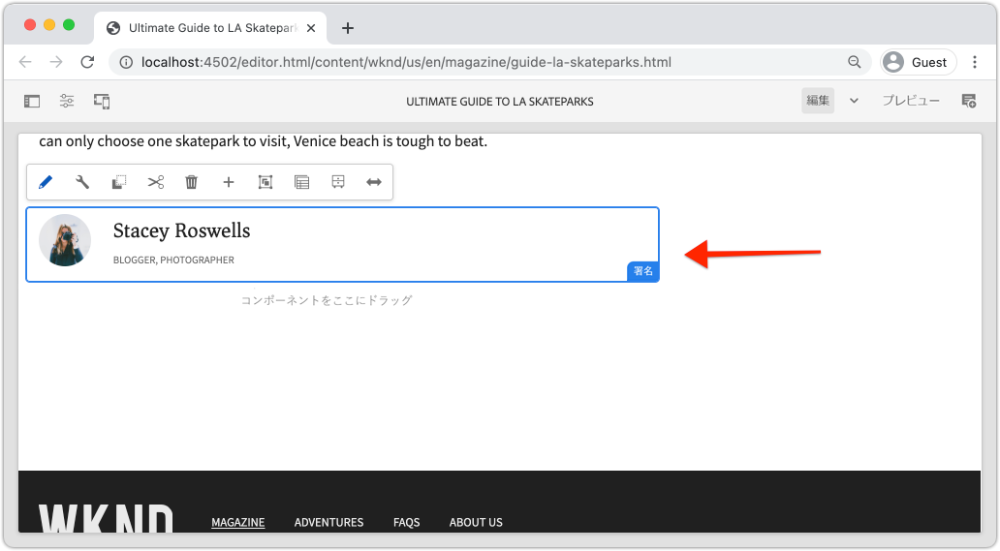
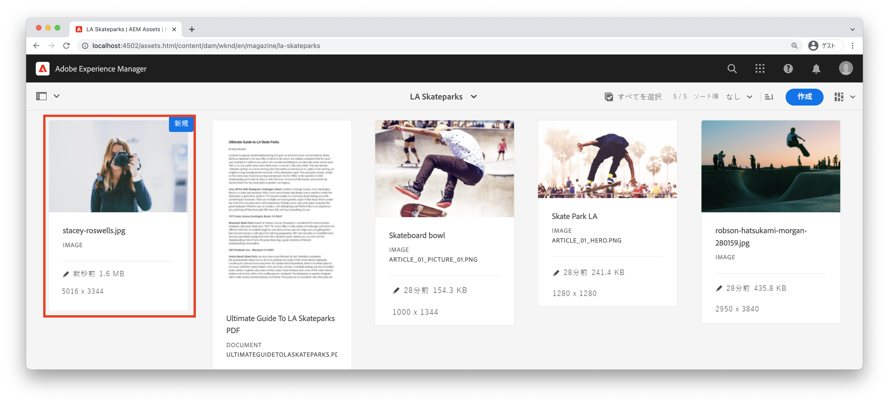
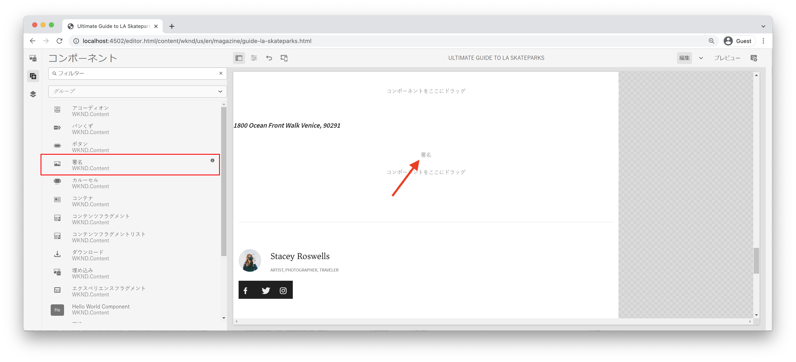
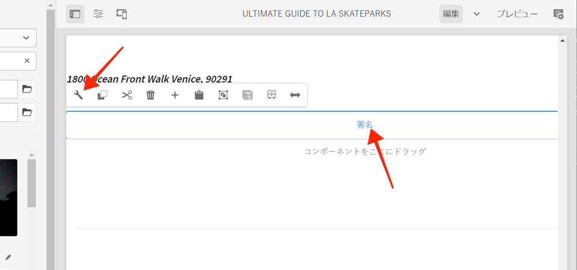
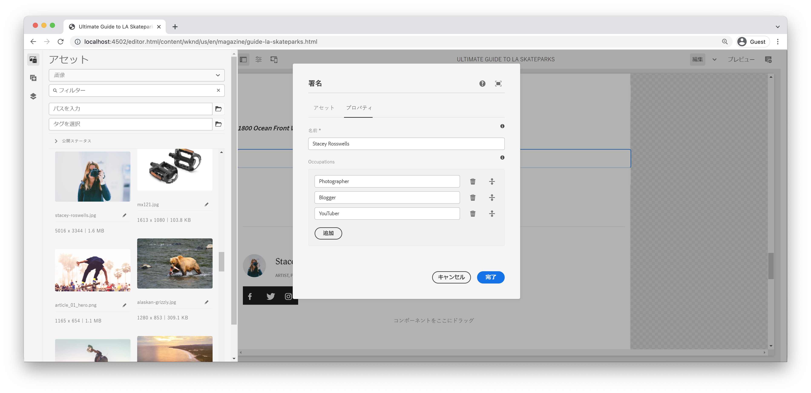
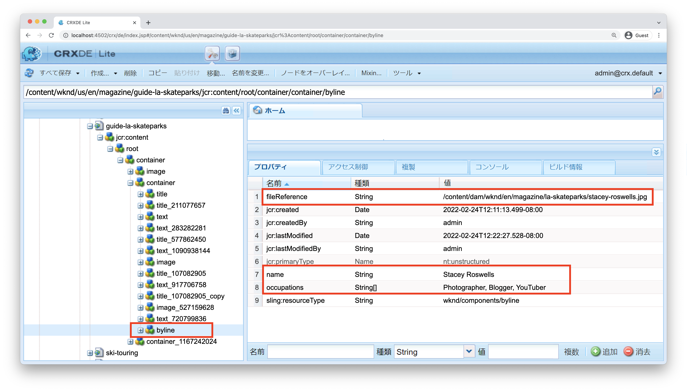
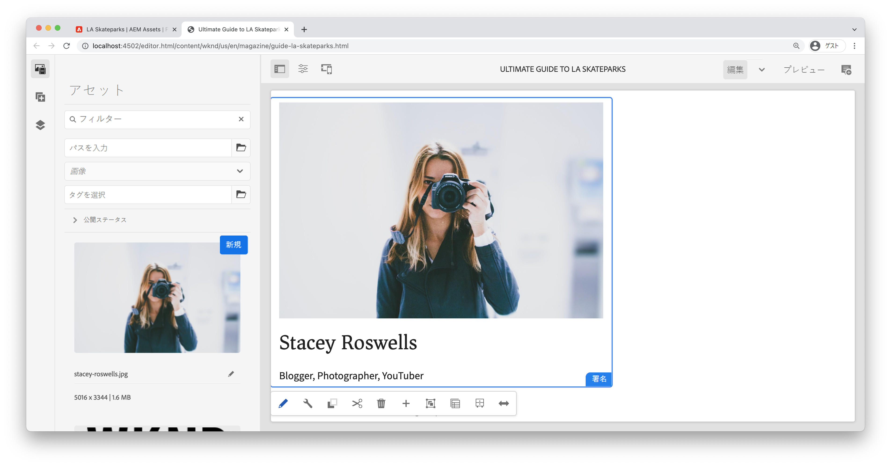
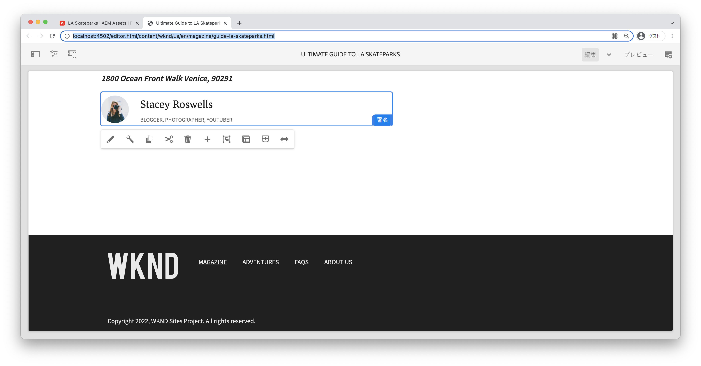

# カスタムコンポーネント {#custom-component}

このチュートリアルでは、ダイアログで作成されたコンテンツを表示するカスタムAEM署名コンポーネントのエンドツーエンドの作成について説明し、コンポーネントのHTLに入力するビジネスロジックをカプセル化するSlingモデルの開発について説明します。

## 前提条件 {#prerequisites}

[ローカル開発環境](overview.md#local-dev-environment)の設定に必要なツールと手順を確認します。

### スタータープロジェクト

>[!NOTE]
>
> 前の章を正常に完了した場合は、プロジェクトを再利用し、スタータープロジェクトをチェックアウトする手順をスキップできます。

チュートリアルで構築するベースラインコードを確認します。

1. [GitHub](https://github.com/adobe/aem-guides-wknd)の`tutorial/custom-component-start`ブランチを確認します。

   ```shell
   $ cd aem-guides-wknd
   $ git checkout tutorial/custom-component-start
   ```

1. Mavenのスキルを使用して、ローカルのAEMインスタンスにコードベースをデプロイします。

   ```shell
   $ mvn clean install -PautoInstallSinglePackage
   ```

   >[!NOTE]
   >
   > AEM 6.5または6.4を使用している場合は、任意のMavenコマンドに`classic`プロファイルを追加します。

   ```shell
   $ mvn clean install -PautoInstallSinglePackage -Pclassic
   ```

[GitHub](https://github.com/adobe/aem-guides-wknd/tree/tutorial/custom-component-solution)で完成したコードをいつでも表示したり、ブランチ`tutorial/custom-component-solution`に切り替えてコードをローカルでチェックアウトしたりできます。

## 目的

1. カスタムAEMコンポーネントの構築方法の理解
1. Slingモデルでのビジネスロジックのカプセル化について説明します
1. HTLスクリプト内からSlingモデルを使用する方法を説明します。

## 作成する内容 {#byline-component}

WKNDチュートリアルのこのパートでは、署名コンポーネントを作成し、記事の投稿者に関する作成済みの情報を表示するために使用します。



*署名コンポーネント*

署名コンポーネントの実装には、署名コンテンツを収集するダイアログと、署名のを取得するカスタムSling Modelが含まれます。

* 名前
* 画像
* 職業

## 署名コンポーネントの作成 {#create-byline-component}

まず、署名コンポーネントノード構造を作成し、ダイアログを定義します。 これは、AEM のコンポーネントを表し、JCR 内のその場所によってコンポーネントのリソースタイプを暗黙的に定義します。

ダイアログは、コンテンツ作成者が提供できるインターフェイスを表示します。この実装では、AEM WCMコアコンポーネントの&#x200B;**画像**&#x200B;コンポーネントを署名の画像のオーサリングとレンダリングの処理に利用するので、アドビのコンポーネントの`sling:resourceSuperType`として設定されます。

### コンポーネント定義の作成{#create-component-definition}

1. **ui.apps**&#x200B;モジュールで、`/apps/wknd/components`に移動し、`byline`という名前の新しいフォルダーを作成します。
1. `byline`フォルダーの下に、`.content.xml`という名前の新しいファイルを追加します。

   

1. `.content.xml`ファイルに以下を入力します。

   ```xml
   <?xml version="1.0" encoding="UTF-8"?>
       <jcr:root xmlns:sling="http://sling.apache.org/jcr/sling/1.0" xmlns:cq="http://www.day.com/jcr/cq/1.0" xmlns:jcr="http://www.jcp.org/jcr/1.0"
       jcr:primaryType="cq:Component"
       jcr:title="Byline"
       jcr:description="Displays a contributor's byline."
       componentGroup="WKND Sites Project - Content"
       sling:resourceSuperType="core/wcm/components/image/v2/image"/>
   ```

   上記のXMLファイルは、タイトル、説明、グループなど、コンポーネントの定義を提供します。 `sling:resourceSuperType`は`core/wcm/components/image/v2/image`（[コア画像コンポーネント](https://experienceleague.adobe.com/docs/experience-manager-core-components/using/components/image.html?lang=ja)）を指します。

### HTL スクリプトの作成 {#create-the-htl-script}

1. `byline`フォルダーの下に、新しいファイル`byline.html`を追加します。このファイルは、コンポーネントのHTML表示を担当します。 ファイルにフォルダーと同じ名前を付けることは重要です。これは、このリソースタイプをレンダリングするためにSlingが使用するデフォルトのスクリプトになるからです。

1. 以下のコードを `byline.html` に追加します。

   ```html
   <!--/* byline.html */-->
   <div data-sly-use.placeholderTemplate="core/wcm/components/commons/v1/templates.html">
   </div>
   <sly data-sly-call="${placeholderTemplate.placeholder @ isEmpty=true}"></sly>
   ```

`byline.html` は後で [再訪問されます](#byline-htl)。Slingモデルが作成されると、再訪問されます。HTLファイルの現在の状態を使用すると、コンポーネントをページ上にドラッグ&amp;ドロップしたときに、AEM Sitesのページエディターに空の状態で表示できます。

### ダイアログ定義の作成 {#create-the-dialog-definition}

次に、以下のフィールドを含む、署名コンポーネント用のダイアログを定義します。

* **名前**：寄稿者の名前のテキストフィールド。
* **画像**：寄稿者の自己紹介写真への参照。
* **職業**：寄稿者に起因する職業のリスト。職業は、アルファベットの昇順（a～z）で並べ替えられる必要があります。

1. `byline`フォルダーの下に、`_cq_dialog`という名前の新しいフォルダーを作成します。
1. `byline/_cq_dialog`の下に、`.content.xml`という名前の新しいファイルを追加します。 これは、ダイアログのXML定義です。 次のXMLを追加します。

   ```xml
   <?xml version="1.0" encoding="UTF-8"?>
   <jcr:root xmlns:sling="http://sling.apache.org/jcr/sling/1.0" xmlns:cq="http://www.day.com/jcr/cq/1.0" xmlns:jcr="http://www.jcp.org/jcr/1.0" xmlns:nt="http://www.jcp.org/jcr/nt/1.0"
           jcr:primaryType="nt:unstructured"
           jcr:title="Byline"
           sling:resourceType="cq/gui/components/authoring/dialog">
       <content
               jcr:primaryType="nt:unstructured"
               sling:resourceType="granite/ui/components/coral/foundation/container">
           <items jcr:primaryType="nt:unstructured">
               <tabs
                       jcr:primaryType="nt:unstructured"
                       sling:resourceType="granite/ui/components/coral/foundation/tabs"
                       maximized="{Boolean}false">
                   <items jcr:primaryType="nt:unstructured">
                       <asset
                               jcr:primaryType="nt:unstructured"
                               sling:hideResource="{Boolean}false"/>
                       <metadata
                               jcr:primaryType="nt:unstructured"
                               sling:hideResource="{Boolean}true"/>
                       <properties
                               jcr:primaryType="nt:unstructured"
                               jcr:title="Properties"
                               sling:resourceType="granite/ui/components/coral/foundation/container"
                               margin="{Boolean}true">
                           <items jcr:primaryType="nt:unstructured">
                               <columns
                                       jcr:primaryType="nt:unstructured"
                                       sling:resourceType="granite/ui/components/coral/foundation/fixedcolumns"
                                       margin="{Boolean}true">
                                   <items jcr:primaryType="nt:unstructured">
                                       <column
                                               jcr:primaryType="nt:unstructured"
                                               sling:resourceType="granite/ui/components/coral/foundation/container">
                                           <items jcr:primaryType="nt:unstructured">
                                               <name
                                                       jcr:primaryType="nt:unstructured"
                                                       sling:resourceType="granite/ui/components/coral/foundation/form/textfield"
                                                       emptyText="Enter the contributor's name to display."
                                                       fieldDescription="The contributor's name to display."
                                                       fieldLabel="Name"
                                                       name="./name"
                                                       required="{Boolean}true"/>
                                               <occupations
                                                       jcr:primaryType="nt:unstructured"
                                                       sling:resourceType="granite/ui/components/coral/foundation/form/multifield"
                                                       fieldDescription="A list of the contributor's occupations."
                                                       fieldLabel="Occupations"
                                                       required="{Boolean}false">
                                                   <field
                                                           jcr:primaryType="nt:unstructured"
                                                           sling:resourceType="granite/ui/components/coral/foundation/form/textfield"
                                                           emptyText="Enter an occupation"
                                                           name="./occupations"/>
                                               </occupations>
                                           </items>
                                       </column>
                                   </items>
                               </columns>
                           </items>
                       </properties>
                   </items>
               </tabs>
           </items>
       </content>
   </jcr:root>
   ```

   これらのダイアログノード定義は、[Sling Resource Merger](https://sling.apache.org/documentation/bundles/resource-merger.html)を使用して、`sling:resourceSuperType`コンポーネント（この場合は&#x200B;**コアコンポーネントの画像コンポーネント**）から継承されるダイアログタブを制御します。

   

### ポリシーダイアログの作成 {#create-the-policy-dialog}

ダイアログ作成と同じ方法でポリシーダイアログ（以前のデザインダイアログ）を作成して、コアコンポーネントの画像コンポーネントから継承されたポリシー設定の不要なフィールドを非表示にします。

1. `byline`フォルダーの下に、`_cq_design_dialog`という名前の新しいフォルダーを作成します。
1. `byline/_cq_design_dialog`の下に、`.content.xml`という名前の新しいファイルを作成します。 ファイルを次のように更新します。を次のXMLに置き換えます。 `.content.xml`を開き、下のXMLをコピーして貼り付けるのが最も簡単です。

   ```xml
   <?xml version="1.0" encoding="UTF-8"?>
   <jcr:root xmlns:sling="http://sling.apache.org/jcr/sling/1.0" xmlns:granite="http://www.adobe.com/jcr/granite/1.0" xmlns:cq="http://www.day.com/jcr/cq/1.0" xmlns:jcr="http://www.jcp.org/jcr/1.0" xmlns:nt="http://www.jcp.org/jcr/nt/1.0"
       jcr:primaryType="nt:unstructured"
       jcr:title="Byline"
       sling:resourceType="cq/gui/components/authoring/dialog">
       <content
               jcr:primaryType="nt:unstructured">
           <items jcr:primaryType="nt:unstructured">
               <tabs
                       jcr:primaryType="nt:unstructured">
                   <items jcr:primaryType="nt:unstructured">
                       <properties
                               jcr:primaryType="nt:unstructured">
                           <items jcr:primaryType="nt:unstructured">
                               <content
                                       jcr:primaryType="nt:unstructured">
                                   <items jcr:primaryType="nt:unstructured">
                                       <decorative
                                               jcr:primaryType="nt:unstructured"
                                               sling:hideResource="{Boolean}true"/>
                                       <altValueFromDAM
                                               jcr:primaryType="nt:unstructured"
                                               sling:hideResource="{Boolean}true"/>
                                       <titleValueFromDAM
                                               jcr:primaryType="nt:unstructured"
                                               sling:hideResource="{Boolean}true"/>
                                       <displayCaptionPopup
                                               jcr:primaryType="nt:unstructured"
                                               sling:hideResource="{Boolean}true"/>
                                       <disableUuidTracking
                                               jcr:primaryType="nt:unstructured"
                                               sling:hideResource="{Boolean}true"/>
                                   </items>
                               </content>
                           </items>
                       </properties>
                       <features
                               jcr:primaryType="nt:unstructured">
                           <items jcr:primaryType="nt:unstructured">
                               <content
                                       jcr:primaryType="nt:unstructured">
                                   <items jcr:primaryType="nt:unstructured">
                                       <accordion
                                               jcr:primaryType="nt:unstructured">
                                           <items jcr:primaryType="nt:unstructured">
                                               <orientation
                                                       jcr:primaryType="nt:unstructured"
                                                       sling:hideResource="{Boolean}true"/>
                                               <crop
                                                       jcr:primaryType="nt:unstructured"
                                                       sling:hideResource="{Boolean}true"/>
                                           </items>
                                       </accordion>
                                   </items>
                               </content>
                           </items>
                       </features>
                   </items>
               </tabs>
           </items>
       </content>
   </jcr:root>
   ```

   前の&#x200B;**ポリシーダイアログ** XMLの基礎は、[コアコンポーネントの画像コンポーネント](https://github.com/adobe/aem-core-wcm-components/blob/master/content/src/content/jcr_root/apps/core/wcm/components/image/v2/image/_cq_design_dialog/.content.xml)から取得されました。

   ダイアログ設定と同様に、 [Sling Resource Merger](https://sling.apache.org/documentation/bundles/resource-merger.html)を使用して、`sling:hideResource="{Boolean}true"`プロパティを持つノード定義で見られるように、`sling:resourceSuperType`から継承された無関係なフィールドを非表示にします。

### コードのデプロイ {#deploy-the-code}

1. Mavenのスキルを使用して、更新されたコードベースをローカルのAEMインスタンスにデプロイします。

   ```shell
   $ cd aem-guides-wknd
   $ mvn clean install -PautoInstallSinglePackage
   ```

## ページ{#add-the-component-to-a-page}にコンポーネントを追加します。

AEMコンポーネントの開発に重点を置いた作業を簡単におこなうために、記事ページに現在の状態の署名コンポーネントを追加し、`cq:Component`ノード定義がデプロイされ、正しく適用され、AEMが新しいコンポーネント定義を認識し、コンポーネントのダイアログがオーサリングに機能することを確認します。

### AEM Assetsへの画像の追加

まず、サンプルのヘッドショットをAEM Assetsにアップロードして、署名コンポーネントに画像を設定する際に使用します。

1. AEM AssetsのLA Skateparksフォルダーに移動します。[http://localhost:4502/assets.html/content/dam/wknd/en/magazine/la-skateparks](http://localhost:4502/assets.html/content/dam/wknd/en/magazine/la-skateparks).

1. **[stacey-roswells.jpg](assets/custom-component/stacey-roswells.jpg)**&#x200B;のヘッドショットをフォルダーにアップロードします。

   

### コンポーネントの作成 {#author-the-component}

次に、署名コンポーネントをAEMのページに追加します。 署名コンポーネントを&#x200B;**WKND Sitesプロジェクト — コンテンツ**&#x200B;コンポーネントグループに追加したので、`ui.apps/src/main/content/jcr_root/apps/wknd/components/byline/.content.xml`定義を使用して、**Policy**&#x200B;で&#x200B;**WKND Sites Project - Content&lt;a8を許可する**&#x200B;コンテナ&#x200B;**で自動的に使用できます/>コンポーネントグループ（記事ページのレイアウトコンテナ）**

1. LA Skateparkの記事( )に移動します。[http://localhost:4502/editor.html/content/wknd/us/en/magazine/guide-la-skateparks.html](http://localhost:4502/editor.html/content/wknd/us/en/magazine/guide-la-skateparks.html)

1. 左側のサイドバーから、開いている記事ページのレイアウトコンテナの&#x200B;**署名コンポーネント**&#x200B;を&#x200B;**下**&#x200B;にドラッグ&amp;ドロップします。

   

1. **左側のサイドバーが開いて**&#x200B;表示されたことと、**アセットファインダー**&#x200B;が選択されていることを確認します。

   

1. **署名コンポーネントプレースホルダー**&#x200B;を選択し、アクションバーを表示して&#x200B;**レンチ**&#x200B;アイコンをタップしてダイアログを開きます。

   

1. ダイアログが開き、最初のタブ（アセット）がアクティブな状態で、左側のサイドバーを開き、アセットファインダーから画像を画像ドロップゾーンにドラッグします。 WKND ui.contentパッケージに含まれるStacey Roswellsのプロフィール画像を探すには、「stacey」を検索します。

   

1. 画像を追加したら、「**プロパティ**」タブをクリックして「**名前**」および「**職業**」に入力します。

   職業を入力する場合は、Sling Modelで実装するアルファベット化ビジネスロジックが見やすくなるように、**逆アルファベット**&#x200B;の順序で入力します。

   右下の「**完了**」ボタンをタップして、変更を保存します。

   

   AEM作成者は、ダイアログを使用してコンポーネントを設定およびオーサリングします。 署名コンポーネントの開発時点では、データ収集用のダイアログが含まれますが、作成したコンテンツをレンダリングするロジックはまだ追加されていません。 したがって、プレースホルダーのみが表示されます。

1. ダイアログを保存したら、[CRXDE Lite](http://localhost:4502/crx/de/index.jsp#/content/wknd/us/en/magazine/guide-la-skateparks/jcr%3Acontent/root/container/container/byline)に移動し、AEMページの下にある署名コンポーネントコンテンツノードにコンポーネントのコンテンツが保存される方法を確認します。

   LA Skate Parksページの下にある署名コンポーネントのコンテンツノード(`/content/wknd/us/en/magazine/guide-la-skateparks/jcr:content/root/container/container/byline`)を見つけます。

   プロパティ名`name`、`occupations`、`fileReference`が&#x200B;**署名ノード**&#x200B;に格納されていることに注意してください。

   また、ノードの`sling:resourceType`が`wknd/components/content/byline`に設定されていることに注意してください。これは、このコンテンツノードを署名コンポーネント実装にバインドするものです。

   

## 署名Sling Model {#create-sling-model}を作成

次に、データモデルとして機能し、署名コンポーネントのビジネスロジックを格納する Sling Model を作成します。

Slingモデルは、JCRからJava変数へのデータのマッピングを容易にし、AEMのコンテキストで開発する際に他の多くの点を提供する、注釈駆動型のJava「POJO」(Plain Old Java Objects)です。

### Mavenの依存関係の確認{#maven-dependency}

署名Slingモデルは、AEMが提供する複数のJava APIに依存します。 これらのAPIは、 `core`モジュールのPOMファイルにリストされている`dependencies`を通じて使用できます。 このチュートリアルで使用するプロジェクトは、AEM as a Cloud Service用に構築されています。 ただし、AEM 6.5/6.4との下位互換性がある点で一意です。したがって、Cloud ServiceとAEM 6.xの両方の依存関係が含まれます。

1. `<src>/aem-guides-wknd/core/pom.xml`の下の`pom.xml`ファイルを開きます。
1. `aem-sdk-api` - **AEMの依存関係をCloud Serviceとして検索します。**&#x200B;のみ

   ```xml
   <dependency>
       <groupId>com.adobe.aem</groupId>
       <artifactId>aem-sdk-api</artifactId>
   </dependency>
   ```

   [aem-sdk-api](https://experienceleague.adobe.com/docs/experience-manager-cloud-service/implementing/developing/aem-as-a-cloud-service-sdk.html?lang=ja#building-for-the-sdk)には、AEMで公開されるすべてのパブリックJava APIが含まれます。 このプロジェクトの構築時には、デフォルトで`aem-sdk-api`が使用されます。 バージョンは、プロジェクトのルート(`aem-guides-wknd/pom.xml`)にある親リアクターPOMに保持されます。

1. `uber-jar` - **AEM 6.5/6.4の依存関係のみ**

   ```xml
   ...
       <dependency>
           <groupId>com.adobe.aem</groupId>
           <artifactId>uber-jar</artifactId>
           <classifier>apis</classifier>
       </dependency>
   ...
   ```

   `uber-jar`は、`classic`プロファイル(`mvn clean install -PautoInstallSinglePackage -Pclassic`)が呼び出された場合にのみ含まれます。 これもこのプロジェクトに固有のものです。 AEMプロジェクトアーキタイプから生成される実際のプロジェクトでは、指定したAEMのバージョンが6.5または6.4の場合、`uber-jar`がデフォルトになります。

   [uber-jar](https://docs.adobe.com/content/help/en/experience-manager-65/developing/devtools/ht-projects-maven.html#experience-manager-api-dependencies)には、AEM 6.xで公開されているパブリックJava APIがすべて含まれています。バージョンは、プロジェクト`aem-guides-wknd/pom.xml`のルートにある親リアクターPOMに保持されます。

1. `core.wcm.components.core`の依存関係を探します。

   ```xml
    <!-- Core Component Dependency -->
       <dependency>
           <groupId>com.adobe.cq</groupId>
           <artifactId>core.wcm.components.core</artifactId>
       </dependency>
   ```

   これは、AEMコアコンポーネントによって公開されるすべてのパブリックJava APIです。 AEMコアコンポーネントは、AEMの外部で管理されるプロジェクトなので、別々のリリースサイクルがあります。 このため、これは別々に含める必要がある依存関係であり、`uber-jar`または`aem-sdk-api`に含まれる&#x200B;**ではありません**。

   uber-jarと同様に、この依存関係のバージョンは`aem-guides-wknd/pom.xml`にある親リアクターpomファイルに保持されます。

   このチュートリアルの後半では、コアコンポーネントの画像クラスを使用して、署名コンポーネントに画像を表示します。 Slingモデルを構築してコンパイルするには、コアコンポーネントの依存関係が必要です。

### Byline インターフェイス {#byline-interface}

署名用のパブリックJavaインターフェイスを作成します。 `Byline.java` は、HTLスクリプトの駆動に必要なパブリックメソッド `byline.html` を定義します。

1. `core/src/main/java/com/adobe/aem/guides/wknd/core/models`の下の`aem-guides-wknd.core`モジュール内に、`Byline.java`という名前の新しいファイルを作成します。

   

1. 以下のメソッドで `Byline.java` を更新します。

   ```java
   package com.adobe.aem.guides.wknd.core.models;
   
   import java.util.List;
   
   /**
   * Represents the Byline AEM Component for the WKND Site project.
   **/
   public interface Byline {
       /***
       * @return a string to display as the name.
       */
       String getName();
   
       /***
       * Occupations are to be sorted alphabetically in a descending order.
       *
       * @return a list of occupations.
       */
       List<String> getOccupations();
   
       /***
       * @return a boolean if the component has enough content to display.
       */
       boolean isEmpty();
   }
   ```

   最初の2つのメソッドは、署名コンポーネントの&#x200B;**name**&#x200B;と&#x200B;**occupations**&#x200B;の値を公開します。

   `isEmpty()`メソッドは、コンポーネントにレンダリングするコンテンツがあるかどうか、または設定を待っているかどうかを判断するために使用されます。

   画像に対するメソッドがないことに注意してください。[後で](#tackling-the-image-problem)となる理由を見てみましょう。

### 署名実装 {#byline-implementation}

`BylineImpl.java` は、前に定義したインターフェイスを実装するSling `Byline.java`  Modelの実装です。`BylineImpl.java` の完全なコードは、この節の最後に記載しています。

1. `core/src/main/java/com/adobe/aem/guides/core/models`の下に`impl`という名前の新しいフォルダーを作成します。
1. `impl`フォルダーに、新しいファイル`BylineImpl.java`を作成します。

   

1. `BylineImpl.java` を開きます。`Byline`インターフェイスを実装するように指定します。 IDEのオートコンプリート機能を使用するか、手動でファイルを更新して`Byline`インターフェイスの実装に必要なメソッドを含めます。

   ```java
   package com.adobe.aem.guides.wknd.core.models.impl;
   import java.util.List;
   import com.adobe.aem.guides.wknd.core.models.Byline;
   
   public class BylineImpl implements Byline {
   
       @Override
       public String getName() {
           // TODO Auto-generated method stub
           return null;
       }
   
       @Override
       public List<String> getOccupations() {
           // TODO Auto-generated method stub
           return null;
       }
   
       @Override
       public boolean isEmpty() {
           // TODO Auto-generated method stub
           return false;
       }
   }
   ```

1. 以下のクラスレベルの注釈で `BylineImpl.java` を更新して、Sling Model 注釈を追加します。この`@Model(..)`注釈は、クラスをSlingモデルに変換します。

   ```java
   import org.apache.sling.api.SlingHttpServletRequest;
   import org.apache.sling.models.annotations.Model;
   import org.apache.sling.models.annotations.DefaultInjectionStrategy;
   ...
   @Model(
           adaptables = {SlingHttpServletRequest.class},
           adapters = {Byline.class},
           resourceType = {BylineImpl.RESOURCE_TYPE},
           defaultInjectionStrategy = DefaultInjectionStrategy.OPTIONAL
   )
   public class BylineImpl implements Byline {
       protected static final String RESOURCE_TYPE = "wknd/components/content/byline";
       ...
   }
   ```

   この注釈とそのパラメーターを確認してみましょう:

   * `@Model`注釈は、AEMにデプロイされると、BylineImplをSling Modelとして登録します。
   * `adaptables`パラメーターは、このモデルがリクエストによって適合できることを指定します。
   * `adapters`パラメーターを使用すると、実装クラスを署名インターフェイスの下に登録できます。 これにより、HTLスクリプトは（implを直接呼び出すのではなく）インターフェイスを介してSling Modelを呼び出すことができます。 adapters について詳しくは、[こちら](https://sling.apache.org/documentation/bundles/models.html#specifying-an-alternate-adapter-class-since-110)を参照してください。
   * `resourceType`は、（前に作成した）署名コンポーネントのリソースタイプを指し、複数の実装がある場合は正しいモデルの解決に役立ちます。 モデルクラスのリソースタイプとの関連付けについて詳しくは、[こちら](https://sling.apache.org/documentation/bundles/models.html#associating-a-model-class-with-a-resource-type-since-130)を参照してください。

### Sling Model メソッドの実装  {#implementing-the-sling-model-methods}

#### getName() {#implementing-get-name}

最初に取り組む方法は`getName()`です。これは、`name`プロパティの下の署名のJCRコンテンツノードに保存された値を返すだけです。

この場合、`@ValueMapValue` Sling Model注釈を使用して、リクエストのリソースのValueMapを使用してJavaフィールドに値を挿入します。


```java
import org.apache.sling.models.annotations.injectorspecific.ValueMapValue;

public class BylineImpl implements Byline {
    ...
    @ValueMapValue
    private String name;

    ...
    @Override
    public String getName() {
        return name;
    }
    ...
}
```

JCRプロパティはJavaフィールドと同じ名前（両方とも「name」）を共有するので、`@ValueMapValue`はこの関連付けを自動的に解決し、プロパティの値をJavaフィールドに挿入します。

#### getOccupations() {#implementing-get-occupations}

次に実装する方法は`getOccupations()`です。 このメソッドは、JCRプロパティ`occupations`に保存されている職業をすべて収集し、並べ替えられた（アルファベット順に）コレクションを返します。

`getName()`で説明したのと同じ方法を使用して、プロパティ値をSling Modelのフィールドに挿入できます。

挿入されたJavaフィールド`occupations`を介してJCRプロパティ値がSling Modelで使用可能になったら、並べ替えビジネスロジックを`getOccupations()`メソッドで適用できます。


```java
import java.util.ArrayList;
import java.util.Collections;
  ...

public class BylineImpl implements Byline {
    ...
    @ValueMapValue
    private List<String> occupations;
    ...
    @Override
    public List<String> getOccupations() {
        if (occupations != null) {
            Collections.sort(occupations);
            return new ArrayList<String>(occupations);
        } else {
            return Collections.emptyList();
        }
    }
    ...
}
  ...
```


#### isEmpty() {#implementing-is-empty}

最後のパブリックメソッドは`isEmpty()`です。これは、コンポーネント自体がレンダリングに十分に作成されたと見なすタイミングを決定します。

このコンポーネントに関しては、名前、画像、職業の3つのフィールドをすべて&#x200B;*入力してから、*&#x200B;コンポーネントをレンダリングする必要があるというビジネス要件があります。


```java
import org.apache.commons.lang3.StringUtils;
  ...
public class BylineImpl implements Byline {
    ...
    @Override
    public boolean isEmpty() {
        if (StringUtils.isBlank(name)) {
            // Name is missing, but required
            return true;
        } else if (occupations == null || occupations.isEmpty()) {
            // At least one occupation is required
            return true;
        } else if (/* image is not null, logic to be determined */) {
            // A valid image is required
            return true;
        } else {
            // Everything is populated, so this component is not considered empty
            return false;
        }
    }
    ...
}
```


#### 「画像の問題」への対処{#tackling-the-image-problem}

名前と占有条件の確認は簡単です（Apache Commons Lang3は常に便利な[StringUtils](https://commons.apache.org/proper/commons-lang/apidocs/org/apache/commons/lang3/StringUtils.html)クラスを提供します）が、コアコンポーネント画像コンポーネントを使用して画像を表示するので、**の存在を検証する方法は不明です。**

これに対処するには、2 つの方法があります。

`fileReference` JCRプロパティがアセットに解決されるかどうかを確認します。 ** このリソースをコアコンポーネントの画像Slingモデルに変換し、メソッドが空でない `getSrc()` ことを確認します。

**2番目の**&#x200B;アプローチを選択します。 第1のアプローチで十分である可能性が高いですが、このチュートリアルでは、Sling Modelの他の機能を調べるために後者を使用します。

1. 画像を取得するプライベートメソッドを作成します。 このメソッドをプライベートにしておくのは、HTL 自体の画像オブジェクトを公開する必要がなく、`isEmpty().` () を実行するためにのみ使用するからです。

   `getImage()`の次のプライベートメソッド：

   ```java
   import com.adobe.cq.wcm.core.components.models.Image;
   ...
   private Image getImage() {
       Image image = null;
       // Figure out how to populate the image variable!
       return image;
   }
   ```

   上記のように、**画像Sling Model**&#x200B;を取得する方法はさらに2つあります。

   1つ目は`@Self`注釈を使用し、現在のリクエストをコアコンポーネントの`Image.class`に自動的に適応させます。

   ```java
   @Self
   private Image image;
   ```

   2つ目は[Apache Sling ModelFactory](https://sling.apache.org/apidocs/sling10/org/apache/sling/models/factory/ModelFactory.html) OSGiサービスを使用します。これは非常に便利なサービスで、Javaコードで他のタイプのSling Modelを作成するのに役立ちます。

   第2のアプローチを選択します。

   >[!NOTE]
   >
   >実際の実装では、よりシンプルでエレガントなソリューションなので、`@Self`を使用したアプローチが推奨されます。 このチュートリアルでは、2つ目のアプローチを使用します。非常に役立つSling Modelのより多くのファセットを調べる必要があるので、より複雑なコンポーネントを使用します。

   SlingモデルはOSGiサービスではなくJava POJOなので、通常のOSGiインジェクション注釈`@Reference` **は使用できません**。代わりに、Slingモデルは、類似の機能を提供する特別な&#x200B;**[@OSGiService](https://sling.apache.org/documentation/bundles/models.html#injector-specific-annotations)**&#x200B;注釈を提供します。

1. `BylineImpl.java`を更新して、`OSGiService`注釈を含め、`ModelFactory`を挿入します。

   ```java
   import org.apache.sling.models.factory.ModelFactory;
   import org.apache.sling.models.annotations.injectorspecific.OSGiService;
   ...
   public class BylineImpl implements Byline {
       ...
       @OSGiService
       private ModelFactory modelFactory;
   }
   ```

   `ModelFactory`を使用できる場合は、次を使用してコアコンポーネントの画像Slingモデルを作成できます。

   ```java
   modelFactory.getModelFromWrappedRequest(SlingHttpServletRequest request, Resource resource, java.lang.Class<T> targetClass)
   ```

   ただし、このメソッドには要求とリソースの両方が必要で、Slingモデルではまだ使用できません。 これらを取得するには、より多くのSling Model注釈が使用されます。

   現在のリクエストを取得するには、**[@Self](https://sling.apache.org/documentation/bundles/models.html#injector-specific-annotations)**&#x200B;注釈を使用して、`adaptable`（`@Model(..)`で`SlingHttpServletRequest.class`として定義されている）をJavaクラスフィールドに挿入します。

1. **@Self**&#x200B;注釈を追加して、**SlingHttpServletRequest**&#x200B;を取得します。

   ```java
   import org.apache.sling.models.annotations.injectorspecific.Self;
   ...
   @Self
   private SlingHttpServletRequest request;
   ```

   `@Self Image image`を使用したコアコンポーネントの画像Sling Modelの挿入は、上記のオプションでした。`@Self`注釈は、適応可能なオブジェクト（この場合はSlingHttpServletRequest）を挿入し、注釈フィールドタイプに適応しようとします。 コアコンポーネントの画像 Sling Model は SlingHttpServletRequest オブジェクトから適応可能なので、これなら機能したはずです。また、説明的な 2 番目の方法よりも少ないコードで済みます。

   これで、ModelFactory API で画像モデルをインスタンス化するために必要な変数を挿入できました。次に、Sling Model の **[@PostConstruct](https://sling.apache.org/documentation/bundles/models.html#postconstruct-methods) 注釈を使用して、Sling Model をインスタンス化した後、このオブジェクトを取得します。**

   `@PostConstruct` は非常に役立ち、コンストラクターと同じ機能を果たしますが、クラスがインスタンス化され、注釈が付けられたすべてのJavaフィールドが挿入された後に呼び出されます。他のSlingモデル注釈がJavaクラスフィールド（変数）に注釈を付けるのに対して、`@PostConstruct`は、通常は`init()`という名前（ただし、任意の名前を付けることができます）の、無効なゼロパラメーターメソッドに注釈を付けます。

1. **@PostConstruct**&#x200B;メソッドを追加します。

   ```java
   import javax.annotation.PostConstruct;
   ...
   public class BylineImpl implements Byline {
       ...
       private Image image;
   
       @PostConstruct
       private void init() {
           image = modelFactory.getModelFromWrappedRequest(request,
                                                           request.getResource(),
                                                           Image.class);
       }
       ...
   }
   ```

   Sling Model は OSGi サービス&#x200B;**ではない**&#x200B;ので、クラスの状態を安全に管理できます。通常、`@PostConstruct`は、プレーンコンストラクターと同様に、後で使用するSling Modelクラスの状態を派生し、設定します。

   `@PostConstruct`メソッドで例外がスローされた場合、Sling Modelはインスタンス化されません（nullになります）。

1. **getImage()** を更新して、画像オブジェクトを返すだけで済むようになりました。

   ```java
   /**
       * @return the Image Sling Model of this resource, or null if the resource cannot create a valid Image Sling Model.
   */
   private Image getImage() {
       return image;
   }
   ```

1. `isEmpty()`に戻り、実装を完了します。

   ```java
   @Override
   public boolean isEmpty() {
      final Image componentImage = getImage();
   
       if (StringUtils.isBlank(name)) {
           // Name is missing, but required
           return true;
       } else if (occupations == null || occupations.isEmpty()) {
           // At least one occupation is required
           return true;
       } else if (componentImage == null || StringUtils.isBlank(componentImage.getSrc())) {
           // A valid image is required
           return true;
       } else {
           // Everything is populated, so this component is not considered empty
           return false;
       }
   }
   ```

   注意： `getImage()`に対する複数の呼び出しは問題ありません。初期化された`image`クラス変数が返され、`modelFactory.getModelFromWrappedRequest(...)`は呼び出されません。この呼び出しは過度のコストではありませんが、不必要に呼び出すのを避ける価値があります。

1. 最終的な`BylineImpl.java`は次のようになります。


   ```java
   package com.adobe.aem.guides.wknd.core.models.impl;
   
   import java.util.ArrayList;
   import java.util.Collections;
   import java.util.List;
   import javax.annotation.PostConstruct;
   import org.apache.commons.lang3.StringUtils;
   import org.apache.sling.api.SlingHttpServletRequest;
   import org.apache.sling.models.annotations.DefaultInjectionStrategy;
   import org.apache.sling.models.annotations.Model;
   import org.apache.sling.models.annotations.injectorspecific.OSGiService;
   import org.apache.sling.models.annotations.injectorspecific.Self;
   import org.apache.sling.models.annotations.injectorspecific.ValueMapValue;
   import org.apache.sling.models.factory.ModelFactory;
   import com.adobe.aem.guides.wknd.core.models.Byline;
   import com.adobe.cq.wcm.core.components.models.Image;
   
   @Model(
           adaptables = {SlingHttpServletRequest.class},
           adapters = {Byline.class},
           resourceType = {BylineImpl.RESOURCE_TYPE},
           defaultInjectionStrategy = DefaultInjectionStrategy.OPTIONAL
   )
   public class BylineImpl implements Byline {
       protected static final String RESOURCE_TYPE = "wknd/components/content/byline";
   
       @Self
       private SlingHttpServletRequest request;
   
       @OSGiService
       private ModelFactory modelFactory;
   
       @ValueMapValue
       private String name;
   
       @ValueMapValue
       private List<String> occupations;
   
       private Image image;
   
       @PostConstruct
       private void init() {
           image = modelFactory.getModelFromWrappedRequest(request, request.getResource(), Image.class);
       }
   
       @Override
       public String getName() {
           return name;
       }
   
       @Override
       public List<String> getOccupations() {
           if (occupations != null) {
               Collections.sort(occupations);
               return new ArrayList<String>(occupations);
           } else {
               return Collections.emptyList();
           }
       }
   
       @Override
       public boolean isEmpty() {
           final Image componentImage = getImage();
   
           if (StringUtils.isBlank(name)) {
               // Name is missing, but required
               return true;
           } else if (occupations == null || occupations.isEmpty()) {
               // At least one occupation is required
               return true;
           } else if (componentImage == null || StringUtils.isBlank(componentImage.getSrc())) {
               // A valid image is required
               return true;
           } else {
               // Everything is populated, so this component is not considered empty
               return false;
           }
       }
   
       /**
       * @return the Image Sling Model of this resource, or null if the resource cannot create a valid Image Sling Model.
       */
       private Image getImage() {
           return image;
       }
   }
   ```


## 署名 HTL {#byline-htl}

`ui.apps`モジュールで、前のAEMコンポーネントの設定で作成した`/apps/wknd/components/byline/byline.html`を開きます。

```html
<div data-sly-use.placeholderTemplate="core/wcm/components/commons/v1/templates.html">
</div>
<sly data-sly-call="${placeholderTemplate.placeholder @ isEmpty=false}"></sly>
```

この HTL スクリプトでおこなうことを確認しましょう。

* `placeholderTemplate`は、コアコンポーネントのプレースホルダーを指し、コンポーネントが完全に設定されていない場合に表示されます。 これは、AEM Sitesページエディターで、`cq:Component`の`jcr:title`プロパティで前述したように、コンポーネントのタイトルを持つボックスとしてレンダリングされます。

* `data-sly-call="${placeholderTemplate.placeholder @ isEmpty=false}`は、上で定義した`placeholderTemplate`を読み込み、ブール値（現在は`false`にハードコードされています）をプレースホルダーテンプレートに渡します。 `isEmpty`がtrueの場合、プレースホルダーテンプレートはグレーのボックスをレンダリングし、そうでない場合は何もレンダリングしません。

### 署名HTLの更新

1. 以下のスケルタル HTML 構造で **byline.html** を更新します。

   ```html
   <div data-sly-use.placeholderTemplate="core/wcm/components/commons/v1/templates.html"
       class="cmp-byline">
           <div class="cmp-byline__image">
               <!--/* Include the Core Components Image Component */-->
           </div>
           <h2 class="cmp-byline__name"><!--/* Include the name */--></h2>
           <p class="cmp-byline__occupations"><!--/* Include the occupations */--></p>
   </div>
   <sly data-sly-call="${placeholderTemplate.placeholder @ isEmpty=true}"></sly>
   ```

   CSS クラスは [BEM 命名規則](https://getbem.com/naming/)に従うことに注意してください。BEM 規則の使用は必須ではありませんが、コアコンポーネント CSS クラスで使用され、一般的にクリーンで読みやすい CSS ルールになるので、BEM をお勧めします。

### HTL での Sling Model オブジェクトのインスタンス化  {#instantiating-sling-model-objects-in-htl}

[Use block statement](https://github.com/adobe/htl-spec/blob/master/SPECIFICATION.md#221-use)は、HTLスクリプトでSling Modelオブジェクトをインスタンス化し、HTL変数に割り当てる場合に使用します。

`data-sly-use.byline="com.adobe.aem.guides.wknd.models.Byline"` は、BylineImplで実装された署名インターフェイス(com.adobe.aem.guides.wknd.models.Byline)を使用して、現在のSlingHttpServletRequestをそのインターフェイスに適応し、結果はHTL変数名byline(  `data-sly-use.<variable-name>` )に格納されます。

1. 外側の`div`を更新して、 **署名** Sling Modelをそのパブリックインターフェイスで参照します。

   ```xml
   <div data-sly-use.byline="com.adobe.aem.guides.wknd.core.models.Byline"
       data-sly-use.placeholderTemplate="core/wcm/components/commons/v1/templates.html"
       class="cmp-byline">
       ...
   </div>
   ```

### Sling Model メソッドへのアクセス {#accessing-sling-model-methods}

HTLはJSTLから借用し、同じ短縮形のJavaゲッターメソッド名を使用します。

例えば、署名Sling Modelの`getName()`メソッドを呼び出すと、`byline.isEmpty`ではなく`byline.name`に短縮でき、同様に`byline.empty`に短縮できます。 完全なメソッド名`byline.getName`または`byline.isEmpty`を使用することもできます。 HTLでメソッドを呼び出す際に`()`は使用されないことに注意してください（JSTLと同様）。

パラメーター&#x200B;**を必要とするJavaメソッドは、HTLでは使用できません。** これは、HTL のロジックをシンプルにするための設計によるものです。

1. 署名名は、署名Slingモデルの`getName()`メソッドを呼び出すか、HTLで呼び出すことで、コンポーネントに追加できます。`${byline.name}`.

   `h2`タグを更新します。

   ```xml
   <h2 class="cmp-byline__name">${byline.name}</h2>
   ```

### HTL 式のオプションの使用 {#using-htl-expression-options}

[HTL式のオ](https://github.com/adobe/htl-spec/blob/master/SPECIFICATION.md#12-available-expression-options) プションは、HTLのコンテンツの修飾子として機能し、日付の書式設定からi18n翻訳まで幅広く機能します。また、式は、リストの結合や値の配列に使用でき、職業をコンマ区切り形式で表示するのに必要です。

式は、HTL式の`@`演算子を使用して追加されます。

1. 職業のリストを「,」で結合するには、以下のコードを使用します。

   ```html
   <p class="cmp-byline__occupations">${byline.occupations @ join=', '}</p>
   ```

### プレースホルダーの条件付き表示  {#conditionally-displaying-the-placeholder}

AEMコンポーネント用のほとんどのHTLスクリプトでは、**プレースホルダーパラダイム**&#x200B;を利用して、コンポーネントが誤って作成され、AEMパブリッシュ&#x200B;**に表示されないことを作成者に視覚的に示します。** この判断を推進するには、コンポーネントの背後の Sling Model のメソッド（この場合 `Byline.isEmpty()`()）を実装する必要があります。

`isEmpty()` が署名Slingモデルで呼び出され、結果（または演算子を介した否定的な）が `!` 演算子を介して次のHTL変数に保存されま `hasContent`す。

1. 外側の`div`を更新して、`hasContent`という名前のHTL変数を保存します。

   ```html
    <div data-sly-use.byline="com.adobe.aem.guides.wknd.core.models.Byline"
         data-sly-use.placeholderTemplate="core/wcm/components/commons/v1/templates.html"
         data-sly-test.hasContent="${!byline.empty}"
         class="cmp-byline">
         ...
   </div>
   ```

   HTL `test`ブロックの`data-sly-test`の使用は、HTL変数を設定し、HTL式の結果が真かどうかに基づいて、HTML要素をレンダリング/レンダリングしない点で興味深い点に注意してください。 「真」の場合、HTML要素はレンダリングされ、そうでない場合、レンダリングされません。

   このHTL変数`hasContent`は、条件付きでプレースホルダーを表示/非表示にするために再利用できるようになりました。

1. 次のように、ファイル下部の`placeholderTemplate`に対する条件付き呼び出しを更新します。

   ```html
   <sly data-sly-call="${placeholderTemplate.placeholder @ isEmpty=!hasContent}"></sly>
   ```

### コアコンポーネント{#using-the-core-components-image}を使用した画像の表示

`byline.html`のHTLスクリプトは、ほぼ完了し、画像が見つからなくなりました。

コアコンポーネントの画像コンポーネント `sling:resourceSuperType` を使用して画像のオーサリングを提供しているので、コアコンポーネントの画像コンポーネントを使用して画像をレンダリングすることもできます。

この場合、現在の署名リソースを含める必要がありますが、リソースタイプ `core/wcm/components/image/v2/image`. これは、コンポーネントを再利用するための強力なパターンです。 この場合、HTLの`data-sly-resource`ブロックが使用されます。

1. `div`を`cmp-byline__image`のクラスで次のように置き換えます。

   ```html
   <div class="cmp-byline__image"
       data-sly-resource="${ '.' @ resourceType = 'core/wcm/components/image/v2/image' }"></div>
   ```

   この`data-sly-resource`は、相対パス`'.'`を介して現在のリソースを含め、リソースタイプ`core/wcm/components/image/v2/image`を持つ現在のリソース（または署名コンテンツリソース）を強制的に含めます。

   コアコンポーネントのリソースタイプは、スクリプト内で使用され、コンテンツに対して保持されないので、プロキシ経由ではなく直接使用されます。

2. 以下の`byline.html`を完了：

   ```html
   <!--/* byline.html */-->
   <div data-sly-use.byline="com.adobe.aem.guides.wknd.core.models.Byline" 
       data-sly-use.placeholderTemplate="core/wcm/components/commons/v1/templates.html"
       data-sly-test.hasContent="${!byline.empty}"
       class="cmp-byline">
       <div class="cmp-byline__image"
           data-sly-resource="${ '.' @ resourceType = 'core/wcm/components/image/v2/image' }">
       </div>
       <h2 class="cmp-byline__name">${byline.name}</h2>
       <p class="cmp-byline__occupations">${byline.occupations @ join=', '}</p>
   </div>
   <sly data-sly-call="${placeholderTemplate.placeholder @ isEmpty=!hasContent}"></sly>
   ```

3. コードベースをローカルの AEM インスタンスにデプロイします。POMファイルに大きな変更が加えられたので、プロジェクトのルートディレクトリから完全なMavenビルドを実行します。

   ```shell
   $ cd aem-guides-wknd/
   $ mvn clean install -PautoInstallSinglePackage
   ```

   AEM 6.5/6.4にデプロイする場合は、`classic`プロファイルを呼び出します。

   ```shell
   $ mvn clean install -PautoInstallSinglePackage -Pclassic
   ```

### スタイル設定されていない署名コンポーネント{#reviewing-the-unstyled-byline-component}のレビュー

1. アップデートをデプロイしたら、「 [Ultimate Guide to LA Skateparks ](http://localhost:4502/editor.html/content/wknd/us/en/magazine/guide-la-skateparks.html) 」ページ、または前の章で署名コンポーネントを追加した場所に移動します。

1. **image**、**name**、および&#x200B;**occupations**&#x200B;が表示され、スタイルが設定されていないが、Bylineコンポーネントが動作するようになりました。

   

### Sling Model 登録の確認 {#reviewing-the-sling-model-registration}

[AEM Web コンソールの Sling Models Status 表示](http://localhost:4502/system/console/status-slingmodels)には、AEM に登録されたすべての Sling Model が表示されます。署名 Sling Model は、このリストを確認することで、インストールされ、認識されていることを検証できます。

このリストに&#x200B;**BylineImpl**&#x200B;が表示されない場合は、Slingモデルの注釈に問題があるか、Slingモデルがコアプロジェクトの登録済みSling Modelsパッケージ(com.adobe.aem.guides.wknd.core.models)に追加されていない可能性があります。


*http://localhost:4502/system/console/status-slingmodels*

## 署名のスタイル {#byline-styles}

署名コンポーネントは、署名コンポーネントのクリエイティブデザインに沿ってスタイルを設定する必要があります。これは、SCSSを使用して実現します。AEMは、**ui.frontend** Mavenサブプロジェクト経由でのサポートを提供します。

### デフォルトのスタイルを追加する

署名コンポーネントのデフォルトスタイルを追加します。`/src/main/webpack/components`の下の&#x200B;**ui.frontend**&#x200B;プロジェクトで、次の手順を実行します。

1. `_byline.scss`という名前の新しいファイルを作成します。

   

1. 署名実装CSS（SCSSとして書き込む）を`default.scss`に追加します。

   ```scss
   .cmp-byline {
       $imageSize: 60px;
   
       .cmp-byline__image {
           float: left;
   
       /* This class targets a Core Component Image CSS class */
       .cmp-image__image {
           width: $imageSize;
           height: $imageSize;
           border-radius: $imageSize / 2;
           object-fit: cover;
           }
       }
   
       .cmp-byline__name {
           font-size: $font-size-medium;
           font-family: $font-family-serif;
           padding-top: 0.5rem;
           margin-left: $imageSize + 25px;
           margin-bottom: .25rem;
           margin-top:0rem;
       }
   
       .cmp-byline__occupations {
           margin-left: $imageSize + 25px;
           color: $gray;
           font-size: $font-size-xsmall;
           text-transform: uppercase;
       }
   }
   ```

1. `ui.frontend/src/main/webpack/site/main.scss`で`main.scss`を確認します。

   ```scss
   @import 'variables';
   @import 'wkndicons';
   @import 'base';
   @import '../components/**/*.scss';
   @import './styles/*.scss';
   ```

   `main.scss` は、モジュールに含まれるスタイルのメインエントリポイ `ui.frontend` ントです。正規表現`'../components/**/*.scss'`には、`components/`フォルダーに属するすべてのファイルが含まれます。

1. 完全なプロジェクトを構築し、AEMにデプロイします。

   ```shell
   $ cd aem-guides-wknd/
   $ mvn clean install -PautoInstallSinglePackage
   ```

   AEM 6.4/6.5を使用している場合は、`-Pclassic`プロファイルを追加します。

   >[!TIP]
   >
   >古いCSSが提供されないようにブラウザーのキャッシュをクリアし、署名コンポーネントでページを更新して完全なスタイルを取得する必要がある場合があります。

## まとめ {#putting-it-together}

以下に、完全に作成され、スタイル設定された署名コンポーネントが AEM ページでどのように見えるかを示します。



## バリデーターが {#congratulations}

Adobe Experience Managerを使用してカスタムコンポーネントを最初から作成しました。

### 次の手順 {#next-steps}

引き続き、署名JavaコードのJUnitテストを記述して、すべてが正しく開発され、実装されたビジネスロジックが正しく、完了していることを確認する方法を学びます。

* [単体テストまたはAEMコンポーネントの作成](unit-testing.md)

[GitHub](https://github.com/adobe/aem-guides-wknd)で完成したコードを表示するか、Gitブラッチ`tutorial/custom-component-solution`でコードをローカルに確認してデプロイします。

1. [github.com/adobe/aem-guides-wknd](https://github.com/adobe/aem-guides-wknd)リポジトリのクローンを作成します。
1. `tutorial/custom-component-solution`ブランチを確認します。
