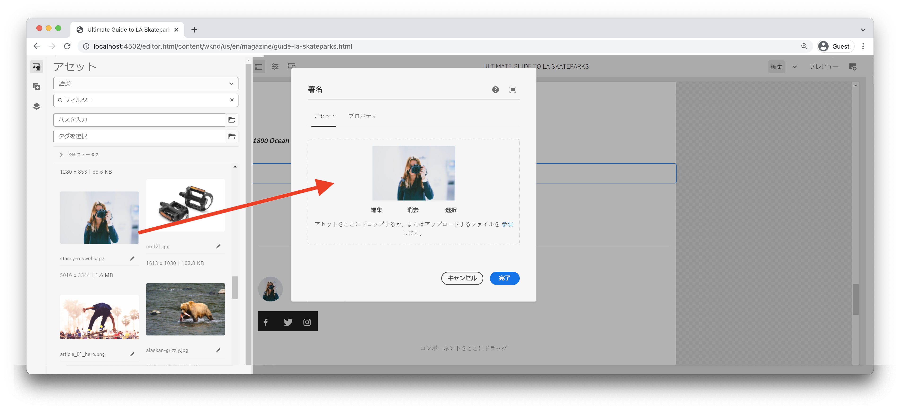

# カスタムコンポーネント {#custom-component}

このチュートリアルでは、ダイアログで作成されたコンテンツを表示するカスタム `Byline` AEM コンポーネントのエンドツーエンドでの作成について説明し、コンポーネントの HTL に入力するビジネス ロジックをカプセル化する Sling モデルの開発について説明します。

## 前提条件 {#prerequisites}

[ローカル開発環境](overview.md#local-dev-environment)を設定するために必要なツールや説明を確認します。

### スタータープロジェクト

>[!NOTE]
>
> 前の章を正常に完了した場合は、プロジェクトを再利用して、スタータープロジェクトをチェックアウトする手順をスキップできます。

チュートリアルの作成元となるベースラインコードをチェックアウトします。

1. [GitHub](https://github.com/adobe/aem-guides-wknd)の `tutorial/custom-component-start` ブランチをチェックアウトします。

   ```shell
   $ cd aem-guides-wknd
   $ git checkout tutorial/custom-component-start
   ```

1. Maven スキルを使用して、ローカル AEM インスタンスにコードベースをデプロイします。

   ```shell
   $ mvn clean install -PautoInstallSinglePackage
   ```

   >[!NOTE]
   >
   > AEM 6.5 または 6.4 を使用している場合は、任意の Maven コマンドに `classic` プロファイルを追加します。

   ```shell
   $ mvn clean install -PautoInstallSinglePackage -Pclassic
   ```

いつでも、完成したコードを [GitHub](https://github.com/adobe/aem-guides-wknd/tree/tutorial/custom-component-solution) で確認したり、ブランチ `tutorial/custom-component-solution` に切り替えてローカルにチェックアウトしたりできます。

## 目的

1. カスタム AEM コンポーネントの作成方法を理解します。
1. Sling モデルを使用してビジネスロジックをカプセル化する方法を学びます。
1. HTL スクリプト内から Sling モデルを使用する方法を理解します。

## 作ろうとしているもの {#what-build}

WKND チュートリアルのこのパートでは、記事の投稿者に関する作成済みの情報を表示するために使用する署名コンポーネントを作成します。


*署名コンポーネント*

署名コンポーネントの実装には、署名コンテンツを収集するダイアログと、次のような詳細を取得するカスタム Sling モデルが含まれます。

* 名前
* 画像
* 職業

## 署名コンポーネントの作成 {#create-byline-component}

最初に、署名コンポーネントノード構造を作成し、ダイアログを定義します。これは、AEM のコンポーネントを表し、JCR 内のその場所によってコンポーネントのリソースタイプを暗黙的に定義します。

ダイアログは、コンテンツ作成者が提供できるインターフェイスを表示します。この実装では、AEM WCM コアコンポーネントの&#x200B;**画像**&#x200B;コンポーネントを署名の画像のオーサリングとレンダリングの処理に活用し、このコンポーネントの `sling:resourceSuperType` として設定します。

### コンポーネント定義の作成 {#create-component-definition}

1. **ui.apps** モジュールで、`/apps/wknd/components` に移動し、`byline` という名前のフォルダーを作成します。
1. `byline` フォルダー内に、`.content.xml` という名前のファイルを追加します。

   

1. `.content.xml` ファイルに以下を入力します。

   ```xml
   <?xml version="1.0" encoding="UTF-8"?>
       <jcr:root xmlns:sling="http://sling.apache.org/jcr/sling/1.0" xmlns:cq="http://www.day.com/jcr/cq/1.0" xmlns:jcr="http://www.jcp.org/jcr/1.0"
       jcr:primaryType="cq:Component"
       jcr:title="Byline"
       jcr:description="Displays a contributor's byline."
       componentGroup="WKND Sites Project - Content"
       sling:resourceSuperType="core/wcm/components/image/v2/image"/>
   ```

   上記の XML ファイルは、タイトル、説明、グループを含む、コンポーネントの定義を提供します。`sling:resourceSuperType` は、[コア画像コンポーネント](https://experienceleague.adobe.com/docs/experience-manager-core-components/using/wcm-components/image.html?lang=ja)である `core/wcm/components/image/v2/image` を指します。

### HTL スクリプトの作成 {#create-the-htl-script}

1. `byline` フォルダー内に、コンポーネントの HTML 表示を担当するファイル `byline.html` を追加します。ファイルにフォルダーと同じ名前を付けることは重要です。Sling がこのリソースタイプをレンダリングする際に使用するデフォルトのスクリプトになるからです。

1. 以下のコードを `byline.html` に追加します。

   ```html
   <!--/* byline.html */-->
   <div data-sly-use.placeholderTemplate="core/wcm/components/commons/v1/templates.html">
   </div>
   <sly data-sly-call="${placeholderTemplate.placeholder @ isEmpty=true}"></sly>
   ```

`byline.html` は、Sling モデルを作成したら、[後で再検討](#byline-htl)します。HTL ファイルの現在の状態により、コンポーネントをページにドラッグ＆ドロップしたときに、AEM Sites のページ エディターでコンポーネントを空の状態で表示できます。

### ダイアログ定義の作成 {#create-the-dialog-definition}

次に、以下のフィールドを含む、署名コンポーネント用のダイアログを定義します。

* **名前**：寄稿者の名前のテキストフィールド。
* **画像**：寄稿者の自己紹介写真への参照。
* **職業**：寄稿者に起因する職業のリスト。職業は、アルファベットの昇順（a～z）で並べ替えられる必要があります。

1. `byline` フォルダーで、`_cq_dialog` という名前のフォルダーを作成します。
1. `byline/_cq_dialog` 内で、`.content.xml` という名前のファイルを追加します。これは、ダイアログの XML 定義です。 次の XML コードを追加します。

   ```xml
   <?xml version="1.0" encoding="UTF-8"?>
   <jcr:root xmlns:sling="http://sling.apache.org/jcr/sling/1.0" xmlns:cq="http://www.day.com/jcr/cq/1.0" xmlns:jcr="http://www.jcp.org/jcr/1.0" xmlns:nt="http://www.jcp.org/jcr/nt/1.0"
           jcr:primaryType="nt:unstructured"
           jcr:title="Byline"
           sling:resourceType="cq/gui/components/authoring/dialog">
       <content
               jcr:primaryType="nt:unstructured"
               sling:resourceType="granite/ui/components/coral/foundation/container">
           <items jcr:primaryType="nt:unstructured">
               <tabs
                       jcr:primaryType="nt:unstructured"
                       sling:resourceType="granite/ui/components/coral/foundation/tabs"
                       maximized="{Boolean}false">
                   <items jcr:primaryType="nt:unstructured">
                       <asset
                               jcr:primaryType="nt:unstructured"
                               sling:hideResource="{Boolean}false"/>
                       <metadata
                               jcr:primaryType="nt:unstructured"
                               sling:hideResource="{Boolean}true"/>
                       <properties
                               jcr:primaryType="nt:unstructured"
                               jcr:title="Properties"
                               sling:resourceType="granite/ui/components/coral/foundation/container"
                               margin="{Boolean}true">
                           <items jcr:primaryType="nt:unstructured">
                               <columns
                                       jcr:primaryType="nt:unstructured"
                                       sling:resourceType="granite/ui/components/coral/foundation/fixedcolumns"
                                       margin="{Boolean}true">
                                   <items jcr:primaryType="nt:unstructured">
                                       <column
                                               jcr:primaryType="nt:unstructured"
                                               sling:resourceType="granite/ui/components/coral/foundation/container">
                                           <items jcr:primaryType="nt:unstructured">
                                               <name
                                                       jcr:primaryType="nt:unstructured"
                                                       sling:resourceType="granite/ui/components/coral/foundation/form/textfield"
                                                       emptyText="Enter the contributor's name to display."
                                                       fieldDescription="The contributor's name to display."
                                                       fieldLabel="Name"
                                                       name="./name"
                                                       required="{Boolean}true"/>
                                               <occupations
                                                       jcr:primaryType="nt:unstructured"
                                                       sling:resourceType="granite/ui/components/coral/foundation/form/multifield"
                                                       fieldDescription="A list of the contributor's occupations."
                                                       fieldLabel="Occupations"
                                                       required="{Boolean}false">
                                                   <field
                                                           jcr:primaryType="nt:unstructured"
                                                           sling:resourceType="granite/ui/components/coral/foundation/form/textfield"
                                                           emptyText="Enter an occupation"
                                                           name="./occupations"/>
                                               </occupations>
                                           </items>
                                       </column>
                                   </items>
                               </columns>
                           </items>
                       </properties>
                   </items>
               </tabs>
           </items>
       </content>
   </jcr:root>
   ```

   これらのダイアログノード定義は、[Sling Resource Merger](https://sling.apache.org/documentation/bundles/resource-merger.html) を使用して、`sling:resourceSuperType` コンポーネント（この場合は **コアコンポーネントの画像コンポーネント**）から継承されるダイアログタブを制御します。

   

### ポリシーダイアログの作成 {#create-the-policy-dialog}

ダイアログ作成と同じ方法でポリシーダイアログ（以前のデザインダイアログ）を作成して、コアコンポーネントの画像コンポーネントから継承されたポリシー設定の不要なフィールドを非表示にします。

1. `byline` フォルダーで、`_cq_design_dialog` という名前のフォルダーを作成します。
1. `byline/_cq_design_dialog` 内で、`.content.xml` という名前のファイルを追加します。ファイルを次のように更新します。次の XML を使用します。 `.content.xml` を開いて、以下の XML をコピー＆ペーストすると簡単です。

   ```xml
   <?xml version="1.0" encoding="UTF-8"?>
   <jcr:root xmlns:sling="http://sling.apache.org/jcr/sling/1.0" xmlns:granite="http://www.adobe.com/jcr/granite/1.0" xmlns:cq="http://www.day.com/jcr/cq/1.0" xmlns:jcr="http://www.jcp.org/jcr/1.0" xmlns:nt="http://www.jcp.org/jcr/nt/1.0"
       jcr:primaryType="nt:unstructured"
       jcr:title="Byline"
       sling:resourceType="cq/gui/components/authoring/dialog">
       <content
               jcr:primaryType="nt:unstructured">
           <items jcr:primaryType="nt:unstructured">
               <tabs
                       jcr:primaryType="nt:unstructured">
                   <items jcr:primaryType="nt:unstructured">
                       <properties
                               jcr:primaryType="nt:unstructured">
                           <items jcr:primaryType="nt:unstructured">
                               <content
                                       jcr:primaryType="nt:unstructured">
                                   <items jcr:primaryType="nt:unstructured">
                                       <decorative
                                               jcr:primaryType="nt:unstructured"
                                               sling:hideResource="{Boolean}true"/>
                                       <altValueFromDAM
                                               jcr:primaryType="nt:unstructured"
                                               sling:hideResource="{Boolean}true"/>
                                       <titleValueFromDAM
                                               jcr:primaryType="nt:unstructured"
                                               sling:hideResource="{Boolean}true"/>
                                       <displayCaptionPopup
                                               jcr:primaryType="nt:unstructured"
                                               sling:hideResource="{Boolean}true"/>
                                       <disableUuidTracking
                                               jcr:primaryType="nt:unstructured"
                                               sling:hideResource="{Boolean}true"/>
                                   </items>
                               </content>
                           </items>
                       </properties>
                       <features
                               jcr:primaryType="nt:unstructured">
                           <items jcr:primaryType="nt:unstructured">
                               <content
                                       jcr:primaryType="nt:unstructured">
                                   <items jcr:primaryType="nt:unstructured">
                                       <accordion
                                               jcr:primaryType="nt:unstructured">
                                           <items jcr:primaryType="nt:unstructured">
                                               <orientation
                                                       jcr:primaryType="nt:unstructured"
                                                       sling:hideResource="{Boolean}true"/>
                                               <crop
                                                       jcr:primaryType="nt:unstructured"
                                                       sling:hideResource="{Boolean}true"/>
                                           </items>
                                       </accordion>
                                   </items>
                               </content>
                           </items>
                       </features>
                   </items>
               </tabs>
           </items>
       </content>
   </jcr:root>
   ```

   上記の&#x200B;**ポリシー ダイアログ** XML の基礎は、[コアコンポーネント画像コンポーネント](https://github.com/adobe/aem-core-wcm-components/blob/main/content/src/content/jcr_root/apps/core/wcm/components/image/v2/image/_cq_design_dialog/.content.xml)から取得されました。

   ダイアログ設定と同様に、[Sling Resource Merger](https://sling.apache.org/documentation/bundles/resource-merger.html) は、`sling:hideResource="{Boolean}true"` プロパティを持つノード定義で見られるように、それ以外の場合は `sling:resourceSuperType` から継承される無関係なフィールドを非表示にするために使用されます。

### コードのデプロイ {#deploy-the-code}

1. IDE または Maven スキルを使用して、`ui.apps` の変更を同期します。

   

## このコンポーネントをページに追加 {#add-the-component-to-a-page}

物事をシンプルにし、AEM コンポーネントの開発に集中するために、署名コンポーネントを現在の状態で記事ページに追加して、`cq:Component` ノードの定義が正しいことを確認します。また、AEMが新しいコンポーネント定義を認識し、コンポーネントのダイアログがオーサリングに使用できることも確認します。

### AEM Assets への画像の追加

まず、サンプルのヘッドショットを AEM Assets にアップロードして、署名コンポーネントに画像を入力する際に使用します。

1. AEM Assets の LA Skateparks フォルダーに移動します。 [http://localhost:4502/assets.html/content/dam/wknd/en/magazine/la-skateparks](http://localhost:4502/assets.html/content/dam/wknd/en/magazine/la-skateparks)。

1. **[stacey-roswells.jpg](assets/custom-component/stacey-roswells.jpg)** 用のヘッドショットをフォルダーにアップロードします。

   

### コンポーネントの作成 {#author-the-component}

次に、署名コンポーネントを AEM のページに追加します。 署名コンポーネントが **WKND Sites Project - コンテンツ**&#x200B;コンポーネントグループに `ui.apps/src/main/content/jcr_root/apps/wknd/components/byline/.content.xml` 定義を介して追加されるため、**ポリシー**&#x200B;が **WKND Sites Project - コンテンツ**&#x200B;コンポーネントグループを許可する&#x200B;**コンテナ**&#x200B;で自動的に利用可能になります。したがって、記事ページのレイアウトコンテナで使用できます。

1. 以下の場所の LA Skatepark の記事に移動します。[http://localhost:4502/editor.html/content/wknd/us/en/magazine/guide-la-skateparks.html](http://localhost:4502/editor.html/content/wknd/us/en/magazine/guide-la-skateparks.html)

1. 左側のサイドバーから&#x200B;**署名コンポーネント**&#x200B;を、開いている記事ページのレイアウトコンテナの&#x200B;**下部**&#x200B;にドラッグ＆ドロップします。

   

1. 左側のサイドバーが開いていて&#x200B;**表示されていることと、**&#x200B;アセットファインダー** が選択されていることを確認します。

1. **署名コンポーネントプレースホルダー**&#x200B;を選択すると、アクションバーが表示されます。**レンチ**&#x200B;アイコンをタップしてダイアログを開きます。

1. ダイアログが開いていて、最初のタブ（アセット）がアクティブな状態のとき、左側のサイドバーを開いて、画像をアセットファインダーから画像ドロップゾーンにドラッグ＆ドロップします。「stacey」を検索して、WKND ui.content パッケージで提供されている Stacey Roswells のバイオ写真を見つけます。

   

1. 画像を追加したら、「**プロパティ**」タブをクリックして「**名前**」および「**職業**」に入力します。

   職業を入力する場合、**逆アルファベット**&#x200B;順に入力します。これにより、Sling Model に実装されているアルファベット順のビジネスロジックが検証されます。

   右下の「**完了**」ボタンを使用して、変更内容を保存します。

   

   AEM オーサーは、ダイアログを介してコンポーネントを設定および作成します。署名コンポーネント開発のこの時点では、ダイアログは、データの収集に含まれますが、作成したコンテンツをレンダリングするためのロジックはまだ追加されていません。したがって、プレースホルダーのみが表示されます。

1. ダイアログを保存したら、[CRXDE Lite](http://localhost:4502/crx/de/index.jsp#/content/wknd/us/en/magazine/guide-la-skateparks/jcr%3Acontent/root/container/container/byline) に移動して、コンポーネントのコンテンツが AEM ページの下にある署名コンポーネントコンテンツノードにどのように保存されるかを確認します。

   LA Skate Parks ページ（`/content/wknd/us/en/magazine/guide-la-skateparks/jcr:content/root/container/container/byline`）の下に、署名コンポーネントのコンテンツノードを見つけます。

   プロパティ名 `name`、`occupations` および `fileReference` が **署名ノード** に保存されていることにご注意ください。

   また、ノードの `sling:resourceType` が `wknd/components/content/byline` に設定されていることに注意してください。これは、このコンテンツノードを署名コンポーネントの実装にバインドするものです。

   

## 署名 Sling Model の作成 {#create-sling-model}

次に、データモデルとして機能する Sling Model を作成し、署名コンポーネントのビジネスロジックを格納します。

Sling Model は、JCR から Java™ 変数へのデータのマッピングを容易にし、AEM コンテキストでの開発時に効率を提供する、注釈駆動型の Java™ POJO（Plain Old Java™ Objects）です。

### Maven の依存関係の確認 {#maven-dependency}

署名 Sling Model は、AEM が提供する複数の Java™ API に依存しています。 これらの API は、`core` モジュールの POM ファイルにリストされている `dependencies` を介して利用可能になります。このチュートリアルに使用するプロジェクトは、AEM as a Cloud Service 用に作成されています。 ただし、AEM 6.5 および 6.4 と下位互換性があるため、独自のものです。 したがって、Cloud Service と AEM 6.x の両方の依存関係が含まれています。

1. `<src>/aem-guides-wknd/core/pom.xml` の下にある `pom.xml` ファイルを開きます。
1. `aem-sdk-api` の依存関係を検索します - **AEM as a Cloud Service のみ**

   ```xml
   <dependency>
       <groupId>com.adobe.aem</groupId>
       <artifactId>aem-sdk-api</artifactId>
   </dependency>
   ```

   [aem-sdk-api](https://experienceleague.adobe.com/docs/experience-manager-cloud-service/content/implementing/developing/aem-as-a-cloud-service-sdk.html?lang=ja) には、AEM で公開されるすべてのパブリック Java™ API が含まれています。 `aem-sdk-api` は、このプロジェクトを作成する際にデフォルトで使用されます。 バージョンは、`aem-guides-wknd/pom.xml` にあるプロジェクトのルートから、親リアクター POM に保持されます。 

1. `uber-jar` の依存関係を検索します - **AEM 6.5 および 6.4 のみ**

   ```xml
   ...
       <dependency>
           <groupId>com.adobe.aem</groupId>
           <artifactId>uber-jar</artifactId>
           <classifier>apis</classifier>
       </dependency>
   ...
   ```

   `uber-jar` が含まれるのは、`classic` プロファイルが呼び出された場合、すなわち `mvn clean install -PautoInstallSinglePackage -Pclassic` の場合のみです。これもまた、このプロジェクトに独自のものです。 AEM プロジェクトアーキタイプから生成される実際のプロジェクトでは、指定した AEM のバージョンが 6.5 または 6.4 の場合、`uber-jar` がデフォルトです。

   [uber-jar](https://experienceleague.adobe.com/docs/experience-manager-65/developing/devtools/ht-projects-maven.html?lang=ja#experience-manager-api-dependencies) には、AEM 6.x で公開されているすべてのパブリック Java™ API が含まれています。バージョンは、プロジェクトのルート `aem-guides-wknd/pom.xml` から親リアクター POM に保持されます。

1. `core.wcm.components.core` の依存関係を検索します。

   ```xml
    <!-- Core Component Dependency -->
       <dependency>
           <groupId>com.adobe.cq</groupId>
           <artifactId>core.wcm.components.core</artifactId>
       </dependency>
   ```

   これは、AEM コアコンポーネントによって公開される完全なパブリック Java™ API です。 AEM コアコンポーネントは、AEM の外部で維持されるプロジェクトであるため、個別のリリースサイクルがあります。このため、これは個別に含める必要がある依存関係であり、`uber-jar` や `aem-sdk-api` と併せて含まれるものでは&#x200B;**ありません**。

   uber-jar と同様に、この依存関係のバージョンは、`aem-guides-wknd/pom.xml` の親リアクター POM ファイルに保持されます。

   このチュートリアルの後半では、コアコンポーネント画像クラスを使用して、署名コンポーネントに画像を表示します。Sling Model を作成してコンパイルするには、コアコンポーネントの依存関係が必要です。

### 署名インターフェイス {#byline-interface}

署名用のパブリック Java™ インターフェイスを作成します。`Byline.java` は、`byline.html` HTL スクリプトを実行するために必要なパブリックメソッドを定義します。

1. 内部では、`core/src/main/java/com/adobe/aem/guides/wknd/core/models` フォルダー内の `core` モジュールが `Byline.java` という名前のファイルを作成します。

   

1. 以下のメソッドで `Byline.java` を更新します。

   ```java
   package com.adobe.aem.guides.wknd.core.models;
   
   import java.util.List;
   
   /**
   * Represents the Byline AEM Component for the WKND Site project.
   **/
   public interface Byline {
       /***
       * @return a string to display as the name.
       */
       String getName();
   
       /***
       * Occupations are to be sorted alphabetically in a descending order.
       *
       * @return a list of occupations.
       */
       List<String> getOccupations();
   
       /***
       * @return a boolean if the component has enough content to display.
       */
       boolean isEmpty();
   }
   ```

   最初の 2 つのメソッドは、署名コンポーネントの&#x200B;**名前**&#x200B;と&#x200B;**職業**&#x200B;の値を公開します。

   `isEmpty()` メソッドは、コンポーネントにレンダリングするコンテンツがあるかどうか、または設定されるのを待っているかどうかを判定するために使用されます。

   画像に対応するメソッドがないことに注意します。[これは後に確認します](#tackling-the-image-problem)。

1. パブリック Java™ クラスを含む Java™ パッケージ（この場合は Sling Model）は、パッケージの `package-info.java` ファイルを使用してバージョン管理する必要があります。

   WKND ソースの Java™ パッケージ `com.adobe.aem.guides.wknd.core.models` は `1.0.0` のバージョンを宣言しており、非改行のパブリックインターフェイスとメソッドが追加されているため、バージョンを `1.1.0` に上げる必要があります。`core/src/main/java/com/adobe/aem/guides/wknd/core/models/package-info.java` に置かれたファイルを開き、`@Version("1.0.0")` を `@Version("2.1.0")` に更新します。

   ```
   @Version("2.1.0")
   package com.adobe.aem.guides.wknd.core.models;
   
   import org.osgi.annotation.versioning.Version;
   ```

このパッケージ内のファイルに変更が加えられるたびに、[パッケージバージョンを意味的に調整する必要があります](https://semver.org/)。調整しない場合、Maven プロジェクトの [bnd-baseline-maven-plugin](https://github.com/bndtools/bnd) は無効なパッケージバージョンを検出し、ビルドを中断します。幸いなことに、失敗すると、Maven プラグインは無効な Java™ パッケージバージョンと、本来あるべきバージョンを報告します。違反する Java™ パッケージの `package-info.java` にある `@Version("...")` 宣言を、プラグインが修正を推奨するバージョンに更新します。

### 署名の実装 {#byline-implementation}

`BylineImpl.java` は、前に定義した `Byline.java` インターフェイスを実装する Sling Model の実装です。`BylineImpl.java` の完全なコードは、この節の最後に記載しています。

1. `core/src/main/java/com/adobe/aem/guides/core/models` の下に `impl` という名前のフォルダーを作成します。
1. `impl` フォルダーに、ファイル `BylineImpl.java` を作成します。

   

1. `BylineImpl.java` を開きます。`Byline` インターフェイスを実装することを指定します。IDE のオートコンプリート機能を使用するか、ファイルを手動で更新して `Byline` インターフェースを実装するために必要なメソッドを含めます。

   ```java
   package com.adobe.aem.guides.wknd.core.models.impl;
   import java.util.List;
   import com.adobe.aem.guides.wknd.core.models.Byline;
   
   public class BylineImpl implements Byline {
   
       @Override
       public String getName() {
           // TODO Auto-generated method stub
           return null;
       }
   
       @Override
       public List<String> getOccupations() {
           // TODO Auto-generated method stub
           return null;
       }
   
       @Override
       public boolean isEmpty() {
           // TODO Auto-generated method stub
           return false;
       }
   }
   ```

1. 以下のクラスレベルの注釈で `BylineImpl.java` を更新して、Sling Model 注釈を追加します。`@Model(..)` 注釈は、クラスを Sling Model に変換するものです。

   ```java
   import org.apache.sling.api.SlingHttpServletRequest;
   import org.apache.sling.models.annotations.Model;
   import org.apache.sling.models.annotations.DefaultInjectionStrategy;
   ...
   @Model(
           adaptables = {SlingHttpServletRequest.class},
           adapters = {Byline.class},
           resourceType = {BylineImpl.RESOURCE_TYPE},
           defaultInjectionStrategy = DefaultInjectionStrategy.OPTIONAL
   )
   public class BylineImpl implements Byline {
       protected static final String RESOURCE_TYPE = "wknd/components/byline";
       ...
   }
   ```

   この注釈とそのパラメーターを確認してみましょう。

   * `@Model` 注釈は、AEM にデプロイされる際に、BylineImpl を Sling Model として登録します。
   * `adaptables` パラメーターは、このモデルがリクエストによって適合できることを指定します。
   * `adapters` パラメーターを使用すると、実装クラスを署名インターフェイスの下に登録できます。これにより、HTL スクリプトは（実装を直接呼び出すのではなく）インターフェイスを介して Sling Model を呼び出すことができます。アダプターについて詳しくは、[こちら](https://sling.apache.org/documentation/bundles/models.html#specifying-an-alternate-adapter-class-since-110)を参照してください。
   * `resourceType` は（既に作成した）署名コンポーネントリソースタイプを指し、複数の実装がある場合に正しいモデルを解決するのに役立ちます。[モデルクラスのリソースタイプとの関連付けについて詳しくは、こちらを参照してください](https://sling.apache.org/documentation/bundles/models.html#associating-a-model-class-with-a-resource-type-since-130)。

### Sling Model メソッドの実装 {#implementing-the-sling-model-methods}

#### getName() {#implementing-get-name}

最初に実装されるメソッドは `getName()` です。これは、単にプロパティ `name` の下にある署名の JCR コンテンツノードに保存された値を返します。

この場合、`@ValueMapValue` Sling モデル注釈を使用して、リクエストのリソースの ValueMap を使用して Java™ フィールドに値を挿入します。


```java
import org.apache.sling.models.annotations.injectorspecific.ValueMapValue;

public class BylineImpl implements Byline {
    ...
    @ValueMapValue
    private String name;

    ...
    @Override
    public String getName() {
        return name;
    }
    ...
}
```

JCR プロパティは Java™ フィールドと同じ名前（どちらも「名前」）を共有するため、`@ValueMapValue` はこの関連付けを自動的に解決し、プロパティの値を Java™ フィールドに挿入します。

#### getOccupations() {#implementing-get-occupations}

次に実装するメソッドは `getOccupations()` です。このメソッドは、JCR プロパティ `occupations` に保存されている職業を読み込み、（アルファベット順に）並べ替えられたコレクションを返します。

`getName()` で説明した手法と同じ手法を使用して、プロパティ値を Sling モデルのフィールドに挿入できます。

挿入した Java™ フィールド `occupations` を介して Sling モデルで JCR プロパティ値が使用できるようになると、並べ替えられたビジネスロジックを `getOccupations()` メソッドで適用できるようになります。


```java
import java.util.ArrayList;
import java.util.Collections;
  ...

public class BylineImpl implements Byline {
    ...
    @ValueMapValue
    private List<String> occupations;
    ...
    @Override
    public List<String> getOccupations() {
        if (occupations != null) {
            Collections.sort(occupations);
            return new ArrayList<String>(occupations);
        } else {
            return Collections.emptyList();
        }
    }
    ...
}
  ...
```


#### isEmpty() {#implementing-is-empty}

最後のパブリックメソッドは `isEmpty()` です。これによって、コンポーネント自体がレンダリングするのに十分な状態かどうかを検討すべきタイミングを判定します。

このコンポーネントの場合、ビジネス要件は 3 つのフィールドすべてになります。コンポーネントをレンダリングする&#x200B;*前に*、`name, image and occupations` を入力する必要があります。


```java
import org.apache.commons.lang3.StringUtils;
  ...
public class BylineImpl implements Byline {
    ...
    @Override
    public boolean isEmpty() {
        if (StringUtils.isBlank(name)) {
            // Name is missing, but required
            return true;
        } else if (occupations == null || occupations.isEmpty()) {
            // At least one occupation is required
            return true;
        } else if (/* image is not null, logic to be determined */) {
            // A valid image is required
            return true;
        } else {
            // Everything is populated, so this component is not considered empty
            return false;
        }
    }
    ...
}
```


#### 「画像の問題」への対処 {#tackling-the-image-problem}

名前と職業の条件を確認するのは簡単で、Apache Commons Lang3 の便利な [StringUtils](https://commons.apache.org/proper/commons-lang/apidocs/org/apache/commons/lang3/StringUtils.html) クラスを使用します。ただし、コアコンポーネントの画像コンポーネントを使用して画像を表示するため、**画像の存在**&#x200B;の検証方法は不明確です。

これに対処するには、2 つの方法があります。

`fileReference` JCR プロパティがアセットを解決しているかどうかを確認します。*または*、このリソースをコアコンポーネント画像の Sling モデルに変換し、`getSrc()` メソッドが空でないことを確認します。

**2 番目**&#x200B;の方法を使用してみましょう。最初の方法でおそらく十分ですが、このチュートリアルでは、後者を使用して Sling モデルのその他の機能を確認します。

1. 画像を取得するプライベートメソッドを作成します。このメソッドをプライベートにしておくのは、HTL 自体の画像オブジェクトを公開する必要がなく、`isEmpty().` を実行するためにのみ使用するからです

   `getImage()` に次のプライベートメソッドを追加します。

   ```java
   import com.adobe.cq.wcm.core.components.models.Image;
   ...
   private Image getImage() {
       Image image = null;
       // Figure out how to populate the image variable!
       return image;
   }
   ```

   上記のように、**画像 Sling モデル**&#x200B;の取得には、さらに 2 つの方法があります。

   1 番目は、`@Self` 注釈を使用して、現在のリクエストをコアコンポーネントの `Image.class` に自動的に適合させる方法です。

   2 番目は、[Apache Sling ModelFactory](https://sling.apache.org/apidocs/sling10/org/apache/sling/models/factory/ModelFactory.html) OSGi サービスを使用する方法です。これは非常に便利なサービスで、Java™ コードでその他のタイプの Sling モデルを作成するのに役立ちます。

   2 番目の方法を使用してみましょう。

   >[!NOTE]
   >
   >実際の実装では、よりシンプルで洗練されたソリューションである、`@Self` を使用した 1 番目の方法をお勧めします。このチュートリアルでは、より複雑なコンポーネントである有用な Sling モデルでより多くのファセットを探索する必要があるため、2 番目の方法を使用します。

   Sling Model は OSGi サービスではなく Java™ POJO なので、通常の OSGi 挿入注釈は使用`@Reference`**できません**。代わりに、Sling モデルでは、類似の機能を提供する特別な **[@OSGiService](https://sling.apache.org/documentation/bundles/models.html#injector-specific-annotations)** 注釈を使用します。

1. `BylineImpl.java` を更新して `OSGiService` 注釈を含め、`ModelFactory` を挿入します。

   ```java
   import org.apache.sling.models.factory.ModelFactory;
   import org.apache.sling.models.annotations.injectorspecific.OSGiService;
   ...
   public class BylineImpl implements Byline {
       ...
       @OSGiService
       private ModelFactory modelFactory;
   }
   ```

   `ModelFactory` が使用可能になったら、次を使用してコアコンポーネントの画像 Sling モデルを作成できます。

   ```java
   modelFactory.getModelFromWrappedRequest(SlingHttpServletRequest request, Resource resource, java.lang.Class<T> targetClass)
   ```

   ただし、このメソッドにはリクエストとリソースの両方が必要で、Sling モデルではまだ使用できません。これらを取得するには、より多くの Sling モデル注釈を使用します。

   現在のリクエストを取得するには、**[@Self](https://sling.apache.org/documentation/bundles/models.html#injector-specific-annotations)** 注釈を使用して、`@Model(..)` で `SlingHttpServletRequest.class` として定義されている `adaptable` を Java™ クラスフィールドに挿入します。

1. **@Self** 注釈を追加して、**SlingHttpServletRequest リクエスト**&#x200B;を取得します。

   ```java
   import org.apache.sling.models.annotations.injectorspecific.Self;
   ...
   @Self
   private SlingHttpServletRequest request;
   ```

   前述のとおり、`@Self Image image` を使用したコアコンポーネントの画像 Sling モデルの挿入はオプションです。`@Self` 注釈は、適応可能なオブジェクト（この場合は SlingHttpServletRequest）を挿入し、注釈フィールドタイプに適応しようとします。コアコンポーネントの画像 Sling モデルは SlingHttpServletRequest オブジェクトから適応可能であるため、これはうまく機能し、より説明的な `modelFactory` の方法よりも少ないコードで済みます。

   これで、ModelFactory API を使用して画像モデルをインスタンス化するために必要な変数が挿入されます。次に、Sling モデルの **[@PostConstruct](https://sling.apache.org/documentation/bundles/models.html#postconstruct-methods)** 注釈を使用して、Sling モデルをインスタンス化した後で、このオブジェクトを取得します。

   `@PostConstruct` は非常に便利で、コンストラクターと同じ機能で動作しますが、クラスがインスタンス化され、すべての注釈が設定された Java フィールドが挿入された後で呼び出されます。その他の Sling モデル注釈が Java クラスフィールド（変数）に注釈を付けるのに対して、`@PostConstruct` は、通常は `init()` という名前（ただしどのような名前でも可）の無効なゼロパラメーターメソッドに注釈を付けます。

1. **@PostConstruct** メソッドを追加します。

   ```java
   import javax.annotation.PostConstruct;
   ...
   public class BylineImpl implements Byline {
       ...
       private Image image;
   
       @PostConstruct
       private void init() {
           image = modelFactory.getModelFromWrappedRequest(request,
                                                           request.getResource(),
                                                           Image.class);
       }
       ...
   }
   ```

   Sling モデルは OSGi サービス&#x200B;**ではない**&#x200B;ので、クラスの状態を安全に管理できます。多くの場合、`@PostConstruct` は、プレーンコンストラクターと同様に、後で使用するために Sling モデルクラスの状態を派生させて設定します。

   `@PostConstruct` メソッドで例外がスローされた場合、Sling モデルはインスタンス化されず、null になります。

1. **getImage()** が更新されて、Image オブジェクトを返すことができるようになりました。

   ```java
   /**
       * @return the Image Sling Model of this resource, or null if the resource cannot create a valid Image Sling Model.
   */
   private Image getImage() {
       return image;
   }
   ```

1. 次に `isEmpty()` に戻り、実装を完了させます。

   ```java
   @Override
   public boolean isEmpty() {
      final Image componentImage = getImage();
   
       if (StringUtils.isBlank(name)) {
           // Name is missing, but required
           return true;
       } else if (occupations == null || occupations.isEmpty()) {
           // At least one occupation is required
           return true;
       } else if (componentImage == null || StringUtils.isBlank(componentImage.getSrc())) {
           // A valid image is required
           return true;
       } else {
           // Everything is populated, so this component is not considered empty
           return false;
       }
   }
   ```

   `getImage()` に対する複数の呼び出しは、初期化された `image` クラス変数が返され、`modelFactory.getModelFromWrappedRequest(...)` を呼び出さないので、それほどコストがかかるわけではなく、問題になりませんが、不要な呼び出しは避けるべきです。

1. 最終的な `BylineImpl.java` は以下のようになります。


   ```java
   package com.adobe.aem.guides.wknd.core.models.impl;
   
   import java.util.ArrayList;
   import java.util.Collections;
   import java.util.List;
   import javax.annotation.PostConstruct;
   import org.apache.commons.lang3.StringUtils;
   import org.apache.sling.api.SlingHttpServletRequest;
   import org.apache.sling.models.annotations.DefaultInjectionStrategy;
   import org.apache.sling.models.annotations.Model;
   import org.apache.sling.models.annotations.injectorspecific.OSGiService;
   import org.apache.sling.models.annotations.injectorspecific.Self;
   import org.apache.sling.models.annotations.injectorspecific.ValueMapValue;
   import org.apache.sling.models.factory.ModelFactory;
   import com.adobe.aem.guides.wknd.core.models.Byline;
   import com.adobe.cq.wcm.core.components.models.Image;
   
   @Model(
           adaptables = {SlingHttpServletRequest.class},
           adapters = {Byline.class},
           resourceType = {BylineImpl.RESOURCE_TYPE},
           defaultInjectionStrategy = DefaultInjectionStrategy.OPTIONAL
   )
   public class BylineImpl implements Byline {
       protected static final String RESOURCE_TYPE = "wknd/components/byline";
   
       @Self
       private SlingHttpServletRequest request;
   
       @OSGiService
       private ModelFactory modelFactory;
   
       @ValueMapValue
       private String name;
   
       @ValueMapValue
       private List<String> occupations;
   
       private Image image;
   
       /**
       * @PostConstruct is immediately called after the class has been initialized
       * but BEFORE any of the other public methods. 
       * It is a good method to initialize variables that is used by methods in the rest of the model
       *
       */
       @PostConstruct
       private void init() {
           // set the image object
           image = modelFactory.getModelFromWrappedRequest(request, request.getResource(), Image.class);
       }
   
       @Override
       public String getName() {
           return name;
       }
   
       @Override
       public List<String> getOccupations() {
           if (occupations != null) {
               Collections.sort(occupations);
               return new ArrayList<String>(occupations);
           } else {
               return Collections.emptyList();
           }
       }
   
       @Override
       public boolean isEmpty() {
           final Image componentImage = getImage();
   
           if (StringUtils.isBlank(name)) {
               // Name is missing, but required
               return true;
           } else if (occupations == null || occupations.isEmpty()) {
               // At least one occupation is required
               return true;
           } else if (componentImage == null || StringUtils.isBlank(componentImage.getSrc())) {
               // A valid image is required
               return true;
           } else {
               // Everything is populated, so this component is not considered empty
               return false;
           }
       }
   
       /**
       * @return the Image Sling Model of this resource, or null if the resource cannot create a valid Image Sling Model.
       */
       private Image getImage() {
           return image;
       }
   }
   ```


## 署名 HTL {#byline-htl}

`ui.apps` モジュールで、AEM コンポーネントの以前の設定で作成された `/apps/wknd/components/byline/byline.html` を開きます。

```html
<div data-sly-use.placeholderTemplate="core/wcm/components/commons/v1/templates.html">
</div>
<sly data-sly-call="${placeholderTemplate.placeholder @ isEmpty=false}"></sly>
```

この HTL スクリプトで行われることを確認しましょう。

* `placeholderTemplate` は、コアコンポーネントのプレースホルダーを指します。これは、コンポーネントが完全に設定されていない場合に表示されます。これは、上記の `cq:Component` の `jcr:title` プロパティで定義されているように、AEM Sites ページエディターで、コンポーネントタイトルを含むボックスとしてレンダリングされます。

* `data-sly-call="${placeholderTemplate.placeholder @ isEmpty=false}` は、上記で定義された `placeholderTemplate` を読み込み、ブール値（現在は `false` にハードコードされている）をプレースホルダーテンプレートに渡します。`isEmpty` が true の場合、プレースホルダーテンプレートは、グレーのボックスをレンダリングし、そうでない場合は何もレンダリングしません。

### 署名 HTL の更新

1. 以下の HTML 構造の骨組みで **byline.html** を更新します。

   ```html
   <div data-sly-use.placeholderTemplate="core/wcm/components/commons/v1/templates.html"
       class="cmp-byline">
           <div class="cmp-byline__image">
               <!--/* Include the Core Components Image Component */-->
           </div>
           <h2 class="cmp-byline__name"><!--/* Include the name */--></h2>
           <p class="cmp-byline__occupations"><!--/* Include the occupations */--></p>
   </div>
   <sly data-sly-call="${placeholderTemplate.placeholder @ isEmpty=true}"></sly>
   ```

   CSS クラスは [BEM 命名規則](https://getbem.com/naming/)に従うことに注意してください。BEM 規則の使用は必須ではありませんが、コアコンポーネント CSS クラスで使用され、一般的にクリーンで読みやすい CSS ルールになるので、BEM をお勧めします。

### HTL での Sling Model オブジェクトのインスタンス化 {#instantiating-sling-model-objects-in-htl}

[Use ブロックステートメント](https://github.com/adobe/htl-spec/blob/master/SPECIFICATION.md#221-use)は、HTL スクリプトで Sling モデルオブジェクトをインスタンス化し、HTL スクリプトを HTL 変数に割り当てるために使用されます。

`data-sly-use.byline="com.adobe.aem.guides.wknd.models.Byline"` は、BylineImpl によって実装された Byline インターフェイス（com.adobe.aem.guides.wknd.models.Byline）を使用し、現在の SlingHttpServletRequest を適応させて、その結果を HTL 変数名 byline（`data-sly-use.<variable-name>`）に保存します。

1. 外側の `div` を更新して、パブリックインターフェイスで&#x200B;**署名** Sling モデルを参照します。

   ```xml
   <div data-sly-use.byline="com.adobe.aem.guides.wknd.core.models.Byline"
       data-sly-use.placeholderTemplate="core/wcm/components/commons/v1/templates.html"
       class="cmp-byline">
       ...
   </div>
   ```

### Sling モデルメソッドへのアクセス {#accessing-sling-model-methods}

HTL は JSTL から借用し、同じ Java™ getter メソッド名の短縮形を使用します。

例えば、署名 Sling モデルの `getName()` メソッドの呼び出しは `byline.name` に短縮でき、同様に `byline.isEmpty` の代わりに `byline.empty` に短縮できます。完全なメソッド名 `byline.getName` または `byline.isEmpty` を使用しても機能します。`()` は、HTL でメソッドを呼び出すために使用されません（JSTL と同様）。

パラメーターを必要とする Java™ メソッドは、HTL では使用&#x200B;**できません**。これは、HTL のロジックをシンプルにするための設計によるものです。

1. 署名 Sling モデル（HTL では `${byline.name}`）で `getName()` メソッドを呼び出すことで、署名の名前をコンポーネントに追加できます。

   `h2` タグを更新します。

   ```xml
   <h2 class="cmp-byline__name">${byline.name}</h2>
   ```

### HTL 式のオプションの使用 {#using-htl-expression-options}

[HTL 式のオプション](https://github.com/adobe/htl-spec/blob/master/SPECIFICATION.md#12-available-expression-options)は、HTL 内のコンテンツの修飾子として機能し、日付の書式設定から i18n 翻訳まで幅広く機能します。また、HTL 式は、リストや値の配列の結合に使用でき、職業をコンマ区切り形式で表示するのに必要です。

式は、HTL 式の `@` 演算子を使用して追加されます。

1. 職業のリストを「,」で結合するには、以下のコードを使用します。

   ```html
   <p class="cmp-byline__occupations">${byline.occupations @ join=', '}</p>
   ```

### プレースホルダーの条件付き表示 {#conditionally-displaying-the-placeholder}

AEM コンポーネントのほとんどの HTL スクリプトでは、**プレースホルダーパラダイム**&#x200B;を使用して、**コンポーネントが誤って作成されており AEM パブリッシュに表示されないことを作成者に視覚的に提示します**。この判断を推進するには、コンポーネントの背後の Sling モデル（この場合は `Byline.isEmpty()`）にメソッドを実装する必要があります。

この `isEmpty()` メソッドが署名 Sling モデルで呼び出され、結果（または、`!` 演算子を介した負の値）が `hasContent` という名前の HTL 変数に保存されます。

1. 外部の `div` を更新して、`hasContent` という名前の HTL 変数を保存します。

   ```html
    <div data-sly-use.byline="com.adobe.aem.guides.wknd.core.models.Byline"
         data-sly-use.placeholderTemplate="core/wcm/components/commons/v1/templates.html"
         data-sly-test.hasContent="${!byline.empty}"
         class="cmp-byline">
         ...
   </div>
   ```

   `data-sly-test` の使用に注意します。HTL `test` ブロックがキーであれば、HTL 変数を設定し、変数が存在する HTML 要素のレンダリングを行う場合と行わない場合があります。レンダリングの可否は、HTL 式評価の結果に基づきます。「true」の場合は HTML 要素をレンダリングし、そうでない場合はレンダリングしません。

   この HTL 変数 `hasContent` は、条件付きでプレースホルダーを表示／非表示するために再利用できます。

1. ファイルの下部にある `placeholderTemplate` への条件付き呼び出しを次のように更新します。

   ```html
   <sly data-sly-call="${placeholderTemplate.placeholder @ isEmpty=!hasContent}"></sly>
   ```

### コアコンポーネントを使用した画像の表示 {#using-the-core-components-image}

ここまでで、`byline.html` の HTL スクリプトはほとんど完成していますが、画像が不足しています。

`sling:resourceSuperType` は、コアコンポーネントの画像コンポーネントを指して画像を作成するため、コアコンポーネントの画像コンポーネントを使用して画像をレンダリングできます。

この場合、現在の署名リソースを含める必要がありますが、リソースタイプ `core/wcm/components/image/v2/image` を使用して、コアコンポーネントの画像コンポーネントのリソースタイプを強制します。これは、コンポーネントの再利用のための強力なパターンです。この場合、HTL の `data-sly-resource` ブロックが使用されます。

1. 次のように、`div` を `cmp-byline__image` のクラスに置換します。

   ```html
   <div class="cmp-byline__image"
       data-sly-resource="${ '.' @ resourceType = 'core/wcm/components/image/v2/image' }"></div>
   ```

   この `data-sly-resource` には、相対パス `'.'` を介して現在のリソースが含まれており、`core/wcm/components/image/v2/image` のリソースタイプで現在のリソース（または署名コンテンツリソース）を強制的に含めます。

   コアコンポーネントのリソースタイプは、スクリプト内で使用され、コンテンツに対して保持されないので、プロキシ経由ではなく直接使用されます。

2. 完成した `byline.html` を以下に示します。

   ```html
   <!--/* byline.html */-->
   <div data-sly-use.byline="com.adobe.aem.guides.wknd.core.models.Byline" 
       data-sly-use.placeholderTemplate="core/wcm/components/commons/v1/templates.html"
       data-sly-test.hasContent="${!byline.empty}"
       class="cmp-byline">
       <div class="cmp-byline__image"
           data-sly-resource="${ '.' @ resourceType = 'core/wcm/components/image/v2/image' }">
       </div>
       <h2 class="cmp-byline__name">${byline.name}</h2>
       <p class="cmp-byline__occupations">${byline.occupations @ join=', '}</p>
   </div>
   <sly data-sly-call="${placeholderTemplate.placeholder @ isEmpty=!hasContent}"></sly>
   ```

3. コードベースをローカルの AEM インスタンスにデプロイします。`core` と `ui.apps` に変更が加えられたため、両方のモジュールをデプロイする必要があります。

   ```shell
   $ cd aem-guides-wknd/ui.apps
   $ mvn clean install -PautoInstallPackage
   ```

   ```shell
   $ cd ../core
   $ mvn clean install -PautoInstallBundle
   ```

   AEM 6.5／6.4 にデプロイするには、`classic` プロファイルを呼び出します。

   ```shell
   $ cd ../core
   $ mvn clean install -PautoInstallBundle -Pclassic
   ```

   >[!CAUTION]
   >
   > また、Maven プロファイル `autoInstallSinglePackage` を使用して、ルートからプロジェクト全体を構築することもできますが、これによりページ上のコンテンツの変更が上書きされる場合があります。これは、チュートリアルのスターターコード用に `ui.content/src/main/content/META-INF/vault/filter.xml` が変更され、既存の AEM コンテンツが完全に上書きされるためです。実際のシナリオでは、これは問題ではありません。

### スタイルが設定されていない署名コンポーネントの確認 {#reviewing-the-unstyled-byline-component}

1. 更新をデプロイした後で、[Ultimate Guide to LA Skateparks](http://localhost:4502/editor.html/content/wknd/us/en/magazine/guide-la-skateparks.html) ページ、またはこの章の前半で署名コンポーネントを追加した場所に移動します。

1. **画像**、**名前**&#x200B;および&#x200B;**職業**&#x200B;が表示され、スタイルは未設定ですが、作業中の署名コンポーネントが存在します。

   

### Sling モデル登録の確認 {#reviewing-the-sling-model-registration}

[AEM Web コンソールの Sling モデルステータス表示](http://localhost:4502/system/console/status-slingmodels)には、AEM に登録されたすべての Sling モデルが表示されます。署名 Sling モデルは、このリストを確認することで、インストールされ、認識されていることを検証できます。

**BylineImpl** がこのリストに表示されない場合、Sling モデルの注釈に関する問題か、モデルがコアプロジェクトの正しいパッケージ（`com.adobe.aem.guides.wknd.core.models`）に追加されなかった可能性があります。


*<http://localhost:4502/system/console/status-slingmodels>*

## 署名のスタイル {#byline-styles}

署名コンポーネントを提供されているクリエイティブデザインに合わせるには、スタイルを設定します。これを行うには、SCSS ファイルを使用して、**ui.frontend** モジュールのファイルを更新します。

### デフォルトのスタイルを追加

署名コンポーネントのデフォルトスタイルを追加します。

1. IDE と `/src/main/webpack/components` 下の **ui.frontend** プロジェクトに戻ります：
1. `_byline.scss` という名前のファイルを作成します。

   

1. 署名実装 CSS（SCSS として記述）を `_byline.scss` に追加します：

   ```scss
   .cmp-byline {
       $imageSize: 60px;
   
       .cmp-byline__image {
           float: left;
   
       /* This class targets a Core Component Image CSS class */
       .cmp-image__image {
           width: $imageSize;
           height: $imageSize;
           border-radius: $imageSize / 2;
           object-fit: cover;
           }
       }
   
       .cmp-byline__name {
           font-size: $font-size-medium;
           font-family: $font-family-serif;
           padding-top: 0.5rem;
           margin-left: $imageSize + 25px;
           margin-bottom: .25rem;
           margin-top:0rem;
       }
   
       .cmp-byline__occupations {
           margin-left: $imageSize + 25px;
           color: $gray;
           font-size: $font-size-xsmall;
           text-transform: uppercase;
       }
   }
   ```

1. ターミナルを開き、`ui.frontend` モジュールに移動します。
1. `watch` プロセスを次の npm コマンドを使用して開始します：

   ```shell
   $ cd ui.frontend/
   $ npm run watch
   ```

1. ブラウザーに戻り、[LA スケートパークの記事](http://localhost:4502/editor.html/content/wknd/us/en/magazine/guide-la-skateparks.html)に移動します。コンポーネントの更新済みのスタイルが表示されます。

   

   >[!TIP]
   >
   > ブラウザーキャッシュをクリアして古くなった CSS が提供されないようにし、スタイルが完全に適用されるように署名コンポーネントを含むページを更新することが必要になる場合があります。

## おめでとうございます。 {#congratulations}

これで、Adobe Experience Manager を使用してカスタムコンポーネントを新規に作成しました。

### 次の手順 {#next-steps}

引き続き、署名 Java™コードの JUnit テストを記述して、すべてが正しく開発され、実装されたビジネスロジックが正しく完了していることを確認し、AEM コンポーネントの開発について学びます。

* [単体テストまたは AEM コンポーネントの作成](unit-testing.md)

[GitHub](https://github.com/adobe/aem-guides-wknd) で完成したコードを表示するか、または Git ブランチ `tutorial/custom-component-solution` でコードを確認して、ローカルでデプロイします。

1. [github.com/adobe/aem-guides-wknd](https://github.com/adobe/aem-guides-wknd) リポジトリをクローンします。
1. `tutorial/custom-component-solution` ブランチを確認します。
