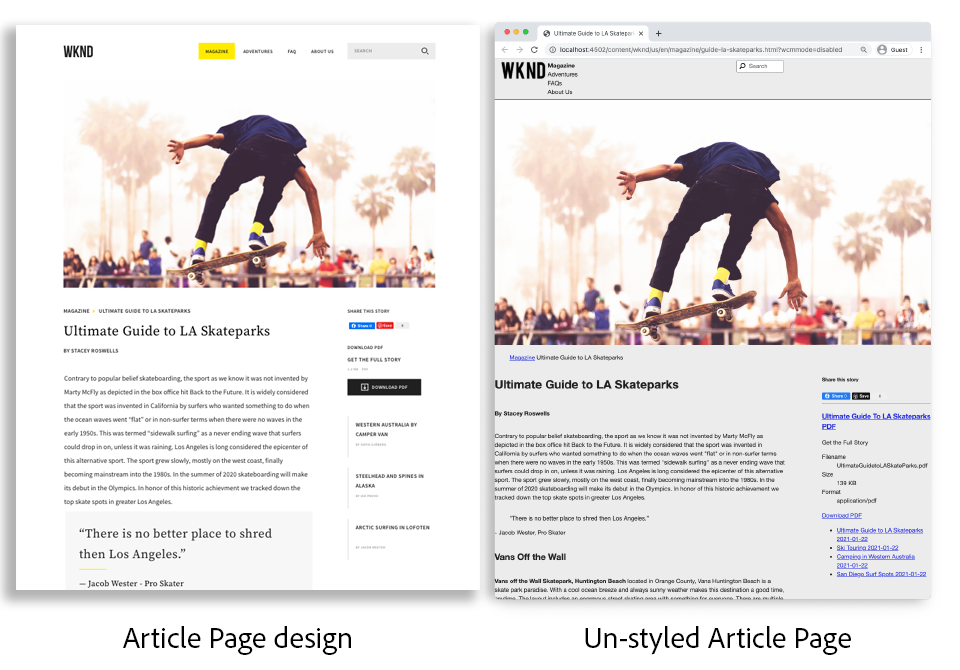

# ページとテンプレート {#pages-and-template}

この章では、ベースページコンポーネントと編集可能なテンプレートとの関係について説明します。 以下のモックアップに基づいて、スタイル設定されていない記事テンプレートを作成します。 [AdobeXD](https://www.adobe.com/products/xd.html). テンプレートの構築プロセスでは、コアコンポーネントと、編集可能テンプレートの高度なポリシー設定について説明します。

## 前提条件 {#prerequisites}

設定に必要なツールと手順を確認します。 [ローカル開発環境](overview.md#local-dev-environment).

### スタータープロジェクト

>[!NOTE]
>
> 前の章を正常に完了した場合は、プロジェクトを再利用し、スタータープロジェクトをチェックアウトする手順をスキップできます。

チュートリアルの構築元となるベースラインコードを確認します。

1. 以下を確認します。 `tutorial/pages-templates-start` ～から分岐する [GitHub](https://github.com/adobe/aem-guides-wknd)

   ```shell
   $ cd ~/code/aem-guides-wknd
   $ git checkout tutorial/pages-templates-start
   ```

1. Maven のスキルを使用して、ローカルのAEMインスタンスにコードベースをデプロイします。

   ```shell
   $ mvn clean install -PautoInstallSinglePackage
   ```

   >[!NOTE]
   >
   > AEM 6.5 または 6.4 を使用している場合、 `classic` 任意の Maven コマンドに対するプロファイル。

   ```shell
   $ mvn clean install -PautoInstallSinglePackage -Pclassic
   ```

完成したコードは、 [GitHub](https://github.com/adobe/aem-guides-wknd/tree/tutorial/pages-templates-solution) または、ブランチに切り替えて、コードをローカルでチェックアウトします。 `tutorial/pages-templates-solution`.

## 目的

1. Inspectは、Adobe XDで作成されたページデザインで、コアコンポーネントにマッピングされます。
1. 編集可能テンプレートの詳細と、ポリシーを使用してページコンテンツを詳細に制御する方法について説明します。
1. テンプレートとページのリンク方法を説明します

## 作成する内容 {#what-you-will-build}

このチュートリアルのこの部分では、新しい記事ページの作成に使用でき、共通の構造に合わせて揃える、新しい記事ページテンプレートを作成します。 記事ページテンプレートは、AdobeXD で作成されたデザインと UI キットに基づいて作成されます。 この章では、テンプレートの構造またはスケルトンの構築にのみ焦点を当てます。 スタイルは実装されませんが、テンプレートとページは機能します。



## Adobe XDでの UI 計画 {#adobexd}

ほとんどの場合、新しい Web サイトの計画は、モックアップと静的デザインで始まります。 [Adobe XD](https://www.adobe.com/products/xd.html) は、ユーザーエクスペリエンスを構築するデザインツールです。 次に、UI キットとモックアップを検査し、記事ページテンプレートの構造を計画するのに役立ちます。

>[!VIDEO](https://video.tv.adobe.com/v/30214/?quality=12&learn=on)

**をダウンロードします。 [WKND 記事デザインファイル](https://github.com/adobe/aem-guides-wknd/releases/download/aem-guides-wknd-0.0.2/AEM_UI-kit-WKND-article-design.xd)**.

>[!NOTE]
>
> 汎用 [AEMコアコンポーネント UI キットも利用できます](https://experienceleague.adobe.com/docs/experience-manager-learn/assets/AEM-CoreComponents-UI-Kit.xd) をカスタムプロジェクトの出発点として使用します。

## 記事ページテンプレートの作成

ページを作成するとき、テンプレートを選択する必要があります。これは新しいページを作成するための基本として使用されます。テンプレートは、作成されるページの構造、初期コンテンツ、許可されるコンポーネントを定義します。

主に次の 3 つの領域があります。 [編集可能なテンプレート](https://experienceleague.adobe.com/docs/experience-manager-65/developing/platform/templates/page-templates-editable.html?lang=ja):

1. **構造**  — テンプレートの一部であるコンポーネントを定義します。 コンテンツ作成者はこれらを編集できません。
1. **初期コンテンツ**  — テンプレートの開始点となるコンポーネントを定義します。コンテンツ作成者は、これらのコンポーネントを編集または削除できます
1. **ポリシー**  — コンポーネントの動作方法と作成者が使用できるオプションに関する設定を定義します。

次に、モックアップの構造に合った新しいテンプレートをAEMで作成します。 これは、AEMのローカルインスタンスで発生します。 次のビデオの手順に従います。

>[!VIDEO](https://video.tv.adobe.com/v/330991/?quality=12&learn=on)

以下のビデオの概要手順：

### 構造の設定

1. 新しいテンプレートを作成するには、 **ページテンプレートタイプ**，名前 **記事ページ**.
1. 切り替え先 **構造** モード。
1. を追加します。 **エクスペリエンスフラグメント** ～として機能するコンポーネント **ヘッダー** をクリックします。
   * コンポーネントがを指すように設定します `/content/experience-fragments/wknd/us/en/site/header/master`.
   * ポリシーをに設定します。 **ページヘッダー** そして **デフォルトの要素** が `header`. この `header`要素が次の章で CSS でターゲット設定されるようになります。
1. を追加します。 **エクスペリエンスフラグメント** ～として機能するコンポーネント **フッター** をクリックします。
   * コンポーネントがを指すように設定します `/content/experience-fragments/wknd/us/en/site/footer/master`.
   * ポリシーをに設定します。 **ページフッター** そして **デフォルトの要素** が `footer`. この `footer` 要素が次の章で CSS でターゲット設定されるようになります。
1. をロックします。 **メイン** テンプレートが最初に作成されたときに含まれるコンテナ。
   * ポリシーをに設定します。 **メインページ** そして **デフォルトの要素** が `main`. この `main` 要素が次の章で CSS でターゲット設定されるようになります。
1. を追加します。 **画像** コンポーネント **メイン** コンテナ。
   * をロック解除 **画像** コンポーネント。
1. を追加します。 **パンくず** の下のコンポーネント **画像** コンポーネントをメインコンテナに追加します。
   * 新しいポリシーを作成します **パンくず** 名前を付けたコンポーネント **記事ページ — パンくず**. を **ナビゲーション開始レベル** から **4**.
1. を追加します。 **コンテナ** の下のコンポーネント **パンくず** コンポーネントと内部 **メイン** コンテナ。 これは、 **コンテンツコンテナ** 」と入力します。
   * をロック解除 **コンテンツ** コンテナ。
   * ポリシーをに設定します。 **ページコンテンツ**.
1. 別の **コンテナ** の下のコンポーネント **コンテンツコンテナ**. これは、 **サイドレール** テンプレートのコンテナ。
   * をロック解除 **サイドレール** コンテナ。
   * という名前の新しいポリシーを作成します。 **記事ページ — サイドレール**.
   * の設定 **許可されたコンポーネント** under **WKND Sites プロジェクト — コンテンツ** 次を含めます。 **ボタン**, **ダウンロード**, **画像**, **リスト**, **区切り文字**, **ソーシャルメディア共有**, **テキスト**、および **タイトル**.
1. ページルートコンテナのポリシーを更新します。 これは、テンプレートの最も外側にあるコンテナです。 ポリシーをに設定します。 **ページルート**.
   * の下 **コンテナ設定**、 **レイアウト** から **レスポンシブグリッド**.
1. のレイアウトモードを使用 **コンテンツコンテナ**. ハンドルを右から左にドラッグし、コンテナを 8 列の幅に縮小します。
1. のレイアウトモードを使用 **サイドレールコンテナ**. ハンドルを右から左にドラッグし、コンテナを 4 列の幅に縮小します。 次に、左側のハンドルを左から右の 1 列にドラッグして、コンテナ 3 の列を幅にし、間に 1 列の間隔を残します。 **コンテンツコンテナ**.
1. モバイルエミュレーターを開き、モバイルブレークポイントに切り替えます。 レイアウトモードを再度有効にし、 **コンテンツコンテナ** そして **サイドレールコンテナ** ページの全幅。 これにより、モバイルのブレークポイントにコンテナが垂直に積み重ねられます。
1. のポリシーを更新 **テキスト** コンポーネント **コンテンツコンテナ**.
   * ポリシーをに設定します。 **コンテンツテキスト**.
   * の下 **プラグイン** > **段落スタイル**, check **段落スタイルを有効にする** そして **見積ブロック** が有効になっている。

### 初期コンテンツ設定

1. 切り替え先 **初期コンテンツ** モード。
1. を追加します。 **タイトル** コンポーネント **コンテンツコンテナ**. これは記事のタイトルとして機能します。 空のままにすると、現在のページのタイトルが自動的に表示されます。
1. 秒を追加 **タイトル** コンポーネントを 1 つ目のタイトルコンポーネントの下に配置します。
   * 次のテキストを使用してコンポーネントを設定します。「作成者別」。 これはテキストプレースホルダーになります。
   * タイプを `H4`.
1. を追加します。 **テキスト** の下のコンポーネント **作成者別** タイトルコンポーネント。
1. を追加します。 **タイトル** コンポーネント **サイドレールコンテナ**.
   * 次のテキストを使用してコンポーネントを設定します。「このストーリーを共有」を参照してください。
   * タイプを `H5`.
1. を追加します。 **ソーシャルメディア共有** の下のコンポーネント **このストーリーを共有** タイトルコンポーネント。
1. を追加します。 **区切り文字** の下のコンポーネント **ソーシャルメディア共有** コンポーネント。
1. を追加します。 **ダウンロード** の下のコンポーネント **区切り文字** コンポーネント。
1. を追加します。 **リスト** の下のコンポーネント **ダウンロード** コンポーネント。
1. を更新します。 **最初のページのプロパティ** 」と入力します。
   * の下 **ソーシャルメディア** > **ソーシャルメディア共有**, check **Facebook** および **Pinterest**

### テンプレートを有効にしてサムネールを追加

1. テンプレートコンソールでテンプレートを表示するには、次の場所に移動します。 [http://localhost:4502/libs/wcm/core/content/sites/templates.html/conf/wknd](http://localhost:4502/libs/wcm/core/content/sites/templates.html/conf/wknd)
1. **有効にする** 記事ページテンプレート
1. 記事ページテンプレートのプロパティを編集し、次のサムネールをアップロードして、記事ページテンプレートを使用して作成したページをすばやく特定します。

   

## エクスペリエンスフラグメントを使用したヘッダーとフッターの更新 {#experience-fragments}

ヘッダーやフッターなどのグローバルコンテンツを作成する場合の一般的な方法は、 [エクスペリエンスフラグメント](https://experienceleague.adobe.com/docs/experience-manager-learn/sites/experience-fragments/experience-fragments-feature-video-use.html). エクスペリエンスフラグメントを使用すると、複数のコンポーネントを組み合わせて、1 つの参照可能なコンポーネントを作成できます。 エクスペリエンスフラグメントには、複数サイトの管理と [局在](https://experienceleague.adobe.com/docs/experience-manager-core-components/using/components/experience-fragment.html?lang=en#localized-site-structure).

AEMプロジェクトアーキタイプで、ヘッダーとフッターが生成されました。 次に、モックアップと一致するようにエクスペリエンスフラグメントを更新します。 次のビデオの手順に従います。

>[!VIDEO](https://video.tv.adobe.com/v/330992/?quality=12&learn=on)

以下のビデオの概要手順：

1. サンプルコンテンツパッケージをダウンロードします。 **[WKND-PagesTemplates-Content-Assets.zip](assets/pages-templates/WKND-PagesTemplates-Content-Assets-1.1.zip)**.
1. パッケージマネージャー ( ) を使用して、コンテンツパッケージをアップロードしインストールします。 [http://localhost:4502/crx/packmgr/index.jsp](http://localhost:4502/crx/packmgr/index.jsp)
1. Web バリエーションテンプレートを更新します。これは、 [http://localhost:4502/editor.html/conf/wknd/settings/wcm/templates/xf-web-variation/structure.html](http://localhost:4502/editor.html/conf/wknd/settings/wcm/templates/xf-web-variation/structure.html)
   * ポリシーを更新します。 **コンテナ** コンポーネントを作成します。
   * ポリシーをに設定します。 **XF ルート**.
   * の下 **許可されたコンポーネント** コンポーネントグループを選択 **WKND Sites プロジェクト — 構造** 含める **言語ナビゲーション**, **ナビゲーション**、および **クイック検索** コンポーネント。

### ヘッダーエクスペリエンスフラグメントを更新

1. ヘッダーをレンダリングするエクスペリエンスフラグメントを開く ( ) [http://localhost:4502/editor.html/content/experience-fragments/wknd/us/en/site/header/master.html](http://localhost:4502/editor.html/content/experience-fragments/wknd/us/en/site/header/master.html)
1. ルートの設定 **コンテナ** 」と入力します。 これが一番外側の **コンテナ**.
   * を **レイアウト** から **レスポンシブグリッド**
1. を **WKND ダークロゴ** 画像の上に **コンテナ**. 前の手順でインストールしたパッケージにロゴが含まれていました。
   * レイアウトを変更する **WKND ダークロゴ** 次の **2** 列の幅を広げます。 ハンドルを右から左にドラッグします。
   * でロゴを設定 **代替テキスト** 」と入力します。
   * ロゴの設定先 **リンク** から `/content/wknd/us/en` ホームページ
1. の設定 **ナビゲーション** 既にページに配置されているコンポーネント。
   * を **ルートレベルを除外** から **1**.
   * を **ナビゲーション構造の深さ** から **1**.
   * レイアウトを変更する **ナビゲーション** 要素 **8** 列の幅を広げます。 ハンドルを右から左にドラッグします。
1. を削除します。 **言語ナビゲーション** コンポーネント。
1. レイアウトを変更する **検索** 要素 **2** 列の幅を広げます。 ハンドルを右から左にドラッグします。 すべてのコンポーネントを、1 行に対して水平方向に整列させる必要があります。

### フッターエクスペリエンスフラグメントを更新

1. フッターをレンダリングするエクスペリエンスフラグメントを開く ( ) [http://localhost:4502/editor.html/content/experience-fragments/wknd/us/en/site/footer/master.html](http://localhost:4502/editor.html/content/experience-fragments/wknd/us/en/site/footer/master.html)
1. ルートの設定 **コンテナ** 」と入力します。 これが一番外側の **コンテナ**.
   * を **レイアウト** から **レスポンシブグリッド**
1. を **WKND ライトロゴ** 画像の上に **コンテナ**. 前の手順でインストールしたパッケージにロゴが含まれていました。
   * レイアウトを変更する **WKND ライトロゴ** 次の **2** 列の幅を広げます。 ハンドルを右から左にドラッグします。
   * でロゴを設定 **代替テキスト** 」と入力します。
   * ロゴの設定先 **リンク** から `/content/wknd/us/en` ホームページ
1. を追加します。 **ナビゲーション** コンポーネントをロゴの下に配置します。 の設定 **ナビゲーション** コンポーネント：
   * を **ルートレベルを除外** から **1**.
   * オフ **すべての子ページを収集**.
   * を **ナビゲーション構造の深さ** から **1**.
   * レイアウトを変更する **ナビゲーション** 要素 **8** 列の幅を広げます。 ハンドルを右から左にドラッグします。

## 記事ページの作成

次に、記事ページテンプレートを使用して新しいページを作成します。 サイトのモックアップと一致するようにページのコンテンツを作成します。 次のビデオの手順に従います。

>[!VIDEO](https://video.tv.adobe.com/v/330993/?quality=12&learn=on)

以下のビデオの概要手順：

1. サイトコンソール ( ) に移動します。 [http://localhost:4502/sites.html/content/wknd/us/en/magazine](http://localhost:4502/sites.html/content/wknd/us/en/magazine).
1. の下に新しいページを作成します。 **WKND** > **US** > **EN** > **雑誌**.
   * を選択します。 **記事ページ** テンプレート。
   * の下 **プロパティ** 設定 **タイトル** 「LA スケートパークスの究極ガイド」へ
   * を **名前** ガイド・ラ・スケートパークスへ
1. 置換 **作成者別** 「By Stacey Roswells」というテキストを含むタイトル。
1. を更新します。 **テキスト** 記事に入力する段落を含めるコンポーネントです。 次のテキストファイルをコピーとして使用できます。 [la-skate-parks-copy.txt](assets/pages-templates/la-skateparks-copy.txt).
1. 別の **テキスト** コンポーネント。
   * コンポーネントを更新して、引用符を含めます。「ロサンゼルスにシェアする場所がない」
   * フルスクリーンモードでリッチテキストエディターを編集し、上記の引用を変更して **見積ブロック** 要素。
1. 続けて記事の本文を入力し、モックアップに一致させます。
1. の設定 **ダウンロード** 記事のPDF版を使用するコンポーネント。
   * の下 **ダウンロード** > **プロパティ**、チェックボックスをクリックして **DAM アセットからタイトルを取得する**.
   * を **説明** 移動先：「全文を読む」
   * を **アクションテキスト** 移動先：「ダウンロードPDF」。
1. の設定 **リスト** コンポーネント。
   * の下 **リスト設定** > **次を使用してリストを作成**&#x200B;を選択します。 **子ページ**.
   * を **親ページ** から `/content/wknd/us/en/magazine`.
   * の下 **項目設定** check **項目をリンク** およびチェック **日付を表示**.

## Inspectノード構造 {#node-structure}

この時点で、記事ページのスタイルがはっきりと解除されます。 ただし、基本的な構造が設定されています。 次に、記事ページのノード構造を調べて、テンプレート、ページ、コンポーネントの役割をより深く理解します。

ローカルAEMインスタンスで CRXDE-Lite ツールを使用して、基になるノード構造を表示します。

1. 開く [CRXDE-Lite](http://localhost:4502/crx/de/index.jsp#/content/wknd/us/en/magazine/guide-la-skateparks/jcr%3Acontent) ツリーナビゲーションを使用して `/content/wknd/us/en/magazine/guide-la-skateparks`.

1. をクリックします。 `jcr:content` の下のノード `la-skateparks` ページに移動してプロパティを表示します。

   

   値は `cq:template`を示す `/conf/wknd/settings/wcm/templates/article-page`、前の手順で作成した記事ページテンプレート。

   また、 `sling:resourceType`を示す `wknd/components/page`. これはAEMプロジェクトのアーキタイプによって作成されるページコンポーネントで、テンプレートに基づいてページのレンダリングを担当します。

1. を展開します。 `jcr:content` の下のノード `/content/wknd/us/en/magazine/guide-la-skateparks/jcr:content` ノード階層を表示します。

   

   各ノードを、オーサリングされたコンポーネントに緩やかにマッピングできるはずです。 次のプレフィックスが付いたノードを調べて、使用される別のレイアウトコンテナを識別できるかどうかを確認します。 `container`.

1. 次に、次の場所でページコンポーネントを検査します。 `/apps/wknd/components/page`. 次のCRXDE Liteでコンポーネントプロパティを表示します。

   

   HTL スクリプトは 2 つだけです。 `customfooterlibs.html` および `customheaderlibs.html` をページコンポーネントの下に追加します。 *では、このコンポーネントはページをどのようにレンダリングしますか？*

   この `sling:resourceSuperType` プロパティがを指す `core/wcm/components/page/v2/page`. このプロパティを使用すると、WKND のページコンポーネントは **すべて** コアコンポーネントのページコンポーネントの機能の説明です。 これは、[プロキシコンポーネントパターン](https://experienceleague.adobe.com/docs/experience-manager-core-components/using/developing/guidelines.html#ProxyComponentPattern)と呼ばれるものの最初の例です。詳しくは、[こちら](https://experienceleague.adobe.com/docs/experience-manager-core-components/using/developing/guidelines.html)を参照してください。。

1. Inspect WKND コンポーネント内の別のコンポーネントである `Breadcrumb` 次の場所にあるコンポーネント： `/apps/wknd/components/breadcrumb`. 同じことに注意してください。 `sling:resourceSuperType` プロパティが見つかりますが、今回は `core/wcm/components/breadcrumb/v2/breadcrumb`. これは、プロキシコンポーネントパターンを使用してコアコンポーネントを組み込む別の例です。 実際、WKND コードベース内のすべてのコンポーネントは、AEMコアコンポーネントのプロキシです（当社の有名な HelloWorld コンポーネントを除く）。 できるだけ多くのコアコンポーネントの機能を試して再利用することをお勧めします *前* カスタムコードを記述しています。

1. 次に、次のページでコアコンポーネントページを調べます。 `/libs/core/wcm/components/page/v2/page` CRXDE Lite:

   >[!NOTE]
   >
   > AEM 6.5/6.4 では、コアコンポーネントは、 `/apps/core/wcm/components`. AEM as a Cloud Serviceでは、コアコンポーネントは、 `/libs` およびは自動的に更新されます。

   

   このページの下には、さらに多くのスクリプトが含まれています。 コアコンポーネントページには、多くの機能が含まれています。 この機能は、メンテナンスや読みやすさを向上させるために、複数のスクリプトに分割されています。 HTL スクリプトを含める場合は、 `page.html` そして `data-sly-include`:

   ```html
   <!--/* /libs/core/wcm/components/page/v2/page/page.html */-->
   <!DOCTYPE HTML>
   <html data-sly-use.page="com.adobe.cq.wcm.core.components.models.Page" lang="${page.language}"
       data-sly-use.head="head.html"
       data-sly-use.footer="footer.html"
       data-sly-use.redirect="redirect.html">
       <head data-sly-call="${head.head @ page = page}"></head>
       <body class="${page.cssClassNames}"
           id="${page.id}"
           data-cmp-data-layer-enabled="${page.data ? true : false}">
           <script data-sly-test.dataLayerEnabled="${page.data}">
           window.adobeDataLayer = window.adobeDataLayer || [];
           adobeDataLayer.push({
               page: JSON.parse("${page.data.json @ context='scriptString'}"),
               event:'cmp:show',
               eventInfo: {
                   path: 'page.${page.id @ context="scriptString"}'
               }
           });
           </script>
           <sly data-sly-test.isRedirectPage="${page.redirectTarget && (wcmmode.edit || wcmmode.preview)}"
               data-sly-call="${redirect.redirect @ redirectTarget = page.redirectTarget}"></sly>
           <sly data-sly-test="${!isRedirectPage}">
               <sly data-sly-include="body.skiptomaincontent.html"></sly>
               <sly data-sly-include="body.socialmedia_begin.html"></sly>
               <sly data-sly-include="body.html"></sly>
               <sly data-sly-call="${footer.footer @ page = page}"></sly>
               <sly data-sly-include="body.socialmedia_end.html"></sly>
           </sly>
       </body>
   </html>
   ```

   HTL を複数のスクリプトに分割するもう 1 つの理由は、プロキシコンポーネントが個々のスクリプトを上書きしてカスタムビジネスロジックを実装できるようにすることです。 HTL スクリプト `customfooterlibs.html` および `customheaderlibs.html`は、プロジェクトの実装で上書きされる明示的な目的で作成されます。

   編集可能テンプレートが [この記事を読んでコンテンツページを作成](https://experienceleague.adobe.com/docs/experience-manager-65/developing/platform/templates/page-templates-editable.html).

1. Inspect別のコアコンポーネント ( `/libs/core/wcm/components/breadcrumb/v2/breadcrumb`. 次を表示： `breadcrumb.html` スクリプトを使用して、パンくずコンポーネントのマークアップが最終的にどのように生成されるかを理解できます。

## ソース管理への設定の保存 {#configuration-persistence}

多くの場合、特にAEMプロジェクトの開始時に、テンプレートや関連するコンテンツポリシーなどの設定をソース管理に保持すると便利です。 これにより、すべての開発者が同じコンテンツと設定のセットに対して作業を行い、環境間の一貫性をさらに高めることができます。 プロジェクトが一定の成熟度に達すると、テンプレート管理の手法を特別なパワーユーザーグループに引き継ぐことができます。

ここでは、テンプレートを他のコードと同様に扱い、 **記事ページテンプレート** プロジェクトの一部として下に 今まで **プッシュ** AEMプロジェクトからAEMのローカルインスタンスにコードを追加します。 この **記事ページテンプレート** がAEMのローカルインスタンス上に直接作成されたので、 **インポート** テンプレートをAEMプロジェクトに追加します。 この **ui.content** モジュールは、この特定の目的のためにAEMプロジェクトに含まれます。

次の手順は、 [VSCode AEM Sync](https://marketplace.visualstudio.com/items?itemName=yamato-ltd.vscode-aem-sync&amp;ssr=false#overview) プラグインを使用している可能性がありますが、 **インポート** AEMのローカルインスタンスからコンテンツを読み込むか、

1. VSCode で、 `aem-guides-wknd` プロジェクト。

1. を展開します。 **ui.content** モジュールを作成します。 を展開します。 `src` フォルダーに移動して、に移動します。 `/conf/wknd/settings/wcm/templates`.

1. [!UICONTROL 右クリック] の `templates` フォルダーと選択 **AEM Server からインポート**:

   

   この `article-page` をインポートし、 `page-content`, `xf-web-variation` テンプレートも更新する必要があります。

   

1. コンテンツを読み込む手順を繰り返しますが、「 **ポリシー** 次の場所にあるフォルダー： `/conf/wknd/settings/wcm/policies`.

   

1. Inspect `filter.xml` 次の場所にあるファイル： `ui.content/src/main/content/META-INF/vault/filter.xml`.

   ```xml
   <!--ui.content filter.xml-->
   <?xml version="1.0" encoding="UTF-8"?>
   <workspaceFilter version="1.0">
       <filter root="/conf/wknd" mode="merge"/>
       <filter root="/content/wknd" mode="merge"/>
       <filter root="/content/dam/wknd" mode="merge"/>
       <filter root="/content/experience-fragments/wknd" mode="merge"/>
   </workspaceFilter>
   ```

   この `filter.xml` ファイルは、パッケージと共にインストールされるノードのパスを識別します。 注意： `mode="merge"` 既存のコンテンツが変更されないことを示す各フィルターで、新しいコンテンツのみが追加されます。 コンテンツ作成者はこれらのパスを更新する可能性があるので、コードのデプロイメントでは **not** コンテンツを上書きします。 詳しくは、 [FileVault ドキュメント](https://jackrabbit.apache.org/filevault/filter.html) を参照してください。

   比較 `ui.content/src/main/content/META-INF/vault/filter.xml` および `ui.apps/src/main/content/META-INF/vault/filter.xml` を参照してください。

   >[!WARNING]
   >
   > WKND リファレンスサイトの一貫したデプロイメントを確実におこなうために、プロジェクトの一部のブランチは、次のように設定されます。 `ui.content` は JCR の変更を上書きします。 コード/スタイルは特定のポリシーに対して書き込まれるので、これはソリューションブランチの場合など、設計に基づいておこなわれます。

## おめでとうございます。 {#congratulations}

これで、Adobe Experience Manager Sitesで新しいテンプレートとページが作成されました。

### 次の手順 {#next-steps}

この時点で、記事ページのスタイルがはっきりと解除されます。 フォロー： [クライアントサイドライブラリとフロントエンドワークフロー](client-side-libraries.md) CSS と JavaScript を含めてサイトにグローバルスタイルを適用し、専用のフロントエンドビルドを統合するためのベストプラクティスについて説明するチュートリアルです。

で完成したコードを表示する [GitHub](https://github.com/adobe/aem-guides-wknd) または、Git ブラッチ上のローカルのにコードを確認してデプロイします。 `tutorial/pages-templates-solution`.

1. のクローン [github.com/adobe/aem-wknd-guides](https://github.com/adobe/aem-guides-wknd) リポジトリ。
1. 以下を確認します。 `tutorial/pages-templates-solution` 分岐。
