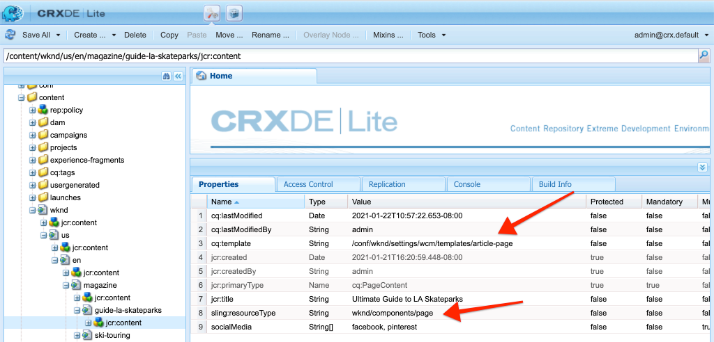

# ページとテンプレート{#pages-and-template}

この章では、ベースページコンポーネントと編集可能なテンプレートの関係について説明します。 [AdobeXD](https://www.adobe.com/products/xd.html)のモックアップに基づいて、スタイルが設定されていない記事テンプレートを作成します。 テンプレートの作成プロセスでは、コアコンポーネントと編集可能テンプレートの詳細なポリシー設定について説明します。

## 前提条件 {#prerequisites}

[ローカル開発環境](overview.md#local-dev-environment)の設定に必要なツールと手順を確認します。

### スタータープロジェクト

>[!NOTE]
>
> 前の章を正常に完了した場合は、プロジェクトを再利用し、スタータープロジェクトをチェックアウトする手順をスキップできます。

チュートリアルで構築するベースラインコードを確認します。

1. [GitHub](https://github.com/adobe/aem-guides-wknd)の`tutorial/pages-templates-start`ブランチを確認します。

   ```shell
   $ cd ~/code/aem-guides-wknd
   $ git checkout tutorial/pages-templates-start
   ```

1. Mavenのスキルを使用して、ローカルのAEMインスタンスにコードベースをデプロイします。

   ```shell
   $ mvn clean install -PautoInstallSinglePackage
   ```

   >[!NOTE]
   >
   > AEM 6.5または6.4を使用している場合は、任意のMavenコマンドに`classic`プロファイルを追加します。

   ```shell
   $ mvn clean install -PautoInstallSinglePackage -Pclassic
   ```

[GitHub](https://github.com/adobe/aem-guides-wknd/tree/pages-templates/solution)で完成したコードをいつでも表示したり、ブランチ`tutorial/pages-templates-solution`に切り替えてコードをローカルでチェックアウトしたりできます。

## 目的

1. Inspectは、Adobe XDで作成されたページデザインで、コアコンポーネントにマッピングします。
1. 編集可能テンプレートの詳細と、ポリシーを使用してページコンテンツをきめ細かく制御する方法を理解します。
1. テンプレートとページのリンク方法を説明します

## 作成する内容 {#what-you-will-build}

チュートリアルのこのパートでは、新しい記事ページの作成に使用でき、共通の構造に合わせて調整できる新しい記事ページテンプレートを作成します。 記事ページテンプレートは、AdobeXDで作成されたデザインとUIキットに基づいています。 この章では、テンプレートの構造またはスケルトンの構築にのみ焦点を当てます。 スタイルは実装されませんが、テンプレートとページは機能します。


## Adobe XDでのUI計画 {#adobexd}

ほとんどの場合、新しいWebサイトの計画は、モックアップと静的デザインから始まります。 [AdobeXD](https://www.adobe.com/products/xd.html) は、ユーザーエクスペリエンスを構築するデザインツールです。次に、UIキットとモックアップを調べて、記事ページテンプレートの構造を計画します。

>[!VIDEO](https://video.tv.adobe.com/v/30214/?quality=12&learn=on)

**WKND記事デザイン [ファイルをダウンロードします](https://github.com/adobe/aem-guides-wknd/releases/download/aem-guides-wknd-0.0.2/AEM_UI-kit-WKND-article-design.xd)**。

>[!NOTE]
>
> 汎用の[AEMコアコンポーネントUIキットも、カスタムプロジェクトの出発点として](https://experienceleague.adobe.com/docs/experience-manager-learn/assets/AEM-CoreComponents-UI-Kit.xd)利用できます。

## 記事ページテンプレートの作成

ページを作成するとき、テンプレートを選択する必要があります。これは新しいページを作成するための基本として使用されます。テンプレートは、作成されるページの構造、初期コンテンツ、許可されるコンポーネントを定義します。

[編集可能なテンプレート](https://experienceleague.adobe.com/docs/experience-manager-65/developing/platform/templates/page-templates-editable.html)には、主に3つの領域があります。

1. **構造**  — テンプレートの一部であるコンポーネントを定義します。コンテンツ作成者はこれらを編集できません。
1. **初期コンテンツ**  — テンプレートの開始時に使用するコンポーネントを定義します。コンテンツ作成者はこれらのコンポーネントを編集または削除できます
1. **ポリシー**  — コンポーネントの動作方法と、作成者が使用できるオプションに関する設定を定義します。

次に、モックアップの構造に合った新しいテンプレートをAEMで作成します。 これは、AEMのローカルインスタンスで発生します。 次のビデオの手順に従います。

>[!VIDEO](https://video.tv.adobe.com/v/330991/?quality=12&learn=on)

以下のビデオの大まかな手順：

### 構造の設定

1. **ページテンプレートタイプ**&#x200B;を使用して、**記事ページ**&#x200B;という名前の新しいテンプレートを作成します。
1. **構造**&#x200B;モードに切り替えます。
1. **エクスペリエンスフラグメント**&#x200B;コンポーネントを追加して、**ヘッダー**&#x200B;としてテンプレートの最上部に配置します。
   * `/content/experience-fragments/wknd/us/en/site/header/master`を指すようにコンポーネントを設定します。
   * ポリシーを「**Page Header**」に設定し、「**デフォルトの要素**」が「`header`」に設定されていることを確認します。 `header`要素は、次の章でCSSを使用してターゲット化されます。
1. テンプレートの下部に&#x200B;**フッター**&#x200B;として機能する&#x200B;**エクスペリエンスフラグメント**&#x200B;コンポーネントを追加します。
   * `/content/experience-fragments/wknd/us/en/site/footer/master`を指すようにコンポーネントを設定します。
   * ポリシーを「**ページフッター**」に設定し、「**デフォルトの要素**」が「`footer`」に設定されていることを確認します。 `footer`要素は、次の章でCSSを使用してターゲット化されます。
1. テンプレートが最初に作成されたときに含まれた&#x200B;**メイン**&#x200B;コンテナをロックします。
   * ポリシーを「**Page Main**」に設定し、「**デフォルトの要素**」が「`main`」に設定されていることを確認します。 `main`要素は、次の章でCSSを使用してターゲット化されます。
1. **画像**&#x200B;コンポーネントを&#x200B;**メイン**&#x200B;コンテナに追加します。
   * **画像**&#x200B;コンポーネントのロックを解除します。
1. メインコンテナの&#x200B;**画像**&#x200B;コンポーネントの下に、**パンくず**&#x200B;コンポーネントを追加します。
   * **パンくず**&#x200B;コンポーネントの新しいポリシーを作成し、**記事ページ — パンくず**&#x200B;という名前を付けます。 **ナビゲーション開始レベル**&#x200B;を&#x200B;**4**&#x200B;に設定します。
1. **コンテナ**&#x200B;コンポーネントを&#x200B;**パンくず**&#x200B;コンポーネントの下と&#x200B;**メイン**&#x200B;コンテナの内部に追加します。 これは、テンプレートの&#x200B;**コンテンツコンテナ**&#x200B;として機能します。
   * **コンテンツ**&#x200B;コンテナのロックを解除します。
   * ポリシーを「**Page Content**」に設定します。
1. 別の&#x200B;**コンテナ**&#x200B;コンポーネントを&#x200B;**コンテンツコンテナ**&#x200B;の下に追加します。 これは、テンプレートの&#x200B;**サイドレール**&#x200B;コンテナとして機能します。
   * **サイドレール**&#x200B;コンテナのロックを解除します。
   * **Article Page - Side Rail**&#x200B;という名前の新しいポリシーを作成します。
   * **WKND Sites Project - Content**&#x200B;の下に&#x200B;**許可されているコンポーネント**&#x200B;を設定し、次の項目を含めます。**ボタン**、**ダウンロード**、**画像**、**リスト**、**区切り文字**、**ソーシャルメディア共有**、**テキスト**&#x200B;と&#x200B;**タイトル**。
1. ページルートコンテナのポリシーを更新します。 これは、テンプレートの最も外側にあるコンテナです。 ポリシーを「**ページルート**」に設定します。
   * 「**コンテナ設定**」で、**レイアウト**&#x200B;を&#x200B;**レスポンシブグリッド**&#x200B;に設定します。
1. **コンテンツコンテナ**&#x200B;のレイアウトモードを使用します。 ハンドルを右から左にドラッグし、幅が8列になるようにコンテナを縮小します。
1. **サイドレールコンテナ**&#x200B;のレイアウトモードを使用します。 ハンドルを右から左にドラッグし、幅が4列になるようにコンテナを縮小します。 次に、左側のハンドルを左から右の1列にドラッグして、コンテナ3列を幅広にし、**コンテンツコンテナ**&#x200B;の間に1列の隙間を残します。
1. モバイルエミュレーターを開き、モバイルブレークポイントに切り替えます。 レイアウトモードを再度有効にし、**コンテンツコンテナ**&#x200B;と&#x200B;**サイドレールコンテナ**&#x200B;をページの全幅にします。 これにより、モバイルのブレークポイントでコンテナが垂直に積み重ねられます。
1. **コンテンツコンテナ**&#x200B;の&#x200B;**テキスト**&#x200B;コンポーネントのポリシーを更新します。
   * ポリシーを&#x200B;**Content text**&#x200B;に設定します。
   * **プラグイン** > **段落スタイル**&#x200B;で、「**段落スタイル**&#x200B;を有効にする」をオンにし、**Quoteブロック**&#x200B;が有効になっていることを確認します。

### 初期コンテンツ設定

1. **初期コンテンツ**&#x200B;モードに切り替えます。
1. **タイトル**&#x200B;コンポーネントを&#x200B;**コンテンツコンテナ**&#x200B;に追加します。 これは記事のタイトルとして機能します。 空のままにすると、現在のページのタイトルが自動的に表示されます。
1. 1つ目のタイトルコンポーネントの下に、2つ目の&#x200B;**タイトル**&#x200B;コンポーネントを追加します。
   * 次のテキストを使用してコンポーネントを設定します。「作成者別」 これはテキストプレースホルダーになります。
   * タイプを`H4`に設定します。
1. **テキスト**&#x200B;コンポーネントを&#x200B;**作成者別**&#x200B;タイトルコンポーネントの下に追加します。
1. **タイトル**&#x200B;コンポーネントを&#x200B;**サイドレールコンテナ**&#x200B;に追加します。
   * 次のテキストを使用してコンポーネントを設定します。「この話を共有」
   * タイプを`H5`に設定します。
1. **ソーシャルメディア共有**&#x200B;コンポーネントを&#x200B;**共有**&#x200B;タイトルコンポーネントの下に追加します。
1. **区切り文字**&#x200B;コンポーネントを&#x200B;**ソーシャルメディア共有**&#x200B;コンポーネントの下に追加します。
1. **ダウンロード**&#x200B;コンポーネントを&#x200B;**区切り文字**&#x200B;コンポーネントの下に追加します。
1. **ダウンロード**&#x200B;コンポーネントの下に&#x200B;**リスト**&#x200B;コンポーネントを追加します。
1. テンプレートの&#x200B;**最初のページのプロパティ**&#x200B;を更新します。
   * **ソーシャルメディア** / **ソーシャルメディア共有**&#x200B;で、**Facebook**&#x200B;と&#x200B;**Pinterest**&#x200B;をオンにします。

### テンプレートの有効化とサムネールの追加

1. [http://localhost:4502/libs/wcm/core/content/sites/templates.html/conf/wknd](http://localhost:4502/libs/wcm/core/content/sites/templates.html/conf/wknd)に移動して、テンプレートコンソールでテンプレートを表示します。
1. **** 記事ページテンプレートを有効にします。
1. 記事ページテンプレートのプロパティを編集し、次のサムネールをアップロードして、記事ページテンプレートを使用して作成したページをすばやく特定します。

   

## ヘッダーとフッターをエクスペリエンスフラグメントで更新{#experience-fragments}

ヘッダーやフッターなどのグローバルコンテンツを作成する場合、一般的な方法は、[エクスペリエンスフラグメント](https://docs.adobe.com/content/help/en/experience-manager-learn/sites/experience-fragments/experience-fragments-feature-video-use.html)を使用することです。 エクスペリエンスフラグメントを使用すると、複数のコンポーネントを組み合わせて、単一の参照可能なコンポーネントを作成できます。 エクスペリエンスフラグメントには、マルチサイト管理と[ローカライゼーション](https://experienceleague.adobe.com/docs/experience-manager-core-components/using/components/experience-fragment.html?lang=en#localized-site-structure)をサポートする利点があります。

ヘッダーとフッターがAEMプロジェクトアーキタイプで生成されました。 次に、モックアップと一致するようにエクスペリエンスフラグメントを更新します。 次のビデオの手順に従います。

>[!VIDEO](https://video.tv.adobe.com/v/330992/?quality=12&learn=on)

以下のビデオの大まかな手順：

1. サンプルコンテンツパッケージ&#x200B;**[WKND-PagesTemplates-Content-Assets.zip](assets/pages-templates/WKND-PagesTemplates-Content-Assets.zip)**&#x200B;をダウンロードします。
1. パッケージマネージャー([http://localhost:4502/crx/packmgr/index.jsp](http://localhost:4502/crx/packmgr/index.jsp))を使用して、コンテンツパッケージをアップロードしてインストールします。
1. [http://localhost:4502/editor.html/conf/wknd/settings/wcm/templates/xf-web-variation/structure.html](http://localhost:4502/editor.html/conf/wknd/settings/wcm/templates/xf-web-variation/structure.html)にあるエクスペリエンスフラグメントで使用されるテンプレートである、 Webバリエーションテンプレートを更新します。
   * テンプレートの&#x200B;**コンテナ**&#x200B;コンポーネントのポリシーを更新します。
   * ポリシーを&#x200B;**XF Root**&#x200B;に設定します。
   * 「**許可されたコンポーネント**」で、コンポーネントグループ「**WKND Sites Project - Structure**」を選択して、**言語ナビゲーション**、**ナビゲーション**、**クイック検索**&#x200B;コンポーネントを含めます。

### ヘッダーエクスペリエンスフラグメントを更新

1. [http://localhost:4502/editor.html/content/experience-fragments/wknd/us/en/site/header/master.html](http://localhost:4502/editor.html/content/experience-fragments/wknd/us/en/site/header/master.html)にあるヘッダーをレンダリングするエクスペリエンスフラグメントを開きます。
1. フラグメントのルート&#x200B;**コンテナ**&#x200B;を設定します。 これは、最も外側にある&#x200B;**コンテナ**&#x200B;です。
   * **レイアウト**&#x200B;を&#x200B;**レスポンシブグリッド**&#x200B;に設定します。
1. **WKND Dark Logo**&#x200B;を画像として&#x200B;**コンテナ**&#x200B;の上に追加します。 前の手順でインストールしたパッケージにロゴが含まれていました。
   * **WKND Dark Logo**&#x200B;のレイアウトを&#x200B;**2**&#x200B;列幅に変更します。 ハンドルを右から左にドラッグします。
   * 「WKND Logo」の&#x200B;**代替テキスト**&#x200B;を使用してロゴを設定します。
   * ロゴを&#x200B;**Link** to `/content/wknd/us/en` to に設定します。
1. 既にページに配置されている&#x200B;**ナビゲーション**&#x200B;コンポーネントを設定します。
   * **Exclude Root Levels**&#x200B;を&#x200B;**1**&#x200B;に設定します。
   * **ナビゲーション構造の深さ**&#x200B;を&#x200B;**1**&#x200B;に設定します。
   * **ナビゲーション**&#x200B;コンポーネントのレイアウトを変更して、幅を&#x200B;**8**&#x200B;列にします。 ハンドルを右から左にドラッグします。
1. **言語ナビゲーション**&#x200B;コンポーネントを削除します。
1. **検索**&#x200B;コンポーネントのレイアウトを変更して、幅を&#x200B;**2**&#x200B;列にします。 ハンドルを右から左にドラッグします。 すべてのコンポーネントを1行に水平方向に揃える必要があります。

### フッターエクスペリエンスフラグメントを更新

1. フッターをレンダリングするエクスペリエンスフラグメント([http://localhost:4502/editor.html/content/experience-fragments/wknd/us/en/site/footer/master.html](http://localhost:4502/editor.html/content/experience-fragments/wknd/us/en/site/footer/master.html))を開きます。
1. フラグメントのルート&#x200B;**コンテナ**&#x200B;を設定します。 これは、最も外側にある&#x200B;**コンテナ**&#x200B;です。
   * **レイアウト**&#x200B;を&#x200B;**レスポンシブグリッド**&#x200B;に設定します。
1. **WKND Light Logo**&#x200B;を画像として&#x200B;**コンテナ**&#x200B;の上に追加します。 前の手順でインストールしたパッケージにロゴが含まれていました。
   * **WKND Light Logo**&#x200B;のレイアウトを&#x200B;**2**&#x200B;列幅に変更します。 ハンドルを右から左にドラッグします。
   * 「WKND Logo Light」の&#x200B;**代替テキスト**&#x200B;でロゴを設定します。
   * ロゴを&#x200B;**Link** to `/content/wknd/us/en` to に設定します。
1. ロゴの下に&#x200B;**ナビゲーション**&#x200B;コンポーネントを追加します。 **ナビゲーション**&#x200B;コンポーネントを設定します。
   * **Exclude Root Levels**&#x200B;を&#x200B;**1**&#x200B;に設定します。
   * 「**すべての子ページを収集**」のチェックを外します。
   * **ナビゲーション構造の深さ**&#x200B;を&#x200B;**1**&#x200B;に設定します。
   * **ナビゲーション**&#x200B;コンポーネントのレイアウトを変更して、幅を&#x200B;**8**&#x200B;列にします。 ハンドルを右から左にドラッグします。

## 記事ページの作成

次に、記事ページテンプレートを使用して新しいページを作成します。 サイトのモックアップに合わせてページのコンテンツを作成します。 次のビデオの手順に従います。

>[!VIDEO](https://video.tv.adobe.com/v/330993/?quality=12&learn=on)

以下のビデオの大まかな手順：

1. [http://localhost:4502/sites.html/content/wknd/us/en/magazine](http://localhost:4502/sites.html/content/wknd/us/en/magazine)のサイトコンソールに移動します。
1. **WKND** > **US** > **EN** > **Magazine**&#x200B;の下に新しいページを作成します。
   * **記事ページ**&#x200B;テンプレートを選択します。
   * **プロパティ**&#x200B;の下で、**タイトル**&#x200B;を「LA Skateparksの究極のガイド」に設定します。
   * **名前**&#x200B;を「guide-la-skateparks」に設定します。
1. **By Author** Titleを「By Stacey Roswells」というテキストに置き換えます。
1. **テキスト**&#x200B;コンポーネントを更新して、記事に入力する段落を含めます。 次のテキストファイルをコピーとして使用できます。[la-skate-parks-copy.txt](assets/pages-templates/la-skateparks-copy.txt)を指定します。
1. 別の&#x200B;**テキスト**&#x200B;コンポーネントを追加します。
   * 見積もりを含めるようにコンポーネントを更新します。「ロサンゼルスには、もっと良い場所はない。」
   * フルスクリーンモードでリッチテキストエディターを編集し、上記の引用を変更して&#x200B;**引用ブロック**&#x200B;要素を使用します。
1. 続けて、モックアップに合わせて記事の本文を入力します。
1. 記事のPDFバージョンを使用するように&#x200B;**ダウンロード**&#x200B;コンポーネントを設定します。
   * **ダウンロード** / **プロパティ**&#x200B;で、「**DAMアセットからタイトルを取得**」のチェックボックスをクリックします。
   * **説明**&#x200B;を次のように設定します。「全文を読む」
   * **アクションテキスト**&#x200B;を次のように設定します。「PDFをダウンロード」
1. **リスト**&#x200B;コンポーネントを設定します。
   * **List Settings** > **Build List Using**&#x200B;で、「**Child Pages**」を選択します。
   * **Parent Page**&#x200B;を`/content/wknd/us/en/magazine`に設定します。
   * 「**項目設定**」で「**項目をリンク**」をオンにし、「**日付を表示**」をオンにします。

## Inspectノード構造{#node-structure}

この時点で、記事ページのスタイルが明確に解除されます。 ただし、基本的な構造は用意されています。 次に、記事ページのノード構造を調べて、テンプレート、ページ、コンポーネントの役割をより深く理解します。

ローカルのAEMインスタンスでCRXDE-Liteツールを使用して、基になるノード構造を表示します。

1. [CRXDE-Lite](http://localhost:4502/crx/de/index.jsp#/content/wknd/us/en/magazine/guide-la-skateparks/jcr%3Acontent)を開き、ツリーナビゲーションを使用して`/content/wknd/us/en/magazine/guide-la-skateparks`に移動します。

1. `la-skateparks`ページの下の`jcr:content`ノードをクリックして、次のプロパティを表示します。

   

   `cq:template`の値（`/conf/wknd/settings/wcm/templates/article-page`を指す）は、先ほど作成した記事ページテンプレートです。

   また、`sling:resourceType`の値（`wknd/components/page`を指す）にも注意してください。 これは、AEMプロジェクトのアーキタイプによって作成されるページコンポーネントで、テンプレートに基づいてページのレンダリングを担当します。

1. `/content/wknd/us/en/magazine/guide-la-skateparks/jcr:content`の下の`jcr:content`ノードを展開し、ノード階層を表示します。

   

   各ノードを、オーサリングされたコンポーネントに緩やかにマッピングできるはずです。 `container`のプレフィックスが付いたノードを調べて、使用する別のレイアウトコンテナを識別できるかどうかを確認します。

1. 次に、`/apps/wknd/components/page`でページコンポーネントを検査します。 コンポーネントのプロパティをCRXDE Lite:

   

   ページコンポーネントの下には、HTLスクリプト`customfooterlibs.html`と`customheaderlibs.html`の2つしかありません。 *では、このコンポーネントはページをどのようにレンダリングしますか？*

   `sling:resourceSuperType`プロパティが`core/wcm/components/page/v2/page`を指している。 このプロパティを使用すると、WKNDのページコンポーネントは、コアコンポーネントページコンポーネントの機能の&#x200B;**すべて**&#x200B;を継承できます。 これは、[プロキシコンポーネントパターン](https://docs.adobe.com/content/help/en/experience-manager-core-components/using/developing/guidelines.html#ProxyComponentPattern)と呼ばれるものの最初の例です。詳しくは、[こちら](https://docs.adobe.com/content/help/en/experience-manager-core-components/using/developing/guidelines.html)を参照してください。。

1. Inspect WKNDコンポーネント内の別のコンポーネントである`Breadcrumb`コンポーネントは、次の場所にあります。`/apps/wknd/components/breadcrumb`. 同じ`sling:resourceSuperType`プロパティが見つかりますが、今回は`core/wcm/components/breadcrumb/v2/breadcrumb`を指します。 これは、プロキシコンポーネントパターンを使用してコアコンポーネントを組み込む別の例です。 実際、WKNDコードベース内のすべてのコンポーネントは、AEMコアコンポーネント（弊社の有名なHelloWorldコンポーネントを除く）のプロキシです。 カスタムコードを記述する前に、可能な限りコアコンポーネントの機能を使用し直すことをお勧めします。**

1. 次に、次のCRXDE Liteを使用して、`/libs/core/wcm/components/page/v2/page`のコアコンポーネントページを調べます。

   >[!NOTE]
   >
   > AEM 6.5/6.4では、コアコンポーネントは`/apps/core/wcm/components`の下に配置されています。 AEM as aCloud Serviceでは、コアコンポーネントは`/libs`に配置され、自動的に更新されます。

   

   このページの下には、さらに多くのスクリプトが含まれています。 コアコンポーネントページには、多くの機能が含まれています。 この機能は、メンテナンスと読みやすさを考慮して、複数のスクリプトに分割されています。 `page.html`を開き、`data-sly-include`を探すことで、HTLスクリプトの組み込みを追跡できます。

   ```html
   <!--/* /libs/core/wcm/components/page/v2/page/page.html */-->
   <!DOCTYPE HTML>
   <html data-sly-use.page="com.adobe.cq.wcm.core.components.models.Page" lang="${page.language}"
       data-sly-use.head="head.html"
       data-sly-use.footer="footer.html"
       data-sly-use.redirect="redirect.html">
       <head data-sly-call="${head.head @ page = page}"></head>
       <body class="${page.cssClassNames}"
           id="${page.id}"
           data-cmp-data-layer-enabled="${page.data ? true : false}">
           <script data-sly-test.dataLayerEnabled="${page.data}">
           window.adobeDataLayer = window.adobeDataLayer || [];
           adobeDataLayer.push({
               page: JSON.parse("${page.data.json @ context='scriptString'}"),
               event:'cmp:show',
               eventInfo: {
                   path: 'page.${page.id @ context="scriptString"}'
               }
           });
           </script>
           <sly data-sly-test.isRedirectPage="${page.redirectTarget && (wcmmode.edit || wcmmode.preview)}"
               data-sly-call="${redirect.redirect @ redirectTarget = page.redirectTarget}"></sly>
           <sly data-sly-test="${!isRedirectPage}">
               <sly data-sly-include="body.skiptomaincontent.html"></sly>
               <sly data-sly-include="body.socialmedia_begin.html"></sly>
               <sly data-sly-include="body.html"></sly>
               <sly data-sly-call="${footer.footer @ page = page}"></sly>
               <sly data-sly-include="body.socialmedia_end.html"></sly>
           </sly>
       </body>
   </html>
   ```

   HTLを複数のスクリプトに分割するもう1つの理由は、プロキシコンポーネントが個々のスクリプトを上書きしてカスタムビジネスロジックを実装できるようにすることです。 HTLスクリプト`customfooterlibs.html`と`customheaderlibs.html`は、明示的な目的で作成され、プロジェクトの実装によって上書きされます。

   編集可能テンプレートが[コンテンツページのレンダリングにどのように影響するかについて詳しくは、この記事](https://experienceleague.adobe.com/docs/experience-manager-65/developing/platform/templates/page-templates-editable.html)を参照してください。

1. 別のコアコンポーネント（`/libs/core/wcm/components/breadcrumb/v2/breadcrumb`のパンくずリストなど）をInspectします。 `breadcrumb.html`スクリプトを表示して、パンくずコンポーネントのマークアップが最終的にどのように生成されるかを理解します。

## ソース管理{#configuration-persistence}への構成の保存

多くの場合、特にAEMプロジェクトの開始時に、テンプレートや関連するコンテンツポリシーなどの設定をソース管理に保持すると役立ちます。 これにより、すべての開発者が同じコンテンツと設定のセットに対して作業を行い、環境間の一貫性をさらに高めることができます。 プロジェクトがある程度の成熟度に達すると、テンプレート管理の手法を特別なパワーユーザーのグループに引き継ぐことができます。

ここでは、テンプレートを他のコードの部分と同じように扱い、プロジェクトの一部として&#x200B;**記事ページテンプレート**&#x200B;を同期します。 これまでは、AEMプロジェクトからAEMのローカルインスタンスに&#x200B;**プッシュ**&#x200B;コードがありました。 **記事ページテンプレート**&#x200B;はAEMのローカルインスタンス上に直接作成されたので、AEMプロジェクトにテンプレートを&#x200B;**インポート**&#x200B;する必要があります。 この目的のために、 AEMプロジェクトに&#x200B;**ui.content**&#x200B;モジュールが含まれています。

次の手順は、[VSCode AEM Sync](https://marketplace.visualstudio.com/items?itemName=yamato-ltd.vscode-aem-sync&amp;ssr=false#overview)プラグインを使用してVSCode IDEを使用しますが、**import**&#x200B;に設定した任意のIDEを使用するか、AEMのローカルインスタンスからコンテンツをインポートする場合があります。

1. VSCodeで、 `aem-guides-wknd`プロジェクトを開きます。

1. プロジェクトエクスプローラーで、 **ui.content**&#x200B;モジュールを展開します。 `src`フォルダーを展開し、`/conf/wknd/settings/wcm/templates`に移動します。

1. [!UICONTROL フォルダーを右] クリック `templates` し、「 AEM Serverからインポ **ート」を選択します**。

   

   `article-page`を読み込み、`page-content`、`xf-web-variation`テンプレートも更新する必要があります。

   

1. コンテンツを読み込む手順を繰り返しますが、`/conf/wknd/settings/wcm/policies`にある&#x200B;**policies**&#x200B;フォルダーを選択します。

   

1. `ui.content/src/main/content/META-INF/vault/filter.xml`にある`filter.xml`ファイルをInspectします。

   ```xml
   <!--ui.content filter.xml-->
   <?xml version="1.0" encoding="UTF-8"?>
   <workspaceFilter version="1.0">
       <filter root="/conf/wknd" mode="merge"/>
       <filter root="/content/wknd" mode="merge"/>
       <filter root="/content/dam/wknd" mode="merge"/>
       <filter root="/content/experience-fragments/wknd" mode="merge"/>
   </workspaceFilter>
   ```

   `filter.xml`ファイルは、パッケージと共にインストールされるノードのパスを識別します。 各フィルターの`mode="merge"`は、既存のコンテンツは変更されず、新しいコンテンツのみが追加されることを示しています。 コンテンツ作成者はこれらのパスを更新する可能性があるので、コードデプロイメントではコンテンツを上書き&#x200B;**しない**&#x200B;ことが重要です。 フィルタ要素の使用について詳しくは、[FileVaultのドキュメント](https://jackrabbit.apache.org/filevault/filter.html)を参照してください。

   `ui.content/src/main/content/META-INF/vault/filter.xml`と`ui.apps/src/main/content/META-INF/vault/filter.xml`を比較して、各モジュールで管理される異なるノードを理解します。

   >[!WARNING]
   >
   > WKNDリファレンスサイトの一貫したデプロイメントを確実におこなうために、プロジェクトの一部のブランチが設定され、JCR内の変更が`ui.content`によって上書きされます。 コード/スタイルは特定のポリシーに対して書き込まれるので、これは設計によって（ソリューションブランチに対して）おこなわれます。

## バリデーターが {#congratulations}

これで、Adobe Experience Manager Sitesで新しいテンプレートとページが作成されました。

### 次の手順 {#next-steps}

この時点で、記事ページのスタイルが明確に解除されます。 [クライアント側ライブラリとフロントエンドワークフロー](client-side-libraries.md)のチュートリアルに従って、CSSとJavaScriptを含めてサイトにグローバルスタイルを適用し、専用のフロントエンドビルドを統合するベストプラクティスを学びます。

[GitHub](https://github.com/adobe/aem-guides-wknd)で完成したコードを表示するか、Gitブラッチ`tutorial/pages-templates-solution`でコードをローカルに確認してデプロイします。

1. [github.com/adobe/aem-wknd-guides](https://github.com/adobe/aem-guides-wknd)リポジトリのクローンを作成します。
1. `tutorial/pages-templates-solution`ブランチを確認します。
