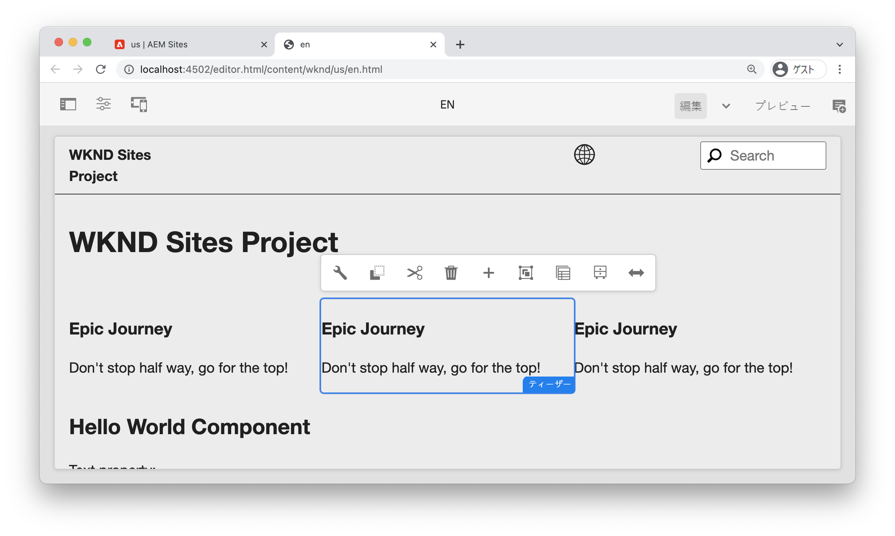
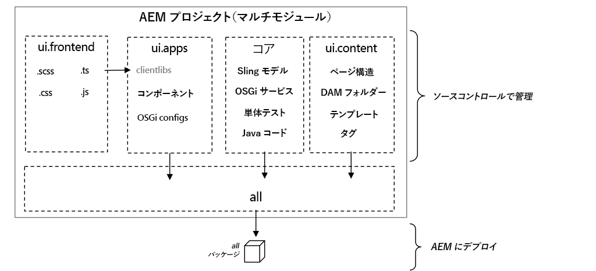
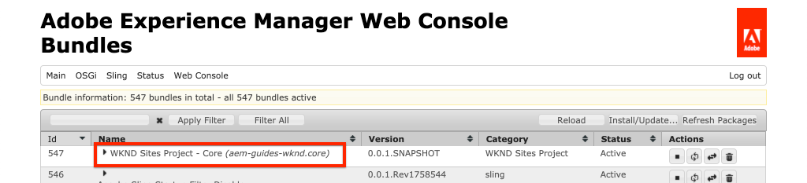
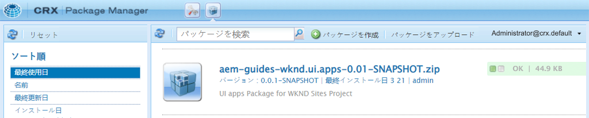

# プロジェクトのセットアップ {#project-setup}

このチュートリアルでは、Adobe Experience Manager Siteのコードと設定を管理するためのMavenマルチモジュールプロジェクトの作成について説明します。

## 前提条件 {#prerequisites}

[ローカル開発環境](../overview.md#local-dev-environment)の設定に必要なツールと手順を確認します。 Adobe Experience Managerの新しいインスタンスがローカルで使用でき、追加のサンプル/デモパッケージ（必要なサービスパック以外）がインストールされていないことを確認します。

## 目的 {#objective}

1. Mavenアーキタイプを使用して新しいAEMプロジェクトを生成する方法を説明します。
1. AEMプロジェクトアーキタイプで生成される様々なモジュールとそれらの連携方法を理解します。
1. AEMコアコンポーネントがAEMプロジェクトに含まれる仕組みを説明します。

## 作成する内容 {#what-build}

>[!VIDEO](https://video.tv.adobe.com/v/30152/?quality=12&learn=on)

この章では、[AEM Project Archetype](https://github.com/adobe/aem-project-archetype)を使用して新しいAdobe Experience Managerプロジェクトを生成します。 AEMプロジェクトには、Sites実装で使用されるすべてのコード、コンテンツ、設定が含まれています。 この章で生成されるプロジェクトは、WKNDサイトの実装の基礎となり、今後の章で構築される予定です。

**Mavenプロジェクトとは** -  [Apache Mavenis](https://maven.apache.org/) は、プロジェクトを構築するソフトウェア管理ツールです。*すべてのAdobe Experience Manager実* 装では、Mavenプロジェクトを使用して、AEM上にカスタムコードを作成、管理およびデプロイします。

**Mavenアーキタイプとは** - Mavenアーキタ [イ](https://maven.apache.org/archetype/index.html) プは、新しいプロジェクトを生成するためのテンプレートまたはパターンです。AEMプロジェクトのアーキタイプを使用すると、カスタム名前空間を持つ新しいプロジェクトを生成し、ベストプラクティスに従うプロジェクト構造を含めて、プロジェクトを大幅に高速化できます。

## プロジェクトの作成 {#create}

AEM用のMavenマルチモジュールプロジェクトを作成する方法はいくつかあります。 このチュートリアルでは、[Maven AEMプロジェクトアーキタイプ&#x200B;**26**](https://github.com/adobe/aem-project-archetype)を活用します。 また、Cloud Managerには、AEMアプリケーションプロジェクトの作成を開始するためのUIウィザード](https://docs.adobe.com/content/help/en/experience-manager-cloud-manager/using/getting-started/create-an-application-project.html)も用意されています。 [Cloud Manager UIで生成される基になるプロジェクトの結果は、アーキタイプを直接使用するのと同じ構造になります。

>[!NOTE]
>
>このチュートリアルでは、アーキタイプのバージョン&#x200B;**26**&#x200B;を使用します。 新しいプロジェクトを生成する場合は、常にアーキタイプの&#x200B;**最新の**&#x200B;バージョンを使用することをお勧めします。

次の一連の手順は、UNIXベースのコマンドラインターミナルを使用して実行されますが、Windowsターミナルを使用する場合は同様の手順を実行する必要があります。

1. コマンドラインターミナルを開きます。 Mavenがインストールされていることを確認します。

   ```shell
   $ mvn --version
   Apache Maven 3.6.2
   Maven home: /Library/apache-maven-3.6.2
   Java version: 11.0.4, vendor: Oracle Corporation, runtime: /Library/Java/JavaVirtualMachines/jdk-11.0.4.jdk/Contents/Home
   ```

1. 次のコマンドを実行して、**adobe-public**&#x200B;プロファイルがアクティブであることを確認します。

   ```shell
   $ mvn help:effective-settings
       ...
   <activeProfiles>
       <activeProfile>adobe-public</activeProfile>
   </activeProfiles>
   <pluginGroups>
       <pluginGroup>org.apache.maven.plugins</pluginGroup>
       <pluginGroup>org.codehaus.mojo</pluginGroup>
   </pluginGroups>
   </settings>
   [INFO] ------------------------------------------------------------------------
   [INFO] BUILD SUCCESS
   [INFO] ------------------------------------------------------------------------
   [INFO] Total time:  0.856 s
   ```

   **not** **adobe-public**&#x200B;を参照すると、Adobeリポジトリが`~/.m2/settings.xml`ファイルで正しく参照されていないことを示しています。 [ローカル開発環境](https://docs.adobe.com/content/help/en/experience-manager-learn/foundation/development/set-up-a-local-aem-development-environment.html#install-apache-maven)にApache Mavenをインストールして設定する手順を再度参照してください。

1. AEMプロジェクトを生成するディレクトリに移動します。 これには、プロジェクトのソースコードを管理する任意のディレクトリを指定できます。 例えば、ユーザーのホームディレクトリの下に`code`という名前のディレクトリがあるとします。

   ```shell
   $ cd ~/code
   ```

1. 次の内容をコマンドラインに貼り付けて、[バッチモード](https://maven.apache.org/archetype/maven-archetype-plugin/examples/generate-batch.html)でプロジェクトを生成します。

   ```shell
   mvn -B archetype:generate \
       -D archetypeGroupId=com.adobe.aem \
       -D archetypeArtifactId=aem-project-archetype \
       -D archetypeVersion=26 \
       -D appTitle="WKND Sites Project" \
       -D appId="wknd" \
       -D groupId="com.adobe.aem.guides.wknd" \
       -D artifactId="aem-guides-wknd" \
       -D version="0.0.1-SNAPSHOT" \
       -D aemVersion="cloud"
   ```

   >[!NOTE]
   >
   > AEM 6.5.5以降をターゲットにする場合は、 `aemVersion="cloud"`を`aemVersion="6.5.5"`に置き換えます。 6.4.8以降をターゲットにする場合は、`aemVersion="6.4.8"`を使用します。

   プロジェクト[の設定に使用できるプロパティの完全なリストは、](https://github.com/adobe/aem-project-archetype#available-properties)にあります。

1. 次のフォルダーとファイル構造は、ローカルファイルシステム上のMavenアーキタイプによって生成されます。

   ```plain
    ~/code/
       |--- aem-guides-wknd/
           |--- all/
           |--- core/
           |--- ui.apps/
           |--- ui.apps.structure/
           |--- ui.config/
           |--- ui.content/
           |--- ui.frontend/
           |--- ui.tests /
           |--- it.tests/
           |--- dispatcher/
           |--- analyse/
           |--- pom.xml
           |--- README.md
           |--- .gitignore
   ```

## プロジェクトのデプロイとビルド {#build}

プロジェクトコードを構築し、AEMのローカルインスタンスにデプロイします。

1. AEMのオーサーインスタンスがポート&#x200B;**4502**&#x200B;でローカルに実行されていることを確認します。
1. コマンドラインから`aem-guides-wknd`プロジェクトディレクトリに移動します。

   ```shell
   $ cd aem-guides-wknd
   ```

1. 次のコマンドを実行して、プロジェクト全体を構築し、AEMにデプロイします。

   ```shell
   $ mvn clean install -PautoInstallSinglePackage
   ```

   ビルドには約1分かかり、最後に次のメッセージが表示されます。

   ```
   ...
   [INFO] ------------------------------------------------------------------------
   [INFO] Reactor Summary for aem-guides-wknd 0.0.1-SNAPSHOT:
   [INFO]
   [INFO] aem-guides-wknd .................................... SUCCESS [  0.269 s]
   [INFO] WKND Sites Project - Core .......................... SUCCESS [  8.047 s]
   [INFO] WKND Sites Project - UI Frontend ................... SUCCESS [01:02 min]
   [INFO] WKND Sites Project - Repository Structure Package .. SUCCESS [  1.985 s]
   [INFO] WKND Sites Project - UI apps ....................... SUCCESS [  8.037 s]
   [INFO] WKND Sites Project - UI content .................... SUCCESS [  4.672 s]
   [INFO] WKND Sites Project - UI config ..................... SUCCESS [  0.313 s]
   [INFO] WKND Sites Project - All ........................... SUCCESS [  0.270 s]
   [INFO] WKND Sites Project - Integration Tests ............. SUCCESS [ 15.571 s]
   [INFO] WKND Sites Project - Dispatcher .................... SUCCESS [  0.232 s]
   [INFO] WKND Sites Project - UI Tests ...................... SUCCESS [  0.728 s]
   [INFO] WKND Sites Project - Project Analyser .............. SUCCESS [ 33.398 s]
   [INFO] ------------------------------------------------------------------------
   [INFO] BUILD SUCCESS
   [INFO] ------------------------------------------------------------------------
   [INFO] Total time:  02:18 min
   [INFO] Finished at: 2021-01-31T12:33:56-08:00
   [INFO] ------------------------------------------------------------------------
   ```

   Mavenプロファイル`autoInstallSinglePackage`は、プロジェクトの個々のモジュールをコンパイルし、AEMインスタンスに1つのパッケージをデプロイします。 デフォルトでは、このパッケージは、ポート&#x200B;**4502**&#x200B;でローカルに実行され、資格情報`admin:admin`を持つAEMインスタンスにデプロイされます。

1. ローカルのAEMインスタンス上でパッケージマネージャーに移動します。[http://localhost:4502/crx/packmgr/index.jsp](http://localhost:4502/crx/packmgr/index.jsp). `aem-guides-wknd.ui.apps`、`aem-guides-wknd.ui.config`、`aem-guides-wknd.ui.content`、`aem-guides-wknd.all`のパッケージが表示されます。

1. サイトコンソールに移動します。[http://localhost:4502/sites.html/content](http://localhost:4502/sites.html/content). サイトの 1 つに WKND サイトがあります。US階層と言語階層を持つサイト構造が含まれるマスターです。 このサイト階層は、アーキタイプを使用してプロジェクトを生成する際の`language_country`と`isSingleCountryWebsite`の値に基づきます。

1. ページを選択し、メニューバーの「**編集**」ボタンをクリックして、**米国** `>` **英語**&#x200B;ページを開きます。

   

1. スターターコンテンツは既に作成済みで、ページに追加できる複数のコンポーネントが用意されています。 これらのコンポーネントを使用してみることで、機能について大まかに把握できます。次の章では、コンポーネントの基本について学びます。

   

   *アーキタイプで生成されたサンプルコンテンツ*

## Inspectプロジェクト{#project-structure}

生成されるAEMプロジェクトは、個々のMavenモジュールで構成され、それぞれ異なる役割を持ちます。 このチュートリアルと開発の大部分は、次のモジュールに焦点を当てています。

* [コア](https://docs.adobe.com/content/help/en/experience-manager-core-components/using/developing/archetype/core.html)  - Javaコード。主にバックエンド開発者。
* [ui.frontend](https://docs.adobe.com/content/help/en/experience-manager-core-components/using/developing/archetype/uifrontend.html)  — 主にフロントエンド開発者向けのCSS、JavaScript、Sass、Type Scriptのソースコードを含みます。
* [ui.apps](https://docs.adobe.com/content/help/en/experience-manager-core-components/using/developing/archetype/uiapps.html)  — コンポーネントとダイアログの定義を含み、コンパイル済みのCSSとJavaScriptをクライアントライブラリとして埋め込みます。
* [ui.content](https://docs.adobe.com/content/help/en/experience-manager-core-components/using/developing/archetype/uicontent.html)  — 編集可能なテンプレート、メタデータスキーマ(/content、/conf)などの構造的なコンテンツや設定が含まれます。

* **all**  - AEM環境にデプロイできる、1つのパッケージに上記のモジュールを組み合わせた空のMavenモジュール。



**すべての** Mavenモジュールの詳細については、[AEMプロジェクトアーキタイプのドキュメント](https://docs.adobe.com/content/help/en/experience-manager-core-components/using/developing/archetype/overview.html)を参照してください。

### コアコンポーネントを組み込む {#core-components}

[AEMコアコン](https://docs.adobe.com/content/help/ja-JP/experience-manager-core-components/using/introduction.html) ポーネントは、AEM用の標準化されたWebコンテンツ管理(WCM)コンポーネントのセットです。これらのコンポーネントは、機能のベースラインセットを提供し、個々のプロジェクト用にスタイル設定、カスタマイズ、拡張するように設計されています。

AEM as a Cloud Service環境には、[AEMコアコンポーネント](https://docs.adobe.com/content/help/en/experience-manager-core-components/using/introduction.html)の最新バージョンが含まれています。 したがって、AEM as aCloud Service用に生成されたプロジェクトには、AEMコアコンポーネントの埋め込みが&#x200B;**含まれていません**。

AEM 6.5/6.4で生成されたプロジェクトの場合、アーキタイプによって、プロジェクトに[AEMコアコンポーネント](https://docs.adobe.com/content/help/en/experience-manager-core-components/using/introduction.html)が自動的に埋め込まれます。 AEM 6.5/6.4では、AEMコアコンポーネントを埋め込んで、最新バージョンがプロジェクトに確実にデプロイされるようにすることをお勧めします。 コアコンポーネントがプロジェクトに[含まれる方法について詳しくは、](https://docs.adobe.com/content/help/en/experience-manager-core-components/using/developing/archetype/using.html#core-components)を参照してください。

## ソース管理システムによる管理 {#source-control}

アプリケーションのコードを管理するために、何らかのソース管理システムを使用することが常に推奨されます。このチュートリアルでは git および GitHub を使用します。Maven などの任意の IDE では、SCM で無視すべきいくつかのファイルが生成されます。

Maven は、コードパッケージをビルドおよびインストールするたびにターゲットフォルダーを作成します。ターゲットフォルダーとコンテンツは、SCMから除外する必要があります。

`ui.apps`の下に、多数の`.content.xml`ファイルが作成されるのを観察します。 これらの XML ファイルは、JCR にインストールされているコンテンツのノードタイプおよびプロパティをマッピングします。これらのファイルは重要で、**無視しないでください**。

AEMプロジェクトのアーキタイプは、サンプルの`.gitignore`ファイルを生成します。このファイルを出発点として使用し、ファイルを安全に無視できます。 ファイルは`<src>/aem-guides-wknd/.gitignore`に生成されます。

## バリデーターが {#congratulations}

これで、最初のAEMプロジェクトが作成されました。

### 次の手順 {#next-steps}

[コンポーネントの基本](component-basics.md)のチュートリアルを使用して、簡単な`HelloWorld`例を通じて、Adobe Experience Manager(AEM)Sitesコンポーネントの基盤となるテクノロジーを理解します。

## 高度なMavenコマンド（ボーナス） {#advanced-maven-commands}

開発時には、1つのモジュールで作業を行う場合があり、時間を節約するためにプロジェクト全体を構築する必要がない場合があります。 また、AEMパブリッシュインスタンスに直接デプロイする場合や、ポート4502で実行されていないAEMのインスタンスにデプロイする場合もあります。

次に、開発時の柔軟性を高めるために使用できる、追加のMavenプロファイルおよびコマンドについて説明します。

### コアモジュール{#core-module}

**[core](https://docs.adobe.com/content/help/en/experience-manager-core-components/using/developing/archetype/core.html)**&#x200B;モジュールには、プロジェクトに関連付けられたすべてのJavaコードが含まれます。 ビルド時に、AEMにOSGiバンドルがデプロイされます。 このモジュールのみを構築するには：

1. `core`フォルダー（`aem-guides-wknd`の下）に移動します。

   ```shell
   $ cd core/
   ```

1. 次のコマンドを実行します。

   ```shell
   $ mvn clean install -PautoInstallBundle
   ...
   [INFO] --- sling-maven-plugin:2.4.0:install (install-bundle) @ aem-guides-wknd.core ---
   [INFO] Installing Bundle aem-guides-wknd.core(~/code/aem-guides-wknd/core/target/aem-guides-wknd.core-0.0.1-SNAPSHOT.jar) to http://localhost:4502/system/console via WebConsole
   [INFO] Bundle installed
   [INFO] ------------------------------------------------------------------------
   [INFO] BUILD SUCCESS
   [INFO] ------------------------------------------------------------------------
   [INFO] Total time:  8.558 s
   ```

1. [http://localhost:4502/system/console/bundles](http://localhost:4502/system/console/bundles)に移動します。 これはOSGi Webコンソールで、AEMインスタンスにインストールされているすべてのバンドルに関する情報が含まれます。

1. **Id**&#x200B;並べ替え列を切り替えると、WKNDバンドルがインストールされ、アクティブになっていることがわかります。

   

1. jarの「物理的な」場所は[CRXDE-Lite](http://localhost:4502/crx/de/index.jsp#/apps/wknd-packages/application/install/aem-guides-wknd.core-1.0.0-SNAPSHOT.jar)で確認できます。

   

### Ui.appsとUi.contentモジュール{#apps-content-module}

**[ui.apps](https://docs.adobe.com/content/help/en/experience-manager-core-components/using/developing/archetype/uiapps.html)** mavenモジュールには、`/apps`の下のサイトで必要となるすべてのレンダリングコードが含まれます。 これには CSS／JS が含まれ、それらは [clientlibs](https://docs.adobe.com/content/help/en/experience-manager-cloud-service/implementing/developing/clientlibs.html) と呼ばれる AEM の形式で保存されます。また、これには動的 HTML をレンダリングするための [HTL](https://docs.adobe.com/content/help/ja/experience-manager-htl/using/overview.html) スクリプトも含まれます。**ui.apps**&#x200B;モジュールは、JCR内の構造へのマップと考えることができますが、ファイルシステムに保存し、ソース管理にコミットできる形式です。 **ui.apps**&#x200B;モジュールには、コードのみが含まれます。

このモジュールのみを構築するには：

1. コマンドラインから。 `ui.apps`フォルダー（`aem-guides-wknd`の下）に移動します。

   ```shell
   $ cd ../ui.apps
   ```

1. 次のコマンドを実行します。

   ```shell
   $ mvn clean install -PautoInstallPackage
   ...
   Package installed in 122ms.
   [INFO] ------------------------------------------------------------------------
   [INFO] BUILD SUCCESS
   [INFO] ------------------------------------------------------------------------
   [INFO] Total time:  6.972 s
   [INFO] Finished at: 2019-12-06T14:44:12-08:00
   [INFO] ------------------------------------------------------------------------
   ```

1. [http://localhost:4502/crx/packmgr/index.jsp](http://localhost:4502/crx/packmgr/index.jsp)に移動します。 `ui.apps`パッケージが最初にインストールされたパッケージとして表示され、他のパッケージのタイムスタンプよりも新しいものが表示されます。

   

1. コマンドラインに戻り、次のコマンドを実行します（`ui.apps`フォルダー内）。

   ```shell
   $ mvn -PautoInstallPackagePublish clean install
   ...
   [INFO] --- content-package-maven-plugin:1.0.2:install (install-package-publish) @ aem-guides-wknd.ui.apps ---
   [INFO] Installing aem-guides-wknd.ui.apps (/Users/dgordon/code/aem-guides-wknd/ui.apps/target/aem-guides-wknd.ui.apps-0.0.1-SNAPSHOT.zip) to http://localhost:4503/crx/packmgr/service.jsp
   [INFO] I/O exception (java.net.ConnectException) caught when processing request: Connection refused (Connection refused)
   [INFO] Retrying request
   [INFO] I/O exception (java.net.ConnectException) caught when processing request: Connection refused (Connection refused)
   [INFO] Retrying request
   [INFO] I/O exception (java.net.ConnectException) caught when processing request: Connection refused (Connection refused)
   [INFO] Retrying request
   [INFO] ------------------------------------------------------------------------
   [INFO] BUILD FAILURE
   [INFO] ------------------------------------------------------------------------
   [INFO] Total time:  6.717 s
   [INFO] Finished at: 2019-12-06T14:51:45-08:00
   [INFO] ------------------------------------------------------------------------
   ```

   プロファイル`autoInstallPackagePublish`は、ポート&#x200B;**4503**&#x200B;で実行されているパブリッシュ環境にパッケージをデプロイすることを目的としています。 上記のエラーは、http://localhost:4503で実行されているAEMインスタンスが見つからない場合に発生します。

1. 最後に、次のコマンドを実行して、`ui.apps`パッケージをポート&#x200B;**4504**&#x200B;にデプロイします。

   ```shell
   $ mvn -PautoInstallPackage clean install -Daem.port=4504
   ...
   [INFO] --- content-package-maven-plugin:1.0.2:install (install-package) @ aem-guides-wknd.ui.apps ---
   [INFO] Installing aem-guides-wknd.ui.apps (/Users/dgordon/code/aem-guides-wknd/ui.apps/target/aem-guides-wknd.ui.apps-0.0.1-SNAPSHOT.zip) to http://localhost:4504/crx/packmgr/service.jsp
   [INFO] I/O exception (java.net.ConnectException) caught when processing request: Connection refused (Connection refused)
   [INFO] Retrying request
   [INFO] I/O exception (java.net.ConnectException) caught when processing request: Connection refused (Connection refused)
   [INFO] Retrying request
   [INFO] I/O exception (java.net.ConnectException) caught when processing request: Connection refused (Connection refused)
   [INFO] Retrying request
   [INFO] ------------------------------------------------------------------------
   [INFO] BUILD FAILURE
   [INFO] --------------------------------------------------------------------
   ```

   この場合も、ポート&#x200B;**4504**&#x200B;で実行されているAEMインスタンスがない場合、ビルドエラーが発生することが予想されます。 パラメーター`aem.port`は、POMファイル(`aem-guides-wknd/pom.xml`)で定義されます。

**[ui.content](https://docs.adobe.com/content/help/en/experience-manager-core-components/using/developing/archetype/uicontent.htm)**&#x200B;モジュールの構造は、**ui.apps**&#x200B;モジュールと同じです。 唯一の違いは、**ui.content**&#x200B;モジュールには、**可変**&#x200B;コンテンツと呼ばれるものが含まれる点です。 **** 多言語コンテンツとは、基本的に、ソース管理下に保存されているがAEMインスタンス上で直接変更できる、テンプレート、ポリシー、フォルダー構造などの非コード設定を指しま **** す。これについては、ページとテンプレートの章で詳しく説明します。

**ui.apps**&#x200B;モジュールの構築に使用するのと同じMavenコマンドを、**ui.content**&#x200B;モジュールの構築に使用できます。 **ui.content**&#x200B;フォルダー内から上記の手順を自由に繰り返してください。
