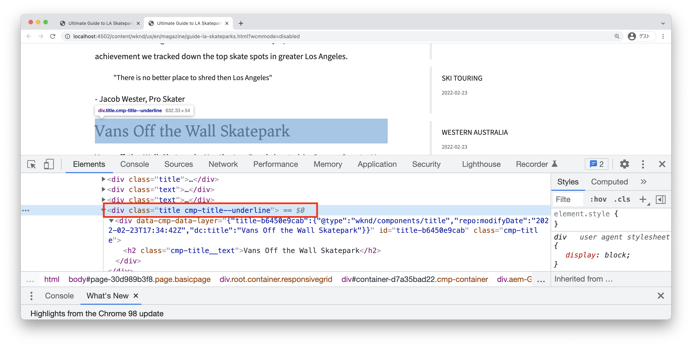
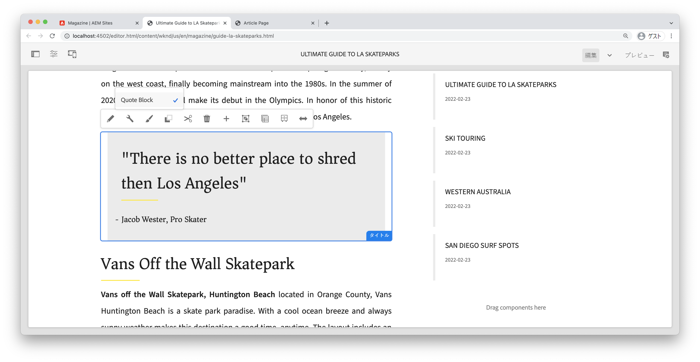

# スタイルシステムを使用した開発 {#developing-with-the-style-system}

個々のスタイルを実装し、Experience Manager のスタイルシステムを使用してコアコンポーネントを再利用する方法について説明します。 このチュートリアルでは、ブランド固有の CSS とテンプレートエディターの高度なポリシー設定を使用してコアコンポーネントを拡張するためのスタイルシステムに対応する開発について説明します。

## 前提条件 {#prerequisites}

[ローカル開発環境](overview.md#local-dev-environment)のセットアップに必要なツールと手順を確認します。

また、AEMプロジェクトに組み込まれているクライアントサイドライブラリの基本事項と様々なフロントエンドツールを理解するための[クライアントサイドライブラリとフロントエンドワークフロー](client-side-libraries.md)チュートリアルも確認することをお勧めします。

### スタータープロジェクト

>[!NOTE]
>
> 前の章を正常に完了した場合は、プロジェクトを再利用して、スタータープロジェクトをチェックアウトする手順をスキップできます。

チュートリアルの作成元となるベースラインコードをチェックアウトします。

1. [GitHub](https://github.com/adobe/aem-guides-wknd)の `tutorial/style-system-start` ブランチをチェックアウトします。

   ```shell
   $ cd aem-guides-wknd
   $ git checkout tutorial/style-system-start
   ```

1. Maven スキルを使用して、ローカル AEM インスタンスにコードベースをデプロイします。

   ```shell
   $ mvn clean install -PautoInstallSinglePackage
   ```

   >[!NOTE]
   >
   > AEM 6.5 または 6.4 を使用している場合は、任意の Maven コマンドに `classic` プロファイルを追加します。

   ```shell
   $ mvn clean install -PautoInstallSinglePackage -Pclassic
   ```

いつでも、完成したコードを [GitHub](https://github.com/adobe/aem-guides-wknd/tree/tutorial/style-system-solution) で確認したり、ブランチ `tutorial/style-system-solution` に切り替えてローカルにチェックアウトしたりできます。

## 目的

1. スタイルシステムを使用して、ブランド固有の CSS を AEM コアコンポーネントに適用する方法を理解します。
1. BEM 表記と、それを使用してスタイルのスコープを慎重に設定する方法について学びます。
1. 編集可能なテンプレートを使用して詳細なポリシー設定を適用します。

## 作ろうとしているもの {#what-build}

この章では、[スタイルシステム機能](https://experienceleague.adobe.com/docs/experience-manager-learn/sites/page-authoring/style-system-feature-video-use.html?lang=ja)を使用して、Article ページで使用される&#x200B;**タイトル**&#x200B;コンポーネントと&#x200B;**テキスト**&#x200B;コンポーネントのバリエーションを作成します。


*タイトルコンポーネントで使用できるアンダーラインスタイル*

## 背景 {#background}

[スタイルシステム](https://experienceleague.adobe.com/docs/experience-manager-65/authoring/siteandpage/style-system.html?lang=ja)により、開発者およびテンプレート編集者はコンポーネントの複数の視覚的バリエーションを作成できます。次に、作成者はページを構成する際に、使用するスタイルを決定できます。チュートリアルではこの後、ローコードアプローチでコアコンポーネントを使用しつつ、スタイルシステムを使用していくつかの独自のスタイルを実現します。

スタイルシステムの大まかな考え方は、コンポーネントの表示について、作成者が様々なスタイルを選択できるようにすることです。「スタイル」は、コンポーネントの外側の div に挿入された追加の CSS クラスをベースに実現されます。これらのスタイルクラスに基づいて、CSS ルールがクライアントライブラリに追加され、コンポーネントの外観が変更されるようになります。

 [スタイルシステムに関する詳細なドキュメントについては、こちら](https://experienceleague.adobe.com/docs/experience-manager-cloud-service/content/sites/authoring/features/style-system.html?lang=ja)を参照してください。[スタイルシステムを理解するための優れたテクニカルビデオ](https://experienceleague.adobe.com/docs/experience-manager-learn/sites/developing/style-system-technical-video-understand.html?lang=ja)も用意されています。

## アンダーラインスタイル - タイトル {#underline-style}

[タイトルコンポーネント](https://experienceleague.adobe.com/docs/experience-manager-core-components/using/wcm-components/title.html?lang=ja) は、**ui.apps** モジュールの一部として `/apps/wknd/components/title` 下のプロジェクトにプロキシ化されています。 見出し要素（`H1`、`H2`、`H3` など）のデフォルトスタイルは、既に **ui.frontend** モジュールに実装されています。

[WKND Article デザイン](assets/pages-templates/wknd-article-design.xd)には、アンダーライン付きのタイトルコンポーネント用の独自スタイルが含まれています。スタイルシステムを使用すれば、 作成者は、2 つのコンポーネントを作成したりコンポーネントダイアログを修正したりせずに、アンダーラインスタイルを追加することができます。


### タイトルポリシーの追加

タイトルコンポーネントのポリシーを追加して、コンテンツ作成者が特定のコンポーネントに適用するアンダーラインスタイルを選択できるようにします。 それには、AEM 内のテンプレートエディターを使用します。

1. **Article Page** テンプレート（[http://localhost:4502/editor.html/conf/wknd/settings/wcm/templates/article-page/structure.html](http://localhost:4502/editor.html/conf/wknd/settings/wcm/templates/article-page/structure.html)）に移動します。

1. **構造**&#x200B;モードのメインの&#x200B;**レイアウトコンテナ**&#x200B;で、*許可されたコンポーネント*&#x200B;にリストされている&#x200B;**タイトル**&#x200B;コンポーネントの横にある&#x200B;**ポリシー**&#x200B;アイコンを選択します。

   

1. 次の値を持つタイトルコンポーネントのポリシーを作成します。

   *ポリシータイトル&#42;*：**WKND Title**

   *プロパティ*／*「スタイル」タブ*／*新しいスタイルを追加*

   **アンダーライン** : `cmp-title--underline`

   

   「**完了**」をクリックして、タイトルポリシーの変更を保存します。

   >[!NOTE]
   >
   > 値 `cmp-title--underline` は、コンポーネントの HTML マークアップの外側の div に CSS クラスを設定します。

### アンダーラインスタイルの適用

作成者の場合は、特定のタイトルコンポーネントにアンダーラインスタイルを適用します。

1. AEM サイトエディターで **LA Skateparks** の記事（[http://localhost:4502/editor.html/content/wknd/us/en/magazine/guide-la-skateparks.html](http://localhost:4502/editor.html/content/wknd/us/en/magazine/guide-la-skateparks.html)）に移動します。
1. **編集**&#x200B;モードで、タイトルコンポーネントを選択します。**絵筆**&#x200B;アイコンをクリックし、**アンダーライン**&#x200B;スタイルを選択します。

   

   >[!NOTE]
   >
   > この時点では、`underline` スタイルが実装されていないので、目に見える変化はありません。次の演習では、このスタイルを実装します。

1. **ページ情報**&#x200B;アイコン／**公開済みとして表示**&#x200B;をクリックして、AEM エディターの外部でページを調べます。
1. ブラウザーの開発者ツールを使用して、タイトルコンポーネントの周囲のマークアップで CSS クラス `cmp-title--underline` が外側の div に適用されていることを確認します。

   

   ```html
   <div class="title cmp-title--underline">
       <div data-cmp-data-layer="{&quot;title-b6450e9cab&quot;:{&quot;@type&quot;:&quot;wknd/components/title&quot;,&quot;repo:modifyDate&quot;:&quot;2022-02-23T17:34:42Z&quot;,&quot;dc:title&quot;:&quot;Vans Off the Wall Skatepark&quot;}}" 
       id="title-b6450e9cab" class="cmp-title">
           <h2 class="cmp-title__text">Vans Off the Wall Skatepark</h2>
       </div>
   </div>
   ```

### アンダーラインスタイルの実装 - ui.frontend

次に、AEM プロジェクトの **ui.frontend** モジュールを使用してアンダーラインスタイルを実装します。**ui.frontend** モジュールにバンドルされている webpack 開発サーバーを使用して、AEM のローカルインスタンスにデプロイする&#x200B;*前に*&#x200B;スタイルをプレビューします。

1. **ui.frontend** モジュール内から `watch` プロセスを起動します。

   ```shell
   $ cd ~/code/aem-guides-wknd/ui.frontend/
   $ npm run watch
   ```

   これにより、`ui.frontend` モジュールの変更を監視して AEM インスタンスに同期するプロセスが起動されます。


1. IDE に戻り、`ui.frontend/src/main/webpack/components/_title.scss` から `_title.scss` ファイルを開きます。
1. `cmp-title--underline` クラスをターゲットとする新しいルールを導入します。

   ```scss
   /* Default Title Styles */
   .cmp-title {}
   .cmp-title__text {}
   .cmp-title__link {}
   
   /* Add Title Underline Style */
   .cmp-title--underline {
       .cmp-title__text {
           &:after {
           display: block;
               width: 84px;
               padding-top: 8px;
               content: '';
               border-bottom: 2px solid $brand-primary;
           }
       }
   }
   ```

   >[!NOTE]
   >
   >スタイルを常にターゲットコンポーネントで使用する範囲に収めることは、ベストプラクティスと見なされます。これにより、ページの他の領域が余分なスタイルの影響を受けることを回避できます。
   >
   >すべてのコアコンポーネントは、**[BEM 記法](https://github.com/adobe/aem-core-wcm-components/wiki/css-coding-conventions)に準拠しています。**&#x200B;ベストプラクティスとして、コンポーネントのデフォルトスタイルを作成する際は、外部の CSS クラスを指定します。また、HTML 要素ではなく、コアコンポーネントの BEM 記法で指定されたクラス名を指定することが推奨されます。

1. ブラウザーと AEM ページに戻ります。アンダーラインスタイルが追加されていることがわかります。

   

1. AEM エディターで、**アンダーライン**&#x200B;スタイルのオンとオフを切り替えて、変更が視覚的に反映されていることを確認できるようになりました。

## 引用ブロックスタイル - テキスト {#text-component}

次に、同様の手順を繰り返して、[テキストコンポーネント](https://experienceleague.adobe.com/docs/experience-manager-core-components/using/wcm-components/text.html?lang=ja)に独自のスタイルを適用します。テキストコンポーネントは、**ui.apps** モジュールの一部として、`/apps/wknd/components/text` 下のプロジェクトにプロキシ化されています。段落要素のデフォルトスタイルは、**ui.frontend** に既に実装されています。

[WKND Article デザイン](assets/pages-templates/wknd-article-design.xd)には、引用ブロック付きのテキストコンポーネントに固有のスタイルが含まれています。


### テキストポリシーの追加

次に、テキストコンポーネントのポリシーを追加します。

1. **Article Page テンプレート**（[http://localhost:4502/editor.html/conf/wknd/settings/wcm/templates/article-page-template/structure.html](http://localhost:4502/editor.html/conf/wknd/settings/wcm/templates/article-page/structure.html)）に移動します。

1. **構造**&#x200B;モードのメイン&#x200B;**レイアウトコンテナ**&#x200B;で、*許可されたコンポーネント*&#x200B;の一覧にある&#x200B;**テキスト**&#x200B;コンポーネントの横の&#x200B;**ポリシー**&#x200B;アイコンを選択します。

   

1. 以下の値でテキストコンポーネントのポリシーを更新します。

   *ポリシータイトル&#42;*：**コンテンツテキスト**

   *プラグイン*／*段落スタイル*／*段落スタイルを有効にする*

   *「スタイル」タブ*／*新しいスタイルを追加*

   **引用ブロック**：`cmp-text--quote`

   

   

   「**完了**」をクリックして、テキストポリシーの変更を保存します。

### 引用ブロックスタイルの適用

1. AEM サイトエディターで **LA Skateparks** の記事（[http://localhost:4502/editor.html/content/wknd/us/en/magazine/guide-la-skateparks.html](http://localhost:4502/editor.html/content/wknd/us/en/magazine/guide-la-skateparks.html)）に移動します。
1. **編集**&#x200B;モードで、テキストコンポーネントを選択します。コンポーネントを編集して、引用要素を含めます。

   

1. テキストコンポーネントを選択し、 **絵筆**&#x200B;アイコンをクリックし、 **引用ブロック**&#x200B;スタイルを選択します。

   

1. ブラウザーの開発者ツールを使用して、マークアップを調べます。 クラス名 `cmp-text--quote` がコンポーネントの外側の div に追加されていることがわかります。

   ```html
   <!-- Quote Block style class added -->
   <div class="text cmp-text--quote">
       <div data-cmp-data-layer="{&quot;text-60910f4b8d&quot;:{&quot;@type&quot;:&quot;wknd/components/text&quot;,&quot;repo:modifyDate&quot;:&quot;2022-02-24T00:55:26Z&quot;,&quot;xdm:text&quot;:&quot;<blockquote>&amp;nbsp; &amp;nbsp; &amp;nbsp;&amp;quot;There is no better place to shred then Los Angeles&amp;quot;</blockquote>\r\n<p>- Jacob Wester, Pro Skater</p>\r\n&quot;}}" id="text-60910f4b8d" class="cmp-text">
           <blockquote>&nbsp; &nbsp; &nbsp;"There is no better place to shred then Los Angeles"</blockquote>
           <p>- Jacob Wester, Pro Skater</p>
       </div>
   </div>
   ```

### 引用ブロックスタイルの実装 - ui.frontend

次に、AEM プロジェクトの **ui.frontend** モジュールを使用して引用ブロックスタイルを実装します。

1. まだ実行していない場合は、**ui.frontend** モジュール内から `watch` プロセスを起動します。

   ```shell
   $ npm run watch
   ```

1. `ui.frontend/src/main/webpack/components/_text.scss` 内のファイル `text.scss` を次のように更新します。

   ```css
   /* Default text style */
   .cmp-text {}
   .cmp-text__paragraph {}
   
   /* WKND Text Quote style */
   .cmp-text--quote {
       .cmp-text {
           background-color: $brand-third;
           margin: 1em 0em;
           padding: 1em;
   
           blockquote {
               border: none;
               font-size: $font-size-large;
               font-family: $font-family-serif;
               padding: 14px 14px;
               margin: 0;
               margin-bottom: 0.5em;
   
               &:after {
                   border-bottom: 2px solid $brand-primary; /*yellow border */
                   content: '';
                   display: block;
                   position: relative;
                   top: 0.25em;
                   width: 80px;
               }
           }
           p {
               font-family:  $font-family-serif;
           }
       }
   }
   ```

   >[!CAUTION]
   >
   > この場合、生の HTML 要素は、スタイルのターゲットになります。 これは、テキストコンポーネントがコンテンツ作成者にリッチテキストエディターを提供しているからです。 RTE コンテンツに対して直接スタイルを作成する場合は、慎重に行う必要があります。また、スタイルを厳密にスコープ設定することがさらに重要です。

1. もう一度ブラウザーに戻ると、引用ブロックスタイルが追加されていることがわかります。

   

1. webpack 開発サーバーを停止します。

## 固定幅 - コンテナ（ボーナス） {#layout-container}

コンテナコンポーネントは、Article Page テンプレートの基本構造を作成し、コンテンツ作成者がページにコンテンツを追加するためのドロップゾーンを提供するために使用されています。コンテナはスタイルシステムを使用して、レイアウトをデザインするためのさらに多くのオプションをコンテンツ作成者に提供することもできます。

Article Page テンプレートの&#x200B;**メインコンテナ**&#x200B;は、2 つのオーサリング可能なコンテナを含んでおり、幅は固定されています。


*Article Page テンプレートのメインコンテナ*.

**メインコンテナ** のポリシーはデフォルト要素を `main` として設定します。


 **メインコンテナ**&#x200B;を固定値にする CSS が `ui.frontend/src/main/webpack/site/styles/container_main.scss` で **ui.frontend** モジュールに設定されています。

```SCSS
main.container {
    padding: .5em 1em;
    max-width: $max-content-width;
    float: unset!important;
    margin: 0 auto!important;
    clear: both!important;
}
```

 `main` HTML 要素をターゲティングするのではなく、スタイルシステムを使用してコンテナポリシーの一部として&#x200B;**固定幅**&#x200B;スタイルを作成できました。 スタイルシステムを使用すると、ユーザーは&#x200B;**固定幅**&#x200B;コンテナと&#x200B;**流動幅**&#x200B;コンテナの間で切り替えることができます。

1. **ボーナスチャレンジ** - 前の演習で学んだ知見を活かし、スタイルシステムを使用してコンテナコンポーネントの&#x200B;**固定幅**&#x200B;および&#x200B;**流動幅**&#x200B;スタイルを実装します。

## おめでとうございます。 {#congratulations}

おめでとうございます。Article Page のスタイルがほぼ設定され、AEM スタイルシステムを使用する実践的な体験ができました。

### 次の手順 {#next-steps}

ダイアログで作成されたコンテンツを表示する[カスタム AEM コンポーネント](custom-component.md)を作成するためのエンドツーエンドの手順を学び、コンポーネントの HTL に入力するビジネスロジックをカプセル化する Sling モデルの開発について調べます。

完成したコードを [GitHub](https://github.com/adobe/aem-guides-wknd) で確認するか、コードをレビューして Git ブランチ `tutorial/style-system-solution` でローカルにデプロイします。

1. [github.com/adobe/aem-wknd-guides](https://github.com/adobe/aem-guides-wknd) リポジトリのクローンを作成します。
1. `tutorial/style-system-solution` ブランチをチェックアウトします。
