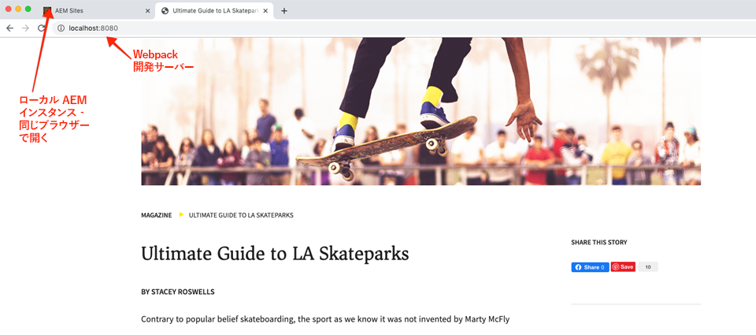
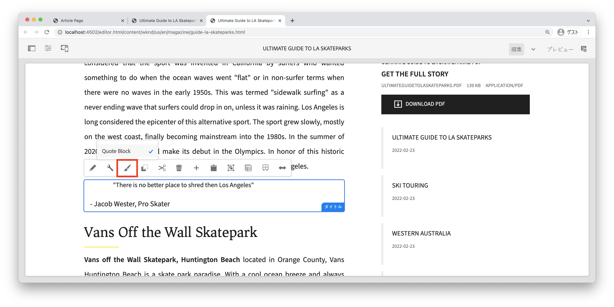

# スタイルシステムを使用した開発 {#developing-with-the-style-system}

Experience Managerのスタイルシステムを使用して、個々のスタイルを実装し、コアコンポーネントを再利用する方法について説明します。 このチュートリアルでは、スタイルシステムの開発と、ブランド固有のCSSを使用したコアコンポーネントの拡張、およびテンプレートエディターの高度なポリシー設定について説明します。

## 前提条件 {#prerequisites}

[ローカル開発環境](overview.md#local-dev-environment)の設定に必要なツールと手順を確認します。

また、クライアント側ライブラリとAEMプロジェクトに組み込まれた様々なフロントエンドツールの基本を理解するには、 [クライアント側ライブラリとフロントエンドワークフロー](client-side-libraries.md)のチュートリアルを確認することをお勧めします。

### スタータープロジェクト

>[!NOTE]
>
> 前の章を正常に完了した場合は、プロジェクトを再利用し、スタータープロジェクトをチェックアウトする手順をスキップできます。

チュートリアルで構築するベースラインコードを確認します。

1. [GitHub](https://github.com/adobe/aem-guides-wknd)の`tutorial/style-system-start`ブランチを確認します。

   ```shell
   $ cd aem-guides-wknd
   $ git checkout tutorial/style-system-start
   ```

1. Mavenのスキルを使用して、ローカルのAEMインスタンスにコードベースをデプロイします。

   ```shell
   $ mvn clean install -PautoInstallSinglePackage
   ```

   >[!NOTE]
   >
   > AEM 6.5または6.4を使用している場合は、任意のMavenコマンドに`classic`プロファイルを追加します。

   ```shell
   $ mvn clean install -PautoInstallSinglePackage -Pclassic
   ```

[GitHub](https://github.com/adobe/aem-guides-wknd/tree/tutorial/style-system-solution)で完成したコードをいつでも表示したり、ブランチ`tutorial/style-system-solution`に切り替えてコードをローカルでチェックアウトしたりできます。

## 目的

1. スタイルシステムを使用して、ブランド固有のCSSをAEMコアコンポーネントに適用する方法を説明します。
1. BEM表記と、BEM表記を使用してスタイルを慎重にスコープする方法について説明します。
1. 編集可能なテンプレートを使用して、詳細なポリシー設定を適用します。

## 作成する内容 {#what-you-will-build}

この章では、[スタイルシステム機能](https://docs.adobe.com/content/help/ja-JP/experience-manager-learn/sites/page-authoring/style-system-feature-video-use.html)を使用して、記事ページで使用する&#x200B;**タイトル**&#x200B;コンポーネントと&#x200B;**テキスト**&#x200B;コンポーネントのバリエーションを作成します。


*タイトルコンポーネントで使用できる下線スタイル*

## 背景 {#background}

開発者およびテンプレート編集者は、[スタイルシステム](https://docs.adobe.com/content/help/ja-JP/experience-manager-65/developing/components/style-system.html)を使用して、コンポーネントの複数の視覚的バリエーションを作成できます。次に、作成者はページを構成する際に、どのスタイルを使用するかを決めることができます。以降のすべてのチュートリアルでは、ローコードの手法でコアコンポーネントを使用しながら、スタイルシステムを使用して、いくつかの独自のスタイルを創出していきます。

スタイルシステムの基本的な考え方は、コンポーネントがどのように表示されるかについて、作成者が様々なスタイルを選択できるようにすることです。「スタイル」は、コンポーネントの外側の div に取り込まれた追加の CSS クラスに基づき実現されます。これらのスタイルクラスに基づき、CSS ルールがクライアントライブラリに追加され、コンポーネントの表示が変更されます。

スタイルシステムの詳細なドキュメントは、[で確認できます。 ](https://experienceleague.adobe.com/docs/experience-manager-cloud-service/sites/authoring/features/style-system.html?lang=ja)また、スタイルシステム](https://experienceleague.adobe.com/docs/experience-manager-learn/sites/developing/style-system-technical-video-understand.html)を理解するための優れた[テクニカルビデオもあります。

## 下線スタイル — タイトル{#underline-style}

[タイトルコンポーネント](https://experienceleague.adobe.com/docs/experience-manager-core-components/using/components/title.html)は、**ui.apps**&#x200B;モジュールの一部として`/apps/wknd/components/title`の下のプロジェクトにプロキシ化されています。 見出し要素(`H1`、`H2`、`H3`...)のデフォルトのスタイルは、**ui.frontend**&#x200B;モジュールに既に実装されています。

[WKND Article designs](assets/pages-templates/wknd-article-design.xd)には、下線付きのタイトルコンポーネント用の一意のスタイルが含まれています。 2つのコンポーネントを作成したり、コンポーネントダイアログを変更する代わりに、スタイルシステムを使用して、作成者が下線スタイルを追加できるようにします。


### Inspectタイトルマークアップ

フロントエンド開発者は、コアコンポーネントのスタイル設定をおこなう最初の手順は、コンポーネントによって生成されたマークアップを理解することです。

1. 新しいブラウザーを開き、AEMコアコンポーネントライブラリサイトでタイトルコンポーネントを表示します。[https://www.aemcomponents.dev/content/core-components-examples/library/page-authoring/title.html](https://www.aemcomponents.dev/content/core-components-examples/library/page-authoring/title.html)

1. 以下に、タイトルコンポーネントのマークアップを示します。

   ```html
   <div class="cmp-title">
       <h1 class="cmp-title__text">Lorem Ipsum</h1>
   </div>
   ```

   タイトルコンポーネントのBEM表記：

   ```plain
   BLOCK cmp-title
       ELEMENT cmp-title__text
   ```

1. スタイルシステムは、コンポーネントを囲む外側のdivにCSSクラスを追加します。 したがって、ターゲットとするマークアップは次のようになります。

   ```html
   <div class="STYLE-SYSTEM-CLASS-HERE"> <!-- Custom CSS class - implementation gets to define this -->
       <div class="cmp-title">
           <h1 class="cmp-title__text">Lorem Ipsum</h1>
       </div>
   </div>
   ```

### 下線スタイルの実装 — ui.frontend

次に、プロジェクトの&#x200B;**ui.frontend**&#x200B;モジュールを使用して、Underlineスタイルを実装します。 **ui.frontend**&#x200B;モジュールにバンドルされているWebPack開発サーバーを使用して、AEMのローカルインスタンスにデプロイする前に、*スタイル*&#x200B;をプレビューします。

1. **ui.frontend**&#x200B;モジュール内から次のコマンドを実行して、webpack開発サーバーを起動します。

   ```shell
   $ cd ~/code/aem-guides-wknd/ui.frontend/
   $ npm start
   
   > aem-maven-archetype@1.0.0 start code/aem-guides-wknd/ui.frontend
   > webpack-dev-server --open --config ./webpack.dev.js
   ```

   [http://localhost:8080](http://localhost:8080)でブラウザーが開きます。

   >[!NOTE]
   >
   > 画像が壊れているように見える場合は、スタータープロジェクトがAEMのローカルインスタンス（ポート4502で実行）にデプロイされ、使用するブラウザーもローカルAEMインスタンスにログインしていることを確認します。

   

1. IDEで、次の場所にあるファイル`index.html`を開きます。`ui.frontend/src/main/webpack/static/index.html`. これは、WebPack開発サーバーで使用される静的マークアップです。
1. `index.html`で、下線スタイルを追加するタイトルコンポーネントのインスタンスを探し、ドキュメントで&#x200B;*cmp-title*&#x200B;を検索します。 「タイトル」コンポーネントを選択し、テキスト「*&quot;Vans off the Wall Skatepark&quot;*」（218行目）を指定します。 周囲のdivにクラス`cmp-title--underline`を追加します。

   ```diff
   - <div class="title aem-GridColumn--phone--12 aem-GridColumn aem-GridColumn--default--8">
   + <div class="cmp-title--underline title aem-GridColumn--phone--12 aem-GridColumn aem-GridColumn--default--8">
        <div data-cmp-data-layer="{&#34;title-8bea562fa0&#34;:{&#34;@type&#34;:&#34;wknd/components/title&#34;,&#34;repo:modifyDate&#34;:&#34;2021-01-22T18:54:20Z&#34;,&#34;dc:title&#34;:&#34;Vans Off the Wall&#34;}}" id="title-8bea562fa0" class="cmp-title">
            <h2 class="cmp-title__text">Vans Off the Wall</h2>
        </div>
    </div>
   ```

1. ブラウザーに戻り、追加のクラスがマークアップに反映されていることを確認します。
1. **ui.frontend**&#x200B;モジュールに戻り、次の場所にあるファイル`title.scss`を更新します。`ui.frontend/src/main/webpack/components/_title.scss`:

   ```css
   /* Add Title Underline Style */
   .cmp-title--underline {
       .cmp-title__text {
           &:after {
           display: block;
               width: 84px;
               padding-top: 8px;
               content: '';
               border-bottom: 2px solid $brand-primary;
           }
       }
   }
   ```

   >[!NOTE]
   >
   >ベストプラクティスとしては、スタイルをターゲットコンポーネントで使用する範囲に収めることが推奨されます。これにより、ページの他の領域が余分なスタイルの影響を受けることを回避できます。
   >
   >すべてのコアコンポーネントは、**[BEM表記](https://github.com/adobe/aem-core-wcm-components/wiki/css-coding-conventions)**&#x200B;に準拠しています。 ベストプラクティスとしては、コンポーネントのデフォルトスタイルを作成する際は、外部の CSS クラスを指定することが推奨されます。また、HTML 要素ではなく、コアコンポーネントの BEM 記法で指定されたクラス名を指定することが推奨されます。

1. ブラウザーに戻ると、下線スタイルが追加されます。

   

1. WebPack開発サーバーを停止します。

### タイトルポリシーの追加

次に、タイトルコンポーネント用の新しいポリシーを追加し、コンテンツ作成者が特定のコンポーネントに適用する下線スタイルを選択できるようにする必要があります。 これは、AEM内のテンプレートエディターを使用しておこないます。

1. Mavenのスキルを使用して、コードベースをローカルのAEMインスタンスにデプロイします。

   ```shell
   $ cd ~/code/aem-guides-wknd
   $ mvn clean install -PautoInstallSinglePackage
   ```

1. 次の場所にある&#x200B;**記事ページ**&#x200B;テンプレートに移動します。[http://localhost:4502/editor.html/conf/wknd/settings/wcm/templates/article-page/structure.html](http://localhost:4502/editor.html/conf/wknd/settings/wcm/templates/article-page/structure.html)

1. **構造**&#x200B;モードのメインの&#x200B;**レイアウトコンテナ**&#x200B;で、「*許可されるコンポーネント*」に表示されている&#x200B;**タイトル**&#x200B;コンポーネントの横にある&#x200B;**ポリシー**&#x200B;アイコンを選択します。

   

1. 次の値を持つタイトルコンポーネントの新しいポリシーを作成します。

   *ポリシーのタイトル**: **WKNDタイトル**

   *プロパティ* /「 *スタイル」タブ* / *新しいスタイルを追加*

   **下線** :  `cmp-title--underline`

   

   「**完了**」をクリックして、タイトルポリシーに対する変更を保存します。

   >[!NOTE]
   >
   > 値`cmp-title--underline`は、**ui.frontend**&#x200B;モジュールで開発する際に、先ほどターゲットにしたCSSクラスと一致します。

### 下線スタイルの適用

最後に、作成者は、特定のタイトルコンポーネントに下線スタイルを適用することを選択できます。

1. AEM Sitesエディターの&#x200B;**La Skateparks**&#x200B;記事に移動します。[http://localhost:4502/editor.html/content/wknd/us/en/magazine/guide-la-skateparks.html](http://localhost:4502/editor.html/content/wknd/us/en/magazine/guide-la-skateparks.html)
1. **編集**&#x200B;モードで、タイトルコンポーネントを選択します。 **paintbrush**&#x200B;アイコンをクリックし、**下線**&#x200B;スタイルを選択します。

   

   作成者は、スタイルのオン/オフを切り替えることができます。

1. **ページ情報**&#x200B;アイコン/**公開済みとして表示**&#x200B;をクリックして、AEMエディターの外部でページを調べます。

   

   ブラウザー開発者ツールを使用して、タイトルコンポーネントの周囲のマークアップに、外側のdivに適用されたCSSクラス`cmp-title--underline`があることを確認します。

## Quote Block Style - Text {#text-component}

次に、同様の手順を繰り返して、[テキストコンポーネント](https://experienceleague.adobe.com/docs/experience-manager-core-components/using/components/text.html)に独自のスタイルを適用します。 テキストコンポーネントは、**ui.apps**&#x200B;モジュールの一部として`/apps/wknd/components/text`の下のプロジェクトにプロキシ化されています。 **ui.frontend**&#x200B;には、段落要素のデフォルトスタイルが既に実装されています。

[WKND Article designs](assets/pages-templates/wknd-article-design.xd)には、引用符ブロックを含むテキストコンポーネント用の一意のスタイルが含まれます。


### Inspectテキストコンポーネントのマークアップ

テキストコンポーネントのマークアップを再度調べます。

1. テキストコンポーネントのマークアップを次の場所で確認します。[https://www.aemcomponents.dev/content/core-components-examples/library/page-authoring/text.html](https://www.aemcomponents.dev/content/core-components-examples/library/page-authoring/text.html)

1. 次に、テキストコンポーネントのマークアップを示します。

   ```html
   <div class="text">
       <div class="cmp-text" data-cmp-data-layer="{&quot;text-2d9d50c5a7&quot;:{&quot;@type&quot;:&quot;core/wcm/components/text/v2/text&quot;,&quot;repo:modifyDate&quot;:&quot;2019-01-22T11:56:17Z&quot;,&quot;xdm:text&quot;:&quot;<p>Lorem ipsum dolor sit amet, consectetur adipiscing elit, sed do eiusmod tempor incididunt ut labore et dolore magna aliqua. Eu mi bibendum neque egestas congue quisque egestas. Varius morbi enim nunc faucibus a pellentesque. Scelerisque eleifend donec pretium vulputate sapien nec sagittis.</p>\n&quot;}}" id="text-2d9d50c5a7">
           <p>Lorem ipsum dolor sit amet, consectetur adipiscing elit, sed do eiusmod tempor incididunt ut labore et dolore magna aliqua. Eu mi bibendum neque egestas congue quisque egestas. Varius morbi enim nunc faucibus a pellentesque. Scelerisque eleifend donec pretium vulputate sapien nec sagittis.</p>
       </div>
   </div>
   ```

   テキストコンポーネントのBEM表記：

   ```plain
   BLOCK cmp-text
       ELEMENT
   ```

1. スタイルシステムは、コンポーネントを囲む外側のdivにCSSクラスを追加します。 したがって、ターゲットとするマークアップは次のようになります。

   ```html
   <div class="text STYLE-SYSTEM-CLASS-HERE"> <!-- Custom CSS class - implementation gets to define this -->
       <div class="cmp-text" data-cmp-data-layer="{&quot;text-2d9d50c5a7&quot;:{&quot;@type&quot;:&quot;core/wcm/components/text/v2/text&quot;,&quot;repo:modifyDate&quot;:&quot;2019-01-22T11:56:17Z&quot;,&quot;xdm:text&quot;:&quot;<p>Lorem ipsum dolor sit amet, consectetur adipiscing elit, sed do eiusmod tempor incididunt ut labore et dolore magna aliqua. Eu mi bibendum neque egestas congue quisque egestas. Varius morbi enim nunc faucibus a pellentesque. Scelerisque eleifend donec pretium vulputate sapien nec sagittis.</p>\n&quot;}}" id="text-2d9d50c5a7">
           <p>Lorem ipsum dolor sit amet, consectetur adipiscing elit, sed do eiusmod tempor incididunt ut labore et dolore magna aliqua. Eu mi bibendum neque egestas congue quisque egestas. Varius morbi enim nunc faucibus a pellentesque. Scelerisque eleifend donec pretium vulputate sapien nec sagittis.</p>
       </div>
   </div>
   ```

### Quote Block Styleの実装 — ui.frontend

次に、プロジェクトの&#x200B;**ui.frontend**&#x200B;モジュールを使用してQuote Blockスタイルを実装します。

1. **ui.frontend**&#x200B;モジュール内から次のコマンドを実行して、webpack開発サーバーを起動します。

   ```shell
   $ cd ~/code/aem-guides-wknd/ui.frontend/
   $ npm start
   ```

1. IDEで、次の場所にあるファイル`index.html`を開きます。`ui.frontend/src/main/webpack/static/index.html`.
1. `index.html`で、テキスト&#x200B;*&quot;Jacob Wester&quot;*（210行目）を検索して、テキストコンポーネントのインスタンスを見つけます。 周囲のdivにクラス`cmp-text--quote`を追加します。

   ```diff
   - <div class="text aem-GridColumn--phone--12 aem-GridColumn aem-GridColumn--default--8">
   + <div class="cmp-text--quote text aem-GridColumn--phone--12 aem-GridColumn aem-GridColumn--default--8">
        <div data-cmp-data-layer="{&#34;text-a15f39a83a&#34;:{&#34;@type&#34;:&#34;wknd/components/text&#34;,&#34;repo:modifyDate&#34;:&#34;2021-01-22T00:23:27Z&#34;,&#34;xdm:text&#34;:&#34;&lt;blockquote>&amp;quot;There is no better place to shred then Los Angeles.”&lt;/blockquote>\r\n&lt;p>- Jacob Wester, Pro Skater&lt;/p>\r\n&#34;}}" id="text-a15f39a83a" class="cmp-text">
            <blockquote>&quot;There is no better place to shred then Los Angeles.”</blockquote>
            <p>- Jacob Wester, Pro Skater</p>
        </div>
    </div>
   ```

1. 次の場所にあるファイル`text.scss`を更新します。`ui.frontend/src/main/webpack/components/_text.scss`:

   ```css
   /* WKND Text Quote style */
   .cmp-text--quote {
       .cmp-text {
           background-color: $brand-third;
           margin: 1em 0em;
           padding: 1em;
   
           blockquote {
               border: none;
               font-size: $font-size-large;
               font-family: $font-family-serif;
               padding: 14px 14px;
               margin: 0;
               margin-bottom: 0.5em;
   
               &:after {
                   border-bottom: 2px solid $brand-primary; /*yellow border */
                   content: '';
                   display: block;
                   position: relative;
                   top: 0.25em;
                   width: 80px;
               }
           }
           p {
               font-family:  $font-family-serif;
           }
       }
   }
   ```

   >[!CAUTION]
   >
   > この場合、生のHTML要素はスタイルのターゲットになります。 これは、テキストコンポーネントがコンテンツ作成者にリッチテキストエディターを提供するからです。 RTEコンテンツに対して直接スタイルを作成する場合は、慎重におこなう必要があり、スタイルを厳密にスコープ設定する方がさらに重要です。

1. ブラウザーに戻ると、Quoteブロックのスタイルが追加されます。

   

1. WebPack開発サーバーを停止します。

### テキストポリシーの追加

次に、テキストコンポーネントの新しいポリシーを追加します。

1. Mavenのスキルを使用して、ローカルのAEMインスタンスにコードベースをデプロイします。

   ```shell
   $ cd ~/code/aem-guides-wknd
   $ mvn clean install -PautoInstallSinglePackage
   ```

1. 次の場所にある&#x200B;**記事ページテンプレート**&#x200B;に移動します。[http://localhost:4502/editor.html/conf/wknd/settings/wcm/templates/article-page/structure.html](http://localhost:4502/editor.html/conf/wknd/settings/wcm/templates/article-page/structure.html))を読み込みます。

1. **構造**&#x200B;モードのメインの&#x200B;**レイアウトコンテナ**&#x200B;で、「*許可されるコンポーネント*」に表示されている&#x200B;**テキスト**&#x200B;コンポーネントの横にある&#x200B;**ポリシー**&#x200B;アイコンを選択します。

   

1. 次の値を使用して、テキストコンポーネントポリシーを更新します。

   *ポリシーのタイトル**: **コンテンツテキスト**

   *プラグイン* / *段落スタイル* / *段落スタイルを有効にする*

   *「スタイル」タブ* / *新しいスタイルを追加*

   **見積もりブロック** :  `cmp-text--quote`

   

   

   「**完了**」をクリックして、テキストポリシーに対する変更を保存します。

### Quote Blockスタイルの適用

1. AEM Sitesエディターの&#x200B;**La Skateparks**&#x200B;記事に移動します。[http://localhost:4502/editor.html/content/wknd/us/en/magazine/guide-la-skateparks.html](http://localhost:4502/editor.html/content/wknd/us/en/magazine/guide-la-skateparks.html)
1. **編集**&#x200B;モードで、テキストコンポーネントを選択します。 コンポーネントを編集して、引用符要素を含めます。

   

1. テキストコンポーネントを選択し、**paintbrush**&#x200B;アイコンをクリックして、**ブロックを引用**&#x200B;スタイルを選択します。

   

   作成者は、スタイルのオン/オフを切り替えることができます。

## 固定幅 — コンテナ（ボーナス） {#layout-container}

コンテナコンポーネントは、記事ページテンプレートの基本構造を作成し、コンテンツ作成者がページにコンテンツを追加するためのドロップゾーンを提供するために使用されています。 コンテナはスタイルシステムを活用して、コンテンツ作成者がレイアウトをデザインするためのさらに多くのオプションを提供することもできます。

記事ページテンプレートの&#x200B;**メインコンテナ**&#x200B;には、2つの作成者可能なコンテナが含まれ、幅は固定されています。


*記事ページテンプレートのメインコンテナ*&#x200B;を参照してください。

**メインコンテナ**&#x200B;のポリシーでは、デフォルトの要素を`main`に設定します。


**メインコンテナ**&#x200B;を固定するCSSは、 `ui.frontend/src/main/webpack/site/styles/container_main.scss`にある&#x200B;**ui.frontend**&#x200B;モジュールに設定されます。

```SCSS
main.container {
    padding: .5em 1em;
    max-width: $max-content-width;
    float: unset!important;
    margin: 0 auto!important;
    clear: both!important;
}
```

`main` HTML要素のターゲット設定の代わりに、スタイルシステムを使用して、コンテナポリシーの一部として&#x200B;**固定幅**&#x200B;スタイルを作成できます。 スタイルシステムでは、**固定幅**&#x200B;コンテナと&#x200B;**可変幅**&#x200B;コンテナを切り替えるオプションを使用できます。

1. **ボーナスチャレンジ**  — 前の演習で学んだレッスンを使用し、スタイルシステムを使用して、コンテナコンポーネントの固定幅方 **向の流** 体幅スタイルを実装しま **** す。

## バリデーターが {#congratulations}

これで、記事ページのスタイルはほぼ完全に設定され、AEM Style Systemを使用した実際の操作が可能になりました。

### 次の手順 {#next-steps}

ダイアログで作成されたコンテンツを表示する[カスタムAEMコンポーネント](custom-component.md)をエンドツーエンドで作成する手順を説明します。また、Sling Modelの開発で、コンポーネントのHTLに入力するビジネスロジックをカプセル化する方法を検討します。

[GitHub](https://github.com/adobe/aem-guides-wknd)で完成したコードを表示するか、Gitブラッチ`tutorial/style-system-solution`でコードをローカルに確認してデプロイします。

1. [github.com/adobe/aem-wknd-guides](https://github.com/adobe/aem-guides-wknd)リポジトリのクローンを作成します。
1. `tutorial/style-system-solution`ブランチを確認します。
