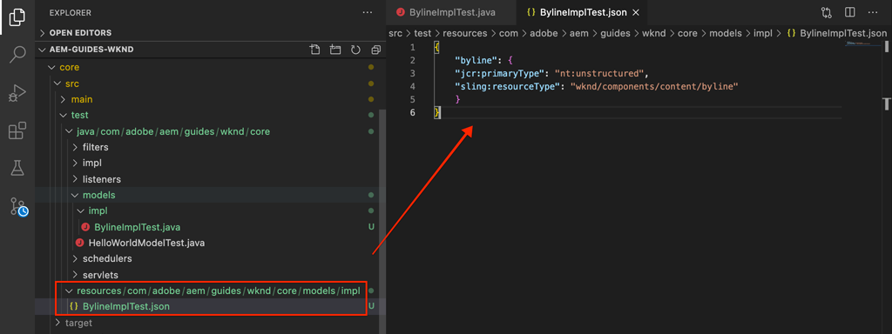

# 単体テスト {#unit-testing}

このチュートリアルでは、[カスタムコンポーネント](./custom-component.md)チュートリアルで作成した署名コンポーネントのSling Modelの動作を検証する単体テストの実装について説明します。

## 前提条件 {#prerequisites}

[ローカル開発環境](overview.md#local-dev-environment)の設定に必要なツールと手順を確認します。

_Java 8とJava 11の両方がシステムにインストールされている場合、VS Codeテストランナーは、テストの実行時に低いJavaランタイムを選択し、その結果、テストエラーが発生する可能性があります。この場合は、Java 8._&#x200B;をアンインストールします。

### スタータープロジェクト

>[!NOTE]
>
> 前の章を正常に完了した場合は、プロジェクトを再利用し、スタータープロジェクトをチェックアウトする手順をスキップできます。

チュートリアルで構築するベースラインコードを確認します。

1. [GitHub](https://github.com/adobe/aem-guides-wknd)の`tutorial/unit-testing-start`ブランチを確認します。

   ```shell
   $ cd aem-guides-wknd
   $ git checkout tutorial/unit-testing-start
   ```

1. Mavenのスキルを使用して、ローカルのAEMインスタンスにコードベースをデプロイします。

   ```shell
   $ mvn clean install -PautoInstallSinglePackage
   ```

   >[!NOTE]
   >
   > AEM 6.5または6.4を使用している場合は、任意のMavenコマンドに`classic`プロファイルを追加します。

   ```shell
   $ mvn clean install -PautoInstallSinglePackage -Pclassic
   ```

[GitHub](https://github.com/adobe/aem-guides-wknd/tree/tutorial/unit-testing-start)で完成したコードをいつでも表示したり、ブランチ`tutorial/unit-testing-start`に切り替えてコードをローカルでチェックアウトしたりできます。

## 目的

1. 単体テストの基本を理解します。
1. AEMコードのテストに一般的に使用されるフレームワークとツールについて説明します。
1. 単体テストを記述する際のAEMリソースのモッキングまたはシミュレーションのオプションについて説明します。

## 背景 {#unit-testing-background}

このチュートリアルでは、署名コンポーネントの[Sling Model](https://sling.apache.org/documentation/bundles/models.html)([カスタムAEMコンポーネントの作成](custom-component.md)で作成)の[単体テスト](https://ja.wikipedia.org/wiki/%E5%8D%98%E4%BD%93%E3%83%86%E3%82%B9%E3%83%88)を記述する方法を検討します。 単体テストは、Java コードの期待される動作を検証するために Java で記述されるビルド時間テストです。通常、各単体テストは小さく、期待される結果に対してメソッド（または作業単位）の出力を検証します。

ここでは、AEM ベストプラクティスおよび以下を使用します。

* [JUnit 5](https://junit.org/junit5/)
* [Mockito テストフレームワーク](https://site.mockito.org/)
* [wcm.ioテストフレームワーク](https://wcm.io/testing/) ( [Apache Sling Mocksを基に構築](https://sling.apache.org/documentation/development/sling-mock.html))

## 単体テストとAdobeCloud Manager {#unit-testing-and-adobe-cloud-manager}

[Adobe Cloud Managerは、ユニ](https://docs.adobe.com/content/help/ja/experience-manager-cloud-manager/using/introduction-to-cloud-manager.html) ットテストの実行とコ [ードカバレ](https://docs.adobe.com/content/help/en/experience-manager-cloud-manager/using/how-to-use/understand-your-test-results.html#code-quality-testing) ージのレポートをCI/CDパイプラインに統合し、AEMコードのユニットテストのベストプラクティスを促し、促進します。

コードの単体テストはあらゆるコードベースで有益ですが、Cloud Manager を使用している場合は、Cloud Manager で実行できる単体テストを提供して、コード品質のテストや報告機能を活用することが重要です。

## Inspect Mavenのテストの依存関係{#inspect-the-test-maven-dependencies}

最初の手順は、テストの記述と実行をサポートするために、Mavenの依存関係を調べることです。 次の4つの依存関係が必要です。

1. JUnit5
1. Mockitoテストフレームワーク
1. Apache Sling Mocks
1. AEM Mocksテストフレームワーク(io.wcm)

**JUnit5**、**Mockito**、**AEM Mocks**&#x200B;のテスト依存関係は、[AEM Mavenアーキタイプ](project-setup.md)を使用した設定時に、自動的にプロジェクトに追加されます。

1. これらの依存関係を表示するには、**aem-guides-wknd/pom.xml**&#x200B;にある親リアクターPOMを開き、`<dependencies>..</dependencies>`に移動して、次の依存関係が定義されていることを確認します。

   ```xml
   <dependencies>
       ...       
       <!-- Testing -->
       <dependency>
           <groupId>org.junit</groupId>
           <artifactId>junit-bom</artifactId>
           <version>5.6.2</version>
           <type>pom</type>
           <scope>import</scope>
       </dependency>
       <dependency>
           <groupId>org.mockito</groupId>
           <artifactId>mockito-core</artifactId>
           <version>3.3.3</version>
           <scope>test</scope>
       </dependency>
       <dependency>
           <groupId>org.mockito</groupId>
           <artifactId>mockito-junit-jupiter</artifactId>
           <version>3.3.3</version>
           <scope>test</scope>
       </dependency>
       <dependency>
           <groupId>junit-addons</groupId>
           <artifactId>junit-addons</artifactId>
           <version>1.4</version>
           <scope>test</scope>
       </dependency>
       <dependency>
           <groupId>io.wcm</groupId>
           <artifactId>io.wcm.testing.aem-mock.junit5</artifactId>
           <!-- Prefer the latest version of AEM Mock Junit5 dependency -->
           <version>3.0.2</version>
           <scope>test</scope>
       </dependency>        
       ...
   </dependencies>
   ```

1. **aem-guides-wknd/core/pom.xml**&#x200B;を開き、対応するテストの依存関係が使用可能であることを確認します。

   ```xml
   ...
   <!-- Testing -->
   <dependency>
       <groupId>org.junit.jupiter</groupId>
       <artifactId>junit-jupiter</artifactId>
       <scope>test</scope>
   </dependency>
   <dependency>
       <groupId>org.mockito</groupId>
       <artifactId>mockito-core</artifactId>
       <scope>test</scope>
   </dependency>
   <dependency>
       <groupId>org.mockito</groupId>
       <artifactId>mockito-junit-jupiter</artifactId>
       <scope>test</scope>
   </dependency>
   <dependency>
       <groupId>junit-addons</groupId>
       <artifactId>junit-addons</artifactId>
       <scope>test</scope>
   </dependency>
   <dependency>
       <groupId>io.wcm</groupId>
       <artifactId>io.wcm.testing.aem-mock.junit5</artifactId>
       <exclusions>
           <exclusion>
               <groupId>org.apache.sling</groupId>
               <artifactId>org.apache.sling.models.impl</artifactId>
           </exclusion>
           <exclusion>
               <groupId>org.slf4j</groupId>
               <artifactId>slf4j-simple</artifactId>
           </exclusion>
       </exclusions>
       <scope>test</scope>
   </dependency>
   <!-- Required to be able to support injection with @Self and @Via -->
   <dependency>
       <groupId>org.apache.sling</groupId>
       <artifactId>org.apache.sling.models.impl</artifactId>
       <version>1.4.4</version>
       <scope>test</scope>
   </dependency>
   ...
   ```

   **core**&#x200B;プロジェクトの並列ソースフォルダーには、単体テストと、サポートするテストファイルが含まれます。 この **test** フォルダーはテストクラスをソースコードから分離しますが、ソースコードと同じパッケージ内にあるようにテストを動作させることができます。

## JUnit テストの作成  {#creating-the-junit-test}

単体テストは一般的に、Java クラスと 1 対 1 でマッピングします。この章では、署名コンポーネントを支える Sling Model である **BylineImpl.java** 用に JUnit テストを記述します。


*単体テストが格納される場所。*

1. `BylineImpl.java`の単体テストを作成するには、テスト対象のJavaクラスの場所を反映するJavaパッケージフォルダー構造で、`src/test/java`の下に新しいJavaクラスを作成します。

   

   テスト中なので

   * `src/main/java/com/adobe/aem/guides/wknd/core/models/impl/BylineImpl.java`

   対応する単体テストJavaクラスを

   * `src/test/java/com/adobe/aem/guides/wknd/core/models/impl/BylineImplTest.java`

   単体テストファイルの`Test`サフィックス`BylineImplTest.java`は、

   1. _`BylineImpl.java`のテストファイル_&#x200B;として容易に識別できます。
   1. また、テスト対象のクラス&#x200B;_と_&#x200B;を区別します。`BylineImpl.java`


## BylineImplTest.java のレビュー {#reviewing-bylineimpltest-java}

この時点で、JUnitテストファイルは空のJavaクラスです。 ファイルを次のコードで更新します。

```java
package com.adobe.aem.guides.wknd.core.models.impl;

import static org.junit.jupiter.api.Assertions.*;

import org.junit.jupiter.api.BeforeEach;
import org.junit.jupiter.api.Test;

public class BylineImplTest {

    @BeforeEach
    void setUp() throws Exception {

    }

    @Test 
    void testGetName() { 
        fail("Not yet implemented");
    }
    
    @Test 
    void testGetOccupations() { 
        fail("Not yet implemented");
    }

    @Test 
    void testIsEmpty() { 
        fail("Not yet implemented");
    }
}
```

1. 最初のメソッド`public void setUp() { .. }`にはJUnitの`@BeforeEach`で注釈が付けられ、このクラスの各テストメソッドを実行する前にJUnitテストランナーにこのメソッドを実行するよう指示します。 これは、すべてのテストで必要な一般的なテスト状態を初期化する便利な場所です。

2. 以降のメソッドは、テストメソッドで、名前の前に`test`が付き、`@Test`注釈が付きます。 デフォルトでは、まだ実装していないので、すべてのテストが失敗するように設定されています。

   まず、テスト対象のクラスのパブリックメソッドごとに1つのテストメソッドから始めます。そのため、次のようにします。

   | BylineImpl.java |  | BylineImplTest.java |
   | ------------------|--------------|---------------------|
   | getName() | が | testGetName() |
   | getOccupations() | が | testGetOccupations() |
   | isEmpty() | が | testIsEmpty() |

   これらのメソッドは、必要に応じて拡張できます。詳しくは、この章で後述します。

   このJUnitテストクラス（JUnitテストケースとも呼ばれます）を実行すると、`@Test`でマークされた各メソッドが、合格または不合格のどちらかのテストとして実行されます。


*`core/src/test/java/com/adobe/aem/guides/wknd/core/models/impl/BylineImplTest.java`*

1. `BylineImplTest.java`ファイルを右クリックし、**「**を実行」をタップして、JUnitテストケースを実行します。
まだ実装されていないので、予想どおり、すべてのテストが失敗します。

   

   *BylineImplTests.javaを右クリックし、「実行」を選択します。*

## BylineImpl.java のレビュー {#reviewing-bylineimpl-java}

単体テストを作成する場合、主に次の2つの方法があります。

* [TDD またはテスト駆動開発](https://ja.wikipedia.org/wiki/%E3%83%86%E3%82%B9%E3%83%88%E9%A7%86%E5%8B%95%E9%96%8B%E7%99%BA)。実装を開発する直前に単体テストの増分を記述、テストを記述、実装を記述してテストを合格します。
* 最初に実装をおこなう開発。動作するコードを最初に開発してから、そのコードを検証するテストを記述します。

このチュートリアルでは、後者のアプローチを使用します（前の章で動作する **BylineImpl.java** を作成済みのため）。このため、パブリックメソッドの動作だけでなく、いくつかの実装の詳細についても確認および理解しておく必要があります。これは、適切なテストでは入力と出力のみを考慮する必要があるので、正しいテストとは異なる場合があります。ただし、AEMで作業する場合は、作業テストを作成するために様々な実装上の考慮事項を理解する必要があります。

AEM における TDD には高度な専門知識が必要です。AEM 開発や AEM コードの単体テストを熟知した AEM 開発者が使用することで最大限の効果を発揮できます。

## AEM テストコンテキストの設定  {#setting-up-aem-test-context}

AEM で記述されるコードの大部分は JCR、Sling または AEM API に依存しているので、正常に実行するためには実行中の AEM のコンテキストが必要となります。

単体テストは、実行中のAEMインスタンスのコンテキスト外で、ビルド時に実行されるので、そのようなコンテキストはありません。 これを容易にするために、[wcm.ioのAEM Mocks](https://wcm.io/testing/aem-mock/usage.html)は、これらのAPIをAEMで実行しているかのように&#x200B;_ほとんど_&#x200B;動作させるモックコンテキストを作成します。

1. **BylineImplTest.java**&#x200B;の&#x200B;**wcm.ioの** `AemContext`を使用してAEMコンテキストを作成します。その際、`@ExtendWith`で修飾されたJUnit拡張子を&#x200B;**BylineImplTest.java**&#x200B;ファイルに追加します。 この拡張機能は、必要なすべての初期化タスクとクリーンアップタスクを処理します。 すべてのテストメソッドで使用できる`AemContext`のクラス変数を作成します。

   ```java
   import org.junit.jupiter.api.extension.ExtendWith;
   import io.wcm.testing.mock.aem.junit5.AemContext;
   import io.wcm.testing.mock.aem.junit5.AemContextExtension;
   ...
   
   @ExtendWith(AemContextExtension.class)
   class BylineImplTest {
   
       private final AemContext ctx = new AemContext();
   ```

   この変数`ctx`は、AEMとSlingの抽象概念を多数提供するモックAEMコンテキストを公開します。

   * BylineImpl Sling Model はこのコンテキストに登録されます。
   * モック JCR コンテンツ構造はこのコンテキストで作成されます。
   * カスタム OSGi サービスはこのコンテキスト内で登録できます。
   * 一般的に必要となる様々なモックオブジェクトおよびヘルパー（SlingHttpServletRequest オブジェクトなど）、様々なモック Sling および AEM OSGi サービス（ModelFactory、PageManager、ページ、テンプレート、ComponentManager、コンポーネント、TagManager、タグなど）を提供します。
      * *これらのオブジェクトのすべてのメソッドが実装されるわけではありません。*
   * [その他](https://wcm.io/testing/aem-mock/usage.html)

   **`ctx`**&#x200B;オブジェクトは、ほとんどのモックコンテキストのエントリポイントとして機能します。

1. 各`@Test`メソッドの前に実行される`setUp(..)`メソッドで、一般的なモックテスト状態を定義します。

   ```java
   @BeforeEach
   public void setUp() throws Exception {
       ctx.addModelsForClasses(BylineImpl.class);
       ctx.load().json("/com/adobe/aem/guides/wknd/core/models/impl/BylineImplTest.json", "/content");
   }
   ```

   * **`addModelsForClasses`** は、テストするSlingモデルを、モックAEM Contextに登録し、メソッドでインスタンス化で `@Test` きます。
   * **`load().json`** は、リソース構造をモックコンテキストに読み込み、コードは、実際のリポジトリで提供された場合と同じように、これらのリソースを操作できます。ファイル **`BylineImplTest.json`** のリソース定義は、**/content** の下でモック JCR コンテキストに読み込まれます。
   * **`BylineImplTest.json`** がまだないので、作成してテストに必要な JCR リソース構造を定義しましょう。

1. モックリソース構造を表す JSON ファイルは、JUnit Java テストファイルと同じパッケージパスに従い、**core/src/test/resources** 配下に保存されます。

   **core/test/resources/com/adobe/aem/guides/wknd/core/models/impl**&#x200B;に、次の内容の新しいJSONファイルを作成します。 **BylineImplTest.json**

   ```json
   {
       "byline": {
       "jcr:primaryType": "nt:unstructured",
       "sling:resourceType": "wknd/components/content/byline"
       }
   }
   ```

   

   このJSONは、署名コンポーネントの単体テストのモックリソース（JCRノード）を定義します。 この時点で、JSONには署名コンポーネントのコンテンツリソース`jcr:primaryType`と`sling:resourceType`を表すのに必要な最小限のプロパティセットが含まれています。

   単体テストを扱う際の一般的なルールは、各テストを満たすのに必要な最小限のモックコンテンツ、コンテキスト、コードのセットを作成することです。 テストを作成する前に、完全なモックコンテキストを作成したくなるのを避けます。不要なアーティファクトが生じることがよくあります。

   **BylineImplTest.json**&#x200B;が存在する状態になり、`ctx.json("/com/adobe/aem/guides/wknd/core/models/impl/BylineImplTest.json", "/content")`が実行されると、モックリソース定義が&#x200B;**/content.**&#x200B;のパスにあるコンテキストに読み込まれます。

## getName() {#testing-get-name}のテスト

基本的なモックコンテキストの設定が完了したところで、**BylineImpl&#39;s getName()** の最初のテストを作成しましょう。このテストでは、メソッド **getName()** がリソースの &quot;**name**&quot; プロパティに保存されている、作成された正しい名前を返すことを確認する必要があります。

1. 次のように、**BylineImplTest.java** で **testGetName**() メソッドを更新します。

   ```java
   import com.adobe.aem.guides.wknd.core.components.Byline;
   ...
   @Test
   public void testGetName() {
       final String expected = "Jane Doe";
   
       ctx.currentResource("/content/byline");
       Byline byline = ctx.request().adaptTo(Byline.class);
   
       String actual = byline.getName();
   
       assertEquals(expected, actual);
   }
   ```

   * **`String expected`** 期待値を設定します。これを「**Jane Done**」に設定します。
   * **`ctx.currentResource`** は、コードを評価するモックリソースのコンテキストを設定します。そのため、これは、モック署名コンテンツリソースが読み込まれる **/content/** bylineasに設定されます。
   * **`Byline byline`** モックリクエストオブジェクトから適応させて署名Sling Modelをインスタンス化します。
   * **`String actual`** 署名Sling Modelオブジェクトで、テ `getName()`スト中のメソッドを呼び出します。
   * **`assertEquals`** は、期待される値を署名Sling Modelオブジェクトが返す値と一致させます。これらの値が等しくない場合、テストは失敗します。

1. テストを実行すると、`NullPointerException`で失敗します。

   モックJSONに`name`プロパティを定義したことがないので、このテストは失敗しません。テストは失敗しますが、テストの実行はその時点に達していません。 このテストは、署名オブジェクト自体の`NullPointerException`が原因で失敗します。

1. `BylineImpl.java`で、`@PostConstruct init()`が例外をスローすると、Sling Modelがインスタンス化され、そのSling Modelオブジェクトがnullになるのを防ぎます。

   ```java
   @PostConstruct
   private void init() {
       image = modelFactory.getModelFromWrappedRequest(request, request.getResource(), Image.class);
   }
   ```

   ModelFactory OSGiサービスが`AemContext`を介して（Apache Slingコンテキストを介して）提供されている間、`getModelFromWrappedRequest(...)`を含むすべてのメソッドが実装されているわけではありません（BylineImplの`init()`メソッドで呼び出される）。 これにより、[AbstractMethodError](https://docs.oracle.com/en/java/javase/11/docs/api/java.base/java/lang/AbstractMethodError.html)が発生し、`init()`が失敗し、結果として`ctx.request().adaptTo(Byline.class)`がnullオブジェクトになります。

   指定されたモックがコードに対応できないので、モックコンテキストを自分で実装する必要があります。そのために、Mockitoを使用して、モックImageオブジェクトを返すモックModelFactoryオブジェクトを作成できます。`getModelFromWrappedRequest(...)`

   署名Slingモデルをインスタンス化する場合でも、このモックコンテキストを配置する必要があるので、 `@Before setUp()`メソッドに追加できます。 また、`MockitoExtension.class`を&#x200B;**BylineImplTest**&#x200B;クラスの上の`@ExtendWith`注釈に追加する必要があります。

   ```java
   package com.adobe.aem.guides.wknd.core.models.impl;
   
   import org.mockito.junit.jupiter.MockitoExtension;
   import org.mockito.Mock;
   
   import com.adobe.aem.guides.wknd.core.models.Byline;
   import com.adobe.cq.wcm.core.components.models.Image;
   
   import io.wcm.testing.mock.aem.junit5.AemContext;
   import io.wcm.testing.mock.aem.junit5.AemContextExtension;
   
   import org.apache.sling.models.factory.ModelFactory;
   import org.junit.jupiter.api.BeforeEach;
   import org.junit.jupiter.api.Test;
   import org.junit.jupiter.api.extension.ExtendWith;
   
   import static org.junit.jupiter.api.Assertions.*;
   import static org.mockito.Mockito.*;
   import org.apache.sling.api.resource.Resource;
   
   @ExtendWith({ AemContextExtension.class, MockitoExtension.class })
   public class BylineImplTest {
   
       private final AemContext ctx = new AemContext();
   
       @Mock
       private Image image;
   
       @Mock
       private ModelFactory modelFactory;
   
       @BeforeEach
       public void setUp() throws Exception {
           ctx.addModelsForClasses(BylineImpl.class);
   
           ctx.load().json("/com/adobe/aem/guides/wknd/core/models/impl/BylineImplTest.json", "/content");
   
           lenient().when(modelFactory.getModelFromWrappedRequest(eq(ctx.request()), any(Resource.class), eq(Image.class)))
                   .thenReturn(image);
   
           ctx.registerService(ModelFactory.class, modelFactory, org.osgi.framework.Constants.SERVICE_RANKING,
                   Integer.MAX_VALUE);
       }
   
       @Test
       void testGetName() { ...
   }
   ```

   * **`@ExtendWith({AemContextExtension.class, MockitoExtension.class})`** は、Mockito JUnit Jupiter Extensionで実行されるテストケースクラスをマークしま [](https://www.javadoc.io/page/org.mockito/mockito-junit-jupiter/latest/org/mockito/junit/jupiter/MockitoExtension.html) す。このクラスレベルで、 @Mock注釈を使用してモックオブジェクトを定義できます。
   * **`@Mock private Image`** は、型のモックオブジェクトを作成しま `com.adobe.cq.wcm.core.components.models.Image`す。必要に応じて`@Test`メソッドの動作を変更できるように、これはクラスレベルで定義されます。
   * **`@Mock private ModelFactory`** は、型がModelFactoryのモックオブジェクトを作成します。これは純粋な Mockito モックであり、メソッドは実装されません。必要に応じて`@Test`メソッドの動作を変更できるように、これはクラスレベルで定義されます。
   * **`when(modelFactory.getModelFromWrappedRequest(..)`** は、がモックModelFactoryオブジェクトで呼び出さ `getModelFromWrappedRequest(..)` れたときにのモック動作を登録します。`thenReturn (..)`で定義された結果は、モックImageオブジェクトを返すことです。 この動作は、次の場合にのみ呼び出されます。1番目のパラメーターは`ctx`のリクエストオブジェクト、2番目のパラメーターは任意のResourceオブジェクト、3番目のパラメーターはコアコンポーネントのImageクラスである必要があります。 テスト全体で`ctx.currentResource(...)`を&#x200B;**BylineImplTest.json**&#x200B;で定義された様々なモックリソースに設定するので、リソースを受け入れます。 後でModelFactoryのこの動作を上書きする必要があるので、**lenient()**&#x200B;の厳密性を追加します。
   * **`ctx.registerService(..)`** は、最も高いサービスランキングを持つモックModelFactoryオブジェクトをAemContextに登録します。BylineImplの`init()`で使用されるModelFactoryは`@OSGiService ModelFactory model`フィールドを使用して挿入されるので、これが必要です。 `getModelFromWrappedRequest(..)`への呼び出しを処理する&#x200B;**アドビの**&#x200B;モックオブジェクトをAemContextが挿入するには、そのタイプ(ModelFactory)の最上位のランキングサービスとして登録する必要があります。

1. テストを再実行すると再び失敗しますが、今回は失敗の理由が明白です。

   

   *アサーションによる testGetName() の失敗*

   **AssertionError** が返されます。これはテストでのアサート条件が失敗し、**期待値は &quot;Jane Doe&quot;** で、**実際の値が null** なことを示します。**BylineImplTest.json** のモック **/content/byline** リソース定義に &quot;**name**&quot; プロパティが追加されていないので、この結果は当然です。そこで、これを追加します。

1. **BylineImplTest.json**&#x200B;を更新して`"name": "Jane Doe".`を定義します。

   ```json
   {
       "byline": {
       "jcr:primaryType": "nt:unstructured",
       "sling:resourceType": "wknd/components/content/byline",
       "name": "Jane Doe"
       }
   }
   ```

1. テストを再実行すると、**`testGetName()`**&#x200B;が成功します。

   


## getOccupations() {#testing-get-occupations}のテスト

成功です。最初のテストはうまくいきました。次に、`getOccupations()`をテストします。 モックコンテキストの初期化は`@Before setUp()`メソッドでおこなわれるので、`getOccupations()`を含め、このテストケースのすべての`@Test`メソッドで使用できます。

このメソッドは、職業プロパティに保存されている職業のリストをアルファベット順（降順）に並べ替えて返します。

1. **`testGetOccupations()`**&#x200B;を次のように更新します。

   ```java
   import java.util.List;
   import com.google.common.collect.ImmutableList;
   ...
   @Test
   public void testGetOccupations() {
       List<String> expected = new ImmutableList.Builder<String>()
                               .add("Blogger")
                               .add("Photographer")
                               .add("YouTuber")
                               .build();
   
       ctx.currentResource("/content/byline");
       Byline byline = ctx.request().adaptTo(Byline.class);
   
       List<String> actual = byline.getOccupations();
   
       assertEquals(expected, actual);
   }
   ```

   * **`List<String> expected`** 期待される結果を定義します。
   * **`ctx.currentResource`** 現在のリソースを設定して、 /content/bylineにあるモックリソース定義に対するコンテキストを評価します。これにより、モックリソースのコンテキストで **BylineImpl.java** が実行されるようにします。
   * **`ctx.request().adaptTo(Byline.class)`** モックリクエストオブジェクトから適応させて署名Sling Modelをインスタンス化します。
   * **`byline.getOccupations()`** 署名Sling Modelオブジェクトで、テ `getOccupations()`スト中のメソッドを呼び出します。
   * **`assertEquals(expected, actual)`** は、実際のリストと同じリストをアサートします。

1. 前述の&#x200B;**`getName()`**&#x200B;と同様に、**BylineImplTest.json**&#x200B;は職業を定義しないので、`byline.getOccupations()`は空のリストを返すので、このテストを実行すると失敗します。

   **BylineImplTest.json**&#x200B;を更新して職業のリストを含めます。テストでは、職業が&#x200B;**`getOccupations()`**&#x200B;のアルファベット順で並べ替えられていることを検証するために、職業がアルファベット順以外で設定されます。

   ```json
   {
       "byline": {
       "jcr:primaryType": "nt:unstructured",
       "sling:resourceType": "wknd/components/content/byline",
       "name": "Jane Doe",
       "occupations": ["Photographer", "Blogger", "YouTuber"]
       }
   }
   ```

1. テストを実行すると、再び成功します。職業を並べ替えたことが良かったようです。

   

   *testGetOccupations() は成功*

## isEmpty() {#testing-is-empty}のテスト

**`isEmpty()`**&#x200B;をテストする最後のメソッド。

`isEmpty()`のテストは、様々な条件のテストが必要なので興味深いものです。 **BylineImpl.java**&#x200B;の`isEmpty()`メソッドを確認するには、次の条件をテストする必要があります。

* 名前が空のときに true を返す。
* 職業が null または空のときに true を返す。
* 画像が空または src URL がない場合 true を返す。
* 名前、職業、および Image（  src URL)が存在する

これにより、`BylineImplTest.json` で特定の条件や新しいモックリソース構造をテストする新しいテストメソッドを作成して、これらのテストを駆動させる必要があります。

このチェックでは、`getName()`、`getOccupations()`、`getImage()`が空の場合のテストをスキップできました。これは、その状態の想定される動作が`isEmpty()`を介してテストされるためです。

1. 最初のテストは、プロパティが設定されていない、まったく新しいコンポーネントの条件をテストします。

   `BylineImplTest.json` に新しいリソース定義を追加し、意味のある名前「**empty**」を付けます。

   ```json
   {
       "byline": {
           "jcr:primaryType": "nt:unstructured",
           "sling:resourceType": "wknd/components/content/byline",
           "name": "Jane Doe",
           "occupations": ["Photographer", "Blogger", "YouTuber"]
       },
       "empty": {
           "jcr:primaryType": "nt:unstructured",
           "sling:resourceType": "wknd/components/content/byline"
       }
   }
   ```

   **`"empty": {...}`** とのみを含む「empty」という新しいリソース定義を定義 `jcr:primaryType` しま `sling:resourceType`す。

   `@setUp`の各テストメソッドの実行前に`BylineImplTest.json`を`ctx`に読み込むので、この新しいリソース定義は、**/content/empty.**&#x200B;のテストですぐに使用できます。

1. `testIsEmpty()`を次のように更新し、現在のリソースを新しい「**empty**」モックリソース定義に設定します。

   ```java
   @Test
   public void testIsEmpty() {
       ctx.currentResource("/content/empty");
       Byline byline = ctx.request().adaptTo(Byline.class);
   
       assertTrue(byline.isEmpty());
   }
   ```

   テストを実行し、成功することを確認します。

1. 次に、必要なデータポイント（名前、職業、または画像）のいずれかが空の場合、`isEmpty()`がtrueを返すように、メソッドのセットを作成します。

   各テストで、個別のモックリソース定義が使用され、**BylineImplTest.json**&#x200B;を、**without-name**&#x200B;および&#x200B;**without-occupations**&#x200B;の追加のリソース定義で更新します。

   ```json
   {
       "byline": {
           "jcr:primaryType": "nt:unstructured",
           "sling:resourceType": "wknd/components/content/byline",
           "name": "Jane Doe",
           "occupations": ["Photographer", "Blogger", "YouTuber"]
       },
       "empty": {
           "jcr:primaryType": "nt:unstructured",
           "sling:resourceType": "wknd/components/content/byline"
       },
       "without-name": {
           "jcr:primaryType": "nt:unstructured",
           "sling:resourceType": "wknd/components/content/byline",
           "occupations": "[Photographer, Blogger, YouTuber]"
       },
       "without-occupations": {
           "jcr:primaryType": "nt:unstructured",
           "sling:resourceType": "wknd/components/content/byline",
           "name": "Jane Doe"
       }
   }
   ```

   次のテストメソッドを作成し、これらの状態をそれぞれテストします。

   ```java
   @Test
   public void testIsEmpty() {
       ctx.currentResource("/content/empty");
   
       Byline byline = ctx.request().adaptTo(Byline.class);
   
       assertTrue(byline.isEmpty());
   }
   
   @Test
   public void testIsEmpty_WithoutName() {
       ctx.currentResource("/content/without-name");
   
       Byline byline = ctx.request().adaptTo(Byline.class);
   
       assertTrue(byline.isEmpty());
   }
   
   @Test
   public void testIsEmpty_WithoutOccupations() {
       ctx.currentResource("/content/without-occupations");
   
       Byline byline = ctx.request().adaptTo(Byline.class);
   
       assertTrue(byline.isEmpty());
   }
   
   @Test
   public void testIsEmpty_WithoutImage() {
       ctx.currentResource("/content/byline");
   
       lenient().when(modelFactory.getModelFromWrappedRequest(eq(ctx.request()),
           any(Resource.class),
           eq(Image.class))).thenReturn(null);
   
       Byline byline = ctx.request().adaptTo(Byline.class);
   
       assertTrue(byline.isEmpty());
   }
   
   @Test
   public void testIsEmpty_WithoutImageSrc() {
       ctx.currentResource("/content/byline");
   
       when(image.getSrc()).thenReturn("");
   
       Byline byline = ctx.request().adaptTo(Byline.class);
   
       assertTrue(byline.isEmpty());
   }
   ```

   **`testIsEmpty()`** は空のモックリソース定義に対してテストし、trueであ `isEmpty()` ることをアサートします。

   **`testIsEmpty_WithoutName()`** 職業はあるものの名前がないモックリソース定義に対してテストします。

   **`testIsEmpty_WithoutOccupations()`** は、名前はあるが職業がないモックリソース定義に対してテストします。

   **`testIsEmpty_WithoutImage()`** は、名前と職業を持つモックリソース定義に対してテストしますが、モック画像がnullに戻るように設定します。`setUp()`で定義されている`modelFactory.getModelFromWrappedRequest(..)`動作を上書きして、この呼び出しによって返される画像オブジェクトがnullであることを確認します。 Mockitoのスタブ機能は厳しく、偽のコードは必要ありません。 したがって、**`lenient`**&#x200B;設定でモックを設定し、`setUp()`メソッドで動作を上書きしていることを明示的に示します。

   **`testIsEmpty_WithoutImageSrc()`** は、名前と職業を持つモックリソース定義に対してテストしますが、が呼び出されたときに空白の文字列を返すようにモックImageを `getSrc()` 設定します。

1. 最後に、コンポーネントが正しく設定されている場合、**isEmpty()** が false を返すようテストを記述します。この条件の場合は、完全に設定された署名コンポーネントを表す **/content/byline** を再使用できます。

   ```java
   @Test
   public void testIsNotEmpty() {
       ctx.currentResource("/content/byline");
       when(image.getSrc()).thenReturn("/content/bio.png");
   
       Byline byline = ctx.request().adaptTo(Byline.class);
   
       assertFalse(byline.isEmpty());
   }
   ```

1. 次に、BylineImplTest.javaファイル内のすべての単体テストを実行し、Javaテストレポートの出力を確認します。


## ビルドの一部として単体テストを実行する {#running-unit-tests-as-part-of-the-build}

単体テストは、Maven ビルドの一部として実行し、成功する必要があります。これにより、アプリケーションをデプロイする前にすべてのテストが成功することを確認します。パッケージやインストールなどのMaven目標を実行すると、が自動的に呼び出され、プロジェクト内のすべての単体テストに合格する必要があります。

```shell
$ mvn package
```


```shell
$ mvn package
```

同様に、テストメソッドが失敗するような変更を加えると、ビルドは失敗し、どのテストが失敗したのか、その理由は何かが報告されます。


## コード{#review-the-code}を確認します。

[GitHub](https://github.com/adobe/aem-guides-wknd)で完成したコードを表示するか、Gitブラッチ`tutorial/unit-testing-solution`でコードをローカルに確認してデプロイします。
