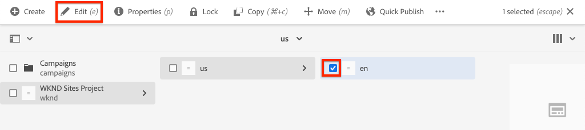

# プロジェクトのセットアップ {#project-setup}

このチュートリアルでは、Adobe Experience Managerサイトのコードと設定を管理するMaven Multi Module Projectの作成について説明します。

## 前提条件 {#prerequisites}

[ローカル開発環境](overview.md#local-dev-environment)の設定に必要なツールと手順を確認します。 Adobe Experience Managerの新しいインスタンスがローカルで使用されていること、および（必要なService Pack以外の）追加のサンプル/デモパッケージがインストールされていないことを確認します。

## 目的 {#objective}

1. Mavenアーキタイプを使用して新しいAEMプロジェクトを生成する方法を説明します。
1. AEMプロジェクトのアーキタイプで生成される様々なモジュールと、それらの連携の仕組みを理解します。
1. AEMコアコンポーネントがAEMプロジェクトに含まれる方法を理解します。

## 作成する内容 {#what-build}

>[!VIDEO](https://video.tv.adobe.com/v/30152/?quality=12&learn=on)

この章では、[AEMプロジェクトアーキタイプ](https://github.com/adobe/aem-project-archetype)を使用して、新しいAdobe Experience Managerプロジェクトを生成します。 AEMプロジェクトには、Sitesの導入に使用されるすべてのコード、コンテンツ、設定が含まれています。 本章で生成するプロジェクトは、WKNDサイトの導入の基盤となり、今後の章で構築される予定です。

**Mavenプロジェクトとは何ですか？** -  [Apache ](https://maven.apache.org/) Mavenisはプロジェクトを構築するためのソフトウェア管理ツールです。*すべてのAdobe Experience* Managerの実装では、Mavenプロジェクトを使用して、カスタムコードをAEM上で構築、管理およびデプロイします。

**Mavenアーキタイプとは何ですか。** -  [](https://maven.apache.org/archetype/index.html) Mavenアーキタイプは、新しいプロジェクトを生成するためのテンプレートまたはパターンです。AEMプロジェクトのアーキタイプを使用すると、カスタム名前空間を使用して新しいプロジェクトを生成し、ベストプラクティスに従ったプロジェクト構造を含めることができ、プロジェクトの迅速化に大きく貢献します。

## プロジェクト{#create}を作成

AEM用のMavenマルチモジュールプロジェクトを作成する方法はいくつかあります。 このチュートリアルでは、[Maven AEMプロジェクトのアーキタイプ&#x200B;**26**](https://github.com/adobe/aem-project-archetype)を活用します。 また、Cloud Managerには、AEMアプリケーションプロジェクトの作成を開始するためのUIウィザード[が用意されています。 ](https://docs.adobe.com/content/help/en/experience-manager-cloud-manager/using/getting-started/create-an-application-project.html)Cloud Manager UIで生成される基になるプロジェクトの結果は、アーキタイプを直接使用する場合と同じ構造になります。

>[!NOTE]
>
>このチュートリアルでは、アーキタイプのバージョン&#x200B;**26**&#x200B;を使用します。 新しいプロジェクトを生成する際には、常に、アーキタイプの&#x200B;**最新**&#x200B;バージョンを使用することをお勧めします。

次の一連の手順は、UNIXベースのコマンド・ライン・ターミナルを使用して行われますが、Windowsターミナルを使用する場合と同じである必要があります。

1. コマンドラインターミナルを開きます。 Mavenがインストールされていることを確認します。

   ```shell
   $ mvn --version
   Apache Maven 3.6.2
   Maven home: /Library/apache-maven-3.6.2
   Java version: 11.0.4, vendor: Oracle Corporation, runtime: /Library/Java/JavaVirtualMachines/jdk-11.0.4.jdk/Contents/Home
   ```

1. 次のコマンドを実行して、**adobe-public**&#x200B;プロファイルがアクティブであることを確認します。

   ```shell
   $ mvn help:effective-settings
       ...
   <activeProfiles>
       <activeProfile>adobe-public</activeProfile>
   </activeProfiles>
   <pluginGroups>
       <pluginGroup>org.apache.maven.plugins</pluginGroup>
       <pluginGroup>org.codehaus.mojo</pluginGroup>
   </pluginGroups>
   </settings>
   [INFO] ------------------------------------------------------------------------
   [INFO] BUILD SUCCESS
   [INFO] ------------------------------------------------------------------------
   [INFO] Total time:  0.856 s
   ```

   **参照しない**&#x200B;場合は、**adobe-public**&#x200B;を参照してください。これは、`~/.m2/settings.xml`ファイルでAdobeレポートが正しく参照されていないことを示しています。 [ローカル開発環境](https://docs.adobe.com/content/help/en/experience-manager-learn/foundation/development/set-up-a-local-aem-development-environment.html#install-apache-maven)にApache Mavenをインストールして設定する手順を再度実行してください。

1. AEMプロジェクトを生成するディレクトリに移動します。 これは、プロジェクトのソースコードを管理する任意のディレクトリにすることができます。 例えば、ユーザーのホームディレクトリの下に`code`という名前のディレクトリがあるとします。

   ```shell
   $ cd ~/code
   ```

1. 次をコマンドラインに貼り付けて、[バッチモード](https://maven.apache.org/archetype/maven-archetype-plugin/examples/generate-batch.html)でプロジェクトを生成します。

   ```shell
   mvn -B archetype:generate \
       -D archetypeGroupId=com.adobe.aem \
       -D archetypeArtifactId=aem-project-archetype \
       -D archetypeVersion=26 \
       -D appTitle="WKND Sites Project" \
       -D appId="wknd" \
       -D groupId="com.adobe.aem.guides.wknd" \
       -D artifactId="aem-guides-wknd" \
       -D version="0.0.1-SNAPSHOT" \
       -D aemVersion="cloud"
   ```

   >[!NOTE]
   >
   > AEM 6.5.5+をターゲットにする場合は、`aemVersion="cloud"`を`aemVersion="6.5.5"`に置き換えます。 6.4.8以降を対象にする場合は、`aemVersion="6.4.8"`を使用します。

   プロジェクト[を構成するために使用できるプロパティの完全なリストは、](https://github.com/adobe/aem-project-archetype#available-properties)を参照してください。

1. ローカルファイルシステム上のMavenアーキタイプによって、次のフォルダーとファイル構造が生成されます。

   ```plain
    ~/code/
       |--- aem-guides-wknd/
           |--- all/
           |--- core/
           |--- ui.apps/
           |--- ui.apps.structure/
           |--- ui.config/
           |--- ui.content/
           |--- ui.frontend/
           |--- ui.tests /
           |--- it.tests/
           |--- dispatcher/
           |--- analyse/
           |--- pom.xml
           |--- README.md
           |--- .gitignore
   ```

## プロジェクト{#build}を展開してビルド

プロジェクトコードを構築し、AEMのローカルインスタンスにデプロイします。

1. AEMの作成者インスタンスがローカルでポート&#x200B;**4502**&#x200B;上で実行されていることを確認します。
1. コマンドラインから`aem-guides-wknd`プロジェクトディレクトリに移動します。

   ```shell
   $ cd aem-guides-wknd
   ```

1. 次のコマンドを実行して、プロジェクト全体を構築し、AEMにデプロイします。

   ```shell
   $ mvn clean install -PautoInstallSinglePackage
   ```

   ビルドは約1分かかり、次のメッセージで終わるはずです。

   ```
   ...
   [INFO] ------------------------------------------------------------------------
   [INFO] Reactor Summary for aem-guides-wknd 0.0.1-SNAPSHOT:
   [INFO]
   [INFO] aem-guides-wknd .................................... SUCCESS [  0.269 s]
   [INFO] WKND Sites Project - Core .......................... SUCCESS [  8.047 s]
   [INFO] WKND Sites Project - UI Frontend ................... SUCCESS [01:02 min]
   [INFO] WKND Sites Project - Repository Structure Package .. SUCCESS [  1.985 s]
   [INFO] WKND Sites Project - UI apps ....................... SUCCESS [  8.037 s]
   [INFO] WKND Sites Project - UI content .................... SUCCESS [  4.672 s]
   [INFO] WKND Sites Project - UI config ..................... SUCCESS [  0.313 s]
   [INFO] WKND Sites Project - All ........................... SUCCESS [  0.270 s]
   [INFO] WKND Sites Project - Integration Tests ............. SUCCESS [ 15.571 s]
   [INFO] WKND Sites Project - Dispatcher .................... SUCCESS [  0.232 s]
   [INFO] WKND Sites Project - UI Tests ...................... SUCCESS [  0.728 s]
   [INFO] WKND Sites Project - Project Analyser .............. SUCCESS [ 33.398 s]
   [INFO] ------------------------------------------------------------------------
   [INFO] BUILD SUCCESS
   [INFO] ------------------------------------------------------------------------
   [INFO] Total time:  02:18 min
   [INFO] Finished at: 2021-01-31T12:33:56-08:00
   [INFO] ------------------------------------------------------------------------
   ```

   Mavenプロファイル`autoInstallSinglePackage`は、プロジェクトの個々のモジュールをコンパイルし、1つのパッケージをAEMインスタンスに展開します。 デフォルトでは、このパッケージは、ローカルでポート&#x200B;**4502**&#x200B;を実行し、`admin:admin`の資格情報を持つAEMインスタンスに展開されます。

1. ローカルAEMインスタンスでPackage Managerに移動します。[http://localhost:4502/crx/packmgr/index.jsp](http://localhost:4502/crx/packmgr/index.jsp). `aem-guides-wknd.ui.apps`、`aem-guides-wknd.ui.config`、`aem-guides-wknd.ui.content`、`aem-guides-wknd.all`のパッケージが見えるはずです。

1. サイトコンソールに移動します。[http://localhost:4502/sites.html/content](http://localhost:4502/sites.html/content). サイトの 1 つに WKND サイトがあります。このレポートには、米国と言語のマスターの階層を持つサイト構造が含まれます。 このサイト階層は、アーキタイプを使用してプロジェクトを生成する際の`language_country`と`isSingleCountryWebsite`の値に基づいています。

1. ページを選択し、メニューバーの「**編集**」ボタンをクリックして、**米国** `>` **英語**&#x200B;ページを開きます。

   

1. スターターコンテンツは既に作成済みで、ページに追加できるコンポーネントがいくつかあります。 これらのコンポーネントを使用してみることで、機能について大まかに把握できます。コンポーネントの基本については、次の章で学習します。

   

   *アーキタイプで生成されたサンプルコンテンツ*

## プロジェクト{#project-structure}をInspect

生成されるAEMプロジェクトは、それぞれが異なる役割を持つ個々のMavenモジュールで構成されます。 このチュートリアルと、開発の大半は、次のモジュールに重点を置いています。

* [コア](https://docs.adobe.com/content/help/en/experience-manager-core-components/using/developing/archetype/core.html) - Javaコード。主にバックエンド開発者。
* [ui.frontend](https://docs.adobe.com/content/help/en/experience-manager-core-components/using/developing/archetype/uifrontend.html)  — 主にフロントエンド開発者向けの、CSS、JavaScript、Sass、Type Scriptのソースコードを含みます。
* [ui.apps](https://docs.adobe.com/content/help/en/experience-manager-core-components/using/developing/archetype/uiapps.html)  — コンポーネントとダイアログの定義を含み、コンパイル済みCSSとJavaScriptをクライアントライブラリとして埋め込みます。
* [ui.content](https://docs.adobe.com/content/help/en/experience-manager-core-components/using/developing/archetype/uicontent.html)  — 編集可能なテンプレート、メタデータスキーマ(/content、/conf)などの構造コンテンツと設定を含みます。

* **all**  — これは空のMavenモジュールで、上記のモジュールを1つのパッケージに組み合わせてAEM環境に展開できます。


**すべての** Mavenモジュールの詳細については、[AEMプロジェクトのアーキタイプドキュメント](https://docs.adobe.com/content/help/en/experience-manager-core-components/using/developing/archetype/overview.html)を参照してください。

### コアコンポーネントを組み込む {#core-components}

[AEMコア](https://docs.adobe.com/content/help/ja-JP/experience-manager-core-components/using/introduction.html) コンポーネントは、AEM用の標準Webコンテンツ管理(WCM)コンポーネントのセットです。これらのコンポーネントは、機能のベースラインセットを提供し、個々のプロジェクトに対してスタイル設定、カスタマイズ、拡張を行うように設計されています。

Cloud Service環境としてのAEMには、[AEMコアコンポーネント](https://docs.adobe.com/content/help/en/experience-manager-core-components/using/introduction.html)の最新バージョンが含まれます。 したがって、AEM用にCloud Serviceとして生成されたプロジェクトには、AEMコアコンポーネントの埋め込みが含まれないように&#x200B;**します。**

AEM 6.5/6.4で生成されたプロジェクトの場合、アーキタイプは、プロジェクトに[AEMコアコンポーネント](https://docs.adobe.com/content/help/en/experience-manager-core-components/using/introduction.html)を自動的に埋め込みます。 AEM 6.5/6.4では、AEMコアコンポーネントを埋め込んで、最新バージョンをプロジェクトと共に確実にデプロイすることがベストプラクティスです。 プロジェクトに含まれるコアコンポーネントの詳細については、[を参照してください。](https://docs.adobe.com/content/help/en/experience-manager-core-components/using/developing/archetype/using.html#core-components)

## ソース管理システムによる管理 {#source-control}

アプリケーションのコードを管理するために、何らかのソース管理システムを使用することが常に推奨されます。このチュートリアルでは git および GitHub を使用します。Maven などの任意の IDE では、SCM で無視すべきいくつかのファイルが生成されます。

Maven は、コードパッケージをビルドおよびインストールするたびにターゲットフォルダーを作成します。ターゲットフォルダーとコンテンツは、SCMから除外する必要があります。

`ui.apps`の下に、多数の`.content.xml`ファイルが作成されていることを確認します。 これらの XML ファイルは、JCR にインストールされているコンテンツのノードタイプおよびプロパティをマッピングします。これらのファイルは重要であり、****&#x200B;は無視しないでください。

AEMプロジェクトのアーキタイプは、ファイルを安全に無視できる開始点として使用できるサンプル`.gitignore`ファイルを生成します。 ファイルは`<src>/aem-guides-wknd/.gitignore`に生成されます。

## これで完了です! {#congratulations}

初めてのAEMプロジェクトが作成されました。

### 次の手順 {#next-steps}

[基本コンポーネント](component-basics.md)チュートリアルを使用した簡単な`HelloWorld`例を通して、Adobe Experience Manager(AEM)サイトコンポーネントの基盤となる技術を理解します。

## 高度なMavenコマンド（ボーナス） {#advanced-maven-commands}

開発中は、モジュールの1つだけで作業を行う場合があり、時間を節約するためにプロジェクト全体を構築しないようにしたいと考えています。 また、AEM発行インスタンスに直接デプロイしたり、ポート4502で実行されていないAEMのインスタンスにデプロイしたりすることもできます。

次に、開発時の柔軟性を高めるために使用できる追加のMavenプロファイルとコマンドをいくつか見てみましょう。

### コアモジュール{#core-module}

**[core](https://docs.adobe.com/content/help/en/experience-manager-core-components/using/developing/archetype/core.html)**&#x200B;モジュールには、プロジェクトに関連付けられたすべてのJavaコードが含まれています。 構築時にOSGiバンドルをAEMにデプロイします。 このモジュールだけを構築するには：

1. `core`フォルダー（`aem-guides-wknd`の下）に移動します。

   ```shell
   $ cd core/
   ```

1. 次の コマンドを実行します。

   ```shell
   $ mvn clean install -PautoInstallBundle
   ...
   [INFO] --- sling-maven-plugin:2.4.0:install (install-bundle) @ aem-guides-wknd.core ---
   [INFO] Installing Bundle aem-guides-wknd.core(~/code/aem-guides-wknd/core/target/aem-guides-wknd.core-0.0.1-SNAPSHOT.jar) to http://localhost:4502/system/console via WebConsole
   [INFO] Bundle installed
   [INFO] ------------------------------------------------------------------------
   [INFO] BUILD SUCCESS
   [INFO] ------------------------------------------------------------------------
   [INFO] Total time:  8.558 s
   ```

1. [http://localhost:4502/system/console/bundles](http://localhost:4502/system/console/bundles)に移動します。 これはOSGi Webコンソールで、AEMインスタンスにインストールされているすべてのバンドルに関する情報が含まれています。

1. **ID**&#x200B;ソート列を切り替えると、WKNDバンドルがインストールされ、アクティブになっていることがわかります。

   

1. [CRXDE-Lite](http://localhost:4502/crx/de/index.jsp#/apps/wknd-packages/application/install/aem-guides-wknd.core-1.0.0-SNAPSHOT.jar)には、jarの「物理」位置が表示されます。

   

### Ui.appsとUi.contentモジュール{#apps-content-module}

**[ui.apps](https://docs.adobe.com/content/help/en/experience-manager-core-components/using/developing/archetype/uiapps.html)** mavenモジュールには、`/apps`の下のサイトに必要なすべてのレンダリングコードが含まれています。 これには CSS／JS が含まれ、それらは [clientlibs](https://docs.adobe.com/content/help/en/experience-manager-cloud-service/implementing/developing/clientlibs.html) と呼ばれる AEM の形式で保存されます。また、これには動的 HTML をレンダリングするための [HTL](https://docs.adobe.com/content/help/ja/experience-manager-htl/using/overview.html) スクリプトも含まれます。**ui.apps**&#x200B;モジュールは、JCRの構造へのマップと考えることができますが、ファイルシステムに保存してソース管理にコミットすることができます。 **ui.apps**&#x200B;モジュールにはコードのみが含まれています。

このモジュールを構築するには：

1. コマンドラインから `ui.apps`フォルダー（`aem-guides-wknd`の下）に移動します。

   ```shell
   $ cd ../ui.apps
   ```

1. 次の コマンドを実行します。

   ```shell
   $ mvn clean install -PautoInstallPackage
   ...
   Package installed in 122ms.
   [INFO] ------------------------------------------------------------------------
   [INFO] BUILD SUCCESS
   [INFO] ------------------------------------------------------------------------
   [INFO] Total time:  6.972 s
   [INFO] Finished at: 2019-12-06T14:44:12-08:00
   [INFO] ------------------------------------------------------------------------
   ```

1. [http://localhost:4502/crx/packmgr/index.jsp](http://localhost:4502/crx/packmgr/index.jsp)に移動します。 `ui.apps`パッケージは最初にインストールされたパッケージとして表示され、他のパッケージよりも新しいタイムスタンプが必要です。

   

1. コマンドラインに戻り、次のコマンドを実行します（`ui.apps`フォルダー内）。

   ```shell
   $ mvn -PautoInstallPackagePublish clean install
   ...
   [INFO] --- content-package-maven-plugin:1.0.2:install (install-package-publish) @ aem-guides-wknd.ui.apps ---
   [INFO] Installing aem-guides-wknd.ui.apps (/Users/dgordon/code/aem-guides-wknd/ui.apps/target/aem-guides-wknd.ui.apps-0.0.1-SNAPSHOT.zip) to http://localhost:4503/crx/packmgr/service.jsp
   [INFO] I/O exception (java.net.ConnectException) caught when processing request: Connection refused (Connection refused)
   [INFO] Retrying request
   [INFO] I/O exception (java.net.ConnectException) caught when processing request: Connection refused (Connection refused)
   [INFO] Retrying request
   [INFO] I/O exception (java.net.ConnectException) caught when processing request: Connection refused (Connection refused)
   [INFO] Retrying request
   [INFO] ------------------------------------------------------------------------
   [INFO] BUILD FAILURE
   [INFO] ------------------------------------------------------------------------
   [INFO] Total time:  6.717 s
   [INFO] Finished at: 2019-12-06T14:51:45-08:00
   [INFO] ------------------------------------------------------------------------
   ```

   プロファイル`autoInstallPackagePublish`は、ポート&#x200B;**4503**&#x200B;で実行されている発行環境にパッケージを展開することを目的としています。 http://localhost:4503で実行中のAEMインスタンスが見つからない場合、上記のエラーが発生します。

1. 最後に、次のコマンドを実行して`ui.apps`パッケージをポート&#x200B;**4504**&#x200B;に展開します。

   ```shell
   $ mvn -PautoInstallPackage clean install -Daem.port=4504
   ...
   [INFO] --- content-package-maven-plugin:1.0.2:install (install-package) @ aem-guides-wknd.ui.apps ---
   [INFO] Installing aem-guides-wknd.ui.apps (/Users/dgordon/code/aem-guides-wknd/ui.apps/target/aem-guides-wknd.ui.apps-0.0.1-SNAPSHOT.zip) to http://localhost:4504/crx/packmgr/service.jsp
   [INFO] I/O exception (java.net.ConnectException) caught when processing request: Connection refused (Connection refused)
   [INFO] Retrying request
   [INFO] I/O exception (java.net.ConnectException) caught when processing request: Connection refused (Connection refused)
   [INFO] Retrying request
   [INFO] I/O exception (java.net.ConnectException) caught when processing request: Connection refused (Connection refused)
   [INFO] Retrying request
   [INFO] ------------------------------------------------------------------------
   [INFO] BUILD FAILURE
   [INFO] --------------------------------------------------------------------
   ```

   ポート&#x200B;**4504**&#x200B;で実行中のAEMインスタンスが使用できない場合は、ビルドエラーが発生することが予測されます。 パラメーター`aem.port`は、`aem-guides-wknd/pom.xml`にあるPOMファイルで定義されています。

**[ui.content](https://docs.adobe.com/content/help/en/experience-manager-core-components/using/developing/archetype/uicontent.htm)**&#x200B;モジュールは、**ui.apps**&#x200B;モジュールと同じ構造になっています。 唯一の違いは、**ui.content**&#x200B;モジュールには&#x200B;**mutable**&#x200B;と呼ばれる内容が含まれている点です。 **Mutablecontentは、** 基本的に、AEMインスタンス上で直接変更できるソース管理 **** ボタンに格納された、テンプレート、ポリシー、フォルダー構造などの非コード設定を指します。これについては、「ページとテンプレート」の章で詳しく説明します。

**ui.apps**&#x200B;モジュールの構築に使用するのと同じMavenコマンドを使用して、**ui.content**&#x200B;モジュールを構築できます。 上記の手順は、**ui.content**&#x200B;フォルダー内から自由に繰り返してください。
