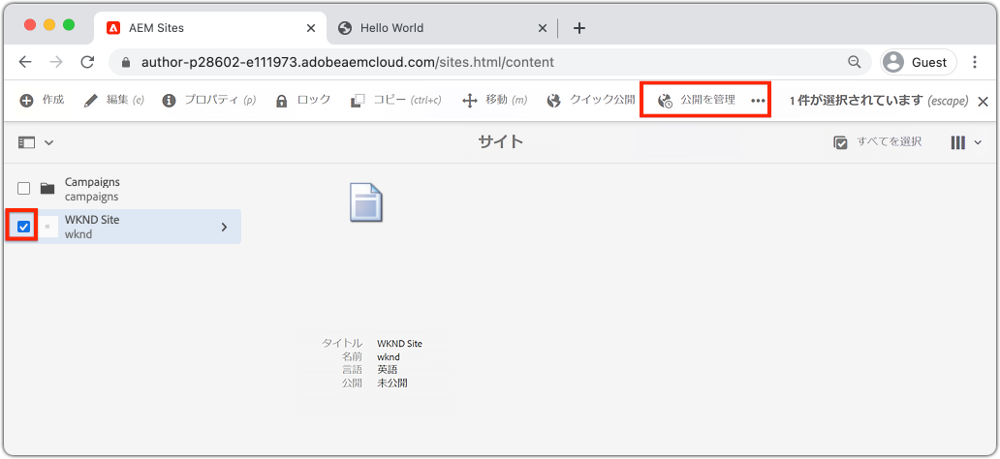

# コンテンツのオーサリングと変更のパブリッシュ{#author-content-publish}

>[!CAUTION]
>
> ここで紹介するクイックサイト作成機能は、2021年後半にリリースされます。 関連ドキュメントは、プレビュー用に提供されています。

ユーザーがWebサイトのコンテンツを更新する方法を理解することが重要です。 この章では、**コンテンツ作成者**&#x200B;の人物を採用し、前の章で生成したサイトを編集用に更新します。 チャプターの最後に、変更を公開して、ライブサイトの更新方法を理解します。

## 前提条件 {#prerequisites}

これは複数のパートから成るチュートリアルで、[サイトの作成](./create-site.md)の章で説明した手順が完了していることを前提としています。

## 目的 {#objective}

1. AEM Sitesの&#x200B;**ページ**&#x200B;と&#x200B;**コンポーネント**&#x200B;の概念を理解します。
1. Webサイトのコンテンツを更新する方法を説明します。
1. ライブサイトに変更を公開する方法を説明します。

## 新しいページ{#create-page}を作成します。

通常、Webサイトは複数ページに分割されて複数ページのエクスペリエンスを形成します。 AEMは、コンテンツを同じ方法で構造化します。 次に、サイトの新しいページを作成します。

1. 前の章で使用したAEM **Author**&#x200B;サービスにログインします。
1. AEMの開始画面で、**Sites** > **WKND Site** > **English** > **Article**&#x200B;をクリックします。
1. 右上隅にある「**作成** /**ページ**」をクリックします。

   

   これにより、**ページを作成**&#x200B;ウィザードが表示されます。

1. **記事ページ**&#x200B;テンプレートを選択し、「**次へ**」をクリックします。

   AEMのページは、ページテンプレートに基づいて作成されます。 ページテンプレートについて詳しくは、[ページテンプレート](page-templates.md)の章を参照してください。

1. 「**プロパティ**」に、「Hello World」の「**タイトル**」を入力します。
1. **名前**&#x200B;を`hello-world`に設定し、「**作成**」をクリックします。

   

1. ダイアログのポップアップで、「**開く**」をクリックして、新しく作成したページを開きます。

## コンポーネントのオーサリング{#author-component}

AEMコンポーネントは、Webページの小さなモジュール式構成要素と考えることができます。 UIを論理チャンクまたはコンポーネントに分割することで、管理がはるかに容易になります。 コンポーネントを再利用するには、コンポーネントを設定できる必要があります。 これは、オーサーダイアログを通じて実行します。

AEMは、実稼動で使用できる[コアコンポーネント](https://experienceleague.adobe.com/docs/experience-manager-core-components/using/introduction.html?lang=ja)のセットを提供します。 **コアコンポーネント**&#x200B;は、[テキスト](https://experienceleague.adobe.com/docs/experience-manager-core-components/using/components/text.html)や[画像](https://experienceleague.adobe.com/docs/experience-manager-core-components/using/components/image.html)などの基本要素から、[カルーセル](https://experienceleague.adobe.com/docs/experience-manager-core-components/using/components/carousel.html)などのより複雑なUI要素まで幅広く使用できます。

次に、AEMページエディターを使用して、いくつかのコンポーネントを作成します。

1. 前の演習で作成した&#x200B;**Hello World**&#x200B;ページに移動します。
1. **編集**&#x200B;モードで、左側のサイドレールで&#x200B;**コンポーネント**&#x200B;アイコンをクリックします。

   

   これにより、コンポーネントライブラリが開き、ページで使用できる使用可能なコンポーネントがリストされます。

1. 下にスクロールし、**ドラッグ&amp;ドロップ**&#x200B;で&#x200B;**テキスト(v2)**&#x200B;コンポーネントをページのメインの編集可能領域にドラッグ&amp;ドロップします。

   

1. **テキスト**&#x200B;コンポーネントをクリックしてハイライトし、**レンチ**&#x200B;アイコンをクリックして、コンポーネントのダイアログを開きます。 テキストを入力し、ダイアログに変更を保存します。

   

   **テキスト**&#x200B;コンポーネントは、ページ上にリッチテキストを表示する必要があります。

1. 上記の手順を繰り返しますが、**Image(v2)**&#x200B;コンポーネントのインスタンスをページにドラッグする点が異なります。 **画像**&#x200B;コンポーネントのダイアログを開きます。

1. 左側のレールで、**アセット**&#x200B;アイコンをクリックして、**アセットファインダー**&#x200B;に切り替えます。
1. **コンポーネントのダ** イアログに画像をドラッグ&amp;ドロップし、「実行」をク **** リックして変更を保存します。

   

1. **タイトル**、**ナビゲーション**、**検索**&#x200B;など、固定されたコンポーネントがページ上に存在することを確認します。 これらの領域はページテンプレートの一部として設定され、個々のページでは変更できません。 これについては、次の章で詳しく説明します。

他のコンポーネントを自由に試してみてください。 各[コアコンポーネントに関するドキュメントは、](https://experienceleague.adobe.com/docs/experience-manager-core-components/using/introduction.html)で参照できます。 [ページのオーサリングに関する詳細なビデオシリーズは、](https://experienceleague.adobe.com/docs/experience-manager-learn/sites/page-authoring/aem-sites-authoring-overview.html)で参照できます。

## 更新を公開{#publish-updates}

AEM環境は、**オーサーサービス**&#x200B;と&#x200B;**パブリッシュサービス**&#x200B;に分割されます。 この章では、**オーサーサービス**&#x200B;のサイトにいくつかの変更を加えました。 サイト訪問者が変更を表示するには、変更を&#x200B;**パブリッシュサービス**&#x200B;にパブリッシュする必要があります。

*オーサーからパブリッシュへのコンテンツの大まかなフロー*

**1.** コンテンツ作成者がサイトのコンテンツを更新します。更新内容のプレビュー、レビュー、承認を行い、ライブにプッシュすることができます。

**2.**&#x200B;コンテンツが公開されました。公開は、オンデマンドで実行することも、将来の日付に対して予定することもできます。

**3.** サイトの訪問者には、変更がパブリッシュサービスに反映されていることが表示されます。

### 変更の公開

次に、変更を公開します。

1. AEMの開始画面から&#x200B;**Sites**&#x200B;に移動し、**WKND Site**&#x200B;を選択します。
1. メニューバーの「**公開を管理**」をクリックします。

   

   これはまったく新しいサイトなので、すべてのページを公開し、公開を管理ウィザードを使用して、公開する必要があるものを正確に定義できます。

1. 「**オプション**」では、デフォルト設定を「**公開**」のままにし、「**今すぐ**」にスケジュールします。 「**次へ**」をクリックします。
1. **スコープ**&#x200B;で、**WKNDサイト**&#x200B;を選択し、「**子を含める**」をクリックします。 ダイアログで、すべてのボックスのチェックをオフにします。 完全なサイトを公開します。

   

1. 「**公開済みの参照**」ボタンをクリックします。 ダイアログで、すべてがオンになっていることを確認します。 これには、**基本的なAEMサイトテンプレート**&#x200B;と、サイトテンプレートによって生成されるいくつかの設定が含まれます。 「**完了**」をクリックして更新します。

   

1. 最後に、右上隅の「**公開**」をクリックして、コンテンツを公開します。

## 公開済みコンテンツの表示 {#publish}

次に、パブリッシュサービスに移動して変更を表示します。

1. パブリッシュサービスのURLを簡単に取得するには、オーサーURLをコピーして、`author`の単語を`publish`に置き換えます。 以下に例を示します。

   * **作成者 URL** - `https://author-pYYYY-eXXXX.adobeaemcloud.com/`
   * **パブリッシュURL**  -  `https://publish-pYYYY-eXXXX.adobeaemcloud.com/`

1. 最終的なURLが次のようになるように、パブリッシュURLに`/content/wknd.html`を追加します。`https://publish-pYYYY-eXXXX.adobeaemcloud.com/content/wknd.html`.

   >[!NOTE]
   >
   > [サイトの作成](create-site.md)中に一意の名前を指定した場合は、`wknd.html`をサイトの名前に一致するように変更します。

1. AEMオーサリング機能を使用せずに、サイトが表示されるパブリッシュURLに移動します。

   

1. **ナビゲーション**&#x200B;メニューを使用して、**記事** / **Hello World**&#x200B;をクリックし、前に作成したHello Worldページに移動します。
1. **AEMオーサーサービス**&#x200B;に戻り、ページエディターで追加のコンテンツ変更をおこないます。
1. **ページのプロパティ**&#x200B;アイコン/ **ページを公開**&#x200B;をクリックして、これらの変更をページエディター内から直接公開します。

   

1. **AEMパブリッシュサービス**&#x200B;に戻り、変更を表示します。 おそらく、****&#x200B;はすぐには更新を確認できません。 これは、**AEMパブリッシュサービス**&#x200B;には、Apache WebサーバーとCDN](https://experienceleague.adobe.com/docs/experience-manager-cloud-service/implementing/content-delivery/caching.html)を介した[キャッシュが含まれるからです。 デフォルトでは、HTMLコンテンツは約5分間キャッシュされます。

1. テストやデバッグの目的でキャッシュをバイパスするには、`?nocache=true`のようなクエリパラメーターを追加します。 URLは`https://publish-pYYYY-eXXXX.adobeaemcloud.com/content/wknd/en/article/hello-world.html?nocache=true`のようになります。 キャッシュ方法と設定の詳細については、[を参照してください。](https://experienceleague.adobe.com/docs/experience-manager-cloud-service/implementing/content-delivery/overview.html)

1. また、Cloud ManagerでパブリッシュサービスへのURLを確認することもできます。 **Cloud Managerプログラム** / **環境** / **環境**&#x200B;に移動します。

   

   **環境セグメント**&#x200B;の下に、**オーサー**&#x200B;および&#x200B;**パブリッシュ**&#x200B;サービスへのリンクがあります。

## バリデーターが {#congratulations}

AEM Siteに対する変更を作成し、公開しました。

### 次の手順 {#next-steps}

[ページテンプレート](./page-templates.md)を作成および変更する方法を説明します。 ページテンプレートとページの関係を理解します。 コンテンツに対して詳細なガバナンスとブランドの一貫性を提供するために、ページテンプレートのポリシーを設定する方法を説明します。  Adobe XDのモックアップに基づいて、適切に構造化されたMagazine記事テンプレートが作成されます。
