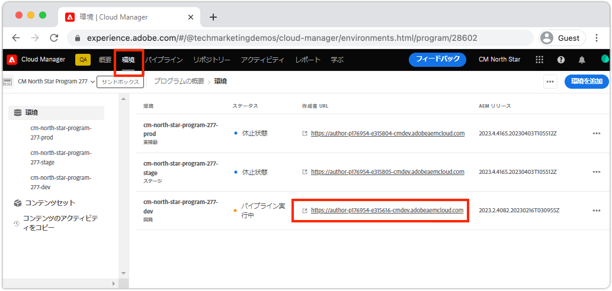
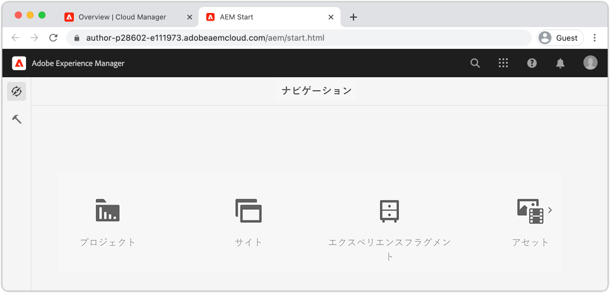
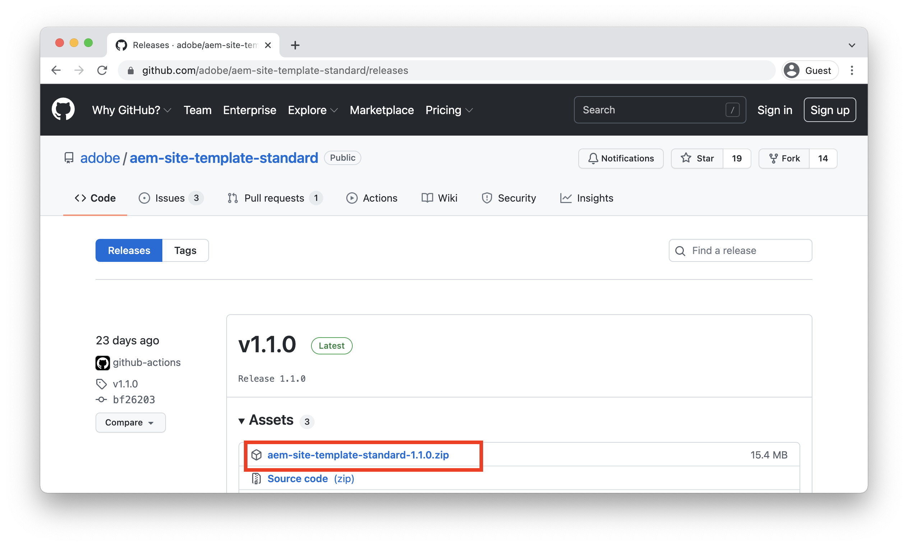
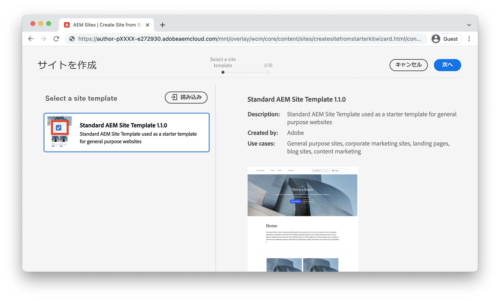
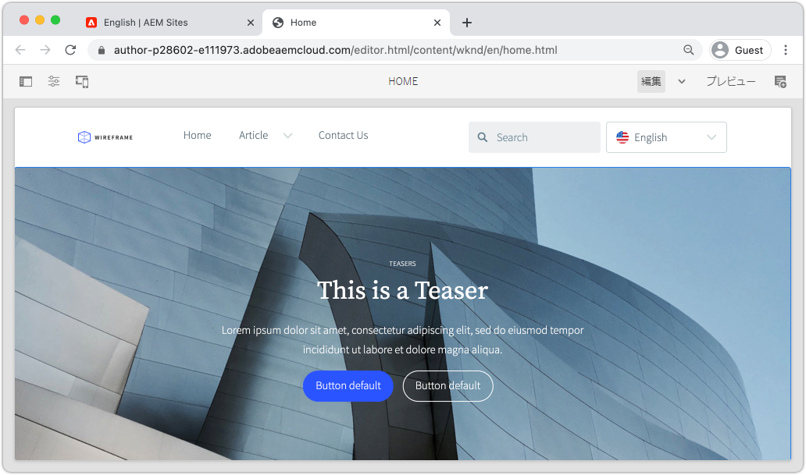

# サイト{#create-site}の作成

>[!CAUTION]
>
> ここで紹介するクイックサイト作成機能は、2021年後半にリリースされます。 関連ドキュメントは、プレビュー用に提供されています。

この章では、Adobe Experience Managerでの新しいサイトの作成について説明します。 Adobeが提供する標準サイトテンプレートを出発点として使用します。

## 前提条件 {#prerequisites}

この章の手順は、Adobe Experience Manager as a Cloud Service環境で実行します。 AEM環境への管理者アクセス権があることを確認します。 このチュートリアルを完了する際には、[サンドボックスプログラム](https://experienceleague.adobe.com/docs/experience-manager-cloud-service/onboarding/getting-access/sandbox-programs/introduction-sandbox-programs.html)と[開発環境](https://experienceleague.adobe.com/docs/experience-manager-cloud-service/implementing/using-cloud-manager/manage-environments.html?lang=ja)を使用することをお勧めします。

詳しくは、[オンボーディングのドキュメント](https://experienceleague.adobe.com/docs/experience-manager-cloud-service/onboarding/home.html)を参照してください。

## 目的 {#objective}

1. サイト作成ウィザードを使用して新しいサイトを生成する方法を説明します。
1. サイトテンプレートの役割を理解します。
1. 生成されたAEMサイトを参照します。

## Adobe Experience Manager Authorへのログイン {#author}

最初の手順として、AEM as a Cloud Service環境にログインします。 AEM環境は、**オーサーサービス**&#x200B;と&#x200B;**パブリッシュサービス**&#x200B;に分割されます。

* **オーサーサービス**  — サイトコンテンツを作成、管理および更新する場所。通常、**オーサーサービス**&#x200B;にアクセスできるのは内部ユーザーのみで、ログイン画面の後ろにあります。
* **公開サービス**  — ライブWebサイトをホストします。これは、エンドユーザーに表示されるサービスで、通常は公開されています。

このチュートリアルの大部分は、**オーサーサービス**&#x200B;を使用して実行されます。

1. Adobe Experience Cloud [https://experience.adobe.com/](https://experience.adobe.com/)に移動します。 個人用アカウントまたは会社/学校のアカウントを使用してログインします。
1. メニューで正しい組織が選択されていることを確認し、「**Experience Manager**」をクリックします。

   

1. **Cloud Manager**&#x200B;で、「**Launch**」をクリックします。
1. 使用するプログラムの上にマウスポインターを置き、**Cloud Managerプログラム**&#x200B;アイコンをクリックします。

   

1. 上部のメニューで、「**環境**」をクリックして、プロビジョニングされた環境を表示します。

1. 使用する環境を見つけ、**作成者URL**&#x200B;をクリックします。

   

   >[!NOTE]
   >
   >このチュートリアルでは、**開発**&#x200B;環境を使用することをお勧めします。

1. AEM **オーサーサービス**&#x200B;に対して新しいタブが起動します。 「**Adobeでログイン**」をクリックすると、同じExperience Cloud資格情報で自動的にログインします。

1. リダイレクトされて認証されると、AEMの開始画面が表示されます。

   

>[!NOTE]
>
> Experience Managerへのアクセス [オンボーディングドキュメント](https://experienceleague.adobe.com/docs/experience-manager-cloud-service/onboarding/home.html)を確認します。

## 基本サイトテンプレートのダウンロード

サイトテンプレートは、新しいサイトの出発点となります。 サイトテンプレートには、いくつかの基本的なテーマ、ページテンプレート、設定、サンプルコンテンツが含まれています。 サイトテンプレートに含まれる内容は、開発者が決定します。 Adobeには、新しい実装を高速化する&#x200B;**基本的なサイトテンプレート**&#x200B;が用意されています。

1. 新しいブラウザータブを開き、GitHubの基本サイトテンプレートプロジェクトに移動します。[https://github.com/adobe/aem-site-template-basic](https://github.com/adobe/aem-site-template-basic). このプロジェクトはオープンソースで、誰でも使用できるライセンスが付与されています。
1. **リリース**&#x200B;をクリックし、[最新のリリース](https://github.com/adobe/aem-site-template-basic/releases/latest)に移動します。
1. **アセット**&#x200B;ドロップダウンを展開し、テンプレートzipファイルをダウンロードします。

   

   このzipファイルは、次の演習で使用します。

   >[!NOTE]
   >
   > このチュートリアルは、基本的なサイトテンプレートのバージョン&#x200B;**5.0.0**&#x200B;を使用して記述します。 新しいプロジェクトを開始する場合は、常に最新バージョンを使用することをお勧めします。

## 新しいサイトの作成

次に、前の演習の[サイトテンプレート]を使用して新しいサイトを生成します。

1. AEM環境に戻ります。 AEM Start画面から、**Sites**&#x200B;に移動します。
1. 右上隅にある「**作成** / **サイト（テンプレート）** 」をクリックします。 これにより、**サイト作成ウィザード**&#x200B;が表示されます。
1. 「**サイトテンプレート**&#x200B;を選択し、「****&#x200B;を読み込み」ボタンをクリックします。

   前の演習でダウンロードした&#x200B;**.zip**&#x200B;テンプレートファイルをアップロードします。

1. 「**基本AEMサイトテンプレート**」を選択し、「**次へ**」をクリックします。

   

1. 「**Site Details** > **Site title**」に`WKND Site`と入力します。
1. 「**サイト名**」に`wknd`と入力します。

   

   >[!NOTE]
   >
   > 共有AEM環境を使用する場合は、一意の識別子を&#x200B;**サイト名**&#x200B;に追加します。 例： `wknd-johndoe` これにより、複数のユーザーが衝突を起こさずに同じチュートリアルを完了できます。

1. 「**作成**」をクリックして、サイトを生成します。 AEMがWebサイトの作成を終了したら、**成功**&#x200B;ダイアログで「**完了**」をクリックします。

## 新しいサイトの参照

1. AEM Sitesコンソールに移動します（まだ移動していない場合）。
1. 新しい&#x200B;**WKNDサイト**&#x200B;が生成されました。 複数言語の階層を持つサイト構造が含まれます。
1. ページを選択し、メニューバーの「**編集**」ボタンをクリックして、**英語** /**ホーム**&#x200B;ページを開きます。

   

1. スターターコンテンツは既に作成済みで、ページに追加できる複数のコンポーネントが用意されています。 これらのコンポーネントを使用してみることで、機能について大まかに把握できます。次の章では、コンポーネントの基本について学びます。

   

   *サイトテンプレートから提供されるサンプルコンテンツ*

## バリデーターが {#congratulations}

これで、最初のAEM Siteが作成されました。

### 次の手順 {#next-steps}

Adobe Experience Manager(AEM)のページエディターを使用して、[オーサーコンテンツとパブリッシュ](author-content-publish.md)の章でサイトのコンテンツを更新します。 アトミックコンポーネントを設定してコンテンツを更新する方法を説明します。 AEMオーサー環境とパブリッシュ環境の違いを理解し、ライブサイトに更新を公開する方法を学びます。
