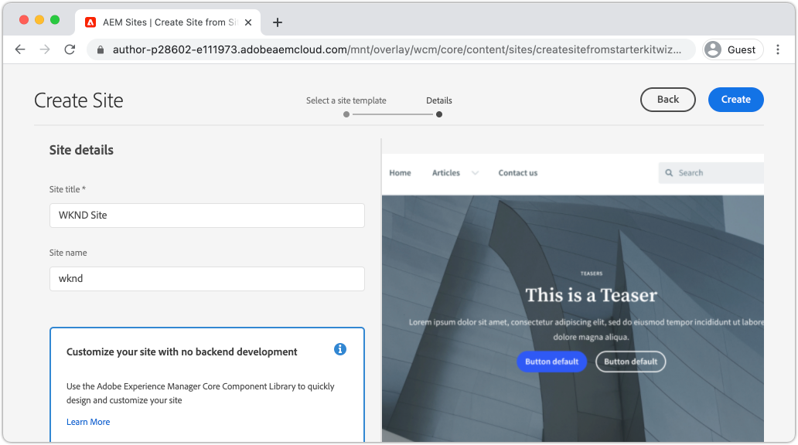

# サイトを作成 {#create-site}

クイックサイト作成の一環として、AEM の Adobe Experience Manager のサイト作成ウィザードを使用して、新しい eb サイトを生成します。アドビが提供する標準サイトテンプレートは、新しいサイトの出発点として使用されます。

## 前提条件 {#prerequisites}

この章の手順は、Adobe Experience Manager as a Cloud Service 環境で実行します。AEM 環境への管理者アクセス権があることを確認します。このチュートリアルを完了するときは、[サンドボックスプログラム](https://experienceleague.adobe.com/docs/experience-manager-cloud-service/onboarding/getting-access/sandbox-programs/introduction-sandbox-programs.html?lang=ja)と[開発環境](https://experienceleague.adobe.com/docs/experience-manager-cloud-service/implementing/using-cloud-manager/manage-environments.html?lang=ja)を使用することをお勧めします。

[実稼動プログラム](https://experienceleague.adobe.com/docs/experience-manager-cloud-service/content/implementing/using-cloud-manager/programs/introduction-production-programs.html?lang=ja)環境は、このチュートリアルでも使用できます。ただし、このチュートリアルではコンテンツとコードをターゲット AEM 環境にデプロイするので、このチュートリアルのアクティビティがターゲット環境で実行される作業に影響を与えないようにする必要があります。

[AEM SDK](https://experienceleague.adobe.com/docs/experience-manager-learn/cloud-service/local-development-environment-set-up/aem-runtime.html?lang=ja) は、このチュートリアルの一部で使用できます。[Cloud Manager のフロントエンドパイプラインを使用したテーマのデプロイ](https://experienceleague.adobe.com/docs/experience-manager-learn/getting-started-wknd-tutorial-develop/site-template/theming.html?lang=ja)など、クラウドサービスに依存するこのチュートリアルの要素は、AEM SDK では実行できません。

詳細については、[オンボーディングドキュメント](https://experienceleague.adobe.com/docs/experience-manager-cloud-service/onboarding/home.html?lang=ja)を確認してください。

## 目的 {#objective}

1. サイト作成ウィザードを使用して新しいサイトを生成する方法を説明します。
1. サイトテンプレートの役割を理解します。
1. 生成された AEM サイトを参照します。

## Adobe Experience Manager オーサーにログインします。 {#author}

最初の手順として、AEM as a Cloud Service 環境にログインします。AEM 環境は、**オーサーサービス**&#x200B;と&#x200B;**パブリッシュサービス**&#x200B;に分かれています。

* **オーサーサービス** - サイトコンテンツが作成、管理、更新される場所です。通常、内部ユーザーのみが&#x200B;**オーサーサービス**&#x200B;にアクセスでき、ログイン画面の背後にあります。
* **パブリッシュサービス** - ライブ web サイトをホストします。これは、エンドユーザーに表示されるサービスで、通常は一般に利用可能です。

チュートリアルの大部分は、**オーサーサービス**&#x200B;を使用して行われます。

1. Adobe Experience Cloud [https://experience.adobe.com/jp/](https://experience.adobe.com/) に移動します。個人用アカウント、または会社／学校のアカウントを使用してログインします。
1. メニューで正しい組織が選択されていることを確認し、**Experience Manager** をクリックします。

   

1. **Cloud Manager** の下で、**Launch** をクリックします。
1. 使用するプログラムの上にマウスポインターを置き、**Cloud Manager プログラム**&#x200B;アイコンをクリックします。

   

1. 上部のメニューで&#x200B;**環境**&#x200B;をクリックして、プロビジョニングされた環境を表示します。

1. 使用する環境を見つけて、**オーサー URL** をクリックします。

   

   >[!NOTE]
   >
   >このチュートリアルでは、**開発**&#x200B;環境を使用することをお勧めします。

1. AEM **オーサーサービス**&#x200B;に対して新しいタブが起動されます。**アドビでログイン**&#x200B;をクリックすると、同じ Experience Cloud 資格情報で自動的にログインされます。

1. リダイレクトされて認証された後に、AEM の開始画面が表示されます。

   

>[!NOTE]
>
> Experience Manager にアクセスできない場合[オンボーディングドキュメント](https://experienceleague.adobe.com/docs/experience-manager-cloud-service/onboarding/home.html?lang=ja) を確認します。

## 基本サイトテンプレートをダウンロードします。

サイトテンプレートは、新しいサイトの出発点となります。サイトテンプレートには、いくつかの基本的なテーマ、ページテンプレート、設定、サンプルコンテンツが含まれています。サイトテンプレートに含まれる内容は、開発者が自由に使用できます。アドビが提供する&#x200B;**基本サイトテンプレート**&#x200B;を使用して、新しい実装を迅速に行うことができます。

1. 新しいブラウザータブを開き、GitHub の基本サイトテンプレートプロジェクト（[https://github.com/adobe/aem-site-template-standard](https://github.com/adobe/aem-site-template-standard)）に移動します。このプロジェクトはオープンソースで、誰でも使用できるようにライセンスされています。
1. **Releases** をクリックして、[latest release](https://github.com/adobe/aem-site-template-standard/releases/latest) に移動します。
1. **Assets** ドロップダウンを展開し、テンプレートの zip ファイルをダウンロードします。

   

   この zip ファイルは、次の演習で使用します。

   >[!NOTE]
   >
   > このチュートリアルは、基本サイトテンプレートのバージョン **1.1.0** を使用して記述されています。実稼動用に新しいプロジェクトを開始する場合は、常に最新バージョンを使用することをお勧めします。

## 新しいサイトを作成します。

次に、前の演習のサイトテンプレートを使用して新しいサイトを生成します。

1. AEM 環境に戻ります。AEM 開始画面から **Sites** に移動します。
1. 右上隅で、**作成**／**サイト（テンプレート）**&#x200B;をクリックします。**サイト作成ウィザード** が表示されます。
1. **サイトテンプレートを選択**&#x200B;で、「**読み込み**」ボタンをクリックします。

   前の演習でダウンロードした **.zip**&#x200B;テンプレートファイルをアップロードします。

1. **基本 AEM サイトテンプレート**&#x200B;を選択して、「**次へ**」をクリックします。

   

1. **サイトの詳細**／**サイトのタイトル** で、`WKND Site` を入力します。

   実際の実装では、「WKND Site」は会社または組織のブランド名に置き換えられます。このチュートリアルでは、架空のライフスタイルブランド「WKND」サイトを作成するシミュレーションを行います。

1. **サイト名**&#x200B;で、`wknd` を入力します。

   

   >[!NOTE]
   >
   > 共有 AEM 環境を使用する場合、**サイト名**&#x200B;に一意の ID を追加します。例えば、`wknd-site-johndoe` です。これにより、衝突を起こさずに複数のユーザーが同じチュートリアルを完了することができます。

1. 「**作成**」をクリックしてサイトを生成します。AEM が web サイトの作成を完了したら、**成功**&#x200B;ダイアログで「**完了**」をクリックします。

## 新しいサイトを参照

1. AEM Sites コンソールに移動します（まだ移動していない場合）。
1. 新しい **WKND サイト**&#x200B;が生成されました。多言語階層のサイト構造が含まれます。
1. **英語**／**ホーム**&#x200B;ページを開き、ページを選択し、メニューバーの「**編集**」ボタンをクリックします。

   

1. スターターコンテンツは既に作成されており、ページに追加できるコンポーネントがいくつかあります。これらのコンポーネントを使用してみることで、機能について大まかに把握できます。次の章では、コンポーネントの基本について説明します。

   

   *サイトテンプレートから提供されるサンプルコンテンツ*

## おめでとうございます。 {#congratulations}

これで、最初の AEM サイトが作成されました。

### 次の手順 {#next-steps}

Adobe Experience Manager（AEM）のページエディターを使用して、[コンテンツのオーサリングと公開](author-content-publish.md)の章でサイトのコンテンツを更新します。コンテンツを更新するためにアトミックコンポーネントを設定する方法を説明します。AEM オーサー環境とパブリッシュ環境の違いを理解し、ライブサイトに更新を公開する方法を学びます。
