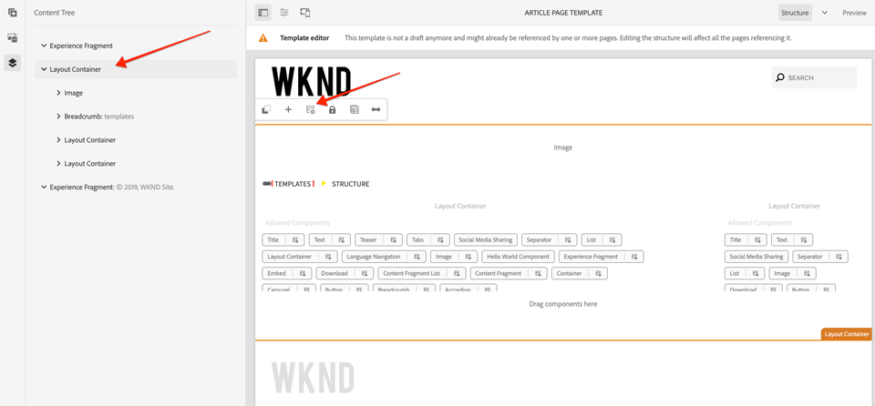
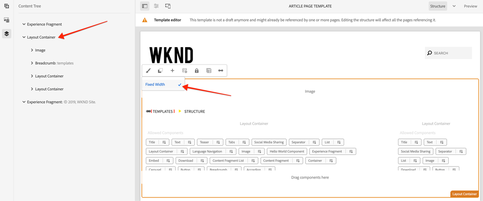
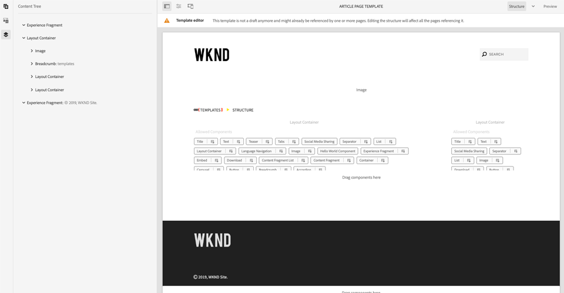

# スタイルシステムを使用した開発 {#developing-with-the-style-system}

Experience Managerのスタイルシステムを使用して、個々のスタイルを実装し、コアコンポーネントを再利用する方法を説明します。 このチュートリアルでは、スタイルシステムで、ブランド固有のCSSとテンプレートエディターの高度なポリシー設定を使用してコアコンポーネントを拡張するための開発について説明します。

## 前提条件 {#prerequisites}

[ローカル開発環境](overview.md#local-dev-environment)の設定に必要なツールと手順を確認します。

また、[クライアント側ライブラリとフロントエンドワークフロー](client-side-libraries.md)のチュートリアルを確認し、クライアント側ライブラリの基本原則とAEMプロジェクトに組み込まれた様々なフロントエンドツールについて理解することをお勧めします。

### スタータープロジェクト

チュートリアルが構築する基本行コードを調べます。

1. [github.com/adobe/aem-guides-wknd](https://github.com/adobe/aem-guides-wknd)リポジトリをコピーします。
1. `style-system/start`ブランチをチェックアウト

   ```shell
   $ git clone git@github.com:adobe/aem-guides-wknd.git ~/code/aem-guides-wknd
   $ cd ~/code/aem-guides-wknd
   $ git checkout style-system/start
   ```

1. Mavenのスキルを使用して、ローカルAEMインスタンスにコードベースをデプロイします。

   ```shell
   $ cd ~/code/aem-guides-wknd
   $ mvn clean install -PautoInstallSinglePackage
   ```

終了したコードは、[GitHub](https://github.com/adobe/aem-guides-wknd/tree/style-system/solution)に常に表示できます。また、ブランチ`style-system/solution`に切り替えて、コードをローカルでチェックアウトすることもできます。

## 目的

1. スタイルシステムを使用して、ブランド固有のCSSをAEMコアコンポーネントに適用する方法を説明します。
1. BEM表記の概要と、スタイルを慎重にスコープする方法について説明します。
1. 編集可能なテンプレートを使用して、ポリシー設定の詳細を適用します。

## 作成する内容 {#what-you-will-build}

この章では、[スタイルシステム機能](https://docs.adobe.com/content/help/en/experience-manager-learn/sites/page-authoring/style-system-feature-video-use.html)を使用して、記事ページで使用するコンポーネントのバリエーションを作成します。 また、スタイルシステムを使用して、[ヘッダ/フッタ]や[レイアウト]コンテナなどの構造要素のバリエーションを作成します。

>[!VIDEO](https://video.tv.adobe.com/v/30386/?quality=12&learn=on)

## 背景 {#background}

開発者およびテンプレート編集者は、[スタイルシステム](https://docs.adobe.com/content/help/ja-JP/experience-manager-65/developing/components/style-system.html)を使用して、コンポーネントの複数の視覚的バリエーションを作成できます。次に、作成者はページを構成する際に、どのスタイルを使用するかを決めることができます。以降のすべてのチュートリアルでは、ローコードの手法でコアコンポーネントを使用しながら、スタイルシステムを使用して、いくつかの独自のスタイルを創出していきます。

スタイルシステムの基本的な考え方は、コンポーネントがどのように表示されるかについて、作成者が様々なスタイルを選択できるようにすることです。「スタイル」は、コンポーネントの外側の div に取り込まれた追加の CSS クラスに基づき実現されます。これらのスタイルクラスに基づき、CSS ルールがクライアントライブラリに追加され、コンポーネントの表示が変更されます。

[スタイルシステムに関する詳細なドキュメントは、](https://docs.adobe.com/content/help/en/experience-manager-65/developing/components/style-system.html)を参照してください。 また、スタイルシステム](https://docs.adobe.com/content/help/en/experience-manager-learn/sites/developing/style-system-technical-video-understand.html)を理解するための[テクニカルビデオもあります。

## タイトルコンポーネントスタイル{#title-component}

この時点で、[タイトルコンポーネント](https://docs.adobe.com/content/help/en/experience-manager-core-components/using/components/title.html)が&#x200B;**ui.apps**&#x200B;モジュールの一部として`/apps/wknd/components/content/title`の下のプロジェクトにプロキシ化されました。 見出し要素(`H1`、`H2`、`H3`...)のデフォルトのスタイルは、`ui.frontend/src/main/webpack/base/sass/_elements.scss`の下の`_elements.scss`ファイルの&#x200B;**ui.frontend**&#x200B;モジュールに既に実装されています。

### 下線のスタイル

[WKND記事デザイン](assets/pages-templates/wknd-article-design.xd)には、タイトルコンポーネントに対して一意のスタイルが含まれ、下線が引かれています。 2つのコンポーネントを作成したり、コンポーネントダイアログを変更する代わりに、スタイルシステムを使用して、下線スタイルを追加するオプションを作成できます。


### Inspectタイトルコンポーネントマークアップ

フロントエンド開発者として、コアコンポーネントのスタイル設定を行う最初の手順は、コンポーネントによって生成されるマークアップを理解することです。

生成されたプロジェクトの一部として、アーキタイプは、**コアコンポーネントの例**&#x200B;プロジェクトを埋め込みました。 開発者やコンテンツ作成者にとっては、コアコンポーネントで使用可能なすべての機能を理解しやすいリファレンスが含まれています。 ライブバージョンも[利用可能な](https://opensource.adobe.com/aem-core-wcm-components/library.html)です。

1. 新しいブラウザーを開き、タイトルコンポーネントを表示します。

   ローカルAEMインスタンス：[http://localhost:4502/editor.html/content/core-components-examples/library/title.html](http://localhost:4502/editor.html/content/core-components-examples/library/title.html)

   ライブの例：[https://opensource.adobe.com/aem-core-wcm-components/library/title.html](https://opensource.adobe.com/aem-core-wcm-components/library/title.html)

1. 次に、Titleコンポーネントのマークアップを示します。

   ```html
   <div class="cmp-title">
       <h1 class="cmp-title__text">Lorem Ipsum</h1>
   </div>
   ```

   タイトルコンポーネントのBEM表記：

   ```plain
   BLOCK cmp-title
       ELEMENT cmp-title__text
   ```

1. スタイルシステムは、コンポーネントを囲む外側のdivにCSSクラスを追加します。 したがって、対象とするマークアップは次のようになります。

   ```html
   <div class="STYLE-SYSTEM-CLASS-HERE"> <!-- Custom CSS class - implementation gets to define this -->
       <div class="cmp-title">
           <h1 class="cmp-title__text">Lorem Ipsum</h1>
       </div>
   </div>
   ```

### 下線スタイルの実装 — ui.frontend

次に、プロジェクトの&#x200B;**ui.frontend**&#x200B;モジュールを使用してUnderlineスタイルを実装します。 **ui.frontend**&#x200B;モジュールに組み込まれているWebPack開発サーバーを使用して、*導入前のスタイル*&#x200B;をAEMのローカルインスタンスにプレビューします。

1. **ui.frontend**&#x200B;モジュール内で次のコマンドを実行して、webpackデベロッパーサーバーを開始します。

   ```shell
   $ cd ~/code/aem-guides-wknd/ui.frontend/
   $ npm start
   
   > aem-maven-archetype@1.0.0 start code/aem-guides-wknd/ui.frontend
   > webpack-dev-server --open --config ./webpack.dev.js
   ```

   これにより、[http://localhost:8080](http://localhost:8080)でブラウザが開きます。

   >[!NOTE]
   >
   > 画像が壊れているように見える場合は、スタータープロジェクトがAEMのローカルインスタンス（ポート4502で実行）にデプロイされており、使用されるブラウザーもローカルのAEMインスタンスにログインしていることを確認してください。

   

1. Eclipseまたは任意のIDEで、次の場所にあるファイル`index.html`を開きます。`ui.frontend/src/main/webpack/static/index.html`. これは、WebPack開発サーバーで使用される静的マークアップです。
1. `index.html`で、*cmp-title*&#x200B;をドキュメントで検索して、下線のスタイルを追加するTitleコンポーネントのインスタンスを探します。 「タイトル」コンポーネントを選択し、「壁のスケートパークから離れたバン」*（行218）というテキストを入力します。*&#x200B;周囲追加のdivに対するクラス`cmp-title--underline`:

   ```html
    <!-- before -->
    <div class="title aem-GridColumn aem-GridColumn--default--8">
        <div class="cmp-title">
            <h2 class="cmp-title__text">Vans off the Wall Skatepark</h2>
        </div>
    </div>
   ```

   ```html
    <!-- After -->
    <div class="cmp-title--underline title aem-GridColumn aem-GridColumn--default--8">
        <div class="cmp-title">
            <h2 class="cmp-title__text">Vans off the Wall Skatepark</h2>
        </div>
    </div>
   ```

1. ブラウザに戻り、追加のクラスがマークアップに反映されていることを確認します。
1. **ui.frontend**&#x200B;モジュールに戻り、次の場所にあるファイル`title.scss`を更新します。`ui.frontend/src/main/webpack/components/content/title/scss/title.scss`:

   ```css
   /* Add Title Underline Style */
   .cmp-title--underline {
   
       .cmp-title {
       }
   
       .cmp-title__text {
           &:after {
           display: block;
               width: 84px;
               padding-top: 8px;
               content: '';
               border-bottom: 2px solid $brand-primary;
           }
       }
   }
   ```

   >[!NOTE]
   >
   >ベストプラクティスとしては、スタイルをターゲットコンポーネントで使用する範囲に収めることが推奨されます。これにより、ページの他の領域が余分なスタイルの影響を受けることを回避できます。
   >
   >すべてのコアコンポーネントは、**[BEM表記](https://github.com/adobe/aem-core-wcm-components/wiki/css-coding-conventions)**&#x200B;に従います。 ベストプラクティスとしては、コンポーネントのデフォルトスタイルを作成する際は、外部の CSS クラスを指定することが推奨されます。また、HTML 要素ではなく、コアコンポーネントの BEM 記法で指定されたクラス名を指定することが推奨されます。

1. もう一度ブラウザに戻ると、下線スタイルが追加されます。

   

1. WebPack開発サーバーを停止します。

### 権追加原政策

次に、Titleコンポーネントの新しいポリシーを追加して、コンテンツ作成者が特定のコンポーネントに適用する下線スタイルを選択できるようにする必要があります。 これは、AEMのテンプレートエディターを使用して行います。

1. Mavenのスキルを使用して、ローカルAEMインスタンスにコードベースをデプロイします。

   ```shell
   $ cd ~/code/aem-guides-wknd
   $ mvn clean install -PautoInstallSinglePackage
   ```

1. 次の場所にある&#x200B;**記事ページテンプレート**&#x200B;に移動します。[http://localhost:4502/editor.html/conf/wknd/settings/wcm/templates/article-page-template/structure.html](http://localhost:4502/editor.html/conf/wknd/settings/wcm/templates/article-page-template/structure.html).

1. **構造**&#x200B;モードのメイン&#x200B;**レイアウトコンテナ**&#x200B;で、*許可されているコンポーネント*&#x200B;の下に表示されている&#x200B;**タイトル**&#x200B;コンポーネントの横の&#x200B;**ポリシー**&#x200B;アイコンを選択します。

   

1. 次の値を持つTitleコンポーネントの新しいポリシーを作成します。

   *ポリシータイトル**: **WKNDタイトル**

   *プロパティ* / *スタイルタブ*  */追加新しいスタイル*

   **下線** :  `cmp-title--underline`

   

   「**完了**」をクリックして、タイトルポリシーの変更を保存します。

   >[!NOTE]
   >
   > 値`cmp-title--underline`は、**ui.frontend**&#x200B;モジュールで開発する際に、先ほどターゲットにしたCSSクラスと一致します。

### 下線のスタイルを適用する

最後に、作成者は、特定のタイトルコンポーネントに下線のスタイルを適用することを選択できます。

1. AEM Sites編集者の&#x200B;**La Skateparks**&#x200B;記事に移動します。[http://localhost:4502/editor.html/content/wknd/us/en/magazine/guide-la-skateparks.html](http://localhost:4502/editor.html/content/wknd/us/en/magazine/guide-la-skateparks.html)
1. **編集**&#x200B;モードで、タイトルコンポーネントを選択します。 **paintbrush**&#x200B;アイコンをクリックし、**下線**&#x200B;スタイルを選択します。

   

   作成者は、スタイルのオン/オフを切り替えることができます。

1. **ページ情報**&#x200B;アイコン/**発行済みの表示**&#x200B;をクリックして、AEMエディターの外部のページを検査します。

   

   ブラウザー開発者ツールを使用して、Titleコンポーネントの周りのマークアップに、外側のdivに適用されたCSSクラス`cmp-title--underline`があることを確認します。

## テキストコンポーネントスタイル{#text-component}

次に、同様の手順を繰り返して、[テキストコンポーネント](https://docs.adobe.com/content/help/ja-JP/experience-manager-core-components/using/components/text.html)に一意のスタイルを適用します。 テキストコンポーネントは、**ui.apps**&#x200B;モジュールの一部として、`/apps/wknd/components/content/text`下のプロジェクトにプロキシされました。 段落要素のデフォルトのスタイルは、`ui.frontend/src/main/webpack/base/sass/_elements.scss`の下の`_elements.scss`ファイルの&#x200B;**ui.frontend**&#x200B;モジュールに既に実装されています。

### 引用ブロックのスタイル

[WKND記事デザイン](assets/pages-templates/wknd-article-design.xd)には、引用符ブロックを含むテキストコンポーネントの一意のスタイルが含まれています。


### Inspect文字コンポーネントマークアップ

もう一度、Textコンポーネントのマークアップを調べます。

1. 新しいブラウザーを開き、テキストコンポーネントをコアコンポーネントライブラリの一部として表示します。
ローカルAEMインスタンス：[http://localhost:4502/editor.html/content/core-components-examples/library/text.html](http://localhost:4502/editor.html/content/core-components-examples/library/text.html)

   ライブの例：[https://opensource.adobe.com/aem-core-wcm-components/library/text.html](https://opensource.adobe.com/aem-core-wcm-components/library/text.html)

1. 次に、Textコンポーネントのマークアップを示します。

   ```html
   <div class="cmp-text">
       <p><b>Bold </b>can be used to emphasize a word or phrase, as can <u>underline</u> and <i>italics.&nbsp;</i><sup>Superscript</sup> and <sub>subscript</sub> are useful for mathematical (E = mc<sup>2</sup>) or scientific (h<sub>2</sub>O) expressions. Paragraph styles can provide alternative renderings, such as quote sections:</p>
       <blockquote>"<i>Be yourself; everyone else is already taken"</i></blockquote>
       <b>- Oscar Wilde</b>
   </div>
   ```

   タイトルコンポーネントのBEM表記：

   ```plain
   BLOCK cmp-text
       ELEMENT
   ```

1. スタイルシステムは、コンポーネントを囲む外側のdivにCSSクラスを追加します。 したがって、対象とするマークアップは次のようになります。

   ```html
   <div class="STYLE-SYSTEM-CLASS-HERE"> <!-- Custom CSS class - implementation gets to define this -->
       <div class="cmp-text">
           <p><b>Bold </b>can be used to emphasize a word or phrase, as can <u>underline</u> and <i>italics.&nbsp;</i><sup>Superscript</sup> and <sub>subscript</sub> are useful for mathematical (E = mc<sup>2</sup>) or scientific (h<sub>2</sub>O) expressions. Paragraph styles can provide alternative renderings, such as quote sections:</p>
           <blockquote>"<i>Be yourself; everyone else is already taken"</i></blockquote>
           <b>- Oscar Wilde</b>
       </div>
   </div>
   ```

### Quote Blockスタイルの実装 — ui.frontend

次に、プロジェクトの&#x200B;**ui.frontend**&#x200B;モジュールを使用して、Quote Blockスタイルを実装します。

1. **ui.frontend**&#x200B;モジュール内で次のコマンドを実行して、webpackデベロッパーサーバーを開始します。

   ```shell
   $ cd ~/code/aem-guides-wknd/ui.frontend/
   $ npm start
   
   > aem-maven-archetype@1.0.0 start code/aem-guides-wknd/ui.frontend
   > webpack-dev-server --open --config ./webpack.dev.js
   ```

1. Eclipseまたは任意のIDEで、次の場所にあるファイル`index.html`を開きます。`ui.frontend/src/main/webpack/static/index.html`. これは、WebPack開発サーバーで使用される静的マークアップです。
1. `index.html`で、テキスト&#x200B;*&quot;Jacob Wester&quot;*&#x200B;を検索して、テキストコンポーネントのインスタンスを探します（210行目）。 周囲追加のdivに対するクラス`cmp-text--quote`:

   ```html
    <!-- before -->
    <div class="text aem-GridColumn aem-GridColumn--default--8">
        <div class="cmp-text">
            <blockquote>"There is no better place to shred then Los Angeles"</blockquote>
            <p>Jacob Wester - Pro Skater</p>
        </div>
    </div>
   ```

   ```html
    <!-- After -->
    <div class="cmp-text--quote text aem-GridColumn aem-GridColumn--default--8">
        <div class="cmp-text">
            <blockquote>"There is no better place to shred then Los Angeles"</blockquote>
            <p>Jacob Wester - Pro Skater</p>
        </div>
    </div>
   ```

1. ブラウザに戻り、追加のクラスがマークアップに反映されていることを確認します。
1. **ui.frontend**&#x200B;モジュールに戻り、次の場所にあるファイル`text.scss`を更新します。`ui.frontend/src/main/webpack/components/content/text/scss/text.scss`:

   ```css
   /* WKND Text Quote style */
   
   .cmp-text--quote {
   
       .cmp-text {
           background-color: $brand-third;
           margin: 1em 0em;
           padding: 1em;
   
           blockquote {
               border: none;
               font-size: $font-size-h2;
               font-family: $font-family-serif;
               padding: 14px 14px;
               margin: 0;
               margin-bottom: 0.5em;
   
               &:after {
                   border-bottom: 2px solid $brand-primary; /*yellow border */
                   content: '';
                   display: block;
                   position: relative;
                   top: 0.25em;
                   width: 80px;
               }
           }
   
           p {
               font-size:    $font-size-large;
               font-family:  $font-family-serif;
           }
       }
   }
   ```

   >[!CAUTION]
   >
   > この場合、生のHTML要素は、スタイルによってターゲット設定されます。 これは、テキストコンポーネントが、コンテンツ作成者向けのリッチテキストエディターを提供するためです。 RTEコンテンツに対して直接スタイルを作成する場合は、慎重に行う必要があり、スタイルを厳密にスコープすることがさらに重要です。

1. もう一度ブラウザに戻ると、次のようなQuoteブロックスタイルが追加されます。

   

1. WebPack開発サーバーを停止します。

### テ追加キストポリシー

次に、Textコンポーネント用の新しいポリシーを追加します。

1. Mavenのスキルを使用して、ローカルAEMインスタンスにコードベースをデプロイします。

   ```shell
   $ cd ~/code/aem-guides-wknd
   $ mvn clean install -PautoInstallSinglePackage
   ```

1. 次の場所にある&#x200B;**記事ページテンプレート**&#x200B;に移動します。[http://localhost:4502/editor.html/conf/wknd/settings/wcm/templates/article-page-template/structure.html](http://localhost:4502/editor.html/conf/wknd/settings/wcm/templates/article-page-template/structure.html).

1. **構造**&#x200B;モードのメイン&#x200B;**レイアウトコンテナ**&#x200B;で、*許可されているコンポーネント*&#x200B;の下に表示されている&#x200B;**テキスト**&#x200B;コンポーネントの横の&#x200B;**ポリシー**&#x200B;アイコンを選択します。

   

1. 次の値を持つTextコンポーネントの新しいポリシーを作成します。

   *ポリシータイトル**: **WKNDテキスト**

   *プラグイン* / *段落スタイル* /段落スタイルを *有効にする*

   *[スタイル]タブ* > *新しいスタイル*

   **引用ブロック** :  `cmp-text--quote`

   

   

   「**完了**」をクリックして、変更をテキストポリシーに保存します。

### 見積もりブロックスタイルの適用

1. AEM Sites編集者の&#x200B;**La Skateparks**&#x200B;記事に移動します。[http://localhost:4502/editor.html/content/wknd/us/en/magazine/guide-la-skateparks.html](http://localhost:4502/editor.html/content/wknd/us/en/magazine/guide-la-skateparks.html)
1. **編集**&#x200B;モードで、テキストコンポーネントを選択します。 コンポーネントを編集して、引用要素を含めます。

   

1. テキストコンポーネントを選択し、**paintbrush**&#x200B;アイコンをクリックし、**ブロックを引用**&#x200B;スタイルを選択します。

   

   作成者は、スタイルのオン/オフを切り替えることができます。

## レイアウトコンテナ {#layout-container}

レイアウトコンテナは、記事ページテンプレートの基本構造を作成し、コンテンツ作成者がページにコンテンツを追加するためのドロップゾーンを提供するために使用されています。 レイアウトコンテナはスタイルシステムも活用でき、コンテンツ作成者はレイアウトのデザインに関するより多くのオプションを利用できます。

現在、ページ全体に対して、固定幅を適用するCSSルールが適用されています。 代わりに、より柔軟なアプローチは、コンテンツ作成者がオン/オフを切り替える&#x200B;**固定幅**&#x200B;スタイルを作成することです。

### 固定幅スタイルの実装 — ui.frontend

プロジェクトの&#x200B;**ui.frontend**&#x200B;モジュールに固定幅スタイルを実装する開始があります。

1. **ui.frontend**&#x200B;モジュール内で次のコマンドを実行して、webpackデベロッパーサーバーを開始します。

   ```shell
   $ cd ~/code/aem-guides-wknd/ui.frontend/
   $ npm start
   ```

1. 次の場所にあるファイル`index.html`を開きます。`ui.frontend/src/main/webpack/static/index.html`.
1. 記事ページテンプレートの本文の幅を固定し、「ヘッダー」と「フッター」は自由にして、幅を広くしたいと考えています。 したがって、2番目の`<div class='responsivegrid aem-GridColumn aem-GridColumn--default--12'` (レイアウトコンテナ)を2つのエクスペリエンスフラグメントの間にターゲットしたいと思います（136行目）

   

1. 前の追加手順で識別した`div`のクラス`cmp-layout-container--fixed`。

   ```html
   <!-- Experience Fragment Header -->
   <div class="experiencefragment aem-GridColumn aem-GridColumn--default--12">
       ...
   </div>
   <!-- Main body Layout Container -->
   <div class="responsivegrid cmp-layout-container--fixed aem-GridColumn aem-GridColumn--default--12">
       ...
   </div>
   <!-- Experience Fragment Footer -->
   <div class="experiencefragment aem-GridColumn aem-GridColumn--default--12">
       ...
   </div>
   ```

1. 次の場所にあるファイル`container.scss`を更新します。`ui.frontend/src/main/webpack/components/content/container/scss/container.scss`:

   ```css
   /* WKND Layout Container - Fixed Width */
   
   .cmp-layout-container--fixed {
       @media (min-width: $screen-medium + 1) {
           display:block;
           max-width:  $max-width !important;
           float: unset !important;
           margin: 0 auto !important;
           padding: 0 $gutter-padding;
           clear: both !important;
       }
   }
   ```

1. 次の場所にあるファイル`_elements.scss`を更新します。`ui.frontend/src/main/webpack/base/sass/_elements.scss`を変更し、`.root`ルールを変更して、新しい最大幅を変数`$max-body-width`に設定します。

   ```css
    /* Before */
    body {
        ...
   
        .root {
            max-width: $max-width;
            margin: 0 auto;
            padding-top: 12px;
        }
    }
   ```

   ```css
    /* After */
    body {
        ...
   
        .root {
            max-width: $max-body-width;
            margin: 0 auto;
            padding-top: 12px;
        }
    }
   ```

   >[!NOTE]
   >
   > 変数と値の完全なリストは、次を参照してください。`ui.frontend/src/main/webpack/base/sass/_variables.scss`.

1. ブラウザーに戻ると、ページのメインコンテンツは同じように表示されますが、ヘッダーとフッターは幅が広くなります。 これは期待されることです。

   

### レイアウトコンテナポリシーの更新

次に、AEMのレイアウトコンテナポリシーを更新して、「固定幅」スタイルを追加します。

1. Mavenのスキルを使用して、ローカルAEMインスタンスにコードベースをデプロイします。

   ```shell
   $ cd ~/code/aem-guides-wknd
   $ mvn clean install -PautoInstallSinglePackage
   ```

1. 次の場所にある&#x200B;**記事ページテンプレート**&#x200B;に移動します。[http://localhost:4502/editor.html/conf/wknd/settings/wcm/templates/article-page-template/structure.html](http://localhost:4502/editor.html/conf/wknd/settings/wcm/templates/article-page-template/structure.html).

1. **構造**&#x200B;モードで、メインの&#x200B;**レイアウトコンテナ**（エクスペリエンスフラグメントヘッダーとフッターの間）を選択し、**ポリシー**&#x200B;アイコンを選択します。

   

1. **WKNDサイトの既定**&#x200B;ポリシーを更新し、**固定幅**&#x200B;の追加のスタイルを`cmp-layout-container--fixed`に含めます。

   

   変更を保存し、記事ページテンプレートページを更新します。

1. メインの&#x200B;**レイアウトコンテナ**&#x200B;を再度選択します（エクスペリエンスフラグメントヘッダーとフッターの間）。 今回は&#x200B;**ペイントブラシ**&#x200B;アイコンが表示され、「スタイル」ドロップダウンから「**固定幅**」を選択できます。

   

   スタイルのオン/オフを切り替えることができます。

1. AEM Sites編集者の&#x200B;**La Skateparks**&#x200B;記事に移動します。[http://localhost:4502/editor.html/content/wknd/us/en/magazine/guide-la-skateparks.html](http://localhost:4502/editor.html/content/wknd/us/en/magazine/guide-la-skateparks.html). 固定幅のコンテナが実行されていることが確認できます。

## ヘッダー/フッター — エクスペリエンスフラグメント{#experience-fragment}

次に、ヘッダーとフッターにスタイルを追加して、記事ページテンプレートを完成させます。 ヘッダーとフッターの両方が、コンテナ内のコンポーネントをグループ化したエクスペリエンスフラグメントとして実装されました。 スタイルシステムを持つ他のコアコンポーネントコンポーネントと同様に、エクスペリエンスフラグメントコンポーネントに固有のCSSクラスを適用できます。

### ヘッダースタイルの実装 — ui.frontend

Headerコンポーネント内のコンポーネントは、[AdobeXDデザイン](assets/pages-templates/wknd-article-design.xd)に合わせて既にスタイル設定されています。少しだけレイアウトの変更が必要です。

1. **ui.frontend**&#x200B;モジュール内で次のコマンドを実行して、webpackデベロッパーサーバーを開始します。

   ```shell
   $ cd ~/code/aem-guides-wknd/ui.frontend/
   $ npm start
   ```

1. 次の場所にあるファイル`index.html`を開きます。`ui.frontend/src/main/webpack/static/index.html`.
1. *class=&quot;experiencefragment*&#x200B;を検索して、エクスペリエンスフラグメントコンポーネントの最初の&#x200B;**インスタンスを探します（48行目）。**
1. 前の追加手順で識別した`div`のクラス`cmp-experiencefragment--header`。

   ```html
       ...
       <div class="root responsivegrid">
           <div class="aem-Grid aem-Grid--12 aem-Grid--default--12 ">
   
           <!-- add cmp-experiencefragment--header -->
           <div class="experiencefragment cmp-experiencefragment--header aem-GridColumn aem-GridColumn--default--12">
               ...
   ```

1. 次の場所にあるファイル`experiencefragment.scss`を開きます。`ui.frontend/src/main/webpack/components/content/experiencefragment/scss/experiencefragment.scss`. ファイルに次のスタイルを追加します。

   ```css
   /* Header Style */
   .cmp-experiencefragment--header {
   
       .cmp-experiencefragment {
           max-width: $max-width;
           margin: 0 auto;
       }
   
       /* Logo Image */
       .cmp-image__image {
           max-width: 8rem;
           margin-top: $gutter-padding / 2;
           margin-bottom: $gutter-padding / 2;
       }
   
       @media (max-width: $screen-medium) {
   
           .cmp-experiencefragment {
               padding-top: 1rem;
               padding-bottom: 1rem;
           }
           /* Logo Image */
           .cmp-image__image {
               max-width: 6rem;
               margin-top: .75rem;
           }
       }
   }
   ```

   >[!CAUTION]
   >
   > ヘッダー内のロゴのスタイルを設定する際に、ここで少しショートカットを使用します。 ロゴは、実際にはエクスペリエンスフラグメント内にある画像コンポーネントに過ぎません。 後で、ヘッダーに別の画像を追加する必要があったとします。この2つを区別できません。 必要に応じて、「logo」クラスを常にここの画像コンポーネントに追加できます。

1. ブラウザに戻り、webpack devサーバの表示に戻ります。 他のコンテンツに合わせて配置されるように更新されたヘッダースタイルが表示されます。 ブラウザーをタブレットやモバイルデバイスの幅に縮小する場合は、ロゴのサイズが適切になっていることにも注意してください。

   

### フッタースタイルの実装 — ui.frontend

[AdobeXDデザイン](assets/pages-templates/wknd-article-design.xd)のフッターには、明るいテキストを含む黒の背景が含まれます。 これを反映するには、エクスペリエンスフラグメントフッター内のコンテンツのスタイルを設定する必要があります。

1. 次の場所にあるファイル`index.html`を開きます。`ui.frontend/src/main/webpack/static/index.html`.

1. *class=&quot;experiencefragment*&#x200B;を検索して、エクスペリエンスフラグメントコンポーネントの2番目の&#x200B;**インスタンスを探します（385行目）。**

1. 前の追加手順で識別した`div`のクラス`cmp-experiencefragment--footer`。

   ```html
   <!-- add cmp-experiencefragment--footer -->
   <div class="experiencefragment cmp-experiencefragment--footer aem-GridColumn aem-GridColumn--default--12">
   ```

1. 次の場所にあるファイル`experiencefragment.scss`を再度開きます。`ui.frontend/src/main/webpack/components/content/experiencefragment/scss/experiencefragment.scss`. **ファイルに次のスタイルを** 追加します。

   ```css
   /* Footer Style */
   .cmp-experiencefragment--footer {
   
       background-color: $black;
       color: $gray-light;
       margin-top: 5rem;
   
       p {
           font-size: $font-size-small;
       }
   
       .cmp-experiencefragment {
           max-width: $max-width;
           margin: 0 auto;
           padding-bottom: 0rem;
       }
   
       /* Separator */
       .cmp-separator {
           margin-top: 2rem;
           margin-bottom: 2rem;
       }
   
       .cmp-separator__horizontal-rule {
           border: 0;
       }
   
       /* Navigation */
       .cmp-navigation__item-link {
           color: $nav-link-inverse;
           &:hover,
           &:focus {
               background-color: unset;
               text-decoration: underline;
           }
       }
   
       .cmp-navigation__item--level-1.cmp-navigation__item--active .cmp-navigation__item-link {
           background-color: unset;
           color: $gray-lighter;
           text-decoration: underline;
       }
   
   }
   ```

   >[!CAUTION]
   >
   > ここでも、エクスペリエンスフラグメントフッターCSS内から、ナビゲーションコンポーネントのデフォルトのスタイルをオーバーライドすることで、少しショートカットを実行します。 フッター内に複数のナビゲーションコンポーネントが存在する可能性は低く、コンテンツ作成者がナビゲーションのスタイルを切り替える可能性も低くなります。 ナビゲーションコンポーネント用にのみフッタースタイルを作成する方が効果的です。

1. ブラウザーとwebpack devサーバーに戻ります。 XDのデザインに近づくようにフッタースタイルが更新されます。

   

1. WebPack開発サーバーを停止します。

### エクスペリエンスフラグメントポリシーの更新

次に、AEMでエクスペリエンスフラグメントコンポーネントポリシーを更新して、ヘッダースタイルとフッタースタイルを追加します。

1. Mavenのスキルを使用して、ローカルAEMインスタンスにコードベースをデプロイします。

   ```shell
   $ cd ~/code/aem-guides-wknd
   $ mvn clean install -PautoInstallSinglePackage
   ```

1. 次の場所にある&#x200B;**記事ページテンプレート**&#x200B;に移動します。[http://localhost:4502/editor.html/conf/wknd/settings/wcm/templates/article-page-template/structure.html](http://localhost:4502/editor.html/conf/wknd/settings/wcm/templates/article-page-template/structure.html).

1. **構造**&#x200B;モードで、「ヘッダー&#x200B;**エクスペリエンスフラグメント**」を選択し、**ポリシー**&#x200B;アイコンを選択します。

   

1. **WKNDサイトエクスペリエンスフラグメント — ヘッダー**&#x200B;ポリシーを更新し、**デフォルトのCSSクラス**&#x200B;を`cmp-experiencefragment--header`の値で追加します。

   

   変更を保存すると、適用した適切なヘッダーCSSスタイルが表示されます。

   >[!NOTE]
   >
   > テンプレート以外のヘッダースタイルを切り替える必要はないので、単純にデフォルトのCSSスタイルとして設定できます。

1. 次に、フッター&#x200B;**エクスペリエンスフラグメント**&#x200B;を選択し、**ポリシー**&#x200B;アイコンをクリックして、ポリシー設定を開きます。

1. **WKNDサイトエクスペリエンスフラグメント — フッター**&#x200B;ポリシーを更新し、**デフォルトのCSSクラス**&#x200B;を`cmp-experiencefragment--footer`の値で追加します。

   

   変更を保存すると、適用したフッターCSSスタイルが表示されます。

   

1. AEM Sites編集者の&#x200B;**La Skateparks**&#x200B;記事に移動します。[http://localhost:4502/editor.html/content/wknd/us/en/magazine/guide-la-skateparks.html](http://localhost:4502/editor.html/content/wknd/us/en/magazine/guide-la-skateparks.html). 更新されたヘッダーとフッターが適用されていることが確認できます。

## レビュー {#review}

章の一部として実装されたスタイルと機能を確認します。

>[!VIDEO](https://video.tv.adobe.com/v/30378/?quality=12&learn=on)

## バリデーターが{#congratulations}

記事ページのスタイルはほぼ完成し、AEM Style Systemを使用した実際の操作を体験できました。

### 次の手順 {#next-steps}

ダイアログで作成されたコンテンツを表示する[カスタムAEMコンポーネント](custom-component.md)をエンドツーエンドで作成する手順を説明します。また、Slingモデルの開発で、コンポーネントのHTLを埋め込むビジネスロジックをカプセル化します。

[GitHub](https://github.com/adobe/aem-guides-wknd)上の完了したコードを表示するか、Gitブラック`style-system/solution`上のローカルにコードを確認して展開します。

1. [github.com/adobe/aem-wknd-guides](https://github.com/adobe/aem-guides-wknd)リポジトリをコピーします。
1. `style-system/solution`ブランチを調べます。
