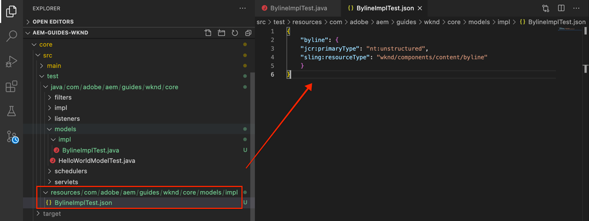
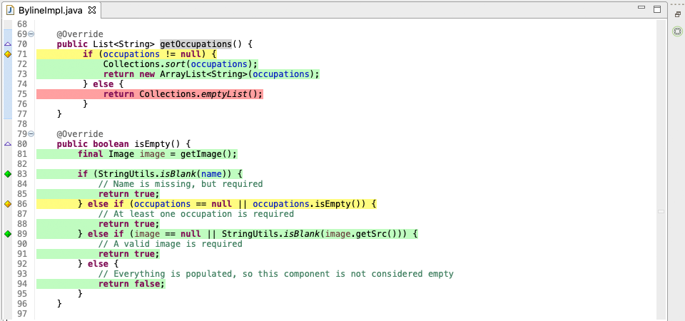
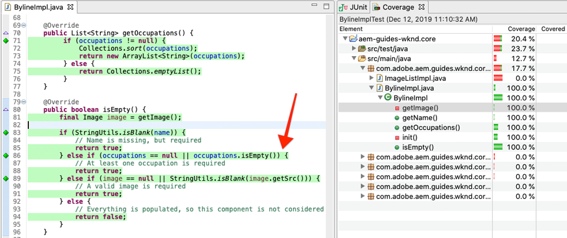

# 単体テスト {#unit-testing}

このチュートリアルでは、[カスタムコンポーネント](./custom-component.md)チュートリアルで作成したBylineコンポーネントのSlingモデルの動作を検証する単体テストの実装について説明します。

## 前提条件 {#prerequisites}

チュートリアルが構築する基本行コードを調べます。

1. [github.com/adobe/aem-guides-wknd](https://github.com/adobe/aem-guides-wknd)リポジトリをコピーします。
1. `unit-testing/start`ブランチをチェックアウト

```shell
$ git clone git@github.com:adobe/aem-guides-wknd.git ~/code/aem-guides-wknd
$ cd ~/code/aem-guides-wknd
$ git checkout unit-testing/start
```

終了したコードは、[GitHub](https://github.com/adobe/aem-guides-wknd/tree/unit-testing/solution)に常に表示できます。また、ブランチ`unit-testing/solution`に切り替えて、コードをローカルでチェックアウトすることもできます。

## 目的

1. ユニットテストの基本を理解します。
1. AEMコードのテストに一般的に使用されるフレームワークとツールについて説明します。
1. ユニットテストを記述する際にAEMリソースをモッキングまたはシミュレーションするオプションを理解します。

## 背景 {#unit-testing-background}

このチュートリアルでは、Bylineコンポーネントの[Slingモデル](https://sling.apache.org/documentation/bundles/models.html) ([カスタムAEMコンポーネントの作成](custom-component.md)で作成)の[単体テスト](https://ja.wikipedia.org/wiki/%E5%8D%98%E4%BD%93%E3%83%86%E3%82%B9%E3%83%88)を書く方法を検討します。 単体テストは、Java コードの期待される動作を検証するために Java で記述されるビルド時間テストです。通常、各ユニットテストは小さく、メソッド（または作業単位）の出力を期待される結果と比較して検証します。

ここでは、AEM ベストプラクティスおよび以下を使用します。

* [JUnit 5](https://junit.org/junit5/)
* [Mockito テストフレームワーク](https://site.mockito.org/)
* [wcm.io Test Framework](https://wcm.io/testing/) ( [](https://sling.apache.org/documentation/development/sling-mock.html)Apache Sling Mock上に構築)

>[!VIDEO](https://video.tv.adobe.com/v/30207/?quality=12&learn=on)

## ユニットテストとAdobeクラウドマネージャ{#unit-testing-and-adobe-cloud-manager}

[AdobeCloud ](https://docs.adobe.com/content/help/ja-JP/experience-manager-cloud-manager/using/introduction-to-cloud-manager.html) Managerは、ユニットテストの実行と [コードカバレッジのレポート](https://docs.adobe.com/content/help/en/experience-manager-cloud-manager/using/how-to-use/understand-your-test-results.html#code-quality-testing) をCI/CDパイプラインに統合し、ユニットテストAEMコードのベストプラクティスを促進します。

コードの単体テストはあらゆるコードベースで有益ですが、Cloud Manager を使用している場合は、Cloud Manager で実行できる単体テストを提供して、コード品質のテストや報告機能を活用することが重要です。

## Mavenの依存関係をテストInspect{#inspect-the-test-maven-dependencies}

最初の手順は、Mavenの依存関係を調べて、テストの記述と実行をサポートすることです。 次の4つの依存関係が必要です。

1. JUnit5
1. Mockito Test Framework
1. Apache Sling Mocks
1. AEM Mocks Test Framework (by io.wcm)

**JUnit5**、**Mockito**、**AEM Mocks**&#x200B;テスト依存関係は、[AEM Maven archetype](project-setup.md)を使用した設定時に、自動的にプロジェクトに追加されます。

1. これらの依存関係を表示するには、**aem-guides-wknd/pom.xml**&#x200B;にある親リアクタのPOMを開き、`<dependencies>..</dependencies>`に移動して、次の依存関係が定義されていることを確認します。

   ```xml
   <dependencies>
       ...
       <!-- Testing -->
       <dependency>
           <groupId>org.junit</groupId>
           <artifactId>junit-bom</artifactId>
           <version>5.5.2</version>
           <type>pom</type>
           <scope>import</scope>
       </dependency>
       <dependency>
           <groupId>org.slf4j</groupId>
           <artifactId>slf4j-simple</artifactId>
           <version>1.7.25</version>
           <scope>test</scope>
       </dependency>
       <dependency>
           <groupId>org.mockito</groupId>
           <artifactId>mockito-core</artifactId>
           <version>2.25.1</version>
           <scope>test</scope>
       </dependency>
       <dependency>
           <groupId>org.mockito</groupId>
           <artifactId>mockito-junit-jupiter</artifactId>
           <version>2.25.1</version>
           <scope>test</scope>
       </dependency>
       <dependency>
           <groupId>junit-addons</groupId>
           <artifactId>junit-addons</artifactId>
           <version>1.4</version>
           <scope>test</scope>
       </dependency>
       <dependency>
           <groupId>io.wcm</groupId>
           <artifactId>io.wcm.testing.aem-mock.junit5</artifactId>
           <!-- Prefer the latest version of AEM Mock Junit5 dependency -->
           <version>2.5.2</version>
           <scope>test</scope>
       </dependency>
       ...
   </dependencies>
   ```

1. **aem-guides-wknd/core/pom.xml**&#x200B;を開き、対応するテストの依存関係が利用可能である表示を確認します。

   ```xml
   ...
   <dependency>
       <groupId>org.junit.jupiter</groupId>
       <artifactId>junit-jupiter</artifactId>
       <scope>test</scope>
   </dependency>
   <dependency>
       <groupId>org.mockito</groupId>
       <artifactId>mockito-core</artifactId>
       <scope>test</scope>
   </dependency>
   <dependency>
       <groupId>org.mockito</groupId>
       <artifactId>mockito-junit-jupiter</artifactId>
       <scope>test</scope>
   </dependency>
   <dependency>
       <groupId>junit-addons</groupId>
       <artifactId>junit-addons</artifactId>
   </dependency>
   <dependency>
       <groupId>io.wcm</groupId>
       <artifactId>io.wcm.testing.aem-mock.junit5</artifactId>
   </dependency>
   ...
   ```

   **core**&#x200B;プロジェクト内の並列ソースフォルダーには、単体テストとサポートするテストファイルが含まれます。 この **test** フォルダーはテストクラスをソースコードから分離しますが、ソースコードと同じパッケージ内にあるようにテストを動作させることができます。

## JUnit テストの作成  {#creating-the-junit-test}

単体テストは一般的に、Java クラスと 1 対 1 でマッピングします。この章では、署名コンポーネントを支える Sling Model である **BylineImpl.java** 用に JUnit テストを記述します。


*単体テストが保存される場所。*

1. Eclipseでこれを行うには、テストするJavaクラスを右クリックし、**新規/その他/Java/JUnit/JUnitテストケース**&#x200B;を選択します。

   

1. 最初のウィザード画面で以下を検証します。

   * JUnitテストタイプは&#x200B;**新しいJUnit Jupiterテスト**&#x200B;です。これは、**pom.xmlの**&#x200B;に設定されたJUnit Maven依存関係です。
   * **package**&#x200B;は、テスト対象のクラスのJavaパッケージです(`BylineImpl.java`)。
   * Sourceフォルダーは、**core**&#x200B;プロジェクト(`aem-guides-wknd.core/src/test/java`)を指し、これがEclipseにユニットテストファイルの格納場所を指示します。
   * `setUp()`メソッドスタブは手動で作成されます。後でどのように使うかを見てみましょう。
   * テスト対象のクラスは`BylineImpl.java`です。これは、テスト対象のJavaクラスです。

   

   *「JUnitテストケース」ウィザード — 手順2*

1. ウィザード下部にある「**次へ**」ボタンをクリックします。

   次のステップは、テストメソッドの自動生成に役立ちます。通常、Javaクラスの各パブリックメソッドは、少なくとも1つの対応するテストメソッドを持ち、その動作を検証します。 単体テストには 1 つのパブリックメソッドをテストする複数のテストメソッドがあり、それぞれが異なる入力または状態を表すということがよくあります。

   ウィザードで、`BylineImpl`の下のすべてのメソッドを選択します。ただし、`init()`はSlingモデルが内部的に使用するメソッドです（`@PostConstruct`を介して）。 `init()`の実行に他のメソッドは`init()`の実行に依存しているので、他のすべてのメソッドをテストすることで、&lt;a0/>を効率的にテストします。

   新しいテストメソッドはいつでも JUnit テストクラスに追加できます。ウィザードのこのページは便宜上のものです。

   

   *JUnit テストケースウィザード（続き）*

1. JUnit5 テストファイルを生成するには、ウィザードの下部にある「終了」ボタンをクリックします。
1. **aem-guides-wknd.core** > **/src/test/java**&#x200B;上の対応するパッケージ構造に、JUnit5テストファイルが`BylineImplTest.java`という名前のファイルとして作成されていることを確認します。

## BylineImplTest.java のレビュー {#reviewing-bylineimpltest-java}

テストファイルには多数の自動生成メソッドがあります。この時点で、この JUnit テストファイルには AEM 固有のものはありません。

最初のメソッドは`public void setUp() { .. }`で、`@BeforeEach`で注釈を付けます。

`@BeforeEach`注釈はJUnit注釈で、このクラスの各テストメソッドを実行する前に、JUnitテストの実行時にこのメソッドを実行するように指示します。

以降のメソッドは、テストメソッド自体であり、`@Test`注釈でそのメソッドとしてマークされます。 デフォルトでは、すべてのテストが失敗するように設定されています。

このJUnitテストクラス（JUnitテストケースとも呼ばれます）が実行されると、`@Test`でマークされた各メソッドが、成功または失敗のどちらかのテストとして実行されます。


*`core/src/test/java/com/adobe/aem/guides/wknd/core/models/impl/BylineImplTest.java`*

1. クラス名を右クリックし、**実行ユーザー／JUnit テスト**&#x200B;を選択して、JUnit テストケースを実行します。

   

   *BylineImplTests.java ／実行ユーザー／JUnit テストを右クリックします。*

1. 想定どおり、すべてのテストは失敗します。

   

   *Eclipse／Window／ビューを表示／Java／JUnit の JUnit ビュー*

## BylineImpl.java のレビュー {#reviewing-bylineimpl-java}

ユニット・テストを記述する場合、主に次の2つの方法があります。

* [TDD またはテスト駆動開発](https://ja.wikipedia.org/wiki/%E3%83%86%E3%82%B9%E3%83%88%E9%A7%86%E5%8B%95%E9%96%8B%E7%99%BA)。実装を開発する直前に単体テストの増分を記述、テストを記述、実装を記述してテストを合格します。
* 最初に実装をおこなう開発。動作するコードを最初に開発してから、そのコードを検証するテストを記述します。

このチュートリアルでは、後者のアプローチを使用します（前の章で動作する **BylineImpl.java** を作成済みのため）。このため、パブリックメソッドの動作だけでなく、いくつかの実装の詳細についても確認および理解しておく必要があります。優れたテストは入力と出力のみを重視する必要があるので、理屈に合わないと思われるかもしれません。AEM で作業する際には、動作するテストを構築するために、実装に関する様々な考慮事項を理解しておく必要があります。

AEM における TDD には高度な専門知識が必要です。AEM 開発や AEM コードの単体テストを熟知した AEM 開発者が使用することで最大限の効果を発揮できます。

>[!VIDEO](https://video.tv.adobe.com/v/30208/?quality=12&learn=on)

## AEM テストコンテキストの設定  {#setting-up-aem-test-context}

AEM で記述されるコードの大部分は JCR、Sling または AEM API に依存しているので、正常に実行するためには実行中の AEM のコンテキストが必要となります。

単位テストはビルド時に実行されるので、実行中のAEMインスタンスのコンテキスト外では、そのようなリソースはありません。 これを容易にするために、[wcm.ioのAEM Mocks](https://wcm.io/testing/aem-mock/usage.html)はモックコンテキストを作成し、これらのAPIをAEMで動作しているかのように動作させます。

1. **BylineImplTest.java**&#x200B;ファイルに&#x200B;**BylineImplTest.java**&#x200B;でデコレーションされたJUnit拡張子として追加し、**wcm.ioの** `AemContext`を使用してAEMコンテキストを作成します。 `@ExtendWith`拡張機能は、必要な初期化とクリーンアップのタスクをすべて処理します。 すべてのテストメソッドで使用できる`AemContext`のクラス変数を作成します。

   ```java
   import org.junit.jupiter.api.extension.ExtendWith;
   import io.wcm.testing.mock.aem.junit5.AemContext;
   import io.wcm.testing.mock.aem.junit5.AemContextExtension;
   ...
   
   @ExtendWith(AemContextExtension.class)
   class BylineImplTest {
   
       private final AemContext ctx = new AemContext();
   ```

   この変数`ctx`は、AEMとSlingの抽象概念を多数提供するモックAEMコンテキストを公開します。

   * BylineImpl Sling Model はこのコンテキストに登録されます。
   * モック JCR コンテンツ構造はこのコンテキストで作成されます。
   * カスタム OSGi サービスはこのコンテキスト内で登録できます。
   * 一般的に必要となる様々なモックオブジェクトおよびヘルパー（SlingHttpServletRequest オブジェクトなど）、様々なモック Sling および AEM OSGi サービス（ModelFactory、PageManager、ページ、テンプレート、ComponentManager、コンポーネント、TagManager、タグなど）を提供します。
      * *これらのオブジェクトのすべてのメソッドが実装されるわけではありません。*
   * [その他](https://wcm.io/testing/aem-mock/usage.html)

   **`ctx`**&#x200B;オブジェクトは、ほとんどのモックコンテキストのエントリポイントとして機能します。

1. 各`@Test`メソッドの前に実行される`setUp(..)`メソッドに、一般的なモックテストの状態を次のように定義します。

   ```java
   @BeforeEach
   public void setUp() throws Exception {
       ctx.addModelsForClasses(BylineImpl.class);
       ctx.load().json("/com/adobe/aem/guides/wknd/core/models/impl/BylineImplTest.json", "/content");
   }
   ```

   * **`addModelsForClasses`** テストするSlingモデルをAEMコンテキストに登録し、 `@Test` メソッドでインスタンス化できるようにします。
   * **`load().json`** では、リソース構造をモックコンテキストにロードし、コードが実際のリポジトリから提供されたかのようにこれらのリソースを操作できるようにします。ファイル **`BylineImplTest.json`** のリソース定義は、**/content** の下でモック JCR コンテキストに読み込まれます。
   * **`BylineImplTest.json`** がまだないので、作成してテストに必要な JCR リソース構造を定義しましょう。

1. モックリソース構造を表す JSON ファイルは、JUnit Java テストファイルと同じパッケージパスに従い、**core/src/test/resources** 配下に保存されます。

   **BylineImplTest.json**&#x200B;という名前で、**core/test/resources/com/adobe/aem/guides/wknd/core/models/impl**&#x200B;に次の内容の新しいJSONファイルを作成します。

   ```json
   {
       "byline": {
       "jcr:primaryType": "nt:unstructured",
       "sling:resourceType": "wknd/components/content/byline"
       }
   }
   ```

   

   この JSON は、署名コンポーネント単体テストのモックリソースを定義します。この時点で、JSON には、署名コンポーネントコンテンツリソースを表す最小限のプロパティのセットである `jcr:primaryType` および `sling:resourceType`.

   単体テストを扱う場合の一般的な規則は、各テストを満たすのに必要なモックコンテンツ、コンテキスト、コードの最小セットを作成することです。 テストを記述する前に完全なモックコンテキストを作成したいという誘惑は避けてください。不要なアーチファクトが生じることがよくあります。

   **BylineImplTest.json**&#x200B;が存在する場合、`ctx.json("/com/adobe/aem/guides/wknd/core/models/impl/BylineImplTest.json", "/content")`が実行されると、モックリソース定義が&#x200B;**/contentのパスにあるコンテキストに読み込まれます。**

## getName() {#testing-get-name}のテスト

基本的なモックコンテキストの設定が完了したところで、**BylineImpl&#39;s getName()** の最初のテストを作成しましょう。このテストでは、メソッド **getName()** がリソースの &quot;**name**&quot; プロパティに保存されている、作成された正しい名前を返すことを確認する必要があります。

1. 次のように、**BylineImplTest.java** で **testGetName**() メソッドを更新します。

   ```java
   import com.adobe.aem.guides.wknd.core.components.Byline;
   import static org.junit.jupiter.api.Assertions.assertEquals;
   ...
   @Test
   public void testGetName() {
       final String expected = "Jane Doe";
   
       ctx.currentResource("/content/byline");
       Byline byline = ctx.request().adaptTo(Byline.class);
   
       String actual = byline.getName();
   
       assertEquals(expected, actual);
   }
   ```

   * **`String expected`** は、期待値を設定します。これを&quot;**Jane Done**&quot;に設定します。
   * **`ctx.currentResource`** コードを評価するモックリソースのコンテキストを設定します。これは、モックバイラインコンテンツリソースが読み込まれる **/content/** bylineasに設定されます。
   * **`Byline byline`** mock RequestオブジェクトからByline Slingモデルを適用してインスタンス化します。
   * **`String actual`** Byline Sling Modelオブジェクトでテスト中のメソッド `getName()`を呼び出します。
   * **`assertEquals`** は、期待値がbyline Sling Modelオブジェクトが返す値と一致することをアサートします。これらの値が等しくない場合、テストは失敗します。

1. テストを実行すると、`NullPointerException`で失敗します。

   モックJSONに`name`プロパティを定義していないので、このテストは失敗しません。この結果、テストは失敗しますが、テストの実行はその時点に達していません。 このテストは、bylineオブジェクト自体の`NullPointerException`が原因で失敗します。

1. 上記の[BylineImpl.java](#reviewing-bylineimpl-java)の確認ビデオでは、`@PostConstruct init()`が例外をスローしてSlingモデルのインスタンス化を防ぐかどうかを説明します。これはここで起こっていることです。

   ```java
   @PostConstruct
   private void init() {
       image = modelFactory.getModelFromWrappedRequest(request, request.getResource(), Image.class);
   }
   ```

   ModelFactory OSGiサービスは（Apache Slingコンテキストを介して）`AemContext`を介して提供されますが、BylineImplの`init()`メソッドで呼び出される`getModelFromWrappedRequest(...)`を含むすべてのメソッドが実装されているわけではありません。 その結果、[AbstractMethodError](https://docs.oracle.com/javase/8/docs/api/java/lang/AbstractMethodError.html)が発生します。これは、`init()`が失敗し、結果の`ctx.request().adaptTo(Byline.class)`の適応はnullオブジェクトになります。

   指定されたモックはコードを受け入れられないので、モックコンテキストを自分で実装する必要があります。この場合、Mockitoを使用して、モックImageオブジェクトを`getModelFromWrappedRequest(...)`呼び出したときに返すモックModelFactoryオブジェクトを作成できます。

   Byline Slingモデルをインスタンス化する場合でも、このモックコンテキストを配置する必要があるので、`@Before setUp()`メソッドに追加できます。 また、`MockitoExtension.class`を&#x200B;**BylineImplTest**&#x200B;クラスの上の`@ExtendWith`注釈に追加する必要があります。

   ```java
   package com.adobe.aem.guides.wknd.core.models.impl;
   
   import org.mockito.junit.jupiter.MockitoExtension;
   import org.mockito.Mock;
   
   import com.adobe.aem.guides.wknd.core.models.Byline;
   import com.adobe.cq.wcm.core.components.models.Image;
   
   import io.wcm.testing.mock.aem.junit5.AemContext;
   import io.wcm.testing.mock.aem.junit5.AemContextExtension;
   
   import org.apache.sling.models.factory.ModelFactory;
   import org.junit.jupiter.api.BeforeEach;
   import org.junit.jupiter.api.Test;
   import org.junit.jupiter.api.extension.ExtendWith;
   
   import static org.junit.jupiter.api.Assertions.assertEquals;
   import static org.junit.jupiter.api.Assertions.fail;
   import static org.mockito.Mockito.*;
   import org.apache.sling.api.resource.Resource;
   
   @ExtendWith({ AemContextExtension.class, MockitoExtension.class })
   public class BylineImplTest {
   
       private final AemContext ctx = new AemContext();
   
       @Mock
       private Image image;
   
       @Mock
       private ModelFactory modelFactory;
   
       @BeforeEach
       public void setUp() throws Exception {
           ctx.addModelsForClasses(BylineImpl.class);
   
           ctx.load().json("/com/adobe/aem/guides/wknd/core/models/impl/BylineImplTest.json", "/content");
   
           lenient().when(modelFactory.getModelFromWrappedRequest(eq(ctx.request()), any(Resource.class), eq(Image.class)))
                   .thenReturn(image);
   
           ctx.registerService(ModelFactory.class, modelFactory, org.osgi.framework.Constants.SERVICE_RANKING,
                   Integer.MAX_VALUE);
       }
   
       @Test
       void testGetName() { ...
   }
   ```

   * **`@ExtendWith({AemContextExtension.class, MockitoExtension.class})`** Mockito JUnit Jupiter  [](https://www.javadoc.io/page/org.mockito/mockito-junit-jupiter/latest/org/mockito/junit/jupiter/MockitoExtension.html) Extensionで実行するテストケースクラスを示します。これにより、@Mock注釈を使用して、クラスレベルでモックオブジェクトを定義できます。
   * **`@Mock private Image`** タイプがmockオブジェクトを作成 `com.adobe.cq.wcm.core.components.models.Image`します。これは、必要に応じて`@Test`メソッドがその動作を変更できるように、クラスレベルで定義されていることに注意してください。
   * **`@Mock private ModelFactory`** モデルファクトリ型のモックオブジェクトを作成します。これは純粋な Mockito モックであり、メソッドは実装されません。これは、必要に応じて`@Test`メソッドが必要に応じて動作を変更できるように、クラスレベルで定義されていることに注意してください。
   * **`when(modelFactory.getModelFromWrappedRequest(..)`** モックModelFactoryオブジェクトで呼び出さ `getModelFromWrappedRequest(..)` れたときのモック動作を登録します。`thenReturn (..)`で定義された結果は、モック画像オブジェクトを返すことです。 この動作は、次の場合にのみ呼び出されます。1番目のパラメーターは`ctx`のリクエストオブジェクトと等しく、2番目のパラメーターは任意のResourceオブジェクトで、3番目のパラメーターはCore Components Imageクラスである必要があります。 テストの間、`ctx.currentResource(...)`を&#x200B;**BylineImplTest.json**&#x200B;に定義された様々なモックリソースに設定するので、すべてのリソースを受け入れます。 後でModelFactoryのこの動作を上書きしたいので、**lenient()**&#x200B;の厳密さを追加します。
   * **`ctx.registerService(..)`.** モックのModelFactoryオブジェクトをAemContextに登録し、最も高いサービスランクを付けます。BylineImplの`init()`で使用されるModelFactoryは`@OSGiService ModelFactory model`フィールドを介して挿入されるので、この値は必須です。 `getModelFromWrappedRequest(..)`への呼び出しを処理する&#x200B;****&#x200B;モックオブジェクトをAemContextに挿入するには、そのタイプ(ModelFactory)の最上位のサービスとして登録する必要があります。

1. テストを再実行すると再び失敗しますが、今回は失敗の理由が明白です。

   

   *アサーションによる testGetName() の失敗*

   **AssertionError** が返されます。これはテストでのアサート条件が失敗し、**期待値は &quot;Jane Doe&quot;** で、**実際の値が null** なことを示します。**BylineImplTest.json** のモック **/content/byline** リソース定義に &quot;**name**&quot; プロパティが追加されていないので、この結果は当然です。そこで、これを追加します。

1. **BylineImplTest.json**&#x200B;を更新して`"name": "Jane Doe".`を定義します

   ```json
   {
       "byline": {
       "jcr:primaryType": "nt:unstructured",
       "sling:resourceType": "wknd/components/content/byline",
       "name": "Jane Doe"
       }
   }
   ```

1. テストを再実行すると、**`testGetName()`**&#x200B;が合格！

## getOccuptions() {#testing-get-occupations}のテスト

成功です。最初のテストはうまくいきました。`getOccupations()`のテストを続けましょう。 モックコンテキストの初期化は`@Before setUp()`メソッドで行われるので、`getOccupations()`を含む、このテストケースのすべての`@Test`メソッドで使用できます。

このメソッドは、職業プロパティに保存されている職業のリストをアルファベット順（降順）に並べ替えて返します。

1. **`testGetOccupations()`**&#x200B;を次のように更新します。

   ```java
   import java.util.List;
   import com.google.common.collect.ImmutableList;
   ...
   @Test
   public void testGetOccupations() {
       List<String> expected = new ImmutableList.Builder<String>()
                               .add("Blogger")
                               .add("Photographer")
                               .add("YouTuber")
                               .build();
   
       ctx.currentResource("/content/byline");
       Byline byline = ctx.request().adaptTo(Byline.class);
   
       List<String> actual = byline.getOccupations();
   
       assertEquals(expected, actual);
   }
   ```

   * **`List<String> expected`** 期待される結果を定義します。
   * **`ctx.currentResource`** /content/bylineにあるモックリソース定義に対するコンテキストを評価する現在のリソースを設定します。これにより、モックリソースのコンテキストで **BylineImpl.java** が実行されるようにします。
   * **`ctx.request().adaptTo(Byline.class)`** mock RequestオブジェクトからByline Slingモデルを適用してインスタンス化します。
   * **`byline.getOccupations()`** Byline Sling Modelオブジェクトでテスト中のメソッド `getOccupations()`を呼び出します。
   * **`assertEquals(expected, actual)`** 期待されるリストは、実際のリストと同じであるとアサートします。

1. 上述の&#x200B;**`getName()`**&#x200B;と同様に、**BylineImplTest.json**&#x200B;は職業を定義していないので、`byline.getOccupations()`が空のリストを返すので、このテストを実行すると失敗します。

   **BylineImplTest.json** を更新して職業のリストを含めます。すると、**`getOccupations()`** () によって職業が並べ替えられていることをテストで検証できるよう、このリストはアルファベット順以外に設定されます。

   ```json
   {
       "byline": {
       "jcr:primaryType": "nt:unstructured",
       "sling:resourceType": "wknd/components/content/byline",
       "name": "Jane Doe",
       "occupations": ["Photographer", "Blogger", "YouTuber"]
       }
   }
   ```

1. テストを実行すると、再び成功します。職業を並べ替えたことが良かったようです。

   

   *testGetOccupations() は成功*

## テストisEmpty() {#testing-is-empty}

**`isEmpty()`**&#x200B;をテストする最後のメソッド。

`isEmpty()`のテストは様々な条件のテストが必要なので興味深いものです。 **BylineImpl.java**&#x200B;の`isEmpty()`メソッドを確認するには、次の条件をテストする必要があります。

* 名前が空のときに true を返す。
* 職業が null または空のときに true を返す。
* 画像が空または src URL がない場合 true を返す。
* 名前、職業、および Image（  src URL)が存在する

これにより、`BylineImplTest.json` で特定の条件や新しいモックリソース構造をテストする新しいテストメソッドを作成して、これらのテストを駆動させる必要があります。

このチェックでは、`getName()`、`getOccupations()`、`getImage()`が空の場合のテストをスキップできました。これは、その状態の予期された動作が`isEmpty()`を介してテストされるためです。

1. 最初のテストは、プロパティが設定されていない、まったく新しいコンポーネントの条件をテストします。

   `BylineImplTest.json` に新しいリソース定義を追加し、意味のある名前「**empty**」を付けます。

   ```json
   {
       "byline": {
       "jcr:primaryType": "nt:unstructured",
       "sling:resourceType": "wknd/components/content/byline",
       "name": "Jane Doe",
       "occupations": ["Photographer", "Blogger", "YouTuber"]
       },
       "empty": {
       "jcr:primaryType": "nt:unstructured",
       "sling:resourceType": "wknd/components/content/byline"
       }
   }
   ```

   **`"empty": {...}`** 「empty」という名前の、とのみを持つ新しいリソース定義を定義 `jcr:primaryType` し `sling:resourceType`ます。

   `BylineImplTest.json`を`@setUp`の各テストメソッドの実行前に`ctx`に読み込むので、この新しいリソース定義は、**/content/empty.**&#x200B;でテストを行う際にすぐに利用できます。

1. 現在のリソースを新しい&quot;**empty**&quot; mockリソース定義に設定し、次のように`testIsEmpty()`を更新します。

   ```java
   @Test
   public void testIsEmpty() {
       ctx.currentResource("/content/empty");
       Byline byline = ctx.request().adaptTo(Byline.class);
   
       assertTrue(byline.isEmpty());
   }
   ```

   テストを実行し、成功することを確認します。

1. 次に、必要なデータポイント（名前、職業、または画像）のいずれかが空の場合、`isEmpty()`がtrueを返すように一連のメソッドを作成します。

   各テストに対して、個別のモックリソース定義が使用され、**BylineImplTest.json**&#x200B;を、**without-name**&#x200B;および&#x200B;**without-occuments**&#x200B;の追加のリソース定義で更新します。

   ```json
   {
       "byline": {
       "jcr:primaryType": "nt:unstructured",
       "sling:resourceType": "wknd/components/content/byline",
       "name": "Jane Doe",
       "occupations": ["Photographer", "Blogger", "YouTuber"]
       },
       "empty": {
       "jcr:primaryType": "nt:unstructured",
       "sling:resourceType": "wknd/components/content/byline"
       },
       "without-name": {
       "jcr:primaryType": "nt:unstructured",
       "sling:resourceType": "wknd/components/content/byline",
       "occupations": "[Photographer, Blogger, YouTuber]"
       },
       "without-occupations": {
       "jcr:primaryType": "nt:unstructured",
       "sling:resourceType": "wknd/components/content/byline",
       "name": "Jane Doe"
       }
   }
   ```

   次のテストメソッドを作成し、これらの状態をそれぞれテストします。

   ```java
   @Test
   public void testIsEmpty() {
       ctx.currentResource("/content/empty");
   
       Byline byline = ctx.request().adaptTo(Byline.class);
   
       assertTrue(byline.isEmpty());
   }
   
   @Test
   public void testIsEmpty_WithoutName() {
       ctx.currentResource("/content/without-name");
   
       Byline byline = ctx.request().adaptTo(Byline.class);
   
       assertTrue(byline.isEmpty());
   }
   
   @Test
   public void testIsEmpty_WithoutOccupations() {
       ctx.currentResource("/content/without-occupations");
   
       Byline byline = ctx.request().adaptTo(Byline.class);
   
       assertTrue(byline.isEmpty());
   }
   
   @Test
   public void testIsEmpty_WithoutImage() {
       ctx.currentResource("/content/byline");
   
       lenient().when(modelFactory.getModelFromWrappedRequest(eq(ctx.request()),
           any(Resource.class),
           eq(Image.class))).thenReturn(null);
   
       Byline byline = ctx.request().adaptTo(Byline.class);
   
       assertTrue(byline.isEmpty());
   }
   
   @Test
   public void testIsEmpty_WithoutImageSrc() {
       ctx.currentResource("/content/byline");
   
       when(image.getSrc()).thenReturn("");
   
       Byline byline = ctx.request().adaptTo(Byline.class);
   
       assertTrue(byline.isEmpty());
   }
   ```

   **`testIsEmpty()`** は空のモックリソース定義に対してテストを行い、 `isEmpty()` 真であると断言します。

   **`testIsEmpty_WithoutName()`** 職業を持つが名前を持たないモックリソース定義に対するテスト。

   **`testIsEmpty_WithoutOccupations()`** 名前は付けられているが職業がないモックリソース定義に対してテストを行います。

   **`testIsEmpty_WithoutImage()`** 名前と職業を持つモックリソース定義に対してテストを行いますが、モック画像をnullに戻すように設定します。この呼び出しによって返される画像オブジェクトがnullであることを確認するために、`setUp()`で定義された`modelFactory.getModelFromWrappedRequest(..)`動作を上書きすることに注意してください。 Mockitoのスタブ機能は厳しく、意味のあるコードを必要としません。 そのため、**`lenient`**&#x200B;設定を使用してモックを設定し、`setUp()`メソッドで動作を上書きしていることを明示的に示します。

   **`testIsEmpty_WithoutImageSrc()`** 名前と職業を持つモックリソース定義に対してテストを行いますが、呼び出されたときにモックイメージが空白の文字列を返すよう `getSrc()` に設定します。

1. 最後に、コンポーネントが正しく設定されている場合、**isEmpty()** が false を返すようテストを記述します。この条件の場合は、完全に設定された署名コンポーネントを表す **/content/byline** を再使用できます。

   ```java
   @Test
   public void testIsNotEmpty() {
   ctx.currentResource("/content/byline");
   when(image.getSrc()).thenReturn("/content/bio.png");
   
   Byline byline = ctx.request().adaptTo(Byline.class);
   
   assertFalse(byline.isEmpty());
   }
   ```

## コードの有効範囲 {#code-coverage}

コードの有効範囲とは、単体テストの対象となるソースコードの量のことです。最近の IDE は、単体テストでどのソースコードが実行されたかを自動的にチェックするツールを提供します。コードの有効範囲自体はコード品質を表すものではありませんが、単体テストの対象とならない、ソースコードの重要な領域があるかどうかを理解するのに役立ちます。

1. Eclipse のプロジェクトエクスプローラーで **BylineImplTest.java** を右クリックし、**有効範囲の設定／JUnit テスト**&#x200B;を選択します。

   有効範囲概要ビューが開いていることを確認します（Window／ビューを表示／その他／Java／有効範囲）。

   これにより、このファイル内で単体テストを実行し、コードの有効範囲を示すレポートを提供します。クラスやメソッドを掘り下げると、ファイルのどの部分がテストされ、どの部分がテストされていないかが明確にわかります。

   

   *コードの有効範囲の概要*

   Eclipse では、単体テストでカバーされる各クラスとメソッドの範囲をすばやく確認できます。Eclipse はコード行をカラーコード化します。

   * **緑**&#x200B;は、1 つ以上のテストで実行されたコードです。
   * **黄色**&#x200B;は、どのテストでも検証されていないブランチを示します。
   * **赤**&#x200B;は、どのテストでの実行されていないコードを示します。

1. 有効範囲レポートでは、職業フィールドが null で空のリストを返したブランチが、一度も評価されていないことがわかります。これは、黄色の線571,86で示され、if/elseの分岐が実行されないことを示し、赤の線75で示され、コードの線は実行されないことを示す。

   

1. これは、リソースに占有値がない場合に空のリストを返すというテストを`getOccupations()`に追加することで改善できます。 次の新しいテストメソッドを **BylineImplTests.java** に追加します。

   ```java
   @Test
   public void testGetOccupations_WithoutOccupations() {
       List<String> expected = Collections.emptyList();
   
       ctx.currentResource("/content/empty");
       Byline byline = ctx.request().adaptTo(Byline.class);
   
       List<String> actual = byline.getOccupations();
   
       assertEquals(expected, actual);
   }
   ```

   **`Collections.emptyList();`** は、期待値を空のリストに設定します。

   **`ctx.currentResource("/content/empty")`** 現在のリソースを/content/emptyに設定します。これは、「occumentations」プロパティが定義されていないことがわかっています。

1. Coverage Asを再実行すると、**BylineImpl.java**&#x200B;が現在100%の範囲にあると報告しますが、isEmpty()ではまだ評価されていない分岐が1つあり、これが職業と関係しています。 この場合、occumentations == nullは評価中ですが、occumentations.isEmpty()は`"occupations": []`を設定するモックリソース定義がないので、評価されません。

   

   *testGetOccupations_WithoutOccupations() の有効範囲*

1. この問題は、職業を空のアレイに設定するモックリソース定義を使用する別のテストメソッドを作成することで簡単に解決できます。

   **追加BylineImplTest.json**&#x200B;に対する新しいモックリソース定義。これは&#x200B;**&quot;without-occuptions&quot;**&#x200B;のコピーで、空の配列に「copuctions」プロパティを追加し、**&quot;without-ocumentations-empty-array&quot;**&#x200B;という名前を付けます。

   ```json
   "without-occupations-empty-array": {
      "jcr:primaryType": "nt:unstructured",
      "sling:resourceType": "wknd/components/content/byline",
      "name": "Jane Doe",
      "occupations": []
    }
   ```

   **@Test**&#x200B;メソッドを`BylineImplTest.java`に作成し、この新しいモックリソースを使用します。`isEmpty()`はtrueを返します。

   ```java
   @Test
   public void testIsEmpty_WithEmptyArrayOfOccupations() {
       ctx.currentResource("/content/without-occupations-empty-array");
   
       Byline byline = ctx.request().adaptTo(Byline.class);
   
       assertTrue(byline.isEmpty());
   }
   ```

   

   *testIsEmpty_WithEmptyArrayOfOccupations() の有効範囲*

1. 最後に追加した内容により、`BylineImpl.java` は条件パスをすべて評価して、100 ％のコード有効範囲を利用できます。

   テストでは、実装の詳細の最小限のセットに頼らずに、`BylineImpl`の期待される動作を検証します。

## ビルドの一部として単体テストを実行する {#running-unit-tests-as-part-of-the-build}

単体テストは、Maven ビルドの一部として実行し、成功する必要があります。これにより、アプリケーションをデプロイする前にすべてのテストが成功することを確認します。パッケージやインストールなどのMavenの目標を実行すると、自動的に呼び出され、プロジェクト内のすべての単体テストが合格する必要があります。

```shell
$ mvn package
```


```shell
$ mvn package
```

同様に、テストメソッドが失敗するような変更を加えると、ビルドは失敗し、どのテストが失敗したのか、その理由は何かが報告されます。


## コード{#review-the-code}を確認

[GitHub](https://github.com/adobe/aem-guides-wknd)上の完了したコードを表示するか、Gitブラック`unit-testing/solution`上のローカルにコードを確認して展開します。
