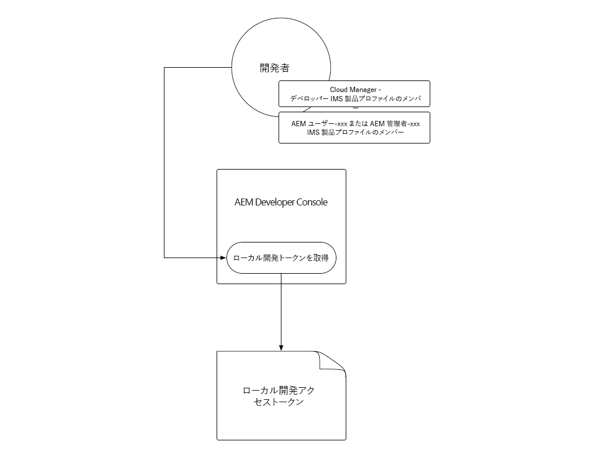
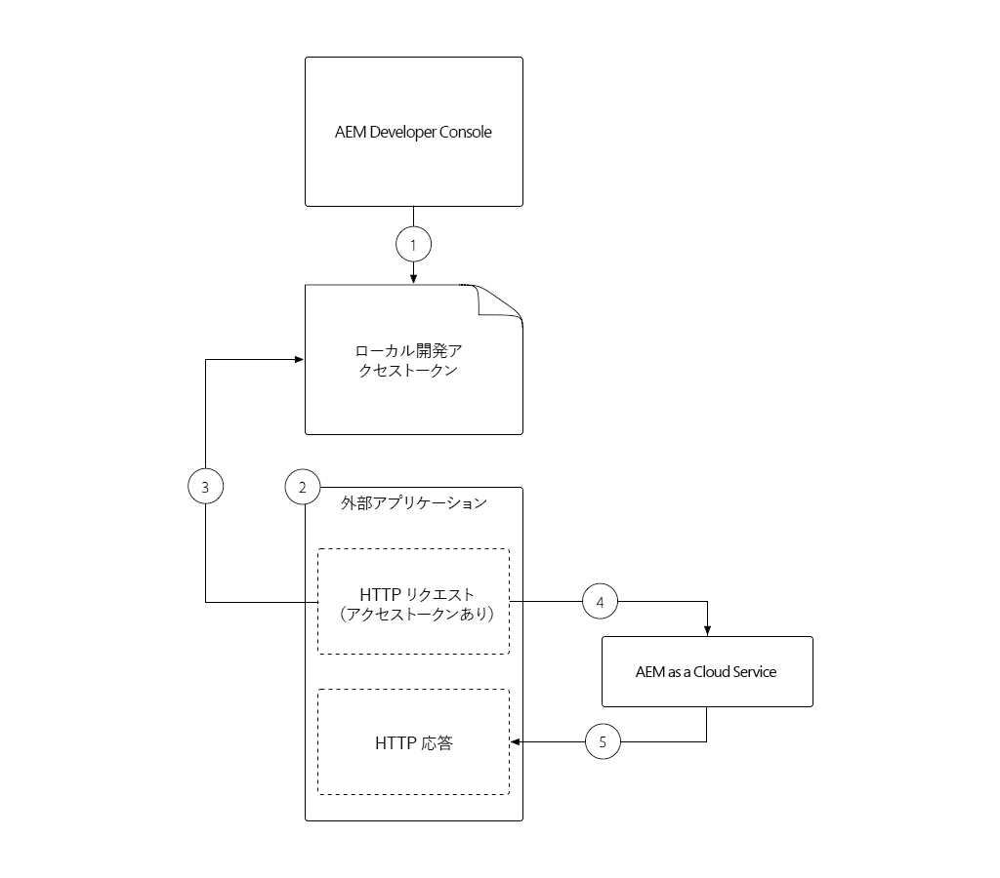
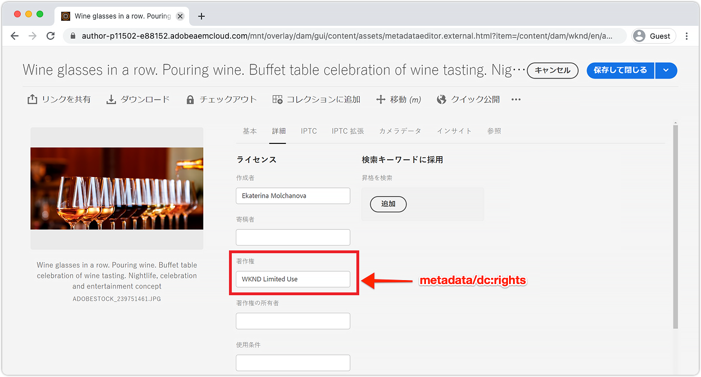

# 現地開発アクセストークン

Cloud ServiceとしてAEMへのプログラム的なアクセスを必要とする統合を構築する開発者は、ローカル開発アクティビティを容易にするAEM用の一時アクセストークンを簡単かつ迅速に取得する必要があります。 このニーズを満たすために、AEM Developer Consoleを使用すると、プログラムによってAEMにアクセスする際に使用できる一時アクセストークンを開発者が自己生成できます。

>[!VIDEO](https://video.tv.adobe.com/v/330477/?quality=12&learn=on)

## ローカル開発アクセストークンの生成



ローカル開発アクセストークンでは、トークンを生成したユーザーとしてのAEM作成者サービスおよび発行サービスと、その権限にアクセスできます。 これは開発トークンですが、このトークンを共有したり、ソース管理に保存したりしないでください。

1. [AdobeAdminConsole](https://adminconsole.adobe.com/)で、開発者が次のメンバーの1人であることを確認します。
   + __Cloud Manager -__ DeveloperIMS製品プロファイル(AEM Developer Consoleへのアクセス権を付与)
   + アクセストークンが統合するAEM環境のサービス用の&#x200B;__AEM Administrators__&#x200B;または&#x200B;__AEM Users__ IMS Productプロファイル
   + Cloud Service環境としてのSandbox AEMは、__AEM Administrators__&#x200B;または&#x200B;__AEM Users__&#x200B;製品プロファイルのメンバーシップのみ必要です
1. [Adobeクラウドマネージャー](https://my.cloudmanager.adobe.com)にログインします
1. AEMを含むプログラムをCloud Service環境として開き、
1. 「__環境__」セクションで環境の横の&#x200B;__省略記号__&#x200B;をタップし、「__デベロッパーコンソール__」を選択します
1. 「__統合__」タブをタップします
1. 「__ローカル開発トークンを取得__」ボタンをタップします
1. 左上隅の&#x200B;__ダウンロードボタン__&#x200B;をタップして`accessToken`値を含むJSONファイルをダウンロードし、JSONファイルを開発マシン上の安全な場所に保存します。
   + これは、AEMにCloud Service環境として24時間、開発者アクセストークンです。


## ローカル開発アクセストークン{#use-local-development-access-token}を使用



1. AEM Developer Consoleから一時的なローカル開発アクセストークンをダウンロードします。
   + ローカル開発アクセストークンは24時間ごとに期限切れになるので、開発者は新しいアクセストークンを毎日ダウンロードする必要があります。
1. Cloud ServiceとしてAEMとプログラム的にやり取りする外部アプリケーションが開発中です
1. 外部アプリケーションは、ローカル開発アクセストークンで読み取ります
1. 外部アプリケーションは、AEMにHTTP要求をCloud Serviceとして構築し、BearerトークンとしてLocal DevelopmentアクセストークンをHTTP要求のAuthorizationヘッダーに追加します
1. AEMは、HTTP要求を受け取り、要求を認証し、HTTP要求によって要求された作業を実行し、HTTP応答を外部アプリケーションに返します

### サンプル外部アプリケーション

簡単な外部JavaScriptアプリケーションを作成して、ローカル開発者アクセストークンを使用して、HTTPS経由のCloud ServiceとしてAEMにプログラム的にアクセスする方法を説明します。 これは、AEMの外部で動作する&#x200B;_アプリケーションやシステムが、フレームワークや言語に関係なく、どのようにして、AEMに対してプログラム的に認証を行い、アクセストークンをCloud Serviceとしてアクセスできるかを示しています。_[次のセクション](./service-credentials.md)では、本番用にトークンを生成する方法をサポートするように、このアプリケーションコードを更新します。

このサンプルアプリケーションは、コマンドラインから実行され、次のフローを使用して、AEM AssetsHTTP APIを使用してAEMアセットメタデータを更新します。

1. コマンドライン(`getCommandLineParams()`)からパラメータを読み込みます。
1. AEMへの認証に使用するアクセストークンをCloud Serviceとして取得(`getAccessToken(...)`)
1. コマンドラインパラメータで指定されたAEMアセットフォルダ内のすべてのアセット(`listAssetsByFolder(...)`)をリストします。
1. コマンドラインパラメーター(`updateMetadata(...)`)で指定された値で、一覧に表示されているアセットのメタデータを更新する

アクセストークンを使用してAEMに対してプログラム認証を行う際の重要な要素は、次の形式でAEMに対して行われるすべてのHTTP要求に認証HTTP要求ヘッダーを追加することです。

+ `Authorization: Bearer ACCESS_TOKEN`

## 外部アプリケーションの実行

1. [Node.js](/help/cloud-service/local-development-environment/development-tools.md?lang=en#node-js)がローカル開発マシンにインストールされていることを確認します。このマシンは、外部アプリケーションの実行に使用されます
1. [サンプル外部アプリケーション](./assets/aem-guides_token-authentication-external-application.zip)をダウンロードして解凍します。
1. コマンドラインから、このプロジェクトのフォルダーで`npm install`を実行します
1. [ダウンロードしたローカル開発アクセストークン](#download-local-development-access-token)を、プロジェクトのルートにある`local_development_token.json`という名前のファイルにコピーします
   + ただし、資格情報はGitにコミットしないでください。
1. `index.js`を開き、外部アプリケーションのコードとコメントを確認します。

   ```javascript
   const fetch = require('node-fetch');
   const fs = require('fs');
   const auth = require('@adobe/jwt-auth');
   
   // The root context of the Assets HTTP API
   const ASSETS_HTTP_API = '/api/assets';
   
   // Command line parameters
   let params = { };
   
   /**
   * Application entry point function
   */
   (async () => {
       console.log('Example usage: node index.js aem=https://author-p1234-e5678.adobeaemcloud.com propertyName=metadata/dc:rights "propertyValue=WKND Limited Use" folder=/wknd/en/adventures/napa-wine-tasting file=credentials-file.json' );
   
       // Parse the command line parameters
       params = getCommandLineParams();
   
       // Set the access token to be used in the HTTP requests to be local development access token
       params.accessToken = await getAccessToken(params.developerConsoleCredentials);
   
       // Get a list of all the assets in the specified assets folder
       let assets = await listAssetsByFolder(params.folder);
   
       // For each asset, update it's metadata
       await assets.forEach(asset => updateMetadata(asset, { 
           [params.propertyName]: params.propertyValue 
       }));
   })();
   
   /**
   * Returns a list of Assets HTTP API asset URLs that reference the assets in the specified folder.
   * 
   * https://experienceleague.adobe.com/docs/experience-manager-cloud-service/assets/admin/mac-api-assets.html?lang=en#retrieve-a-folder-listing
   * 
   * @param {*} folder the Assets HTTP API folder path (less the /content/dam path prefix)
   */
   async function listAssetsByFolder(folder) {
       return fetch(`${params.aem}${ASSETS_HTTP_API}${folder}.json`, {
               method: 'get',
               headers: { 
                   'Content-Type': 'application/json',
                   'Authorization': 'Bearer ' + params.accessToken // Provide the AEM access token in the Authorization header
               },
           })
           .then(res => {
               console.log(`${res.status} - ${res.statusText} @ ${params.aem}${ASSETS_HTTP_API}${folder}.json`);
   
               // If success, return the JSON listing assets, otherwise return empty results
               return res.status === 200 ? res.json() : { entities: [] };
           })
           .then(json => { 
               // Returns a list of all URIs for each non-content fragment asset in the folder
               return json.entities
                   .filter((entity) => entity['class'].indexOf('asset/asset') === -1 && !entity.properties.contentFragment)
                   .map(asset => asset.links.find(link => link.rel.find(r => r === 'self')).href);
           });
   }
   
   /**
   * Update the metadata of an asset in AEM
   * 
   * https://experienceleague.adobe.com/docs/experience-manager-cloud-service/assets/admin/mac-api-assets.html?lang=en#update-asset-metadata
   * 
   * @param {*} asset the Assets HTTP API asset URL to update
   * @param {*} metadata the metadata to update the asset with
   */
   async function updateMetadata(asset, metadata) {        
       await fetch(`${asset}`, {
               method: 'put',
               headers: { 
                   'Content-Type': 'application/json',
                   'Authorization': 'Bearer ' + params.accessToken // Provide the AEM access token in the Authorization header
               },
               body: JSON.stringify({
                   class: 'asset',
                   properties: metadata
               })
           })
           .then(res => { 
               console.log(`${res.status} - ${res.statusText} @ ${asset}`);
           });
   }
   
   /**
   * Parse and return the command line parameters. Expected params are:
   * 
   * - aem = The AEM as a Cloud Service hostname to connect to.
   *              Example: https://author-p12345-e67890.adobeaemcloud.com
   * - folder = The asset folder to update assets in. Note that the Assets HTTP API do NOT use the JCR `/content/dam` path prefix.
   *              Example: '/wknd/en/adventures/napa-wine-tasting'
   * - propertyName = The asset property name to update. Note this is relative to the [dam:Asset]/jcr:content node of the asset.
   *              Example: metadata/dc:rights
   * - propertyValue = The value to update the asset property (specified by propertyName) with.
   *              Example: "WKND Free Use"
   * - file = The path to the JSON file that contains the credentials downloaded from AEM Developer Console
   *              Example: local_development_token_cm_p1234-e5678.json 
   */
   function getCommandLineParams() {
       let parameters = {};
   
       // Parse the command line params, splitting on the = delimiter
       for (let i = 2; i < process.argv.length; i++) {
           let key = process.argv[i].split('=')[0];
           let value = process.argv[i].split('=')[1];
   
           parameters[key] = value;
       };
   
       // Read in the credentials from the provided JSON file
       if (parameters.file) {
           parameters.developerConsoleCredentials = JSON.parse(fs.readFileSync(parameters.file));
       }
   
       console.log(parameters);
   
       return parameters;
   }
   
   async function getAccessToken(developerConsoleCredentials) {s
       if (developerConsoleCredentials.accessToken) {
           // This is a Local Development access token
           return developerConsoleCredentials.accessToken;
       } 
   }
   ```

   `listAssetsByFolder(...)`と`updateMetadata(...)`の`fetch(..)`呼び出しを確認し、`headers`が`Bearer ACCESS_TOKEN`の値を持つ`Authorization` HTTPリクエストヘッダーを定義していることを知らせます。 外部アプリケーションからのHTTP要求は、AEMに対してCloud Serviceとして認証されます。

   ```javascript
   ...
   return fetch(`${params.aem}${ASSETS_HTTP_API}${folder}.json`, {
               method: 'get',
               headers: { 
                   'Content-Type': 'application/json',
                   'Authorization': 'Bearer ' + params.accessToken // Provide the AEM access token in the Authorization header
               },
   })...
   ```

   AEMにCloud ServiceとしてHTTPリクエストを送信する場合は、AuthorizationヘッダーにBearerアクセストークンを設定する必要があります。 Cloud Service環境としての各AEMは、独自のアクセストークンを必要とします。 開発のアクセストークンは、StageまたはProductionでは機能しません。Stageは、DevelopmentまたはProductionでは機能しません。また、Productionは、DevelopmentまたはStageでは機能しません。

1. コマンドラインを使用して、プロジェクトのルートからアプリケーションを実行し、次のパラメーターを渡します。

   ```shell
   $ node index.js \
       aem=https://author-p1234-e5678.adobeaemcloud.com \
       folder=/wknd/en/adventures/napa-wine-tasting \
       propertyName=metadata/dc:rights \
       propertyValue="WKND Limited Use" \
       file=local_development_token.json
   ```

   次のパラメーターが渡されます。

   + `aem`:アプリケーションが操作するCloud Service環境としてのAEMのスキームとホスト名(例： `https://author-p1234-e5678.adobeaemcloud.com`)をクリックします。
   + `folder`:アセットが次のファイルで更新されるアセットフォルダーのパス `propertyValue`。 `/content/dam` プレフィックスを追加しないでください(例： `/wknd/en/adventures/napa-wine-tasting`)
   + `propertyName`:更新するアセットプロパティの名前 `[dam:Asset]/jcr:content` (例： `metadata/dc:rights`)をクリックします。
   + `propertyValue`:に設定する値 `propertyName` 。スペースを含む値は、 `"` （例えば） `"WKND Limited Use"`)
   + `file`:AEM Developer ConsoleからダウンロードしたJSONファイルの相対ファイルパス。

   更新された各アセットのアプリケーション結果出力の正常な実行：

   ```shell
   200 - OK @ https://author-p1234-e5678.adobeaemcloud.com/api/assets/wknd/en/adventures/napa-wine-tasting.json
   200 - OK @ https://author-p1234-e5678.adobeaemcloud.com/api/assets/wknd/en/adventures/napa-wine-tasting/AdobeStock_277654931.jpg.json
   200 - OK @ https://author-p1234-e5678.adobeaemcloud.com/api/assets/wknd/en/adventures/napa-wine-tasting/AdobeStock_239751461.jpg.json
   200 - OK @ https://author-p1234-e5678.adobeaemcloud.com/api/assets/wknd/en/adventures/napa-wine-tasting/AdobeStock_280313729.jpg.json
   200 - OK @ https://author-p1234-e5678.adobeaemcloud.com/api/assets/wknd/en/adventures/napa-wine-tasting/AdobeStock_286664352.jpg.json
   ```

### AEMでのメタデータの更新の検証

Cloud Service環境としてAEMにログインし、メタデータが更新されたことを確認します（`aem`コマンドラインパラメータに渡されたホストと同じホストがアクセスされることを確認します）。

1. 外部アプリケーションが操作したCloud Service環境としてAEMにログインします（`aem`コマンドラインパラメーターに指定されたのと同じホストを使用）
1. __アセット__ > __ファイル__&#x200B;に移動します
1. `folder`コマンドラインパラメータで指定されたアセットフォルダー（例：__WKND__ > __英語__ > __冒険__ > __Napa Wine Tasting__）に移動します。
1. フォルダー内の任意の（コンテンツフラグメント以外の）アセットの&#x200B;__プロパティ__&#x200B;を開きます
1. 「__詳細__」タブをタップします
1. __WKND Limited Use__&#x200B;のように、更新された`metadata/dc:rights` JCRプロパティにマップされる&#x200B;__著作権__&#x200B;の値を確認します。これは、`propertyValue`パラメーターに指定された値を反映しています。



## 次の手順

ローカル開発トークンを使用してAEMにプログラム的にアクセスできたので、サービス資格情報を使用して処理するアプリを更新し、実稼働コンテキストで使用できるようにする必要があります。

+ [サービス資格情報の使用方法](./service-credentials.md)
