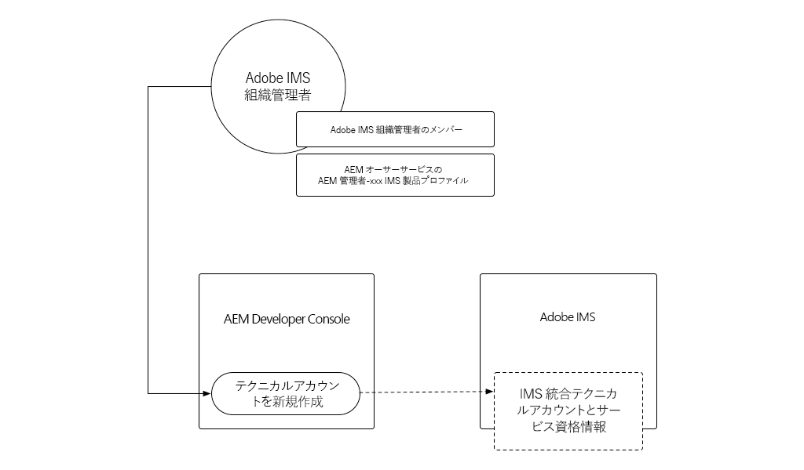
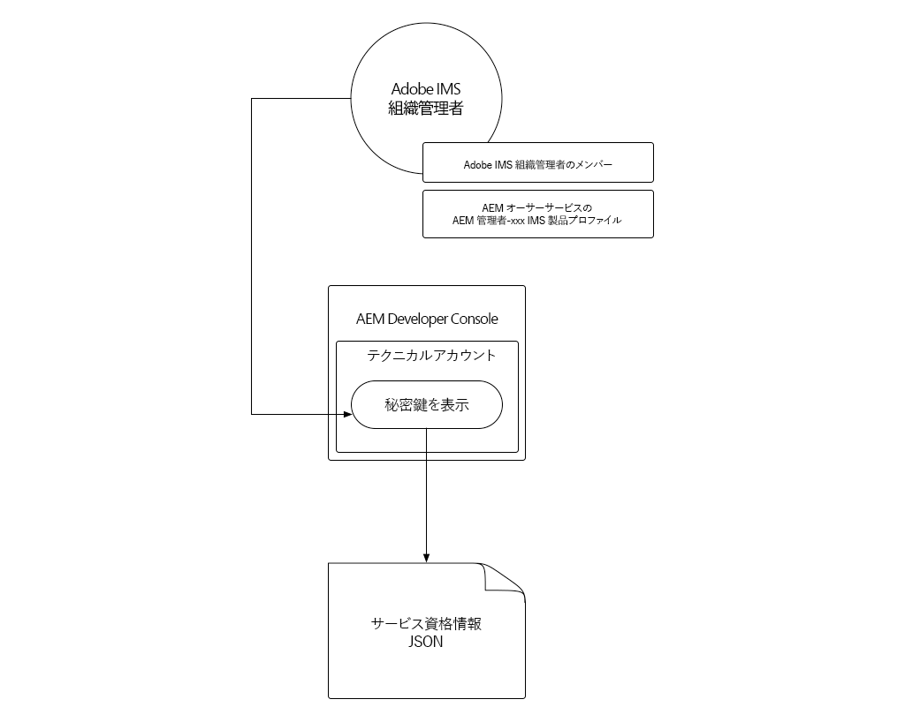
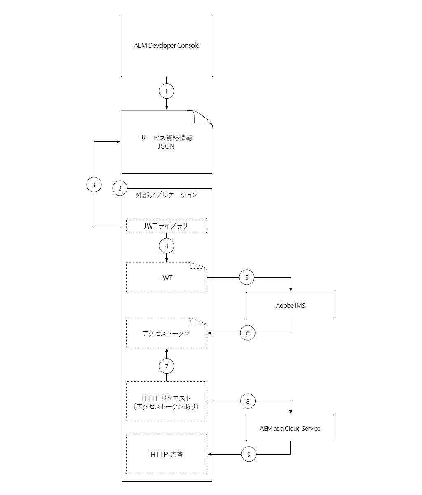
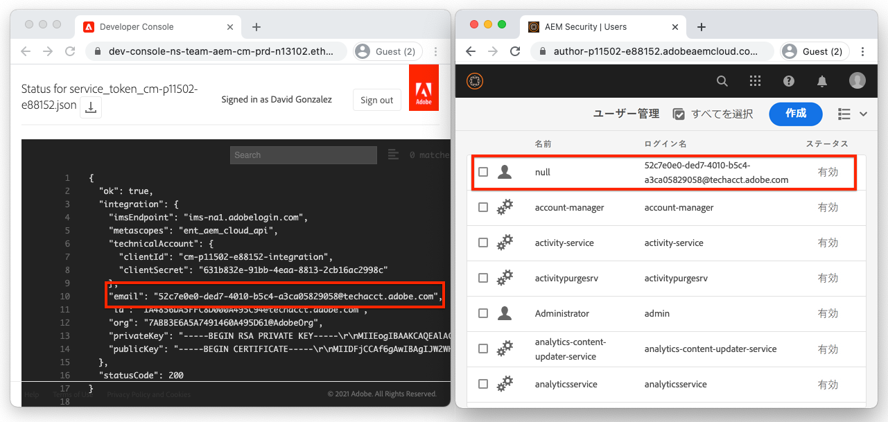

# サービス資格情報

Cloud ServiceとしてAEMとの統合では、AEMに対して安全に認証できる必要があります。 AEM Developer Consoleでは、サービス資格情報へのアクセス権限が付与されます。この資格情報は、外部のアプリケーション、システムおよびサービスが、HTTP経由でAEM AuthorまたはPublishサービスとプログラム的にやり取りするのに使用されます。

>[!VIDEO](https://video.tv.adobe.com/v/330460/?quality=12&learn=on)

サービス資格情報は、[ローカル開発アクセストークン](./local-development-access-token.md)と似ていても、いくつかの主な点で異なります。

+ サービス資格情報は、_アクセストークンではなく_、_obtain_&#x200B;アクセストークンに使用される資格情報です。
+ サービス資格情報はより永久的で（365日ごとに期限切れになる）、ローカル開発アクセストークンの期限が毎日切れるのに対して、失効しない限り変更しません。
+ Cloud Service環境としてのAEMのサービス資格情報は、1人のAEMテクニカルアカウントアクセストークンにマップされます。一方、ローカル開発ユーザーは、アクセストークンを生成したAEMとして認証されます。

3つのすべてを使用してCloud Service環境としてそれぞれのAEMへのアクセス権を取得できるので、サービス資格情報と生成するアクセストークン、およびローカル開発アクセストークンの両方を秘密にする必要があります

## サービス資格情報の生成

サービス資格情報の生成は、次の2つの手順に分かれます。

1. AdobeIMS組織管理者による1回限りのサービス資格情報の初期化
1. サービス資格情報JSONのダウンロードと使用

### サービス資格情報の初期化

サービス資格情報は、ローカル開発アクセストークンとは異なり、ダウンロードするには、Adobe組織IMS管理者が&#x200B;_1回限りの初期化_&#x200B;を行う必要があります。



__これは、Cloud Service環境としてのAEMごとの1回限りの初期化です__

1. AdobeのIMS組織の管理者としてログインしていることを確認します
1. [Adobeクラウドマネージャー](https://my.cloudmanager.adobe.com)にログインします
1. AEMを含むプログラムをCloud Service環境として開き、
1. 「__環境__」セクションで環境の横の省略記号をタップし、「__デベロッパーコンソール__」を選択します
1. 「__統合__」タブをタップします
1. 「__サービス資格情報を取得__」ボタンをタップします
1. サービス資格情報がJSONとして初期化され、表示されます


AEM asCloud Service環境のサービス資格情報が初期化されると、AdobeIMS組織の他のAEM開発者がそれらをダウンロードできます。

### サービス資格情報のダウンロード



サービス資格情報のダウンロードは、初期化と同じ手順に従います。 初期化がまだ行われていない場合は、「__Get Service Credentials__」ボタンをタップするとエラーが表示されます。

1. __Cloud Manager - Developer__ IMS製品プロファイル(AEM Developer Consoleへのアクセスを許可)のメンバーであることを確認します。
   + Cloud Service環境としてのSandbox AEMは、__AEM Administrators__&#x200B;または&#x200B;__AEM Users__&#x200B;製品プロファイルのメンバーシップのみ必要です
1. [Adobeクラウドマネージャー](https://my.cloudmanager.adobe.com)にログインします
1. AEMを含むプログラムをCloud Service環境として開き、
1. 「__環境__」セクションで環境の横の省略記号をタップし、「__デベロッパーコンソール__」を選択します
1. 「__統合__」タブをタップします
1. 「__サービス資格情報を取得__」ボタンをタップします
1. 左上隅の「ダウンロード」ボタンをタップして、サービス秘密鍵証明書の値を含むJSONファイルをダウンロードし、ファイルを安全な場所に保存します。
   + _サービス資格情報が侵害された場合は、すぐにAdobeサポートに問い合わせて、資格情報の失効を依頼してください_

## サービス資格情報のインストール

サービス資格情報は、JWTの生成に必要な詳細を提供します。JWTは、AEMとのCloud Service認証に使用されるアクセストークンと交換されます。 サービス資格情報は、AEMへのアクセスに使用する外部アプリケーション、システム、またはサービスからアクセス可能な安全な場所に保存する必要があります。 サービス資格情報の管理方法と管理場所は、顧客ごとに一意です。

簡単にするために、このチュートリアルでは、サービス資格情報をコマンドラインから渡します。ただし、ITセキュリティチームと協力して、組織のセキュリティガイドラインに従ってこれらの資格情報を保存し、アクセスする方法を理解します。

1. [ダウンロードしたサービス資格情報JSON](#download-service-credentials)を、プロジェクトのルートにある`service_token.json`という名前のファイルにコピーします
   + ただし、資格情報はGitにコミットしないでください。

## サービス資格情報を使用

完全形式のJSONオブジェクトであるサービス資格情報は、JWTやアクセストークンと同じではありません。 代わりに、（秘密鍵を含む）サービス資格情報を使用してJWTが生成され、JWTがAdobeのIMS APIと交換されてアクセストークンになります。



1. AEM Developer Consoleから安全な場所にサービス資格情報をダウンロードします
1. 外部アプリケーションは、Cloud Service環境としてAEMとプログラム的にやり取りする必要があります
1. 外部アプリケーションは、セキュリティで保護された場所からサービス資格情報を読み取ります
1. 外部アプリケーションは、サービス資格情報の情報を使用してJWTトークンを構築します
1. JWTトークンは、アクセストークンと交換するためにAdobeIMSに送信されます
1. AdobeIMSは、AEMにCloud Serviceとしてアクセスするために使用できるアクセストークンを返します
   + アクセストークンは有効期限をリクエストできます。 アクセストークンの寿命を短くし、必要に応じて更新することをお勧めします。
1. 外部アプリケーションは、HTTPリクエストをCloud ServiceとしてAEMに送信し、アクセストークンをBearerトークンとしてHTTPリクエストのAuthorizationヘッダに追加します
1. AEMは、HTTP要求を受け取り、要求を認証し、HTTP要求によって要求された作業を実行し、HTTP応答を外部アプリケーションに返します

### 外部アプリケーションの更新

サービス資格情報を使用してAEMにCloud Serviceとしてアクセスするには、外部アプリケーションを次の3つの方法で更新する必要があります。

1. サービス資格情報を読み取ります
   + 簡単にするために、ダウンロードしたJSONファイルからこれらを読み取りますが、実際に使用するシナリオでは、サービス資格情報が組織のセキュリティガイドラインに従って安全に保存されている必要があります
1. サービス資格情報からJWTを生成
1. JWTをアクセストークンと交換する
   + サービス資格情報が存在する場合、外部アプリケーションは、AEMにCloud Serviceとしてアクセスする際に、ローカル開発アクセストークンではなく、このアクセストークンを使用します

このチュートリアルでは、Adobeの`@adobe/jwt-auth` npmモジュールを使用して両方を行い、(1)サービス秘密鍵証明書からJWTを生成し、(2)1回の関数呼び出しでアクセストークンと交換します。 アプリケーションがJavaScriptベースでない場合は、他の言語](https://www.adobe.io/authentication/auth-methods.html#!AdobeDocs/adobeio-auth/master/JWT/samples/samples.md)の[サンプルコードを参照して、サービス資格情報からJWTを作成し、AdobeIMSとのアクセストークンと交換する方法を確認してください。

## サービス資格情報を読み取ります

`getCommandLineParams()`を確認し、ローカル開発アクセストークンJSONで読み取るのと同じコードを使用して、サービス資格情報のJSONファイルを読み取れることを確認します。

```javascript
function getCommandLineParams() {
    ...

    // Read in the credentials from the provided JSON file
    // Since both the Local Development Access Token and Service Credentials files are JSON, this same approach can be re-used
    if (parameters.file) {
        parameters.developerConsoleCredentials = JSON.parse(fs.readFileSync(parameters.file));
    }

    ...
    return parameters;
}
```

## JWTの作成とアクセストークンの交換

サービス資格情報が読み取られたら、JWTを生成してJWTを使用し、アクセストークン用のAdobeIMS APIと交換します。このJWTを使用して、AEMにCloud Serviceとしてアクセスできます。

このサンプルアプリケーションはNode.jsベースなので、[@adobe/jwt-auth](https://www.npmjs.com/package/@adobe/jwt-auth) npmモジュールを使用すると、(1) JWT生成と(20)AdobeIMSとの交換が容易になります。 アプリケーションが別の言語を使用して開発されている場合は、[適切なコードサンプル](https://www.adobe.io/authentication/auth-methods.html#!AdobeDocs/adobeio-auth/master/JWT/samples/samples.md)を参照し、他のプログラミング言語を使用してAdobeIMSに対するHTTPリクエストを作成する方法を確認してください。

1. `getAccessToken(..)`を更新して、JSONファイルの内容を調べ、それがローカル開発アクセストークンかサービス秘密鍵証明書かを判断します。 これは、ローカル開発アクセストークンJSONに対してのみ存在する`.accessToken`プロパティが存在するかどうかを確認することで、簡単に実現できます。

   サービス資格情報が指定されている場合、アプリケーションはJWTを生成し、アクセストークン用のAdobeIMSと交換します。 [@adobe/jwt-auth](https://www.npmjs.com/package/@adobe/jwt-auth)の`auth(...)`関数を使用します。この関数は、両方ともJWTを生成し、1回の関数呼び出しでアクセストークンと交換します。  `auth(..)`に対するパラメーターは[JSONオブジェクトで、以下のコードで説明するように、サービス資格情報JSONから取得できる特定の情報](https://www.npmjs.com/package/@adobe/jwt-auth#config-object)で構成されます。

   ```javascript
    async function getAccessToken(developerConsoleCredentials) {
   
        if (developerConsoleCredentials.accessToken) {
            // This is a Local Development access token
            return developerConsoleCredentials.accessToken;
        } else {
            // This is the Service Credentials JSON object that must be exchanged with Adobe IMS for an access token
            let serviceCredentials = developerConsoleCredentials.integration;
   
            // Use the @adobe/jwt-auth library to pass the service credentials generated a JWT and exchange that with Adobe IMS for an access token.
            // If other programming languages are used, please see these code samples: https://www.adobe.io/authentication/auth-methods.html#!AdobeDocs/adobeio-auth/master/JWT/samples/samples.md
            let { access_token } = await auth({
                clientId: serviceCredentials.technicalAccount.clientId, // Client Id
                technicalAccountId: serviceCredentials.id,              // Technical Account Id
                orgId: serviceCredentials.org,                          // Adobe IMS Org Id
                clientSecret: serviceCredentials.technicalAccount.clientSecret, // Client Secret
                privateKey: serviceCredentials.privateKey,              // Private Key to sign the JWT
                metaScopes: serviceCredentials.metascopes.split(','),   // Meta Scopes defining level of access the access token should provide
                ims: `https://${serviceCredentials.imsEndpoint}`,       // IMS endpoint used to obtain the access token from
            });
   
            return access_token;
        }
    }
   ```

   現在は、ローカル開発アクセストークンのJSONまたはサービス資格情報のJSONのいずれかのJSONファイルが`file`コマンドラインパラメーターを介して渡される場合、アクセストークンが発生します。

   サービス資格情報は期限切れになりませんが、JWTおよび対応するアクセストークンは期限切れになる前に更新する必要があります。 これは、AdobeIMS](https://www.adobe.io/authentication/auth-methods.html#!AdobeDocs/adobeio-auth/master/OAuth/OAuth.md#access-tokens)が提供する`refresh_token` [を使用して行うことができます。

1. これらの変更とAEM Developer Consoleからダウンロードしたサービス資格情報JSON（およびわかりやすく、この`index.js`と同じフォルダーに`service_token.json`として保存）を使用して、コマンドラインパラメーター`file`を`service_token.json`に置き換え、`propertyValue`を新しい値に更新し、AEMで効果を明らかにします。

   ```shell
   $ node index.js \
       aem=https://author-p1234-e5678.adobeaemcloud.com \
       folder=/wknd/en/adventures/napa-wine-tasting \
       propertyName=metadata/dc:rights \
       propertyValue="WKND Restricted Use" \
       file=service_token.json
   ```

   端末への出力は次のようになります。

   ```shell
   200 - OK @ https://author-p1234-e5678.adobeaemcloud.com/api/assets/wknd/en/adventures/napa-wine-tasting.json
   403 - Forbidden @ https://author-p1234-e5678.adobeaemcloud.com/api/assets/wknd/en/adventures/napa-wine-tasting/AdobeStock_277654931.jpg.json
   403 - Forbidden @ https://author-p1234-e5678.adobeaemcloud.com/api/assets/wknd/en/adventures/napa-wine-tasting/AdobeStock_239751461.jpg.json
   403 - Forbidden @ https://author-p1234-e5678.adobeaemcloud.com/api/assets/wknd/en/adventures/napa-wine-tasting/AdobeStock_280313729.jpg.json
   403 - Forbidden @ https://author-p1234-e5678.adobeaemcloud.com/api/assets/wknd/en/adventures/napa-wine-tasting/AdobeStock_286664352.jpg.json
   ```

   __403 - Forbidden__&#x200B;行は、AEMへのHTTP API呼び出しでCloud Serviceとしてエラーが発生したことを示します。 アセットのメタデータを更新しようとすると、この403 Forbiddenエラーが発生します。

   これは、サービス資格情報から派生したアクセストークンが、自動作成されたテクニカルアカウントAEMユーザーを使用してAEMに対する要求を認証するためです。デフォルトでは、読み取りアクセス権のみを持ちます。 AEMへのアプリケーション書き込みアクセスを提供するには、アクセストークンに関連付けられたテクニカルアカウントAEMユーザーにAEMで権限を付与する必要があります。

## AEMでのアクセスの設定

Service Credentialsから派生したアクセストークンは、Contributors AEMユーザグループのメンバーシップを持つテクニカルアカウントAEMユーザを使用します。



テクニカルアカウントのAEMユーザーがAEMに存在したら(アクセストークンとの最初のHTTPリクエストの後)、このAEMユーザーの権限は、他のAEMユーザーと同じように管理できます。

1. まず、AEM Developer Consoleからダウンロードしたサービス資格情報JSONを開いて、テクニカルアカウントのAEMログイン名を見つけ、`integration.email`値を探します。この値は次のようになります。`12345678-abcd-9000-efgh-0987654321c@techacct.adobe.com`.
1. 対応するAEM環境の作成者サービスにAEM管理者としてログインします
1. __ツール__ > __セキュリティ__ > __ユーザー__&#x200B;に移動します
1. 手順1で識別された&#x200B;__ログイン名__&#x200B;を持つAEMユーザーを探し、__プロパティ__&#x200B;を開きます。
1. 「__グループ__」タブに移動し、__DAMユーザー__&#x200B;グループを追加します（アセットへの書き込みアクセス権を持つユーザー）。
1. 「__保存して閉じる__」をタップします

AEMで権限を持つテクニカルアカウントで、アセットに対する書き込み権限を持つ場合は、アプリケーションを再実行します。

```shell
$ node index.js \
    aem=https://author-p1234-e5678.adobeaemcloud.com \
    folder=/wknd/en/adventures/napa-wine-tasting \
    propertyName=metadata/dc:rights \
    propertyValue="WKND Restricted Use" \
    file=service_token.json
```

端末への出力は次のようになります。

```
200 - OK @ https://author-p1234-e5678.adobeaemcloud.com/api/assets/wknd/en/adventures/napa-wine-tasting.json
200 - OK @ https://author-p1234-e5678.adobeaemcloud.com/api/assets/wknd/en/adventures/napa-wine-tasting/AdobeStock_277654931.jpg.json
200 - OK @ https://author-p1234-e5678.adobeaemcloud.com/api/assets/wknd/en/adventures/napa-wine-tasting/AdobeStock_286664352.jpg.json
200 - OK @ https://author-p1234-e5678.adobeaemcloud.com/api/assets/wknd/en/adventures/napa-wine-tasting/AdobeStock_239751461.jpg.json
200 - OK @ https://author-p1234-e5678.adobeaemcloud.com/api/assets/wknd/en/adventures/napa-wine-tasting/AdobeStock_280313729.jpg.json
```

## 変更の確認

1. 更新されたCloud Service環境としてAEMにログインします（`aem`コマンドラインパラメーターで指定されたのと同じホスト名を使用）。
1. __アセット__ > __ファイル__&#x200B;に移動します
1. `folder`コマンドラインパラメータで指定されたアセットフォルダー（例：__WKND__ > __英語__ > __冒険__ > __Napa Wine Tasting__）に移動します。
1. フォルダー内の任意のアセットの&#x200B;__プロパティ__&#x200B;を開きます
1. 「__詳細__」タブに移動します。
1. __更新された`metadata/dc:rights`JCRプロパティにマップされている著作権__&#x200B;の値を確認します。これは、__WKND Restricted Use__&#x200B;のように、`propertyValue`パラメーターに指定された値を反映します。


## バリデーターが

これで、ローカル開発アクセストークンと、運用に対応したサービス間アクセストークンを使用して、Cloud ServiceとしてAEMにプログラムからアクセスできました。

