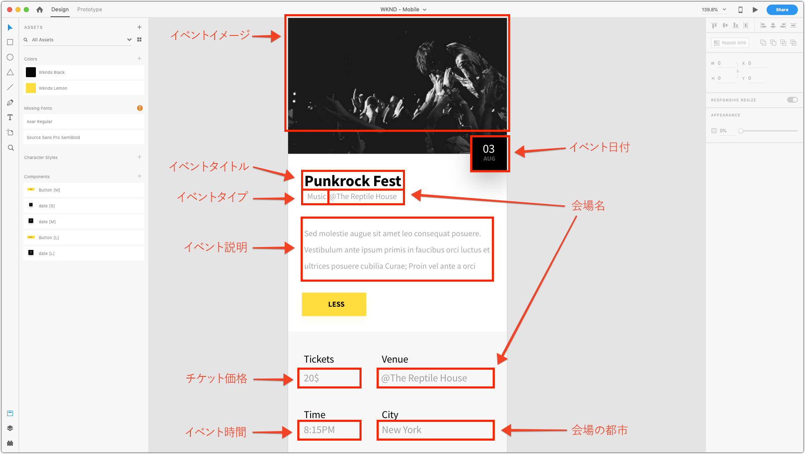

# 第 2 章 - コンテンツフラグメントモデルの使用

AEM コンテンツフラグメントモデルは、AEM 作成者が Raw コンテンツの作成をテンプレート化するために使用できるコンテンツスキーマを定義します。このアプローチは、基礎モードやフォームベースのオーサリングに似ています。コンテンツフラグメントの重要な概念は、作成されたコンテンツがプレゼンテーションに依存しないことです。つまり、AEM、単一ページアプリケーション、モバイルアプリなど、消費側のアプリケーションがコンテンツの表示方法を制御できるマルチチャネルでの使用を意図していることです。

コンテンツフラグメントの一番の関心事は、次の点を確実にすることです。

1. 正しいコンテンツが作成者から収集される。
2. 構造化された理解しやすい形式でコンテンツを消費側アプリケーションに公開できる。

この章では、「イベント」のモデリングと作成のための正規化されたデータ構造とオーサリングインターフェイスの定義に使用するコンテンツフラグメントモデルの有効化と定義について説明します。

## コンテンツフラグメントモデルの有効化

コンテンツフラグメントモデルは、**[AEM の[!UICONTROL 設定ブラウザー]](https://experienceleague.adobe.com/docs/experience-manager-cloud-service/implementing/developing/configurations.html?lang=ja)**&#x200B;で&#x200B;**有効にする必要があります**。

設定に対してコンテンツフラグメントモデルが&#x200B;**有効になっていない**&#x200B;場合、関連する AEM 設定に対して&#x200B;**[!UICONTROL 作成]／[!UICONTROL コンテンツフラグメント]**&#x200B;ボタンは表示されません。

>[!NOTE]
>
>AEM の設定は、`/conf` 下に保存された一連の[コンテキスト対応のテナント設定](https://sling.apache.org/documentation/bundles/context-aware-configuration/context-aware-configuration.html)を表します。通常、AEM の設定は、AEM Sitesで管理される特定の web サイトや、AEM のコンテンツのサブセット（アセットやページなど）を担当するビジネスユニットと関連があります。
>
>設定がコンテンツ階層に影響を与えるためには、設定がそのコンテンツ階層の `cq:conf` プロパティを通じて参照される必要があります。これは、以下の&#x200B;**手順 5** の [!DNL WKND Mobile] 設定で実現されます。
>
>`global` 設定を使用すると、設定はすべてのコンテンツに適用され、`cq:conf` を設定する必要はありません。
>
>詳しくは、[[!UICONTROL 設定ブラウザー]のドキュメント](https://experienceleague.adobe.com/docs/experience-manager-cloud-service/implementing/developing/configurations.html?lang=ja)を参照してください。

1. 適切な権限を持つユーザーとして AEM オーサーにログインして、関連する設定を変更します。
   * このチュートリアルでは、**admin** ユーザーを使用できます。
1. **[!UICONTROL ツール]／[!UICONTROL 一般]／[!UICONTROL 設定ブラウザー]**&#x200B;に移動します。
1. **[!DNL WKND Mobile]** の横にある&#x200B;**フォルダーアイコン**&#x200B;をタップして選択したあと、左上の「**[!UICONTROL 編集]**」ボタンをタップします。
1. **[!UICONTROL コンテンツフラグメントモデル]**&#x200B;を選択し、右上の「**[!UICONTROL 保存して閉じる]**」をタップします。

   これにより、[!DNL WKND Mobile] 設定が適用されたコンテンツフラグメントモデルがアセットフォルダーコンテンツツリーで有効になります。

   >[!NOTE]
   >
   >この設定変更は、[!UICONTROL AEM 設定] web UI から元に戻すことはできません。この設定を元に戻すには、以下を実行します。
   >    
   >    1. [CRXDE Lite](http://localhost:4502/crx/de) を開きます。
   >    1. `/conf/wknd-mobile/settings/dam/cfm` に移動します。
   >    1. `models` ノードを削除します。
   >    
   >この設定で作成された既存のコンテンツフラグメントモデルはすべて削除され、その定義は `/conf/wknd-mobile/settings/dam/cfm/models` に保存されます。

1. **[!DNL WKND Mobile]アセットフォルダー**&#x200B;に **[!DNL WKND Mobile]** 設定を適用して、コンテンツフラグメントモデル内のコンテンツフラグメントをアセットフォルダー階層内に作成できるようにします。

   1. **[!UICONTROL AEM]／[!UICONTROL アセット]／[!UICONTROL ファイル]**&#x200B;に移動します。
   1. **[!UICONTROL WKND Mobile] フォルダー**&#x200B;を選択します。
   1. 上部のアクションバーにある「**[!UICONTROL プロパティ]**」ボタンをタップして[!UICONTROL フォルダーのプロパティ]を開きます。
   1. [!UICONTROL フォルダーのプロパティ]で「**[!UICONTROL クラウドサービス]**」タブをタップします。
   1. 「**[!UICONTROL クラウド設定]**」フィールドが **/conf/wknd-mobile** に設定されていることを確認します。
   1. 変更を保存するには、右上の「**[!UICONTROL 保存して閉じる]**」をタップします。

>[!VIDEO](https://video.tv.adobe.com/v/28336?quality=12&learn=on)

>[!WARNING]
>
> __コンテンツフラグメントモデル__&#x200B;が、__ツール／アセット__&#x200B;から&#x200B;__ツール／一般__&#x200B;に移動しました。

## 作成するコンテンツフラグメントモデルについて

コンテンツフラグメントモデルを定義する前に、エクスペリエンスをレビューし、必要なデータポイントをすべて取り込んでいることを確認してください。そのために、モバイルアプリケーションのデザインをレビューし、デザイン要素を、収集するコンテンツにマッピングします。

イベントを定義するデータポイントを次のように分類できます。

マッピングを使用することで、イベントデータを収集し最終的に公開するためのコンテンツフラグメントを定義できます。

## コンテンツフラグメントモデルの作成

1. **[!UICONTROL ツール]／[!UICONTROL 一般]／[!UICONTROL コンテンツフラグメントモデル]**&#x200B;に移動します。
1. **[!DNL WKND Mobile]** フォルダーをタップして開きます。
1. **[!UICONTROL 作成]**&#x200B;をタップして、コンテンツフラグメントモデル作成ウィザードを開きます。
1. 「**[!UICONTROL モデルタイトル]**」*（説明はオプション）*&#x200B;として **[!DNL Event]** を入力し、「**[!UICONTROL 作成]**」をクリックして保存します。

>[!VIDEO](https://video.tv.adobe.com/v/28337?quality=12&learn=on)

## コンテンツフラグメントモデルの構造の定義

1. **[!UICONTROL ツール]／[!UICONTROL 一般]／[!UICONTROL コンテンツフラグメントモデル]に移動します[!DNL WKND]**。
1. **[!DNL Event]** コンテンツフラグメントモデルを選択し、上部のアクションバーで「**[!UICONTROL 編集]**」をクリックします。
1. 右側の「**[!UICONTROL データタイプ]」タブ**&#x200B;から、「**[!UICONTROL 1 行のテキスト入力]**」を左側のドロップゾーンにドラッグして、**[!DNL Question]** フィールドを定義します。
1. 新しい「**[!UICONTROL 1 行のテキスト入力]**」が左側で選択され、「**[!UICONTROL プロパティ]」タブ** が右側で選択されていることを確認します。「プロパティ」フィールドに以下のように値を入力します。

   * [!UICONTROL レンダリング時の名前]：`textfield`
   * [!UICONTROL フィールドラベル]：`Event Title`
   * [!UICONTROL プロパティ名]：`eventTitle`
   * [!UICONTROL 最大長]：25
   * [!UICONTROL 必須]：`Yes`

以下に定義する入力定義を使用してこれらの手順を繰り返し、残りのイベントコンテンツフラグメントモデルを作成します。

>[!NOTE]
>
> Android アプリケーションが該当する名前をキーオフするようにプログラムされているため、「**プロパティ名**」フィールドは完全に一致させる必要があります。

### イベントの説明

* [!UICONTROL データタイプ]：`Multi-line text`
* [!UICONTROL フィールドラベル]：`Event Description`
* [!UICONTROL プロパティ名]：`eventDescription`
* [!UICONTROL デフォルトの種類]：`Rich text`

### イベントの日付と時間

* [!UICONTROL データタイプ]：`Date and time`
* [!UICONTROL フィールドラベル]：`Event Date and Time`
* [!UICONTROL プロパティ名]：`eventDateAndTime`
* [!UICONTROL 必須]：`Yes`

### イベントタイプ

* [!UICONTROL データタイプ]：`Enumeration`
* [!UICONTROL フィールドラベル]：`Event Type`
* [!UICONTROL プロパティ名]：`eventType`
* [!UICONTROL オプション]：`Art,Music,Performance,Photography`

### チケット価格

* [!UICONTROL データタイプ]：`Number`
* [!UICONTROL レンダリング時の名前]：`numberfield`
* [!UICONTROL フィールドラベル]：`Ticket Price`
* [!UICONTROL プロパティ名]：`eventPrice`
* [!UICONTROL タイプ]：`Integer`
* [!UICONTROL 必須]：`Yes`

### イベント画像

* [!UICONTROL データタイプ]：`Content Reference`
* [!UICONTROL レンダリング時の名前]：`contentreference`
* [!UICONTROL フィールドラベル]：`Event Image`
* [!UICONTROL プロパティ名]：`eventImage`
* [!UICONTROL ルートパス]：`/content/dam/wknd-mobile/images`
* [!UICONTROL 必須]：`Yes`

### 会場名

* [!UICONTROL データタイプ]：`Single-line text`
* [!UICONTROL レンダリング時の名前]：`textfield`
* [!UICONTROL フィールドラベル]：`Venue Name`
* [!UICONTROL プロパティ名]：`venueName`
* [!UICONTROL 最大長]：20
* [!UICONTROL 必須]：`Yes`

### 会場都市

* [!UICONTROL データタイプ]：`Enumeration`
* [!UICONTROL フィールドラベル]：`Venue City`
* [!UICONTROL プロパティ名]：`venueCity`
* [!UICONTROL オプション]：`Basel,London,Los Angeles,Paris,New York,Tokyo`

>[!VIDEO](https://video.tv.adobe.com/v/28335?quality=12&learn=on)

>[!NOTE]
>
>**[!UICONTROL プロパティ名]**&#x200B;は、この値が格納される JCR プロパティ名と JSON ファイル内のキーの&#x200B;**両方**&#x200B;を示します。これは、コンテンツフラグメントモデルの存続期間中は変更されないセマンティック名にする必要があります。

コンテンツフラグメントモデルの作成が完了すると、最終的に次のような定義になります。

## 次の手順

必要に応じて、[com.adobe.aem.guides.wknd-mobile.content.chapter-2.zip](https://github.com/adobe/aem-guides-wknd-mobile/releases/latest) コンテンツパッケージを [AEM のパッケージマネージャー](http://localhost:4502/crx/packmgr/index.jsp)を通じて AEM オーサーにインストールします。このパッケージには、チュートリアルのこのパートで概要を説明した設定とコンテンツが含まれています。

* [第 3 章 - イベントコンテンツフラグメントのオーサリング](./chapter-3.md)
