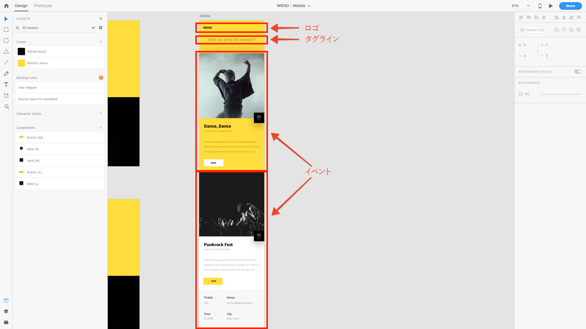

# 第4章 — コンテンツサービステンプレートの定義

AEMヘッドレスチュートリアルの第4章では、AEM Content ServicesのコンテキストでのAEM編集可能テンプレートの役割について説明します。 編集可能テンプレートは、コンテンツサービスが有効なAEMコンポーネントの構成を介して、AEM Content Servicesがクライアントに公開するJSONコンテンツ構造を定義するために使用されます。

## AEM Content Servicesのテンプレートの役割について

AEM編集可能テンプレートは、イベントコンテンツをJSONとして公開するためにアクセスされるHTTPエンドポイントを定義するために使用されます。

従来のAEM編集可能テンプレートは、Webページの定義に使用されていましたが、この使用は単なる慣例です。 編集可能なテンプレートは、**任意の**&#x200B;コンテンツのセットを構成するために使用できます。そのコンテンツへのアクセス方法：をブラウザーでHTMLとして使用する場合、JavaScript(AEM SPA Editor)またはモバイルアプリで使用されるJSONは、そのページがリクエストされる方法の関数です。

AEM Content Servicesでは、編集可能なテンプレートを使用して、JSONデータの公開方法を定義します。

[!DNL WKND Mobile]アプリの場合、単一のAPIエンドポイントを駆動するために使用される、単一の編集可能なテンプレートを作成します。 この例ではAEMヘッドレスの概念を簡単に説明しますが、異なるコンテンツのセットをそれぞれ公開する複数のページ（またはエンドポイント）を作成して、より複雑で整理されたAPIを作成できます。

## APIエンドポイントについて

APIエンドポイントの作成方法と、[!DNL WKND Mobile]アプリに公開するコンテンツを理解するには、デザインに再度アクセスします。

このように、モバイルアプリに提供するコンテンツの論理的なセットが3つあります。

1. **ロゴ**
2. **タグ行**
3. **イベント**&#x200B;のリスト

これをおこなうには、必要なコンテンツをJSONとして公開するために、これらの要件をAEMコンポーネント(およびこの場合はAEM WCMコアコンポーネント)にマッピングします。

1. **ロゴ**&#x200B;は、**画像コンポーネント**&#x200B;で表示されます
2. **タグ行**&#x200B;は、**テキストコンポーネント**&#x200B;で表示されます。
3. **イベント**&#x200B;のリストは、**コンテンツフラグメントリストコンポーネント**&#x200B;を介して表示され、次に、一連のイベントコンテンツフラグメントを参照します。

>[!NOTE]
>
>AEM Content ServiceでのページとコンポーネントのJSON書き出しをサポートするには、ページとコンポーネントがAEM WCMコアコンポーネント&#x200B;**から派生している必要があります。**
>
>[AEM WCMコアコンポー](https://github.com/Adobe-Marketing-Cloud/aem-core-wcm-components) ネントには、書き出されたページとコンポーネントの正規化されたJSONスキーマをサポートする組み込み機能が用意されています。このチュートリアルで使用されるWKND Mobileコンポーネント（ページ、画像、テキスト、コンテンツフラグメントリスト）は、すべてAEM WCMコアコンポーネントから派生しています。

## イベントAPIテンプレートの定義

1. **[!UICONTROL ツール] / [!UICONTROL 一般] / [!UICONTROL テンプレート] /[!DNL WKND Mobile]**&#x200B;に移動します。

1. **[!DNL Events API]**&#x200B;テンプレートを作成します。

   1. 上部のアクションバーの「**[!UICONTROL 作成]**」をタップします。
   1. **[!DNL WKND Mobile - Empty Page]**&#x200B;テンプレートを選択します。
   1. 上部のアクションバーで「**[!UICONTROL 次へ]**」をタップします。
   1. 「[!UICONTROL テンプレートのタイトル]」フィールドに&#x200B;**[!DNL Events API]**&#x200B;と入力します。
   1. 上部のアクションバーの「**[!UICONTROL 作成]**」をタップします。
   1. 「**[!UICONTROL 開く]**」をタップして、編集用に新しいテンプレートを開きます。

1. 最初に、ルート[!UICONTROL レイアウトコンテナ]の[!UICONTROL Policy]を編集して、識別された3つのAEMコンポーネントを使用して、コンテンツをモデル化する必要があります。 **[!UICONTROL 構造]**&#x200B;モードがアクティブになっていることを確認し、**[!DNL Layout Container \[Root\]]**&#x200B;を選択して、「**[!UICONTROL ポリシー]**」ボタンをタップします。
1. **[!UICONTROL プロパティ] > [!UICONTROL 許可されているコンポーネント]**&#x200B;で、**[!DNL WKND Mobile]**&#x200B;を検索します。 [!DNL WKND Mobile]コンポーネントグループから次のコンポーネントを許可し、[!DNL Events] APIページで使用できるようにします。

   * **[!DNL WKND Mobile > Image]**

      * アプリのロゴ
   * **[!DNL WKND Mobile > Text]**

      * アプリの紹介テキスト
   * **[!DNL WKND Mobile > Content Fragment List]**

      * アプリで表示できるイベントカテゴリのリスト

1. 完了したら、右上隅の「**[!UICONTROL 完了]**」チェックマークをタップします。
1. **** ブラウザーウィンドウを更新して、左側のレール [!UICONTROL に新し] く許可されたコンポーネントリストを表示します。
1. 左側のレールのコンポーネントファインダーから、次のAEMコンポーネントにドラッグします。
   1. **[!DNL Image]** （ロゴ）
   2. **[!DNL Text]** （タグ行）
   3. **[!DNL Content Fragment List]** イベントの
1. **上記の各コンポーネントに対して**、コンポーネントを選択し、ロック解除ボタンを押 **** します。
1. ただし、**レイアウトコンテナ**&#x200B;が&#x200B;**ロック**&#x200B;されていることを確認して、他のコンポーネントが追加されないようにします。または、これら3つのコンポーネントが削除されないようにします。
1. **[!UICONTROL ページ情報] / [!UICONTROL 管理の「表示」をタップして、[!DNL WKND Mobile]テンプレートのリストに戻ります。]**&#x200B;新しく作成した&#x200B;**[!DNL Events API]**&#x200B;テンプレートを選択し、上部のアクションバーで「**[!UICONTROL 有効]**」をタップします。

>[!VIDEO](https://video.tv.adobe.com/v/28342/?quality=12&learn=on)

>[!NOTE]
>
> コンテンツの表示に使用されるコンポーネントがテンプレート自体に追加され、ロックされていることに注意してください。 これは、API自体を変更するとJSON構造の前提が崩れ、使用するアプリが壊れる可能性があるので、作成者が事前定義済みのコンポーネントを編集できる一方で、コンポーネントの追加や削除は恣意的におこなえないようにするためです。 すべてのAPIは安定している必要があります。

## 次の手順

必要に応じて、[AEM Package Manager](http://localhost:4502/crx/packmgr/index.jsp)を使用して、[com.adobe.aem.guides.wknd-mobile.content.chapter-4.zip](https://github.com/adobe/aem-guides-wknd-mobile/releases/latest)コンテンツパッケージをAEMオーサーにインストールします。 このパッケージには、チュートリアルのこの章および前の章で概要を説明した設定とコンテンツが含まれています。

* [第5章 — コンテンツサービスページのオーサリング](./chapter-5.md)
