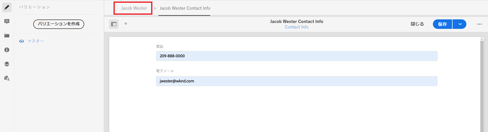

# コンテンツフラグメントの作成

[前の章](/help/headless-tutorial/graphql/advanced-graphql/create-content-fragment-models.md)では、5 つのコンテンツフラグメントモデル（Person、Team、Location、Address、Contact Info）を作成しました。この章では、これらのモデルに基づいてコンテンツフラグメントを作成する手順について説明します。また、フォルダーポリシーを作成して、フォルダーで使用できるコンテンツフラグメントモデルを制限する方法についても説明します。

## 前提条件 {#prerequisites}

このドキュメントは、複数のパートで構成されているチュートリアルの一部です。 この章に進む前に、[前の章](create-content-fragment-models.md)が終了していることを確認してください。

## 目的 {#objectives}

この章では、次の方法を学びます。

* フォルダーポリシーを使用したフォルダーの作成と制限の設定
* コンテンツフラグメントエディターからフラグメント参照を直接作成する
* タブ、日付、JSON オブジェクトのデータ型を使用する
* 複数行テキストエディターにコンテンツおよびフラグメント参照を挿入する
* 複数のフラグメント参照を追加
* コンテンツフラグメントをネスト

## サンプルコンテンツをインストール {#sample-content}

チュートリアルを高速化するために使用する、いくつかのフォルダーとサンプル画像を含む AEM パッケージをインストールします。

1. [Advanced-GraphQL-Tutorial-Starter-Package-1.1.zip](/help/headless-tutorial/graphql/advanced-graphql/assets/tutorial-files/Advanced-GraphQL-Tutorial-Starter-Package-1.1.zip) をダウンロード
1. AEMで、**ツール**／**デプロイメント**／**パッケージ**&#x200B;に移動し、**パッケージマネージャー**&#x200B;にアクセスします。
1. 前の手順でダウンロードしたパッケージ（zip ファイル）をアップロードしインストールします。

   

## フォルダーポリシーを使用したフォルダーの作成と制限の設定

AEM ホームページで、**アセット**／**ファイル**／**WKND 共有**／**英語**&#x200B;を選択します。ここでは、Adventures や Contributors など、様々なコンテンツフラグメントカテゴリを確認できます。

### フォルダーの作成 {#create-folders}

**Adventures** フォルダーに移動します。Team および Locations コンテンツフラグメントを格納する Teams フォルダーと Locations フォルダーが、既に作成されていることがわかります。

Person コンテンツフラグメントモデルに基づいて、Instructors コンテンツフラグメント用のフォルダーを作成します。

1. 「Adventures」ページで、右上の「**作成**／**フォルダー**」をクリックします。

   

1. 表示された「フォルダーを作成」モーダルで、「**タイトル**」フィールドに「Instructors」と入力します。英語の場合は「Instructors」とし、末尾の「s」に注意してください。多数のフラグメントを含むフォルダーのタイトルは複数形にする必要があります。「**作成**」を選択します。

   

   これで、Adventure Instructors を格納するフォルダーが作成されました。

### フォルダーポリシーを使用した制限の設定

AEM では、コンテンツフラグメントフォルダーの権限とポリシーを定義できます。権限を使用すると、特定のユーザー（作成者）または作成者のグループに対してのみ、特定のフォルダーへのアクセスを許可できます。フォルダーポリシーを使用すると、作成者がそれらのフォルダーで使用できるコンテンツフラグメントモデルを制限できます。この例では、フォルダーを「ユーザー」モデルと「連絡先情報」モデルに制限します。フォルダーポリシーを設定します。

1. 作成した **Instructors** フォルダーを選択し、上部ナビゲーションバーから&#x200B;**プロパティ**&#x200B;を選択します。

   

1. 「**ポリシー**」タブを選択し、**/content/dam/wknd-shared から継承**&#x200B;の選択を解除します。**許可されているコンテンツフラグメントモデル（パス別）**&#x200B;の項目で、フォルダーアイコンを選択します。

   

1. 開いた「パスの選択」ダイアログで、**conf**／**WKND 共有**&#x200B;のパスに従います。前の章で作成したユーザーコンテンツフラグメントモデルには、連絡先情報コンテンツフラグメントモデルへの参照が含まれています。Instructors コンテンツフラグメントを作成するには、Instructors フォルダーで Person モデルと Contact Info モデルの両方を許可する必要があります。「**Person**」と「**Contact Info**」を選択し、「**選択**」をクリックしてダイアログを閉じます。

   

1. 「**保存して閉じる**」を選択し、表示された成功ダイアログで「**OK**」を選択します。

1. これで、Instructors フォルダーのフォルダーポリシーが設定されました。**Instructors** フォルダーに移動して、**作成**／**コンテンツフラグメント**&#x200B;を選択します。ここで選択できるモデルは、**Person** および **Contact Info** のみです。

   

## インストラクター用コンテンツフラグメントの作成

**Instructors** フォルダーに移動します。ここから、インストラクターの連絡先情報を格納する、ネストされたフォルダーを作成します。

[フォルダーの作成](#create-folders)についてのセクションで説明されている手順に従って、「Contact Info」という名前のフォルダーを作成します。 ネストされたフォルダーは、親フォルダーのフォルダーポリシーを継承します。 より具体的なポリシー設定により、新しく作成したフォルダーで Contact Info モデルのみを使用が許可されるようにすることができます。

### インストラクターコンテンツフラグメントの作成

アドベンチャーインストラクターのチームに追加できる 4 人の人物を作成します。

1. Instructors フォルダーから、Person コンテンツフラグメントモデルに基づいてコンテンツフラグメントを作成し、「Jacob Wester」というタイトルを付けます。

   新しく作成されたコンテンツフラグメントは次のようになります。

   

1. 次の内容をフィールドに入力します。

   * **Full Name**：Jacob Wester
   * **Biography**：Jacob Wester は 10 年間ハイキングインストラクターを務め、自分の仕事をこよなく愛していました。Jacob はロッククライミングとバックパッキングの才能があり、いつも冒険を求めています。Jacob は「Battle of Bay」ボルダリング大会などのクライミング大会で優勝しています。Jacob は現在カリフォルニアに住んでいます。
   * **Instructor Experience Level**：Expert
   * **Skills**：Rock Climbing、Surfing、Backpacking
   * **Administrator Details**：Jacob Wester は、3 年間、バックパッキングの冒険を手配してきました。

1. 「**Profile Picture**」フィールドに、画像へのコンテンツ参照を追加します。 **WKND Shared**／**English**／**Contributors**／**jacob_wester.jpg** を参照して、画像のパスを作成します。

### コンテンツフラグメントエディターからのフラグメント参照の作成 {#fragment-reference-from-editor}

AEM では、コンテンツフラグメントエディターから直接フラグメント参照を作成できます。 Jacob の連絡先情報への参照を作成します。

1. 「**Contact Info**」フィールドの下で「**新しいコンテンツフラグメント**」を選択します。

   

1. 新しいコンテンツフラグメントモーダルが開きます。 「宛先を選択」タブで、パス **Adventures**／**Instructors** を参照し、**Contact Info** フォルダーの横にあるチェックボックスを選択します。「**次へ**」を選択して、「プロパティ」タブに進みます。

   

1. 「プロパティ」タブの「**タイトル**」フィールドに「Jacob Wester Contact Info」と入力します。「**作成**」を選択し、表示される成功ダイアログで「**開く**」を押します。

   

   新しいフィールドが表示され、Contact Info コンテンツフラグメントを編集できるようになります。

   

1. 次の内容をフィールドに入力します。

   * **Phone**：209-888-0000
   * **Email**：jwester@wknd.com

   完了したら、「**保存**」を選択します。これで、Contact Info コンテンツフラグメントが作成されました。

1. Instructor コンテンツフラグメントに戻るには、エディターの左上の隅で「**Jacob Wester**」をクリックします。

   

   この「**Contact Info**」フィールドに、参照される Contact Info フラグメントへのパスが含まれるようになりました。 これはネストされたフラグメント参照です。完成した Instructor コンテンツフラグメントは、次のようになります。

   

1. **「保存」と「閉じる」**&#x200B;を選択して、コンテンツフラグメントを保存します。これで、新しい Instructor コンテンツフラグメントが作成されました。

### 追加のフラグメントを作成する

[前のセクション](#fragment-reference-from-editor)で説明したのと同じプロセスに従って、これらのインストラクター用にさらに 3 つの Instructors コンテンツフラグメントと 3 つの Contact Info コンテンツフラグメントを作成します。以下のコンテンツを Instructors フラグメントに追加します。

**Stacey Roswells**

| フィールド | 値 |
| --- | --- |
| コンテンツフラグメントのタイトル | Stacey Roswells |
| フルネーム | Stacey Roswells |
| 連絡先情報 | /content/dam/wknd-shared/en/adventures/instructors/contact-info/stacey-roswells-contact-info |
| プロファイルの写真 | /content/dam/wknd-shared/en/contributors/stacey-roswells.jpg |
| 略歴 | Stacey Roswells は、ロッククライマー兼アルピニストです。 メリーランド州ボルチモア生まれの Stacey は 6 人兄弟の末っ子です。 Stacey の父親は米国海軍の中佐で、母親はモダンダンスのインストラクターでした。 Stacey の家族は父親の転勤に伴って頻繁に引っ越し、父親がタイに駐留していた時に最初の写真を撮りました。 Stacey はここでロッククライミングを学びました。 |
| 講師の経験レベル | 詳細 |
| スキル | ロッククライミング | スキー | バックパッキング |

**Kumar Selvaraj**

| フィールド | 値 |
| --- | --- |
| コンテンツフラグメントのタイトル | Kumar Selvaraj |
| フルネーム | Kumar Selvaraj |
| 連絡先情報 | /content/dam/wknd-shared/en/adventures/instructors/contact-info/kumar-selvaraj-contact-info |
| プロファイルの写真 | /content/dam/wknd-shared/en/contributors/kumar-selvaraj.jpg |
| 略歴 | Kumar Selvaraj は、経験豊富な AMGA 認定プロ講師で、学生の登山やハイキングのスキルを向上させることを主な目的としています。 |
| 講師の経験レベル | 詳細 |
| スキル | ロッククライミング | バックパッキング |

**Ayo Ogunseinde**

| フィールド | 値 |
| --- | --- |
| コンテンツフラグメントのタイトル | Ayo Ogunseinde |
| フルネーム | Ayo Ogunseinde |
| 連絡先情報 | /content/dam/wknd-shared/en/adventures/instructors/contact-info/ayo-ogunseinde-contact-info |
| プロファイルの写真 | /content/dam/wknd-shared/en/contributors/ayo-ogunseinde-237739.jpg |
| 略歴 | Ayo Ogunseinde は、中央カリフォルニア州フレズノに住むプロのクライマー兼バックパッキングインストラクターです。Ayo の目標は、ハイカーたちを最も壮大な国立公園の冒険に導くことです。 |
| 講師の経験レベル | 詳細 |
| スキル | ロッククライミング | サイクリング | バックパッキング |

「**追加情報**」フィールドは空のままにします。

連絡先情報フラグメントに次の情報を追加します。

| コンテンツフラグメントのタイトル | 電話 | メール |
| ------- | -------- | -------- |
| Stacey Roswells の連絡先情報 | 209-888-0011 | sroswells@wknd.com |
| Kumar Selvaraj の連絡先情報 | 209-888-0002 | kselvaraj@wknd.com |
| Ayo Ogunseinde の連絡先情報 | 209-888-0304 | aogunseinde@wknd.com |

これで、チームを作成する準備が整いました。

## Locations のコンテンツフラグメントの作成

**Locations** フォルダーに移動します。ここには、既に作成済みのネストされた 2 つのフォルダー（「Yosemite National Park」と「Yosemite Valley Lodge」）があります。


今のところ、Yosemite Valley Lodge フォルダーは無視してください。 このセクションの後半で、講師チームのホームベースとして機能する場所を作成する際に、このセクションに戻ります。

**Yosemite National Park** フォルダーに移動します。現在はヨセミテ国立公園の写真のみが含まれています。Location コンテンツフラグメントモデルを使用してコンテンツフラグメントを作成し、「Yosemite National Park」というタイトルを付けてみましょう。

### タブプレースホルダー

AEM では、タブプレースホルダーを使用して、様々な種類のコンテンツをグループ化し、コンテンツフラグメントを読みやすく管理しやすくすることができます。 前の章では、場所モデルにタブのプレースホルダーを追加しました。その結果、Location コンテンツフラグメントには、「**Location Details**」と「**Location Address**」の 2 つのタブセクションが追加されました。 


**場所の詳細**&#x200B;タブには、**名前**、**説明**、**連絡先情報**、**場所の画像**、**季節ごとの天候**&#x200B;フィールドが含まれており、**場所の住所**&#x200B;タブには Address コンテンツフラグメントへの参照が含まれています。タブを使用すると、入力する必要のあるコンテンツの種類が明確になるので、コンテンツの作成が管理しやすくなります。

### JSON オブジェクトのデータタイプ

「**季節別の天気**」フィールドは JSON オブジェクトのデータタイプです。つまり、JSON 形式のデータを受け入れます。 このデータタイプは柔軟で、コンテンツに含める任意のデータに使用できます。

前の章で作成したフィールドの説明を表示するには、フィールドの右側の情報アイコンにマウスポインターを合わせます。


この場合、場所の平均天気を指定する必要があります。 次のデータを入力します。

```json
{
    "summer": "81 / 89°F",
    "fall": "56 / 83°F",
    "winter": "46 / 51°F",
    "spring": "57 / 71°F"
}
```

「**季節別の天気**」フィールドは次のようになります。


### コンテンツを追加する

次の章では、GraphQL に情報をクエリするために、残りのコンテンツを Location コンテンツフラグメントに追加します。

1. 「**場所の詳細**」タブで、次の情報をフィールドに入力します。

   * **名前**：Yosemite National Park
   * **説明**：ヨセミテ国立公園はカリフォルニア州のシエラネバダ山脈にあります。 豪華な滝や巨大なセコイアの木、エルキャピタンとハーフドームの崖の象徴的な景色で有名です。ヨセミテを体験するには、ハイキングとキャンプが最適です。 多くの登山は、冒険や探検の無限の機会を提供します。

1. 「**Contact Info**」フィールドで、連絡先情報モデルに基づいてコンテンツフラグメントを作成し、「Yosemite National Park Contact Info」というタイトルを付けます。 [エディターからのフラグメント参照の作成](#fragment-reference-from-editor)に関する前のセクションで概説したのと同じプロセスに従い、次のデータをフィールドに入力します。

   * **電話**：209-999-0000
   * **メール**：yosemite@wknd.com

1. 「**Location Image**」フィールドから、**Adventures**／**Locations**／**Yosemite National Park**／**yosemite-national-park.jpeg** を参照して画像へのパスを作成します。

   前の章で画像の検証を設定したので、場所画像のサイズは 2560 x 1800 未満、ファイルサイズは 3 MB 未満にする必要があります。

1. すべての情報が追加された状態で、「**場所の詳細**」タブは次のように表示されます。

   

1. 「**場所の住所**」タブに移ります。「**Address**」フィールドから、前の章で作成したアドレスコンテンツフラグメントモデルを使用して、「Yosemite National Park Address」というタイトルのコンテンツフラグメントを作成します。[エディターからフラグメント参照を作成する](#fragment-reference-from-editor)のセクションで概説されているのと同じプロセスに従い、次のデータをフィールドに入力します。

   * **番地以下**：9010 Curry Village Drive
   * **市区町村**： Yosemite Valley
   * **州**：CA
   * **郵便番号**：95389
   * **国**：米国

1. 完了した「Yosemite National Park」フラグメントの「**場所の住所**」タブは、次のようになります。

   

1. 「**保存して閉じる**」を選択します。

### フラグメントをさらに 1 つ作成

1. **Yosemite Valley Lodge** フォルダーに移動します。 Location コンテンツフラグメントモデルを使用してコンテンツフラグメントを作成し、「Yosemite Valley Lodge」というタイトルを付けます。

1. 「**場所の詳細**」タブで、次の情報を入力します。

   * **名前**：Yosemite Valley Lodge
   * **説明**：ヨセミテバレーロッジは、グループミーティングや、ショッピング、食事、釣り、ハイキングなど、様々なアクティビティの拠点となる場所です。

1. 「**Contact Info**」フィールドで、連絡先情報モデルに基づいてコンテンツフラグメントを作成し、「Yosemite Valley Lodge Contact Info」というタイトルを付けます。「[エディターからフラグメント参照を作成する](#fragment-reference-from-editor)」と同じ手順で、新しいコンテンツフラグメントのフィールドに次のデータを入力します。

   * **電話**：209-992-0000
   * **メール**：yosemitelodge@wknd.com

   新しく作成したコンテンツフラグメントを保存します。

1. **Yosemite Valley Lodge** に戻り、「**Location Address**」タブをクリックします。「**Address**」フィールドで、前の章で作成したアドレスコンテンツフラグメントモデルを使用して、「Yosemite Valley Lodge Address」というタイトルのコンテンツフラグメントを作成します。「[エディターからのフラグメント参照の作成](#fragment-reference-from-editor)」のセクションで説明したのと同じ手順で、次のデータをフィールドに入力します。

   * **番地**：9006 Yosemite Lodge Drive
   * **市区町村**：Yosemite National Park
   * **州**：CA
   * **郵便番号**：95389
   * **国**：米国

   新しく作成したコンテンツフラグメントを保存します。

1. **Yosemite Valley Lodge** に戻り、「**保存して閉じる**」を選択します。この時点で、「**Yosemite Valley Lodge**」フォルダーには、3 つのコンテンツ フラグメント（Yosemite Valley Lodge、Yosemite Valley Lodge Contact Info、Yosemite Valley Lodge Address）が含まれています。

   

## Team コンテンツフラグメントの作成

**Teams**／**Yosemite Team** フォルダーを参照します。現在、Yosemite Team フォルダーにはチームロゴのみが含まれています。


Teams コンテンツフラグメントモデルを使用してコンテンツフラグメントを作成し、「Yosemite Team」というタイトルを付けてみましょう。

### 複数行テキストエディターでのコンテンツとフラグメントの参照

AEM では、コンテンツおよびフラグメント参照を複数行テキストエディターに直接追加し、GraphQL クエリを使用して後で取得することができます。コンテンツとフラグメントの参照を「**説明**」フィールドに入力します。

1. まず、「ヨセミテ国立公園で働くプロの冒険者やハイキングインストラクターのチーム」のテキストを「**説明**」フィールドに追加します。

1. コンテンツ参照を追加するには、 複数行のテキストエディターのツールバーで&#x200B;**アセットを挿入**&#x200B;のアイコンを選択します。

   

1. 表示されるモーダルで、「**team-yosemite-logo.png**」を選択し、「**選択**」を押します。

   

   コンテンツ参照が「**Description**」フィールドに追加されました。

前の章で、フラグメント参照を「**Description**」フィールドに入力できるようにしました。ここに 1 つ追加しましょう。

1. 複数行テキストエディターのツールバーから&#x200B;**コンテンツフラグメントを挿入**&#x200B;アイコンを選択します。

   

1. **WKND Shared**／**English**／**Adventures**／**Locations**／**Yosemite Valley Lodge**／**Yosemite Valley Lodge** を参照します。「**選択**」を押して、コンテンツフラグメントを挿入します。

   

   「**Description**」フィールドは次のようになります。

   

これで、コンテンツとフラグメント参照を複数行テキストエディターに直接追加しました。

### 日時データタイプ

日時データタイプを見てみましょう。「**Team Founding Date**」フィールドの右側にある&#x200B;**カレンダー**&#x200B;アイコンを選択して、カレンダーを表示します。


月の両側にある進む矢印と戻る矢印を使用して、過去または将来の日付を設定できます。例えば、Yosemite チームが 2016年5月24日に設立されたとして、その日付を設定します。

### 複数のフラグメント参照を追加

Team Members フラグメント参照にインストラクターを追加しましょう。

1. 「**Team Members**」フィールドで「**追加**」を選択します。

   

1. 表示される新しいフィールドで、フォルダーアイコンを選択して、「パスを選択」モーダルを開きます。**WKND Shared**／**English**／**Adventures**／**Instructors** の順にフォルダーを参照して、**jacob-wester** の横にあるチェックボックスを選択します。「**選択**」を押して、パスを保存します。

   

1. 「**追加**」ボタンをさらに 3 回選択します。新しいフィールドを使用して、残りの 3 人のインストラクターをチームに追加します。「**Team Members**」フィールドは次のようになります。

   

1. 「**保存して閉じる**」を選択して、Team コンテンツフラグメントを保存します。

### Adventure コンテンツフラグメントへのフラグメント参照の追加

最後に、新しく作成したコンテンツフラグメントを Adventure に追加します。

1. **Adventures**／**Yosemite Backpacking** に移動し、Yosemite Backpacking コンテンツフラグメントを開きます。フォームの下部に、前の章で作成した「**Location**」、「**Instructor Team**」、「**Administrator**」の 3 つのフィールドが表示されます。

1. フラグメント参照を「**Location**」フィールドに追加します。「Location」パスは、作成した Yosemite National Park コンテンツフラグメント（`/content/dam/wknd-shared/en/adventures/locations/yosemite-national-park/yosemite-national-park`）を参照しています。

1. フラグメント参照を「**Instructor Team**」フィールドに追加します。「Instructor Team」のパスは、作成した Yosemite Team コンテンツフラグメント（`/content/dam/wknd-shared/en/adventures/teams/yosemite-team/yosemite-team`）を参照しています。これはネストされたフラグメント参照です。Team コンテンツフラグメントには、Contact Info モデルと Address モデルを参照する Person モデルへの参照が含まれています。したがって、コンテンツフラグメントは 3 レベル下にネストされます。

1. フラグメント参照を「**Administrator**」フィールドに追加します。Jacob Wester が Yosemite Backpacking Adventure の管理者だとします。パスは最終的に Jacob Wester コンテンツフラグメントを参照し、`/content/dam/wknd-shared/en/adventures/instructors/jacob-wester` と表示されます。

1. これで、Adventure コンテンツフラグメントに 3 つのフラグメント参照を追加しました。フィールドは次のようになります。

   

1. 「**保存して閉じる**」を選択して、コンテンツを保存します。

## おめでとうございます。

おめでとうございます。以上で、前の章で作成した高度なコンテンツフラグメントモデルに基づいて、コンテンツフラグメントを作成しました。また、フォルダー内で選択できるコンテンツフラグメントモデルを制限するフォルダーポリシーも作成しました。

## 次の手順

[次の章](/help/headless-tutorial/graphql/advanced-graphql/explore-graphql-api.md)では、GraphiQL 統合開発環境（IDE）を使用して高度な GraphQL クエリを送信する方法について説明します。これらのクエリを使用すると、この章で作成したデータを表示し、最終的にこれらのクエリを WKND アプリに追加できます。
