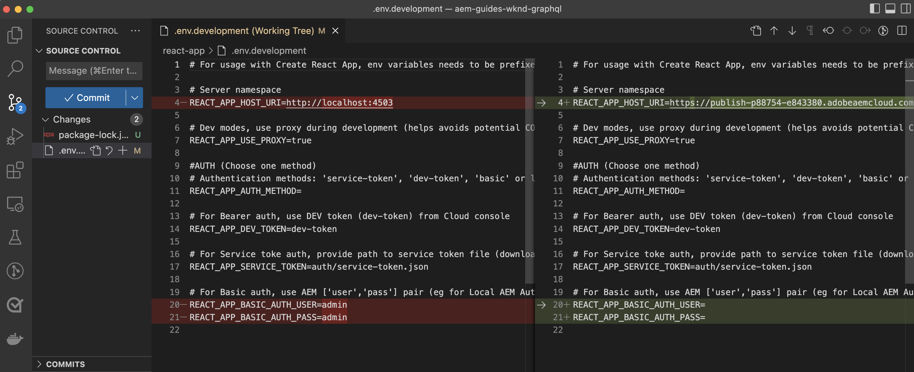

# クライアントアプリケーション統合

前の章では、GraphiQL エクスプローラーを使用して永続クエリを作成しおよび更新しました。

この章では、既存の **React コンポーネント**&#x200B;内部で HTTP GET リクエストを使用して、永続クエリを WKND クライアントアプリケーション（WKND アプリ）に統合する手順について説明します。また、AEM ヘッドレスの習得事項つまりコーディング専門知識を適用して、WKND クライアントアプリケーションを強化するオプション課題も提供します。

## 前提条件 {#prerequisites}

このドキュメントは、複数のパートで構成されているチュートリアルの一部です。 この章を進める前に、前の章が完了していることを確認してください。 WKND クライアントアプリケーションは AEM パブリッシュサービスに接続するので、**次のものを AEM パブリッシュサービスに公開してある**&#x200B;ことが重要です。

* プロジェクト設定
* GraphQL エンドポイント
* コンテンツフラグメントモデル
* 作成済みコンテンツフラグメント
* GraphQL 永続クエリ

_この章の IDE スクリーンショットは、[Visual Studio Code](https://code.visualstudio.com/) から取得したもの_&#x200B;です。

### 第 1～4 章：ソリューションパッケージ（オプション） {#solution-package}

第 1～4 章の AEM UI の手順を完了するソリューションパッケージをインストールできます。 前の章が完了している場合、このパッケージは **不要**&#x200B;です。

1. [Advanced-GraphQL-Tutorial-Solution-Package-1.2.zip](/help/headless-tutorial/graphql/advanced-graphql/assets/tutorial-files/Advanced-GraphQL-Tutorial-Solution-Package-1.2.zip) をダウンロード します。
1. AEM で、**ツール**／**デプロイメント**／**パッケージ**&#x200B;に移動して、 **パッケージマネージャー**&#x200B;にアクセスします。
1. 前の手順でダウンロードしたパッケージ（zip ファイル）をアップロードしインストールします。
1. パッケージを AEM パブリッシュサービスにレプリケートします。

## 目的 {#objectives}

このチュートリアルでは、[AEM Headless Client for JavaScript](https://github.com/adobe/aem-headless-client-js) を使用して永続クエリのリクエストをサンプルの WKND GraphQL React アプリに統合する方法を説明します。

## サンプルクライアントアプリケーションのクローン作成と実行 {#clone-client-app}

チュートリアルの進行を促進するために、スターター React JS アプリが提供されます。

1. [adobe/aem-guides-wknd-graphql](https://github.com/adobe/aem-guides-wknd-graphql) リポジトリのクローンを作成します。

   ```shell
   $ git clone git@github.com:adobe/aem-guides-wknd-graphql.git
   ```

1. `aem-guides-wknd-graphql/advanced-tutorial/.env.development` ファイルを編集し、`REACT_APP_HOST_URI` がターゲット AEM パブリッシュサービスを指すように設定します。

   オーサーインスタンスに接続する場合は、認証方法を更新します。

   ```plain
   # Server namespace
   REACT_APP_HOST_URI=https://publish-pxx-eyy.adobeaemcloud.com
   
   #AUTH (Choose one method)
   # Authentication methods: 'service-token', 'dev-token', 'basic' or leave blank to use no authentication
   REACT_APP_AUTH_METHOD=
   
   # For Bearer auth, use DEV token (dev-token) from Cloud console
   REACT_APP_DEV_TOKEN=
   
   # For Service toke auth, provide path to service token file (download file from Cloud console)
   REACT_APP_SERVICE_TOKEN=auth/service-token.json
   
   # For Basic auth, use AEM ['user','pass'] pair (eg for Local AEM Author instance)
   REACT_APP_BASIC_AUTH_USER=
   REACT_APP_BASIC_AUTH_PASS=
   ```

   


   >[!NOTE]
   > 
   > 上記の手順は、React アプリを **AEM パブリッシュサービス**&#x200B;に接続します。ただし、**AEM オーサーサービス**&#x200B;に接続するには、ターゲット AEM as a Cloud Service 環境のローカル開発トークンを取得します。
   >
   > 基本認証を使用して、アプリを [AEMaaCS SDK を使用したローカルオーサーインスタンス](/help/headless-tutorial/graphql/quick-setup/local-sdk.md)に接続することもできます。


1. ターミナルを開き、次のコマンドを実行します。

   ```shell
   $ cd aem-guides-wknd-graphql/advanced-tutorial
   $ npm install
   $ npm start
   ```

1. 新しいブラウザーウィンドウで [http://localhost:3000](http://localhost:3000) が読み込まれます。


1. **Camping**／**Yosemite Backpacking** をタップ して、Yosemite Backpacking アドベンチャーの詳細を確認します。

   

1. ブラウザーの開発者ツールを開き、`XHR` リクエストを調べます

   

   GraphQL エンドポイントへの `GET` リクエスト（プロジェクト設定名：`wknd-shared`、永続クエリ名：`adventure-by-slug`、変数名：`slug`、値：`yosemite-backpacking` および特殊文字エンコーディング）が表示されます。

>[!IMPORTANT]
>
>    GraphQL API リクエストが AEM パブリッシュサービスドメインに対してではなく `http://localhost:3000` に対して行われた理由については、基本チュートリアルで[内部の処理](../multi-step/graphql-and-react-app.md#under-the-hood)を確認してください。


## コードのレビュー

[基本チュートリアル - AEM GraphQL API を使用した React アプリの作成](https://experienceleague.adobe.com/docs/experience-manager-learn/getting-started-with-aem-headless/graphql/multi-step/graphql-and-react-app.html#review-the-aemheadless-object?lang=ja)ステップでは、主要なファイルをいくつか確認し拡張して実践的な専門知識を獲得しました。WKND アプリを強化する前に、主要なファイルを確認します。

* [AEMHeadless オブジェクトを確認する](https://experienceleague.adobe.com/docs/experience-manager-learn/getting-started-with-aem-headless/graphql/multi-step/graphql-and-react-app.html#review-the-aemheadless-object?lang=ja)

* [AEM GraphQL 永続クエリを実装して実行する](https://experienceleague.adobe.com/docs/experience-manager-learn/getting-started-with-aem-headless/graphql/multi-step/graphql-and-react-app.html#implement-to-run-aem-graphql-persisted-queries?lang=ja)

### `Adventures` React コンポーネントのレビュー

WKND React アプリのメインビューは、すべての Adventure のリストです。これらの Adventure は、_Camping や Cycling_ のようなアクティビティタイプに基づいてフィルタリングできます。このビューは、`Adventures` コンポーネントによってレンダリングされます。主な実装の詳細を以下に示します。

* `src/components/Adventures.js` は `useAllAdventures(adventureActivity)` フックを呼び出します。ここでは `adventureActivity` 引数がアクティビティタイプです。

* `useAllAdventures(adventureActivity)` フックは、`src/api/usePersistedQueries.js` ファイルで定義されます。`adventureActivity` 値に基づいて、呼び出す永続クエリを決定します。null 値でない場合は `wknd-shared/adventures-by-activity` を呼び出し、それ以外の場合は使用可能なすべてのadventure `wknd-shared/adventures-all` を取得します。

* フックは、クエリの実行を `aemHeadlessClient.js` 経由で `AEMHeadless` にデリゲートするメインの `fetchPersistedQuery(..)` 関数を使用します。

* また、フックは AEM GraphQL レスポンスから `response.data?.adventureList?.items` にある関連データのみを返すので、`Adventures` React の表示コンポーネントを親の JSON 構造に依存せずに済みます。

* クエリが正常に実行されると、`Adventures.js` の `AdventureListItem(..)` レンダリング関数が HTML 要素を追加して、_画像、トリップの長さ、価格およびタイトル_&#x200B;情報を表示します。

### `AdventureDetail` React コンポーネントのレビュー

`AdventureDetail` React コンポーネントは、adventure の詳細をレンダリングします。主な実装の詳細を以下に示します。

* `src/components/AdventureDetail.js` は `useAdventureBySlug(slug)` フックを呼び出します。ここでは `slug` 引数がクエリパラメーターです。

* 上記のように、`useAdventureBySlug(slug)` フックは、`src/api/usePersistedQueries.js` ファイルで定義されます。`aemHeadlessClient.js` 経由で `AEMHeadless` にデリゲートして、`wknd-shared/adventure-by-slug` 永続クエリを呼び出します。

* クエリが正常に実行されると、`AdventureDetail.js` の `AdventureDetailRender(..)` レンダリング関数が HTML 要素を追加して、adventure の詳細を表示します。


## コードの機能強化

### `adventure-details-by-slug` 永続クエリの使用

前の章では、`adventure-details-by-slug` 永続クエリを作成しました。これは、_場所、instructorTeam および管理者_&#x200B;などの追加のアドベンチャー情報を提供します。`adventure-by-slug` を `adventure-details-by-slug` 永続クエリに置換して、この追加情報をレンダリングしましょう。

1. `src/api/usePersistedQueries.js` を開きます。

1. 関数 `useAdventureBySlug()` を見つけて、クエリを次のように更新します

```javascript
 ...

 // Call the AEM GraphQL persisted query named "wknd-shared/adventure-details-by-slug" with parameters
 response = await fetchPersistedQuery(
 "wknd-shared/adventure-details-by-slug",
 queryParameters
 );

 ...
```

### 追加情報の表示

1. 追加のアドベンチャー情報を表示するには、`src/components/AdventureDetail.js` を開きます

1. 関数 `AdventureDetailRender(..)` を見つけて、戻り関数を次のように更新します

   ```javascript
   ...
   
   return (<>
       <h1 className="adventure-detail-title">{title}</h1>
       <div className="adventure-detail-info">
   
           <LocationInfo {...location} />
   
           ...
   
           <Location {...location} />
   
           <Administrator {...administrator} />
   
           <InstructorTeam {...instructorTeam} />
   
       </div>
   </>); 
   
   ...
   ```

1. 対応するレンダリング関数も定義します。

   **LocationInfo**

   ```javascript
   function LocationInfo({name}) {
   
       if (!name) {
           return null;
       }
   
       return (
           <>
               <div className="adventure-detail-info-label">Location</div>
               <div className="adventure-detail-info-description">{name}</div>
           </>
       );
   
   }
   ```

   **場所**

   ```javascript
   function Location({ contactInfo }) {
   
       if (!contactInfo) {
           return null;
       }
   
       return (
           <>
               <div className='adventure-detail-location'>
                   <h2>Where we meet</h2>
                   <hr />
                   <div className="adventure-detail-addtional-info">Phone:{contactInfo.phone}</div>
                   <div className="adventure-detail-addtional-info">Email:{contactInfo.email}</div>
               </div>
           </>);
   }
   ```

   **InstructorTeam**

   ```javascript
   function InstructorTeam({ _metadata }) {
   
       if (!_metadata) {
           return null;
       }
   
       return (
           <>
               <div className='adventure-detail-team'>
                   <h2>Instruction Team</h2>
                   <hr />
                   <div className="adventure-detail-addtional-info">Team Name: {_metadata.stringMetadata[0].value}</div>
               </div>
           </>);
   }
   ```

   **管理者**

   ```javascript
   function Administrator({ fullName, contactInfo }) {
   
       if (!fullName || !contactInfo) {
           return null;
       }
   
       return (
           <>
               <div className='adventure-detail-administrator'>
                   <h2>Administrator</h2>
                   <hr />
                   <div className="adventure-detail-addtional-info">Name: {fullName}</div>
                   <div className="adventure-detail-addtional-info">Phone: {contactInfo.phone}</div>
                   <div className="adventure-detail-addtional-info">Email: {contactInfo.email}</div>
               </div>
           </>);
   }
   ```

### 新しいスタイルの定義

1. `src/components/AdventureDetail.scss` を開き、次のクラス定義を追加します

   ```CSS
   .adventure-detail-administrator,
   .adventure-detail-team,
   .adventure-detail-location {
   margin-top: 1em;
   width: 100%;
   float: right;
   }
   
   .adventure-detail-addtional-info {
   padding: 10px 0px 5px 0px;
   text-transform: uppercase;
   }
   ```

>[!TIP]
>
>更新されたファイルは、**AEM Guides WKND - GraphQL** プロジェクトで入手できます。[詳細なチュートリアル](https://github.com/adobe/aem-guides-wknd-graphql/tree/main/advanced-tutorial)の節を参照してください。


上記の機能強化を完了すると、WKND アプリは以下のようになり、ブラウザーのデベロッパーツールは `adventure-details-by-slug` 永続クエリ呼び出しを示します。


## 機能強化の課題（オプション）

WKND React アプリのメインビューでは、_Camping や Cycling_ などのアクティビティタイプに基づいて、これらの Adventure をフィルタリングできます。ただし、WKND ビジネスチームは、_場所_&#x200B;ベースのフィルタリング機能を追加したいと考えています。使用するための要件は以下のとおりです。

* WKND アプリのメインビューで、左上隅または右上隅に「_場所_」フィルタリングアイコンを追加します。
* 「_場所_」フィルタリングアイコンをクリックすると、場所のリストが表示されます。
* リストから目的の場所のオプションをクリックすると、一致する Adventure のみが表示されます。
* 一致するアドベンチャーが 1 つしかない場合は、Adventure Detail ビューが表示されます。

## これで完了です

おめでとうございます。これで、永続クエリのサンプル WKND アプリへの統合と実装が完了しました。
