# コンテンツフラグメントモデルを作成する {#create-content-fragment-models}

この章では、5 つのコンテンツフラグメントモデルを作成する手順について説明します。

* **Contact Info**
* **住所**
* **ユーザー**
* **場所**
* **チーム**

コンテンツフラグメントモデルを使用すると、コンテンツタイプ間の関係を定義し、スキーマなどの関係を保持できます。ネストされたフラグメント参照、様々なコンテンツデータタイプ、ビジュアルコンテンツ編成用のタブタイプを使用します。タブプレースホルダー、フラグメント参照、JSON オブジェクト、日時データ型など、より高度なデータ型。

この章では、画像などのコンテンツ参照の検証ルールを拡張する方法についても説明します。

## 前提条件 {#prerequisites}

これは、高度なチュートリアルです。この章を進める前に、[クイックセットアップ](../quick-setup/cloud-service.md)を完了したことを確認してください。上級者向けチュートリアルのセットアップの詳細については、前の[概要](../overview.md)の章を参照してください。

## 目的 {#objectives}

* コンテンツフラグメントモデルを作成します。
* タブのプレースホルダー、日時、JSON オブジェクト、フラグメント参照およびコンテンツ参照をモデルに追加します。
* コンテンツ参照に検証を追加します。

## コンテンツフラグメントモデルの概要 {#content-fragment-model-overview}

次のビデオでは、コンテンツフラグメントモデルと、このチュートリアルでの使用方法について概要を説明します。

>[!VIDEO](https://video.tv.adobe.com/v/3449520?quality=12&learn=on&captions=jpn)

## コンテンツフラグメントモデルを作成する {#create-models}

WKND アプリ用のコンテンツフラグメントモデルをいくつか作成します。コンテンツフラグメントモデルを作成するための基本的な概要が必要な場合は、[基本のチュートリアル](../multi-step/content-fragment-models.md)の該当する章を参照してください。

1. **ツール**／**一般l**／**コンテンツフラグメントモデル**&#x200B;に移動します。

   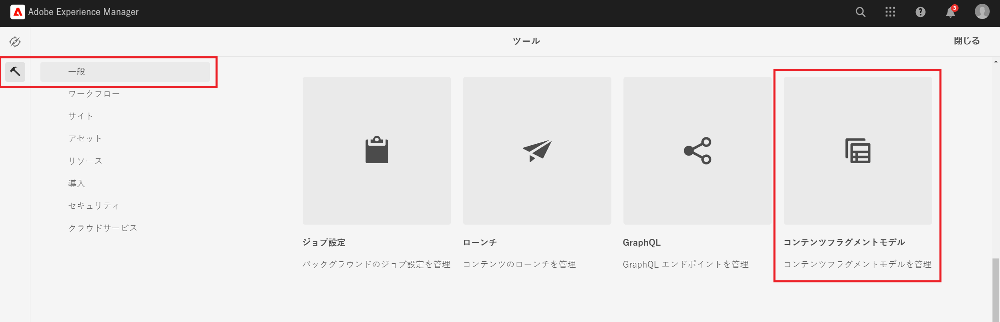

1. **WKND 共有**&#x200B;を選択して、サイトの既存のコンテンツフラグメントモデルのリストを表示します。

### 連絡先情報モデル {#contact-info-model}

次に、個人または場所の連絡先情報を含むモデルを作成します。

1. 右上の「**作成**」を選択します。

1. モデルのタイトルを「連絡先」にし、「**作成**」を選択します。成功モーダルが表示されたら、「**開く**」を選択して、新しく作成したモデルを編集します。

1. 最初に「**1 行のテキスト**」フィールドをモデル上に配置します。「**プロパティ**」タブで&#x200B;**フィールドラベル**&#x200B;に「電話」を指定します。プロパティ名は `phone` と自動的に入力されます。チェックボックスを選択すると、「**必須**」フィールドになります。

1. 「**データタイプ**」タブを開き、「**1 行のテキスト**」フィールドを「電話」フィールドの下にもうひとつ追加します。**フィールドラベル**&#x200B;に「メール」を指定し、**必須**&#x200B;に設定します。

Adobe Experience Managerには、いくつかの組み込みの検証方法が用意されています。これらの検証方法を使用すると、コンテンツフラグメントモデル内の特定のフィールドにガバナンスルールを追加できます。この場合、ユーザーがこのフィールドに入力する際に有効なメールアドレスのみを入力できるようにする検証ルールを追加します。**検証タイプ**&#x200B;のドロップダウンで、**メール**&#x200B;を選択します。

完成したコンテンツフラグメントモデルは次のようになります。

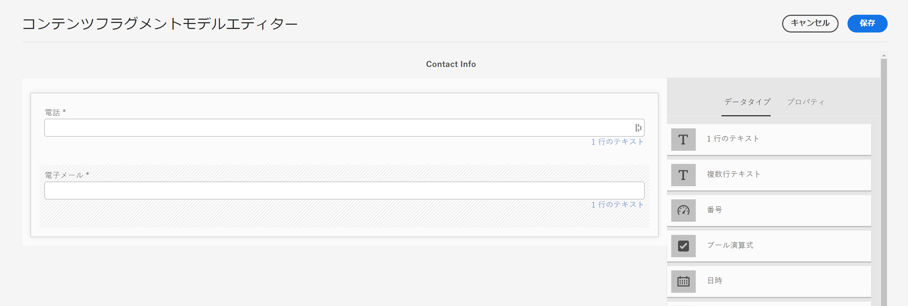

完了したら、「**保存**」を選択して変更を確認し、コンテンツフラグメントモデルエディターを閉じます。

### 住所モデル {#address-model}

次に、住所モデルを作成します。

1. **WKND 共有**&#x200B;で、右上隅の「**作成**」を選択します。

1. 「Address」のタイトルを入力し、「**作成**」を選択します。表示された成功モーダルで、「**開く**」を選択して、新しく作成したモデルを編集します。

1. 「**1 行のテキスト**」フィールドをモデルにドラッグ＆ドロップし、「Street Address」という&#x200B;**フィールドラベル**&#x200B;を付けます。プロパティ名には「`streetAddress`」と入力します。「**必須**」チェックボックスをオンにします。

1. 上記の手順を繰り返し、さらに 4 つの「1 行のテキスト」フィールドをモデルに追加します。以下のラベルを使用します。

   * City
   * State
   * ZIP Code
   * Country

1. 「**保存**」を選択して、Address モデルに変更内容を保存します。

   完成した「Address」フラグメントモデルは次のようになります。
   

### Person モデル {#person-model}

次に、人物に関する情報を含んだモデルを作成します。

1. 右上隅の「**作成**」を選択します。

1. モデルに「Person」というタイトルを付け、「**作成**」を選択します。表示される成功モーダルで、「**開く**」を選択して、新しく作成したモデルを編集します。

1. まず、「**1 行のテキスト**」フィールドをモデル上にドラッグします。「Full Name」という&#x200B;**フィールドラベル**&#x200B;を付けます。プロパティ名には自動的に `fullName` が入力されます。チェックボックスを選択して、フィールドを&#x200B;**必須**&#x200B;にします。

   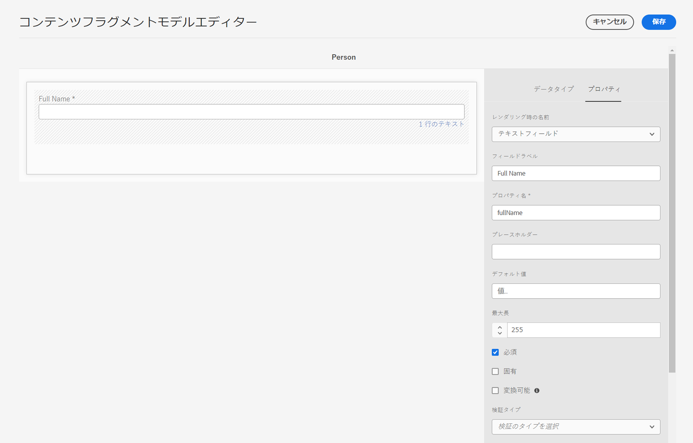

1. コンテンツフラグメントモデルは、他のモデルで参照できます。「**データタイプ**」タブに移動し、**フラグメント参照**&#x200B;フィールドをドラッグ＆ドロップして、「Contact Info」というラベルを付けます。

1. 「**プロパティ**」タブの「**許可されているコンテンツフラグメントモデル**」フィールドで、フォルダーアイコンを選択したあと、先ほど作成した&#x200B;**連絡先情報**&#x200B;フラグメントモデルを選択します。

1. 「**コンテンツ参照**」フィールドを追加し、「Profile Picture」という&#x200B;**フィールドラベル**&#x200B;を付けます。「**ルートパス**」の下のフォルダーアイコンを選択して、パス選択モーダルを開きます。**コンテンツ**／**アセット**&#x200B;を選択し、「**WKND 共有**」のチェックボックスをオンにすることで、ルートパスを選択します。右上の「**選択**」ボタンを使用して、パスを保存します。最終的なテキストパスは `/content/dam/wknd-shared` となります。

   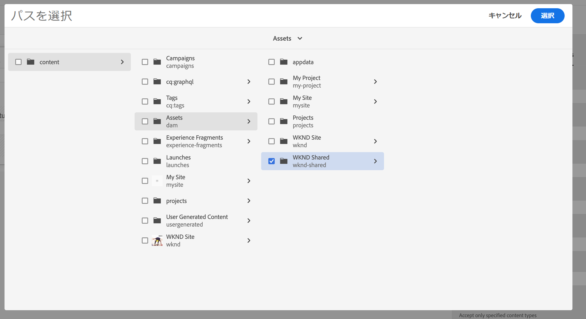

1. 「**指定したコンテンツタイプのみを許可**」の下で「画像」を選択します。

   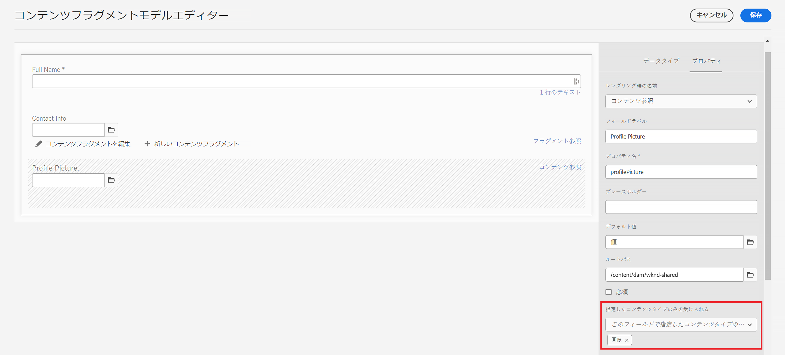

1. 画像ファイルのサイズと寸法を制限するには、コンテンツ参照フィールドの検証オプションに注目します。

   「**指定したファイルサイズのみを許可**」の下で、「次よりも小さいか等しい」を選択すると、追加のフィールドが下に表示されます。
   

1. 「**最大**」には「5」と入力し、「**単位を選択**」では「メガバイト (MB)」を選択します。この検証では、指定したサイズの画像のみを選択できます。

1. 「**指定した画像の幅のみを許可**」の下で「最大幅」を選択します。表示される「**最大 (ピクセル)**」フィールドに「10000」と入力します。「**指定した画像の高さのみを許可**」で同じオプションを選択します。

   これらの検証機能により、追加された画像が指定された値を超えないことが保証されます。検証ルールは次のようになります。

   

1. 「**複数行テキスト**」フィールドを追加し、「Biography」という&#x200B;**フィールドラベル**&#x200B;を付けます。「**デフォルトタイプ**」ドロップダウンをデフォルトの「リッチテキスト」オプションのままにします。

   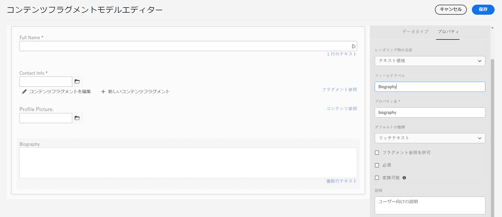

1. 「**データタイプ**」タブに移動し、「伝記」の下の「**列挙**」フィールドをドラッグします。デフォルトの「**レンダリング形式**」オプションの代わりに、「**ドロップダウン**」を選択して、「講師のエクスペリエンスレベル」という&#x200B;**フィールドラベル**&#x200B;を付けます。インストラクターのエクスペリエンスレベルのオプション（_エキスパート、アドバンス、中級_&#x200B;など）を入力します。 

1. 次に、「講師のエクスペリエンスレベル」の下に別の&#x200B;**列挙**&#x200B;フィールドをドラッグし、「**レンダリング形式**」オプションの下のチェックボックスを選択します。「スキル」という&#x200B;**フィールドラベル**&#x200B;を付けます。ロッククライミング、サーフィン、サイクリング、スキー、バックパッキンなど、さまざまなスキルを入力します。 オプションのラベルとオプションの値は、次のように一致する必要があります。

   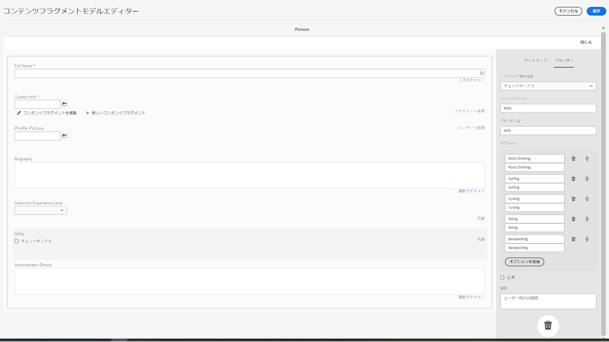

1. 最後に、「**複数行のテキスト**」フィールドを使用して、「管理者詳細」フィールドラベルを作成します。

「**保存**」を選択して変更を確定して、コンテンツフラグメントモデルエディターを閉じます。

### 場所モデル {#location-model}

次のコンテンツフラグメントモデルは、物理的な場所を示します。 このモデルでは、タブのプレースホルダーを使用します。 タブプレースホルダーは、モデルエディター内のデータタイプとフラグメントエディター内のコンテンツを、それぞれコンテンツを分類して整理するのに役立ちます。 各プレースホルダーは、インターネットブラウザーのタブと同様に、コンテンツフラグメントエディターにタブを作成します。 場所モデルには、「場所の詳細」と「場所の住所」の 2 つのタブが必要です。

1. 以前と同様に、「**作成**」をクリックして、別のコンテンツフラグメントモデルを作成します。モデルのタイトルには、「Location」と入力します。表示される成功モーダルで、「**作成**」に続いて「**開く**」を選択します。

1. モデルに「**タブプレースホルダー**」フィールドを追加し、「場所の詳細」というラベルを付けます。

1. **1 行のテキスト**&#x200B;をドラッグ＆ドロップし、「名前」というラベルを付けます。このフィールドラベルの下に、**複数行テキスト**&#x200B;フィールドを追加し、「説明」というラベルを付けます。

1. 次に、「**フラグメント参照**」フィールドに入力し、「連絡先情報」というラベルを付けます。「プロパティ」タブの「**許可されたコンテンツフラグメントモデル**」で、**フォルダーアイコン**&#x200B;を選択し、先ほど作成した「Contact Info」フラグメントモデルを選択します。

1. 「連絡先情報」の下に「**コンテンツ参照**」フィールドを追加します。ラベルを「場所の画像」にします。**ルートパス**&#x200B;は `/content/dam/wknd-shared.` **指定したコンテンツタイプのみを受け入れる**&#x200B;の下で、「画像」を選択します。

1. さらに、「**JSON オブジェクト**」フィールドを「場所の画像」の下に追加してみましょう。このデータタイプは柔軟なので、コンテンツに含める任意のデータの表示に使用できます。この場合、JSON オブジェクトを使用して天気に関する情報が表示されます。JSON オブジェクトに「Weather by Season」というラベルを付けます。「**プロパティ**」タブに、**説明**&#x200B;を追加し、ここにどのようなデータを入力すべきかユーザーが明確にわかるようにします。例：「季節別（春、夏、秋、冬）のイベントの場所の天気に関する JSON データ」

   

1. 「場所の住所」タブを作成するには、「**タブプレースホルダー**」フィールドをモデルに追加し、「場所の住所」というラベルを付けます。

1. 「**フラグメント参照**」フィールドをドラッグ＆ドロップし、「プロパティ」タブで「Address」というラベルを付け、「**許可されているコンテンツフラグメントモデル**」で&#x200B;**住所**&#x200B;モデルを選択します。

1. 「**保存**」を選択して変更を確定し、コンテンツフラグメントモデルエディターを閉じます。完成した場所モデルは、次のように表示されます。

   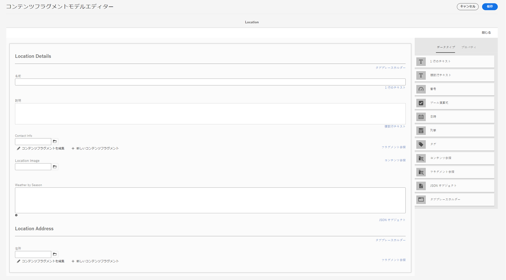

### チームモデル {#team-model}

最後に、人物のチームを表すモデルを作成します。

1. **WKND 共有**&#x200B;ページで、「**作成**」を選択して、別のコンテンツフラグメントモデルを作成します。モデルのタイトルに、「チーム」と入力します。前回と同様に、表示される成功モーダルで、「**作成**」に続いて「**開く**」を選択します。

1. フォームに&#x200B;**複数行テキスト**&#x200B;フィールドを追加します。**フィールドラベル**&#x200B;の下で、「説明」と入力します。

1. モデルに「**日時**」フィールドを追加し、「Team Founding Date」というラベルを付けます。この場合、デフォルトの&#x200B;**タイプ**&#x200B;は「日付」のままですが、「日付と時刻」または「時刻」を使用することもできます。

   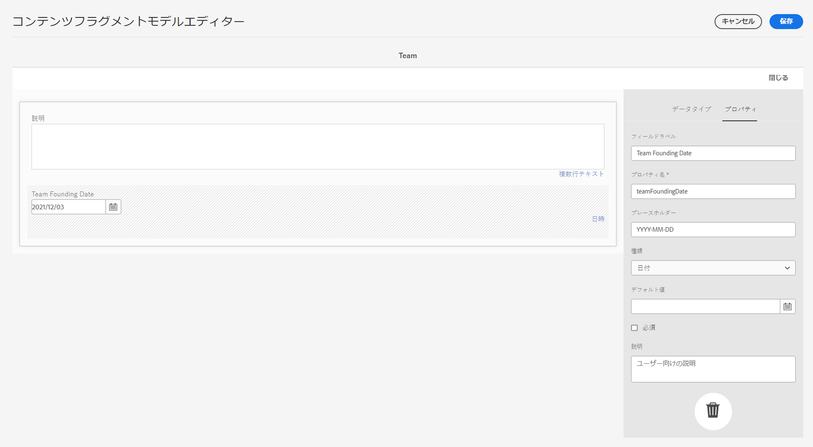

1. 「**データタイプ**」タブに移動します。「チーム設立日」の下に、**フラグメント参照**&#x200B;を追加します。**レンダリング形式**&#x200B;のドロップダウンで、「multifield」を選択します。「**フィールドラベル**」に「Team Members」と入力します。このフィールドは、前に作成した _Person_ モデルにリンクしています。データタイプは複数フィールドなので、複数の人物フラグメントを追加して、ユーザーのチームを作成できます。

   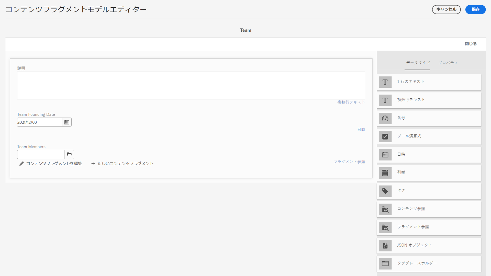

1. **許可されているコンテンツフラグメントモデル**&#x200B;で、フォルダーアイコンを使用してパスを選択モーダルを開き、**Person** モデルを選択します。「**選択**」ボタンを使用して、パスを保存します。

   

1. 「**保存**」を選択して変更を確定し、コンテンツフラグメントモデルエディターを閉じます。

## Adventure モデルへのフラグメント参照の追加 {#fragment-references}

Team モデルに Person モデルへのフラグメント参照が含まれるのと同様に、WKND アプリにこれらの新しいモデルを表示するには、Team モデルと Location モデルを Adventure モデルから参照する必要があります。

1. **WKND 共有**&#x200B;ページで、**Adventure** モデルを選択したあと、上部ナビゲーションから「**編集**」を選択します。

   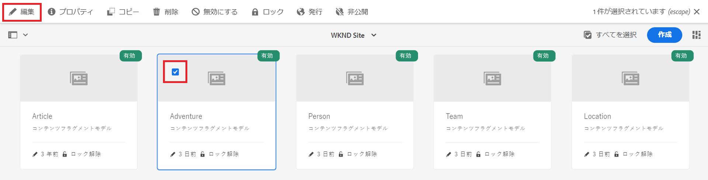

1. フォームの下部で、「What to Bring」の直下に&#x200B;**フラグメント参照**&#x200B;フィールドを追加します。「**フィールドラベル**」に「Location」と入力します。「**許可されているコンテンツフラグメントモデル**」で、**Location** モデルを選択します。

   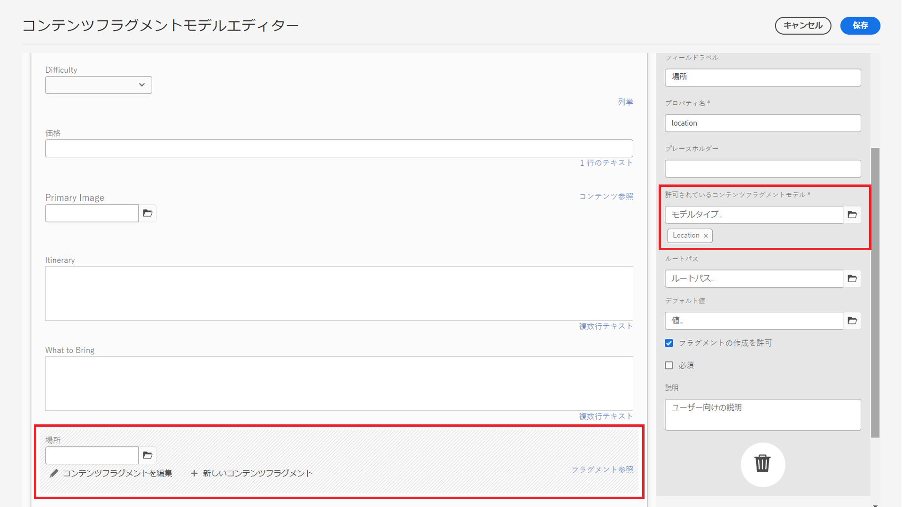

1. **フラグメント参照**&#x200B;フィールドをもう 1 つ追加し、「Instructor Team」というラベルを付けます。「**許可されているコンテンツフラグメントモデル**」で、**Team** モデルを選択します。

   

1. 別の&#x200B;**フラグメント参照**&#x200B;フィールドを追加し、「Administrator」というラベルを付けます。

   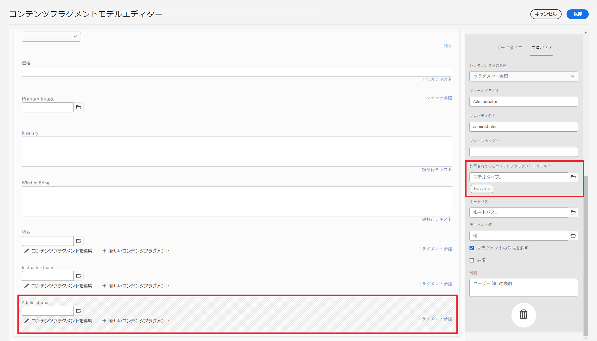

1. 「**保存**」を選択して変更を確定し、コンテンツフラグメントモデルエディターを閉じます。

## ベストプラクティス {#best-practices}

コンテンツフラグメントモデルの作成に関するベストプラクティスがいくつかあります。

* UX コンポーネントにマッピングされるモデルを作成します。例えば、WKND アプリには、アドベンチャー、記事および場所を表すコンテンツフラグメントモデルがあります。また、ヘッダー、プロモーションまたは免責事項を追加することもできます。これらの例はそれぞれ特定の UX コンポーネントを構成しています。

* 作成するモデルはできるだけ少なくします。モデルの数を制限すると、再利用性を最大限に高め、コンテンツ管理を簡素化できます。

* 必要に応じて、コンテンツフラグメントモデルを必要な深さまでネストします。ネストは、フラグメント参照またはコンテンツ参照を使用して実現できます。最大 5 レベルのネストを検討します。

## おめでとうございます。 {#congratulations}

おめでとうございます。これで、タブを追加し、日時と JSON オブジェクトのデータタイプを使用し、フラグメント参照とコンテンツ参照の詳細を学びました。また、コンテンツ参照の検証ルールも追加しました。

## 次の手順 {#next-steps}

このシリーズの次の章では、この章で作成したモデルからの[コンテンツフラグメントのオーサリング](/help/headless-tutorial/graphql/advanced-graphql/author-content-fragments.md)について説明します。この章で紹介したデータタイプを使用し、フォルダーポリシーを作成して、アセットフォルダーで作成できるコンテンツフラグメントモデルを制限する方法について説明します。

このチュートリアルでは任意ですが、実際の実稼動状況では必ずすべてのコンテンツを公開してください。AEM のオーサー環境とパブリッシュ環境については、
[AEM ヘッドレスと GraphQL ビデオシリーズ](/help/headless-tutorial/graphql/video-series/author-publish-architecture.md)を参照してください。
