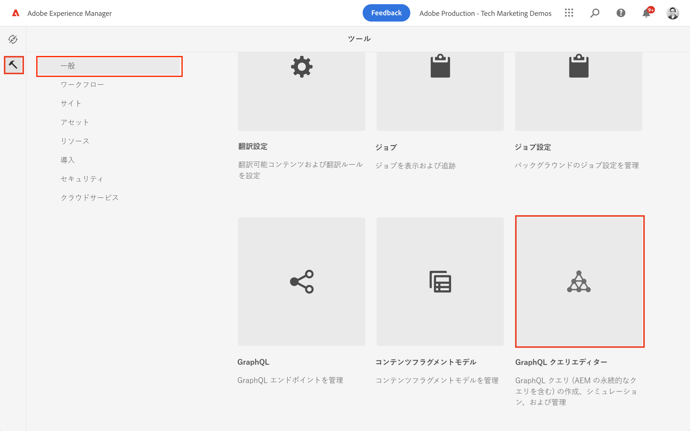
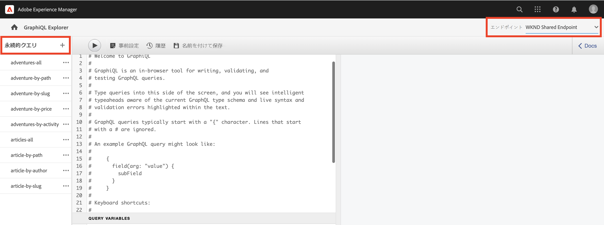
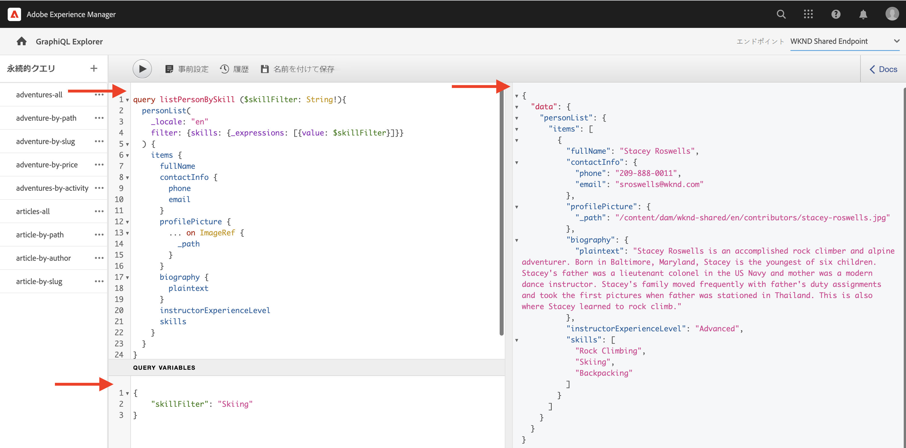

# AEM GraphQL API の調査

AEM の GraphQL API を使用すると、コンテンツフラグメントデータをダウンストリームアプリケーションに公開できます。基本チュートリアルの[マルチステップ GraphQL チュートリアル](../multi-step/explore-graphql-api.md)では、GraphiQL Explorer を使用して GraphQL クエリをテストし改良しました。

この章では、GraphiQL Explorer を使用して、[前の章](../advanced-graphql/author-content-fragments.md)で作成したコンテンツフラグメントのデータを収集するためのより高度なクエリを定義します。

## 前提条件 {#prerequisites}

このドキュメントは、複数のパートで構成されているチュートリアルの一部です。 この章を進める前に、前の章が完了していることを確認してください。

## 目的 {#objectives}

この章では、以下の操作を行う方法を学びます。

* クエリ変数を使用してコンテンツフラグメントのリストを参照でフィルタリングする
* フラグメント参照内のコンテンツでフィルタリングする
* 複数行テキストフィールド内のインラインコンテンツ参照やフラグメント参照をクエリする
* ディレクティブを使用してクエリする
* JSON オブジェクトコンテンツタイプをクエリする

## GraphiQL Explorer の使用


[GraphiQL エクスプローラー](https://experienceleague.adobe.com/docs/experience-manager-cloud-service/content/headless/graphql-api/graphiql-ide.html?lang=ja)ツールを使用すると、開発者は、現在の AEM 環境のコンテンツに対するクエリを作成およびテストできます。GraphiQL ツールを使用すると、実稼働設定においてクライアントアプリケーションで使用されるクエリを&#x200B;**永続化つまり保存**&#x200B;することができます。

次に、ビルトイン GraphiQL エクスプローラーを使用して AEM の GraphQL API の機能を探索します。

1. AEM 開始画面で、**ツール**／**一般**／**GraphQL クエリエディター**&#x200B;に移動します。

   

>[!IMPORTANT]
>
>AEM（6.X.X）の一部のバージョンでは、GraphiQL Explorer（GraphiQL IDE）ツールを手動でインストールする必要があります。[こちらの指示](../how-to/install-graphiql-aem-6-5.md)に従ってください。

1. 右上隅で、「エンドポイント」が「**WKND 共有エンドポイント**」に設定されていることを確認します。ここで&#x200B;_エンドポイント_&#x200B;ドロップダウンの値を変更すると、左上隅に既存の&#x200B;_永続クエリ_&#x200B;が表示されます。

   

これにより、すべてのクエリの範囲が、**WKND 共有**&#x200B;プロジェクトで作成されたモデルに設定されます。


## クエリ変数を使用したコンテンツフラグメントリストのフィルタリング

前の[マルチステップ GraphQL チュートリアル](../multi-step/explore-graphql-api.md)では、基本的な永続クエリを定義および使用してコンテンツフラグメントデータを取得しました。ここでは、この知識を拡張し、永続クエリに変数を渡してコンテンツフラグメントデータをフィルタリングします。

クライアントアプリケーションを開発する場合は、通常、動的な引数に基づいてコンテンツフラグメントをフィルタリングする必要があります。AEM GraphQL API を使用すると、これらの引数を変数としてクエリに渡し、実行時にクライアントサイドで文字列を作成するのを避けることができます。GraphQL 変数について詳しくは、[GraphQL ドキュメント](https://graphql.org/learn/queries/#variables)を参照してください。

この例では、特定のスキルを持つすべてのインストラクターをクエリしています。

1. GraphiQL IDE で、左のパネルに次のクエリをペーストします。

   ```graphql
   query listPersonBySkill ($skillFilter: String!){
     personList(
       _locale: "en"
       filter: {skills: {_expressions: [{value: $skillFilter}]}}
     ) {
       items {
         fullName
         contactInfo {
           phone
           email
         }
         profilePicture {
           ... on ImageRef {
             _path
           }
         }
         biography {
           plaintext
         }
         instructorExperienceLevel
         skills
       }
     }
   }
   ```

   上記の `listPersonBySkill` クエリは、必須の `String` である 1 つの変数（`skillFilter`）を受け取ります。このクエリは、すべての Person コンテンツフラグメントに対して検索を実行し、`skills` フィールドと、`skillFilter` で渡された文字列に基づいてそれらをフィルタリングします。

   `listPersonBySkill` には `contactInfo` プロパティが含まれます。これは、前の章で定義した Contact Info モデルへのフラグメント参照です。Contact Info モデルには `phone` フィールドと `email` フィールドが含まれています。クエリを正しく実行するには、クエリ内のこれらのフィールドの少なくとも 1 つが存在する必要があります。

   ```graphql
   contactInfo {
           phone
           email
         }
   ```

1. 次に、`skillFilter` を定義して、スキーに熟達したインストラクター全員を取得します。GraphiQL IDE のクエリ変数パネルに、次の JSON 文字列をペーストします。

   ```json
   {
       "skillFilter": "Skiing"
   }
   ```

1. クエリを実行します。結果は次のようになります。

   ```json
   {
     "data": {
       "personList": {
         "items": [
           {
             "fullName": "Stacey Roswells",
             "contactInfo": {
               "phone": "209-888-0011",
               "email": "sroswells@wknd.com"
             },
             "profilePicture": {
               "_path": "/content/dam/wknd-shared/en/contributors/stacey-roswells.jpg"
             },
             "biography": {
               "plaintext": "Stacey Roswells is an accomplished rock climber and alpine adventurer. Born in Baltimore, Maryland, Stacey is the youngest of six children. Stacey's father was a lieutenant colonel in the US Navy and mother was a modern dance instructor. Stacey's family moved frequently with father's duty assignments and took the first pictures when father was stationed in Thailand. This is also where Stacey learned to rock climb."
             },
             "instructorExperienceLevel": "Advanced",
             "skills": [
               "Rock Climbing",
               "Skiing",
               "Backpacking"
             ]
           }
         ]
       }
     }
   }
   ```

上部メニューの&#x200B;**再生**&#x200B;ボタンを押して、クエリを実行します。前の章で作成したコンテンツフラグメントの結果が表示されます。



## フラグメント参照内のコンテンツでフィルタリングする

AEM GraphQL API を使用すると、ネストされたコンテンツフラグメントに対してクエリを実行できます。前の章では、アドベンチャーコンテンツフラグメントに `location`、`instructorTeam` および `administrator` の 3 つの新しいフラグメント参照を追加しました。次に、特定の名前を持つ管理者のすべてのアドベンチャーをフィルタリングします。

>[!CAUTION]
>
>このクエリが正しく実行されるための参照として許可するモデルは 1 つだけです。

1. GraphiQL IDE で、左のパネルに次のクエリをペーストします。

   ```graphql
   query getAdventureAdministratorDetailsByAdministratorName ($name: String!){
     adventureList(
     _locale: "en"
       filter: {administrator: {fullName: {_expressions: [{value: $name}]}}}
     ) {
       items {
         title
         administrator {
           fullName
           contactInfo {
             phone
             email
           }
           administratorDetails {
             json
           }
         }
       }
     }
   }
   ```

1. 次に、次の JSON 文字列をクエリ変数パネルに貼り付けます。

   ```json
   {
       "name": "Jacob Wester"
   }
   ```

   `getAdventureAdministratorDetailsByAdministratorName` クエリは、任意の `fullName`「Jacob Wester」の `administrator` でアドベンチャーをすべてフィルタリングし、ネストされた 2 つのコンテンツフラグメント（Adventure と Instructor）から情報を返します。

1. クエリを実行します。結果は次のようになります。

   ```json
   {
     "data": {
       "adventureList": {
         "items": [
           {
             "title": "Yosemite Backpacking",
             "administrator": {
               "fullName": "Jacob Wester",
               "contactInfo": {
                 "phone": "209-888-0000",
                 "email": "jwester@wknd.com"
               },
               "administratorDetails": {
                 "json": [
                   {
                     "nodeType": "paragraph",
                     "content": [
                       {
                         "nodeType": "text",
                         "value": "Jacob Wester has been coordinating backpacking adventures for three years."
                       }
                     ]
                   }
                 ]
               }
             }
           }
         ]
       }
     }
   }
   ```

## 複数行テキストフィールドからのインライン参照のクエリ {#query-rte-reference}

AEM GraphQL API を使用すると、複数行のテキストフィールド内でコンテンツとフラグメントの参照をクエリできます。前の章では、両方の参照タイプを「Yosemite Team」コンテンツフラグメントの「**説明**」フィールドに追加しました。次に、これらの参照を取得します。

1. GraphiQL IDE で、左のパネルに次のクエリをペーストします。

   ```graphql
   query getTeamByAdventurePath ($fragmentPath: String!){
     adventureByPath (_path: $fragmentPath) {
       item {
         instructorTeam {
           _metadata {
             stringMetadata {
               name
               value
             }
         }
           teamFoundingDate
           description {
             plaintext
           }
         }
       }
       _references {
         ... on ImageRef {
           __typename
           _path
         }
         ... on LocationModel {
           __typename
           _path
           name
           address {
             streetAddress
             city
             zipCode
             country
           }
           contactInfo {
             phone
             email
           }
         }
       }
     }
   }
   ```

   `getTeamByAdventurePath` クエリは、すべてのアドベンチャーをパスでフィルタリングし、特定のアドベンチャーの `instructorTeam` フラグメント参照のデータを返します。

   `_references` は、システム生成フィールドで、複数行のテキストフィールドに挿入された参照を含め、参照を表示するために使用されます。

   `getTeamByAdventurePath` クエリは複数の参照を取得します。まず、ビルトイン `ImageRef` オブジェクトを使用して、複数行テキストフィールドへのコンテンツ参照として挿入された画像の `_path` および `__typename` を取得します。次に、`LocationModel` を使用して、同じフィールドに挿入された「Location」コンテンツフラグメントのデータを取得します。

   クエリには、`_metadata` フィールドも含まれます。これにより、「Team」コンテンツフラグメントの名前を取得し、後で WKND アプリに表示することができます。

1. 次に、クエリ変数パネルに次の JSON 文字列を貼り付けて、Yosemite Backpacking Adventure を取得します。

   ```json
   {
       "fragmentPath": "/content/dam/wknd-shared/en/adventures/yosemite-backpacking/yosemite-backpacking"
   }
   ```

1. クエリを実行します。結果は次のようになります。

   ```json
   {
     "data": {
       "adventureByPath": {
         "item": {
           "instructorTeam": {
             "_metadata": {
               "stringMetadata": [
                 {
                   "name": "title",
                   "value": "Yosemite Team"
                 },
                 {
                   "name": "description",
                   "value": ""
                 }
               ]
             },
             "teamFoundingDate": "2016-05-24",
             "description": {
               "plaintext": "\n\nThe team of professional adventurers and hiking instructors working in Yosemite National Park.\n\nYosemite Valley Lodge"
             }
           }
         },
         "_references": [
           {
             "__typename": "LocationModel",
             "_path": "/content/dam/wknd-shared/en/adventures/locations/yosemite-valley-lodge/yosemite-valley-lodge",
             "name": "Yosemite Valley Lodge",
             "address": {
               "streetAddress": "9006 Yosemite Lodge Drive",
               "city": "Yosemite National Park",
               "zipCode": "95389",
               "country": "United States"
             },
             "contactInfo": {
               "phone": "209-992-0000",
               "email": "yosemitelodge@wknd.com"
             }
           },
           {
             "__typename": "ImageRef",
             "_path": "/content/dam/wknd-shared/en/adventures/teams/yosemite-team/team-yosemite-logo.png"
           }
         ]
       }
     }
   }
   ```

   `_references` フィールドには、ロゴ画像と「**説明**」フィールドに挿入された「Yosemite Valley Lodge」コンテンツフラグメントの両方が表示されます。


## ディレクティブを使用してクエリする

クライアントアプリケーションを開発する際に、クエリの構造を条件付きで変更する必要が生じる場合があります。この場合、AEM GraphQL API では、GraphQL ディレクティブを使用して、指定された条件に基づいてクエリの動作を変更できます。GraphQL ディレクティブについて詳しくは、[GraphQLドキュメント](https://graphql.org/learn/queries/#directives)を参照してください。

[前のセクション](#query-rte-reference)では、複数行のテキストフィールド内でインライン参照をクエリする方法を学習しました。コンテンツは `plaintext` 形式で `description` から取得したものです。次に、そのクエリを展開し、ディレクティブを使用して条件付きで同様に `json` 形式で `description` を取得します。

1. GraphiQL IDE で、左のパネルに次のクエリをペーストします。

   ```graphql
   query getTeamByAdventurePath ($fragmentPath: String!, $includeJson: Boolean!){
     adventureByPath(_path: $fragmentPath) {
       item {
         instructorTeam {
           _metadata{
             stringMetadata{
               name
               value
             }
           }
           teamFoundingDate
           description {
             plaintext
             json @include(if: $includeJson)
           }
         }
       }
       _references {
         ... on ImageRef {
           __typename
           _path
         }
         ... on LocationModel {
           __typename
           _path
           name
           address {
             streetAddress
             city
             zipCode
             country
           }
           contactInfo {
             phone
             email
           }
         }
       }
     }
   }
   ```

   上記のクエリは必須の `Boolean` であるもう 1 つの変数（`includeJson`）を受け付け、クエリのディレクティブとも呼ばれます。ディレクティブは、`includeJson` で渡されるブール値に基づいて、条件付きで `description` フィールドからデータを `json` 形式で含めるために使用されます。

1. 次に、次の JSON 文字列をクエリ変数パネルに貼り付けます。

   ```json
   {
     "fragmentPath": "/content/dam/wknd-shared/en/adventures/yosemite-backpacking/yosemite-backpacking",
     "includeJson": false
   }
   ```

1. クエリを実行します。前の節である[複数行のテキストフィールド内でインライン参照をクエリする方法](#query-rte-reference)と同じ結果が得られます。

1. `includeJson` ディレクティブを `true` に更新して、クエリを再実行します。結果は次のようになります。

   ```json
   {
     "data": {
       "adventureByPath": {
         "item": {
           "instructorTeam": {
             "_metadata": {
               "stringMetadata": [
                 {
                   "name": "title",
                   "value": "Yosemite Team"
                 },
                 {
                   "name": "description",
                   "value": ""
                 }
               ]
             },
             "teamFoundingDate": "2016-05-24",
             "description": {
               "plaintext": "\n\nThe team of professional adventurers and hiking instructors working in Yosemite National Park.\n\nYosemite Valley Lodge",
               "json": [
                 {
                   "nodeType": "paragraph",
                   "content": [
                     {
                       "nodeType": "reference",
                       "data": {
                         "path": "/content/dam/wknd-shared/en/adventures/teams/yosemite-team/team-yosemite-logo.png",
                         "mimetype": "image/png"
                       }
                     }
                   ]
                 },
                 {
                   "nodeType": "paragraph",
                   "content": [
                     {
                       "nodeType": "text",
                       "value": "The team of professional adventurers and hiking instructors working in Yosemite National Park."
                     }
                   ]
                 },
                 {
                   "nodeType": "paragraph",
                   "content": [
                     {
                       "nodeType": "reference",
                       "data": {
                         "href": "/content/dam/wknd-shared/en/adventures/locations/yosemite-valley-lodge/yosemite-valley-lodge",
                         "type": "fragment"
                       },
                       "value": "Yosemite Valley Lodge"
                     }
                   ]
                 }
               ]
             }
           }
         },
         "_references": [
           {
             "__typename": "LocationModel",
             "_path": "/content/dam/wknd-shared/en/adventures/locations/yosemite-valley-lodge/yosemite-valley-lodge",
             "name": "Yosemite Valley Lodge",
             "address": {
               "streetAddress": "9006 Yosemite Lodge Drive",
               "city": "Yosemite National Park",
               "zipCode": "95389",
               "country": "United States"
             },
             "contactInfo": {
               "phone": "209-992-0000",
               "email": "yosemitelodge@wknd.com"
             }
           },
           {
             "__typename": "ImageRef",
             "_path": "/content/dam/wknd-shared/en/adventures/teams/yosemite-team/team-yosemite-logo.png"
           }
         ]
       }
     }
   }
   ```

## JSON オブジェクトコンテンツタイプをクエリする

コンテンツフラグメントのオーサリングに関する前の章で、JSON オブジェクトを「**シーズン別の天気**」フィールドに追加しました。今回は、「Location」コンテンツフラグメント内でそのデータを取得します。

1. GraphiQL IDE で、左のパネルに次のクエリをペーストします。

   ```graphql
   query getLocationDetailsByLocationPath ($fragmentPath: String!) {
     locationByPath(_path: $fragmentPath) {
       item {
         name
         description {
           json
         }
         contactInfo {
           phone
           email
         }
         locationImage {
           ... on ImageRef {
             _path
           }
         }
         weatherBySeason
         address {
           streetAddress
           city
           state
           zipCode
           country
         }
       }
     }
   }
   ```

1. 次に、次の JSON 文字列をクエリ変数パネルに貼り付けます。

   ```json
   {
     "fragmentPath": "/content/dam/wknd-shared/en/adventures/locations/yosemite-national-park/yosemite-national-park"
   }
   ```

1. クエリを実行します。結果は次のようになります。

   ```json
   {
     "data": {
       "locationByPath": {
         "item": {
           "name": "Yosemite National Park",
           "description": {
             "json": [
               {
                 "nodeType": "paragraph",
                 "content": [
                   {
                     "nodeType": "text",
                     "value": "Yosemite National Park is in California's Sierra Nevada mountains. It's famous for its gorgeous waterfalls, giant sequoia trees, and iconic views of El Capitan and Half Dome cliffs."
                   }
                 ]
               },
               {
                 "nodeType": "paragraph",
                 "content": [
                   {
                     "nodeType": "text",
                     "value": "Hiking and camping are the best ways to experience Yosemite. Numerous trails provide endless opportunities for adventure and exploration."
                   }
                 ]
               }
             ]
           },
           "contactInfo": {
             "phone": "209-999-0000",
             "email": "yosemite@wknd.com"
           },
           "locationImage": {
             "_path": "/content/dam/wknd-shared/en/adventures/locations/yosemite-national-park/yosemite-national-park.jpeg"
           },
           "weatherBySeason": {
             "summer": "81 / 89°F",
             "fall": "56 / 83°F",
             "winter": "46 / 51°F",
             "spring": "57 / 71°F"
           },
           "address": {
             "streetAddress": "9010 Curry Village Drive",
             "city": "Yosemite Valley",
             "state": "CA",
             "zipCode": "95389",
             "country": "United States"
           }
         }
       }
     }
   }
   ```

   `weatherBySeason` フィールドには、前の章で追加した JSON オブジェクトが含まれます。

## すべてのコンテンツを一度にクエリ

これまでに、AEM GraphQL API の機能を説明するために複数のクエリが実行されています。

同じデータを 1 つのクエリでのみ取得でき、このクエリは後でクライアントアプリケーションで使用され、場所、チーム名、アドベンチャーのチームメンバーなどの追加情報を取得します。

```graphql
query getAdventureDetailsBySlug($slug: String!) {
  adventureList(filter: {slug: {_expressions: [{value: $slug}]}}) {
    items {
      _path
      title
      activity
      adventureType
      price
      tripLength
      groupSize
      difficulty
      primaryImage {
        ... on ImageRef {
          _path
          mimeType
          width
          height
        }
      }
      description {
        html
        json
      }
      itinerary {
        html
        json
      }
      location {
        _path
        name
        description {
          html
          json
        }
        contactInfo {
          phone
          email
        }
        locationImage {
          ... on ImageRef {
            _path
          }
        }
        weatherBySeason
        address {
          streetAddress
          city
          state
          zipCode
          country
        }
      }
      instructorTeam {
        _metadata {
          stringMetadata {
            name
            value
          }
        }
        teamFoundingDate
        description {
          json
        }
        teamMembers {
          fullName
          contactInfo {
            phone
            email
          }
          profilePicture {
            ... on ImageRef {
              _path
            }
          }
          instructorExperienceLevel
          skills
          biography {
            html
          }
        }
      }
      administrator {
        fullName
        contactInfo {
          phone
          email
        }
        biography {
          html
        }
      }
    }
    _references {
      ... on ImageRef {
        _path
        mimeType
      }
      ... on LocationModel {
        _path
        __typename
      }
    }
  }
}


# in Query Variables
{
  "slug": "yosemite-backpacking"
}
```

## おめでとうございます。

おめでとうございます。これで、前の章で作成したコンテンツフラグメントのデータを収集するための詳細なクエリをテストしました。

## 次の手順

[次の章](/help/headless-tutorial/graphql/advanced-graphql/graphql-persisted-queries.md)では、GraphQL クエリを永続化する方法と、永続化されたクエリをアプリケーションで使用することがベストプラクティスである理由について学びます。
