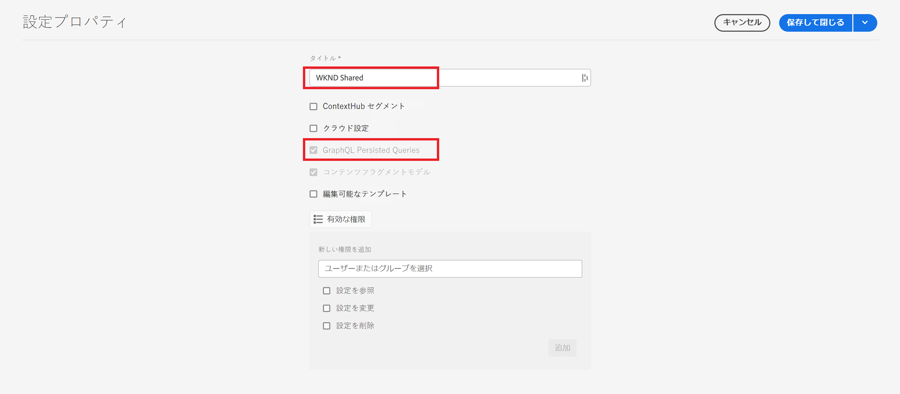
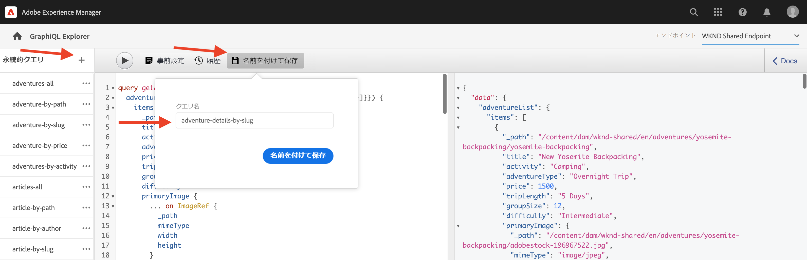
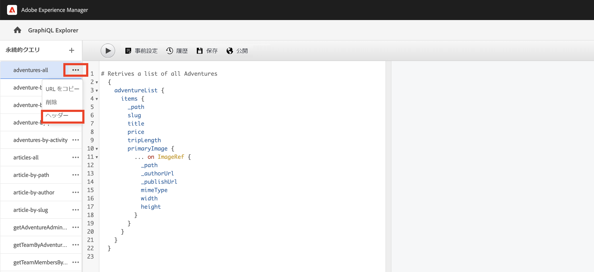
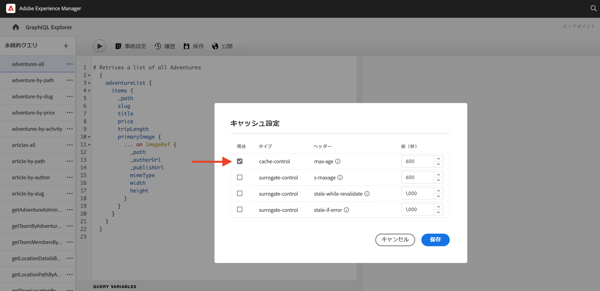

# 永続的な GraphQL クエリ

永続クエリは、Adobe Experience Manager（AEM） サーバーで保存されるクエリです。クライアントは、クエリ名を持つ HTTP GET リクエストを送信して実行できます。 このアプローチの利点は、キャッシュ可能性です。 クライアントサイド GraphQL クエリは HTTP POST リクエストを使用して実行することもできますが、これはキャッシュすることはできません。永続クエリは HTTP キャッシュまたは CDN を使用してキャッシュすることができるので、パフォーマンスが向上します。 永続クエリを使用すると、クエリがサーバー上にカプセル化され、AEM 管理者が完全に制御できるので、リクエストを簡略化し、セキュリティを強化できます。AEM GraphQL API を使用する場合は、永続クエリを使用することが&#x200B;**ベストプラクティスであり、強く推奨されます**。

前の章では、WKND アプリのデータを収集するための高度な GraphQL クエリをいくつか調べました。 この章では、クエリを AEM に永続化し、永続クエリに対してキャッシュコントロールを使用する方法を学びます。

## 前提条件 {#prerequisites}

このドキュメントは、複数のパートで構成されているチュートリアルの一部です。 この章に進む前に、[前の章](explore-graphql-api.md)が終了していることを確認してください。

## 目的 {#objectives}

この章では、次の方法を学びます。

* パラメーターを使用して GraphQL クエリを永続化する
* 永続クエリでキャッシュコントロールパラメーターを使用する

## _GraphQL 永続クエリ_&#x200B;設定を確認する

AEM インスタンスの WKND サイトプロジェクトで _GraphQL 永続クエリ_&#x200B;が有効になっていることを確認しましょう。

1. **ツール**／**一般**／**設定ブラウザー**&#x200B;に移動します。

1. 「**WKND 共有**」を選択し、上部のナビゲーションバーで「**プロパティ**」を選択して 、設定プロパティを開きます。 設定プロパティページで、**GraphQL 永続クエリ**&#x200B;権限が有効になっているはずです。

   

## ビルトイン GraphiQL エクスプローラーツールを使用して GraphQL クエリを永続化する

このセクションでは、アドベンチャーコンテンツフラグメントデータを取得してレンダリングするために後でクライアントアプリケーションで使用される GraphQL クエリを永続化します。

1. GraphiQL エクスプローラーに次のクエリを入力します。

   ```graphql
   query getAdventureDetailsBySlug($slug: String!) {
   adventureList(filter: {slug: {_expressions: [{value: $slug}]}}) {
       items {
       _path
       title
       activity
       adventureType
       price
       tripLength
       groupSize
       difficulty
       primaryImage {
           ... on ImageRef {
           _path
           mimeType
           width
           height
           }
       }
       description {
           html
           json
       }
       itinerary {
           html
           json
       }
       location {
           _path
           name
           description {
           html
           json
           }
           contactInfo {
           phone
           email
           }
           locationImage {
           ... on ImageRef {
               _path
           }
           }
           weatherBySeason
           address {
           streetAddress
           city
           state
           zipCode
           country
           }
       }
       instructorTeam {
           _metadata {
           stringMetadata {
               name
               value
           }
           }
           teamFoundingDate
           description {
           json
           }
           teamMembers {
           fullName
           contactInfo {
               phone
               email
           }
           profilePicture {
               ... on ImageRef {
               _path
               }
           }
           instructorExperienceLevel
           skills
           biography {
               html
           }
           }
       }
       administrator {
           fullName
           contactInfo {
           phone
           email
           }
           biography {
           html
           }
       }
       }
       _references {
       ... on ImageRef {
           _path
           mimeType
       }
       ... on LocationModel {
           _path
           __typename
       }
       }
   }
   }
   ```

   クエリを保存する前に、クエリが機能することを確認します。

1. 次に「名前を付けて保存」をタップし、クエリ名に「`adventure-details-by-slug`」と入力します。 

   

## 特殊文字のエンコードによる変数を使用した永続クエリの実行

特殊文字をエンコードすることにより、クライアントサイドアプリケーションが変数を使用して永続クエリを実行する方法を理解しましょう。

永続クエリを実行するには、クライアントアプリケーションで次の構文を使用して GET リクエストを実行します。

```
GET <AEM_HOST>/graphql/execute.json/<Project-Config-Name>/<Persisted-Query-Name>
```

_変数を持つ_&#x200B;永続クエリを実行するには、上記の構文は次のように変更されます。

```
GET <AEM_HOST>/graphql/execute.json/<Project-Config-Name>/<Persisted-Query-Name>;variable1=value1;variable2=value2
```

セミコロン（;）、等号（=）、スラッシュ（/）、スペースなどの特殊文字は、対応する UTF-8 エンコーディングを使用するように変換する必要があります。

コマンドラインターミナルから `getAllAdventureDetailsBySlug` クエリを実行して、これらの概念を実際に確認します。

1. GraphiQL エクスプローラーを開き、永続クエリ `getAllAdventureDetailsBySlug` の横にある&#x200B;**省略記号**（...）を選択し、「**URL をコピー**」をクリックします。コピーした URL をテキストパッドに貼り付けます。次のようになります。

   ```code
       http://<AEM_HOST>/graphql/execute.json/wknd-shared/getAllAdventureDetailsBySlug;slug=
   ```

1. `yosemite-backpacking` を変数値として追加します

   ```code
       http://<AEM_HOST>/graphql/execute.json/wknd-shared/getAllAdventureDetailsBySlug;slug=yosemite-backpacking
   ```

1. セミコロン（;）、等号（=）の特殊文字をエンコードします

   ```code
       http://<AEM_HOST>/graphql/execute.json/wknd-shared/getAllAdventureDetailsBySlug%3Bslug%3Dyosemite-backpacking
   ```

1. コマンドラインターミナルを開き、[Curl](https://curl.se/) を使用してクエリを実行します

   ```shell
   $ curl -X GET http://<AEM_HOST>/graphql/execute.json/wknd-shared/getAllAdventureDetailsBySlug%3Bslug%3Dyosemite-backpacking
   ```

>[!TIP]
>
>    AEM オーサー環境に対して上記のクエリを実行する場合は、資格情報を送信する必要があります。 デモンストレーションについては[ローカル開発アクセストークン](https://experienceleague.adobe.com/docs/experience-manager-learn/getting-started-with-aem-headless/authentication/local-development-access-token.html?lang=ja)、ドキュメントの詳細については[AEM API の呼び出し](https://experienceleague.adobe.com/docs/experience-manager-cloud-service/content/implementing/developing/generating-access-tokens-for-server-side-apis.html#calling-the-aem-api?lang=ja)を参照してください。

また、[永続クエリの実行方法](https://experienceleague.adobe.com/docs/experience-manager-cloud-service/content/headless/graphql-api/persisted-queries.html#execute-persisted-query?lang=ja)、[クエリ変数の使用](https://experienceleague.adobe.com/docs/experience-manager-cloud-service/content/headless/graphql-api/persisted-queries.html#query-variables?lang=ja)、[アプリで使用するクエリ URL のエンコード](https://experienceleague.adobe.com/docs/experience-manager-cloud-service/content/headless/graphql-api/persisted-queries.html#encoding-query-url?lang=ja)で、クライアントアプリケーションによる永続的なクエリ実行について確認してください。

## 永続クエリのキャッシュコントロールパラメーターを更新する {#cache-control-all-adventures}

AEM GraphQL API を使用すると、パフォーマンスを向上させるために、デフォルトのキャッシュコントロールパラメーターをクエリに更新できます。 デフォルトのキャッシュコントロール値は次のとおりです。

* クライアント（ブラウザーなど）のデフォルト TTL は 60 秒です（maxage=60）

* Dispatcher および CDN（共有キャッシュとも呼ばれる）のデフォルト TTL は 7200 秒です（s-maxage=7200）

`adventures-all` クエリを使用して、キャッシュコントロールパラメーターを更新します。 クエリ応答は大きいため、`age` をキャッシュでコントロールすると便利です。この永続クエリは、後で[クライアントアプリケーション](/help/headless-tutorial/graphql/advanced-graphql/client-application-integration.md)を更新するのに使用されます。

1. GraphiQL エクスプローラーを開き、永続クエリの横にある&#x200B;**エリプシス**（...）をクリックしてから「**ヘッダー**」をクリックすると、**キャッシュ設定**&#x200B;モーダルが開きます。

   


1. **キャッシュ設定**&#x200B;モーダルで、`max-age` ヘッダー値を `600 ` 秒（10 分）に更新し、「**保存**」をクリックします

   


デフォルトのキャッシュコントロールパラメーターの詳細については、[永続クエリをキャッシュする](https://experienceleague.adobe.com/docs/experience-manager-cloud-service/content/headless/graphql-api/persisted-queries.html#caching-persisted-queries?lang=ja)をご覧ください。


## これで完了です。

これで完了です。パラメーターを使用して GraphQL クエリを永続化し、永続クエリを更新し、永続クエリでキャッシュコントロールパラメーターを使用する方法を学習しました。

## 次の手順

[次の章](/help/headless-tutorial/graphql/advanced-graphql/client-application-integration.md)では、WKND アプリで永続化クエリのリクエストを実装します。
