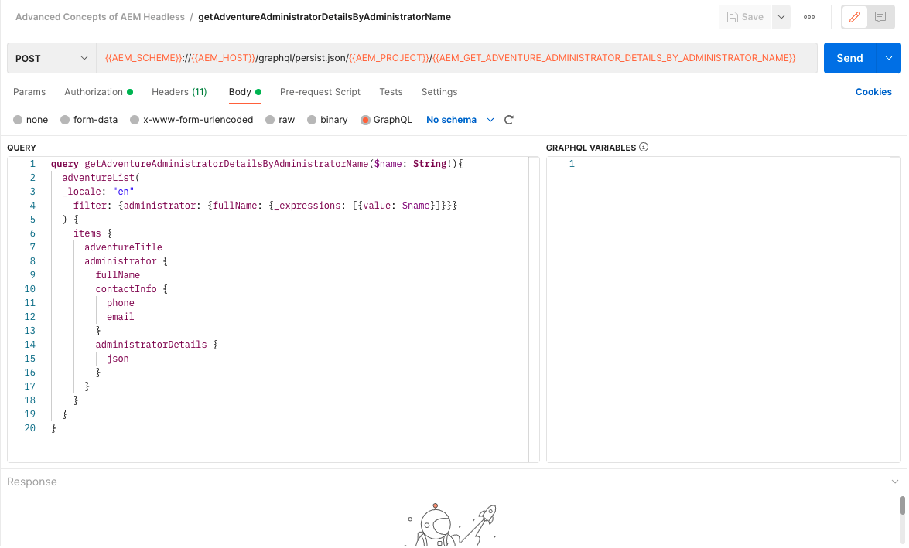
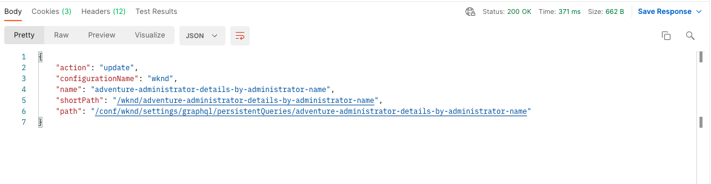

# 永続的な GraphQL クエリ

永続化クエリは、Adobe Experience Manager(AEM) サーバーに保存されるクエリです。 クライアントは、クエリ名を持つ HTTPGETリクエストを送信して実行できます。 このアプローチの利点は、キャッシュ可能性です。 クライアント側の GraphQL クエリは HTTPPOSTリクエストを使用して実行することもできますが、キャッシュすることはできません。永続化されたクエリは HTTP キャッシュまたは CDN を使用してキャッシュでき、パフォーマンスが向上します。 永続化されたクエリを使用すると、クエリがサーバー上にカプセル化され、AEM管理者が完全に制御できるので、リクエストを簡略化し、セキュリティを強化できます。 ベストプラクティスであり、AEM GraphQL API を使用する場合は永続的なクエリを使用することを強くお勧めします。

前の章では、WKND アプリのデータを収集するための高度な GraphQL クエリをいくつか調べました。 この章では、これらのクエリをAEMに永続化し、更新し、永続化されたクエリに対するキャッシュ制御の使用方法を学びます。

## 前提条件 {#prerequisites}

このドキュメントは、マルチパートチュートリアルの一部です。 この章を進める前に、前の章が完了していることを確認してください。

このチュートリアルでは、 [Postman](https://www.postman.com/) をクリックして HTTP リクエストを実行します。 この章を開始する前に、サービスにサインアップしていることを確認してください。 また、このチュートリアルでは、コレクションの設定、変数の作成、リクエストの実行方法など、Postman アプリに関する実用的な知識も必要です。 次の Postman ドキュメントを参照してください： [リクエストの作成](https://learning.postman.com/docs/sending-requests/requests/) および [最初のリクエストの送信](https://learning.postman.com/docs/getting-started/sending-the-first-request/) を参照してください。

この章では、前の章で説明したクエリはAEMに対して保持されます。 これらの標準的な GraphQL クエリを使用して、テキストファイルをダウンロードできます [ここ](assets/graphql-persisted-queries/advanced-concepts-aem-headless-graphql-queries.txt) を参照してください。

## 目的 {#objectives}

この章では、以下の方法について説明します。

* パラメーターを使用して GraphQL クエリを保持
* 永続クエリを更新
* 永続クエリでの cache-control パラメーターの使用

## 永続クエリの概要

このビデオでは、GraphQL クエリの保持、クエリの更新、キャッシュ制御の使用方法の概要を説明します。

>[!VIDEO](https://video.tv.adobe.com/v/340036/?quality=12&learn=on)

## 永続クエリの有効化

まず、AEMインスタンスの WKND Site プロジェクトで、永続化されたクエリが有効になっていることを確認します。

1. に移動します。 **ツール** > **一般** > **設定ブラウザー**.

1. 選択 **WKND サイト**&#x200B;を選択し、「 **プロパティ** 上部のナビゲーションバーで、設定プロパティを開きます。

   

   設定プロパティページに、 **GraphQL 永続的なクエリ** 権限が有効になっている。

   

## Postman コレクションを読み込み

チュートリアルに従いやすくするために、Postman コレクションが提供されます。 または、 `curl` を使用できます。

1. ダウンロードとインストール [Postman](https://www.postman.com/)
1. をダウンロードします。 [AEMHeadless.postman_collection.json の AdvancedConcepts](/help/headless-tutorial/graphql/advanced-graphql/assets/tutorial-files/AdvancedConceptsofAEMHeadless.postman_collection.json)
1. Postman アプリを開く
1. 選択 **ファイル** > **インポート** > **ファイルをアップロード** を選択します。 `AdvancedConceptsofAEMHeadless.postman_collection.json` コレクションを読み込みます。

   

### 認証

AEMオーサーインスタンスに対するクエリを送信するには、認証が必要です。 このチュートリアルは、AEMas a Cloud Service環境に基づいており、開発トークンを使用した Bearer 認証を使用します。 Postman コレクションの認証を設定するには、次の手順に従います。

1. 開発トークンを取得するには、Cloud Developer Console に移動し、 **統合** 「 」タブで「 」を選択します。 **ローカル開発トークンを取得**.

   

1. Postman コレクションで、 **認証** 「 」タブで「 」を選択します。 **Bearer トークン** 内 **タイプ** ドロップダウンメニュー。

   

1. 開発トークンを **トークン** フィールドに入力します。 次の節で説明するように、変数にトークンを渡すことができます。

   

### 変数 {#variables}

Postman コレクション内の変数を通じて認証トークンや URI コンポーネントなどの値を渡し、プロセスを簡略化できます。 このチュートリアルでは、次の手順を使用して変数を作成します。

1. 次に移動： **変数** 」タブをクリックし、次の変数を作成します。

   | 変数 | 値 |
   | --- | --- |
   | `AEM_SCHEME` | `https` |
   | `AEM_AUTH_TOKEN` | （開発トークン） |
   | `AEM_HOST` | (AEMインスタンスのホスト名 ) |
   | `AEM_PROJECT` | `wknd` |

1. また、作成する永続化されたクエリごとに変数を追加できます。 このチュートリアルでは、次のクエリを保持します。 `getAdventureAdministratorDetailsByAdministratorName`, `getTeamByAdventurePath`, `getLocationDetailsByLocationPath`, `getTeamMembersByAdventurePath`, `getLocationPathByAdventurePath`、および `getTeamLocationByLocationPath`.

   次の変数を作成します。

   * `AEM_GET_ADVENTURE_ADMINISTRATOR_DETAILS_BY_ADMINISTRATOR_NAME`：`adventure-administrator-details-by-administrator-name`
   * `AEM_GET_ADVENTURE_ADMINISTRATOR_DETAILS_BY_ADMINISTRATOR_NAME`：`adventure-administrator-details-by-administrator-name`
   * `AEM_GET_TEAM_LOCATION_BY_LOCATION_PATH`：`team-location-by-location-path`
   * `AEM_GET_TEAM_MEMBERS_BY_ADVENTURE_PATH`：`team-members-by-adventure-path`
   * `AEM_GET_LOCATION_DETAILS_BY_LOCATION_PATH`：`location-details-by-location-path`
   * `AEM_GET_LOCATION_PATH_BY_ADVENTURE_PATH`：`location-path-by-adventure-path`
   * `AEM_GET_TEAM_BY_ADVENTURE_PATH`：`team-by-adventure-path`

   完了したら、 **変数** 」タブは次のようになります。

   

## パラメーターを使用して GraphQL クエリを保持

内 [AEMヘッドレスおよび GraphQL ビデオシリーズ](../video-series/graphql-persisted-queries.md)では、永続的な GraphQL クエリの作成方法を学びました。 この節では、GraphQL クエリをパラメーターと共に保持して実行します。

### 永続クエリの作成 {#create-persisted-query}

この例では、 `getAdventureAdministratorDetailsByAdministratorName` 前の章で作成したクエリ。

>[!NOTE]
>
>HTTPPUTメソッドは永続化されたクエリの作成に使用され、HTTPPOSTメソッドは永続化されたクエリの更新に使用されます。

1. まず、Postman コレクション内に新しいリクエストを追加します。 HTTPPUTメソッドを選択して永続化されたクエリを作成し、次のリクエスト URI を使用します。

   ```plaintext
   {{AEM_SCHEME}}://{{AEM_HOST}}/graphql/persist.json/{{AEM_PROJECT}}/{{AEM_GET_ADVENTURE_ADMINISTRATOR_DETAILS_BY_ADMINISTRATOR_NAME}}
   ```

   URI では、 `/graphql/persist.json` アクション。

1. 貼り付け `getAdventureAdministratorDetailsByAdministratorName` GraphQL クエリをリクエスト本文に挿入します。 これは、変数を含む標準の GraphQL クエリです `name` を必要とする `String`.

   

1. リクエストを実行します。 次の応答を受け取ります。

   

   次の名前の永続クエリが正常に作成されました： `adventure-administrator-details-by-administrator-name`.

### 永続クエリの実行

作成した永続クエリを実行します。

1. 次のリクエスト URI を使用して、Postman コレクション内に新しいGETリクエストを作成します。

   ```plaintext
   {{AEM_SCHEME}}://{{AEM_HOST}}/graphql/execute.json/{{AEM_PROJECT}}/{{AEM_GET_ADVENTURE_ADMINISTRATOR_DETAILS_BY_ADMINISTRATOR_NAME}}
   ```

   リクエスト URI に `execute.json` アクション。

   このリクエストをそのまま実行すると、クエリに変数が必要なので、エラーがスローされます `name`. この変数をパラメーターとしてリクエスト URI に渡す必要があります。

   

1. 次に、Jacob Wester という名前の管理者を検索します。 永続化された GraphQL クエリのパラメーターは、以前の URI コンポーネントから `;` をエンコードしてから、リクエスト URI に渡します。 ブラウザーコンソールで、次のコマンドを実行します。

   ```js
   encodeURIComponent(";name=Jacob Wester")
   ```

   

1. コンソールから結果をコピーし、Postman のリクエスト URI の最後に貼り付けます。 次のリクエスト URI が必要です。

   ```plaintext
   {{AEM_SCHEME}}://{{AEM_HOST}}/graphql/execute.json/{{AEM_PROJECT}}/{{AEM_GET_ADVENTURE_ADMINISTRATOR_DETAILS_BY_ADMINISTRATOR_NAME}}%3Bname%3DJacob%20Wester
   ```

1. GETリクエストを実行します。 次の応答を受け取ります。

   

これで、パラメーターを使用して永続化された GraphQL クエリを作成し、実行しました。

上記の手順に従って、から残りの GraphQL クエリを保持できます。 [テキストファイル](assets/graphql-persisted-queries/advanced-concepts-aem-headless-graphql-queries.txt) で作成した変数を使用 [この章の始まり](#variables).

フル [Postman コレクション](/help/headless-tutorial/graphql/advanced-graphql/assets/tutorial-files/AdvancedConceptsofAEMHeadless.postman_collection.json) は、のダウンロードとインポートにも使用できます。

## 永続クエリを更新

永続化されたクエリはPUTリクエストを使用して作成されますが、POSTリクエストを使用して既存の永続化されたクエリを更新する必要があります。 このチュートリアルでは、次の名前の永続クエリを更新します： `adventure-administrator-details-by-administrator-name` を [前のセクション](#create-persisted-query).

1. 前の節でPUTリクエストに使用したタブを複製します。 コピーで、HTTP メソッドを「POST」に変更します。

1. GraphQL クエリで、 `plaintext` 形式 `administratorDetails` フィールドに入力します。

   

1. リクエストを実行します。 次の応答が返されます。

   

これで、 `adventure-administrator-details-by-administrator-name` 永続化されたクエリ。 変更が加えられた場合は、AEMで GraphQL クエリを常に更新することが重要です。

## 永続化されたクエリで cache-control パラメーターを渡す {#cache-control-all-adventures}

AEM GraphQL API を使用すると、パフォーマンスを向上させるために、クエリに cache-control パラメーターを追加できます。

以下を使用： `getAllAdventureDetails` 前の章で作成したクエリ。 クエリ応答は大きく、その制御に役立ちます `age` キャッシュ内に保存されます。

この永続化されたクエリは、後で [クライアントアプリケーション](/help/headless-tutorial/graphql/advanced-graphql/client-application-integration.md).

1. Postman コレクションで、新しい変数を作成します。

   ```plaintext
   AEM_GET_ALL_AT_ONCE: all-adventure-details
   ```

1. 新しいPUTリクエストを作成して、このクエリを保持します。

1. 内 **本文** 」タブで、 **raw** データタイプ。

   

1. クエリでキャッシュコントロールを使用するには、クエリを JSON 構造でラップし、末尾に cache-control パラメーターを追加する必要があります。 次のクエリを、リクエストの本文にコピーして貼り付けます。

   ```json
   {
   "query": " query getAllAdventureDetails($fragmentPath: String!) { adventureByPath(_path: $fragmentPath){ item { _path adventureTitle adventureActivity adventureType adventurePrice adventureTripLength adventureGroupSize adventureDifficulty adventurePrice adventurePrimaryImage{ ...on ImageRef{ _path mimeType width height } } adventureDescription { html json } adventureItinerary { html json } location { _path name description { html json } contactInfo{ phone email } locationImage{ ...on ImageRef{ _path } } weatherBySeason address{ streetAddress city state zipCode country } } instructorTeam { _metadata{ stringMetadata{ name value } } teamFoundingDate description { json } teamMembers { fullName contactInfo { phone email } profilePicture{ ...on ImageRef { _path } } instructorExperienceLevel skills biography { html } } } administrator { fullName contactInfo { phone email } biography { html } } } _references { ...on ImageRef { _path mimeType } ...on LocationModel { _path __typename } } } }", 
   "cache-control": { "max-age": 300 }
   }
   ```

   >[!CAUTION]
   >
   >ラップされたクエリに改行を含めることはできません。

   リクエストは次のようになります。

   

1. リクエストを実行します。 次の `all-adventure-details` 永続化されたクエリが正常に作成されました。

   

## おめでとうございます。

おめでとうございます。パラメーターを使用して GraphQL クエリを永続化する方法、永続化されたクエリを更新する方法、永続化されたクエリで cache-control パラメーターを使用する方法を学習しました。

## 次の手順

内 [次の章](/help/headless-tutorial/graphql/advanced-graphql/client-application-integration.md)を使用する場合、WKND アプリに永続化されたクエリのリクエストを実装します。

このチュートリアルではオプションですが、実際の実稼動環境ではすべてのコンテンツを必ず公開してください。 AEMのオーサー環境とパブリッシュ環境について詳しくは、 [AEMヘッドレスおよび GraphQL ビデオシリーズ](../video-series/author-publish-architecture.md).