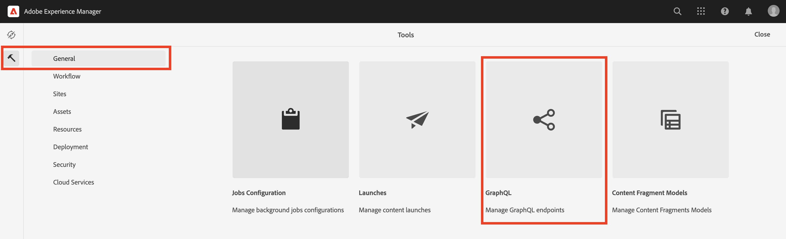

# AEM ヘッドレスの高度な概念

{{aem-headless-trials-promo}}

このエンドツーエンドチュートリアルは、Adobe Experience Manager（AEM）のヘッドレスと GraphQL の基礎を説明した[基本チュートリアル](../multi-step/overview.md)の続きです。この詳細チュートリアルでは、コンテンツフラグメントモデル、コンテンツフラグメントおよび AEM GraphQL 永続クエリの操作（クライアントアプリケーションでの GraphQL 永続クエリの使用など）に関する詳細を説明します。

## 前提条件

[AEM as a Cloud Service のクイックセットアップ](../quick-setup/cloud-service.md)を完了して、AEM as a Cloud Service 環境を設定します。

この詳細チュートリアルに進む前に、前の[基本チュートリアル](../multi-step/overview.md)と[ビデオシリーズ](../video-series/modeling-basics.md)のチュートリアルを完了することを強くお勧めします。このチュートリアルは、ローカルの AEM 環境を使用して完了できますが、扱っている内容は AEM as a Cloud Service のワークフローのみです。

>[!CAUTION]
>
>AEM as a Cloud Service 環境にアクセスできない場合は、[ローカル SDK を使用した AEM ヘッドレスのクイックセットアップ](https://experienceleague.adobe.com/docs/experience-manager-learn/getting-started-with-aem-headless/graphql/quick-setup/local-sdk.html?lang=ja)を完了してください。ただし、コンテンツフラグメントのナビゲーションなど、一部の製品の UI 画面が異なることに注意が必要です。

## 目的

このチュートリアルでは、以下のトピックを扱います。

* 検証ルールと高度なデータタイプ（タブプレースホルダー、ネストされたフラグメント参照、JSON オブジェクト、日付と時刻など）を使用して、コンテンツフラグメントモデルを作成します。
* ネストされたコンテンツやフラグメント参照を操作しながらコンテンツフラグメントを作成し、コンテンツフラグメント作成ガバナンス用のフォルダーポリシーを設定します。
* 変数とディレクティブを含んだ GraphQL クエリを使用して、AEM GraphQL の API 機能を調べます。
* パラメーターを含んだ GraphQL クエリを AEM に永続化し、永続クエリでキャッシュ制御パラメーターを使用する方法を説明します。
* AEM ヘッドレス JavaScript SDK を使用して、永続クエリのリクエストをサンプル WKND GraphQL React アプリに統合します。

## AEM ヘッドレスの高度な概念の概要

次のビデオでは、このチュートリアルで扱う概念の大まかな概要を説明しています。このチュートリアルでは、より高度なデータタイプを使用したコンテンツフラグメントモデルの定義、コンテンツフラグメントのネスト、AEM への GraphQL クエリの永続化について説明します。

>[!VIDEO](https://video.tv.adobe.com/v/340035?quality=12&learn=on)

>[!CAUTION]
>
>このビデオ（2:25 時点）では、GraphQL クエリについて調べるために、パッケージマネージャーを使用して GraphiQL クエリエディターをインストールすることに言及しています。ただし、AEM as Cloud Service の新しいバージョンでは、組み込みの **GraphiQL エクスプローラー**&#x200B;が用意されているので、パッケージのインストールは必要ありません。詳しくは、[GraphiQL IDE の使用](https://experienceleague.adobe.com/docs/experience-manager-cloud-service/content/headless/graphql-api/graphiql-ide.html?lang=ja)を参照してください。

## プロジェクトセットアップ

WKND Site プロジェクトには必要な設定がすべて含まれているので、[クイックセットアップ](../quick-setup/cloud-service.md)を完了した後、すぐにチュートリアルを開始できます。この節では、独自の AEM ヘッドレスプロジェクトを作成する際に使用できる、いくつかの重要な手順のみを取り上げます。

### 既存の設定のレビュー

AEM で新しいプロジェクトを開始する最初のステップは、プロジェクトの設定をワークスペースとして作成することと、GraphQL API エンドポイントを作成することです。設定をレビューまたは作成するには、**ツール**／**一般**／**設定ブラウザー**&#x200B;に移動します。

`WKND Shared` サイト設定がチュートリアル用に既に作成されていることがわかります。独自のプロジェクトの設定を作成するには、右上隅にある「**作成**」を選択し、表示される設定を作成モーダルのフォームに入力します。

### GraphQL API エンドポイントのレビュー

次に、GraphQL クエリの送信先となる API エンドポイントを設定する必要があります。既存のエンドポイントをレビューするか、新しく作成するには、**ツール**／**一般**／**GraphQL** に移動します。

`WKND Shared Endpoint` が既に作成されていることがわかります。自分のプロジェクトのエンドポイントを作成するには、右上隅にある「**作成**」を選択し、ワークフローに従います。

>[!NOTE]
>
> エンドポイントを保存すると、セキュリティコンソールへのアクセスに関するモーダルが表示されます。このモーダルでは、エンドポイントへのアクセスの設定を希望する場合にセキュリティ設定を調整できます。ただし、セキュリティ権限そのものについては、このチュートリアルの範囲外です。詳しくは、[AEM ドキュメント](https://experienceleague.adobe.com/docs/experience-manager-65/administering/security/security.html?lang=ja)を参照してください。

### WKND コンテンツ構造および言語ルートフォルダーのレビュー

コンテンツ構造を明確に定義することが、AEM ヘッドレス実装の成功の鍵になります。コンテンツのスケーラビリティ、ユーザビリティおよび権限管理に役立ちます。

言語ルートフォルダーは、EN や JP などの ISO 言語コードを名前として持つフォルダーです。AEM 翻訳管理システムでは、これらのフォルダーを使用して、コンテンツの主要言語とコンテンツの翻訳言語を定義します。

**ナビゲーション**／**アセット**／**ファイル**&#x200B;に移動します。

**WKND Shared** フォルダーに移動します。フォルダーのタイトルが「English」で、名前が「EN」であることがわかります。このフォルダーが、WKND Site プロジェクトの言語ルートフォルダーです。

独自のプロジェクト用に、設定内に言語ルートフォルダーを作成します。詳しくは、[フォルダーの作成](/help/headless-tutorial/graphql/advanced-graphql/author-content-fragments.md#create-folders)の節を参照してください。

### ネストされたフォルダーへの設定の割り当て

最後に、プロジェクトの設定を言語ルートフォルダーに割り当てる必要があります。この割り当てにより、プロジェクトの設定で定義されたコンテンツフラグメントモデルに基づいて、コンテンツフラグメントを作成できるようになります。

設定に言語ルートフォルダーを割り当てるには、フォルダーを選択し、上部のナビゲーションバーにある「**プロパティ**」を選択します。

次に「**クラウドサービス**」タブに移動し、「**クラウド設定**」フィールドのフォルダーアイコンを選択します。

表示されるモーダルで、前に作成した設定を選択して、その設定に言語ルートフォルダーを割り当てます。

### ベストプラクティス

AEM で自分のプロジェクトを作成する際のベストプラクティスは、次のとおりです。

* フォルダー階層は、ローカライゼーションと翻訳を念頭に置いてモデル化してください。つまり、言語フォルダーは設定フォルダー内にネストしてください。これにより、設定フォルダー内のコンテンツを翻訳しやすくなります。
* フォルダー階層は、フラットでわかりやすいものにしてください。後で、特に、ライブで使用するために公開した後は、フォルダーとフラグメントの移動や名前の変更を行わないでください。パスが変更されて、フラグメント参照や GraphQL クエリに影響を及ぼす可能性があるからです。

## スターターパッケージとソリューションパッケージ

2 つの AEM **パッケージ**&#x200B;を使用でき、[パッケージマネージャー](/help/headless-tutorial/graphql/advanced-graphql/author-content-fragments.md#sample-content)でインストールできます。

* [Advanced-GraphQL-Tutorial-Starter-Package-1.1.zip](/help/headless-tutorial/graphql/advanced-graphql/assets/tutorial-files/Advanced-GraphQL-Tutorial-Starter-Package-1.1.zip) は、チュートリアルで後ほど使用するもので、その中にはサンプルの画像とフォルダーが含まれています。
* [Advanced-GraphQL-Tutorial-Solution-Package-1.2.zip](/help/headless-tutorial/graphql/advanced-graphql/assets/tutorial-files/Advanced-GraphQL-Tutorial-Solution-Package-1.2.zip) には、新しいコンテンツフラグメントモデル、コンテンツフラグメント、永続 GraphQL クエリなど、第 1～4 章の完成したソリューションが含まれています。[クライアントアプリケーションの統合](/help/headless-tutorial/graphql/advanced-graphql/client-application-integration.md)の章にすぐにスキップする場合に便利です。

[React アプリ - 詳細チュートリアル ‐ WKND Adventures](https://github.com/adobe/aem-guides-wknd-graphql/blob/main/advanced-tutorial/README.md) プロジェクトを使用して、サンプルアプリケーションをレビューしたり詳しく調べたりすることができます。このサンプルアプリケーションでは、永続 GraphQL クエリを呼び出して AEM からコンテンツを取得し、それを没入型エクスペリエンスでレンダリングします。

## はじめに

この詳細チュートリアルを開始するには、次の手順に従います。

1. [AEM as a Cloud Service](../quick-setup/cloud-service.md) を使用して開発環境をセットアップします。
1. チュートリアルの[コンテンツフラグメントモデルの作成](/help/headless-tutorial/graphql/advanced-graphql/create-content-fragment-models.md)の章を開始します。
