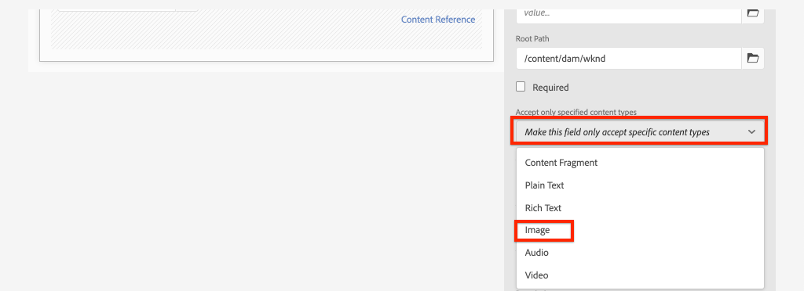

# コンテンツフラグメントモデルの定義{#content-fragment-models}

>[!CAUTION]
>
> AEM GraphQL API for Content Fragment配信は、2021年の初めにリリースされます。
> 関連ドキュメントは、プレビュー目的で利用できます。

この章では、コンテンツをモデル化し、**コンテンツフラグメントモデル**&#x200B;を使用してスキーマを構築する方法について説明します。 既存のモデルをレビューし、新しいモデルを作成します。 また、スキーマをモデルの一部として定義するために使用できる様々なデータタイプについても学習します。

この章では、**寄稿者**&#x200B;の新しいモデルを作成します。これは、雑誌やアドベンチャーコンテンツをWKNDブランドの一部として作成するユーザのデータモデルです。

## 前提条件 {#prerequisites}

これはマルチパート形式のチュートリアルで、[クイックセットアップ](./setup.md)で説明されている手順が完了していることを前提としています。

## 目的 {#objectives}

* 新しいコンテンツフラグメントモデルの作成を参照してください。
* 建築モデルに使用できるデータタイプと検証オプションを特定します。
* コンテンツフラグメントモデルが、データスキーマとコンテンツフラグメントのオーサリングテンプレートの&#x200B;**両方**&#x200B;を定義する方法を理解します。

## コンテンツフラグメントモデルの概要{#overview}

>[!VIDEO](https://video.tv.adobe.com/v/22452/?quality=12&learn=on)

上記のビデオでは、コンテンツフラグメントモデルの操作に関する概要を説明しています。

## Inspect冒険コンテンツフラグメントモデル

前の章では、いくつかのAdventuresコンテンツフラグメントを編集し、外部アプリケーションで表示しています。 次に、アドベンチャーコンテンツフラグメントモデルを調べ、これらのフラグメントの基礎となるデータスキーマを理解します。

1. **AEM開始**&#x200B;メニューから、**ツール**/**アセット**/**コンテンツフラグメントモデル**&#x200B;に移動します。

   

1. **WKNDサイト**&#x200B;フォルダーに移動し、**アドベンチャー**&#x200B;コンテンツフラグメントモデルの上にマウスポインターを置き、**編集**&#x200B;アイコン（鉛筆）をクリックして、モデルを開きます。

   

1. これにより、**コンテンツフラグメントモデルエディター**&#x200B;が開きます。 アドベンチャーモデルを定義するフィールドには、**1行テキスト**、**複数行テキスト**、**定義済みリスト**、**コンテンツリファレンス**&#x200B;のように、異なるデータタイプ&#x200B;**が含まれていることを確認してください。**

1. エディターリストの右側の列には、コンテンツフラグメントの作成に使用されるフォームフィールドを定義する&#x200B;**データ型**&#x200B;が用意されています。

1. メインパネルの&#x200B;**タイトル**&#x200B;フィールドを選択します。 右側の列で、「**プロパティ**」タブをクリックします。

   

   **Property Name**&#x200B;フィールドが`adventureTitle`に設定されていることを確認します。 AEMに保持されるプロパティの名前を定義します。 **プロパティ名**&#x200B;では、このプロパティの&#x200B;**キー**&#x200B;名もデータスキーマの一部として定義します。 この&#x200B;**key**&#x200B;は、コンテンツフラグメントデータがGraphQL APIで公開される場合に使用されます。

   >[!CAUTION]
   >
   > **コンテンツフラグメントがモデルから派生した後に**&#x200B;フィールドの&#x200B;**プロパティ名**&#x200B;を変更すると、下流の影響を受けます。 既存のフラグメントのフィールド値は参照されなくなり、GraphQLで公開されるデータスキーマが変更され、既存のアプリケーションに影響を与えます。

1. 「**プロパティ**」タブを下にスクロールし、「**検証タイプ**」ドロップダウンを表示します。

   

   **電子メール**&#x200B;と&#x200B;**URL**&#x200B;で、すぐに使用できるフォームの検証を利用できます。 正規式を使用して、**カスタム**&#x200B;検証を定義することもできます。

1. 「**キャンセル**」をクリックして、コンテンツフラグメントモデルエディターを閉じます。

## 寄稿者モデルの作成

次に、**寄稿者**&#x200B;の新しいモデルを作成します。これは、WKNDブランドの一部として雑誌およびアドベンチャーコンテンツを作成するユーザーのデータモデルです。

1. 右上隅の「**作成**」をクリックして、**モデルを作成**&#x200B;ウィザードを表示します。
1. **モデルタイトル**&#x200B;に対して、次を入力します。**寄稿者**&#x200B;をクリックし、「**作成**」をクリックします

   

   「**開く**」をクリックして、新しく作成したモデルを開きます。

1. **1行のテキスト**&#x200B;要素をメインパネルにドラッグ&amp;ドロップします。 「**プロパティ**」タブで次のプロパティを入力します。

   * **フィールドラベル**: **フルネーム**
   * **プロパティ名**: `fullName`
   * **必須**&#x200B;を確認

   

1. 「**データタイプ**」タブをクリックし、**フルネーム**&#x200B;フィールドの下に&#x200B;**複数行テキスト**&#x200B;フィールドをドラッグ&amp;ドロップします。 次のプロパティを入力します。

   * **フィールドラベル**: **伝記**
   * **プロパティ名**: `biographyText`
   * **デフォルトのタイプ**: **リッチテキスト**

1. 「**データタイプ**」タブをクリックし、**コンテンツ参照**&#x200B;フィールドをドラッグ&amp;ドロップします。 次のプロパティを入力します。

   * **フィールドラベル**: **画像参照**
   * **プロパティ名**: `pictureReference`
   * **ルートパス**: `/content/dam/wknd`

   **ルートパス**&#x200B;を設定する際に、**フォルダー**&#x200B;アイコンをクリックして、パスを選択するためのモーダルを表示できます。 これにより、作成者がパスの入力に使用できるフォルダーが制限されます。

   

1. &lt;a0追加/>ピクチャ参照&#x200B;**に対する検証です。これにより、** Images **のコンテンツタイプのみがフィールドの入力に使用できるようになります。**

   

1. 「**データタイプ**」タブをクリックし、「**ピクチャ参照**」フィールドの下に&#x200B;**定義済みリスト**&#x200B;データタイプをドラッグ&amp;ドロップします。 次のプロパティを入力します。

   * **フィールドラベル**: **職業**
   * **プロパティ名**: `occupation`

1. 追加&#x200B;**オプション**&#x200B;の追加一部（**aオプション**&#x200B;ボタンを使用） **オプションラベル**&#x200B;と&#x200B;**オプション値**&#x200B;に同じ値を使用します。

   **アーティスト**, Influence **,** Photographer **,** TravelerPrater **,** Writer  **** **Writer nulpencer, YouTuencer**

   

1. 最終的な&#x200B;**寄稿者**&#x200B;モデルは、次のようになります。

   

1. 「**保存**」をクリックして、変更を保存します。

## 寄稿者モデルの有効化

コンテンツフラグメントモデルの初回作成時に、デフォルトで&#x200B;**ドラフト**&#x200B;状態になります。 これにより、ユーザーは、コンテンツフラグメントモデル&#x200B;**を**&#x200B;の前に絞り込んで、作成者に使用を許可できます。 モデル内のフィールドの&#x200B;**プロパティ名**&#x200B;を変更すると、基になるデータスキーマが変更され、既存のフラグメントや外部アプリケーションに大きな下流の影響を与える可能性があることを忘れないでください。 フィールドの&#x200B;**プロパティ名**&#x200B;に使用する命名規則は慎重に計画することをお勧めします。

1. **寄稿者**&#x200B;モデルが現在&#x200B;**ドラフト**&#x200B;状態にあることを確認します。

1. カードの上にマウスポインターを置き、**有効にする**&#x200B;アイコンをクリックして、**寄稿者モデル**&#x200B;を有効にします。

   

## バリデーターが{#congratulations}

おめでとうございます。最初のコンテンツフラグメントモデルが作成されました。

## 次の手順 {#next-steps}

次の章[オーサリングコンテンツフラグメントモデル](author-content-fragments.md)では、コンテンツフラグメントモデルに基づいて新しいコンテンツフラグメントを作成および編集します。 また、コンテンツフラグメントのバリエーションを作成する方法も学習します。