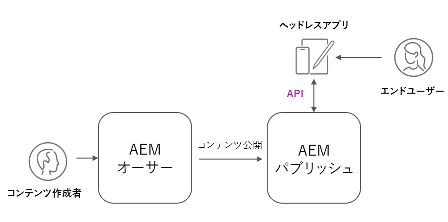

# AEM ヘッドレスデプロイメント

AEM ヘッドレスクライアントのデプロイメントには、AEM がホストする SPA、外部 SPA、web サイト、モバイルアプリ、さらにはサーバー間プロセスという多くの種類があります。

クライアントとそのデプロイ方法に応じて、AEM ヘッドレスデプロイメントには様々な考慮事項があります。

## AEM サービスのアーキテクチャ

デプロイメントに関する考慮事項を確認する前に、AEM の論理アーキテクチャ、AEM as a Cloud Service のサービス層の分離と役割について理解することが不可欠です。 AEM as a Cloud Service は、次の 2 つの論理サービスで構成されます。

+ __AEM オーサー__&#x200B;は、チームがコンテンツフラグメント（および他のアセット）を作成、共同作業および公開するサービスです。
+ __AEM パブリッシュ__&#x200B;は、公開されたコンテンツフラグメント（および他のアセット）が、一般的な使用のためにレプリケートされるサービスです。
+ __AEM プレビュー__&#x200B;は、AEM パブリッシュの動作を模倣するサービスですが、プレビューやレビューの目的でコンテンツが公開されるサービスです。 AEM プレビューは、内部オーディエンス向けであり、コンテンツの一般配信向けではありません。 目的のワークフローに応じて、AEM プレビューの使用は任意です。

AEM as a Cloud Service ヘッドレスの典型的なデプロイメントアーキテクチャ_

通常、実稼動の処理能力で動作する AEM ヘッドレスクライアントは、承認された公開済みコンテンツが含まれる AEM パブリッシュとやり取りします。AEM オーサーインスタンスはデフォルトで安全であり、すべてのリクエストに対する認証が必要で、進行中の作業中や未承認のコンテンツが含まれる場合があるため、AEM オーサーインスタンスとやり取りするクライアントは特に注意する必要があります。

## ヘッドレスクライアントのデプロイメント

    <!-- Single-page App (SPA) -->
    

       

           

               <figure class="image is-16by9">
                   
               </figure>
           

           

               

                   
<a href="./spa.md" title="単一ページアプリ（SPA）">単一ページアプリ（SPA）</a>

                   
単一ページアプリ（SPA）のデプロイメントに関する考慮事項について学びます。

                   <a href="./spa.md" class="spectrum-Button spectrum-Button--outline spectrum-Button--primary spectrum-Button--sizeM">
 学ぶ
 </a>
               

           

       

    

<!-- Web component/JS -->

   

       

           <figure class="image is-16by9">
               
           </figure>
       

       

           

               
<a href="./web-component.md" title="Web コンポーネント／JS">Web コンポーネント／JS</a>

               
Web コンポーネントとブラウザーベースの JavaScript ヘッドレスコンシューマー向けのデプロイメントに関する考慮事項について学びます。

               <a href="./web-component.md" class="spectrum-Button spectrum-Button--outline spectrum-Button--primary spectrum-Button--sizeM">
 学ぶ
 </a>
           

       

   

<!-- Mobile apps -->

   

       

           <figure class="image is-16by9">
               
           </figure>
       

       

           

               
<a href="./mobile.md" title="モバイルアプリ">モバイルアプリ</a>

               
モバイルアプリのデプロイメントに関する考慮事項について学びます。

               <a href="./mobile.md" class="spectrum-Button spectrum-Button--outline spectrum-Button--primary spectrum-Button--sizeM">
 学ぶ
 </a>
           

       

   

<!-- Server-to-server apps -->

   

       

           <figure class="image is-16by9">
               
           </figure>
       

       

           

               
<a href="./server-to-server.md" title="サーバー間アプリ">サーバー間アプリ</a>

               
サーバー間アプリのデプロイメントに関する考慮事項について学びます。

               <a href="./server-to-server.md" class="spectrum-Button spectrum-Button--outline spectrum-Button--primary spectrum-Button--sizeM">
 学ぶ
 </a>
           

       

   

