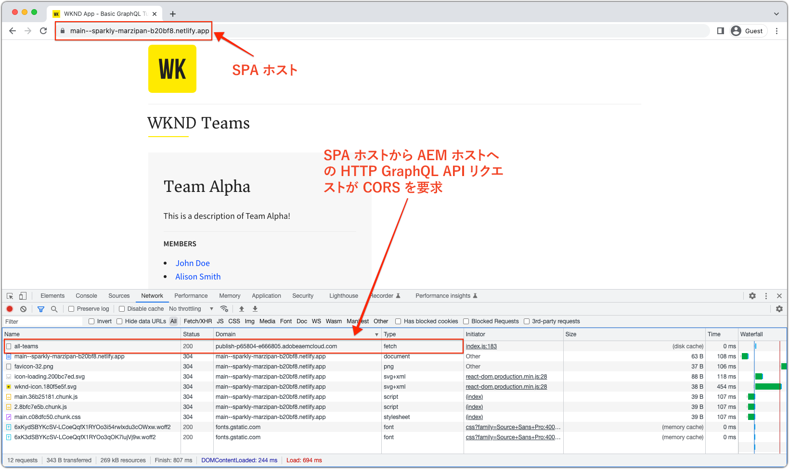
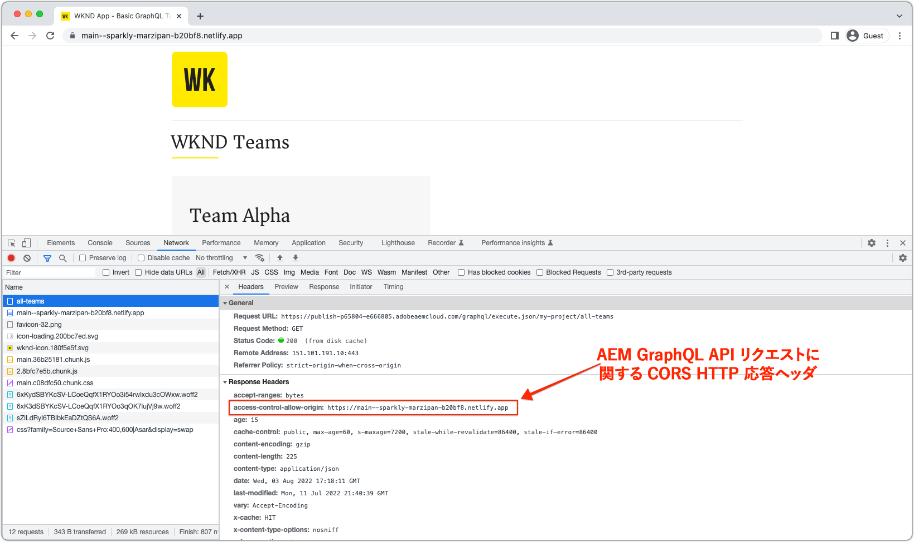

# AEM ヘッドレス SPA デプロイメント

AEM ヘッドレスシングルページアプリ（SPA）のデプロイメントには、React や Vue などのフレームワークを使用して作成された JavaScript ベースのアプリケーションが含まれます。これらのアプリケーションは、AEM のコンテンツをヘッドレスで使用および操作します。

AEM をヘッドレスで操作する SPA をデプロイするには、SPA をホストし、web ブラウザー経由でアクセスできるようにする必要があります。

## SPA のホスト

SPA は、**HTML、CSS、JavaScript** のネイティブ web リソースのコレクションで構成されます。これらのリソースは、_ビルド_&#x200B;プロセス（`npm run build` など）中に生成され、エンドユーザーが使用できるようにホストにデプロイされます。

組織の要件に応じて、様々な&#x200B;**ホスティング**&#x200B;オプションがあります。

1. **Azure** や **AWS** などの&#x200B;**クラウドプロバイダー**。

2. 企業&#x200B;**データセンター**&#x200B;での&#x200B;**オンプレミス**&#x200B;ホスティング

3. **AWS Amplify**、**Azure App Service**、**Netlify**、**Heroku**、**Vercel** などの&#x200B;**フロントエンドホスティングプラットフォーム**。

## デプロイメント設定

AEM ヘッドレスを操作する SPA をホストする場合の主な考慮事項は、SPA には AEM のドメイン（またはホスト）経由でアクセスするか、様々なドメインでアクセスするかです。その理由は、SPA は web ブラウザーで実行される web アプリケーションであり、web ブラウザーのセキュリティポリシーの対象となるからです。

### 共有ドメイン

SPA と AEM は、両方が同じドメインからエンドユーザーによってアクセスされる場合、ドメインを共有します。次に例を示します。

+ AEM には `https://wknd.site/` 経由でアクセスできます
+ SPA には `https://wknd.site/spa` 経由でアクセスできます

AEM と SPA の両方に同じドメインからアクセスできるので、web ブラウザーは、SPA が CORS を必要とせずに XHR を AEM ヘッドレスエンドポイントに作成し、HTTP Cookie（AEM の `login-token` Cookie など）を共有できるようにします。

SPA と AEM のトラフィックが共有ドメインでどのようにルーティングされるかは、ユーザー次第です。つまり、複数のオリジンを持つ CDN、リバースプロキシを持つ HTTP サーバー、AEM で直接 SPA をホストするなどです。

AEM と同じドメインでホストされている場合に、SPA 実稼動デプロイメントに必要なデプロイメント設定を以下に示します。

| SPAから→への接続 | AEM オーサー | AEM パブリッシュ | AEM プレビュー |
|---------------------------------------------------:|:----------:|:-----------:|:-----------:|
| [Dispatcher フィルター](./configurations/dispatcher-filters.md) | ✘ | ✔ | ✔ |
| クロスオリジンリソース共有（CORS） | ✘ | ✘ | ✘ |
| AEM ホスト | ✘ | ✘ | ✘ |

### 異なるドメイン

異なるドメインからエンドユーザーがアクセスする場合、SPA と AEM には異なるドメインがあります。次に例を示します。

+ AEM には `https://wknd.site/` 経由でアクセスできます
+ SPA には `https://wknd-app.site/` 経由でアクセスできます

AEM と SPA には異なるドメインからアクセスできるので、web ブラウザーは[クロスオリジンリソース共有（CORS）](./configurations/cors.md)などのセキュリティポリシーを適用し、HTTP Cookie（AEM の `login-token` Cookie など）の共有を防ぎます。

AEM と異なるドメインでホストされている場合に、SPA 実稼動デプロイメントに必要なデプロイメント設定を以下に示します。

| SPAから→への接続 | AEM オーサー | AEM パブリッシュ | AEM プレビュー |
|---------------------------------------------------:|:----------:|:-----------:|:-----------:|
| [Dispatcher フィルター](./configurations/dispatcher-filters.md) | ✘ | ✔ | ✔ |
| [クロスオリジンリソース共有（CORS）](./configurations/cors.md) | ✔ | ✔ | ✔ |
| [AEM ホスト](./configurations/aem-hosts.md) | ✔ | ✔ | ✔ |

#### 異なるドメインでの SPA デプロイメントの例

この例では、SPA は Netlify ドメイン（`https://main--sparkly-marzipan-b20bf8.netlify.app/`）にデプロイされ、SPA は AEM パブリッシュドメイン（`https://publish-p65804-e666805.adobeaemcloud.com`）から AEM GraphQL API を使用します。以下のスクリーンショットは、CORS 要件をハイライト表示しています。

1. SPA は Netlify ドメインから提供されますが、異なるドメインで AEM GraphQL API への XHR 呼び出しを行います。このクロスサイトリクエストでは、AEM で [CORS](./configurations/cors.md) を設定して、Netlify ドメインからのリクエストがそのコンテンツにアクセスできるようにする必要があります。

   

2. AEM GraphQL API への XHR リクエストを検査すると、`Access-Control-Allow-Origin` が存在し、この Netlify ドメインからのリクエストがそのコンテンツにアクセスすることを AEM が許可することを web ブラウザーに示します。

   AEM [CORS](./configurations/cors.md) が見つからなかったか、Netlify ドメインが含まれていなかった場合、web ブラウザーは XHR リクエストに失敗し、CORS エラーを報告します。

   

## シングルページアプリの例

アドビは、React でコード化された単一ページアプリの例を提供しています。

<!-- React app -->

   

       

           <figure class="image is-16by9">
               
           </figure>
       

       

           

               
<a href="../example-apps/react-app.md" title="React アプリ">React アプリ</a>

               
AEM ヘッドレス GraphQL API のコンテンツを使用する、React で記述された単一ページアプリの例です。

               <a href="../example-apps/react-app.md" class="spectrum-Button spectrum-Button--outline spectrum-Button--primary spectrum-Button--sizeM">
 例を表示
 </a>
           

       

   

<!-- Next.js app -->

   

       

           <figure class="image is-16by9">
               
           </figure>
       

       

           

               
<a href="../example-apps/next-js.md" title="Next.js アプリケーション">Next.js アプリケーション</a>

               
AEM ヘッドレス GraphQL API のコンテンツを使用する Next.js で記述された単一ページアプリの例です。

               <a href="../example-apps/next-js.md" class="spectrum-Button spectrum-Button--outline spectrum-Button--primary spectrum-Button--sizeM">
 例を表示
 </a>
           

       

   

