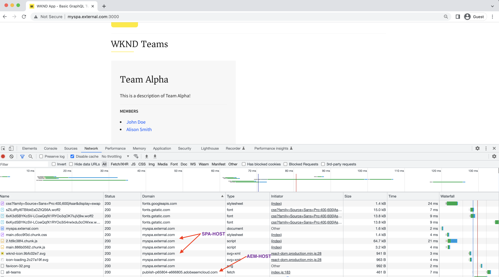
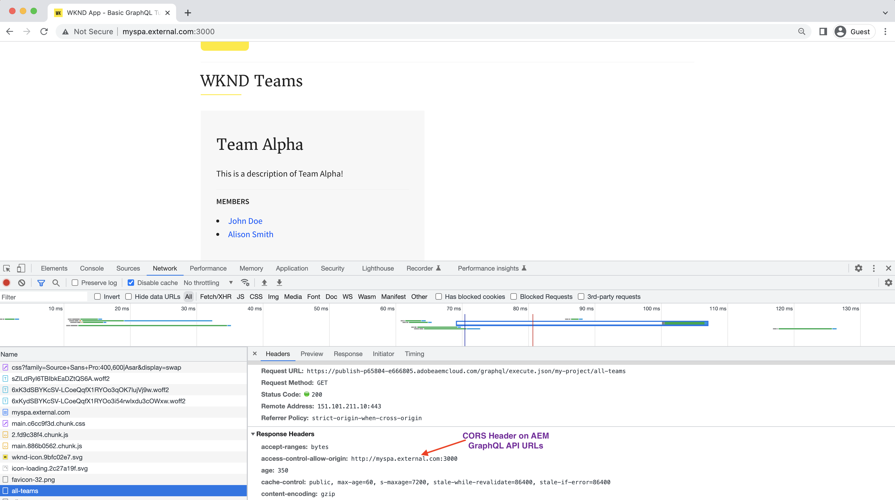

# SPAのデプロイ

この節では、AEM GraphQL API を呼び出してデータを読み込むSPA(React、Vue、Angularなど ) をデプロイする方法を確認します。ただし、その前に、デプロイする必要のある高レベルのアーティファクトについて理解しておきます。

**SPA Build App Artifacts:**

SPAフレームワークによって生成されたファイル ( 通常は **HTML、CSS、JS**、静的ビルドアーティファクトと呼ばれます。 React アプリの場合、 `build` ディレクトリと、 `dist` ディレクトリ。
SPAへのリクエスト ( 例：https://HOST/my-aem-spa.html) は、これらのビルドアーティファクトを使用して提供されます。

**AEM GraphQL API:**

この GraphQL API エンドポイント (`/graphql/execute.json/<PROJECT-CONFIG>/<PERSISTED-QUERY-NAME>`) は、AEMドメインでホストする必要があります。

概要では、SPAデプロイメントアーキテクチャには 2 つの部分があります。 *1. SPA 2. AEM GraphQL API レイヤー*&#x200B;では、これら 2 つの部分のデプロイメントオプションを確認しましょう。

## デプロイメントオプション

| デプロイメントオプション | SPA URL | AEM GraphQL API URL | CORS 設定が必要ですか？ |
| ---------|---------- | ---------|---------- |
| **同じドメイン** | https://**ホスト**/my-aem-spa.html | https://**ホスト**/graphql/execute.json/... | ✘ |
| **異なるドメイン** | https://**SPA-HOST**/my-aem-spa.html | https://**AEM-HOST**/graphql/execute.json/... | ✔ |

**同じドメイン：**\
両方 *SPA &amp; AEM GraphQL API レイヤー* ( このオプションは、 **同じドメイン**. SPA URI へのリクエストを意味します `/my-aem-spa.html` &amp; GraphQL API レイヤー `/graphql/execute.json/` はまったく同じドメインから提供されます。

**異なるドメイン：**\
両方 *SPA &amp; AEM GraphQL API レイヤー* このオプションは、次の場所にデプロイされます。 **異なるドメイン**. SPA URI へのリクエストを意味します `/my-aem-spa.html` が **異なるドメイン** GraphQL API レイヤーと比較 `/graphql/execute.json/` リクエスト。 このデプロイメントオプションの一部として、次の操作を行う必要があります。 [CORS の設定](cors.md) をAEMインスタンスに追加します。

>[!NOTE]
>
>AEMインスタンス上で CORS を適切に設定する必要があります。 [手順はこちらを参照してください](cors.md).

### 同じドメインでのデプロイ

同じドメインにをデプロイする場合、ドメインは **プライマリAEMドメイン** (AEM Domain の場合 ) または **プライマリSPAドメイン** (AEMドメイン外 )、および受信SPAのAEM GraphQL API 要求は、CDN ([Fastly](https://docs.fastly.com/en/guides/routing-assets-to-different-origins), Akamai, [CloudFront](https://aws.amazon.com/premiumsupport/knowledge-center/cloudfront-distribution-serve-content/)), [リバースプロキシを含む HTTPD](https://httpd.apache.org/docs/2.4/howto/reverse_proxy.html). つまり、SPAビルドアーティファクトとAEM GraphQL API を様々なサーバーにデプロイしますが、エンドユーザーの場合は、単一のドメインから配信され、異なる宛先サーバーまたはオリジンサーバーにルーティングされるシーンの背後に配信されます。

また、SPAビルドアーティファクトはAEMでホストできます *ただし、お勧めしません。*

| 同じドメインのデプロイメント | CDN 分割 | HTTPD +リバースプロキシ | AEM Hosted SPA Artifacts |
| ---------|---------- | ---------|---------- |
| **ON AEM Domain** | ✔ | ✔ | ✔ |
| **OFF AEM Domain** | ✔ | ✔ | **該当なし** |

**HTTPD +リバースプロキシ**

設定例を次に示します。

>[!TIP]
>
> 次の設定は例です。 プロジェクトの要件に合わせて調整してください。

AEM DOMAIN

    &quot;&#39;
    ProxyPass &quot;/${YOUR-SPA-URI}&quot; &quot;http://${SPA-HOST}/&quot;
    ProxyPassReverse &quot;/${YOUR-SPA-URI}&quot; &quot;http://${SPA-HOST}/&quot;
    &quot;&#39;

OFF AEM Domain

    &quot;&#39;
    ProxyPass &quot;/graphql/execute.json/&quot; &quot;http://${AEM-HOST}/&quot;
    ProxyPassReverse &quot;/graphql/execute.json/&quot; &quot;http://${AEM-HOST}/&quot;
    &quot;&#39;

### 異なるドメインでのデプロイ

このシナリオでは、SPAビルドアーティファクトは、AEM GraphQL API ドメインとは異なるドメインにデプロイされ、エンドユーザーの場合は、2 つの異なるドメインから配信されるので、 [CORS 設定](cors.md) はAEMで必須です。

**異なるドメインを介したSPA App Requests**

**AEM GraphQL API の CORS 応答ヘッダー**

