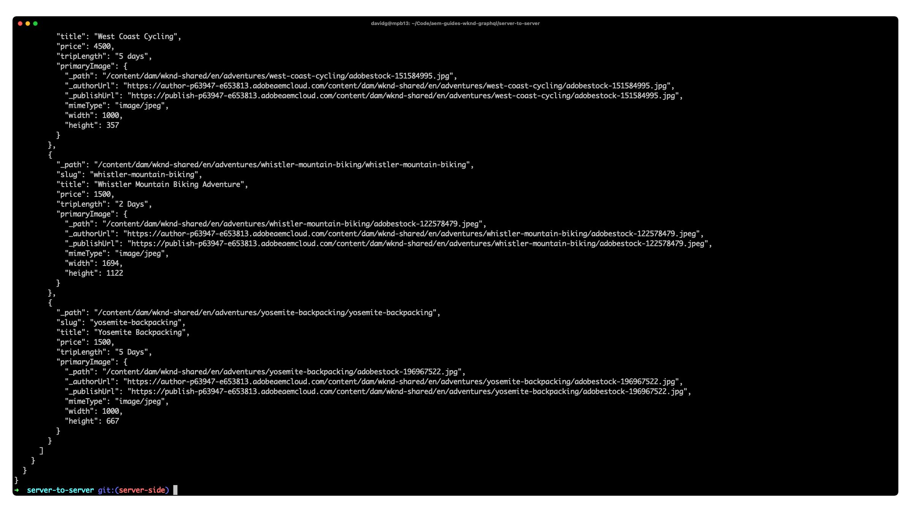

# サーバー間 Node.js アプリ

アプリケーション例は、Adobe Experience Manager(AEM) のヘッドレス機能を調べる優れた方法です。 このサーバー間アプリケーションでは、永続化されたクエリを使用してAEM GraphQL API でコンテンツに対してクエリを実行し、端末に印刷する方法を示します。



次を表示： [GitHub のソースコード](https://github.com/adobe/aem-guides-wknd-graphql/tree/main/server-to-server-app)

## 前提条件 {#prerequisites}

以下のツールをローカルにインストールする必要があります。

+ [Node.js v10 以降](https://nodejs.org/ja/)
+ [npm 6 以降](https://www.npmjs.com/)
+ [Git](https://git-scm.com/)

## AEM要件

Node.js アプリケーションは、次のAEMデプロイメントオプションと連携します。 すべてのデプロイメントには、 [WKND サイト v2.0.0 以降](https://github.com/adobe/aem-guides-wknd/releases/latest) をインストールします。

+ [AEM as a Cloud Service](https://experienceleague.adobe.com/docs/experience-manager-cloud-service/content/implementing/deploying/overview.html?lang=ja)
+ オプションで、 [サービス資格情報](https://experienceleague.adobe.com/docs/experience-manager-cloud-service/content/implementing/developing/generating-access-tokens-for-server-side-apis.html) リクエストを承認する場合（例えば、AEM オーサーサービスへの接続）。

この Node.js アプリケーションは、コマンドラインパラメーターに基づいて、AEM オーサーまたは AEM パブリッシュに接続できます。

## 使用方法

1. のクローン `adobe/aem-guides-wknd-graphql` リポジトリ：

   ```shell
   $ git clone git@github.com:adobe/aem-guides-wknd-graphql.git
   ```

1. ターミナルを開き、次のコマンドを実行します。

   ```shell
   $ cd aem-guides-wknd-graphql/server-to-server-app
   $ npm install
   ```

1. デスクトップアプリケーションは、次のコマンドを使用して実行できます。

   ```
   $ node index.js <AEM_HOST> <OPTIONAL_SERVICE_CONFIG_FILE_PATH>
   ```

   例えば、認証なしで AEM パブリッシュに対してアプリを実行するには、次のようにします。

   ```shell
   $ node index.js https://publish-p123-e789.adobeaemcloud.com
   ```

   認証を持つ AEM オーサーに対してアプリを実行するには：

   ```shell
   $ node index.js https://author-p123-e456.adobeaemcloud.com ./service-config.json
   ```

1. WKND リファレンスサイトのアドベンチャーの JSON リストをターミナルに印刷する必要があります。

## コード

サーバー間 Node.js アプリケーションの構築方法、GraphQL の永続クエリを使用してコンテンツを取得するAEMヘッドレスへの接続方法、およびそのデータの表示方法の概要を次に示します。 完全なコードは、 [GitHub](https://github.com/adobe/aem-guides-wknd-graphql/tree/main/server-to-server-app).

サーバー間AEMヘッドレスアプリの一般的な使用例は、AEMのコンテンツフラグメントデータを他のシステムに同期することですが、このアプリケーションは意図的に単純で、永続化されたクエリから JSON 結果を出力します。

### 永続クエリ

AEMヘッドレスのベストプラクティスに従い、アプリケーションはAEM GraphQL に永続化されたクエリを使用して、アドベンチャーデータをクエリします。 アプリケーションでは、次の 2 つの永続クエリを使用します。

+ `wknd/adventures-all` 持続的なクエリで、AEM内のすべてのアドベンチャを簡潔なプロパティセットで返します。 この永続的なクエリは、初期ビューのアドベンチャーリストを駆動します。

```
# Retrieves a list of all adventures
{
    adventureList {
        items {
            _path
            slug
            title
            price
            tripLength
            primaryImage {
                ... on ImageRef {
                _path
                mimeType
                width
                height
                }
            }
        }
    }
}
```

### AEM Headless クライアントを作成

```javascript
const { AEMHeadless, getToken } = require('@adobe/aem-headless-client-nodejs');

async function run() { 

    // Parse the AEM host, and optional service credentials from the command line arguments
    const args = process.argv.slice(2);
    const aemHost = args.length > 0 ? args[0] : null;                // Example: https://author-p123-e456.adobeaemcloud.com
    const serviceCredentialsFile = args.length > 1 ? args[1] : null; // Example: ./service-config.json

    // If service credentials are provided via command line argument,
    // use `getToken(..)` to exchange them with Adobe IMS for an AEM access token 
    let accessToken;
    if (serviceCredentialsFile) {
        accessToken = (await getToken(serviceCredentialsFile)).accessToken;
    }

    // Instantiate withe AEM Headless client to query AEM GraphQL APIs
    // The endpoint is left blank since only persisted queries should be used to query AEM's GraphQL APIs
    const aemHeadlessClient = new AEMHeadless({
        serviceURL: aemHost,
        endpoint: '',           // Avoid non-persisted queries
        auth: accessToken       // accessToken only set if the 2nd command line parameter is set
    })
    ...
}
```


### GraphQL 永続クエリを実行

AEMで永続化されたクエリは HTTPGETを介して実行されるので、 [AEM Node.js 用ヘッドレスクライアント](https://github.com/adobe/aem-headless-client-nodejs) は [永続化された GraphQL クエリの実行](https://github.com/adobe/aem-headless-client-nodejs#within-asyncawait) AEMに対してを設定し、アドベンチャーコンテンツを取得します。

永続化されたクエリは、 `aemHeadlessClient.runPersistedQuery(...)`、永続化された GraphQL クエリ名を渡す GraphQL がデータを返したら、それを簡略化されたに渡します `doSomethingWithDataFromAEM(..)` 関数を使用して、結果を出力します。ただし、通常は別のシステムにデータを送信するか、取得したデータに基づいて出力を生成します。

```js
// index.js

async function run() { 
    ...
    try {
        // Retrieve the data from AEM GraphQL APIs
        data = await aemHeadlessClient.runPersistedQuery('wknd-shared/adventures-all')
        
        // Do something with the data from AEM. 
        // A common use case is sending the data to another system.
        await doSomethingWithDataFromAEM(data);
    } catch (e) {
        console.error(e.toJSON())
    }
}
```
