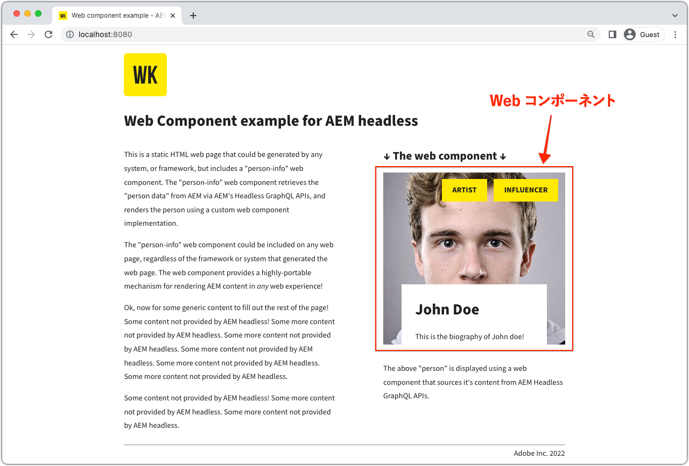

# Web コンポーネント

サンプルアプリケーションは、Adobe Experience Manager（AEM）のヘッドレス機能を調べるうえで役に立ちます。 この web コンポーネントアプリケーションでは、永続クエリを使用して AEM の GraphQL API でコンテンツをクエリし、純粋な JavaScript コードを使用して UI の一部をレンダリングする方法を示します。



[GitHub のソースコード](https://github.com/adobe/aem-guides-wknd-graphql/tree/main/web-component)を表示

## 前提条件 {#prerequisites}

次のツールをローカルにインストールする必要があります。

+ [Node.js v18](https://nodejs.org/ja/)
+ [Git](https://git-scm.com/)

## AEM の要件

Web コンポーネントは、次の AEM デプロイメントオプションと連携します。

+ [AEM as a Cloud Service](https://experienceleague.adobe.com/docs/experience-manager-cloud-service/content/implementing/deploying/overview.html?lang=ja)
+ [AEM Cloud Service SDK](https://experienceleague.adobe.com/docs/experience-manager-learn/cloud-service/local-development-environment-set-up/overview.html?lang=ja) を使用したローカル設定
   + [JDK 11](https://experience.adobe.com/#/downloads/content/software-distribution/jp/general.html?1_group.propertyvalues.property=.%2Fjcr%3Acontent%2Fmetadata%2Fdc%3AsoftwareType&amp;1_group.propertyvalues.operation=equals&amp;1_group.propertyvalues.0_values=software-type%3Atooling&amp;fulltext=Oracle%7E+JDK%7E+11%7E&amp;orderby=%40jcr%3Acontent%2Fjcr%3AlastModified&amp;orderby.sort=desc&amp;layout=list&amp;p.offset=0&amp;p.limit=14) が必要（ローカルの AEM 6.5 または AEM SDK に接続する場合）

このアプリの例は、[basic-tutorial-solution.content.zip](../multi-step/assets/explore-graphql-api/basic-tutorial-solution.content.zip) がインストールされ、必要な[デプロイメント設定](../deployment/web-component.md)が整っていることに依存します。


>[!IMPORTANT]
>
>Web コンポーネントは __AEM パブリッシュ__&#x200B;環境に接続するように作られていますが、web コンポーネントの [`person.js`](https://github.com/adobe/aem-guides-wknd-graphql/blob/main/web-component/src/person.js#L11) ファイルで認証情報が提供されている場合は、AEM オーサーからコンテンツを取得できます。

## 使用方法

1.  `adobe/aem-guides-wknd-graphql` リポジトリのクローンを作成します。

   ```shell
   $ git clone git@github.com:adobe/aem-guides-wknd-graphql.git
   ```

1. `web-component` サブディレクトリに移動します。

   ```shell
   $ cd aem-guides-wknd-graphql/web-component
   ```

1. `.../src/person.js` ファイルを編集して、AEM 接続の詳細を次のように指定します。

   `aemHeadlessService` オブジェクトで、`aemHost` を更新して、AEM パブリッシュサービスを指すように設定します。

   ```plain
   # AEM Server namespace
   aemHost=https://publish-p123-e456.adobeaemcloud.com
   
   # AEM GraphQL API and Persisted Query Details
   graphqlAPIEndpoint=graphql/execute.json
   projectName=my-project
   persistedQueryName=person-by-name
   queryParamName=name
   ```

   AEM オーサーサービスに接続する場合は、 `aemCredentials` オブジェクトで、ローカルの AEM ユーザー資格情報を入力します。

   ```plain
   # For Basic auth, use AEM ['user','pass'] pair (for example, when connecting to local AEM Author instance)
   username=admin
   password=admin
   ```

1. ターミナルを開き、 `aem-guides-wknd-graphql/web-component` から次のコマンドを実行します。

   ```shell
   $ npm install
   $ npm start
   ```

1. web コンポーネントを埋め込んだ静的 HTML ページ（[http://localhost:8080](http://localhost:8080)）が新しいブラウザーウィンドウで開かれます。
1. _ユーザー情報_ web コンポーネントが web ページに表示されます。

## コード

Web コンポーネントを作成する方法、web コンポーネントから AEM ヘッドレスに接続して GraphQL 永続クエリを使用してコンテンツを取得する方法およびそのデータを表示する方法の概要を以下に示します。 完全なコードは、[GitHub](https://github.com/adobe/aem-guides-wknd-graphql/tree/main/web-component) に掲載されています。

### Web コンポーネント HTML タグ

再利用可能な web コンポーネント（カスタム要素）`<person-info>` が `../src/assets/aem-headless.html` HTML ページに追加されています。コンポーネントの動作を制御する `host` および `query-param-value` 属性をサポートしています。  `host` 属性の値は `person.js` の `aemHeadlessService` オブジェクトにある `aemHost` 値をオーバーライドし、 `query-param-value` を使用してレンダリングするユーザーを選択します。

```html
    <person-info 
        host="https://publish-p123-e456.adobeaemcloud.com"
        query-param-value="John Doe">
    </person-info>
```

### Web コンポーネントの実装

`person.js` は Web コンポーネント機能を定義しています。要点は次のとおりです。

#### PersonInfo 要素の実装

`<person-info>` カスタム要素のクラスオブジェクトでは機能の定義にあたって、`connectedCallback()` ライフサイクルメソッドを使用し、シャドウルートを関連付け、GraphQL 永続クエリを取得し、DOM 操作でカスタム要素の内部シャドウ DOM 構造を作成します。

```javascript
// Create a Class for our Custom Element (person-info)
class PersonInfo extends HTMLElement {

    constructor() {
        ...
        // Create a shadow root
        const shadowRoot = this.attachShadow({ mode: "open" });
        ...
    }

    ...

    // lifecycle callback :: When custom element is appended to document
    connectedCallback() {
        ...
        // Fetch GraphQL persisted query
        this.fetchPersonByNamePersistedQuery(headlessAPIURL, queryParamValue).then(
            ({ data, err }) => {
                if (err) {
                    console.log("Error while fetching data");
                } else if (data?.personList?.items.length === 1) {
                    // DOM manipulation
                    this.renderPersonInfoViaTemplate(data.personList.items[0], host);
                } else {
                    console.log(`Cannot find person with name: ${queryParamValue}`);
                }
            }
        );
    }

    ...

    //Fetch API makes HTTP GET to AEM GraphQL persisted query
    async fetchPersonByNamePersistedQuery(headlessAPIURL, queryParamValue) {
        ...
        const response = await fetch(
            `${headlessAPIURL}/${aemHeadlessService.persistedQueryName}${encodedParam}`,
            fetchOptions
        );
        ...
    }

    // DOM manipulation to create the custom element's internal shadow DOM structure
    renderPersonInfoViaTemplate(person, host){
        ...
        const personTemplateElement = document.getElementById('person-template');
        const templateContent = personTemplateElement.content;
        const personImgElement = templateContent.querySelector('.person_image');
        personImgElement.setAttribute('src',
            host + (person.profilePicture._dynamicUrl || person.profilePicture._path));
        personImgElement.setAttribute('alt', person.fullName);
        ...
        this.shadowRoot.appendChild(templateContent.cloneNode(true));
    }
}
```

#### `<person-info>` 要素の登録

```javascript
    // Define the person-info element
    customElements.define("person-info", PersonInfo);
```

### クロスオリジンリソース共有（CORS）

この web コンポーネントは、ターゲット AEM 環境で動作する AEM ベースの CORS 設定に基づいており、ホスト ページが `http://localhost:8080` 上で開発モードで実行されていることを前提としています。以下は、ローカル AEM オーサーサービスのサンプル CORS OSGi 設定です。

各 AEM サービスの [デプロイメント設定](../deployment/web-component.md)を確認してください。
