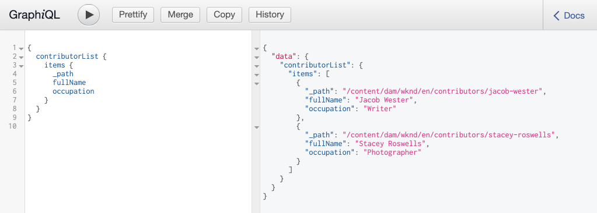

# GraphQL APIを参照{#explore-graphql-apis}

AEMのGraphQL APIは、コンテンツフラグメントのデータを下流のアプリケーションに公開するための強力なクエリ言語を提供します。 コンテンツフラグメントモデルは、コンテンツフラグメントで使用されるデータスキーマを定義します。 コンテンツフラグメントモデルを作成または更新するたびに、スキーマが変換され、GraphQL APIを構成する「グラフ」に追加されます。

この章では、[GraphiQL](https://github.com/graphql/graphiql)と呼ばれるIDEを使用してコンテンツを収集する、一般的なGraphQLクエリをいくつか紹介します。 GraphicQL IDEを使用すると、返されたクエリとデータをすばやくテストし、調整できます。 また、GraphiQLではドキュメントに簡単にアクセスでき、使用可能な方法を簡単に確認し、理解できます。

## 前提条件 {#prerequisites}

これはマルチパート形式のチュートリアルで、[コンテンツフラグメントのオーサリング](./author-content-fragments.md)で説明されている手順が完了していることを前提としています。

## 目的 {#objectives}

* GraphQL構文を使用してクエリを構築するGraphiQLツールの使い方を学びます。
* コンテンツフラグメントと1つのコンテンツフラグメントのリストをクエリする方法を説明します。
* 特定のデータ属性をフィルタリングして要求する方法を説明します。
* コンテンツフラグメントのバリエーションをクエリする方法を説明します。
* 複数のコンテンツフラグメントモデルのクエリを結合する方法を学びます。

## GraphiQLツールのインストール{#install-graphiql}

GraphiQL IDEは開発ツールで、開発またはローカルインスタンスのような下位レベルの環境でのみ必要です。 したがって、AEMプロジェクトには含まれず、アドホックにインストールできる別のパッケージとして提供されます。

1. **[Cloud Service**&#x200B;として、Software Distribution Portal](https://experience.adobe.com/#/downloads/content/software-distribution/jp/aemcloud.html)**>** AEMに移動します。
1. 「GraphiQL」を探します（**GraphiQL**&#x200B;には&#x200B;**i**&#x200B;を必ず含めてください）。
1. 最新の&#x200B;**GraphicQL Content Package v.x.x.x**&#x200B;をダウンロードします。

   

   zipファイルは、直接インストールできるAEMパッケージです。

1. **AEM開始**&#x200B;メニューから&#x200B;**ツール**/**展開**/**パッケージ**&#x200B;に移動します。
1. 「パッケージ&#x200B;**アップロード**」をクリックし、前の手順でダウンロードしたパッケージを選択します。 **「**&#x200B;をインストール」をクリックして、パッケージをインストールします。

   

## コンテンツフラグメントのリストのクエリ{#query-list-cf}

一般的な要件は、複数のコンテンツフラグメントに対してクエリを行うことです。

1. [http://localhost:4502/content/graphiql.html](http://localhost:4502/content/graphiql.html)にあるGraphicQL IDEに移動します。
1. 左のパネル(コメントのリストの下)に次のクエリを貼り付けます。

   ```graphql
   {
     contributorList {
       items {
           _path
         }
     }
   }
   ```

1. トップメニューの&#x200B;**再生**&#x200B;ボタンを押して、クエリを実行します。 前の章の寄稿者コンテンツフラグメントの結果を確認する必要があります。

   

1. カーソルを`_path`テキストの下に置き、**Ctrl +スペース**&#x200B;キーを押して、トリガーコードのヒントを入力します。 追加`fullName`と`occupation`をクエリに送信します。

   

1. 「**再生**」ボタンを押してクエリを再実行します。結果には、`fullName`と`occupation`の追加プロパティが含まれます。

   

   `fullName` と `occupation` は単純な特性です。「[コンテンツフラグメントモデルの定義](./content-fragment-models.md)」の章から、`fullName`と`occupation`が、各フィールドの&#x200B;**プロパティ名**&#x200B;を定義する際に使用される値であることを思い出してください。

1. `pictureReference` とは、より複雑なフィールドを `biographyText` 表します。`pictureReference`フィールドと`biographyText`フィールドに関するデータを返すには、クエリを次の値に更新します。

   ```graphql
   {
   contributorList {
       items {
         _path
         fullName
         occupation
         biographyText {
           html
         }
         pictureReference {
           ... on ImageRef {
               _path
               width
               height
               }
           }
       }
     }
   }
   ```

   `biographyText` は複数行のテキストフィールドで、GraphQL APIを使用すると、、 `html`、などの結果に対して様々な形式を選択でき `markdown` `json`  `plaintext`ます。

   `pictureReference` はコンテンツ参照であり、画像であると見なされるので、組み込み `ImageRef` オブジェクトが使用されます。これにより、`width`や`height`のように、参照中のイメージに関する追加のデータを要求できます。

1. 次に、**冒険**&#x200B;のリストを調べてみてください。 次のクエリを実行します。

   ```graphql
   {
     adventureList {
       items {
         adventureTitle
         adventureType
         adventurePrimaryImage {
           ...on ImageRef {
             _path
             mimeType
           }
         }
       }
     }
   }
   ```

   **Adventures**&#x200B;のリストが返されます。 クエリにフィールドを追加して、自由にテストしてください。

## コンテンツフラグメントのリストのフィルター{#filter-list-cf}

次に、プロパティ値に基づいてコンテンツフラグメントのサブセットに結果をフィルタリングする方法を見てみましょう。

1. GraphicQL UIで次のクエリを入力します。

   ```graphql
   {
   contributorList(filter: {
     occupation: {
       _expressions: {
         value: "Photographer"
         }
       }
     }) {
       items {
         _path
         fullName
         occupation
       }
     }
   }
   ```

   上記のクエリは、システム内のすべての寄稿者に対して検索を実行します。 クエリの先頭に追加されたフィルターは、`occupation`フィールドと文字列「**Photographer**」に対する比較を実行します。

1. クエリを実行すると、1つの&#x200B;**寄稿者**&#x200B;のみが返されます。
1. 次のクエリを入力して、**Adventures**&#x200B;のリストをクエリします。`adventureActivity`は&#x200B;**&quot;Surfing&quot;**&#x200B;と等しくない&#x200B;****&#x200B;です。

   ```graphql
   {
     adventureList(filter: {
       adventureActivity: {
           _expressions: {
               _operator: EQUALS_NOT
               value: "Surfing"
           }
       }
   }) {
       items {
       _path
       adventureTitle
       adventureActivity
       }
     }
   }
   ```

1. クエリを実行し、結果を検査します。 結果に`adventureType`が&#x200B;**&quot;Surfing&quot;**&#x200B;と等しいものがないことを確認してください。

複雑なクエリのフィルタリングや作成には、他にも多数のオプションがあります。上の例はいくつかあります。

## 1つのコンテンツフラグメントのクエリ{#query-single-cf}

単一のコンテンツフラグメントを直接クエリすることもできます。 AEMのコンテンツは階層的に保存され、フラグメントの一意の識別子はフラグメントのパスに基づきます。 目的が1つのフラグメントに関するデータを返すことである場合は、モデルのパスとクエリを直接使用することをお勧めします。 この構文を使用すると、クエリの複雑さが非常に少なくなり、より高速な結果が得られます。

1. GraphicQLエディタで次のクエリを入力します。

   ```graphql
   {
    contributorByPath(_path: "/content/dam/wknd/en/contributors/stacey-roswells") {
       item {
         _path
         fullName
         biographyText {
           html
         }
       }
     }
   }
   ```

1. クエリを実行し、**Stacey Roswells**&#x200B;フラグメントの結果が1つだけ返されることを確認します。

   前の練習では、フィルタを使用して結果のリストを絞り込みました。 パスでフィルターする場合も同様の構文を使用できますが、パフォーマンス上の理由から、上記の構文をお勧めします。

1. [オーサリングコンテンツフラグメント](./author-content-fragments.md)の章で、**Stacey Roswells**&#x200B;用に&#x200B;**概要**&#x200B;のバリエーションが作成されたことを思い出してください。 クエリを更新して、**概要**&#x200B;のバリエーションを返します。

   ```graphql
   {
   contributorByPath
   (
       _path: "/content/dam/wknd/en/contributors/stacey-roswells"
       variation: "summary"
   ) {
       item {
         _path
         fullName
         biographyText {
           html
         }
       }
     }
   }
   ```

   バリエーション名が&#x200B;**概要**&#x200B;であっても、バリエーションは小文字で保持されるので、`summary`が使用されます。

1. クエリを実行し、`biography`フィールドの結果が非常に短い`html`を含むことを確認します。

## 複数のコンテンツフラグメントモデルのクエリ{#query-multiple-models}

別々のクエリを1つのクエリに組み合わせることもできます。 これは、アプリケーションの電源を投入するために必要なHTTP要求の数を最小限に抑えるのに役立ちます。 例えば、アプリケーションの&#x200B;*ホーム*&#x200B;表示では、**2つの**&#x200B;異なるコンテンツフラグメントモデルに基づいてコンテンツを表示できます。 **2つの**&#x200B;個別のクエリを実行する代わりに、クエリを1つのリクエストに組み合わせることができます。

1. GraphicQLエディタで次のクエリを入力します。

   ```graphql
   {
     adventureList {
       items {
         _path
         adventureTitle
       }
     }
     contributorList {
       items {
         _path
         fullName
       }
     }
   }
   ```

1. クエリを実行し、結果セットに&#x200B;**Adventures**&#x200B;と&#x200B;**Contributors**&#x200B;のデータが含まれていることを確認します。

```json
{
  "data": {
    "adventureList": {
      "items": [
        {
          "_path": "/content/dam/wknd/en/adventures/bali-surf-camp/bali-surf-camp",
          "adventureTitle": "Bali Surf Camp"
        },
        {
          "_path": "/content/dam/wknd/en/adventures/beervana-portland/beervana-in-portland",
          "adventureTitle": "Beervana in Portland"
        },
        ...
      ]
    },
    "contributorList": {
      "items": [
        {
          "_path": "/content/dam/wknd/en/contributors/jacob-wester",
          "fullName": "Jacob Wester"
        },
        {
          "_path": "/content/dam/wknd/en/contributors/stacey-roswells",
          "fullName": "Stacey Roswells"
        }
      ]
    }
  }
}
```

## その他のリソース

GraphQLクエリの他の多くの例については、以下を参照してください。[AEMでのGraphQLの使い方の学習 — サンプルコンテンツとクエリ](https://experienceleague.adobe.com/docs/experience-manager-cloud-service/assets/admin/content-fragments-graphql-samples.html)

## これで完了です! {#congratulations}

GraphQLクエリをいくつか作成し、実行しました。

## 次の手順 {#next-steps}

次の章「[React app](./graphql-and-external-app.md)からのAEMのクエリ」では、外部アプリケーションがAEM GraphQLエンドポイントをクエリする方法について説明します。 サンプルのWKND GraphQL Reactアプリを変更する外部アプリで、GraphQLクエリにフィルターを追加し、アクティビティによってアプリのアドベンチャーをフィルターできます。 また、基本的なエラー処理についても説明します。
