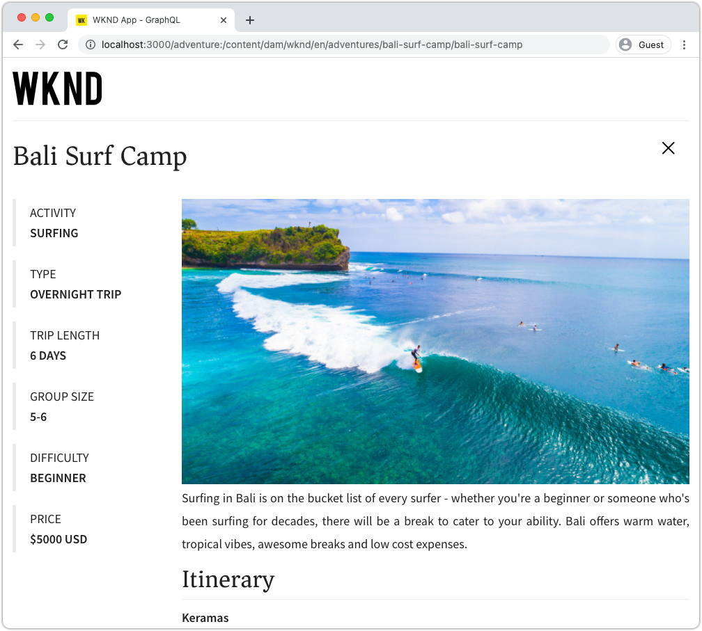

# 外部アプリからGraphQLを使用したクエリAEM

この章では、AEM GraphQL APIを使用して外部アプリケーションのエクスペリエンスを駆動する方法について説明します。

このチュートリアルでは、簡単なReact Appをクエリに使用し、AEM GraphQL APIによって公開されたアドベンチャーコンテンツを表示します。 Reactの使用はほとんど重要ではありません。消費する外部アプリケーションは、どのプラットフォームのフレームワークでも記述できます。

## 前提条件

これはマルチパートのチュートリアルで、前の部分で説明した手順が完了していることを前提としています。

_この章のIDEのスクリーンショットは、 [Visual Studio Codeに基づいています。](https://code.visualstudio.com/)_

必要に応じて、[GraphQL Network](https://chrome.google.com/webstore/detail/graphql-network/igbmhmnkobkjalekgiehijefpkdemocm)のようなブラウザ拡張をインストールし、GraphQLクエリに関する詳細を表示できるようにします。

## 目的

この章では、次の方法について学びます。

* サンプルReactアプリの機能の開始と理解
* 外部アプリからAEM GraphQLエンドポイントへの呼び出しの実施方法の調査
* GraphQLクエリを定義し、コンテンツフラグメントのリストをアクティビティでフィルタリングする
* Reactアプリを更新し、GraphQL(アクティビティによるアドベンチャーのリスト)でフィルタリングするコントロールを提供

## Reactアプリの開始

この章では、GraphQL上でコンテンツフラグメントを使用するクライアントの開発に重点を置いているので、サンプル[WKND GraphQL Reactアプリソースコードをダウンロードしてローカルマシンに](./setup.md#react-app)設定し、[AEM SDKを[サンプルWKNDサイトと共に実行します](./setup.md#wknd-site)。](./setup.md#aem-sdk)

Reactアプリの起動について詳しくは、[クイックセットアップ](./setup.md)の章で説明されていますが、簡潔な説明に従うこともできます。

1. まだサンプルのWKND GraphQL Reactアプリをコピーしていない場合は、[Github.com](https://github.com/adobe/aem-guides-wknd-graphql)からコピーします。

   ```shell
   $ git clone --branch tutorial/react git@github.com:adobe/aem-guides-wknd-graphql.git
   ```

1. IDEでWKND GraphQL Reactアプリケーションを開きます

   

1. コマンドラインから`react-app`フォルダーに移動します
1. WKND GraphQL Reactアプリの開始。プロジェクトルート（`react-app`フォルダー）から次のコマンドを実行します。

   ```shell
   $ cd aem-guides-wknd-graphql/react-app
   $ npm start
   ```

1. [http://localhost:3000/](http://localhost:3000/)にあるアプリを確認します。 サンプルのReactアプリには、2つの主要な部分があります。

   * ホームエクスペリエンスは、AEMの&#x200B;__アドベンチャー__&#x200B;コンテンツフラグメントにGraphQLを使用してクエリを実行することで、WKNDアドベンチャーのインデックスとして機能します。 この章では、この表示を変更して、アクティビティによる冒険のフィルタリングをサポートします。

      

   * アドベンチャーの詳細エクスペリエンス。GraphQLを使用して、特定の&#x200B;__アドベンチャー__&#x200B;コンテンツフラグメントをクエリし、さらに多くのデータポイントを表示します。

      

1. ブラウザの開発ツールと[GraphQL Network](https://chrome.google.com/webstore/detail/graphql-network/igbmhmnkobkjalekgiehijefpkdemocm)のようなブラウザ拡張機能を使用して、AEMに送信されるGraphQLクエリとそのJSON応答を調べます。 このアプローチは、GraphQLリクエストと応答を監視し、正しく作成され、期待どおりの応答が得られるかを確認するために使用できます。

   

   *ReactアプリからAEMに送信されるGraphQLクエリ*

   

   *AEMからReactアプリへのJSON応答*

   クエリと応答は、GraphiQL IDEでの表示と一致する必要があります。

   >[!NOTE]
   >
   > 開発中に、Reactアプリは、WebPack開発サーバーを介してAEMにHTTPリクエストをプロキシするように設定されます。 Reactアプリが`http://localhost:3000`にリクエストを行い、`http://localhost:4502`上で実行されているAEM Authorサービスにプロキシします。 詳細については、ファイル`src/setupProxy.js`と`env.development`を確認してください。
   >
   > 開発環境以外のシナリオでは、ReactアプリはAEMに直接リクエストを行うように設定されます。

## アプリのGraphQLコードの確認

1. IDEで`src/api/useGraphQL.js`ファイルを開きます。

   これは、アプリの`query`に対する変更をリッスンする[リアクション効果フック](https://reactjs.org/docs/hooks-overview.html#effect-hook)で、変更時にAEM GraphQLエンドポイントにHTTPPOSTリクエストを行い、アプリに対するJSON応答を返します。

   ReactアプリがGraphQLクエリを行う必要が生じた場合は常に、このカスタム`useGraphQL(query)`フックを呼び出し、GraphQLを渡してAEMに送信します。

   このフックは、単純な`fetch`モジュールを使ってHTTPPOSTGraphQLリクエストを行いますが、[Apollo GraphQLクライアント](https://www.apollographql.com/docs/react/)などの他のモジュールも同様に使用できます。

1. IDEで`src/components/Adventures.js`を開きます。これは、ホーム表示のアドベンチャーリストを作成し、`useGraphQL`フックの呼び出しを確認します。

   このコードは、このファイルの下部で定義されている`query`を`allAdventuresQuery`に設定します。

   ```javascript
   const [query, setQuery] = useState(allAdventuresQuery);
   ```

   ...そして`query`変数が変更されるたびに`useGraphQL`フックが呼び出され、これによりAEMに対してGraphQLクエリが実行され、JSONが`data`変数に返されます。この変数は、冒険のリストをレンダリングするために使用されます。

   ```javascript
   const { data, errorMessage } = useGraphQL(query);
   ```

   `allAdventuresQuery`は、すべてのAdventure Content Fragmentsをフィルタリングせずにクエリする、ファイル内で定義されている定数のGraphQLクエリで、ホーム表示をレンダリングする必要のあるデータポイントのみを返します。

   ```javascript
   const allAdventuresQuery = `
   {
       adventureList {
         items {
           _path
           adventureTitle
           adventurePrice
           adventureTripLength
           adventurePrimaryImage {
           ... on ImageRef {
               _path
               mimeType
               width
               height
             }
           }
         }
     }
   }
   `;
   ```

1. `src/components/AdventureDetail.js`を開き、アドベンチャーの詳細エクスペリエンスを表示するのは、Reactコンポーネントです。 この表示は、JCRパスを一意のIDとして使用して特定のコンテンツフラグメントをリクエストし、提供された詳細をレンダリングします。

   `Adventures.js`と同様に、カスタムの`useGraphQL` ReactHookはAEMに対するGraphQLクエリの実行に再利用されます。

   コンテンツフラグメントのパスは、コンポーネントの`props`上部から収集され、クエリするコンテンツフラグメントを指定するために使用されます。

   ```javascript
   const contentFragmentPath = props.location.pathname.substring(props.match.url.length);
   ```

   ... GraphQLパラメータ化クエリは`adventureDetailQuery(..)`関数を使って構築され、`useGraphQL(query)`に渡されます。この関数はAEMに対してGraphQLクエリを実行し、結果を`data`変数に返します。

   ```javascript
   const { data, errorMessage } = useGraphQL(adventureDetailQuery(contentFragmentPath));
   ```

   `adventureDetailQuery(..)`関数は、フィルタリングを行うGraphQLクエリを単純にラップします。この構文はAEM `<modelName>ByPath`構文を使用して、JCRパスで識別される単一のコンテンツフラグメントをクエリし、アドベンチャーの詳細をレンダリングするために必要な指定したすべてのデータポイントを返します。

   ```javascript
   function adventureDetailQuery(_path) {
   return `{
       adventureByPath (_path: "${_path}") {
         item {
           _path
           adventureTitle
           adventureActivity
           adventureType
           adventurePrice
           adventureTripLength
           adventureGroupSize
           adventureDifficulty
           adventurePrice
           adventurePrimaryImage {
               ... on ImageRef {
               _path
               mimeType
               width
               height
               }
           }
           adventureDescription {
               html
           }
           adventureItinerary {
               html
           }
         }
       }
   }
   `;
   }
   ```

## パラメータ化GraphQLクエリの作成

次に、React Appを変更して、パラメータ化を実行し、GraphQLクエリをフィルタリングして、アドベンチャーのアクティビティでホーム表示を制限します。

1. IDEで次のファイルを開きます。`src/components/Adventures.js`. このファイルは、Adventuresカードのクエリと表示を表すホームエクスペリエンスのアドベンチャーコンポーネントを表します。
1. Inspect関数`filterQuery(activity)`は未使用ですが、`activity`がフィルターを冒険させるGraphQLクエリを作る準備ができています。

   パラメータ`activity`は、`adventureActivity`フィールドの`filter`の一部としてGraphQLクエリに挿入されます。この場合、フィールドの値がパラメータの値と一致する必要があります。

   ```javascript
   function filterQuery(activity) {
       return `
           {
           adventures (filter: {
               adventureActivity: {
               _expressions: [
                   {
                   value: "${activity}"
                   }
                 ]
               }
           }){
               items {
               _path
               adventureTitle
               adventurePrice
               adventureTripLength
               adventurePrimaryImage {
               ... on ImageRef {
                   _path
                   mimeType
                   width
                   height
               }
               }
             }
         }
       }
       `;
   }
   ```

1. React Adventuresコンポーネントの`return`ステートメントを更新し、新しいパラメータ化`filterQuery(activity)`を呼び出すボタンを追加して、リストにアドベンチャーを提供します。

   ```javascript
   function Adventures() {
       ...
       return (
           <div className="adventures">
   
           {/* Add these three new buttons that set the GraphQL query accordingly */}
   
           {/* The first button uses the default `allAdventuresQuery` */}
           <button onClick={() => setQuery(allAdventuresQuery)}>All</button>
   
           {/* The 2nd and 3rd button use the `filterQuery(..)` to filter by activity */}
           <button onClick={() => setQuery(filterQuery('Camping'))}>Camping</button>
           <button onClick={() => setQuery(filterQuery('Surfing'))}>Surfing</button>
   
           <ul className="adventure-items">
           ...
       )
   }
   ```

1. 変更を保存し、WebブラウザーでReactアプリを再読み込みします。 上部に3つの新しいボタンが表示され、ボタンをクリックすると、自動的にAEMのアドベンチャーコンテンツフラグメントのクエリが、一致するアクティビティに再度行われます。

   

1. アクティビティ用のフィルターボタンをさらに追加してみます。`Rock Climbing`、`Cycling`、`Skiing`

## GraphQLエラーの処理

GraphQLは厳密に型指定されているので、クエリが無効な場合は役に立つエラーメッセージを返す可能性があります。 次に、誤ったクエリをシミュレートして、返されたエラーメッセージを確認します。

1. ファイル`src/api/useGraphQL.js`を再度開きます。 Inspectでのエラー処理を確認するには、次のスニペットを使用します。

   ```javascript
   //useGraphQL.js
   .then(({data, errors}) => {
           //If there are errors in the response set the error message
           if(errors) {
               setErrors(mapErrors(errors));
           }
           //Otherwise if data in the response set the data as the results
           if(data) {
               setData(data);
           }
       })
       .catch((error) => {
           setErrors(error);
       });
   ```

   応答に`errors`オブジェクトが含まれているかどうかを調べます。 GraphQLクエリに問題がある場合(スキーマに基づく未定義のフィールドなど)、AEMは`errors`オブジェクトを送信します。 `errors`オブジェクトがない場合、`data`が設定されて返されます。

   `window.fetch`には、無効なHTTP要求などの一般的なエラー、またはサーバーへの接続ができない場合に、*catch*&#x200B;に対する`.catch`ステートメントが含まれています。

1. `src/components/Adventures.js` ファイルを開きます。
1. `allAdventuresQuery`を変更して無効なプロパティ`adventurePetPolicy`を含めます。

   ```javascript
   /**
    * Query for all Adventures
    * adventurePetPolicy has been added beneath items
   */
   const allAdventuresQuery = `
   {
       adventureList {
         items {
           adventurePetPolicy
           _path
           adventureTitle
           adventurePrice
           adventureTripLength
           adventurePrimaryImage {
           ... on ImageRef {
               _path
               mimeType
               width
               height
           }
           }
         }
       }
   }
   `;
   ```

   `adventurePetPolicy`がアドベンチャーモデルに含まれていないので、トリガーにエラーが発生するはずです。

1. 変更を保存し、ブラウザーに戻ります。 次のようなエラーメッセージが表示されます。

   

   GraphQL APIは、`AdventureModel`内で`adventurePetPolicy`が未定義であることを検出し、適切なエラーメッセージを返します。

1. AEMからの応答をInspectし、ブラウザーの開発者ツールを使用して`errors` JSONオブジェクトを表示します。

   

   `errors`オブジェクトは冗長であり、無効なクエリの場所とエラーの分類に関する情報が含まれています。

1. `Adventures.js`に戻り、クエリの変更を元に戻して、アプリケーションを正しい状態に戻します。

## これで完了です!{#congratulations}

バリデーターがサンプルWKND GraphQL Reactアプリのコードを確認し、パラメータ化されたGraphQLクエリを使用して、アクティビティによるリストのアドベンチャーにフィルターするように更新しました。 また、基本的なエラー処理を調べることもできます。

## 次の手順 {#next-steps}

次の章[フラグメント参照を使用した高度なデータモデリング](./fragment-references.md)では、フラグメント参照機能を使用して2つの異なるコンテンツフラグメント間の関係を作成する方法を学びます。 また、GraphQLクエリを修正して、参照モデルのフィールドを含める方法も学習します。
