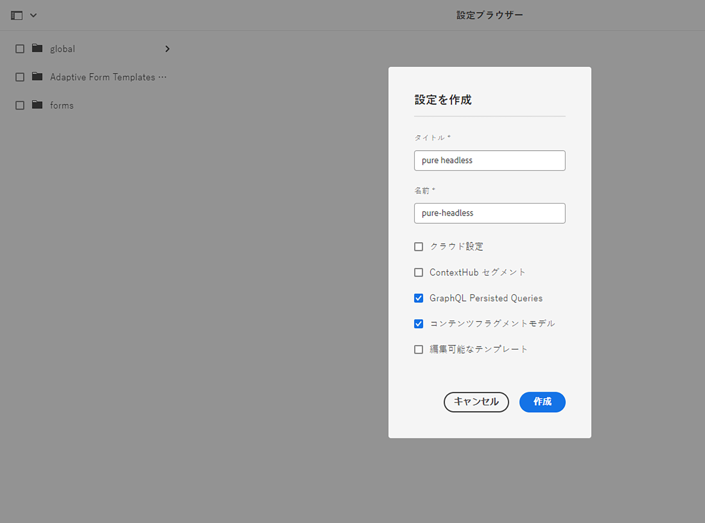
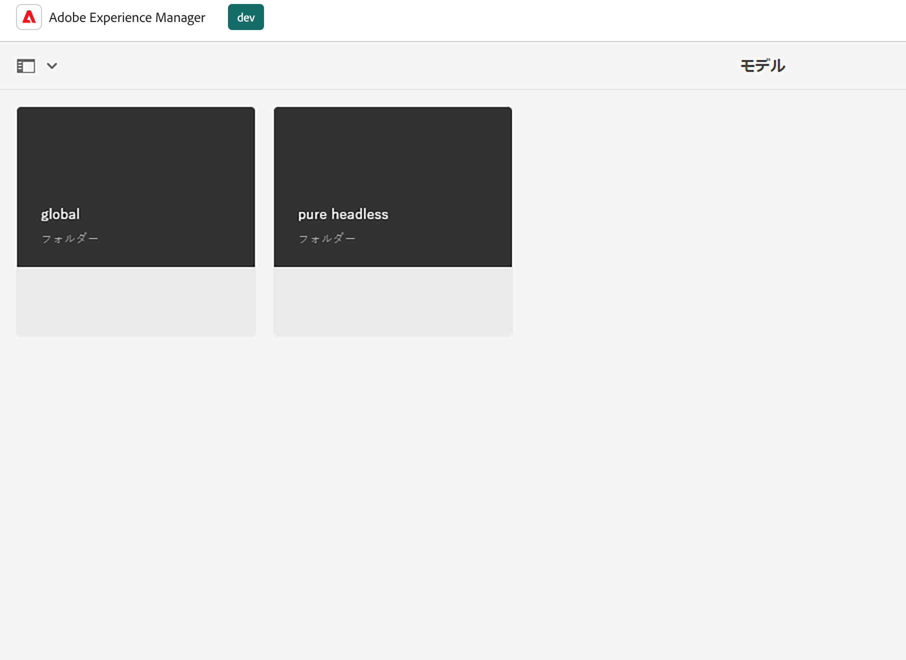
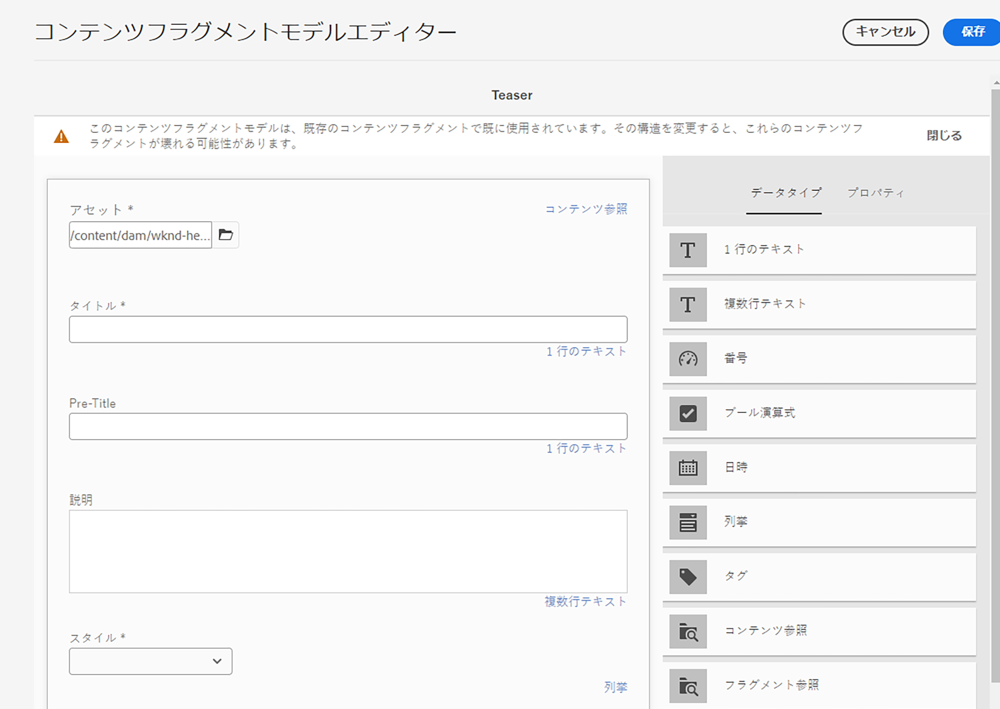
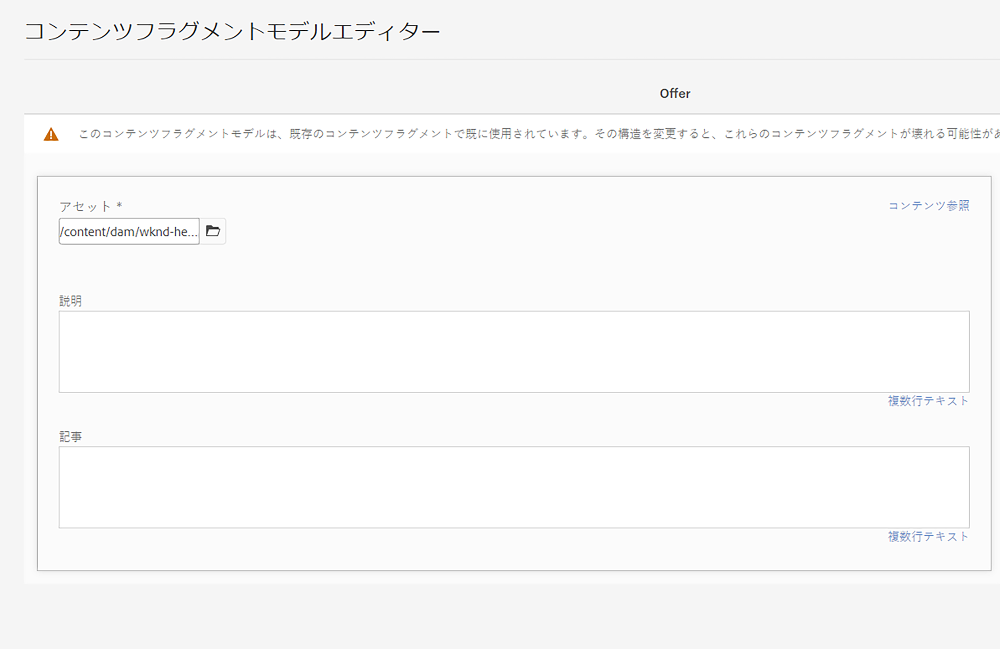
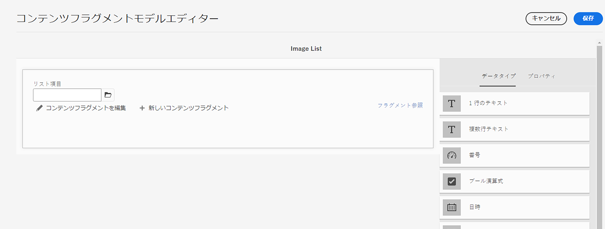
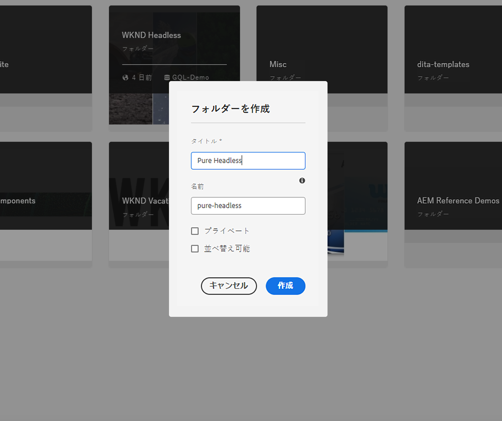
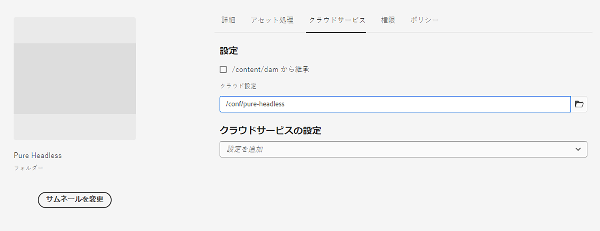
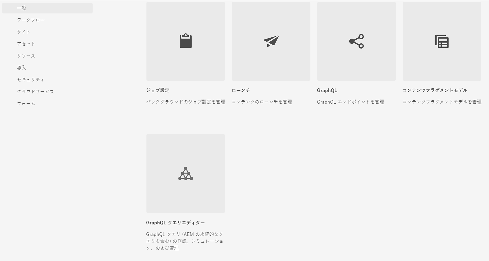
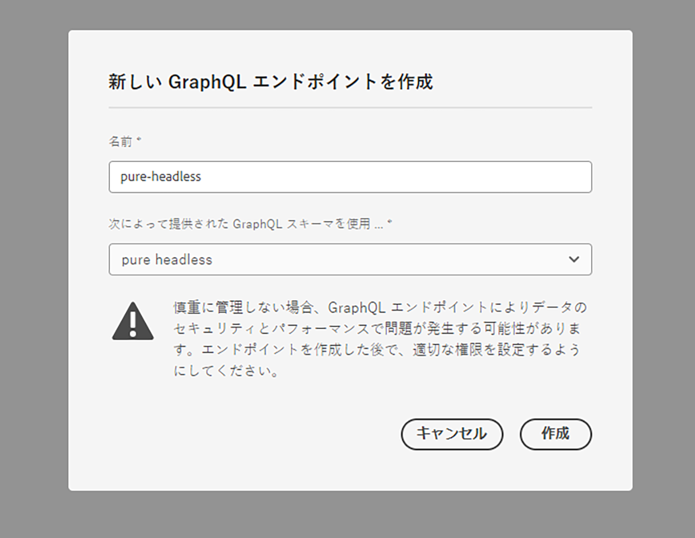

# コンテンツモデリング

Adobe Experience Manager（AEM）のコンテンツフラグメントと GraphQL エンドポイントに関するチュートリアルの章へようこそ。ここでは、コンテンツフラグメントの活用、フラグメントモデルの作成および AEM での GraphQL エンドポイントの使用について説明します。

コンテンツフラグメントは、様々なチャネルにわたるコンテンツの管理に対する構造化されたアプローチを提供し、柔軟性と再利用性を向上させます。AEM でコンテンツフラグメントを有効にすると、モジュール型コンテンツを作成できるようになり、一貫性と適応性が高まります。

まず、シームレスな統合に必要な設定に触れながら、AEM でコンテンツフラグメントを有効にする方法を順を追って説明します。

次に、構造と属性を定義するフラグメントモデルの作成について説明します。コンテンツ要件に合うモデルを設計し、それらを効果的に管理する方法を説明します。

次に、モデルからコンテンツフラグメントを作成する方法の例を示し、オーサリングと公開に関する詳しい手順を説明します。

さらに、AEM GraphQL エンドポイントの定義についても説明します。GraphQL は AEM からデータを効率的に取得します。ここでは、目的のデータを公開するためのエンドポイントをセットアップし設定します。永続クエリは、パフォーマンスとキャッシュを最適化します。

チュートリアル全体を通して、説明、コード例および実用的なヒントを提供します。チュートリアルの終了時には、コンテンツフラグメントの有効化、フラグメントモデルの作成、フラグメントの生成および AEM GraphQL エンドポイントと永続クエリの定義を行うスキルが身につきます。それでは、始めましょう。

## コンテキスト対応の設定

1. __ツール／設定ブラウザー__&#x200B;に移動して、ヘッドレスエクスペリエンスの設定を作成します。

   

   「__タイトル__」と「__名前__」を指定し、「__GraphQL 永続クエリ__」と「__コンテンツフラグメントモデル__」にチェックを入れます。


## コンテンツフラグメントモデル

1. __ツール／コンテンツフラグメントモデル__&#x200B;に移動し、手順 1 で作成した設定と同じ名前のフォルダーを選択します。

   

1. フォルダー内で、「__作成__」を選択し、モデルに「__ティーザー__」という名前を付けます。次のデータタイプを&#x200B;__ティーザー__&#x200B;モデルに追加します。

   | データタイプ | 名前 | 必須 | オプション |
   |----------|------|----------|---------|
   | コンテンツ参照 | アセット | はい | 必要に応じて、デフォルトの画像を追加します。例：/content/dam/wknd-headless/assets/AdobeStock_307513975.mp4 |
   | 1 行のテキスト | title（タイトル） | はい | |
   | 1 行のテキスト | 事前タイトル | いいえ | |
   | 複数行テキスト | 説明 | いいえ | デフォルトのタイプがリッチテキストであることを確認します |
   | 列挙 | スタイル | はい | ドロップダウンとしてレンダリングします。オプションは、ヒーロー／ヒーローとおすすめ／おすすめです |

   

1. フォルダー内に、__オファー__&#x200B;という名前の 2 つ目のモデルを作成します。「作成」をクリックし、モデルに「オファー」という名前を付けて、次のデータタイプを追加します。

   | データタイプ | 名前 | 必須 | オプション |
   |----------|------|----------|---------|
   | コンテンツ参照 | アセット | はい | デフォルトの画像を追加します。例：`/content/dam/wknd-headless/assets/AdobeStock_238607111.jpeg` |
   | 複数行テキスト | 説明 | いいえ |  |
   | 複数行テキスト | 記事 | いいえ |  |

   

1. フォルダー内に、__画像リスト__&#x200B;という名前の 3 つ目のモデルを作成します。「作成」をクリックし、モデルに「画像リスト」という名前を付けて、次のデータタイプを追加します。

   | データタイプ | 名前 | 必須 | オプション |
   |----------|------|----------|---------|
   | フラグメント参照 | リスト項目 | はい | 複数フィールドとしてレンダリングします。許可されているコンテンツフラグメントモデルはオファーです。 |

   

## コンテンツフラグメント

1. 次に、アセットに移動し、新しいサイト用のフォルダーを作成します。「作成」をクリックし、フォルダーに名前を付けます。

   

1. フォルダーを作成したら、フォルダーを選択してその&#x200B;__プロパティ__&#x200B;を開きます。
1. フォルダーの「__クラウド設定__」タブで、[前に作成した](#enable-content-fragments-and-graphql)設定を選択します。

   

   新規フォルダーをクリックし、ティーザーを作成します。「__作成__」と「__コンテンツフラグメント__」をクリックし、__ティーザー__&#x200B;モデルを選択します。モデルに&#x200B;__ヒーロー__&#x200B;という名前を付け、「__作成__」をクリックします。

   | 名前 | 備考 |
   |----------|------|
   | アセット | デフォルト値のままにするか、別のアセット（ビデオまたは画像）を選択します。 |
   | タイトル | `Explore. Discover. Live.` |
   | 事前タイトル | `Join use for your next adventure.` |
   | 説明 | 空白のままにします |
   | スタイル | `Hero` |

   

## GraphQL エンドポイント

1. __ツール／GraphQL__ に移動します。

   

1. 「__作成__」をクリックし、新しいエンドポイントに名前を付け、新しく作成した設定を選択します。

   

## GraphQL 永続クエリ

1. 新しいエンドポイントをテストしましょう。__ツール／GraphQL クエリエディター__&#x200B;に移動し、ウィンドウの右上にあるドロップダウンのエンドポイントを選択します。

1. クエリエディターで、異なるクエリをいくつか作成します。


   ```graphql
   {
       teaserList {
           items {
           title
           }
       }
   }
   ```

   [上記](#create-content)で作成した単一のフラグメントを含んだリストが得られます。

   この演習では、AEM ヘッドレスアプリで使用する完全なクエリを作成します。パスごとに 1 つのティーザーを返すクエリを作成します。クエリエディターで、次のクエリを入力します。

   ```graphql
   query TeaserByPath($path: String!) {
   component: teaserByPath(_path: $path) {
       item {
       __typename
       _path
       _metadata {
           stringMetadata {
           name
           value
           }
       }
       title
       preTitle
       style
       asset {
           ... on MultimediaRef {
           __typename
           _authorUrl
           _publishUrl
           format
           }
           ... on ImageRef {
           __typename
           _authorUrl
           _publishUrl
           mimeType
           width
           height
           }
       }
       description {
           html
           plaintext
       }
       }
   }
   }
   ```

   下部の&#x200B;__クエリ変数__&#x200B;入力に、以下を入力します。

   ```json
   {
       "path": "/content/dam/pure-headless/hero"
   }
   ```

   >[!NOTE]
   >
   > 場合によっては、フォルダー名とフラグメント名に応じてクエリ変数 `path` を調整する必要があります。


   クエリを実行して、先ほど作成したコンテンツフラグメントの結果を受け取ります。

1. 「__保存__」をクリックして、クエリを永続化（保存）し、クエリに&#x200B;__ティーザー__&#x200B;という名前を付けます。これで、アプリケーション内でクエリを名前で参照できるようになります。

## 次の手順

これで完了です。コンテンツフラグメントと GraphQL エンドポイントを作成できるように AEM as a Cloud Service を正常に設定しました。また、コンテンツフラグメントモデルとコンテンツフラグメントを作成し、GraphQL エンドポイントと永続クエリを定義しました。これで、次のチュートリアルの章に進む準備ができました。次の章では、この章で作成したコンテンツフラグメントと GraphQL エンドポイントを使用する、AEM ヘッドレス React アプリケーションを作成する方法について説明します。

[次の章：AEM ヘッドレス API と React](./2-aem-headless-apis-and-react.md)
