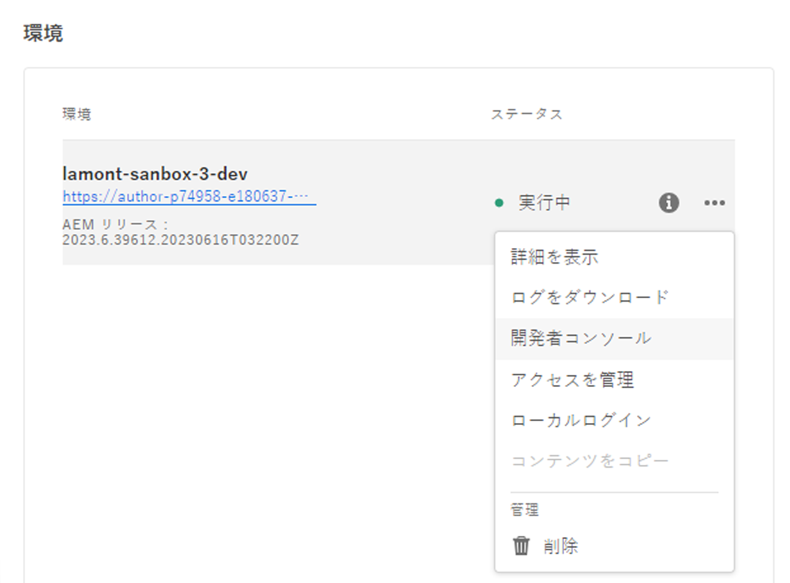

# AEM ヘッドレス API と React

このチュートリアルの章では、AEM ヘッドレス SDK を使用して Adobe Experience Manager（AEM）ヘッドレス API と接続するための React アプリの設定を説明します。AEM の GraphQL API からコンテンツフラグメントデータを取得し、React アプリで表示する方法を説明します。

AEM のヘッドレス API を使用すると、任意のクライアントアプリから AEM コンテンツにアクセスできます。AEM Headless SDK を使用して AEM のヘッドレス API に接続するように React アプリを設定する手順を説明します。この設定により、React アプリと AEM の間に再利用可能な通信チャネルが確立されます。

次に、AEM Headless SDK を使用して、AEM の GraphQL API からコンテンツフラグメントデータを取得します。AEM のコンテンツフラグメントは、構造化されたコンテンツ管理を提供します。AEM Headless SDK を利用すると、GraphQL を使用してコンテンツフラグメントデータを簡単にクエリして取得できます。

コンテンツフラグメントデータを取得したら、React アプリに統合します。データを魅力的な方法で書式設定して表示する方法を説明します。React コンポーネントでコンテンツフラグメントデータを処理およびレンダリングし、アプリの UI とのシームレスな統合を保証するためのベストプラクティスを説明します。

チュートリアル全体を通して、説明、コード例および実用的なヒントを提供します。最終的には、AEM ヘッドレス API に接続し、AEM ヘッドレス SDK を使用してコンテンツフラグメントデータを取得し、React アプリにシームレスに表示するように React アプリを設定できるようになります。それでは、始めましょう。


## React アプリのクローンの作成

1. コマンドラインで次のコマンドを実行して、[Github](https://github.com/lamontacrook/headless-first/tree/main) からアプリのクローンを作成します。

   ```
   $ git clone git@github.com:lamontacrook/headless-first.git
   ```

1. `headless-first` ディレクトリに移動し、依存関係をインストールします。

   ```
   $ cd headless-first
   $ npm ci
   ```

## React アプリの設定

1. プロジェクトのルートに `.env` という名前のファイルを作成します。`.env` で次の値を設定します。

   ```
   REACT_APP_AEM=<URL of the AEM instance>
   REACT_APP_ENDPOINT=<the name of the endpoint>
   REACT_APP_PROJECT=<the name of the folder with Content Fragments>
   REACT_APP_TOKEN=<developer token>
   ```

1. Cloud Manager で開発者トークンを取得できます。[Adobe Cloud Manager](https://experience.adobe.com/) にログインします。__Experience Manager／Cloud Manager__ をクリックします。適切なプログラムを選択し、環境の横にある省略記号をクリックします。

   

   1. 「__統合__」タブをクリックします。
   1. __「ローカルトークン」タブと「ローカル開発トークンを取得」__&#x200B;ボタンを順にクリックします。
   1. 開始引用符の後から終了引用符の前までのアクセストークンをコピーします。
   1. コピーしたトークンを `.env` ファイル内の `REACT_APP_TOKEN` の値としてペーストします。
   1. コマンドラインで `npm ci` を実行して、アプリを作成します。
   1. 次に、React アプリを起動し、コマンドラインで `npm run start` を実行します。
   1. [./src/utils](https://github.com/lamontacrook/headless-first/tree/main/src/utils) の `context.js` という名前のファイルには、`.env` ファイルの値をアプリのコンテキストに設定するコードが含まれています。

## React アプリの実行

1. コマンドラインで `npm run start` を実行して、React アプリを起動します。

   ```
   $ npm run start
   ```

   React アプリが起動し、ブラウザーウィンドウが開き、`http://localhost:3000` が表示されます。React アプリへの変更は、ブラウザーで自動的に再読み込みされます。

## AEM のヘッドレス API への接続

1. React アプリを AEM as a Cloud Service に接続するには、`App.js` にいくつかの項目を追加します。`React` の読み込みで、`useContext` を追加します。

   ```javascript
   import React, {useContext} from 'react';
   ```

   `context.js` ファイルから `AppContext` を読み込みます。

   ```javascript
   import { AppContext } from './utils/context';
   ```

   次に、アプリコード内で、コンテキスト変数を定義します。

   ```javascript
   const context = useContext(AppContext);
   ```

   最後に、リターンコードを `<AppContext.Provider> ... </AppContext.Provider>` に含めます。

   ```javascript
   ...
   return(<div className='App'>
       <AppContext.Provider value={context}>
           ...
       </AppContext.Provider>
   </div>);
   ```

   参照用に、`App.js` は次のようになります。

   ```javascript
   import React, {useContext} from 'react';
   import './App.css';
   import { BrowserRouter, Routes, Route } from 'react-router-dom';
   import Home from './screens/home/home';
   import { AppContext } from './utils/context';
   
   const App = () => {
   const context = useContext(AppContext);
   return (
       <div className='App'>
       <AppContext.Provider value={context}>
           <BrowserRouter>
           <Routes>
               <Route exact={true} path={'/'} element={<Home />} />
           </Routes>
           </BrowserRouter>
       </AppContext.Provider>
       </div>
   );
   };
   
   export default App;
   ```

1. `AEMHeadless` SDK を読み込みます。この SDK は、アプリが AEM のヘッドレス API とのやり取りに使用するヘルパーライブラリです。

   次の import 文を `home.js` に追加します。

   ```javascript
   import AEMHeadless from '@adobe/aem-headless-client-js';
   ```

   次の `{ useContext, useEffect, useState }` を ` React` の import 文に追加します。

   ```javascript
   import React, { useContext, useEffect, useState } from 'react';
   ```

   `AppContext` を読み込みます。

   ```javascript
   import { AppContext } from '../../utils/context';
   ```

   `Home` コンポーネント内で、`AppContext` から `context` 変数を取得します。

   ```javascript
   const Home = () => {
   const context = useContext(AppContext);
   ...
   }
   ```

1. `context` 変数が変更されると AEM ヘッドレス SDK も変更が必要なので、`useEffect()` 内で AEM ヘッドレス SDK を初期化します。

   ```javascript
   useEffect(() => {
   const sdk = new AEMHeadless({
       serviceURL: context.url,
       endpoint: context.endpoint,
       auth: context.token
   });
   }, [context]);  
   ```

   >[!NOTE]
   >
   > `/utils` の下に、`.env` ファイルから要素を読み取る `context.js` ファイルがあります。なお、`context.url` は AEM as a Cloud Service 環境の URL です。`context.endpoint` は、前のレッスンで作成したエンドポイントへの完全パスです。最後に、`context.token` は開発者トークンです。


1. AEM ヘッドレス SDK を通じて得られるコンテンツを公開する React 状態を作成します。

   ```javascript
   const Home = () => {
   const [content, setContent] = useState({});
   ...
   }
   ```

1. アプリを AEM に接続します。前のレッスンで作成した永続クエリを使用します。AEM ヘッドレス SDK が初期化された後で、次のコードを `useEffect` 内に追加します。以下に示すように、`useEffect` を `context` 変数に依存させます。


   ```javascript
   useEffect(() => {
   ...
   sdk.runPersistedQuery('<name of the endpoint>/<name of the persisted query>', { path: `/content/dam/${context.project}/<name of the teaser fragment>` })
       .then(({ data }) => {
       if (data) {
           setContent(data);
       }
       })
       .catch((error) => {
       console.log(`Error with pure-headless/teaser. ${error.message}`);
       });
   }, [context]);
   ```

1. 開発者ツールのネットワーク表示を開いて、GraphQL リクエストを確認します。

   `<url to environment>/graphql/execute.json/pure-headless/teaser%3Bpath%3D%2Fcontent%2Fdam%2Fpure-headless%2Fhero`

   

   AEM ヘッドレス SDK が GraphQL のリクエストをエンコードし、指定されたパラメーターを追加します。ブラウザーでリクエストを開くことができます。

   >[!NOTE]
   >
   > このリクエストはオーサー環境に送信されるので、同じブラウザーの別のタブでこの環境にログインする必要があります。


## コンテンツフラグメントコンテンツのレンダリング

1. アプリでコンテンツフラグメントを表示します。ティーザーのタイトルを含んだ `<div>` を返します。

   ```javascript
   return (
   <div className='main-body'>
       <div>{content.component && (content.component.item.title)}</div>
   </div>
   );
   ```

   画面にティーザーのタイトルフィールドが表示されます。

1. 最後の手順として、ティーザーをページに追加します。React ティーザーコンポーネントはパッケージに含まれています。まず、import 文を含めます。`home.js` ファイルの先頭に次の行を追加します。

   `import Teaser from '../../components/teaser/teaser';`

   return 文を更新します。

   ```javascript
   return (
   <div className='main-body'>
       <div>{content.component && <Teaser content={content.component.item} />}</div>
   </div>
   );
   ```

   これで、フラグメント内にコンテンツを含んだティーザーが表示されます。


## 次の手順

これで完了です。AEM ヘッドレス SDK を使用して AEM ヘッドレス API と統合するように、React アプリを正常に更新しました。

次は、参照されている AEM 内のコンテンツフラグメントを動的にレンダリングする、より複雑な画像リストコンポーネントを作成します。

[次の章：画像リストコンポーネントの作成](./3-complex-components.md)
