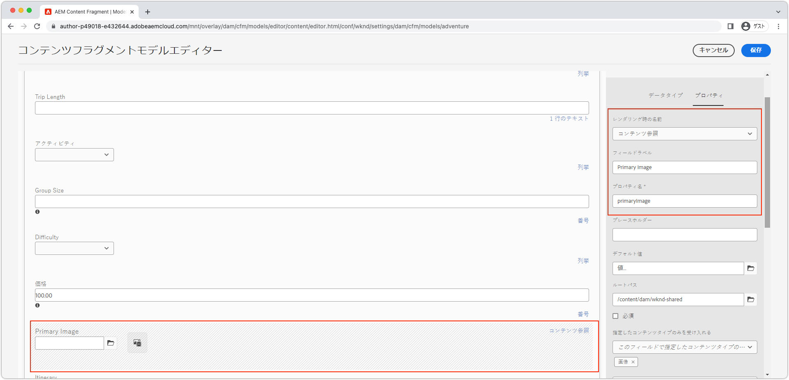

# AEM ヘッドレスでの最適化された画像 {#images-with-aem-headless}

画像は、[機能豊富で魅力的な AEM ヘッドレスエクスペリエンスの開発](https://experienceleague.adobe.com/docs/experience-manager-learn/getting-started-with-aem-headless/graphql/multi-step/overview.html?lang=ja)における重要な側面になります。AEM ヘッドレスでは、画像アセットとそれらの最適化された配信の管理をサポートしています。

AEM ヘッドレスコンテンツモデリングで使用されるコンテンツフラグメントでは、多くの場合、ヘッドレスエクスペリエンスでの表示を目的とした画像アセットを参照します。AEM の GraphQLクエリを記述すると、画像の参照元に基づいて画像の URL を指定できます。

`ImageRef` タイプには、コンテンツ参照用の URL オプションが 4 つあります。

+ `_path` は AEM で参照されているパスであり、AEM オリジン（ホスト名）を含んでいません。
+ `_dynamicUrl` は、画像アセットの web に最適化された配信用の URL です。
   + `_dynamicUrl` には AEM オリジンが含まれていないので、ドメイン（AEM オーサーサービスまたは AEM パブリッシュサービス）はクライアントアプリケーション側で指定する必要があります。
+ `_authorUrl` は、AEM オーサー上の画像アセットの完全な URL です。
   + [AEM オーサー](https://experienceleague.adobe.com/docs/experience-manager-learn/cloud-service/underlying-technology/introduction-author-publish.html?lang=ja)を使用すると、ヘッドレスアプリケーションのプレビューエクスペリエンスを提供できます。
+ `_publishUrl` は、AEM パブリッシュ上の画像アセットの完全な URL です。
   + [AEM パブリッシュ](https://experienceleague.adobe.com/docs/experience-manager-learn/cloud-service/underlying-technology/introduction-author-publish.html?lang=ja)は、通常、ヘッドレスアプリケーションの実稼動デプロイメントで表示される画像の提供元になります。

`_dynamicUrl` は、画像アセット配信に使用する推奨 URL であり、可能な限り `_path`、`_authorUrl` および `_publishUrl` の代わりに使用してください。

|                                | AEM as a Cloud Service | AEM as a Cloud Service RDE | AEM SDK | AEM 6.5 |
| ------------------------------ |:----------------------:|:--------------------------:|:-------:|:-------:|
| Web に最適化された画像のサポート | ✔ | ✔ | ✘ | ✘ |


>[!CONTEXTUALHELP]
>id="aemcloud_learn_headless_graphql_images"
>title="AEM ヘッドレスによる画像"
>abstract="AEM ヘッドレスが画像アセットの管理とその最適化された配信をどのようにサポートするかについて説明します。"

## コンテンツフラグメントモデル

画像参照を含んだコンテンツフラグメントフィールドが、__コンテンツ参照__&#x200B;データタイプであることを確認します。

[コンテンツフラグメントモデル](https://experienceleague.adobe.com/docs/experience-manager-cloud-service/content/assets/content-fragments/content-fragments-models.html?lang=ja)のフィールドタイプを確認するには、フィールドを選択し、右側の「__プロパティ__」タブを調べます。



## GraphQL 永続クエリ

GraphQL クエリで、フィールドを `ImageRef` タイプとして返し、`_dynamicUrl` フィールドをリクエストします。例えば、[WKND Site プロジェクト](https://github.com/adobe/aem-guides-wknd)でアドベンチャーをクエリし、その画像アセット参照の画像 URL を `primaryImage` フィールドに格納するには、次のように定義された新しい永続クエリ `wknd-shared/adventure-image-by-path` を使用します。

```graphql {highlight="11"}
query($path: String!, $imageFormat: AssetTransformFormat=JPG, $imageSeoName: String, $imageWidth: Int, $imageQuality: Int) {
  adventureByPath(
    _path: $path
    _assetTransform: {
      format: $imageFormat
      width: $imageWidth
      quality: $imageQuality
      preferWebp: true
    }
  ) {
    item {
      _path
      title
      primaryImage {
        ... on ImageRef {
          _dynamicUrl
        }
      }
    }
  }
}
```

### クエリ変数

```json
{ 
  "path": "/content/dam/wknd-shared/en/adventures/bali-surf-camp/bali-surf-camp",
  "imageFormat": "JPG",
  "imageWidth": 1000,
}
```

`_path` フィルターで使用する `$path` 変数には、コンテンツフラグメントへの完全なパス（例：`/content/dam/wknd-shared/en/adventures/bali-surf-camp/bali-surf-camp`）が必要です。

`_assetTransform` は、提供する画像レンディションを最適化するために `_dynamicUrl` をどのように構成するかを定義します。Web に最適化された画像の URL は、URL のクエリパラメーターを変更することで、クライアント上で調整することもできます。

| GraphQL パラメーター | 説明 | 必須 | GraphQL パラメーターの値 |
|-------------------|------------------------------------------------------------------------------------------------------|----------|-------------------------------------------------------------|
| `format` | 画像アセットの形式。 | ✔ | `GIF`、`PNG`、`PNG8`、`JPG`、`PJPG`、`BJPG`、`WEBP`、`WEBPLL`、`WEBPLY` |
| `seoName` | URL 内のファイルセグメントの名前。指定しなかった場合は、画像アセット名が使用されます。 | ✘ | 英数字、`-` または `_` |
| `crop` | 画像から切り抜いたフレーム（画像のサイズに収まる必要があります） | ✘ | 元の画像サイズの範囲内で切り抜き領域を定義する正の整数 |
| `size` | 出力画像のサイズ（高さと幅の両方、ピクセル単位） | ✘ | 正の整数 |
| `rotation` | 画像の回転（度単位） | ✘ | `R90`、`R180`、`R270` |
| `flip` | 画像の反転 | ✘ | `HORIZONTAL`、`VERTICAL`、`HORIZONTAL_AND_VERTICAL` |
| `quality` | 画質（元の画質に対するパーセント） | ✘ | 1～100 |
| `width` | 出力画像の幅（ピクセル単位）。`size` が指定されている場合、`width` は無視されます。 | ✘ | 正の整数 |
| `preferWebP` | `true` の場合、ブラウザーが WebP をサポートしていれば、`format` にかかわらず、AEM は WebP を提供します。 | ✘ | `true`、`false` |


## GraphQL 応答

結果として得られる JSON 応答には要求されたフィールドが含まれ、そのフィールドには画像アセットへの web に最適化された URL が含まれます。

```json {highlight="8"}
{
  "data": {
    "adventureByPath": {
      "item": {
        "_path": "/content/dam/wknd-shared/en/adventures/bali-surf-camp/bali-surf-camp",
        "title": "Bali Surf Camp",
        "primaryImage": {
          "_dynamicUrl": "/adobe/dynamicmedia/deliver/dm-aid--a38886f7-4537-4791-aa20-3f6ef0ac3fcd/adobestock_175749320.jpg?preferwebp=true&width=1000&quality=80"
        }
      }
    }
  }
}
```

アプリケーションで参照画像の web に最適化された画像を読み込むには、`primaryImage` の `_dynamicUrl` を画像のソース URL として設定します。

React では、AEM Publish から web に最適化された画像を表示すると、次のようになります。

```jsx
// The AEM host is usually read from a environment variable of the SPA.
const AEM_HOST = "https://publish-p123-e456.adobeaemcloud.com";
...
let dynamicUrl = AEM_HOST + data.adventureByPath.item.primaryImage._dynamicUrl;
...

```

`_dynamicUrl` には AEM ドメインが含まれていないため、解決する画像 URL の目的のオリジンを指定する必要があります。

## レスポンシブ URL

上記の例では単一サイズの画像を使用していますが、web エクスペリエンスでは、レスポンシブ画像セットが必要になる場合が多くあります。レスポンシブ画像は、[img srcsets](https://css-tricks.com/a-guide-to-the-responsive-images-syntax-in-html/#using-srcset) または[画像要素](https://css-tricks.com/a-guide-to-the-responsive-images-syntax-in-html/#using-srcset)を使用して実装することができます。次のコードスニペットは、`_dynamicUrl` をベースとして使用する方法を示しています。`width` は様々なレスポンシブビューに対応するために `_dynamicUrl` に追加できる URL パラメーターです。

```javascript
// The AEM host is usually read from a environment variable of the SPA.
const AEM_HOST = "https://publish-p123-e456.adobeaemcloud.com";
...
// Read the data from GraphQL response
let dynamicUrl = AEM_HOST + data.adventureByPath.item.primaryImage._dynamicUrl;
let alt = data.adventureByPath.item.title;
...
{/*-- Example img srcset --*/}
document.body.innerHTML=`
    alt="${alt}"
    src="${dynamicUrl}&width=1000}"
    srcset="`
      ${dynamicUrl}&width=1000 1000w,
      ${dynamicUrl}&width=1600 1600w,
      ${dynamicUrl}&width=2000 2000w,
      `"
    sizes="calc(100vw - 10rem)"/>`;
...
{/*-- Example picture --*/}
document.body.innerHTML=`<picture>
      <source srcset="${dynamicUrl}&width=2600" media="(min-width: 2001px)"/>
      <source srcset="${dynamicUrl}&width=2000" media="(min-width: 1000px)"/>
      
    </picture>`;
```

## React の例

[レスポンシブ画像パターン](https://css-tricks.com/a-guide-to-the-responsive-images-syntax-in-html/)に従って、web に最適化された画像を表示するシンプルな React アプリケーションを作成してみましょう。レスポンシブ画像には、主に次の 2 つのパターンがあります。

+ パフォーマンスの向上のための [srcset を含む img 要素](https://css-tricks.com/a-guide-to-the-responsive-images-syntax-in-html/#using-srcset)
+ 設計管理のための[画像要素](https://css-tricks.com/a-guide-to-the-responsive-images-syntax-in-html/#using-picture) 

### srcset を含む img 要素

>[!VIDEO](https://video.tv.adobe.com/v/3418556/?quality=12&learn=on)

[srcset を含む img 要素](https://css-tricks.com/a-guide-to-the-responsive-images-syntax-in-html/#using-srcset) を `sizes` 属性で使用することにより、異なる画面サイズに対して異なる画像アセットを提供します。img srcsets は、異なる画面サイズに対して異なる画像アセットを提供する場合に役立ちます。

### 画像要素

[画像要素](https://css-tricks.com/a-guide-to-the-responsive-images-syntax-in-html/#using-picture)は複数の `source` 要素とともに使用され、異なる画面サイズに対して異なる画像アセットを提供します。画像要素は、異なる画面サイズ対してに異なる画像レンディションを提供する場合に役立ちます。

>[!VIDEO](https://video.tv.adobe.com/v/3418555/?quality=12&learn=on)

### サンプルコード

このシンプルな React アプリは、[AEM ヘッドレス SDK](./aem-headless-sdk.md) を使用して AEM ヘッドレス API でアドベンチャーのコンテンツをクエリし、[srcset 付きの img 要素](#img-element-with-srcset)と [picture 要素](#picture-element)を使用して web に最適化された画像を表示します。`srcset` と `sources` は、カスタムの `setParams` 関数を使用して、web に最適化された配信クエリパラメーターを画像の `_dynamicUrl` に追加することにより、web クライアントのニーズに基づいて配信される画像表現を変更します。

AEM に対するクエリは、[AEM ヘッドレス SDK を使用する](./aem-headless-sdk.md#graphql-persisted-queries)カスタム React フック useAdventureByPath で実行されます。

```javascript
// src/App.js

import "./App.css";
import { useAdventureByPath } from './api/persistedQueries'

const AEM_HOST = process.env.AEM_HOST;

function App() {

  /**
   * Update the dynamic URL with client-specific query parameters
   * @param {*} imageUrl the image URL
   * @param {*} params the AEM web-optimized image query parameters
   * @returns the dynamic URL with the query parameters
   */
  function setOptimizedImageUrlParams(imageUrl, params) {
    let url = new URL(imageUrl);
    Object.keys(params).forEach(key => {
      url.searchParams.set(key, params[key]);
    });
    return url.toString();
  }

  // Get data from AEM using GraphQL persisted query as defined above 
  // The details of defining a React useEffect hook are explored in How to > AEM Headless SDK
  // The 2nd parameter define the base GraphQL query parameters used to request the web-optimized image
  let { data, error } = useAdventureByPath(
        "/content/dam/wknd-shared/en/adventures/bali-surf-camp/bali-surf-camp", 
        { imageFormat: "JPG" }
      );

  // Wait for AEM Headless APIs to provide data
  if (!data) { return <></> }

  const alt = data.adventureByPath.item.title;
  const imageUrl =  AEM_HOST + data.adventureByPath.item.primaryImage._dynamicUrl;

  return (
    <div className="app">
      
      <h1>Web-optimized images</h1>

      {/* Render the web-optimized image img with srcset for the Adventure Primary Image */}
      <h2>Img srcset</h2>

      

       {/* Render the web-optimized picture for the Adventure Primary Image */}
        <h2>Picture element</h2>

        <picture>
          {/* When viewport width is greater than 2001px */}
          <source srcSet={setOptimizedImageUrlParams(imageUrl, { width : 2600 })} media="(min-width: 2001px)"/>        
          {/* When viewport width is between 1000px and 2000px */}
          <source srcSet={setOptimizedImageUrlParams(imageUrl, { width : 2000})} media="(min-width: 1000px)"/>
          {/* When viewport width is less than 799px */}
          
        </picture>
    </div>
  );
}

export default App;
```
