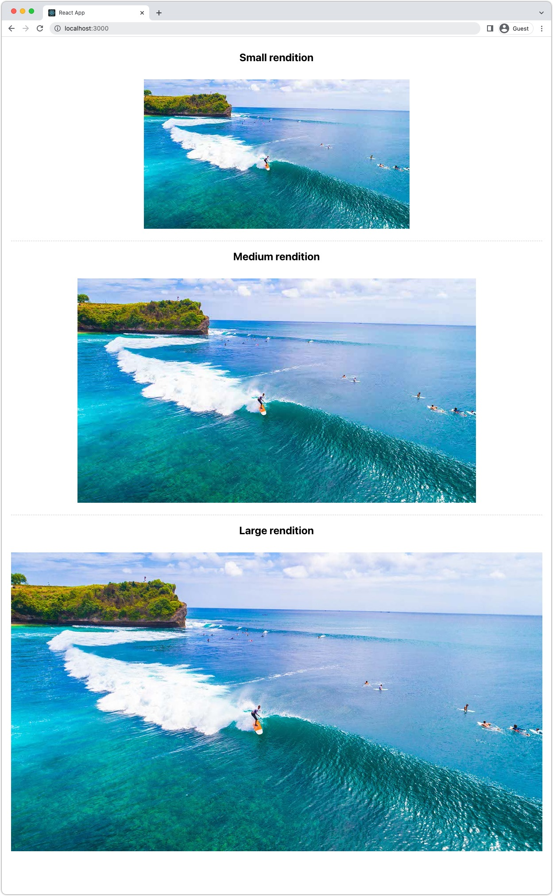

# 画像 (AEMヘッドレス )

画像は、 [豊富で魅力的なAEMヘッドレスエクスペリエンスの開発](https://experienceleague.adobe.com/docs/experience-manager-learn/getting-started-with-aem-headless/graphql/multi-step/overview.html?lang=ja). AEMヘッドレスは、画像アセットの管理と、その最適化された配信をサポートします。

AEMヘッドレスコンテンツモデリングで使用されるコンテンツフラグメントは、多くの場合、ヘッドレスエクスペリエンスでの表示を目的とした画像アセットを参照します。 AEM GraphQL クエリを記述して、画像の参照元に基づいて画像に URL を提供できます。

この `ImageRef` タイプにはコンテンツ参照用の 3 つの URL オプションがあります。

+ `_path` はAEMで参照されているパスで、AEM origin（ホスト名）は含まれていません
+ `_authorUrl` は、AEM オーサー上の画像アセットの完全な URL です
   + [AEM オーサー](https://experienceleague.adobe.com/docs/experience-manager-learn/cloud-service/underlying-technology/introduction-author-publish.html) は、ヘッドレスアプリケーションのプレビューエクスペリエンスを提供するために使用できます。
+ `_publishUrl` は、AEM パブリッシュ上の画像アセットの完全な URL です。
   + [AEM パブリッシュ](https://experienceleague.adobe.com/docs/experience-manager-learn/cloud-service/underlying-technology/introduction-author-publish.html) は、通常、ヘッドレスアプリケーションの実稼動デプロイメントで画像が表示される場所です。

これらのフィールドは、次の条件に基づいて使用するのが最適です。

| ImageRef フィールド | AEMから提供されるクライアント Web アプリ | クライアントアプリが AEM オーサーに対してクエリを実行 | クライアントアプリが AEM Publish をクエリ |
|--------------------|:------------------------------:|:-----------------------------:|:------------------------------:|
| `_path` | ✔ | ✘ | ✘ |
| `_authorUrl` | ✘ | ✔ | ✘ |
| `_publishUrl` | ✘ | ✘ | ✔ |

の使用 `_authorUrl` および `_publishUrl` は、GraphQL 応答のソースに使用されるAEM GraphQL エンドポイントと一致する必要があります。

## コンテンツフラグメントモデル

画像参照を含む「コンテンツフラグメント」フィールドが __コンテンツ参照__ データタイプ。

フィールドタイプについては、 [コンテンツフラグメントモデル](https://experienceleague.adobe.com/docs/experience-manager-cloud-service/content/assets/content-fragments/content-fragments-models.html)、フィールドを選択し、 __プロパティ__ 」タブを右にクリックします。


## GraphQL クエリ

GraphQL クエリで、フィールドを `ImageRef` 適切なフィールドを入力し、リクエストします。 `_path`, `_authorUrl`または `_publishUrl` アプリケーションで必要です。

```javascript
{
  adventureByPath(_path: "/content/dam/wknd/en/adventures/bali-surf-camp/bali-surf-camp") {
    item {
      adventurePrimaryImage {
        ... on ImageRef {
          _path,
          _authorUrl,
          _publishUrl
        }
      }
    }
  }  
}
```

## GraphQL の応答

結果の JSON 応答には、画像アセットへの URL を含むリクエストされたフィールドが含まれます。

```json
{
  "data": {
    "adventureByPath": {
      "item": {
        "adventurePrimaryImage": {
          "_path": "/content/dam/wknd/en/adventures/bali-surf-camp/AdobeStock_175749320.jpg",
          "_authorUrl": "https://author-p123-e456.adobeaemcloud.com/content/dam/wknd/en/adventures/bali-surf-camp/AdobeStock_175749320.jpg",
          "_publishUrl": "https://publish-p123-e789.adobeaemcloud.com/content/dam/wknd/en/adventures/bali-surf-camp/AdobeStock_175749320.jpg"
        }
      }
    }
  }
}
```

参照元の画像をアプリケーションに読み込むには、適切なフィールドを使用します。 `_path`, `_authorUrl`または `_publishUrl` の `adventurePrimaryImage` を画像のソース URL として設定します。

のドメイン `_authorUrl` および `_publishUrl` は、AEM as a Cloud Serviceで [外部化](https://experienceleague.adobe.com/docs/experience-manager-cloud-service/content/implementing/developer-tools/externalizer.htmli).

React では、AEM Publish からの画像の表示は次のようになります。

```html

```

## 画像レンディション

画像アセットはカスタマイズ可能をサポートします [レンディション](../../../assets/authoring/renditions.md)：元のアセットの代替表現です。 カスタムレンディションは、ヘッドレスエクスペリエンスの最適化に役立ちます。 大きな高解像度ファイルである場合が多い元の画像アセットを要求する代わりに、ヘッドレスアプリケーションから最適化されたレンディションを要求することができます。

### レンディションの作成

AEM Assets管理者は、処理プロファイルを使用してカスタムレンディションを定義します。 その後、処理プロファイルを特定のフォルダーツリーまたはアセットに直接適用して、それらのアセットのレンディションを生成できます。

#### 処理プロファイル

アセットレンディションの仕様は、 [処理プロファイル](../../../assets/configuring//processing-profiles.md) AEM Assets管理者による

処理プロファイルを作成または更新し、ヘッドレスアプリケーションで必要な画像サイズのレンディション定義を追加します。 レンディションには任意の名前を付けることができますが、意味的に名前を付ける必要があります。


この例では、3 つのレンディションが作成されます。

| レンディション名 | 拡張子 | 最大幅 |
|----------------|:---------:|----------:|
| 大 | jpeg | 1200 px |
| MEDIUM | jpeg | 900 px |
| 小 | jpeg | 600 px |

上記の表で呼び出される属性は重要です。

+ __レンディション名__ を使用してレンディションを要求します。
+ __拡張__ は、 __レンディション名__.
+ __最大幅__ は、ヘッドレスアプリケーションでの使用に基づいて使用するレンディションを開発者に知らせるために使用されます。

レンディションの定義はヘッドレスアプリケーションのニーズに応じて異なるので、使用例に合わせて最適なレンディションセットを定義し、その使用方法に関する意味的な名前を付けてください。

#### アセット再処理ワークフロー（その ）{#reprocess-assets}

処理プロファイルを作成（または更新）した状態で、アセットを再処理して、処理プロファイルで定義された新しいレンディションを生成します。 アセットが処理されない場合、新しいレンディションは存在しません。

+ 好ましくは、 [フォルダーに処理プロファイルを割り当てました](../../../assets/configuring//processing-profiles.md) したがって、そのフォルダーに新しいアセットがアップロードされると、レンディションが自動的に生成されます。 既存のアセットは、以下のアドホックアプローチを使用して再処理する必要があります。

+ または、フォルダーまたはアセットを選択し、「 __アセットを再処理__&#x200B;をクリックし、新しい処理プロファイル名を選択します。

   

#### レンディションのレビュー

レンディションは、 [アセットのレンディション表示を開く](../../../assets/authoring/renditions.md)をクリックし、レンディションパネルでプレビューする新しいレンディションを選択します。 レンディションが見つからない場合、 [アセットが処理プロファイルを使用して処理されていることを確認します。](#reprocess-assets).


#### アセットを公開します。

新しいレンディションを持つアセットが [（再公開済み）](../../../assets/sharing/publish.md) したがって、AEM パブリッシュ上で新しいレンディションにアクセスできます。

### レンディションへのアクセス

レンディションには、 __レンディション名__ および __レンディション拡張__ アセットの URL に対する処理プロファイルで定義されます。

| アセット URL | レンディションサブパス | レンディション名 | レンディション拡張 |  | レンディション URL |
|-----------|:------------------:|:--------------:|--------------------:|:--:|---|
| https://publish-p123-e789.adobeaemcloud.com/content/dam/example.jpg | /_jcr_content/renditions/ | 大 | .jpeg | → | https://publish-p123-e789.adobeaemcloud.com/content/dam/example.jpg/_jcr_content/renditions/large.jpeg |
| https://publish-p123-e789.adobeaemcloud.com/content/dam/example.jpg | /_jcr_content/renditions/ | MEDIUM | .jpeg | → | https://publish-p123-e789.adobeaemcloud.com/content/dam/example.jpg/_jcr_content/renditions/medium.jpeg |
| https://publish-p123-e789.adobeaemcloud.com/content/dam/example.jpg | /_jcr_content/renditions/ | 小 | .jpeg | → | https://publish-p123-e789.adobeaemcloud.com/content/dam/example.jpg/_jcr_content/renditions/small.jpeg |

{style=&quot;table-layout:auto&quot;}

### GraphQL クエリ{#renditions-graphl-query}

AEM GraphQL では、画像レンディションを要求するための追加の構文が必要です。 代わりに [画像に対する問い合わせ](#images-graphql-query) 通常の方法で、目的のレンディションをコード内で指定します。 ～することが重要である。 [ヘッドレスアプリケーションで使用される画像アセットに同じ名前のレンディションがあることを確認する](#reprocess-assets).

### React の例

1 つの画像アセットの 3 つのレンディション（小、中、大）を表示するシンプルな React アプリケーションを作成します。



#### 画像コンポーネントを作成{#react-example-image-component}

画像をレンダリングする React コンポーネントを作成します。 このコンポーネントは、次の 4 つのプロパティを受け入れます。

+ `assetUrl`:GraphQL クエリの応答で提供される画像アセットの URL。
+ `renditionName`:読み込むレンディションの名前。
+ `renditionExtension`:読み込むレンディションの拡張。
+ `alt`:画像の代替テキスト。アクセシビリティが重要です。

このコンポーネントは、 [レンディション URL ( __レンディションへのアクセス__](#access-renditions). An `onError` ハンドラーは、レンディションが見つからない場合に元のアセットを表示するように設定されます。

この例では、元のアセット URL を `onError` ハンドラー、イベント内にレンディションが見つかりません。

```javascript
// src/Image.js

export default function Image({ assetUrl, renditionName, renditionExtension, alt }) {
  // Construct the rendition Url in the format:
  //   <ASSET URL>/_jcr_content/renditions<RENDITION NAME>.<RENDITION EXTENSION>
  const renditionUrl = `${assetUrl}/_jcr_content/renditions/${renditionName}.${renditionExtension}`;

  // Load the original image asset in the event the named rendition is missing
  const handleOnError = (e) => { e.target.src = assetUrl; }

  return (
    <>
      
    </>
  );
}
```

#### 次を定義： `App.js`{#app-js}

このシンプルな `App.js` アドベンチャー画像をAEMに問い合わせて、その画像の 3 つのレンディションを表示します。小、中、大

AEMに対するクエリは、カスタム React フックで実行されます。 [AEMヘッドレス SDK を使用する useGraphQL](./aem-headless-sdk.md#graphql-queries).

クエリの結果と特定のレンディションパラメーターが [画像 React コンポーネント](#react-example-image-component).

```javascript
// src/App.js

import "./App.css";
import { useGraphQL } from "./useGraphQL";
import Image from "./Image";

function App() {

  // The GraphQL that returns an image
  const adventureQuery = `{
        adventureByPath(_path: "/content/dam/wknd/en/adventures/bali-surf-camp/bali-surf-camp") {
          item {
            adventureTitle,
            adventurePrimaryImage {
              ... on ImageRef {
                _path,
                _authorUrl,
                _publishUrl
              }
            }
          }
        }  
    }`;

  // Get data from AEM using GraphQL
  let { data } = useGraphQL(adventureQuery);

  // Wait for GraphQL to provide data
  if (!data) { return <></> }

  return (
    <div className="app">
      
      <h2>Small rendition</h2>
      {/* Render the small rendition for the Adventure Primary Image */}
      <Image
        assetUrl={data.adventureByPath.item.adventurePrimaryImage._publishUrl}
        renditionName="small"
        renditionExtension="jpeg"
        alt={data.adventureByPath.item.adventureTitle}
      />

      <hr />

      <h2>Medium rendition</h2>
      {/* Render the medium rendition for the Adventure Primary Image */}
      <Image
        assetUrl={data.adventureByPath.item.adventurePrimaryImage._publishUrl}
        renditionName="medium"
        renditionExtension="jpeg"
        alt={data.adventureByPath.item.adventureTitle}
      />

      <hr />

      <h2>Large rendition</h2>
      {/* Render the large rendition for the Adventure Primary Image */}
      <Image
        assetUrl={data.adventureByPath.item.adventurePrimaryImage._publishUrl}
        renditionName="large"
        renditionExtension="jpeg"
        alt={data.adventureByPath.item.adventureTitle}
      />
    </div>
  );
}

export default App;
```
