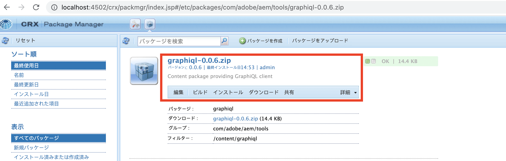
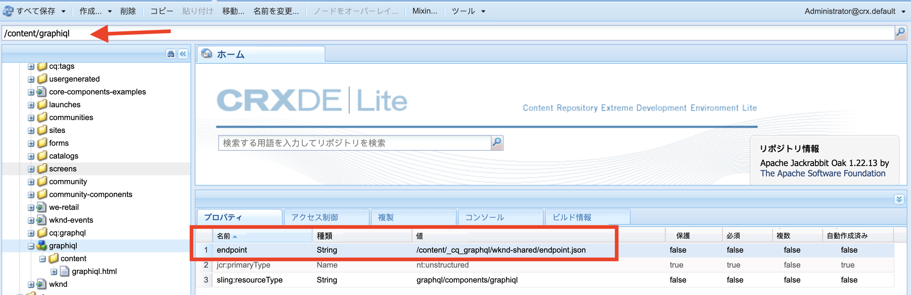

# AEM 6.5 への GraphiQL IDE のインストール

AEM 6.5 では、GraphiQL IDE ツールを手動でインストールする必要があります。

1. **[ソフトウェア配布ポータル](https://experience.adobe.com/#/downloads/content/software-distribution/jp/aemcloud.html)**／**AEM as a Cloud Service** に移動します。
1. 「GraphiQL」を検索します（**GraphiQL** の **i** は必ず入れてください）。
1. 最新の **GraphiQL コンテンツパッケージ v.x.x.x** をダウンロードします。

   

   この zip ファイルは、直接インストールできる AEM のパッケージです。

1. AEM のスタートメニューから、**ツール**／**デプロイメント**／**パッケージ**&#x200B;に移動します。
1. 「**パッケージをアップロード**」をクリックし、前の手順でダウンロードしたパッケージを選択します。「**インストール**」をクリックして、パッケージをインストールします。

   

1. **CRXDE Lite**／**リポジトリパネル**&#x200B;に移動し、`/content/graphiql` ノード（<http://localhost:4502/crx/de/index.jsp#/content/graphiql> など）を選択します。
1. 「**プロパティ**」タブで、`endpoint` プロパティの値を `/content/_cq_graphql/wknd-shared/endpoint.json` に変更します。
   

1. **Web コンソール設定** UI に移動し、**CSRF フィルター**&#x200B;設定（<http://localhost:4502/system/console/configMgr/com.adobe.granite.csrf.impl.CSRFFilter)> など）を検索します。
1. `Excluded Paths` プロパティ名フィールドで、WKND GraphQL エンドポイントのパスを `/content/cq:graphql/wknd-shared/endpoint` に更新します。

1. `//HOST:PORT/content/graphiql.html` を使用して GraphiQL エディターにアクセスし、新しいクエリを作成できるか、または既存のクエリを実行できるか確認します（例 <http://localhost:4502/content/graphiql.html>）。

>[!TIP]
>
>プロジェクト固有の GraphQL スキーマとクエリの実行に対応するには、上記の手順で `endpoint` と `Excluded Paths` の値に対応する変更を加える必要があります。
