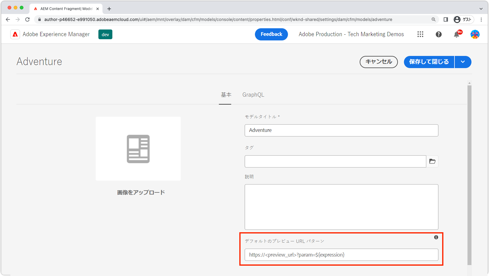
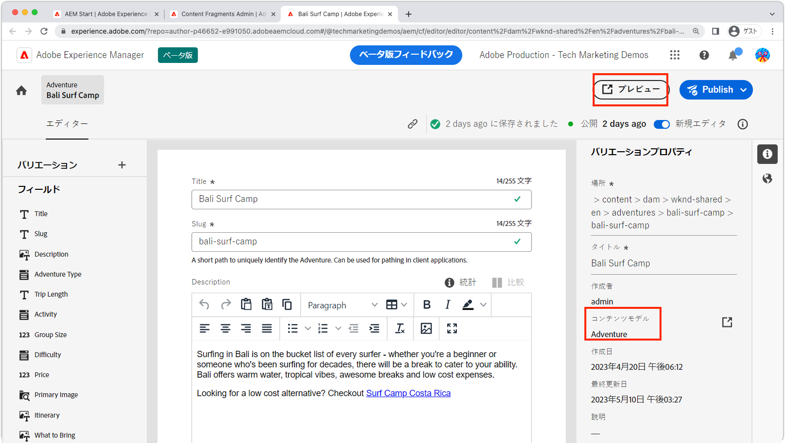

# コンテンツフラグメントのプレビュー

AEM ヘッドレスアプリケーションは、統合オーサリングプレビューをサポートしています。プレビューエクスペリエンスでは、AEM オーサーのコンテンツフラグメントエディターをカスタムアプリ（HTTP でアドレス可能）とリンクして、プレビュー中のコンテンツフラグメントをレンダリングするアプリへのディープリンクを可能にします。

>[!VIDEO](https://video.tv.adobe.com/v/3416906?quality=12&learn=on)

コンテンツフラグメントのプレビューを使用するには、次の条件を満たす必要があります。

1. オーサーからアクセス可能な URL にアプリをデプロイする必要があります。
1. （AEM パブリッシュサービスではなく）AEM オーサーサービスに接続するようにアプリを設定する必要があります。
1. アプリの設計に使用する URL またはルートは、[コンテンツフラグメントのパスまたは ID](#url-expressions) を使用して、アプリのエクスペリエンスでプレビューに表示するコンテンツフラグメントを選択できる必要があります。

## プレビュー URL

[URL 式](#url-expressions) を使用したプレビュー URL は、コンテンツフラグメントモデルのプロパティで設定します。



1. AEM オーサーサービスに管理者としてログインします。
1. __ツール／一般／コンテンツフラグメントモデル__&#x200B;に移動します。
1. __コンテンツフラグメントモデル__&#x200B;を選択し、上部のアクションバーから「__プロパティ__」を選択します。
1. [URL 式](#url-expressions)を使用して、コンテンツフラグメントモデルのプレビュー URL を入力します。
   + プレビュー URL は、AEM オーサーサービスに接続するアプリのデプロイメントを指している必要があります。

### URL 式

各コンテンツフラグメントモデルには、プレビュー URL を設定できます。プレビュー URL は、次の表に示す URL 式を使用して、コンテンツフラグメントごとにパラメーター化できます。1 つのプレビュー URL で複数の URL 式を使用できます。

|                                         | URL 式 | 値 |
| --------------------------------------- | ----------------------------------- | ----------- |
| コンテンツフラグメントのパス | `${contentFragment.path}` | `/content/dam/wknd-shared/en/adventures/surf-camp-bali/surf-camp-bali` |
| コンテンツフラグメントの ID | `${contentFragment.id}` | `12c34567-8901-2aa3-45b6-d7890aa1c23c` |
| コンテンツフラグメントのバリエーション | `${contentFragment.variation}` | `main` |
| コンテンツフラグメントモデルのパス | `${contentFragment.model.path}` | `/conf/wknd-shared/settings/dam/cfm/models/adventure` |
| コンテンツフラグメントモデルの名前 | `${contentFragment.model.name}` | `adventure` |

プレビュー URL の例：

+ __Adventure__ モデルのプレビュー URL は、`https://preview.app.wknd.site/adventure/content/dam/wknd-shared/en/adventures/surf-camp-bali/surf-camp-bali` に解決される `https://preview.app.wknd.site/adventure${contentFragment.path}` のようになります。
+ __Article__ モデルのプレビュー URL は、`https://preview.news.wknd.site/article/99c34317-1901-2ab3-35b6-d7890aa1c23c.html?variation=main` に解決される `https://preview.news.wknd.site/${contentFragment.model.name}/${contentFragment.id}.html?variation=${contentFragment.variation}` のようになります。

## アプリ内プレビュー

設定済みのコンテンツフラグメントモデルを使用したコンテンツフラグメントにはすべて、「プレビュー」ボタンが付きます。「プレビュー」ボタンをクリックすると、コンテンツフラグメントモデルのプレビュー URL が開き、開いているコンテンツフラグメントの値が [URL 式](#url-expressions) に挿入されます。



アプリでコンテンツフラグメントの変更をプレビューする際には、ハード更新（ブラウザーのローカルキャッシュのクリア）を実行します。

## React の例

WKND アプリを見てみましょう。これは、AEM ヘッドレス GraphQL API を使用して AEM 内のアドベンチャーを表示するシンプルな React アプリです。

サンプルコードは [Github.com](https://github.com/adobe/aem-guides-wknd-graphql/tree/main/preview-tutorial) で入手できます。

## URL とルート

コンテンツフラグメントのプレビューに使用する URL またはルートは、[URL 式](#url-expressions)を使用して構成できる必要があります。このプレビュー対応バージョンの WKND アプリでは、ルート `/adventure<CONTENT FRAGMENT PATH>` にバインドされた `AdventureDetail` コンポーネントを介してアドベンチャーのコンテンツフラグメントが表示されます。そのため、このルートに解決するには、WKND Adventure モデルのプレビュー URL を `https://preview.app.wknd.site:3000/adventure${contentFragment.path}` に設定する必要があります。

コンテンツフラグメントのプレビューが機能するのは、アドレス指定可能なルートがアプリにある場合のみであり、プレビュー可能な形でそのコンテンツフラグメントをアプリにレンダリングする [URL 式](#url-expressions)を、そのルートに入力できる必要があります。

+ `src/App.js`

```javascript
...
function App() {
  return (
    <Router>
      <div className="App">
        <header>
            <Link to={"/"}>
                
            </Link>        
            <hr />
        </header>
        <Routes>
          {/* The route's path must match the Adventure Model's Preview URL expression. In React since the path has `/` you must use wildcards to match instead of the usual `:path` */}
          <Route path='/adventure/*' element={<AdventureDetail />}/>
          <Route path="/" element={<Home />}/>
        </Routes>
      </div>
    </Router>
  );
}

export default App;
```

### 作成したコンテンツの表示

`AdventureDetail` コンポーネントは、`${contentFragment.path}` [URL 式](#url-expressions)を介してプレビュー URL に挿入されたコンテンツフラグメントパスを、ルート URL から単純に解析し、それを使用して WKND Adventure を収集してレンダリングします。

+ `src/components/AdventureDetail.js`

```javascript
...
function AdventureDetail() {

    // Read the `path` value which is the parameter used to query for the adventure's details
    // since the params value captures the `*` wildcard in `/adventure/*`, or everything after the first `/` in the Content Fragment path.
    const params = useParams();
    const pathParam = params["*"];

    // Add the leading '/' back on 
    const path = '/' + pathParam;
    
    // Query AEM for the Adventures's details, using the Content Fragment's `path`
    const { adventure, references, error } = useAdventureByPath(path);

    // Handle error and loading conditions
    if (error) {
        return <Error errorMessage={error} />;
    } else if (!adventure) {
        return <Loading />;
    }

    return (<div className="adventure-detail">
        ...
        <AdventureDetailRender {...adventure} references={references} />
    </div>);
}
...
```
