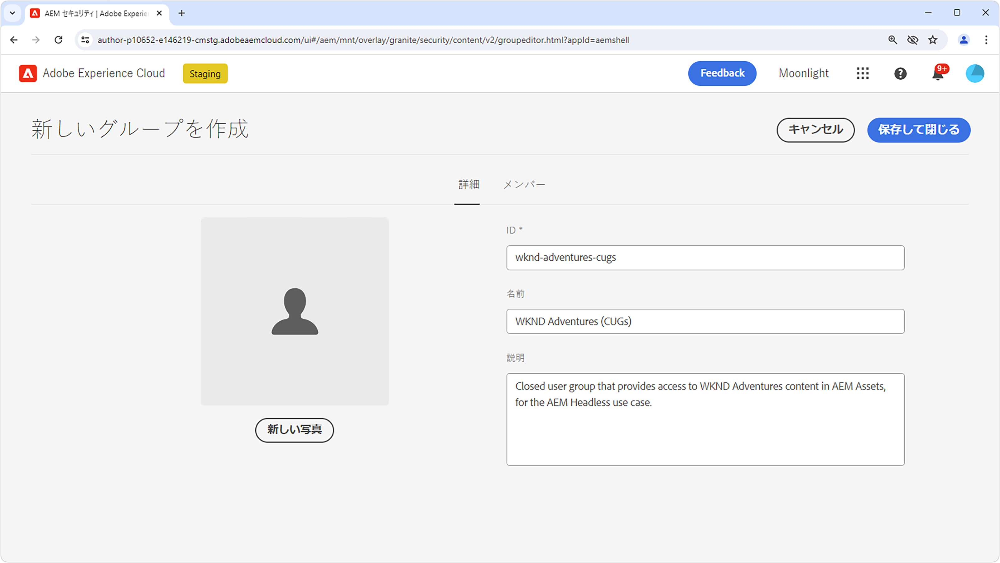
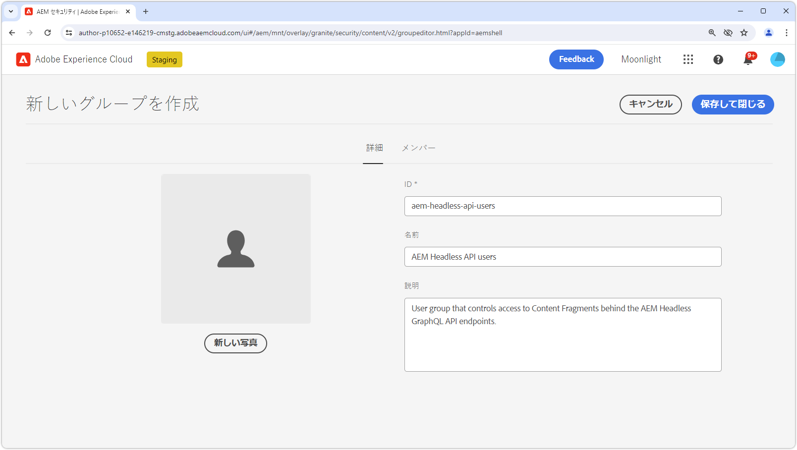
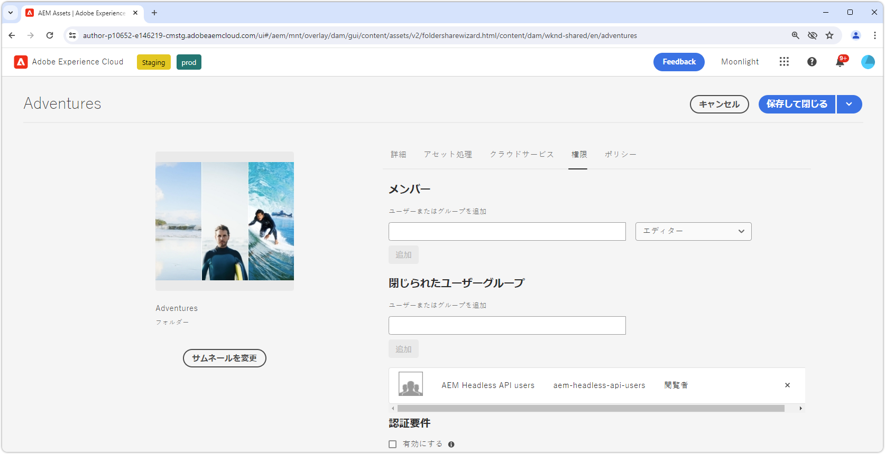

# AEM ヘッドレスでのコンテンツの保護

AEM パブリッシュから AEM ヘッドレスコンテンツを提供する際に、データの整合性とセキュリティを確保することは、機密性の高いコンテンツを提供する場合に重要です。 このハウツーでは、AEM ヘッドレス GraphQL API エンドポイントによって提供されるコンテンツを保護する方法について説明します。

このチュートリアルのガイダンスでは、特定のユーザーまたはユーザーグループのみがコンテンツを使用できるようにする厳格な要件があります。混乱や意図しない結果を避けるために、パーソナライズされたマーケティングコンテンツと、PII や個人の財務データなどのプライベートコンテンツを区別することが不可欠です。このチュートリアルでは、プライベートコンテンツの保護について説明します。

マーケティングコンテンツについて説明する場合、個々のユーザーやグループ向けに調整されたコンテンツを指し、一般消費者向けではありません。ただし、このコンテンツは特定のユーザーを対象としていることがありますが、意図したコンテキスト外の公開（HTTP リクエストの操作など）によってセキュリティ、法的、評判に関するリスクが生じることにはならないことを理解することが重要です。

この記事で取り上げるすべてのコンテンツはプライベートと見なされ、指定されたユーザーまたはグループのみが閲覧できることを強調します。マーケティングコンテンツは多くの場合、保護を必要とせず、特定のユーザーに対する配信をアプリケーションで管理し、パフォーマンスのためにキャッシュできます。

このハウツーでは、次の内容については説明しません。

- エンドポイントの直接保護。代わりに、エンドポイントで配信するコンテンツの保護に焦点を当てます。
- AEM パブリッシュの認証またはログイントークンの取得。 認証方法と資格情報の受け渡しは、個々のユースケースと実装に応じて異なります。

## ユーザーグループ

まず、保護されたコンテンツへのアクセス権を持つ必要があるユーザーを含む[ユーザーグループ](https://experienceleague.adobe.com/ja/docs/experience-manager-learn/cloud-service/accessing/aem-users-groups-and-permissions)を定義する必要があります。

{align="center"}

ユーザーグループは、コンテンツフラグメントやその他の参照されるアセットを含む AEM ヘッドレスコンテンツへのアクセス権を割り当てます。

1. AEM オーサーに&#x200B;**ユーザー管理者**&#x200B;としてログインします。
1. **ツール**／**セキュリティ**／**グループ**&#x200B;に移動します。
1. 右上隅の「**作成**」を選択します。
1. 「**詳細**」タブで、「**グループ ID**」と「**グループ名**」を指定します。
   - グループ ID とグループ名は任意ですが、この例では **AEM Headless API ユーザー**&#x200B;という名前を使用します。
1. 「**保存して閉じる**」を選択します。
1. 新規作成したグループを選択し、アクションバーから「**アクティベート**」を選択します。

様々なレベルのアクセス権が必要な場合は、異なるコンテンツに関連付けることができる複数のユーザーグループを作成します。

### ユーザーグループへのユーザーの追加

AEM Headless GraphQL API リクエストに保護されたコンテンツへのアクセス権を付与するには、ヘッドレスリクエストを特定のユーザーグループに属するユーザーに関連付けます。 次の 2 つの一般的なアプローチがあります。

1. **AEM as a Cloud Service[ テクニカルアカウント](https://experienceleague.adobe.com/ja/docs/experience-manager-learn/getting-started-with-aem-headless/authentication/service-credentials)：**
   - AEM as a Cloud Service Developer Console でテクニカルアカウントを作成します。
   - テクニカルアカウントを使用して、AEM オーサーに一度ログインします。
   - **ツール／セキュリティ／グループ／AEM Headless API ユーザー／メンバー**&#x200B;を通じて、テクニカルアカウントをユーザーグループに追加します。
   - AEM パブリッシュでテクニカルアカウントユーザーとユーザーグループの両方を&#x200B;**アクティベート**&#x200B;します。
   - この方法では、サービス資格情報は特定のユーザーの資格情報であり、共有する必要がないので、ヘッドレスクライアントがサービス資格情報をユーザーに公開しない必要があります。

   {align="center"}

2. **名前付きユーザー：**
   - 名前付きユーザーを認証して、AEM パブリッシュのユーザーグループに直接追加します。
   - この方法では、ヘッドレスクライアントが AEM パブリッシュでユーザー資格情報を認証し、AEM ログインまたはアクセストークンを取得して、このトークンを AEM への後続のリクエストに使用する必要があります。 これを実現する方法について詳しくは、このハウツーでは説明しておらず、実装に応じて異なります。

## コンテンツフラグメントの保護

コンテンツフラグメントの保護は、AEM ヘッドレスコンテンツの保護に不可欠で、コンテンツを閉じられたユーザーグループ（CUG）に関連付けることによって実現されます。 ユーザーが AEM Headless GraphQL API にリクエストを行うと、返されるコンテンツはユーザーの CUG に基づいてフィルタリングされます。

{align="center"}

[閉じられたユーザーグループ（CUG）](https://experienceleague.adobe.com/ja/docs/experience-manager-learn/assets/advanced/closed-user-groups)を通じて、これを実現するには、次の手順に従います。

1. AEM オーサーに **DAM ユーザー**&#x200B;としてログインします。
2. **アセット／ファイル**&#x200B;に移動し、保護するコンテンツフラグメントを含む&#x200B;**フォルダー**&#x200B;を選択します。 CUG は階層的に適用され、異なる CUG によって上書きされない限り、サブフォルダーに影響を与えます。
   - このユーザーグループには、フォルダーのコンテンツを利用している他のチャネルに属するユーザーも含まれることを確認します。 または、これらのチャネルに関連付けられたユーザーグループを CUG のリストに含めます。 これを行わないと、これらのチャネルではコンテンツにアクセスできなくなります。
3. フォルダーを選択し、ツールバーから「**プロパティ**」を選択します。
4. 「**権限**」タブを選択します。
5. 「**グループ名**」に入力し、「**追加**」ボタンを選択して新しい CUG を追加します。
6. **保存**&#x200B;して、CUG を適用します。
7. アセットフォルダーを&#x200B;**選択**&#x200B;し、「**公開**」を選択して、適用された CUG を含むフォルダーを AEM パブリッシュに送信します。このフォルダーが権限として評価されます。

保護する必要があるコンテンツフラグメントを含むすべてのフォルダーに対して同じ手順を実行し、各フォルダーに正しい CUG を適用します。

今後は、AEM Headless GraphQL API エンドポイントに対して HTTP リクエストを行うと、リクエスト元のユーザーの指定した CUG によってアクセス可能なコンテンツフラグメントのみが結果に含まれるようになります。 ユーザーがコンテンツフラグメントにアクセスできない場合、結果は空になりますが、HTTP ステータスコード 200 が引き続き返されます。

### 参照されるコンテンツの保護

コンテンツフラグメントは、多くの場合、画像などの他の AEM コンテンツを参照します。 この参照されるコンテンツを保護するには、参照したアセットが保存されているアセットフォルダーに CUG を適用します。 参照されるアセットは通常、AEM Headless GraphQL API とは異なる方法を使用してリクエストされます。 その結果、これらの参照されるアセットに対するリクエストでアクセストークンを渡す方法は異なる場合があります。

コンテンツアーキテクチャに応じて、参照されるすべてのコンテンツを確実に保護するために、複数のフォルダーに CUG を適用する必要がある場合があります。

## 保護されるコンテンツのキャッシュの防止

AEM as a Cloud Service では、[デフォルトで HTTP 応答をキャッシュ](https://experienceleague.adobe.com/ja/docs/experience-manager-learn/cloud-service/caching/publish)して、パフォーマンス向上します。 ただし、これにより、保護されるコンテンツの提供に関して問題が発生する可能性があります。 このようなコンテンツのキャッシュを防ぐには、AEM パブリッシュインスタンスの Apache 設定で[特定のエンドポイントのキャッシュヘッダーを削除](https://experienceleague.adobe.com/ja/docs/experience-manager-learn/cloud-service/caching/publish#how-to-customize-cache-rules-1)します。

特定のエンドポイントのキャッシュヘッダーを削除するには、Dispatcher プロジェクトの Apache 設定ファイルに次のルールを追加します。

```xml
# dispatcher/src/conf.d/available_vhosts/example.vhost

<VirtualHost *:80>
    ...
    # Replace `example` with the name of your GraphQL endpoint's configuration name.
    <LocationMatch "^/graphql/execute.json/example/.*$">
        # Remove cache headers for protected endpoints so they are not cached
        Header unset Cache-Control
        Header unset Surrogate-Control
        Header set Age 0
    </LocationMatch>
    ...
</VirtualHost>
```

コンテンツが Dispatcher または CDN によってキャッシュされないので、パフォーマンスが低下することに注意してください。 これは、パフォーマンスとセキュリティの間のトレードオフです。

## AEM Headless GraphQL API エンドポイントの保護

このガイドでは、[AEM Headless GraphQL API エンドポイント](https://experienceleague.adobe.com/ja/docs/experience-manager-cloud-service/content/headless/graphql-api/graphql-endpoint)自体の保護については説明しませんが、エンドポイントによって提供されるコンテンツの保護に焦点を当てます。 匿名ユーザーを含むすべてのユーザーは、保護されるコンテンツを含むエンドポイントにアクセスできます。 ユーザーの閉じられたユーザーグループがアクセスできるコンテンツのみが返されます。 アクセス可能なコンテンツがない場合、AEM Headless API 応答には HTTP 応答ステータスコード 200 が含まれますが、結果は空になります。 通常は、エンドポイント自体は本質的に機密性の高いデータを公開しないので、コンテンツを保護するだけで十分です。 エンドポイントを保護する必要がある場合は、[Sling リポジトリ初期化（repoinit）スクリプト](https://sling.apache.org/documentation/bundles/repository-initialization.html#repoinit-parser-test-scenarios)を通じて AEM パブリッシュでエンドポイントに ACL を適用します。
