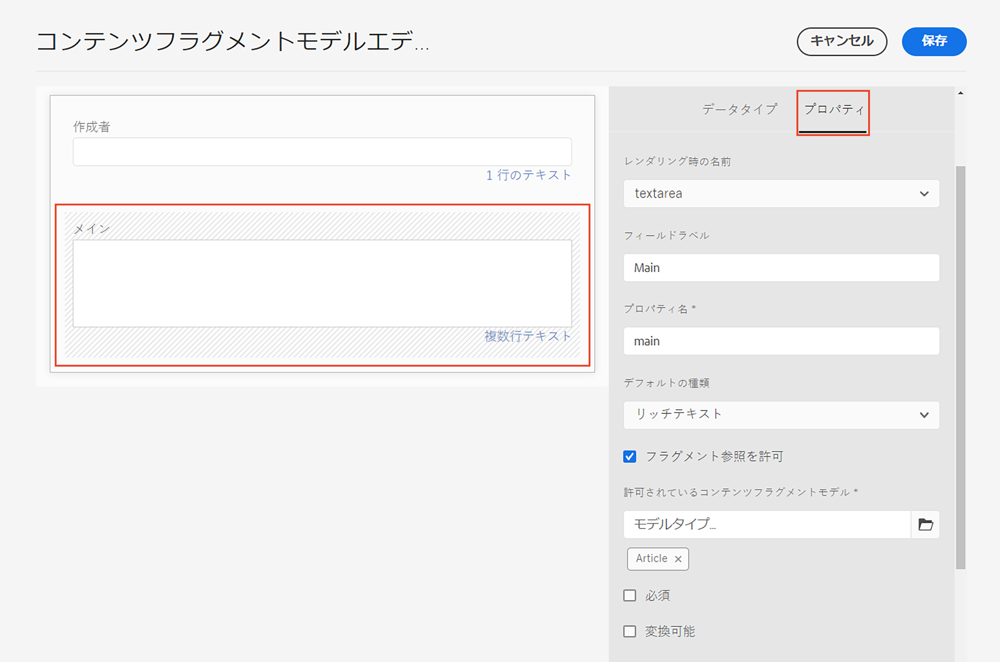
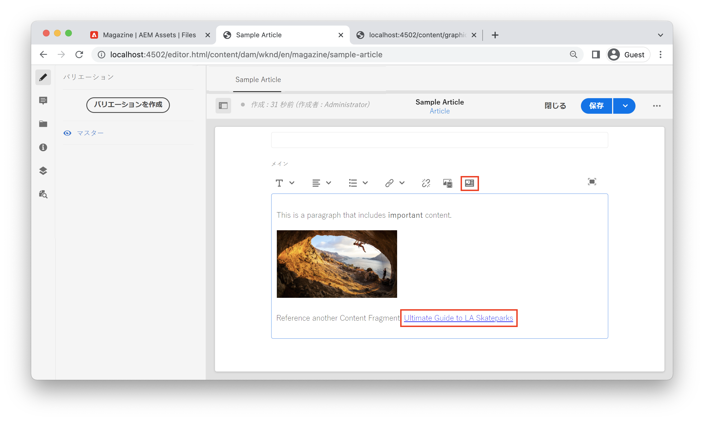

# AEM ヘッドレスを含むリッチテキスト

複数行テキストフィールドは、コンテンツフラグメントのデータタイプであり、これによってオーサーはリッチテキストコンテンツを作成することができます。画像や他のコンテンツフラグメントなどの他のコンテンツへの参照を、テキストのフロー内にインラインで動的に挿入することができます。 1 行テキストフィールドは、単純なテキスト要素に使用するコンテンツフラグメントの別のデータタイプです。

AEM の GraphQL API は、リッチテキストを HTML、プレーンテキストや純粋な JSON として返す強力な機能を備えています。 JSON 表現は、クライアントアプリケーションがコンテンツのレンダリング方法を完全に制御できるため、強力です。

## 複数行エディター

>[!VIDEO](https://video.tv.adobe.com/v/342104?quality=12&learn=on)

コンテンツフラグメントエディターで、複数行テキストフィールドのメニューバーを使用すると、オーサーは **太字**、*斜体*、下線などの標準的なリッチ テキスト書式設定機能を利用することができます。複数行フィールドをフルスクリーンモードで開くと、[段落タイプ、検索と置換、スペル チェックなどの追加の書式設定ツールが有効になります](https://experienceleague.adobe.com/docs/experience-manager-cloud-service/content/assets/content-fragments/content-fragments-variations.html?lang=ja)。

>[!NOTE]
>
> 複数行エディターのリッチテキストプラグインはカスタマイズできません。

## 複数行テキストのデータタイプ {#multi-line-data-type}

コンテンツフラグメントモデルを定義してリッチテキストオーサリングを有効にする場合は、**複数行テキスト**&#x200B;データタイプを使用します。



複数行フィールドの複数のプロパティを設定することができます。

この&#x200B;**レンダリング内容**&#x200B;プロパティは次のように設定することができます。

* テキスト領域 - 1 つの複数行フィールドをレンダリングします。
* 複数フィールド - 複数の「複数行」フィールドをレンダリングします。


この&#x200B;**デフォルトタイプ**&#x200B;は次のように設定することができます。

* リッチテキスト
* マークダウン
* プレーンテキスト

この「**デフォルトタイプ**」オプションは編集エクスペリエンスに直接影響し、リッチテキストツールが存在するかどうかを決定します。

**フラグメント参照を許可する** をチェックし、**許可されたコンテンツフラグメントモデル** を設定するこにより、他のコンテンツフラグメントへの[インライン参照を有効にする](#insert-fragment-references)こともできます。

コンテンツをローカライズする場合は、「**翻訳対象**」ボックスをチェックします。「リッチテキスト」と「プレーンテキスト」のみがローカライズすることができます。 [詳細については、ローカライズされたコンテンツの操作](./localized-content.md)を参照してください。

## GraphQL API を使用したリッチテキスト応答

GraphQL クエリを作成する場合、開発者は、複数行のフィールドから `html`、`plaintext`、`markdown`、`json` のうちの様々な応答タイプを選択することができます。

開発者は、コンテンツフラグメントエディタで [JSON プレビュー](https://experienceleague.adobe.com/docs/experience-manager-cloud-service/content/assets/content-fragments/content-fragments-json-preview.html?lang=ja)を使用して、GraphQL API を使用して返すことができる現在のコンテンツフラグメントのすべての値を表示することができます。

## GraphQL 永続クエリ

複数行フィールドに `json` 応答形式を選択すると、リッチテキストコンテンツを扱う際に最高の柔軟性を発揮します。リッチテキストコンテンツは、クライアントプラットフォームに基づいて一意に処理することができる JSON ノードタイプの配列として提供されます。

以下は、`main` という名前の複数行フィールドの JSON 応答タイプです。これには「*これは、**重要**なコンテンツを含む段落を含む段落です。*」という段落が含まれます（ここでは「重要」が&#x200B;**太字**&#x200B;表記になっています）。

```graphql
query ($path: String!) {
  articleByPath(_path: $path)
  {
    item {
      _path
      main {
        json
      }
    }
  }
}
```

`_path` フィルターで使用される `$path` 変数には、`/content/dam/wknd/en/magazine/sample-article` などの、コンテンツフラグメントへのフルパスが必要です。

**GraphQL 応答：**

```json
{
  "data": {
    "articleByPath": {
      "item": {
        "_path": "/content/dam/wknd/en/magazine/sample-article",
        "main": {
          "json": [
            {
              "nodeType": "paragraph",
              "content": [
                {
                  "nodeType": "text",
                  "value": "This is a paragraph that includes "
                },
                {
                  "nodeType": "text",
                  "value": "important",
                  "format": {
                    "variants": [
                      "bold"
                    ]
                  }
                },
                {
                  "nodeType": "text",
                  "value": " content. "
                }
              ]
            }
          ]
        }
      }
    }
  }
}
```

### その他の例

 `main` という名前の複数行フィールドの応答タイプの数例を以下に示します。この例では、「これは、**重要な**&#x200B;コンテンツを含む段落です。」という段落が含まれます。ここでは「重要」が&#x200B;**太字**&#x200B;表記になっています。

+++HTML の例

**GraphQL 永続クエリ：**

```graphql
query ($path: String!) {
  articleByPath(_path: $path)
  {
    item {
      _path
      main {
        html
      }
    }
  }
}
```

**GraphQL 応答：**

```json
{
  "data": {
    "articleByPath": {
      "item": {
        "_path": "/content/dam/wknd/en/magazine/sample-article",
        "main": {
            "html": "<p>This is a paragraph that includes <b>important</b> content.&nbsp;</p>\n"
        }
      }
    }
  }
}
```

+++

+++Markdown の例

**GraphQL 永続クエリ：**

```graphql
query ($path: String!) {
  articleByPath(_path: $path)
  {
    item {
      _path
      main {
        markdown
      }
    }
  }
}
```

**GraphQL 応答：**

```json
{
  "data": {
    "articleByPath": {
      "item": {
        "_path": "/content/dam/wknd/en/magazine/sample-article",
        "main": {
            "markdown": "This is a paragraph that includes **important** content. \n\n ",
        }
      }
    }
  }
}
```

+++

+++Plaintext の例

**GraphQL 永続クエリ：**

```graphql
query ($path: String!) {
  articleByPath(_path: $path)
  {
    item {
      _path
      main {
        plaintext
      }
    }
  }
}
```

**GraphQL 応答：**

```json
{
  "data": {
    "articleByPath": {
      "item": {
        "_path": "/content/dam/wknd/en/magazine/sample-article",
        "main": {
            "plaintext": "This is a paragraph that includes important content. ",
        }
      }
    }
  }
}
```

`plaintext` レンダリングオプションを選択すると、すべての書式設定が削除されます。

+++


## リッチテキスト JSON 応答のレンダリング {#render-multiline-json-richtext}

複数行フィールドのリッチテキスト JSON 応答は、階層ツリーとして構造化されます。各オブジェクトまたはノードは、リッチテキストの異なる HTML ブロックを表します。

複数行テキストフィールドの JSON 応答の例を示します。各オブジェクトまたはノードに、`paragraph`、`link`、`text` などのリッチテキストからの HTML ブロックを表す `nodeType` が含まれていることを確認します。各ノードにはオプションで、現在のノードの子を含むサブ配列である `content` が含まれます。

```json
"json": [// root "content" or child nodes
            {
                "nodeType": "paragraph", // node for a paragraph
                "content": [ // children of current node
                {
                    "nodeType": "text", // node for a text
                    "value": "This is the first paragraph. "
                },
                {
                    "nodeType": "link",
                    "data": {
                        "href": "http://www.adobe.com"
                    },
                    "value": "An external link"
                }
                ],
            },
            {
                "nodeType": "paragraph",
                "content": [
                {
                    "nodeType": "text",
                    "value": "This is the second paragraph."
                },
                ],
            },
]
```

複数行の `json` 応答をレンダリングする最も簡単な方法は、応答内の各オブジェクトまたはノードを処理してから、現在のノードの子を処理することです。再帰関数を使用して、JSON ツリーをトラバースできます。

再帰的なトラバーサルアプローチを示すサンプルコードを示します。これらの例は JavaScript ベースであり、React の [JSX](https://reactjs.org/docs/introducing-jsx.html) を使用していますが、プログラミングの考え方はどの言語にも適用できます。

```javascript
// renderNodeList - renders a list of nodes
function renderNodeList(childNodes) {
    
    if(!childNodes) {
        // null check
        return null;
    }

    return childNodes.map(node, index) => {
        return renderNode(node);
    }
}
```

`renderNodeList` は、`childNodes` の配列を取る再帰関数です。次に、配列内の各ノードが関数 `renderNode` に渡され、ノードに子がある場合、関数は `renderNodeList` を呼び出します。

```javascript
// renderNode - renders an individual node
function renderNode(node) {

    // if the current node has children, recursively process them
    const children = node.content ? renderNodeList(node.content) : null;

    // use a map to render the current node based on its nodeType
    return nodeMap[node.nodeType]?.(node, children);
}
```

`renderNode` 関数は、`node` という名前の単一のオブジェクトを想定しています。ノードは、上記の `renderNodeList` 関数を使用して再帰的に処理される子を持つ場合があります。最後に、`nodeMap` を使用して、その `nodeType` に基づいてノードのコンテンツをレンダリングします。

```javascript
// nodeMap - object literal that maps a JSX response based on a given key (nodeType)
const nodeMap = {
    'paragraph': (node, children) => <p>{children}</p>,
    'link': node => <a href={node.data.href} target={node.data.target}>{node.value}</a>,
    'text': node => node.value,
    'unordered-list': (node, children) => <ul>{children}</ul>,
    'ordered-list': (node, children) => <ol>{children}</ol>,
    'list-item': (node, children) => <li>{children}</li>,
    ...
}
```

`nodeMap` は、マップとして使用される JavaScript オブジェクトのリテラルです。それぞれの「キー」は異なる `nodeType` を表します。`node` および `children` のパラメーターは、ノードをレンダリングする結果の関数に渡すことができます。この例で使用されている戻り値の型は JSX ですが、HTML コンテンツを表す文字列リテラルを構築するためにこのアプローチを適用することもできます。

### フルコードの例

再利用可能なリッチテキストのレンダリングユーティリティは、[WKND GraphQL React の例](https://github.com/adobe/aem-guides-wknd-graphql/tree/main/react-app)にあります。

* [renderRichText.js](https://github.com/adobe/aem-guides-wknd-graphql/blob/main/react-app/src/utils/renderRichText.js) - 関数 `mapJsonRichText` を公開する再利用可能なユーティリティ。このユーティリティは、リッチテキスト JSON 応答を React JSX としてレンダリングするコンポーネントで使用できます。
* [AdventureDetail.js](https://github.com/adobe/aem-guides-wknd-graphql/blob/main/react-app/src/components/AdventureDetail.js) - リッチテキストを含む GraphQL リクエストを作成するサンプルコンポーネント。このコンポーネントは、`mapJsonRichText` ユーティリティを使用してリッチテキストと参照を表示します。


## リッチテキストへのインライン参照の追加 {#insert-fragment-references}

複数行フィールドを使用すると、作成者は、AEM Assets から画像やその他のデジタルアセットをリッチテキストのフローに挿入できます。


上のスクリーンショットは、「**アセットの挿入**」ボタンを使用して複数行フィールドに挿入された画像を示しています。

「**コンテンツフラグメントを挿入**」ボタンを使用して、他のコンテンツフラグメントへの参照を複数行のフィールドにリンクまたは挿入することもできます。



上のスクリーンショットは、複数行のフィールドに挿入されている別のコンテンツフラグメント「Ultimate Guide to LA Skate Parks」を示しています。フィールドに挿入できるコンテンツフラグメントのタイプは、コンテンツフラグメントモデルの[複数行データタイプ](#multi-line-data-type)の&#x200B;**許可されたコンテンツフラグメントモデル**&#x200B;の設定によって制御されます。

## GraphQL でのインライン参照のクエリ

GraphQL API を使用すると、開発者は、複数行フィールドに挿入された参照に関する追加のプロパティを含むクエリを作成できます。 JSON 応答には、これらの追加のプロパティを一覧表示する別個の `_references` オブジェクトが含まれています。JSON 応答を使用すると、開発者は、特有の HTML に対処する必要がなく、参照やリンクのレンダリング方法を完全に制御できます。

例えば、次のような場合に役立ちます。

* React Router や Next.js の使用など、シングルページアプリケーションを実装する際に他のコンテンツフラグメントへのリンクを管理するカスタムルーティングロジックを含める場合
* AEM パブリッシュ環境への絶対パスを `src` 値として使用して、インライン画像をレンダリングする場合
* 追加のカスタムプロパティを使用して、別のコンテンツフラグメントへの埋め込み参照をレンダリングする方法を決定する場合

`json` 戻り型を使用し、GraphQL クエリを作成するときに `_references` オブジェクトを含めます。

**GraphQL 永続クエリ**

```graphql
query ($path: String!) {
  articleByPath(_path: $path, _assetTransform: { format: JPG, preferWebp: true })
  {
    item {
      _path
      main {
        json
      }
    }
    _references {
      ...on ImageRef {
        _dynamicUrl
        __typename
      }
      ...on ArticleModel {
        _path
        author
        __typename
      }  
    }
  }
}
```

上記のクエリでは、`main` フィールドが JSON として返されます。`_references` オブジェクトには、タイプ `ImageRef` またはタイプ `ArticleModel` の参照を処理するフラグメントが含まれます。

**JSON 応答：**

```json
{
  "data": {
    "articleByPath": {
      "item": {
        "_path": "/content/dam/wknd/en/magazine/sample-article",
        "main": {
          "json": [
            {
              "nodeType": "paragraph",
              "content": [
                {
                  "nodeType": "text",
                  "value": "This is a paragraph that includes "
                },
                {
                  "nodeType": "text",
                  "value": "important",
                  "format": {
                    "variants": [
                      "bold"
                    ]
                  }
                },
                {
                  "nodeType": "text",
                  "value": " content. "
                }
              ]
            },
            {
              "nodeType": "paragraph",
              "content": [
                {
                  "nodeType": "reference",
                  "data": {
                    "path": "/content/dam/wknd/en/activities/climbing/sport-climbing.jpg",
                    "mimetype": "image/jpeg"
                  }
                }
              ]
            },
            {
              "nodeType": "paragraph",
              "content": [
                {
                  "nodeType": "text",
                  "value": "Reference another Content Fragment: "
                },
                {
                  "nodeType": "reference",
                  "data": {
                    "href": "/content/dam/wknd/en/magazine/la-skateparks/ultimate-guide-to-la-skateparks",
                    "type": "fragment"
                  },
                  "value": "Ultimate Guide to LA Skateparks"
                }
              ]
            }
          ]
        }
      },
      "_references": [
        {
          "_dynamicUrl": "/adobe/dynamicmedia/deliver/dm-aid--dd42d814-88ec-4c4d-b5ef-e3dc4bc0cb42/sport-climbing.jpg?preferwebp=true",
          "__typename": "ImageRef"
        },
        {
          "_path": "/content/dam/wknd/en/magazine/la-skateparks/ultimate-guide-to-la-skateparks",
          "author": "Stacey Roswells",
          "__typename": "ArticleModel"
        }
      ]
    }
  }
}
```

JSON 応答には、`"nodeType": "reference"` で、リッチテキスト内のどこに参照が含まれているかが含まれます。 この `_references` オブジェクトには、各参照が含まれます。

## リッチテキストでのインライン参照のレンダリング

インライン参照をレンダリングするには、[複数行の JSON 応答のレンダリング](#render-multiline-json-richtext)で説明されている再帰的なアプローチを拡張できます。

`nodeMap` は、JSON ノードをレンダリングするマップです。

```javascript
const nodeMap = {
        'reference': (node, children) => {

            // variable for reference in _references object
            let reference;
            
            // asset reference
            if (node.data.path) {
                // find reference based on path
                reference = references.find( ref => ref._path === node.data.path);
            }
            // Fragment Reference
            if (node.data.href) {
                // find in-line reference within _references array based on href and _path properties
                reference = references.find( ref => ref._path === node.data.href);
            }

            // if reference found, merge properties of reference and current node, then return render method of it using __typename property
            return reference ? renderReference[reference.__typename]({...reference, ...node}) : null;
        }
    }
```

高レベルのアプローチは、複数行の JSON 応答で `nodeType` が `reference` と等しい場合を調べるためのものです。 次に、GraphQL 応答で返された `_references` オブジェクトを含むカスタムレンダリング関数を呼び出すことができます。

次に、インライン参照パスを `_references` オブジェクトと別のカスタムマップ `renderReference` の対応するエントリと比較することができます。

```javascript
const renderReference = {
    // node contains merged properties of the in-line reference and _references object
    'ImageRef': (node) => {
        // when __typename === ImageRef
        return  
    },
    'ArticleModel': (node) => {
        // when __typename === ArticleModel
        return <Link to={`/article:${node._path}`}>{`${node.value}`}</Link>;
    }
    ...
}
```

`_references` オブジェクトの `__typename` を使用して、異なる参照タイプを異なるレンダリング関数にマッピングできます。

### フルコードの例

カスタム参照レンダラーの記述の完全な例については、[WKND GraphQL React の例](https://github.com/adobe/aem-guides-wknd-graphql/tree/main/react-app)に含まれる [AdventureDetail.js](https://github.com/adobe/aem-guides-wknd-graphql/blob/main/react-app/src/components/AdventureDetail.js) をご覧ください。

## エンドツーエンドの例

>[!VIDEO](https://video.tv.adobe.com/v/342105?quality=12&learn=on)

>[!NOTE]
>
> 上のビデオでは、`_publishUrl` を使用してイメージ参照をレンダリングします。代わりに、[Web に最適化された画像の使い方](./images.md)で説明されている `_dynamicUrl` を使用してください。


前述のビデオでは、エンドツーエンドの例を示します。

1. コンテンツフラグメントモデルの複数行テキストフィールドを更新して、フラグメント参照を許可する
2. コンテンツフラグメントエディターを使用して、複数行テキストフィールドに画像と別のフラグメントへの参照を含めます。
3. 複数行テキストの応答を JSON および使用される `_references` として含む GraphQLクエリを作成する。
4. リッチテキスト応答のインライン参照をレンダリングする React SPA を記述する。
