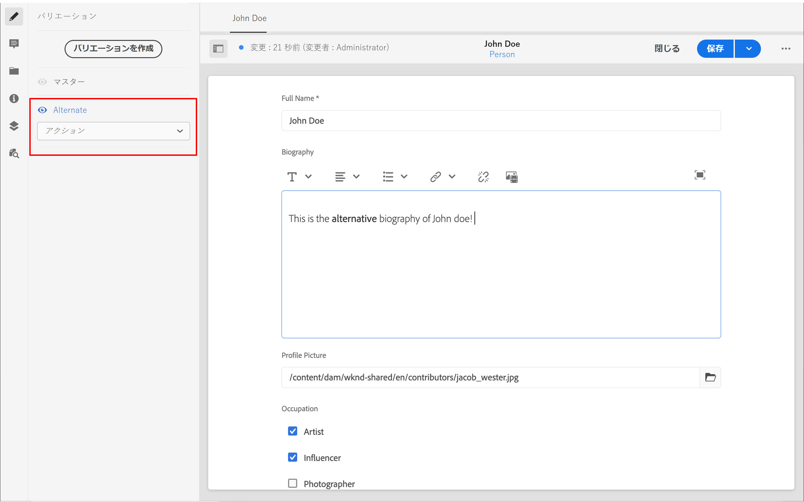

# コンテンツフラグメントのオーサリング {#authoring-content-fragments}

この章では、 [新しく定義されたコンテンツフラグメントモデル](./content-fragment-models.md). また、コンテンツフラグメントのバリエーションを作成する方法についても説明します。

## 前提条件 {#prerequisites}

これは複数のパートから成るチュートリアルで、 [コンテンツフラグメントモデルの定義](./content-fragment-models.md) が完了しました。

## 目的 {#objectives}

* コンテンツフラグメントモデルに基づいてコンテンツフラグメントを作成する
* コンテンツフラグメントのバリエーションの作成

## アセットフォルダーの作成

コンテンツフラグメントは、AEM Assetsのフォルダーに保存されます。 前の章で作成したモデルからコンテンツフラグメントを作成するには、コンテンツフラグメントを保存するためのフォルダーを作成する必要があります。 特定のモデルからフラグメントを作成できるようにするには、フォルダーで設定が必要です。

1. AEM Start 画面からに移動します。 **Assets** > **ファイル**.

   

1. タップ **作成** 隅にある **フォルダー**. 表示されるダイアログで、次のように入力します。

   * タイトル*: **マイプロジェクト**
   * 名前： **my-project**

   

1. を選択します。 **マイフォルダ** フォルダーとタップ **プロパティ**.

   

1. 次をタップします。 **Cloud Services** タブをクリックします。 の下 **クラウド設定** パスファインダーを使用して **マイプロジェクト** 設定。 値は、 `/conf/my-project`.

   

   このプロパティを設定すると、前の章で作成したモデルを使用してコンテンツフラグメントを作成できます。

1. 次をタップします。 **ポリシー** タブをクリックします。 の下 **許可されているコンテンツフラグメントモデル** パスファインダーを使用して **人物** および **チーム** 以前に作成されたモデル。

   

   これらのポリシーは、任意のサブフォルダーに自動的に継承され、上書きできます。 タグ別のモデルを許可したり、他のプロジェクト設定（WKND 共有など）のモデルを有効にしたりすることもできます。 このメカニズムにより、コンテンツ階層を強力に管理できます。

1. タップ **保存して閉じる** をクリックして、フォルダーのプロパティに対する変更を保存します。

1. 次の **マイプロジェクト** フォルダー。

1. 次の値で別のフォルダーを作成します。

   * タイトル*: **英語**
   * 名前：**en**

   ベストプラクティスは、多言語サポート用のプロジェクトを設定することです。 詳しくは、 [詳しくは、次のドキュメントページを参照してください](https://experienceleague.adobe.com/docs/experience-manager-cloud-service/content/assets/admin/translate-assets.html).

## コンテンツフラグメントを作成 {#create-content-fragment}

次に、 **チーム** および **人物** モデル。

1. 「AEM Start」画面で、をタップします。 **コンテンツフラグメント** をクリックして、コンテンツフラグメント UI を開きます。

   

1. 左側のレールで、を展開します。 **マイプロジェクト** とタップします。 **英語**.
1. タップ **作成** 育てる **新しいコンテンツフラグメント** ダイアログを開き、次の値を入力します。

   * 場所: `/content/dam/my-project/en`
   * コンテンツフラグメントモデル： **人物**
   * タイトル： **John Doe**
   * 名前：`john-doe`

   
1. 「**作成**」をタップします。
1. 上記の手順を繰り返して、 **Alison Smith**:

   * 場所: `/content/dam/my-project/en`
   * コンテンツフラグメントモデル： **人物**
   * タイトル： **Alison Smith**
   * 名前：`alison-smith`

   タップ **作成** をクリックして、新しいユーザーフラグメントを作成します。

1. 次に、手順を繰り返して新しい **チーム** ～を表す断片 **チームアルファ**:

   * 場所: `/content/dam/my-project/en`
   * コンテンツフラグメントモデル： **チーム**
   * タイトル： **チームアルファ**
   * 名前：`team-alpha`

   タップ **作成** をクリックして、新しいチームフラグメントを作成します。

1. これで、の下に 3 つのコンテンツフラグメントが存在するようになりました。 **マイプロジェクト** > **英語**:

   

## 担当者コンテンツフラグメントの編集 {#edit-person-content-fragments}

次に、新しく作成されたフラグメントにデータを入力します。

1. の横にあるチェックボックスをタップします。 **John Doe** とタップします。 **開く**.

   

1. コンテンツフラグメントエディターには、コンテンツフラグメントモデルに基づくフォームが含まれます。 様々なフィールドに入力し、 **John Doe** フラグメント。 プロファイル画像の場合は、 WKND Shared 内の画像の 1 つを自由に選択するか、独自の画像をAEM Assetsにアップロードしてください。

   

1. 次に、 **バリエーションを作成** をクリックします。 ダイアログで、 **代替** バリエーション名。

1. の要素の一部を変更する **代替** バリエーション。

   

   バリエーション機能を使用すると、作成者は同じコンテンツフラグメントの異なるバージョンを作成できます。 これは、長い形式の記事の概要バージョンを提供するために使用できます。 デフォルトでは、 **マスター** バリエーションが作成されます。 バリエーションの複数行テキストフィールド要素は、マスターバリエーションと同期できます。

1. タップ **保存して閉じる** をクリックして、John Doe フラグメントに対する変更を保存します。
1. コンテンツフラグメント UI に戻り、 **Alison Smith** ファイルを編集します。
1. 上記の手順を繰り返して、 **Alison Smith** フラグメントとコンテンツ。

## チームコンテンツフラグメントを編集 {#edit-team-content-fragment}

1. を開きます。 **チームアルファ** コンテンツフラグメント UI を使用してコンテンツフラグメントを作成します。
1. 次のフィールドに入力します。 **タイトル**, **短縮名**、および **説明**.
1. を選択します。 **John Doe** および **Alison Smith** コンテンツフラグメントを使用して **チームメンバー** フィールド：

   

   >[!NOTE]
   >
   >また、 **新しいコンテンツフラグメント** 」ボタンをクリックします。

1. タップ **保存して閉じる** をクリックして、チームアルファフラグメントの変更を保存します。

## WKND コンテンツフラグメントの調査（オプション） {#explore-wknd-content-fragments}

次の場合、 [が WKND Shared サンプルコンテンツをインストールしている](./overview.md#install-sample-content) コンテンツフラグメントを調べて、Adventures、記事、作成者のモデルを調べ、コンテンツ作成に関するより多くのアイデアを得ることができます。

## おめでとうございます。 {#congratulations}

おめでとうございます。複数のコンテンツフラグメントを作成し、バリエーションを作成しました。

## 次の手順 {#next-steps}

次の章では、 [GraphQL API の参照](explore-graphql-api.md)を参照し、組み込みの GraphQL ツールを使用してAEM GraphQL API を調べます。 コンテンツフラグメントモデルに基づいて、AEMが GraphQL スキーマを自動的に生成する方法を説明します。 GraphQL 構文を使用して、基本的なクエリを作成してみます。

## 関連ドキュメント

* [コンテンツフラグメントの管理](https://experienceleague.adobe.com/docs/experience-manager-cloud-service/content/assets/content-fragments/content-fragments-managing.html)
* [バリエーション - フラグメントコンテンツのオーサリング](https://experienceleague.adobe.com/docs/experience-manager-cloud-service/content/assets/content-fragments/content-fragments-variations.html)
