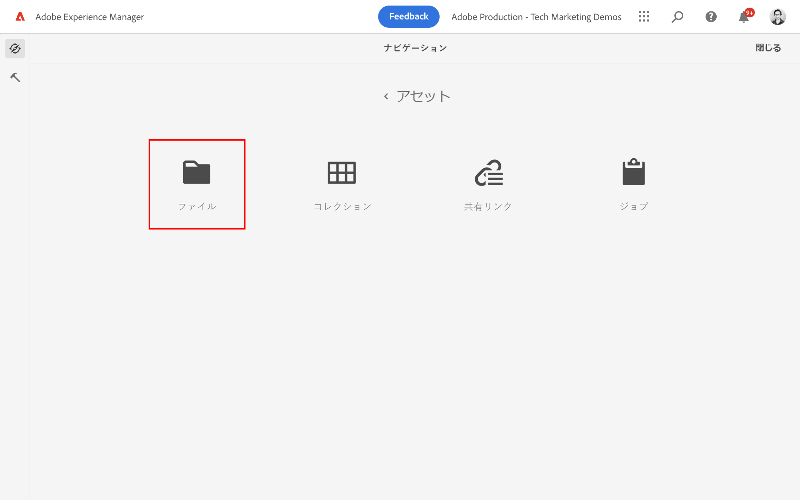
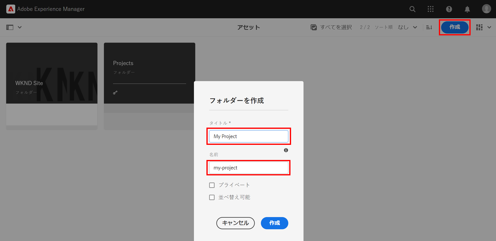
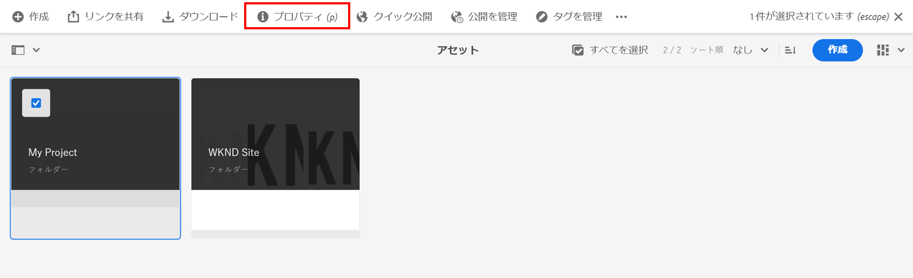
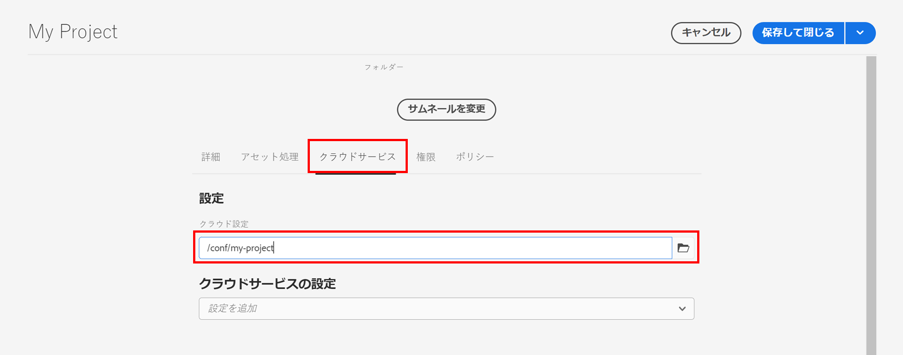
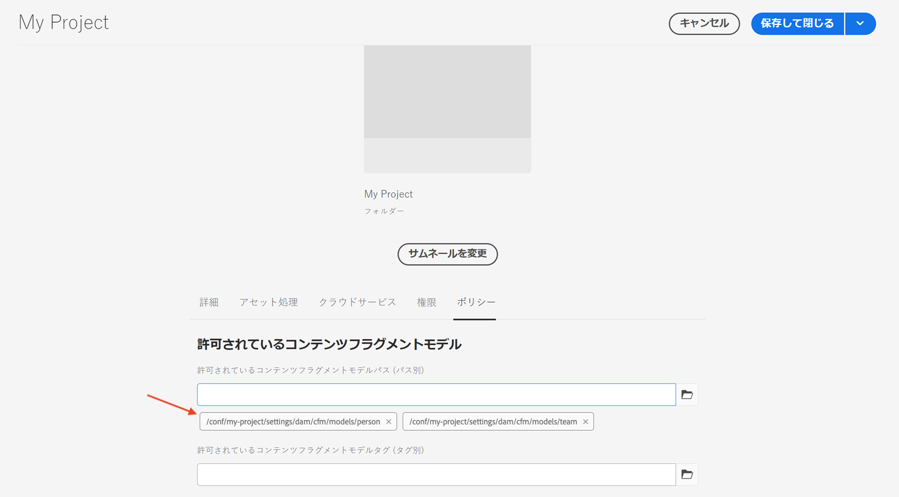
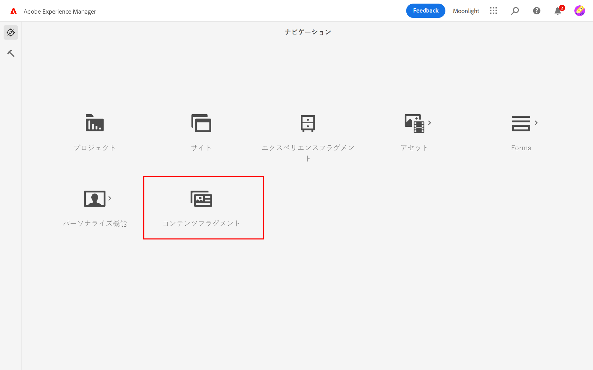
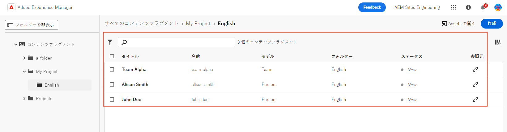
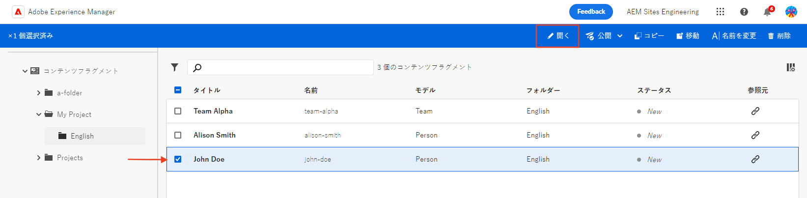
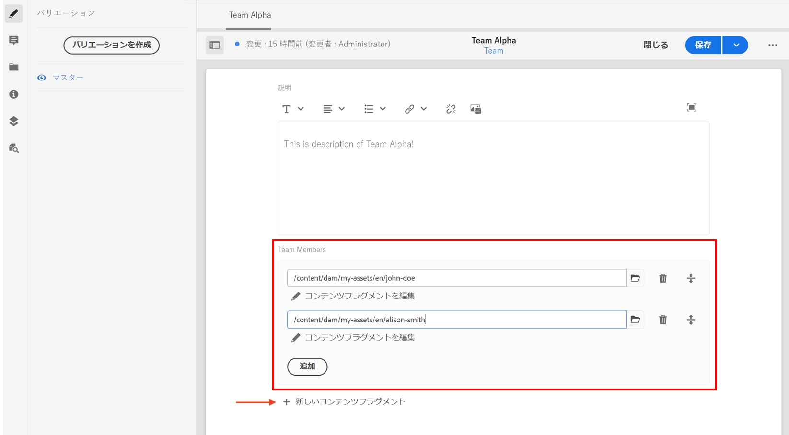

# コンテンツフラグメントのオーサリング {#authoring-content-fragments}

この章では、[新しく定義されたコンテンツフラグメントモデル](./content-fragment-models.md)に基づいて、新しいコンテンツフラグメントを作成し、編集します。また、コンテンツフラグメントのバリエーションを作成する方法についても説明します。

## 前提条件 {#prerequisites}

これは複数の部で構成されるチュートリアルで、「[コンテンツフラグメントモデルの定義](./content-fragment-models.md)」でまとめられている手順が完了していることを前提としています。

## 目的 {#objectives}

* コンテンツフラグメントモデルに基づいたコンテンツフラグメントの作成
* コンテンツフラグメントのバリエーションの作成

## アセットフォルダーの作成

コンテンツフラグメントは、AEM Assets のフォルダーに保存されます。前の章で作成したモデルからコンテンツフラグメントを作成するには、コンテンツフラグメントを保存するためのフォルダーを作成する必要があります。特定のモデルからフラグメントを作成できるようにするには、フォルダーで設定が必要です。

1. AEM スタート画面で、**アセット**／**ファイル**&#x200B;に移動します。

   

1. 右上隅の「**作成**」をタップし、「**フォルダー**」をタップします。表示されたダイアログで、次のように入力します。

   * タイトル*：**My Project**
   * 名前：**my-project**

   

1. **My Folder** フォルダーを選択し、「**プロパティ**」をタップします。

   

1. 「**クラウドサービス**」タブを選択します。「クラウド設定」タブで、パスファインダーを使用して **My Project** の設定を選択します。値は `/conf/my-project` にします。

   

   このプロパティを設定すると、前の章で作成したモデルを使用してコンテンツフラグメントを作成できます。

1. 「**ポリシー**」タブをタップし、「**許可されているコンテンツフラグメントモデル**」フィールドの下にあるパスファインダーを使用して 、以前に作成した&#x200B;**人物**&#x200B;および&#x200B;**チーム**&#x200B;モデルを選択します。

   

   これらのポリシーは、任意のサブフォルダーに自動的に継承され、上書きできます。また、タグ別にモデルを許可したり、他のプロジェクト設定からのモデルを有効にしたりすることもできます。このメカニズムにより、コンテンツ階層を強力に管理できます。

1. 「**保存して閉じる**」をタップして、フォルダーのプロパティの変更を保存します。

1. **My Project** フォルダーの中に移動します。

1. 別のフォルダーを次の値で作成します。

   * タイトル*：**English**
   * 名前：**en**

   多言語サポート用のプロジェクトを設定することがベストプラクティスです。[詳しくは、次の文書のページ](https://experienceleague.adobe.com/docs/experience-manager-cloud-service/content/assets/admin/translate-assets.html?lang=ja)を参照してください。

## コンテンツフラグメントの作成 {#create-content-fragment}

>[!TIP]
>
>ローカル AEM SDK ユーザーの場合、以下に説明するコンテンツフラグメント UI の代わりに、AEM Assets UI を使用してコンテンツフラグメントを作成しオーサリングします。手順について詳しくは、[AEM ドキュメント](https://experienceleague.adobe.com/docs/experience-manager-cloud-service/content/assets/content-fragments/content-fragments-managing.html?lang=ja)を参照してください。

次に、**チーム**&#x200B;および&#x200B;**人物**&#x200B;のモデルに基づいて、いくつかのコンテンツフラグメントが作成されます。

1. AEM スタート画面で「**コンテンツフラグメント**」をタップして、コンテンツフラグメント UI を開きます。

   

1. 左側のパネルで「**My Project**」を展開し、「**English**」をタップします。
1. 「**作成**」をタップして、**新しいコンテンツフラグメント**&#x200B;ダイアログを表示させ、次の値を入力します。

   * 場所：`/content/dam/my-project/en`
   * コンテンツフラグメントモデル：**人物**
   * タイトル：**John Doe**
   * 名前：`john-doe`

   
1. 「**作成**」をタップします。
1. 上記の手順を繰り返して、**Alison Smith** を表すフラグメントを作成します。

   * 場所：`/content/dam/my-project/en`
   * コンテンツフラグメントモデル：**人物**
   * タイトル：**Alison Smith**
   * 名前：`alison-smith`

   「**作成**」をクリックして、ユーザーフラグメントを作成します。

1. 次に、**チームアルファ**&#x200B;を表す&#x200B;**チーム**&#x200B;フラグメントを作成する手順を繰り返します。

   * 場所：`/content/dam/my-project/en`
   * コンテンツフラグメントモデル：**チーム**
   * タイトル：**チームアルファ**
   * 名前：`team-alpha`

   「**作成**」をクリックして、チームフラグメントを作成します。

1. **マイプロジェクト**／**英語**&#x200B;の下に 3 つのコンテンツフラグメントがあるはずです。

   

## ユーザーコンテンツフラグメントの編集 {#edit-person-content-fragments}

次に、新しく作成されたフラグメントにデータを入力します。

1. 「**John Doe**」の横にあるチェックボックスをクリックし、「**開く**」をクリックします。

   

1. コンテンツフラグメントエディターには、コンテンツフラグメントモデルに基づくフォームが含まれています。様々なフィールドに入力して、コンテンツを **John Doe** フラグメントに追加します。プロファイル写真については、自分の写真を AEM Assets にアップロードします。

   

1. 「**保存して閉じる**」をクリックして、John Doe フラグメントへの変更を保存します。
1. コンテンツフラグメント UI に戻り、**Alison Smith** ファイルを開いて編集します。
1. 上記の手順を繰り返して、**Alison Smith** フラグメントにコンテンツを入力します。

## チームコンテンツフラグメントの編集 {#edit-team-content-fragment}

1. コンテンツフラグメント UI を使用して、**チームアルファ**&#x200B;コンテンツフラグメントを開きます。
1. 「**タイトル**」、「**短縮名**」、「**説明**」フィールドにそれぞれ入力します。
1. **John Doe** コンテンツフラグメントと **Alison Smith** コンテンツフラグメントを選択して、「**チームメンバー**」フィールドに入力します。

   

   >[!NOTE]
   >
   >「**新しいコンテンツフラグメント**」ボタンを使用して、インラインでコンテンツフラグメントを作成することもできます。

1. 「**保存して閉じる**」をクリックして、チームアルファフラグメントへの変更を保存します。

## コンテンツフラグメントの公開

>[!TIP]
>
>ローカル AEM SDK ユーザーの場合、以下に説明するコンテンツフラグメント UI の代わりに、AEM Assets UI を使用してコンテンツフラグメントを公開します。手順について詳しくは、[AEM ドキュメント](https://experienceleague.adobe.com/docs/experience-manager-cloud-service/content/assets/content-fragments/content-fragments-managing.html?lang=ja#publishing-and-referencing-a-fragment)を参照してください。

レビューと検証が完了したら、作成した `Content Fragments` を公開します

1. AEM スタート画面で「**コンテンツフラグメント**」をクリックしてコンテンツフラグメント UI を開きます。

1. 左側のパネルで「**My Project**」を展開し、「**English**」をタップします。

1. コンテンツフラグメントの横にあるチェックボックスをクリックして、「**公開**」をクリックします。
   

## おめでとうございます。 {#congratulations}

これで完了です。複数のコンテンツフラグメントを作成し、バリエーションを作成しました。

## 次の手順 {#next-steps}

次の章、[GraphQL API の探索](explore-graphql-api.md)では、組み込みの GrapQL ツールを使用して AEM の GraphQL API を探索します。AEM がコンテンツフラグメントモデルに基づいて GraphQL スキーマを自動生成する方法について説明します。GraphQL 構文を使用して、基本的なクエリを作成してみます。

## 関連ドキュメント

* [コンテンツフラグメントの管理](https://experienceleague.adobe.com/docs/experience-manager-cloud-service/content/assets/content-fragments/content-fragments-managing.html?lang=ja)
* [バリエーション - フラグメントコンテンツのオーサリング](https://experienceleague.adobe.com/docs/experience-manager-cloud-service/content/assets/content-fragments/content-fragments-variations.html?lang=ja)
