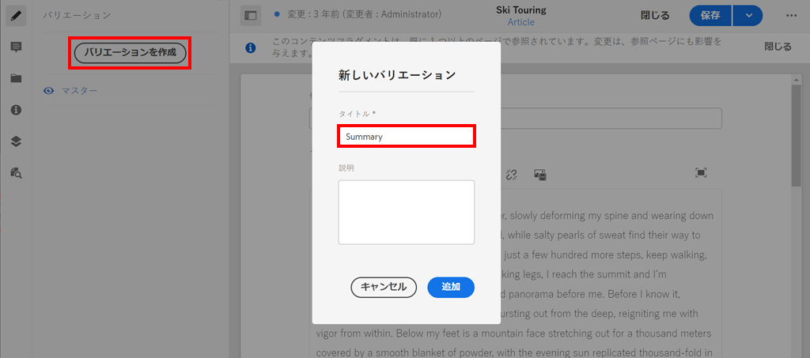

# コンテンツフラグメントのオーサリング{#authoring-content-fragments}

この章では、新しく定義したコントリビューターコンテンツフラグメントモデル](./content-fragment-models.md)に基づいて、新しいコンテンツフラグメントを作成および編集します。 [また、コンテンツフラグメントのバリエーションを作成する方法についても説明します。

## 前提条件 {#prerequisites}

これは複数のパートから成るチュートリアルで、[コンテンツフラグメントモデルの定義](./content-fragment-models.md)で説明されている手順が完了していることを前提としています。

## 目的 {#objectives}

* コンテンツフラグメントモデルに基づくコンテンツフラグメントの作成
* コンテンツフラグメントバリエーションの作成

## コンテンツフラグメントオーサリングの概要 {#overview}

>[!VIDEO](https://video.tv.adobe.com/v/22451/?quality=12&learn=on)

上記のビデオでは、コンテンツフラグメントのオーサリングの概要を説明します。

## コンテンツフラグメント{#create-content-fragment}の作成

前の章[コンテンツフラグメントモデルの定義](./content-fragment-models.md)では、**コントリビューター**&#x200B;モデルが作成されました。 このモデルを使用して、新しいコンテンツフラグメントを作成します。

1. **AEM Start**&#x200B;メニューから、**Assets**/**Files**&#x200B;に移動します。
1. フォルダーをクリックして、**WKND Site** > **English** > **Contributors**&#x200B;に移動します。 このフォルダーには、WKNDブランドのコントリビューター向けのヘッドショットのリストが含まれています。

1. 右上の「**作成**」をクリックし、「**コンテンツフラグメント**」を選択します。

   

1. **コントリビューター**&#x200B;モデルを選択し、「**次へ**」をクリックします。

   

   これは、前の章で作成した&#x200B;**Contributor**&#x200B;モデルと同じです。

1. タイトルに&#x200B;**Stacey Roswells**&#x200B;と入力し、**「作成**」をクリックします。
1. **成功**&#x200B;ダイアログで「**開く**」をクリックして、新しく作成したフラグメントを開きます。

   

   モデルで定義されたフィールドが、コンテンツフラグメントのこのインスタンスを作成するために使用可能になったことを確認します。

1. **姓**&#x200B;に次を入力します。**Stacey Roswells**。
1. **伝記**&#x200B;には、簡単な伝記を入力します。 インスピレーションが必要？ この[テキストファイル](assets/author-content-fragments/stacey-roswells-bio.txt)を自由に再利用してください。
1. **画像参照**&#x200B;の場合、**フォルダー**&#x200B;アイコンをクリックし、**WKNDサイト** **英語** **寄稿者** > **stacey-roswells.jpg&lt;a11/を参照します。>.**&#x200B;これはパスに評価されます。`/content/dam/wknd/en/contributors/stacey-roswells.jpg`.
1. **占有**&#x200B;には&#x200B;**フォトグラファー**&#x200B;を選択します。

   

1. 「**保存**」をクリックして、変更を保存します。

## コンテンツフラグメントバリエーションの作成

すべてのコンテンツフラグメントは、マスター&#x200B;**のバリエーションで始まります。****マスター**&#x200B;のバリエーションは、フラグメントの&#x200B;*デフォルト*&#x200B;コンテンツと見なすことができ、GraphQL APIを使用してコンテンツが公開される際に自動的に使用されます。 コンテンツフラグメントのバリエーションを作成することもできます。 この機能は、実装を柔軟に設計できるようにします。

バリエーションは、特定のチャネルをターゲットにするために使用できます。 例えば、少ない量のテキストを含んだり、チャネル固有の画像を参照したりするモバイル&#x200B;**バリエーションを作成できます。**&#x200B;バリエーションの使用方法は、実際には実装によって異なります。 どの機能と同様に、使用の前に慎重に計画する必要があります。

次に、新しいバリエーションを作成して、使用可能な機能を把握します。

1. **Stacey Roswells**&#x200B;コンテンツフラグメントを再度開きます。
1. 左側のサイドレールで、「**バリエーションを作成**」をクリックします。
1. 「**新しいバリエーション**」モーダルに、「タイトル」に「**概要**」と入力します。

   

1. 「**伝記**」複数行フィールドをクリックし、「**展開**」ボタンをクリックして、複数行フィールドのフルスクリーン表示を入力します。

   

1. 右上のメニューで&#x200B;**テキストを要約**&#x200B;をクリックします。

1. **50**&#x200B;語の&#x200B;**Target**&#x200B;を入力し、「**開始**」をクリックします。

   

   これにより、要約プレビューが開きます。 AEMの機械言語プロセッサは、ターゲットの単語数に基づいてテキストの要約を試みます。 別の文を選択して削除することもできます。

1. 要約に問題がなければ、「**要約**」をクリックします。 複数行テキストフィールドをクリックし、「**展開**」ボタンを切り替えてメインビューに戻ります。

1. 「**保存**」をクリックして、変更を保存します。

## 追加のコンテンツフラグメントを作成する

[コンテンツフラグメントの作成](#create-content-fragment)で説明されている手順を繰り返して、追加の&#x200B;**コントリビューター**&#x200B;を作成します。 これは、次の章で、複数のフラグメントに対してクエリを実行する方法の例として使用します。

1. **寄稿者**&#x200B;フォルダーで、右上の「**作成**」をクリックし、「**コンテンツフラグメント**」を選択します。
1. **コントリビューター**&#x200B;モデルを選択し、「**次へ**」をクリックします。
1. タイトルに&#x200B;**Jacob Wester**&#x200B;と入力し、**作成**&#x200B;をクリックします。
1. **成功**&#x200B;ダイアログで「**開く**」をクリックして、新しく作成したフラグメントを開きます。
1. **姓**&#x200B;に次を入力します。**ヤコブ・ウェスター**。
1. **伝記**&#x200B;には、簡単な伝記を入力します。 インスピレーションが必要？ この[テキストファイル](assets/author-content-fragments/jacob-wester.txt)を自由に再利用してください。
1. **画像参照**&#x200B;の場合、**フォルダー**&#x200B;アイコンをクリックし、**WKNDサイト** **英語** **寄稿者** > **jacob_wester.jpg**&#x200B;を参照します。. これはパスに評価されます。`/content/dam/wknd/en/contributors/jacob_wester.jpg`.
1. **占有**&#x200B;には&#x200B;**ライター**&#x200B;を選択します。
1. 「**保存**」をクリックして、変更を保存します。必要な場合を除き、バリエーションを作成する必要はありません。

   

   これで、2つの&#x200B;**寄稿者**&#x200B;フラグメントが作成されます。

## バリデーターが {#congratulations}

これで、複数のコンテンツフラグメントを作成し、バリエーションを作成しました。

## 次の手順 {#next-steps}

次の章[GraphQL APIの参照](explore-graphql-api.md)では、組み込みのGraphQLツールを使用してAEM GraphQL APIを調べます。 コンテンツフラグメントモデルに基づいてAEMがGraphQLスキーマを自動的に生成する方法を説明します。 GraphQL構文を使用して、基本的なクエリを作成してみます。