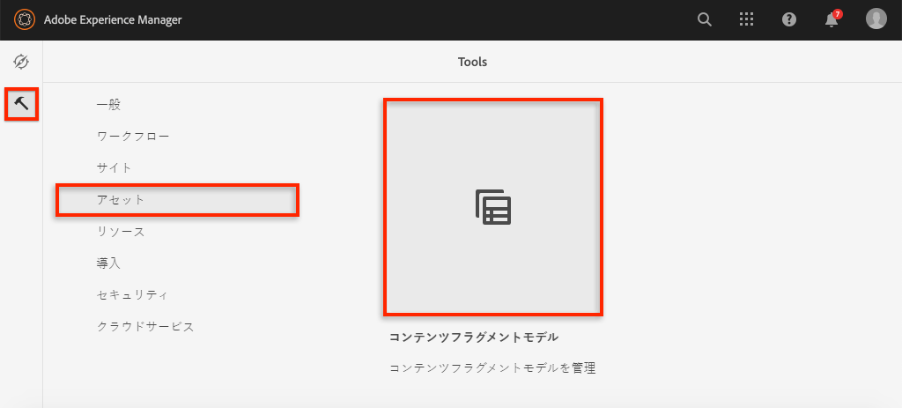
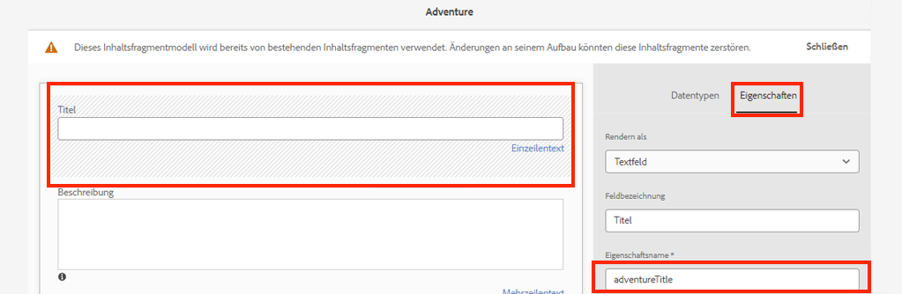
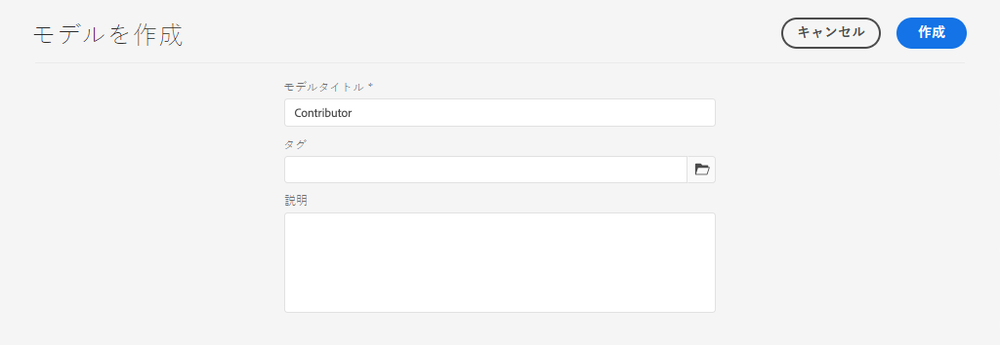
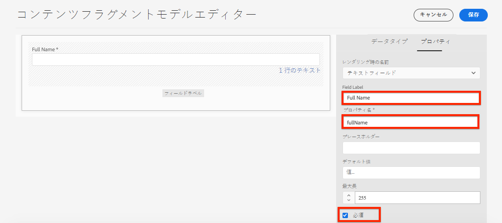
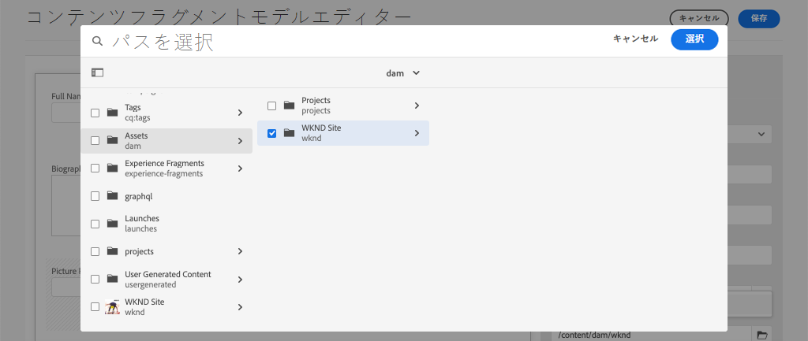
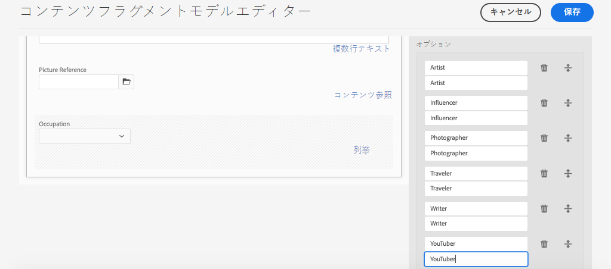
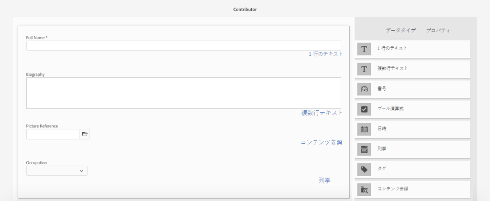
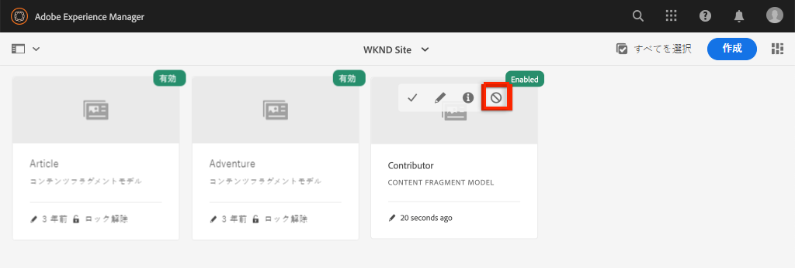

# コンテンツフラグメントモデルの定義{#content-fragment-models}

この章では、コンテンツのモデル化と、**コンテンツフラグメントモデル**&#x200B;を使用したスキーマの構築の方法について説明します。 既存のモデルを確認し、新しいモデルを作成します。 また、モデルの一部としてスキーマを定義するために使用できる様々なデータ型についても学習します。

この章では、**Contributor**&#x200B;の新しいモデルを作成します。これは、WKNDブランドの一部として雑誌とアドベンチャーコンテンツを作成するユーザー向けのデータモデルです。

## 前提条件 {#prerequisites}

これは複数のパートから成るチュートリアルで、[クイックセットアップ](./setup.md)で説明されている手順が完了していることを前提としています。

## 目的 {#objectives}

* 新しいコンテンツフラグメントモデルを作成します。
* モデルの構築に使用できるデータタイプと検証オプションを特定します。
* コンテンツフラグメントモデルが、データスキーマとコンテンツフラグメントのオーサリングテンプレートの&#x200B;**両方を定義する方法を理解します。**

## コンテンツフラグメントモデルの概要 {#overview}

>[!VIDEO](https://video.tv.adobe.com/v/22452/?quality=12&learn=on)

上記のビデオでは、コンテンツフラグメントモデルの操作に関する概要を説明します。

>[!CAUTION]
>
> 上記のビデオでは、`Contributors`という名前の&#x200B;**コントリビューター**&#x200B;モデルの作成を示しています。 独自の環境で手順を実行する場合は、タイトルに単一の形式を使用する必要があります。`Contributor`（**s**&#x200B;を除く） コンテンツフラグメントモデルの命名は、このチュートリアルで後で実行するGraphQL API呼び出しを駆動します。

## Inspect the Adventure Content Fragment Model

前の章では、いくつかのAdventuresコンテンツフラグメントを編集し、外部アプリケーションに表示しました。 アドベンチャーコンテンツフラグメントモデルを調べて、これらのフラグメントの基礎となるデータスキーマを理解しましょう。

1. **AEM Start**&#x200B;メニューから、**ツール** / **アセット** / **コンテンツフラグメントモデル**&#x200B;に移動します。

   

1. **WKND Site**&#x200B;フォルダーに移動し、**アドベンチャー**&#x200B;コンテンツフラグメントモデルの上にマウスポインターを置いて、**編集**&#x200B;アイコン（鉛筆）をクリックしてモデルを開きます。

   

1. **コンテンツフラグメントモデルエディター**&#x200B;が開きます。 アドベンチャーモデルを定義するフィールドに、**1行のテキスト**、**複数行のテキスト**、**列挙**、**コンテンツ参照**&#x200B;など、異なる&#x200B;**データ型**&#x200B;が含まれることを確認します。

1. エディターの右側の列に、コンテンツフラグメントのオーサリングに使用されるフォームフィールドを定義する、使用可能な&#x200B;**データタイプ**&#x200B;が表示されます。

1. メインパネルで「**タイトル**」フィールドを選択します。 右側の列で、「**プロパティ**」タブをクリックします。

   

   **「プロパティ名**」フィールドが`adventureTitle`に設定されていることを確認します。 これは、AEMに永続化されるプロパティの名前を定義します。 **プロパティ名**&#x200B;では、このプロパティの&#x200B;**キー**&#x200B;名もデータスキーマの一部として定義します。 この&#x200B;**キー**&#x200B;は、コンテンツフラグメントデータがGraphQL APIを介して公開される際に使用されます。

   >[!CAUTION]
   >
   > ****&#x200B;コンテンツフラグメントがモデルから派生された後に、フィールド&#x200B;**プロパティ名**&#x200B;を変更すると、ダウンストリームの影響を受けます。 既存のフラグメントのフィールド値は参照されなくなり、GraphQLで公開されるデータスキーマが変更され、既存のアプリケーションに影響が及びます。

1. 「**プロパティ**」タブで下にスクロールし、「**検証の種類**」ドロップダウンを表示します。

   

   **電子メール**&#x200B;と&#x200B;**URL**&#x200B;に対して、すぐに使用できるフォーム検証を使用できます。 正規表現を使用して、**カスタム**&#x200B;検証を定義することもできます。

1. 「**キャンセル**」をクリックして、コンテンツフラグメントモデルエディターを閉じます。

## 寄稿者モデルの作成

次に、**Contributor**&#x200B;の新しいモデルを作成します。これは、WKNDブランドの一部として雑誌とアドベンチャーコンテンツを作成するユーザー向けのデータモデルです。

1. 右上隅の「**作成**」をクリックして、「**モデルを作成**」ウィザードを表示します。
1. **モデルタイトル**&#x200B;に次のように入力します。**Contributor**&#x200B;をクリックし、「**作成**」をクリックします。

   

   **開く**&#x200B;をクリックして、新しく作成したモデルを開きます。

1. **1行のテキスト**&#x200B;要素をメインパネルにドラッグ&amp;ドロップします。 「**プロパティ**」タブで次のプロパティを入力します。

   * **フィールドラベル**: **姓名**
   * **プロパティ名**: `fullName`
   * **必須**&#x200B;を確認

   

1. 「**データタイプ**」タブをクリックし、「**姓**」フィールドの下にある「**複数行テキスト**」フィールドをドラッグ&amp;ドロップします。 次のプロパティを入力します。

   * **フィールドラベル**: **伝記**
   * **プロパティ名**: `biographyText`
   * **デフォルトのタイプ**: **リッチテキスト**

1. 「**データタイプ**」タブをクリックし、「**コンテンツ参照**」フィールドをドラッグ&amp;ドロップします。 次のプロパティを入力します。

   * **フィールドラベル**: **画像参照**
   * **プロパティ名**: `pictureReference`
   * **ルートパス**: `/content/dam/wknd`

   **ルートパス**&#x200B;を設定する際に、**フォルダー**&#x200B;アイコンをクリックすると、モーダルを表示してパスを選択できます。 これにより、作成者がパスを入力する際に使用できるフォルダーが制限されます。

   

1. **画像**&#x200B;のコンテンツタイプのみを使用してフィールドに値を入力できるように、**画像参照**&#x200B;に検証機能を追加します。

   

1. 「**データタイプ**」タブをクリックし、「**画像の参照**」フィールドの下にある「**列挙**」データタイプをドラッグ&amp;ドロップします。 次のプロパティを入力します。

   * **フィールドラベル**: **職業**
   * **プロパティ名**: `occupation`

1. **オプションを追加**&#x200B;ボタンを使用して、複数の&#x200B;**オプション**&#x200B;を追加します。 **オプションラベル**&#x200B;と&#x200B;**オプション値**&#x200B;に同じ値を使用します。

   **Artist**、 **Influencer**、 **Photographer**、 **Traveler**、 **Writer**、 **YouTuber**

   

1. 最終的な&#x200B;**Contributor**&#x200B;モデルは次のようになります。

   

1. 「**保存**」をクリックして、変更を保存します。

## 寄稿者モデルを有効にする

コンテンツフラグメントモデルをコンテンツ作成者が使用するには、そのモデルを&#x200B;**有効**&#x200B;にする必要があります。 コンテンツフラグメントモデルを&#x200B;**無効**&#x200B;にすると、作成者が使用できなくなります。 モデルのフィールドの&#x200B;**プロパティ名**&#x200B;を変更すると、基になるデータスキーマが変更され、既存のフラグメントや外部アプリケーションに大きなダウンストリーム効果が生じる場合があります。 ユーザーに対してコンテンツフラグメントモデルを有効にする前に、フィールドの&#x200B;**プロパティ名**&#x200B;で使用する命名規則を慎重に計画することをお勧めします。

1. **コントリビューター**&#x200B;モデルが現在&#x200B;**有効**&#x200B;状態であることを確認します。

   

   カードの上にマウスポインターを置いて、**無効にする** / **有効にする**&#x200B;アイコンをクリックすると、コンテンツフラグメントモデルの状態を切り替えることができます。

## バリデーターが {#congratulations}

これで、最初のコンテンツフラグメントモデルが作成されました。

## 次の手順 {#next-steps}

次の章[コンテンツフラグメントモデルのオーサリング](author-content-fragments.md)では、コンテンツフラグメントモデルに基づいて新しいコンテンツフラグメントを作成し、編集します。 また、コンテンツフラグメントのバリエーションを作成する方法についても説明します。