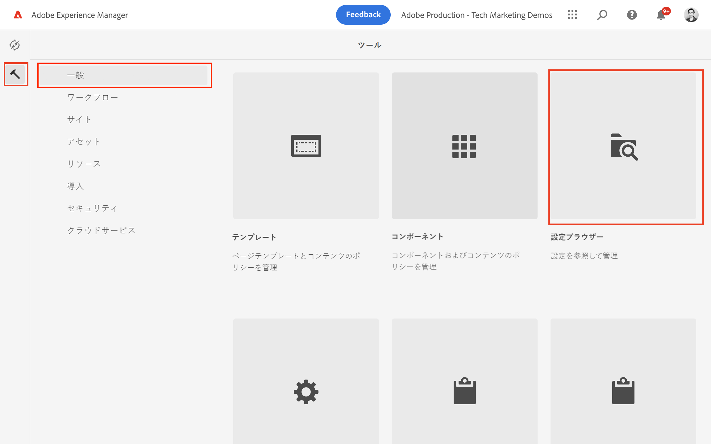
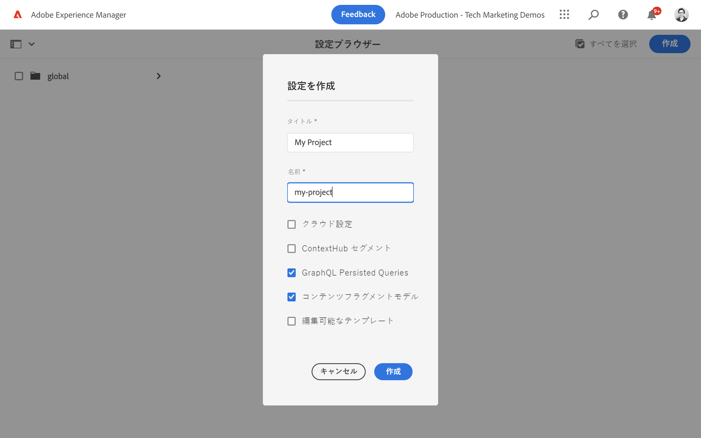
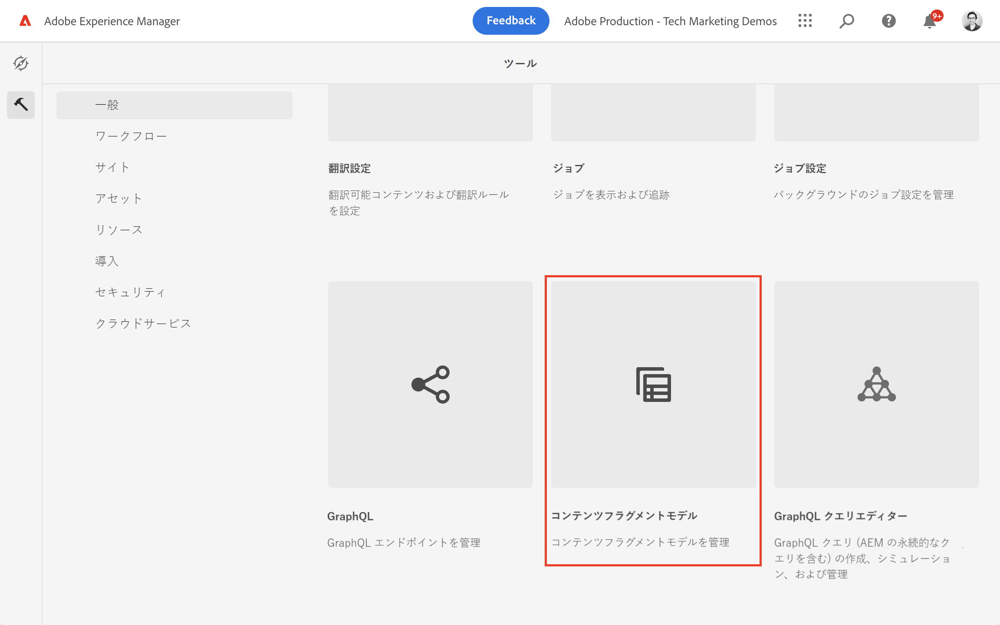
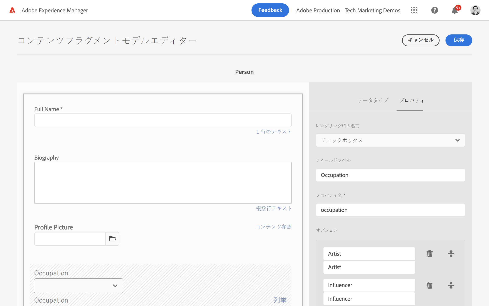
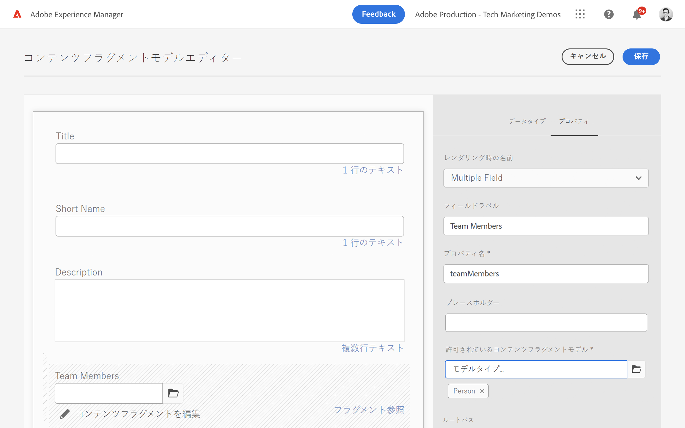
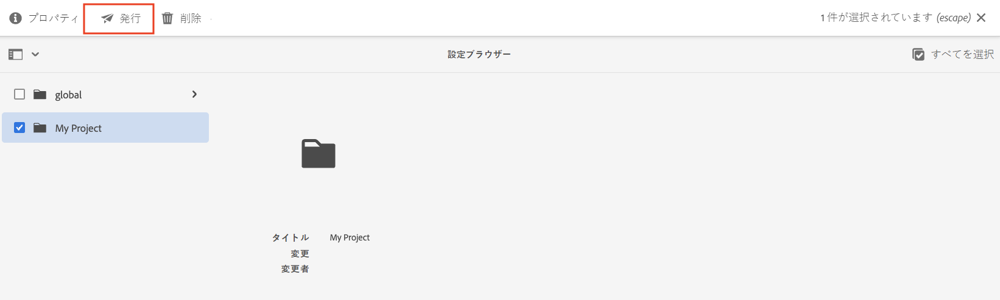
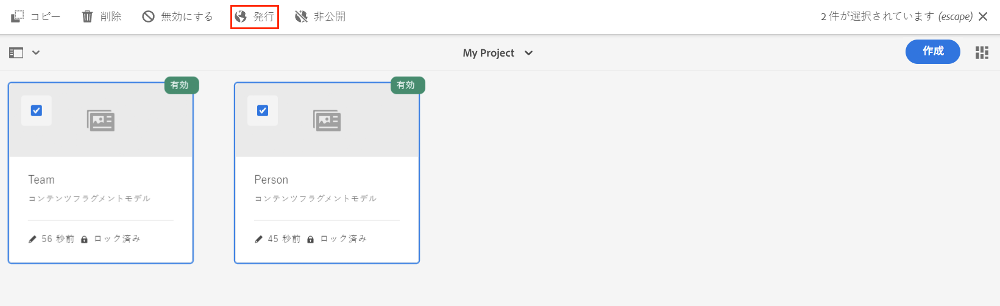

# コンテンツフラグメントモデルの定義 {#content-fragment-models}

この章では、**コンテンツフラグメントモデル**&#x200B;を使用してコンテンツをモデル化し、スキーマを構築する方法について説明します。また、モデルの一部としてスキーマの定義に使用できる様々なデータタイプについて説明します。

**チーム**&#x200B;と&#x200B;**人物**&#x200B;という 2 つのシンプルなモデルを作成します。**チーム**&#x200B;データモデルには、名前、短い名前、説明が付けられており、姓名、プロフィールの詳細、プロファイルの画像、職業のリストを含む&#x200B;**人物**&#x200B;データモデルを参照します。

また、基本的な手順に従って独自のモデルを作成し、GraphQL クエリや React App コードなどの各手順を微調整するか、これらの章で説明されている手順に従うこともできます。

## 前提条件 {#prerequisites}

これは複数のパートから成るチュートリアルで、[AEM オーサー環境が使用可能である](./overview.md#prerequisites)ことを前提としています。

## 目的 {#objectives}

* コンテンツフラグメントモデルを作成します。
* モデルの構築に使用できるデータタイプと検証オプションを特定します。
* コンテンツフラグメントモデルが、コンテンツフラグメントのデータスキーマとオーサリングテンプレートの&#x200B;**両方**&#x200B;を定義する方法を理解します。

## プロジェクト設定の作成

プロジェクト設定には、特定のプロジェクトに関連付けられたすべてのコンテンツフラグメントモデルが含まれており、モデルを整理する手段を提供します。コンテンツフラグメントモデルを作成する&#x200B;**前**&#x200B;に、少なくとも 1 つのプロジェクトを作成する必要があります。

1. AEM **オーサー**&#x200B;環境にログインします（例：`https://author-pYYYY-eXXXX.adobeaemcloud.com/`）。
1. AEM 開始画面から、**ツール**／**一般**／**設定ブラウザー**&#x200B;に移動します。

   
1. 右上隅にある「**作成**」をクリックします。
1. 表示されたダイアログで、次のように入力します。

   * タイトル*：**マイプロジェクト**
   * 名前*：**my-project**（単語を区切る場合にはハイフンを使用し、小文字のみを使用します。この文字列は、クライアントアプリケーションがリクエストを実行する一意の GraphQL エンドポイントに影響を与えます。）
   * **コンテンツフラグメントモデル**&#x200B;にチェックを入れます
   * **GraphQL 永続クエリ**&#x200B;にチェックを入れます

   

## コンテンツフラグメントモデルを作成する

次に、**チーム**&#x200B;と&#x200B;**人物**&#x200B;の 2 つのモデルを作成します。

### 人物モデルの作成

**人物**&#x200B;モデルを作成します。これは、チームの一員である個人を表すデータモデルです。

1. AEM 開始画面から、**ツール**／**一般**／**コンテンツフラグメントモデル**&#x200B;に移動します。

   

1. **マイプロジェクト**&#x200B;フォルダーに移動します。
1. 右上隅にある「**作成**」をクリックして、**モデルを作成**&#x200B;ウィザードを表示します。
1. **モデルタイトル**&#x200B;フィールドに「**人物**」と入力し、「**作成**」をクリックします。表示されたダイアログで、「**開く**」をクリックしてモデルを作成します。

1. **1 行のテキスト**&#x200B;要素をメインパネルにドラッグ＆ドロップします。「**プロパティ**」タブで次のプロパティを入力します。

   * **フィールドラベル**：**フルネーム**
   * **プロパティ名**：`fullName`
   * 「**必須**」にチェックを入れます

   

   **プロパティ名**&#x200B;は、AEM に永続化されるプロパティの名前を定義します。**プロパティ名**&#x200B;は、データスキーマの一部としてこのプロパティの&#x200B;**キー**&#x200B;名も定義します。この&#x200B;**キー**&#x200B;は、GRAPHQL API を介してコンテンツフラグメントデータを公開する際に使用されます。

1. 「**データタイプ**」タブをクリックし、「**フルネーム**」フィールドの下にある「**複数行テキスト**」フィールドをドラッグ＆ドロップします。次のプロパティを入力します。

   * **フィールドラベル**：**略歴**
   * **プロパティ名**：`biographyText`
   * **デフォルトのタイプ**：**リッチテキスト**

1. 「**データタイプ**」タブをクリックして、「**コンテンツ参照**」フィールドをドラッグ＆ドロップ します。次のプロパティを入力します。

   * **フィールドラベル**：**プロファイル画像**
   * **プロパティ名**：`profilePicture`
   * **ルートパス**：`/content/dam`

   **ルートパス**&#x200B;を設定する際に、**フォルダー**&#x200B;アイコンをクリックしてモーダルを表示し、パスを選択できます。 これにより、作成者がパスへの入力に使用できるフォルダーが制限されます。 `/content/dam` は、すべての AEM Assets（画像、ビデオ、その他のコンテンツフラグメント）が保存されるルートです。

1. **画像参照**&#x200B;に検証を追加して、**画像**&#x200B;コンテンツタイプのみをフィールドの入力に使用できるようにします。

   

1. 「**データタイプ**」タブをクリックし、**定義済みリスト** データタイプを「**画像参照**」フィールドの下にドラッグ＆ドロップします。次のプロパティを入力します。

   * **レンダリング形式**：**チェックボックス**
   * **フィールドラベル**：**職業**
   * **プロパティ名**：`occupation`

1. 「**オプションを追加**」ボタンを使用して、いくつかの&#x200B;**オプション**&#x200B;を追加します。同じ値を「**オプションラベル**」および「**オプション値**」で使用します。

   **アーティスト**、**インフルエンサー**、**写真家**、**旅行者**、**ライター**、**YouTuber**

1. 最終的な&#x200B;**人物**&#x200B;モデルは次のようになります。

   

1. 「**保存**」をクリックして、変更を保存します。

### チームモデルを作成する

**チーム**&#x200B;のモデルを作成します。これは、人物のチームのデータモデルです。チームモデルは、チームのメンバーを表す人物モデルを参照します。

1. **マイプロジェクト**&#x200B;フォルダーで、右上隅にある「**作成**」をタップすると、**モデルを作成l**&#x200B;ウィザードが表示されます。
1. 「**モデルタイトル**」フィールドに「**チーム**」と入力して、「**作成**」をタップします。

   表示されたダイアログで「 **開く**」をタップして、新しく作成したモデルを開きます。

1. **1 行テキスト**&#x200B;要素をメインパネルにドラッグ＆ドロップします。 次のプロパティを「**プロパティ**」タブに入力します。

   * **フィールドラベル**：**タイトル**
   * **プロパティ名**：`title`
   * 「 **必須**」にチェックを入れます。

1. 「**データタイプ**」タブをタップし、**1 行テキスト**&#x200B;要素をメインパネルにドラッグ＆ドロップします。次のプロパティを「**プロパティ**」タブに入力します。

   * **フィールドラベル**：**短縮名**
   * **プロパティ名**：`shortName`
   * 「**必須**」にチェックを入れます。
   * 「**一意**」にチェックを入れます。
   * **検証タイプ**&#x200B;の下で、「**カスタム**」を選択します。
   * **カスタム検証正規表現**&#x200B;の下で、`^[a-z0-9\-_]{5,40}$` を入力します。これにより、5～40 文字の小文字の英数字とダッシュのみを入力できるようになります。

   `shortName` プロパティを使用すると、短縮パスに基づいて個々のチームに対してクエリを実行できます。 **一意**&#x200B;設定により、このモデルのコンテンツフラグメントごとに常に一意の値が設定されます。

1.  「**データタイプ**」タブをタップし、「**複数行テキスト**」フィールドを「**短縮名**」フィールドの下にドラッグ＆ドロップします。次のプロパティを入力します。

   * **フィールドラベル**：**説明**
   * **プロパティ名**：`description`
   * **デフォルトのタイプ**：**リッチテキスト**

1.  「**データタイプ**」タブをタップし、「**フラグメント参照**」フィールドをドラッグ＆ドロップします。次のプロパティを入力します。

   * **レンダリング形式**：**複数のフィールド**
   * **フィールドラベル**：**チームメンバー**
   * **プロパティ名**：`teamMembers`
   * **許可されているコンテンツフラグメントモデル**：フォルダーアイコンを使用して、**人物**&#x200B;モデルを選択します。

1. 最終&#x200B;**チーム**&#x200B;モデルは次のようになります。

   

1. 「**保存**」をクリックして、変更を保存します。

1. これで、2 つのモデルを使用できるようになります。

   

## プロジェクト設定およびコンテンツフラグメントモデルを公開

レビューと検証で `Project Configuration` と `Content Fragment Model` を公開します

1. AEM 開始画面から、**ツール**／**一般**／**設定ブラウザー**&#x200B;に移動します。

1. **マイプロジェクト**&#x200B;の横にあるチェックボックスをタップし、「**公開**」をタップします。

   

1. AEM 開始画面から、**ツール**／**一般**／**コンテンツフラグメントモデル**&#x200B;に移動します。

1. **マイプロジェクト**&#x200B;フォルダーに移動します。

1. **人物**&#x200B;と&#x200B;**チーム**&#x200B;のモデルをタップして、「**公開**」をタップします。

   

## これで完了です。 {#congratulations}

これで、最初のコンテンツフラグメントモデルが作成されました。

## 次の手順 {#next-steps}

次の章、[コンテンツフラグメントモデルのオーサリング](author-content-fragments.md)では、コンテンツフラグメントモデルに基づいて新しいコンテンツフラグメントを作成し、編集します。また、コンテンツフラグメントのバリエーションを作成する方法についても説明します。

## 関連ドキュメント

* [コンテンツフラグメントモデル](https://experienceleague.adobe.com/docs/experience-manager-cloud-service/content/assets/content-fragments/content-fragments-models.html?lang=ja)

