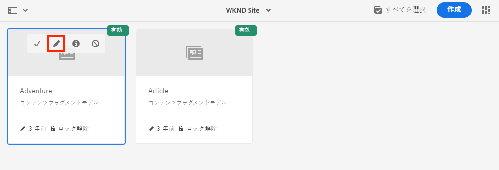

# コンテンツフラグメントモデルの定義 {#content-fragment-models}

この章では、コンテンツのモデル化と、 **コンテンツフラグメントモデル**. 既存のモデルを確認し、新しいモデルを作成します。 また、モデルの一部としてスキーマを定義するために使用できる様々なデータタイプについても学習します。

この章では、 **寄稿者**:WKND ブランドの一部として雑誌とアドベンチャーコンテンツを作成するユーザー向けのデータモデルです。

## 前提条件 {#prerequisites}

これは複数のパートから成るチュートリアルで、 [クイックセットアップ](../quick-setup/local-sdk.md) が完了しました。

## 目的 {#objectives}

* 新しいコンテンツフラグメントモデルを作成します。
* モデル構築に使用可能なデータタイプと検証オプションを特定します。
* コンテンツフラグメントモデルが定義する方法を理解する **両方** コンテンツフラグメントのデータスキーマとオーサリングテンプレート

## コンテンツフラグメントモデルの概要 {#overview}

>[!VIDEO](https://video.tv.adobe.com/v/22452/?quality=12&learn=on)

上記のビデオでは、コンテンツフラグメントモデルの操作の概要を説明します。

>[!CAUTION]
>
> 上記のビデオでは、 **寄稿者** 名前のモデル `Contributors`. 独自の環境で手順を実行する場合、タイトルに単数形式が使用されていることを確認します。 `Contributor` 無しに **s**. コンテンツフラグメントモデルの命名は、チュートリアルの後半で実行する GraphQL API 呼び出しを駆動します。

## Inspect Adventure コンテンツフラグメントモデル

前の章では、いくつかの Adventures コンテンツフラグメントを編集し、外部アプリケーションに表示しました。 アドベンチャーコンテンツフラグメントモデルを調べて、これらのフラグメントの基になるデータスキーマを理解しましょう。

1. 次の **AEM Start** メニュー移動先 **ツール** > **Assets** > **コンテンツフラグメントモデル**.

   

1. 次に移動： **WKND サイト** フォルダーに移動し、 **冒険** コンテンツフラグメントモデルを編集し、 **編集** アイコン（鉛筆）を使用して、モデルを開きます。

   

1. これにより、 **コンテンツフラグメントモデルエディター**. アドベンチャーモデルを定義するフィールドに、異なる **データタイプ** いいね！ **1 行のテキスト**, **複数行テキスト**, **列挙**、および **コンテンツ参照**.

1. エディターの右側の列に、使用可能な **データタイプ** コンテンツフラグメントのオーサリングに使用するフォームフィールドを定義する

1. を選択します。 **タイトル** フィールドを使用して、メインパネルに表示できます。 右側の列で、 **プロパティ** タブ：

   

   以下を確認します。 **プロパティ名** フィールドが `adventureTitle`. これは、AEMに永続化されるプロパティの名前を定義します。 この **プロパティ名** は、 **key** このプロパティの名前をデータスキーマの一部として指定します。 この **key** は、コンテンツフラグメントデータが GraphQL API を介して公開される際に使用されます。

   >[!CAUTION]
   >
   > の変更 **プロパティ名** フィールドの **後** コンテンツフラグメントはモデルから派生し、ダウンストリーム効果を持ちます。 既存のフラグメントのフィールド値は参照されなくなり、GraphQL によって公開されるデータスキーマが変更され、既存のアプリケーションに影響を与えます。

1. 内で下にスクロールします。 **プロパティ** タブに移動し、 **検証タイプ** ドロップダウン。

   

   では、標準でフォーム検証を使用できます。 **電子メール** および **URL**. また、 **カスタム** 正規表現を使用した検証。

1. クリック **キャンセル** をクリックして、コンテンツフラグメントモデルエディターを閉じます。

## 貢献者モデルを作成する

次に、 **寄稿者**:WKND ブランドの一部として雑誌とアドベンチャーコンテンツを作成するユーザー向けのデータモデルです。

1. クリック **作成** 右上隅で **モデルを作成** ウィザード。
1. の場合 **モデルタイトル** 入力： **寄稿者** をクリックし、 **作成**

   

   クリック **開く** をクリックして、新しく作成したモデルを開きます。

1. ドラッグ&amp;ドロップ **1 行のテキスト** 要素をメインパネルに追加します。 次のプロパティを **プロパティ** タブ：

   * **フィールドラベル**: **氏名**
   * **プロパティ名**: `fullName`
   * チェック **必須**

   

1. 次をクリック： **データタイプ** タブを押しながらドラッグ&amp;ドロップ **複数行テキスト** の下の野原 **氏名** フィールドに入力します。 次のプロパティを入力します。

   * **フィールドラベル**: **伝記**
   * **プロパティ名**: `biographyText`
   * **デフォルトのタイプ**: **リッチテキスト**

1. 次をクリック： **データタイプ** タブを押しながらドラッグ&amp;ドロップ **コンテンツ参照** フィールドに入力します。 次のプロパティを入力します。

   * **フィールドラベル**: **画像参照**
   * **プロパティ名**: `pictureReference`
   * **ルートパス**: `/content/dam/wknd`

   を設定する際に **ルートパス** 次の項目をクリックします。 **フォルダー** アイコンをクリックしてモーダルを表示し、パスを選択します。 これにより、作成者がパスに入力する際に使用できるフォルダーが制限されます。

   

1. に検証機能を追加する **画像参照** そのため、次のタイプのコンテンツのみが **画像** を使用して、フィールドに値を入力できます。

   

1. 次をクリック： **データタイプ** タブを押しながらドラッグ&amp;ドロップ **列挙**  の下のデータ型 **画像参照** フィールドに入力します。 次のプロパティを入力します。

   * **フィールドラベル**: **職業**
   * **プロパティ名**: `occupation`

1. 複数追加 **オプション** の使用 **オプションを追加** 」ボタンをクリックします。 同じ値を **オプションラベル** および **オプションの値**:

   **アーティスト**, **影響者**, **写真家**, **旅行者**, **ライター**, **YouTuber**

   

1. 最終 **寄稿者** モデルは次のようになります。

   

1. 「**保存**」をクリックして、変更を保存します。

## 寄稿者モデルの有効化

コンテンツフラグメントモデルは、 **有効** コンテンツ作成者が使用できるようにする前に 次のことが可能です。 **無効にする** コンテンツフラグメントモデルを作成する場合は、コンテンツフラグメントモデルを使用できません。 を変更したことを思い出してください **プロパティ名** モデル内のフィールドのが基になるデータスキーマを変更し、既存のフラグメントや外部アプリケーションに大きなダウンストリーム効果を与える可能性があります。 使用する命名規則は慎重に計画することをお勧めします。 **プロパティ名** 」フィールドの値を増やしてから、ユーザーに対してコンテンツフラグメントモデルを有効にする必要があります。

1. 次を確認します。 **寄稿者** モデルは現在 **有効** 状態。

   

   カードの上にマウスポインターを置いて **無効にする** / **有効にする** アイコン

## おめでとうございます。 {#congratulations}

おめでとうございます。最初のコンテンツフラグメントモデルが作成されました。

## 次の手順 {#next-steps}

次の章では、 [コンテンツフラグメントモデルのオーサリング](author-content-fragments.md)コンテンツフラグメントモデルに基づいて、新しいコンテンツフラグメントを作成し、編集します。 また、コンテンツフラグメントのバリエーションを作成する方法についても説明します。
